# IAM Roles Anywhere: From Fundamentals to Implementation

This guide assumes no prior knowledge. Each section builds only on concepts defined before it.

**Reading order:** Part 1 covers AWS credential fundamentals, Part 2 covers cryptography fundamentals, Part 3 the problem, Part 4 the components, Part 5 the end-to-end flow, Part 6 the client side, Part 7 principal tags, Part 8 session policies, Part 9 a full worked example, and Part 10 caveats.

---

## Part 1: AWS credential fundamentals

### 1.1 Every AWS API call is a signed HTTP request

When the CLI or an SDK runs `aws s3 ls`, it sends an HTTPS request to an AWS endpoint. AWS does not accept a request just because it arrived. The request must carry a **signature** proving that the sender holds a valid secret. This signing process is called **Signature Version 4 (SigV4)**.

To sign, the client needs **credentials**:

| Credential component | Purpose | Secret? |
|---|---|---|
| **Access Key ID** (`AKIA...` or `ASIA...`) | Identifies which credential is being used, like a username | No |
| **Secret Access Key** | Used to compute the signature. Never sent over the wire. | **Yes** |
| **Session Token** | Present only for *temporary* credentials. Sent with every request so AWS can validate the session. | Sensitive |

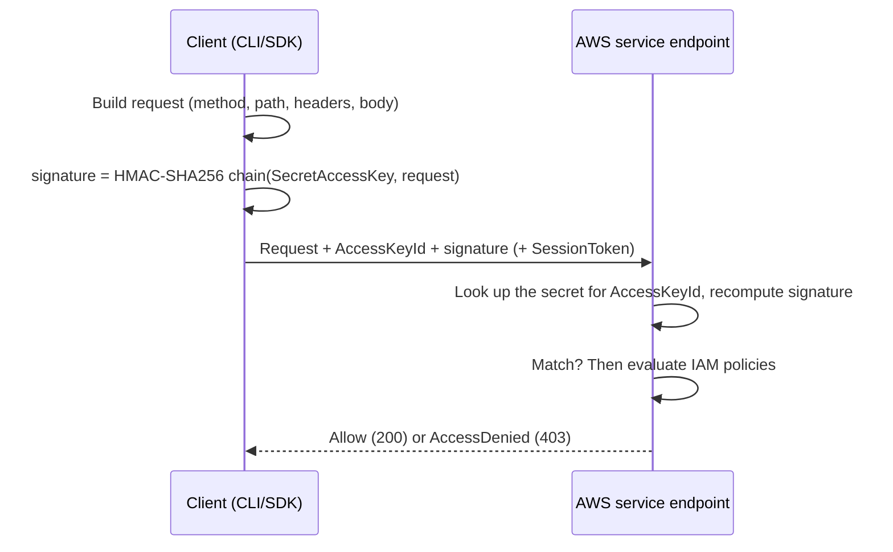

Regular SigV4 uses **symmetric** cryptography (HMAC): the client and AWS both know the secret key. Keep that in mind, because Roles Anywhere uses a different, asymmetric approach for its first step.

### 1.2 Long-term vs temporary credentials

| | Long-term (IAM user access key) | Temporary (STS session) |
|---|---|---|
| Prefix | `AKIA...` | `ASIA...` |
| Expires | Never, until someone deletes or rotates it | Yes: minutes to hours |
| Session token | No | Yes |
| Issued by | IAM | **STS (Security Token Service)** |

### 1.3 IAM principal, IAM role, and STS

- An **IAM principal** is an entity that can make a request: an IAM user, an assumed-role session, a federated user, or an AWS service.
- An **IAM role** is an identity with permissions but **no credentials of its own**. You cannot log in as a role. Instead, a trusted party **assumes** it and receives temporary credentials for a session.
- **STS** is the service that issues those temporary credentials, through calls such as `AssumeRole`, `AssumeRoleWithWebIdentity`, and `AssumeRoleWithSAML`.
- An **assumed-role session** is the principal that exists after assumption: `arn:aws:sts::ACCOUNT:assumed-role/ROLE_NAME/SESSION_NAME`.

### 1.4 A role has two different kinds of policy

This distinction is essential for everything that follows.

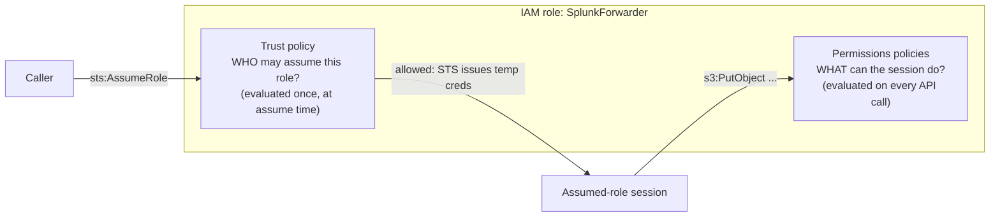

| Policy | Question it answers | When it's evaluated | `Principal` element |
|---|---|---|---|
| **Trust policy** (resource policy on the role) | Who can become this role? | At assume time | Yes |
| **Permissions / identity policy** | What can the role session do? | On every API request | No |

### 1.5 The SDK credential provider chain

SDKs and the CLI search for credentials in a fixed order and use the first source that returns something. The simplified order is:

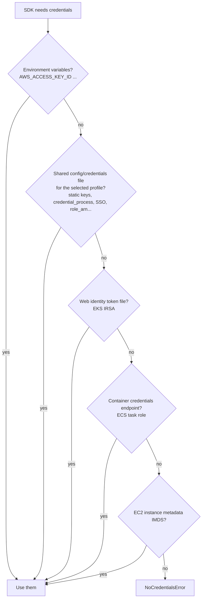

Inside AWS, the last three sources hand out temporary credentials automatically. **Outside AWS, none of them exist.** That gap is the core problem Roles Anywhere solves. The shared config file option, specifically `credential_process`, is how Roles Anywhere plugs into this chain (see Part 6).

---

## Part 2: Cryptography fundamentals

### 2.1 Hash function

A **hash function** (for example SHA-256) maps any input to a fixed-size digest. It has three important properties:
- It is deterministic: the same input always produces the same digest.
- It is one-way: you cannot recover the input from the digest.
- A change of even one bit produces a completely different digest.

Signing algorithms sign the hash of data, not the data itself.

### 2.2 Asymmetric key pair

An **asymmetric key pair** is two mathematically linked keys:

| Key | Who has it | Used to |
|---|---|---|
| **Private key** | Only the owner; it must never leave the host (ideally inside a TPM or HSM) | **Create** signatures |
| **Public key** | Anyone | **Verify** signatures made by the matching private key |

The common algorithms are RSA and ECDSA (elliptic curve).

### 2.3 Digital signature

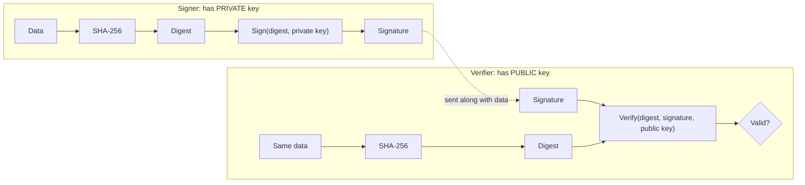

A valid signature proves two things:
1. **Authenticity:** it was produced by whoever holds the private key.
2. **Integrity:** the data wasn't altered after it was signed.

### 2.4 The trust gap: whose public key is this?

A signature verifies against a public key, but a public key by itself says nothing about **who** owns it. An attacker could generate their own key pair and claim to be `fwd-01.corp.example`. Something must bind a public key to an identity. That binding is a **certificate**.

### 2.5 X.509 certificate

An **X.509 certificate** is a signed document stating that this public key belongs to this identity, for this time period. Its main fields are:

| Field | Example | Meaning |
|---|---|---|
| Subject DN | `CN=fwd-01, OU=splunk-forwarders, O=ExampleOrg, C=US` | Who the certificate identifies |
| Subject Alternative Name (SAN) | `DNS:fwd-01.logging.example.mil`, `URI:spiffe://...` | Additional identities, the modern replacement for CN |
| Issuer DN | `CN=ExampleOrg Issuing CA 02, O=ExampleOrg` | Who signed the certificate |
| Serial number | `0x3A9F...` | Unique per issuer, used for revocation |
| Validity | NotBefore / NotAfter | The lifetime |
| Subject public key | RSA-2048 or EC P-256 | The key being vouched for |
| Extensions | `basicConstraints CA:FALSE`, `keyUsage digitalSignature` | What the key may be used for |
| **Signature** | Bytes | The **issuer's** signature over all the fields above |

**The certificate is public.** Possessing a certificate proves nothing by itself. Proving identity requires the matching private key.

### 2.6 Certificate authority (CA) and issuance

A **certificate authority (CA)** is an entity whose job is signing certificates. The workload generates its own key pair. The CA never needs, and should never see, the workload's private key.

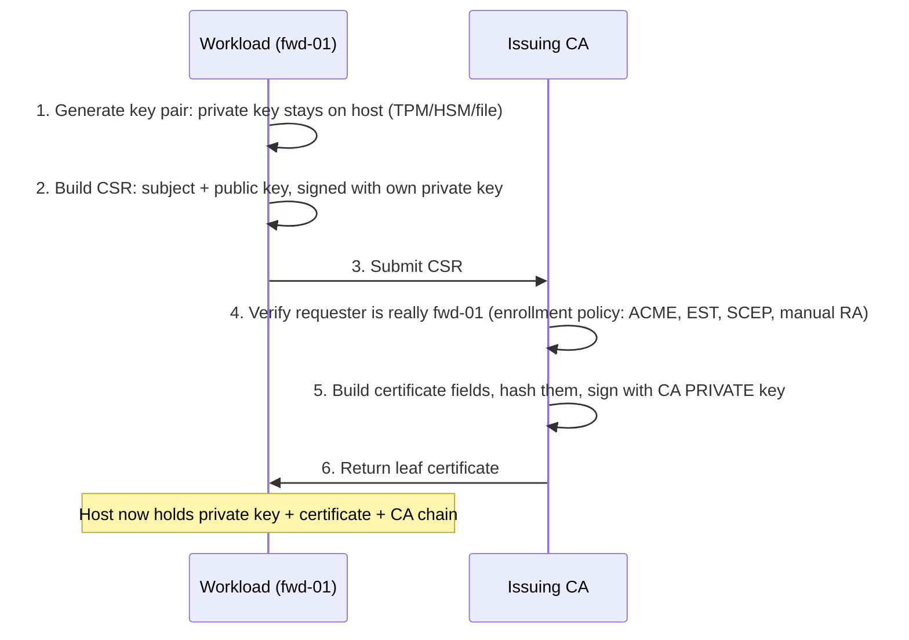

A **CSR (certificate signing request)** is the workload's request to the CA. Signing the CSR with its own private key proves the workload holds that key.

Correcting a common misconception: the CA doesn't generate the workload's key. The CA **signs a certificate that binds the workload's public key to its identity**.

### 2.7 Certificate chain and trust anchor

CAs are hierarchical. The root CA is kept offline and signs intermediate CAs; intermediates sign leaf certificates.

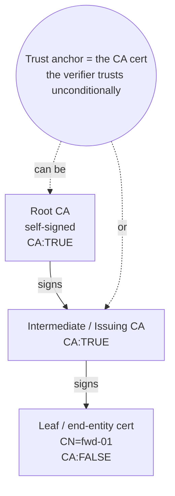

- **Chain validation** walks upward from the leaf. The verifier checks the leaf's signature with the intermediate's public key, then the intermediate's signature with the root's public key, stopping when it reaches a certificate it already trusts.
- A **trust anchor** is the certificate at which validation stops, because it is trusted by configuration rather than by being signed by something else.
- **Anchor choice defines scope.** Everything the anchor can sign, directly or through intermediates, passes chain validation. Anchoring on a dedicated issuing CA used only for workload identity is far narrower than anchoring on an enterprise or DoD root.

### 2.8 Revocation (CRL)

A certificate that's compromised before its expiry must be revoked. A **Certificate Revocation List (CRL)** is a list of revoked serial numbers, signed by the CA. Roles Anywhere checks only **CRLs you import into it**. It does not fetch CRLs or use OCSP on its own.

### 2.9 Two separate proofs

Every Roles Anywhere authentication requires two independent proofs:

| Proof | Question | Verified with |
|---|---|---|
| **Proof 1: certificate validity** | Did a trusted CA vouch for this public key and identity? | The CA's public key, from the trust anchor |
| **Proof 2: possession** | Is the caller the actual holder of that key, not someone replaying a copied certificate? | The leaf certificate's public key, used to verify the signature on the request |

---

## Part 3: The problem Roles Anywhere solves

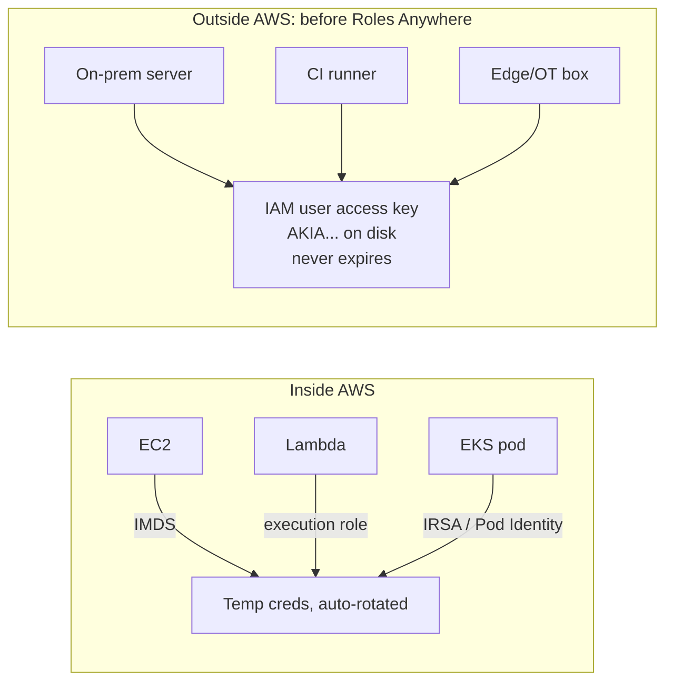

Long-term access keys on external hosts cause several problems:
- They never expire, so a stolen key works until someone notices.
- The secret is shared: AWS knows it too, and it can be copied anywhere with no way to tell the copies apart.
- Rotation is manual and often skipped.
- A key can't be bound to hardware.
- Attribution is weak, because many hosts often share one key.

**Roles Anywhere lets an external workload use its PKI identity (a certificate plus a private key) to obtain temporary STS credentials for an IAM role.**

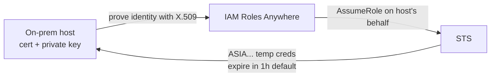

---

## Part 4: Roles Anywhere components

### 4.1 Component overview

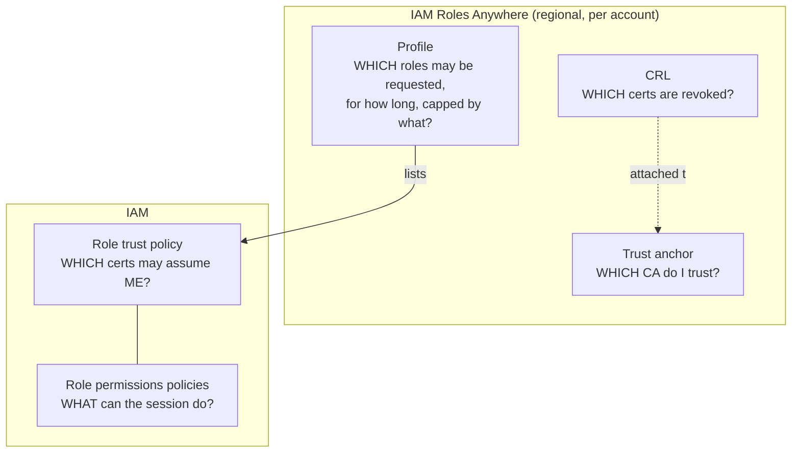

Four gates must all pass before credentials are issued: the trust anchor, the CRL check, the profile, and the role trust policy.

### 4.2 Trust anchor

- **Definition:** A Roles Anywhere resource holding a reference to a CA. It has one of two source types: `CERTIFICATE_BUNDLE`, where you upload an external CA certificate in PEM form, or `AWS_ACM_PCA`, which references an AWS Private CA ARN.
- **Role in authentication:** It performs proof 1. It answers whether the certificate chains to a CA this account trusts.
- **Scope:** Regional and per account.
- **State:** It can be enabled or disabled. Disabling it cuts off every certificate from that CA at once.

### 4.3 CRL

- **Definition:** A CRL you import with `ImportCrl` and associate with a trust anchor.
- **Role:** A certificate whose serial number is on an enabled CRL is rejected.
- **Operational note:** You own freshness. Automate re-import, for example with an EventBridge schedule, a Lambda that downloads the CRL from your CA's distribution point, and `UpdateCrl`.

### 4.4 Profile: what problem does it solve?

**Without profiles,** the only control between "the certificate chains to my CA" and "the host gets role credentials" would be each role's trust policy. That leaves several gaps:

| Gap without profiles | How the profile fills it |
|---|---|
| Nothing centrally lists which roles are reachable through Roles Anywhere. Any role in the account that trusts `rolesanywhere.amazonaws.com` could be targeted. | **An allow-list of role ARNs.** A `CreateSession` request for a role not listed in the named profile is rejected before STS is ever called. |
| No way to cap permissions for certificate-based access without editing the role, which may also be used by other callers | **Session policies.** An admin-defined ceiling applied to every session created through the profile (Part 8). |
| No central control of credential lifetime | **`durationSeconds`**: 900 to 43,200 seconds, defaulting to 3,600. |
| No kill switch for a population of workloads that doesn't also affect the CA | **Enable/disable at the profile level.** Disabling one profile cuts off that use case while other profiles on the same anchor keep working. |
| No control over session naming | **`acceptRoleSessionName`**. When set, the caller may supply a session name for CloudTrail attribution; when unset, the session name defaults to the certificate serial number. |
| No per-use-case mapping of certificate fields | **Attribute mapping**: which certificate fields become principal tags. This is a newer feature, so verify it's available in your GovCloud region. |

In short: the **trust anchor** answers who can authenticate, the **profile** answers what an authenticated caller may request and under which constraints, and the **role trust policy** answers which specific certificates this role accepts. The profile is the admin-controlled middle layer that separates PKI trust from role authorization.

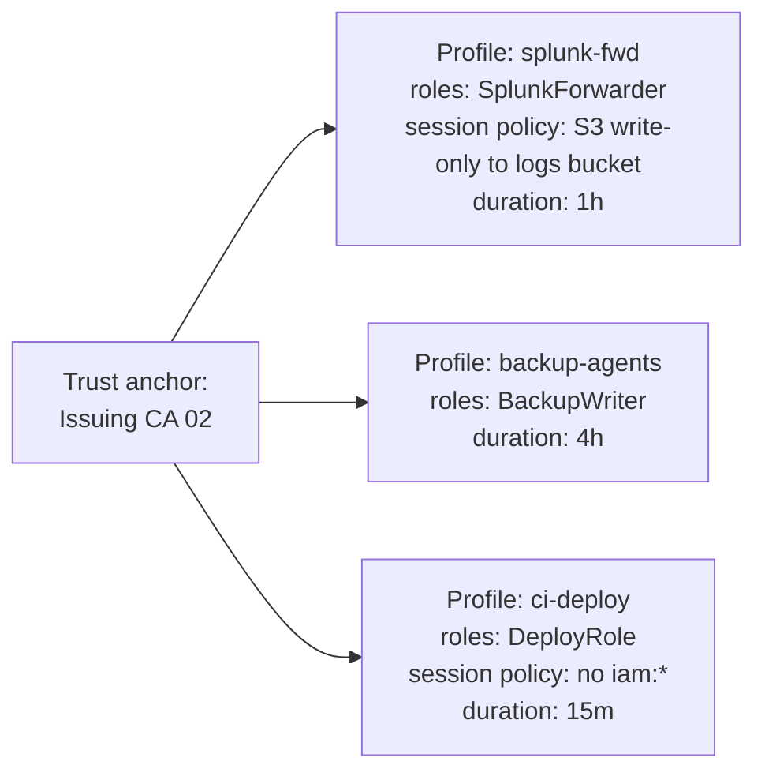

A profile is **not bound to a single trust anchor**. The client names both the anchor and the profile in each request, and each gate is evaluated independently.

### 4.5 IAM role, configured for Roles Anywhere

The role's trust policy must:
- Trust the principal `"Service": "rolesanywhere.amazonaws.com"`.
- Allow `sts:AssumeRole`, **`sts:TagSession`**, and `sts:SetSourceIdentity`. `sts:TagSession` is required because certificate attributes are attached to the session as tags (Part 7).
- Add conditions that pin the trust anchor ARN and the certificate attributes.

---

## Part 5: End-to-end authentication flow

### 5.1 Sequence

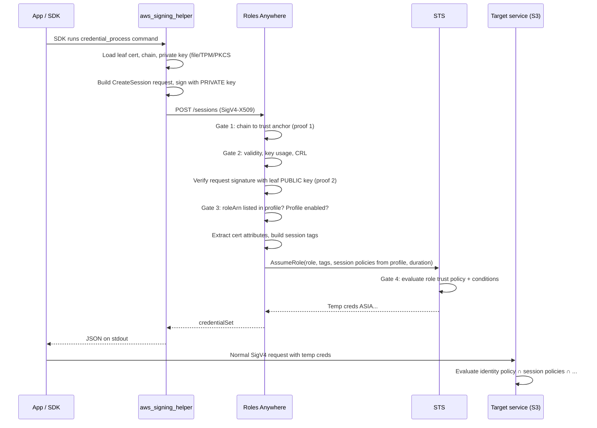

**Two different signing mechanisms are in play.** The `CreateSession` call uses **asymmetric** signing with the certificate's private key. After that, every normal API call, such as the S3 request, uses **standard SigV4 (HMAC)** with the temporary credentials. The certificate is used only to obtain credentials.

### 5.2 The CreateSession wire format (SigV4-X509)

| Element | Value |
|---|---|
| Endpoint | `https://rolesanywhere.<region>.amazonaws.com/sessions` |
| Algorithm | `AWS4-X509-RSA-SHA256` or `AWS4-X509-ECDSA-SHA256` |
| `X-Amz-X509` | Base64 DER of the **leaf** certificate |
| `X-Amz-X509-Chain` | Comma-separated base64 DER intermediates (optional) |
| `X-Amz-Date` | Timestamp. It is covered by the signature, which limits replay to a narrow window. |
| Credential scope | `<cert serial (decimal)>/<yyyymmdd>/<region>/rolesanywhere/aws4_request` |
| Body | `trustAnchorArn`, `profileArn`, `roleArn`, optionally `durationSeconds` and `roleSessionName` |

```text
StringToSign = Algorithm \n X-Amz-Date \n CredentialScope \n hex(SHA256(CanonicalRequest))
Signature    = hex( Sign_privateKey( SHA256(StringToSign) ) )   # RSA PKCS#1 v1.5 or ECDSA
```

### 5.3 Why a stolen certificate alone is useless

| Attacker has | Result |
|---|---|
| Certificate only (it's public) | Cannot produce a valid request signature, so proof 2 fails |
| Certificate + private key file | **Full compromise** until the certificate expires or is revoked. This is why keys should be hardware-bound (TPM/HSM). |
| A captured `CreateSession` request | Replay is limited to the timestamp window and yields only short-lived credentials |
| Temporary credentials | Usable until they expire (default 1 hour) |

---

## Part 6: How the client side uses Roles Anywhere

### 6.1 What `credential_process` is

`credential_process` is a **generic** setting in the AWS CLI/SDK shared config file (`~/.aws/config`). It is not specific to Roles Anywhere. It tells the SDK: "To get credentials for this profile, run this external command and read credentials from its standard output."

The contract works like this:
1. The SDK executes the command.
2. The command prints JSON to stdout in exactly this format:

```json
{
  "Version": 1,
  "AccessKeyId": "ASIA...",
  "SecretAccessKey": "wJalr...",
  "SessionToken": "IQoJb3Jp...",
  "Expiration": "2026-09-25T15:04:05Z"
}
```

3. The SDK caches these credentials and **re-runs the command automatically** when `Expiration` approaches. Omitting `Expiration` means the credentials are treated as never expiring, which is not what you want here.

Any tool that follows this contract can supply credentials: a vault client, a custom script, or the Roles Anywhere signing helper.

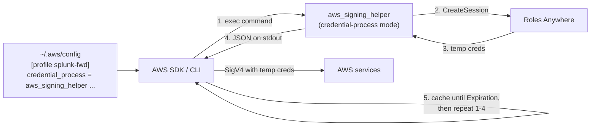

### 6.2 aws_signing_helper

The **aws_signing_helper** is an AWS-published open-source binary (in the `rolesanywhere-credential-helper` GitHub repository). It knows how to sign `CreateSession` with a certificate and private key. You install it on the external host.

It has several modes:

| Mode | What it does | When to use it |
|---|---|---|
| `credential-process` | Signs `CreateSession` and prints Version 1 JSON to stdout | **The default choice.** Use it with any SDK or CLI that supports `credential_process`. |
| `update` | Runs continuously and writes and refreshes credentials in `~/.aws/credentials` before expiry | For tools that read only static credential files |
| `serve` | Runs a local HTTP endpoint that mimics **EC2 IMDSv2** | For legacy software that only knows how to get credentials from instance metadata |
| `sign-string`, `read-certificate-data` | Debugging utilities | Troubleshooting |

It supports several sources for the private key:

| Source | Flag or example | Assurance |
|---|---|---|
| PEM file | `--private-key /etc/pki/fwd.key` | Low: the key can be copied |
| PKCS#11 (HSM, smartcard, SoftHSM) | `--certificate pkcs11:token=...;object=...` | High: the key is non-exportable |
| TPM 2.0 | TPM key file/handle | High: the key is bound to the device |
| Windows certificate store | `--cert-selector` | Depends on CNG/TPM backing |
| macOS Keychain | `--cert-selector` | Medium to high |

### 6.3 Client configuration

```ini
# ~/.aws/config
[profile splunk-fwd]
region = us-gov-west-1
credential_process = /usr/local/bin/aws_signing_helper credential-process \
  --certificate /etc/pki/fwd-01.crt \
  --intermediates /etc/pki/issuing-ca-02.pem \
  --private-key /etc/pki/fwd-01.key \
  --trust-anchor-arn arn:aws-us-gov:rolesanywhere:us-gov-west-1:111122223333:trust-anchor/TA_ID \
  --profile-arn arn:aws-us-gov:rolesanywhere:us-gov-west-1:111122223333:profile/PROF_ID \
  --role-arn arn:aws-us-gov:iam::111122223333:role/SplunkForwarder
```

In practice the `credential_process` value is usually written on a single line, because some SDKs don't parse line continuations.

To use it:

```bash
export AWS_PROFILE=splunk-fwd
aws sts get-caller-identity
# arn:aws-us-gov:sts::111122223333:assumed-role/SplunkForwarder/<cert-serial>
```

```python
import boto3
s3 = boto3.Session(profile_name="splunk-fwd").client("s3")   # helper runs transparently
```

The application code has no awareness of certificates. It just uses a named profile.

### 6.4 Client-side component view

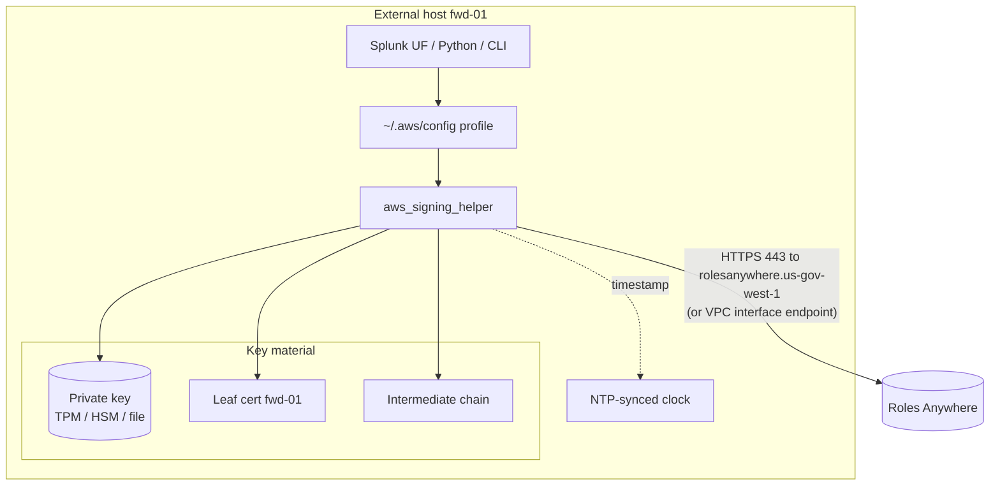

Network requirement: the host needs outbound HTTPS to the Roles Anywhere endpoint. It also needs HTTPS to the target service endpoints, reached through either the internet, Direct Connect, or VPC interface endpoints over private connectivity.

---

## Part 7: Principal tags in detail

### 7.1 Definitions

- A **tag** is a key/value pair.
- **Session tags** are tags attached to an STS session when it is created. They live only as long as the session and exist on the session, not on the role.
- A **principal tag** is any tag on the principal making a request. For an assumed-role session, principal tags include its session tags. Policies reference them with the condition key `aws:PrincipalTag/<key>` or the policy variable `${aws:PrincipalTag/<key>}`.

In Roles Anywhere, **the service automatically converts certificate fields into session tags**. The certificate's identity becomes data that IAM policies can evaluate. This is also why the trust policy must allow `sts:TagSession`.

### 7.2 Mapping from certificate to tags

Given this certificate:

```text
Subject: CN=fwd-01, OU=splunk-forwarders, O=ExampleOrg, C=US
Issuer:  CN=ExampleOrg Issuing CA 02, O=ExampleOrg, C=US
SAN:     DNS:fwd-01.logging.example.mil
         URI:spiffe://example.mil/logging/fwd-01
```

The session receives these principal tags (default mapping):

| Principal tag key | Value |
|---|---|
| `x509Subject/CN` | `fwd-01` |
| `x509Subject/OU` | `splunk-forwarders` |
| `x509Subject/O` | `ExampleOrg` |
| `x509Subject/C` | `US` |
| `x509Issuer/CN` | `ExampleOrg Issuing CA 02` |
| `x509Issuer/O` | `ExampleOrg` |
| `x509SAN/DNS` | `fwd-01.logging.example.mil` |
| `x509SAN/URI` | `spiffe://example.mil/logging/fwd-01` |

Session tag limits still apply: a tag value can be at most 256 characters. By default, only the first value of each SAN type is mapped. Attribute mapping on the profile can change which fields are mapped.

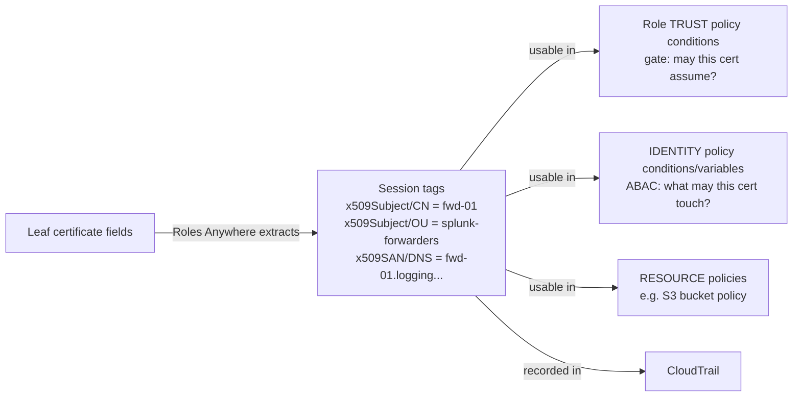

### 7.3 Use 1: gate who can assume the role (trust policy)

**Scenario:** The account trusts ExampleOrg Issuing CA 02, but that CA issues certificates to hundreds of systems. Only Splunk forwarders should become the `SplunkForwarder` role.

```json
{
  "Version": "2012-10-17",
  "Statement": [{
    "Effect": "Allow",
    "Principal": { "Service": "rolesanywhere.amazonaws.com" },
    "Action": ["sts:AssumeRole", "sts:TagSession", "sts:SetSourceIdentity"],
    "Condition": {
      "ArnEquals": {
        "aws:SourceArn": "arn:aws-us-gov:rolesanywhere:us-gov-west-1:111122223333:trust-anchor/TA_ID"
      },
      "StringEquals": {
        "aws:PrincipalTag/x509Issuer/CN": "ExampleOrg Issuing CA 02",
        "aws:PrincipalTag/x509Subject/OU": "splunk-forwarders"
      }
    }
  }]
}
```

Results:

| Certificate presented | Chains to anchor? | OU tag | Outcome |
|---|---|---|---|
| `CN=fwd-01, OU=splunk-forwarders` | Yes | matches | **Allowed** |
| `CN=web-07, OU=webservers` | Yes | `webservers` | **Denied** at the trust policy |
| `CN=fwd-01, OU=splunk-forwarders`, issued by a different CA | No | n/a | **Denied** at the trust anchor |

The `aws:SourceArn` condition pins the trust anchor. Without it, the role could also be assumed through any other trust anchor in the account whose profile lists this role. This is the confused-deputy protection.

### 7.4 Use 2: ABAC, one role with per-certificate permissions (identity policy)

**Scenario:** 50 forwarders each write to their own prefix in the S3 bucket `org-logs`. Instead of creating 50 roles, create **one role** and let the certificate CN select the prefix.

```json
{
  "Version": "2012-10-17",
  "Statement": [{
    "Effect": "Allow",
    "Action": "s3:PutObject",
    "Resource": "arn:aws-us-gov:s3:::org-logs/${aws:PrincipalTag/x509Subject/CN}/*"
  }]
}
```

At request time, IAM substitutes the variable:

| Caller certificate CN | Resolved resource | `PutObject org-logs/fwd-01/a.log` | `PutObject org-logs/fwd-02/a.log` |
|---|---|---|---|
| `fwd-01` | `org-logs/fwd-01/*` | Allowed | **Denied** |
| `fwd-02` | `org-logs/fwd-02/*` | **Denied** | Allowed |

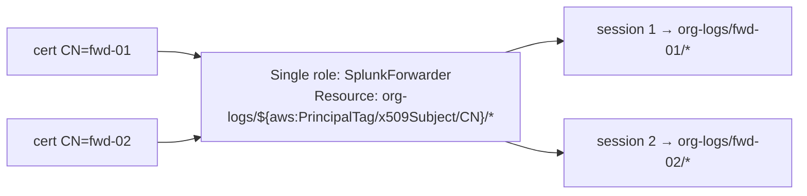

The effect is that **the permission is not fully determined by the role's policy text**. It is determined by the policy text plus the certificate that called. A compromised `fwd-01` can't overwrite `fwd-02`'s logs.

### 7.5 Use 3: a resource policy check

An S3 bucket policy can also require a specific issuer, for example by denying any request where `aws:PrincipalTag/x509Issuer/CN` doesn't match the expected CA. This adds defense in depth at the resource.

### 7.6 Principal tag pitfalls

- **Tags are only as trustworthy as your CA's issuance process.** If anyone can obtain a certificate with an arbitrary `OU`, then an `OU` condition is meaningless. Condition on attributes that your registration authority actually validates.
- Use `StringEquals` for exact matches. Use `StringLike` with `*` only where deliberate. Be careful with case sensitivity.
- If an attribute is missing from the certificate, the tag doesn't exist, and a `StringEquals` condition on it fails (a safe default). Negated operators such as `StringNotEquals` evaluate to true when the key is missing, which is a common mistake.

---

## Part 8: Session policies in detail

### 8.1 Definition

A **session policy** is a policy passed **at the moment a role session is created**. It **limits** that one session's permissions. It is a general STS feature: `AssumeRole` accepts `Policy` (inline JSON) and `PolicyArns` (up to 10 managed policy ARNs).

In Roles Anywhere, **the caller does not supply session policies. The profile does.** The admin attaches managed policy ARNs and/or an inline policy to the profile, and Roles Anywhere passes them to STS for every session created through that profile. The certificate holder cannot remove or change them.

### 8.2 The rule: an intersection that never grants

**Effective session permissions = the role's permissions policies ∩ the session policies.** A permissions boundary on the role, SCPs, and RCPs are further intersected on top. An explicit `Deny` in any of them always wins.

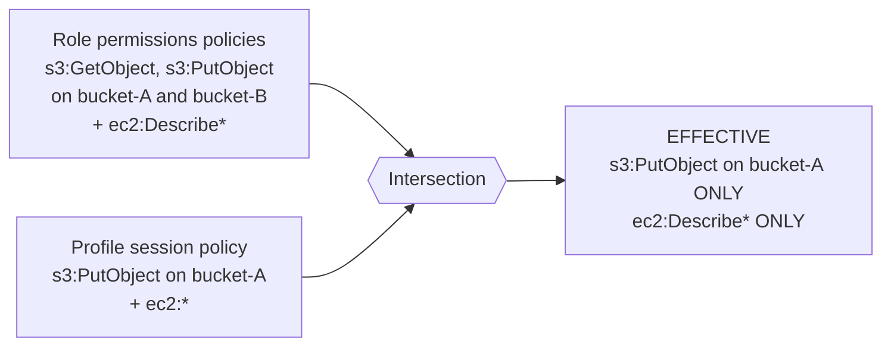

Walking through that example:

| Requested action | Allowed by role? | Allowed by session policy? | Result | Why |
|---|---|---|---|---|
| `s3:PutObject bucket-A` | Yes | Yes | **Allow** | Allowed by both |
| `s3:GetObject bucket-A` | Yes | No | **Deny** | The session policy doesn't include it |
| `s3:PutObject bucket-B` | Yes | No | **Deny** | The session policy restricts it to bucket-A |
| `ec2:DescribeInstances` | Yes | Yes (`ec2:*`) | **Allow** | Allowed by both |
| `ec2:TerminateInstances` | No | Yes (`ec2:*`) | **Deny** | **The session policy cannot grant what the role lacks** |

The last row is the one people most often get wrong. Writing `ec2:*` in a session policy does not add EC2 permissions. It only means the session policy isn't restricting EC2; the role still has to grant each action.

### 8.3 Why use session policies? One role, several profiles

**Scenario:** A role `LogPlatform` is used by both collectors (which write logs) and auditors (which read them). Its permissions policies allow both `s3:PutObject` and `s3:GetObject` on `org-logs`. You want to use certificate-based access without splitting the role.

| Profile | Session policy | Effective for sessions from this profile |
|---|---|---|
| `collectors` | Allow `s3:PutObject` on `org-logs/*` | Write only |
| `auditors` | Allow `s3:GetObject`, `s3:ListBucket` on `org-logs` | Read only |

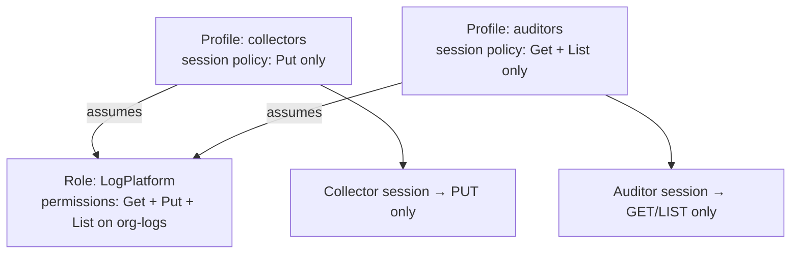

The same role ARN produces **different effective permissions depending on which profile created the session.**

### 8.4 "You can't see the actual permissions by looking at the role"

This is correct. The role's policies define only the **ceiling**. The effective permissions of a Roles Anywhere session are determined by the following layers, and only some of them are visible on the role:

| Layer | Visible on the role in the IAM console? | Where to find it |
|---|---|---|
| Role permissions policies | Yes | IAM → Roles → Permissions |
| Permissions boundary | Yes | IAM → Roles |
| **Profile session policies** | **No** | `aws rolesanywhere get-profile --profile-id ...` → `managedPolicyArns`, `sessionPolicy` |
| **Principal tag values (ABAC)** | **No.** They don't exist until a certificate authenticates. | The certificate contents; CloudTrail session tags |
| SCPs / RCPs | No | AWS Organizations |
| Resource policies (e.g. bucket policy) | No | On the target resource |

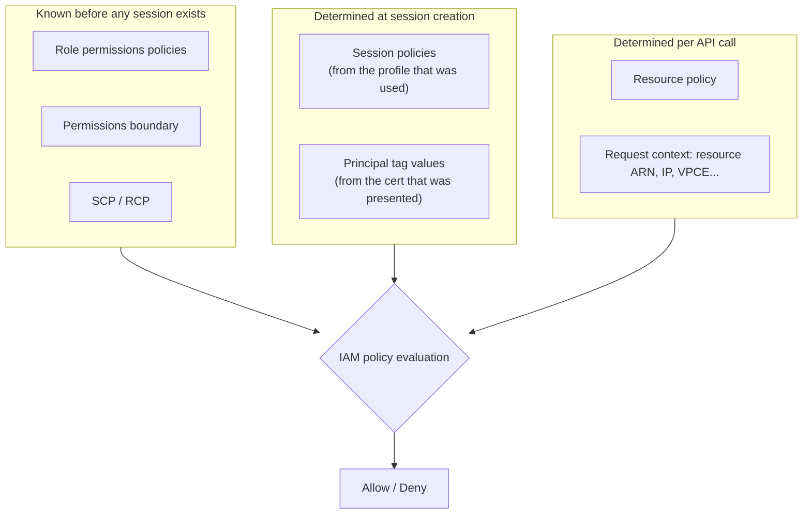

### 8.5 Operational implications

- **Treat the role and profile as a single authorization unit** in design documents and ATO packages. Documenting the role alone overstates the session's access (session policies narrow it) and hides a control point.
- **Restrict `rolesanywhere:UpdateProfile`, `CreateProfile`, and `PutAttributeMapping`.** Anyone with these permissions can change the permissions of live workloads without touching IAM roles. Consider an SCP that restricts them to the platform admin role.
- **Use CloudTrail to answer what happened:** the `CreateSession` event (source `rolesanywhere.amazonaws.com`) shows the anchor, profile, and role used; the associated `AssumeRole` shows the session tags. The IAM Policy Simulator doesn't model profile session policies end to end, so reason about the intersection explicitly.

---

## Part 9: Full worked example

**Goal:** 50 on-prem Splunk forwarders write logs to `org-logs/<their-hostname>/`. Only certificates from the logging issuing CA with `OU=splunk-forwarders` qualify. Sessions last one hour, and they can never delete objects, even if someone later broadens the role.

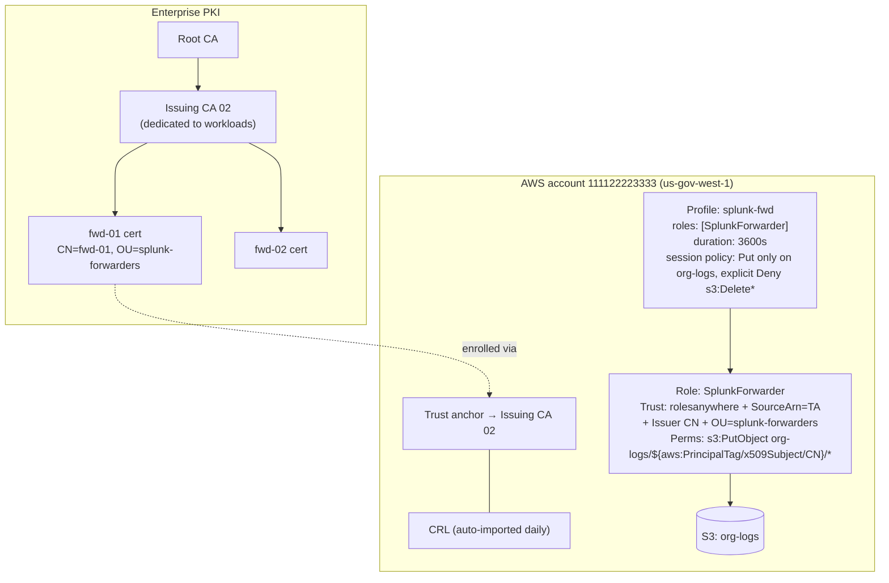

Walking through a request from `fwd-01`:

| Step | Check | Result |
|---|---|---|
| 1 | Does the certificate chain to Issuing CA 02? | Yes (proof 1) |
| 2 | Is it within its validity period, not on the CRL, with correct key usage? | Yes |
| 3 | Does the request signature verify with fwd-01's public key? | Yes (proof 2) |
| 4 | Is `SplunkForwarder` listed in profile `splunk-fwd`? | Yes |
| 5 | Tags produced | `x509Subject/CN=fwd-01`, `x509Subject/OU=splunk-forwarders`, ... |
| 6 | Do the trust policy conditions (SourceArn, Issuer CN, OU) pass? | Yes, so STS issues credentials |
| 7 | `PutObject org-logs/fwd-01/x.log` | Role allows it, session policy allows it → **Allow** |
| 8 | `PutObject org-logs/fwd-02/x.log` | The ABAC variable resolves to `fwd-01` → **Deny** |
| 9 | `DeleteObject org-logs/fwd-01/x.log` | The role doesn't grant it, and the session policy explicitly denies it → **Deny** |

Months later, an engineer adds `s3:*` to the role for a different use case. Sessions from the `splunk-fwd` profile **still cannot delete objects**, because the profile's session policy caps them.

---

## Part 10: Caveats and gotchas

| Area | Detail |
|---|---|
| **GovCloud** | Roles Anywhere is available in us-gov-west-1 and us-gov-east-1. Verify parity for newer features (attribute mapping, notification settings) in the GovCloud user guide. Use `arn:aws-us-gov` in all ARNs. |
| **Anchor scope** | Anchoring on a DoD root or broad intermediate means every certificate that CA issues passes proof 1. Prefer a dedicated issuing CA, and always condition on issuer plus subject/SAN attributes. |
| **Revocation** | Only imported CRLs are checked, with no OCSP or fetching from distribution points. Automate CRL import and consider short certificate lifetimes. |
| **Certificate requirements** | The leaf must be X.509v3 with `CA:FALSE`, `keyUsage digitalSignature`, an RSA or EC key, and a SHA-256 or stronger signature. The CA must have `CA:TRUE` and `keyCertSign`. |
| **Duration** | The profile's `durationSeconds` (900 to 43,200) must not exceed the role's `MaxSessionDuration`. |
| **Multi-account** | Anchors and profiles are per account and per region. Deploy them with StackSets or Terraform. Use role chaining for cross-account access (chained sessions are limited to 1 hour). |
| **Private key protection** | A PEM key on disk recreates the static-secret problem. Use a TPM or PKCS#11-backed key on high-assurance hosts. |
| **Clock** | The request timestamp is signed, so NTP drift causes authentication failures. |
| **Expiry notifications** | Configure Roles Anywhere notification events (for CA certificates and end-entity certificates nearing expiry) through EventBridge to prevent rotation outages. |
| **`sts:TagSession`** | Missing it from the trust policy is the most common setup error. |

If you want to keep editing or share this, I can put it into a doc.
