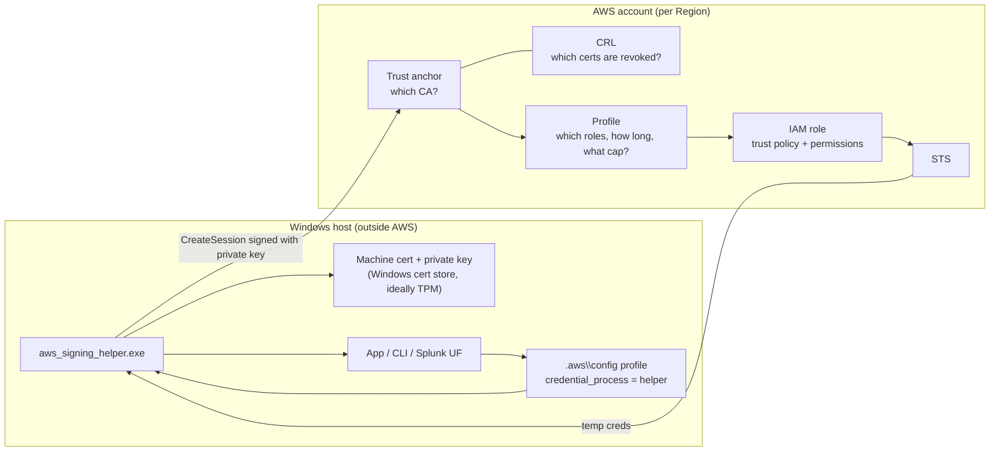
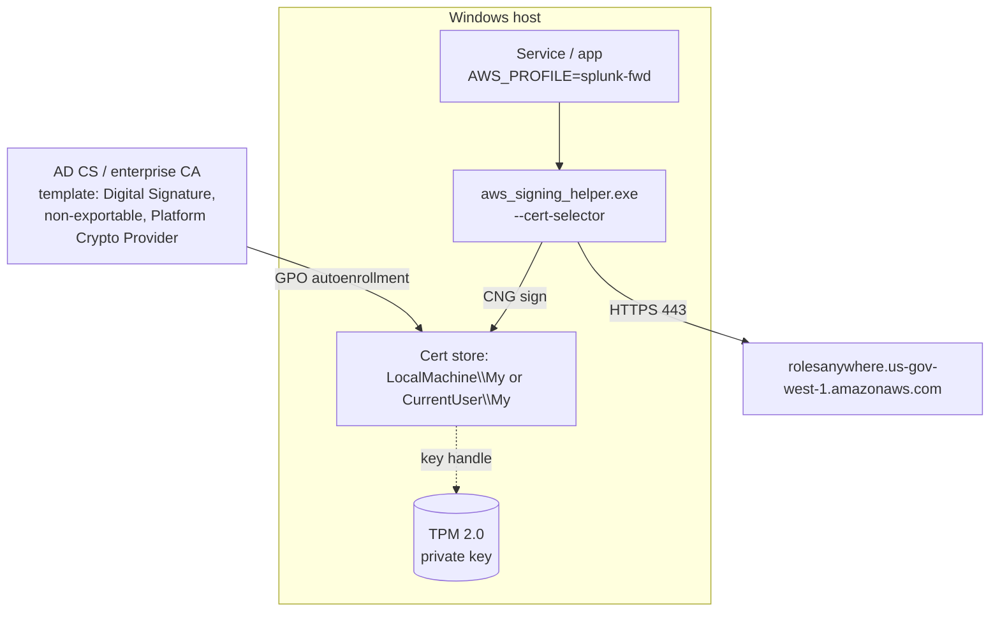

# IAM Roles Anywhere, Simplified (with Windows, Console Locations, and Terraform)

## 1. The short version

EC2, Lambda, and EKS get temporary AWS credentials automatically. A server outside AWS doesn't, so people put a permanent IAM user access key (`AKIA...`) on it. **Roles Anywhere replaces that key with the machine's certificate.**

Think of it as a badge check:

| Real world | Roles Anywhere |
|---|---|
| Your employee badge, issued by HR | The machine's **X.509 certificate**, issued by your CA |
| Your face matching the badge photo | The **private key** that signs the request (proves you're not holding a stolen badge) |
| The guard's list of trusted badge issuers | **Trust anchor** |
| The list of cancelled badges | **CRL** |
| "Badge holders may enter these rooms, for 1 hour, and never the vault" | **Profile** (allowed roles, duration, session policy cap) |
| The room's own door rule: "only people from the Logging team" | **Role trust policy** (conditions on cert fields) |
| The temporary visitor pass you get at the desk | **STS temporary credentials** (`ASIA...`, default 1 hour) |

The certificate is only used to get the visitor pass. After that, every AWS API call is a normal SigV4 call with temporary credentials.

## 2. The pieces



**What AWS checks, in order:** does the cert chain to the trust anchor, is it valid and not on the CRL, does the signature prove the caller has the private key, is the requested role listed in the profile, and does the role's trust policy accept this cert's attributes. If all pass, STS issues credentials.

**What the session can do** = role permissions ∩ profile session policy (∩ boundary, SCPs, RCPs). A session policy can only narrow, never grant.

## 3. The flow in six steps

```mermaid
sequenceDiagram
    participant App as App / AWS CLI
    participant H as aws_signing_helper.exe
    participant Store as Windows cert store / TPM
    participant RA as Roles Anywhere
    participant STS as STS
    App->>H: Needs creds, runs credential_process
    H->>Store: Find cert by selector, ask CNG to sign
    Store-->>H: Signature (key never leaves TPM)
    H->>RA: CreateSession (cert + signature + anchor/profile/role ARNs)
    RA->>STS: AssumeRole with cert fields as session tags + profile session policy
    STS-->>H: ASIA... creds, Expiration
    H-->>App: JSON on stdout; SDK caches and re-runs near expiry
```

## 4. How it works on Windows

### 4.1 What's different from Linux

On Linux you usually point the helper at PEM files. On Windows the idiomatic approach is the **Windows certificate store**: the helper finds the cert with `--cert-selector` and asks CNG to sign. If the key was enrolled with the **Microsoft Platform Crypto Provider**, it lives in the TPM and is non-exportable. That's the big win: nobody can copy the key off the box, so a stolen cert is useless.



### 4.2 Setup steps

**1. Issue the certificate.** Using AD CS autoenrollment (or your PKI's equivalent), create a template with key usage `Digital Signature`, subject/SAN values your RA actually validates (e.g. `OU=splunk-forwarders`), CSP set to Microsoft Platform Crypto Provider, and private key non-exportable. Confirm it landed with `certlm.msc` → Personal → Certificates.

**2. Install the helper.** Download `aws_signing_helper.exe` for Windows x86_64 from the Roles Anywhere "Get temporary credentials" docs page (the URL includes the version, so take it from the docs rather than hardcoding one). Put it somewhere stable, e.g. `C:\Program Files\AWS\RolesAnywhere\`.

**3. Write a cert selector** (JSON avoids escaping problems with commas in DNs), e.g. `C:\ProgramData\AWS\RolesAnywhere\selector.json`:

```json
[
  { "Key": "x509Subject", "Value": "CN=fwd-01,OU=splunk-forwarders,O=ExampleOrg,C=US" },
  { "Key": "x509Issuer",  "Value": "CN=ExampleOrg Issuing CA 02,O=ExampleOrg,C=US" }
]
```

Valid keys are `x509Subject`, `x509Issuer`, `x509Serial`. The DN string must match how the helper renders it; run `aws_signing_helper.exe read-certificate-data --cert-selector file://...` to see exactly what it finds.

**4. Test the helper directly:**

```powershell
& "C:\Program Files\AWS\RolesAnywhere\aws_signing_helper.exe" credential-process `
  --cert-selector file://C:/ProgramData/AWS/RolesAnywhere/selector.json `
  --trust-anchor-arn arn:aws-us-gov:rolesanywhere:us-gov-west-1:111122223333:trust-anchor/TA_ID `
  --profile-arn      arn:aws-us-gov:rolesanywhere:us-gov-west-1:111122223333:profile/PROF_ID `
  --role-arn         arn:aws-us-gov:iam::111122223333:role/SplunkForwarder
```

You should get the Version 1 JSON with `AccessKeyId: ASIA...`.

**5. Add the AWS config profile** (single line; quote paths with spaces):

```ini
# %USERPROFILE%\.aws\config   (or the service account's profile; see 4.3)
[profile splunk-fwd]
region = us-gov-west-1
credential_process = "C:\Program Files\AWS\RolesAnywhere\aws_signing_helper.exe" credential-process --cert-selector file://C:/ProgramData/AWS/RolesAnywhere/selector.json --trust-anchor-arn arn:aws-us-gov:rolesanywhere:us-gov-west-1:111122223333:trust-anchor/TA_ID --profile-arn arn:aws-us-gov:rolesanywhere:us-gov-west-1:111122223333:profile/PROF_ID --role-arn arn:aws-us-gov:iam::111122223333:role/SplunkForwarder
```

**6. Verify:**

```powershell
$env:AWS_PROFILE = "splunk-fwd"
aws sts get-caller-identity
# Arn: arn:aws-us-gov:sts::111122223333:assumed-role/SplunkForwarder/<cert-serial>
```

### 4.3 Windows-specific gotchas

**Which store and which account.** This is where most Windows deployments break. A cert autoenrolled to `LocalMachine\My` is not in `CurrentUser\My`, and a Windows service (LocalSystem, a virtual account, or a gMSA) has its own user profile and its own `.aws\config`. Older helper versions only search the current user's `MY` store; newer versions add options for choosing the system store/location. Run `aws_signing_helper.exe credential-process --help` on your installed version to see what it supports rather than assuming.

**Private key ACL.** For a LocalMachine cert used by a non-admin service account, grant read on the key: `certlm.msc` → cert → All Tasks → Manage Private Keys → add the service account (e.g. `NT SERVICE\SplunkForwarder`).

**Config location for services.** LocalSystem reads `C:\Windows\System32\config\systemprofile\.aws\config`. It's cleaner to set a machine-level `AWS_CONFIG_FILE=C:\ProgramData\AWS\config` so admins and the service see the same file.

**Legacy apps with no `credential_process` support.** Run `aws_signing_helper.exe serve ...` as a service. It exposes an IMDSv2-compatible endpoint on `127.0.0.1:9911`; point the app at it with `AWS_EC2_METADATA_SERVICE_ENDPOINT=http://127.0.0.1:9911/`. Any local process can then pull credentials, so only use this on single-purpose hosts.

**Tools that only read `.aws\credentials`.** Use `update` mode, which rewrites the credentials file before expiry. It leaves secrets on disk, so it's a last resort.

**Clock.** The request timestamp is signed. Make sure `w32time` syncs to a reliable source.

### 4.4 Troubleshooting

| Symptom | Likely cause | Check |
|---|---|---|
| Helper: no matching certificate | Wrong selector string, or the cert is in a different store/account | `read-certificate-data`; `certlm.msc` vs `certmgr.msc`; which account is running |
| Keyset does not exist / access denied on sign | Service account can't read the private key | Manage Private Keys ACL |
| `AccessDeniedException` from CreateSession | Cert doesn't chain to anchor, anchor/profile disabled, role not in profile, or cert on CRL | Roles Anywhere console → Subject activity; CloudTrail `CreateSession` |
| CreateSession OK path fails at AssumeRole | Trust policy conditions don't match tags, or `sts:TagSession` missing | CloudTrail; compare cert fields to `aws:PrincipalTag/x509*` conditions |
| `AccessDenied` on S3 etc. after creds are issued | Session policy narrower than expected, ABAC variable resolved differently | Profile session policy; cert CN vs resource path |
| Intermittent signature failures | Clock skew | `w32tm /query /status` |
| Chain errors | Intermediate not sent | Add `--intermediates` with a PEM bundle of the issuing CA |

## 5. Where everything lives

### 5.1 AWS Console

Roles Anywhere resources are **Regional**, so switch the console to the right Region (GovCloud console: `console.amazonaws-us-gov.com`).

| What | Console location | CLI equivalent |
|---|---|---|
| Roles Anywhere home | IAM → Roles → scroll to the **Roles Anywhere** panel at the bottom → **Manage** | — |
| Trust anchors (CA cert or Private CA ARN, enabled state, expiry notification settings) | Roles Anywhere → **Trust anchors** | `aws rolesanywhere list-trust-anchors` |
| Profiles (role list, duration, managed + inline session policies, enabled state) | Roles Anywhere → **Profiles** | `aws rolesanywhere get-profile --profile-id ...` |
| Certs that have authenticated (last seen, serial, anchor) | Roles Anywhere → **Subject activity** | `aws rolesanywhere list-subjects` |
| CRLs | As far as I know, not manageable in the console; API/CLI only | `aws rolesanywhere import-crl` / `list-crls` / `update-crl` |
| Attribute mapping | Profile detail (newer feature; confirm GovCloud parity) | `put-attribute-mapping` |
| Role trust policy | IAM → Roles → *role* → **Trust relationships** | `aws iam get-role` |
| Role permissions / boundary | IAM → Roles → *role* → **Permissions** | `aws iam list-attached-role-policies` |
| Private CA (if anchor type is `AWS_ACM_PCA`) | AWS Private CA console | `aws acm-pca describe-certificate-authority` |
| Audit trail | CloudTrail → Event history → Event source `rolesanywhere.amazonaws.com`, event `CreateSession`; the related STS `AssumeRole` shows the session tags | `aws cloudtrail lookup-events` |
| Expiry alerts | EventBridge rules on Roles Anywhere certificate-expiry events | — |

The key point from before still holds: looking at the role alone does not show effective permissions. The profile's session policy lives in Roles Anywhere, not in IAM.

### 5.2 On the Windows host

| What | Where |
|---|---|
| Machine cert | `certlm.msc` → Personal (`LocalMachine\My`) |
| User cert | `certmgr.msc` → Personal (`CurrentUser\My`) |
| Private key | TPM (Platform Crypto Provider) with a stub on disk; software KSP keys under `C:\ProgramData\Microsoft\Crypto\Keys` |
| Helper binary | Your choice, e.g. `C:\Program Files\AWS\RolesAnywhere\aws_signing_helper.exe` |
| Selector file | e.g. `C:\ProgramData\AWS\RolesAnywhere\selector.json` |
| AWS config | `%USERPROFILE%\.aws\config`, the service account's profile, or `AWS_CONFIG_FILE` |

## 6. Terraform example

This builds the same design as before: one trust anchor on the dedicated issuing CA, one role gated by issuer and OU with per-host S3 prefixes via ABAC, and one profile that caps duration and hard-denies deletes.

```hcl
terraform {
  required_providers {
    aws   = { source = "hashicorp/aws",   version = ">= 5.40" }
    awscc = { source = "hashicorp/awscc", version = ">= 1.0" }   # only for the CRL
  }
}

provider "aws"   { region = "us-gov-west-1" }
provider "awscc" { region = "us-gov-west-1" }

data "aws_partition" "current" {}
data "aws_caller_identity" "current" {}

locals {
  p           = data.aws_partition.current.partition   # "aws-us-gov"
  log_bucket  = "org-logs"
  issuer_cn   = "ExampleOrg Issuing CA 02"
  allowed_ou  = "splunk-forwarders"
}

# ---------- Trust anchor: which CA do we trust? ----------
resource "aws_rolesanywhere_trust_anchor" "workload_ca" {
  name    = "issuing-ca-02"
  enabled = true

  source {
    source_type = "CERTIFICATE_BUNDLE"          # or "AWS_ACM_PCA" with acm_pca_arn
    source_data {
      x509_certificate_data = file("${path.module}/certs/issuing-ca-02.pem")
    }
  }
}

# ---------- CRL: AWS provider has no native resource; use awscc ----------
resource "awscc_rolesanywhere_crl" "issuing_ca_02" {
  name             = "issuing-ca-02-crl"
  crl_data         = filebase64("${path.module}/certs/issuing-ca-02.crl")  # DER CRL, base64
  trust_anchor_arn = aws_rolesanywhere_trust_anchor.workload_ca.arn
  enabled          = true
}

# ---------- Role trust policy: which certs may become this role? ----------
data "aws_iam_policy_document" "ra_trust" {
  statement {
    effect  = "Allow"
    actions = ["sts:AssumeRole", "sts:TagSession", "sts:SetSourceIdentity"]

    principals {
      type        = "Service"
      identifiers = ["rolesanywhere.amazonaws.com"]
    }

    condition {                                   # pin the anchor (confused deputy)
      test     = "ArnEquals"
      variable = "aws:SourceArn"
      values   = [aws_rolesanywhere_trust_anchor.workload_ca.arn]
    }
    condition {
      test     = "StringEquals"
      variable = "aws:PrincipalTag/x509Issuer/CN"
      values   = [local.issuer_cn]
    }
    condition {
      test     = "StringEquals"
      variable = "aws:PrincipalTag/x509Subject/OU"
      values   = [local.allowed_ou]
    }
  }
}

resource "aws_iam_role" "splunk_forwarder" {
  name                 = "SplunkForwarder"
  assume_role_policy   = data.aws_iam_policy_document.ra_trust.json
  max_session_duration = 3600                     # must be >= profile duration
}

# ---------- Role permissions: ABAC, each cert CN gets its own prefix ----------
# NOTE: $${...} escapes Terraform interpolation so IAM receives ${aws:PrincipalTag/...}
data "aws_iam_policy_document" "forwarder_perms" {
  statement {
    effect    = "Allow"
    actions   = ["s3:PutObject"]
    resources = ["arn:${local.p}:s3:::${local.log_bucket}/$${aws:PrincipalTag/x509Subject/CN}/*"]
  }
}

resource "aws_iam_role_policy" "forwarder_perms" {
  name   = "forwarder-put-own-prefix"
  role   = aws_iam_role.splunk_forwarder.id
  policy = data.aws_iam_policy_document.forwarder_perms.json
}

# ---------- Profile session policy: hard ceiling for this use case ----------
data "aws_iam_policy_document" "profile_session" {
  statement {
    effect    = "Allow"
    actions   = ["s3:PutObject"]
    resources = ["arn:${local.p}:s3:::${local.log_bucket}/*"]
  }
  statement {
    effect    = "Deny"
    actions   = ["s3:Delete*", "s3:PutBucketPolicy", "s3:PutLifecycleConfiguration"]
    resources = ["*"]
  }
}

# ---------- Profile: which roles, how long, what cap ----------
resource "aws_rolesanywhere_profile" "splunk_fwd" {
  name             = "splunk-fwd"
  enabled          = true
  role_arns        = [aws_iam_role.splunk_forwarder.arn]
  duration_seconds = 3600
  session_policy   = data.aws_iam_policy_document.profile_session.json
  # managed_policy_arns      = [...]   # optional, up to 10
  # accept_role_session_name = true    # newer provider versions only
}

# ---------- Output: paste-ready Windows credential_process line ----------
output "windows_credential_process" {
  value = join(" ", [
    "\"C:\\Program Files\\AWS\\RolesAnywhere\\aws_signing_helper.exe\" credential-process",
    "--cert-selector file://C:/ProgramData/AWS/RolesAnywhere/selector.json",
    "--trust-anchor-arn ${aws_rolesanywhere_trust_anchor.workload_ca.arn}",
    "--profile-arn ${aws_rolesanywhere_profile.splunk_fwd.arn}",
    "--role-arn ${aws_iam_role.splunk_forwarder.arn}",
  ])
}
```

### Terraform notes

- **`$${aws:PrincipalTag/...}`** is the most common mistake. Without the double `$`, Terraform tries to interpolate it and fails, or worse, you end up hand-writing JSON that silently breaks.
- **CRLs:** the `hashicorp/aws` provider only has `aws_rolesanywhere_trust_anchor` and `aws_rolesanywhere_profile` as far as I know. `awscc_rolesanywhere_crl` (Cloud Control) covers CRLs, but CRL freshness is a runtime problem, not a deploy-time one, so you still need a scheduled Lambda calling `UpdateCrl`. Confirm the awscc resource is supported in your GovCloud Region.
- **Attribute mapping and notification settings** are newer and provider support has lagged. Check your provider version's docs, and check the GovCloud user guide for feature parity, before relying on them.
- **Multi-account:** anchors and profiles are per account and Region. Put this in a module and fan it out with your account vending pipeline or StackSets.
- **Guard the profile:** anyone with `rolesanywhere:UpdateProfile` can change what live workloads can do without touching IAM. An SCP restricting `rolesanywhere:Create*`, `Update*`, `Put*`, and `Delete*` to your platform/pipeline role is worth adding.

## 7. The three things to remember

1. **Cert gets you in the door; the private key proves it's really you.** On Windows, put the key in the TPM and make it non-exportable, or you've just moved the static-secret problem.
2. **Four gates:** trust anchor → CRL → profile → role trust policy. Pin `aws:SourceArn` and condition on issuer plus a subject attribute your RA actually validates.
3. **Effective permissions = role ∩ profile session policy.** Document the role and profile together in the HLD/ATO package, because the role alone overstates access.
