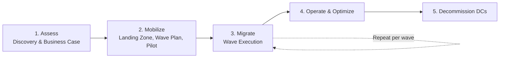
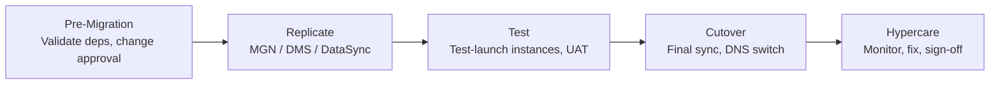

# Datacenter-to-AWS Migration: High-Level Pattern

AWS's standard framework, used in the Migration Acceleration Program (MAP), has three phases: **Assess → Mobilize → Migrate & Modernize**. Most enterprise migrations follow it in some form. Applications then move in **waves**, not all at once.

## Phase 1: Assess

| Step | Key Activities | Outputs |
|---|---|---|
| Discovery | Inventory servers, apps, databases, storage, and network flows. Use agent-based or agentless discovery tools (Application Discovery Service, Migration Evaluator, or 3rd-party tools like Cloudamize or Flexera). | CMDB-validated inventory with utilization data |
| Dependency mapping | Map application-to-application and application-to-infrastructure dependencies, including ports and protocols. | Dependency groups, which become move groups |
| Portfolio analysis | Assign each workload one of the **7 Rs**: Retire, Retain, Rehost, Relocate, Replatform, Repurchase, Refactor. | Disposition per application |
| Business case / TCO | Compare on-prem cost with right-sized AWS cost, accounting for licensing (BYOL vs. license-included). | Approved business case |
| Readiness | Assess skills, operating model, security, and compliance gaps. | Readiness gap list |

## Phase 2: Mobilize

| Step | Key Activities |
|---|---|
| Landing zone | Set up a multi-account structure (Control Tower / Organizations), SCPs, centralized logging, security tooling, and IAM/SSO federation. |
| Network foundation | Set up hybrid connectivity (Direct Connect plus VPN backup), Transit Gateway or Cloud WAN, IP address management with non-overlapping CIDRs, and DNS (Route 53 Resolver endpoints for hybrid resolution). |
| Security & compliance baseline | Encryption/KMS strategy, guardrails, ATO/control inheritance, and logging/SIEM integration. |
| Operating model | Cloud Center of Excellence (CCoE), runbooks, tagging standard, cost governance, and patching/backup strategy. |
| Wave planning | Group applications by dependency and risk. Schedule low-risk, low-dependency apps first. |
| Pilot migration | Migrate 2–5 representative apps end to end to validate tooling, network, cutover runbooks, and testing. |

## Phase 3: Migrate & Modernize (per wave)

| Workload Type | Typical Tooling |
|---|---|
| Servers (rehost) | AWS Application Migration Service (MGN), which does block-level continuous replication |
| VMware estates | VMware Cloud on AWS (relocate), or MGN to native EC2 |
| Databases | AWS DMS with Schema Conversion Tool (SCT) for heterogeneous moves. Native tools (RMAN, log shipping, `pg_dump`) for homogeneous moves. |
| File/object data | DataSync, Storage Gateway, Transfer Family |
| Bulk offline data | Snowball Edge, for when the network can't move the volume within the timeline |
| Tracking | Migration Hub / Migration Hub Orchestrator |

## Phase 4: Operate & Optimize

- **Right-sizing:** Use Compute Optimizer after 2–4 weeks of real utilization data.
- **Cost:** Apply Savings Plans or RIs, delete orphaned resources, and use S3 lifecycle policies.
- **Modernize post-move:** Move databases to RDS/Aurora, containerize with ECS/EKS, and adopt managed services where it pays off.
- **Operations:** Configure Backup, SSM Patch Manager, CloudWatch, and Config conformance packs.

## Phase 5: Decommission

Validate that nothing still talks to the old servers by checking flow logs or netflow on-prem. Then archive data per your retention requirements, power down, and exit DC contracts. This is where the business case actually gets realized, so track it explicitly.

## Common Failure Points

- **Dependency discovery is incomplete.** Hardcoded IPs, batch jobs, and undocumented integrations are what break cutovers.
- **Network and DNS get underestimated.** Overlapping CIDRs, MTU issues over DX/VPN, and hybrid DNS resolution are frequent problems.
- **Licensing surprises.** Oracle, Microsoft SQL Server, and Windows on dedicated vs. shared tenancy are common sources.
- **Wave sizing is too aggressive early on.** Ramp velocity after the pilot proves the factory model.
- **Lift-and-shift with no optimization pass.** Cloud costs end up exceeding on-prem.

## GovCloud / DoD Considerations

- **Service availability:** Verify each tool in your target region before baking it into the plan. MGN and DMS are available in GovCloud, but Discovery Service and some Migration Hub features have historically lagged or been unavailable there.
- **Connectivity path:** For DoD IL4/IL5, plan for SCCA (CAP/VDSS/VDMS) and meet-me-point routing. Workloads typically don't use direct internet egress.
- **ATO strategy:** Decide early whether each system gets a new ATO or an ATO update for the hosting change. Map inherited controls from the CSP and SCCA provider.
- **Data at rest:** Plan for FIPS endpoints, KMS key ownership (customer-managed keys), and CUI handling during replication, including staging-area encryption for MGN replication servers.

I can go deeper on any phase, such as a wave-planning template, a landing zone reference design, or an MGN cutover runbook.
