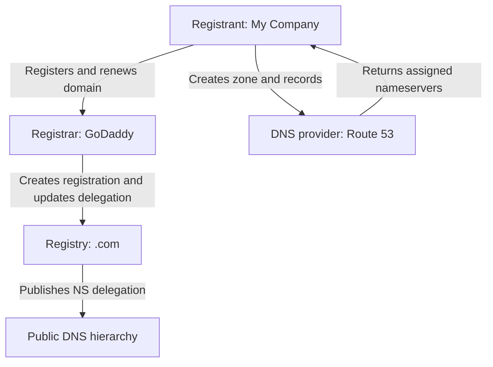
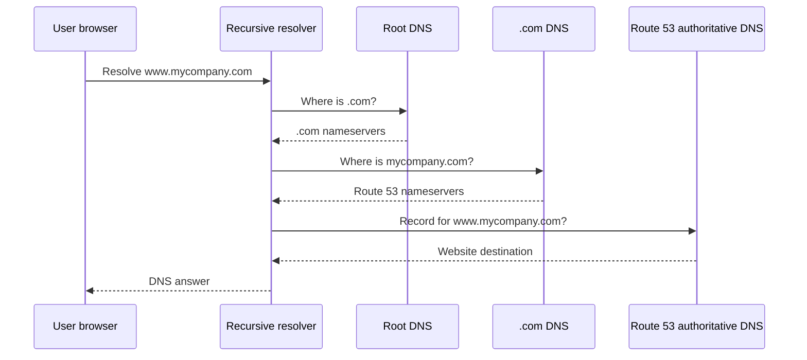
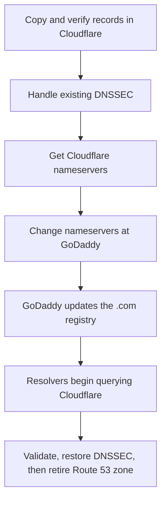

# WHOIS/RDAP, Domain Registration, and DNS

## Purpose

This article explains:

- The terminology used in domain registration and DNS
- The difference between a registrar, registry, and DNS provider
- How domain registration and normal DNS resolution work
- How WHOIS/RDAP relates to DNS
- How to move a domain to a different authoritative DNS provider
- The difference between changing DNS providers and transferring registrars

---

## 1. Terminology

### Domain name

A human-readable name such as `mycompany.com`. A domain is registered, while the DNS records beneath it are hosted and managed.

### Registrant

The person or organization that holds the registration rights to a domain. The registrant is commonly called the **domain owner**, although legally the registration is usually a renewable right to use the name rather than ownership of the top-level domain itself.

### Registrar

The company through which the registrant registers and renews a domain. The registrar normally provides the portal where the registrant can:

- Renew the domain
- Update contact information
- Lock or unlock the domain
- Change the authoritative nameservers
- Configure DNSSEC delegation records
- Obtain an authorization code for a registrar transfer

Examples include GoDaddy, Namecheap, Cloudflare Registrar, Squarespace Domains, and Amazon Route 53 Domains.

### Registry

The organization that maintains the master registration database and DNS delegation data for a top-level domain. For example, Verisign operates the `.com` registry.

The registrant normally works through the registrar rather than communicating directly with the registry. ICANN describes registrars as responsible for domain registration and registries as responsible for maintaining their respective top-level domains.

### Top-level domain (TLD)

The final portion of a domain name:

- `.com`, `.org`, and `.net` are generic TLDs.
- `.us`, `.in`, and `.uk` are country-code TLDs.

Country-code domains may follow registration policies that differ from the generic TLD model.

### DNS provider

The service that hosts the domain's DNS zone and answers authoritative DNS queries. Examples include:

- Amazon Route 53
- Cloudflare DNS
- Microsoft Azure DNS
- Google Cloud DNS
- Akamai Edge DNS
- IBM NS1 Connect

The registrar and DNS provider can be the same company, but they do not have to be.

### DNS zone

The collection of DNS records managed for a domain, such as `mycompany.com`. A public zone commonly contains records for websites, email, verification, and other services.

### DNS record

An entry in a DNS zone. Common record types include:

| Record | Purpose |
|---|---|
| `A` | Maps a name to an IPv4 address |
| `AAAA` | Maps a name to an IPv6 address |
| `CNAME` | Makes one hostname an alias of another hostname |
| `MX` | Identifies the domain's mail servers |
| `TXT` | Holds verification, SPF, and other text data |
| `NS` | Identifies authoritative nameservers |
| `SOA` | Describes the zone's authority and administrative timers |
| `CAA` | Restricts which certificate authorities may issue certificates |
| `DS` | Publishes DNSSEC trust information in the parent zone |

### Authoritative nameserver

A DNS server that holds the official records for a DNS zone. If Route 53 hosts the zone, the Route 53 nameservers assigned to that hosted zone are authoritative for it.

### Recursive DNS resolver

A server that finds DNS answers on behalf of users and applications. It follows the DNS hierarchy from the root to the TLD and then to the domain's authoritative nameservers. It also caches answers according to their TTL values.

### Delegation

The parent zone's instruction identifying the nameservers responsible for a child domain. For `mycompany.com`, the `.com` zone publishes the `NS` delegation that directs resolvers to the authoritative DNS provider for `mycompany.com`.

Changing the nameservers through the registrar changes this public delegation.

### WHOIS and RDAP

WHOIS was the traditional plain-text protocol for retrieving domain-registration information. **RDAP** is its structured, HTTPS-based replacement. As of January 28, 2025, ICANN identifies RDAP as the definitive source for generic TLD registration data.

People still commonly say “WHOIS lookup,” even when the service uses RDAP.

WHOIS/RDAP may show:

- Registrar
- Registration and expiration dates
- Domain status codes
- Authoritative nameserver names
- DNSSEC status
- Limited registrant information, depending on privacy and access rules

It does not normally show every record inside the DNS zone.

### DNSSEC

DNS Security Extensions cryptographically validate DNS data. A `DS` record in the parent zone links the domain's delegation to keys published by the authoritative DNS provider.

Because the DNSSEC keys are usually tied to the DNS provider, DNSSEC must be handled carefully when changing providers. A stale `DS` record can cause validating resolvers to return `SERVFAIL`, making the domain appear offline.

### TTL and caching

Time to Live tells resolvers how long they may cache a DNS answer. After a nameserver or record change, different resolvers may temporarily use old and new data until cached information expires.

### Domain transfer versus DNS migration

These are different operations:

| Operation | What changes | What normally stays unchanged |
|---|---|---|
| Change DNS provider | Authoritative nameservers and DNS hosting | Registrar and domain ownership |
| Transfer registrar | Company managing the registration | DNS provider and DNS records, if nameservers are preserved |
| Change web host | Destination in records such as `A`, `AAAA`, `CNAME`, or provider-specific alias | Registrar and possibly DNS provider |
| AXFR zone transfer | Copies DNS-zone data between permitted DNS servers | Registration and parent-zone delegation |

---

## 2. Known Provider Roles

The following are examples, not recommendations:

| Provider | Registrar | Authoritative DNS | Other common services |
|---|:---:|:---:|---|
| GoDaddy | Yes | Yes | Website and email services |
| Namecheap | Yes | Yes | Website hosting and email |
| Cloudflare | Yes | Yes | CDN, WAF, proxy, and DDoS protection |
| Squarespace Domains | Yes | Yes | Website hosting |
| Amazon Route 53 | Yes | Yes | AWS-integrated traffic routing and health checks |
| Microsoft Azure DNS | No | Yes | Azure-integrated DNS hosting |
| Google Cloud DNS | No | Yes | Google Cloud-integrated DNS hosting |
| Akamai Edge DNS | No | Yes | Enterprise DNS and edge services |

Some companies provide both roles, but the systems are still logically separate. For example, a domain can be registered through GoDaddy while its authoritative DNS zone is hosted in Route 53.

**Cloudflare Registrar exception:** domains registered with Cloudflare Registrar are required to use Cloudflare's authoritative nameservers under its current service model. To use another authoritative DNS provider, the domain registration generally must first be transferred away from Cloudflare Registrar.

---

## 3. Management Flow: Registering and Configuring a Domain

Assume the following example:

| Function | Example |
|---|---|
| Domain | `mycompany.com` |
| Registrant | My Company |
| Registrar | GoDaddy |
| Registry | Verisign for `.com` |
| DNS provider | Amazon Route 53 |
| Website destination | AWS CloudFront or an Application Load Balancer |
| Email provider | Microsoft 365 |



### Typical sequence

1. **Search and register:** My Company searches for `mycompany.com` through GoDaddy and registers it.
2. **Registry update:** GoDaddy creates the registration in the `.com` registry. Registrar-to-registry operations commonly use EPP.
3. **Create the DNS zone:** My Company creates a public hosted zone named `mycompany.com` in Route 53.
4. **Receive nameservers:** Route 53 assigns authoritative nameservers to the hosted zone.
5. **Create DNS records:** My Company creates the website, email, and verification records in Route 53.
6. **Change delegation:** In the GoDaddy registrar portal, My Company replaces the default nameservers with the Route 53 nameservers.
7. **Publish delegation:** GoDaddy sends the nameserver update to the `.com` registry, which publishes it in the `.com` DNS zone.
8. **Become authoritative:** After cached delegation data expires, resolvers send queries for `mycompany.com` to Route 53.

The registrar does not normally inspect or approve every DNS record. It controls the registration and submits the nameserver delegation selected by an authenticated, authorized domain-account user.

Manual assistance may be required when the domain is locked, disputed, suspended, expired, or protected by a registry-level lock.

---

## 4. Runtime Flow: How a User Reaches the Website

Suppose Route 53 contains a record directing `www.mycompany.com` to the company's web service.



The recursive resolver does **not** query WHOIS or RDAP during this process. It obtains the nameserver delegation from DNS itself.

### What an RDAP lookup would show

An RDAP lookup for the same domain might show:

- Registrar: GoDaddy
- Registry: `.com` registration data
- Nameservers: the assigned Route 53 nameservers
- Registration and expiration dates
- Domain status and DNSSEC information

It normally would not show the `A`, `MX`, or application-specific records stored inside the Route 53 hosted zone.

---

## 5. Changing the Authoritative DNS Provider

Assume My Company wants to move authoritative DNS from **Route 53 to Cloudflare**, while keeping **GoDaddy as the registrar**.



### Step 1: Inventory the current Route 53 zone

Record every public DNS entry, including:

- Website records
- `MX` and email-related `TXT` records
- SPF, DKIM, and DMARC records
- Certificate-validation and ownership-verification records
- `CAA` records
- Wildcards
- Subdomain delegations
- Any provider-specific alias or routing behavior

Do not assume that an automatic import captured every record or preserved provider-specific features.

### Step 2: Prepare the new Cloudflare zone

Add `mycompany.com` to Cloudflare and import or recreate the records. Cloudflare assigns authoritative nameservers to the zone.

Before changing the delegation, query the new nameservers directly and verify that they return the intended website and mail records.

### Step 3: Consider TTLs

If service destinations will also change, lower the TTLs of affected records in advance and wait for their previous TTLs to expire.

Lowering an `A` or `MX` record's TTL does not necessarily shorten the parent `.com` nameserver-delegation cache. The parent-zone `NS` TTL controls how long resolvers may continue using the old delegation.

### Step 4: Handle DNSSEC

If DNSSEC is not enabled, proceed to the nameserver change.

For a straightforward migration when DNSSEC is enabled:

1. Remove or disable the old `DS` record through the registrar.
2. Wait for the old `DS` record's TTL to expire.
3. Change the nameservers.
4. After Cloudflare is authoritative, enable DNSSEC there.
5. Publish the new Cloudflare `DS` information through the registrar.

Advanced multi-signer migrations can maintain continuous DNSSEC validation but require both providers to support and coordinate the process.

### Step 5: Change the nameservers at the registrar

Sign in to the GoDaddy account and replace the Route 53 nameservers with the nameservers assigned by Cloudflare.

This is the decisive control-plane change. GoDaddy sends the update to the `.com` registry, and the `.com` zone begins delegating `mycompany.com` to Cloudflare.

Normally, no registrar employee must manually approve this. The change must come from an authenticated user with permission to manage the domain. Security locks or restrictive status codes may block it until resolved.

### Step 6: Allow cached delegations to expire

During the transition, some recursive resolvers may continue querying Route 53 while others query Cloudflare. Both providers should therefore return equivalent answers throughout the overlap period.

“DNS propagation” usually means that previously cached records and delegations are expiring—not that a single update is physically copied to every DNS server on the Internet.

### Step 7: Validate

Useful checks include:

```bash
dig NS mycompany.com
dig +trace mycompany.com
dig A www.mycompany.com
dig MX mycompany.com
dig TXT mycompany.com
dig DS mycompany.com
dig @<new-cloudflare-nameserver> A www.mycompany.com
```

Also test:

- Website access
- Email sending and receiving
- Certificate validation
- Important subdomains
- DNSSEC validation, if enabled
- Responses from multiple public resolvers or networks

### Step 8: Retain the old DNS zone temporarily

Keep the Route 53 zone active until the old delegation has expired from caches and monitoring shows that Cloudflare is answering correctly. Depending on the applicable TTLs, keeping the old zone for at least 48–72 hours is a common conservative practice.

Only then remove the old hosted zone.

---

## 6. What Does Not Change During This DNS Migration?

In the example above:

- My Company remains the registrant.
- GoDaddy remains the registrar.
- The domain's expiration date does not change.
- The `.com` registry remains the registry.
- Only the authoritative DNS provider and published nameserver delegation change.
- The website and email providers can remain unchanged if the copied DNS records point to the same destinations.

No EPP authorization code is normally needed because the registrar is not being transferred.

---

## 7. Transferring the Registrar Instead

If My Company transfers `mycompany.com` from GoDaddy to another registrar, that is a **domain-registration transfer**. It commonly requires:

1. Verifying that the domain is eligible for transfer
2. Unlocking the domain
3. Obtaining an authorization or EPP code
4. Starting the transfer with the new registrar
5. Confirming the transfer through the required approval process

The authoritative DNS provider does not have to change. If the Route 53 nameservers remain configured during the registrar transfer, DNS can continue operating from Route 53.

Registrar transfer rules, waiting periods, and approval processes vary by TLD and domain status.

---

## 8. Common Mistakes

| Mistake | Likely result |
|---|---|
| Changing nameservers before copying all DNS records | Website, email, or verification failures |
| Deleting the old DNS zone immediately | Failures for resolvers still using the cached old delegation |
| Leaving an old DNSSEC `DS` record in the parent zone | `SERVFAIL` and apparent domain outage |
| Editing records at the old provider after delegation changed | Changes have no effect for resolvers using the new provider |
| Confusing registrar transfer with DNS migration | Unnecessary domain-transfer work or unexpected restrictions |
| Assuming the registrar is the web host | Changes are made in the wrong system |
| Copying ordinary aliases without reviewing provider-specific behavior | Different routing or apex-domain behavior |

---

## 9. Key Takeaways

- **Registrar:** manages the domain registration and submits nameserver delegation changes.
- **Registry:** maintains the master data and parent-zone delegation for a TLD.
- **DNS provider:** hosts the zone and answers authoritative DNS queries.
- **WHOIS/RDAP:** reports registration information; it is not part of normal DNS resolution.
- **Nameserver change:** moves authoritative DNS control without necessarily moving the registrar.
- **Registrar transfer:** moves registration management and can leave DNS hosting unchanged.
- **DNSSEC:** must be migrated carefully because the parent-zone `DS` record must match the new provider's keys.

---

## References

- [ICANN — The Domain Name Registration Process](https://www.icann.org/resources/pages/domain-name-registration-process-2023-11-02-en)
- [ICANN — RDAP Launch and WHOIS Sunset](https://www.icann.org/en/announcements/details/icann-update-launching-rdap-sunsetting-whois-27-01-2025-en)
- [ICANN — EPP Domain Status Codes](https://www.icann.org/resources/pages/epp-status-codes-2014-06-16-en)
- [Amazon Route 53 concepts](https://docs.aws.amazon.com/Route53/latest/DeveloperGuide/route-53-concepts.html)
- [Amazon Route 53 — Migrating an active domain's DNS service](https://docs.aws.amazon.com/Route53/latest/DeveloperGuide/migrate-dns-domain-in-use.html)
- [Cloudflare — Change nameservers](https://developers.cloudflare.com/dns/zone-setups/full-setup/setup/)
- [Cloudflare — DNSSEC migration considerations](https://developers.cloudflare.com/dns/dnssec/)
- [Microsoft — Azure DNS delegation overview](https://learn.microsoft.com/en-us/azure/dns/dns-domain-delegation)
- [Google Cloud — Update a domain's nameservers](https://docs.cloud.google.com/dns/docs/update-name-servers)
