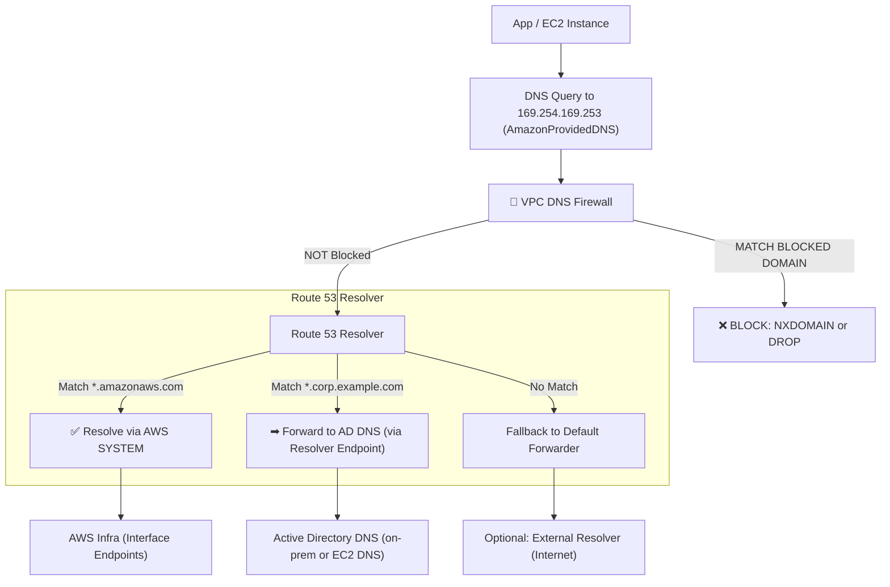

you can combine:

1. ✅ **Amazon Route 53 Resolver rules** (for DNS forwarding)
2. ✅ **DNS Firewall** (for blocking/alerting malicious domains)

…to build a secure and segmented DNS resolution path in your VPC, especially when using:

* 🔹 **Outbound Resolver Endpoints**
* 🔹 **AWS interface endpoints (VPC endpoints)**
* 🔹 **On-premises Active Directory (AD) DNS servers**

Let’s break this down clearly.
---

## 🎯 Your Goal

* 🟢 Allow AWS service domains (e.g., `*.amazonaws.com`, `s3.us-gov-west-1.amazonaws.com`) to resolve **locally** (so interface endpoints work)
* 🔁 Forward all **internal AD domains** (e.g., `corp.example.com`) to **on-premises DNS**
* 🔐 Block known-bad/malicious domains using **DNS Firewall**

---

## 🔁 How Resolver + DNS Firewall Work Together

### ✅ Flow (With Combined Resolver Rules + DNS Firewall)

```text
EC2/App/Container
  ⬇ DNS query to AmazonProvidedDNS (169.254.169.253)
Route 53 Resolver
  ⬇
Check DNS Firewall rule group
  ⬇ If not blocked...
Check Resolver rule (match domain?)
  ⬇
→ Match AWS domain → Resolve using AWS (local resolver)
→ Match AD domain → Forward to AD DNS (outbound endpoint)
→ Otherwise → Default resolver rule applies
```

---

## ✅ Step-by-Step: How to Combine

### 1. 🛠️ Create **DNS Firewall Rule Group**

* Rule 1: Block known malicious domains

  * Domain list: AWS managed or custom
  * Action: `BLOCK`
* Rule 2: Allow `*.corp.example.com`

  * Action: `ALLOW` (optional, helpful to avoid false positives)
* Attach this to your **VPC** (not endpoint)

### 2. 🧭 Create **Resolver Rules**

| Domain Pattern       | Action                                                      |
| -------------------- | ----------------------------------------------------------- |
| `*.corp.example.com` | FORWARD to AD DNS via outbound endpoint                     |
| `*.amazonaws.com`    | SYSTEM — resolve using AWS DNS (required for VPC endpoints) |
| `.` (dot/root)       | Default forwarder (optional, fallback to AD or AWS)         |

* Forward rules send queries to **AD DNS**
* System rules **ensure AWS services resolve locally**

### 3. 🌐 Create **Outbound Resolver Endpoint**

* Points to AD DNS IPs
* Used by the forwarder rules

---

## 📦 Example DNS Flow Table

| Domain                           | What Happens                                      |
| -------------------------------- | ------------------------------------------------- |
| `s3.us-gov-west-1.amazonaws.com` | Handled locally (AWS SYSTEM rule)                 |
| `corp.example.com`               | Forwarded to AD DNS via resolver endpoint         |
| `malware.bad.com`                | Blocked by DNS Firewall                           |
| `unknown.com`                    | Depends on fallback `.` rule or denied by default |

---

## ⚠ Key Considerations

| Topic                                                 | Details                                                                            |
| ----------------------------------------------------- | ---------------------------------------------------------------------------------- |
| **DNS Firewall applies first**                        | If domain is blocked → no forwarding occurs                                        |
| **Interface endpoints require AWS SYSTEM resolution** | Never override `*.amazonaws.com` via custom forwarders                             |
| **Wildcard forward (`.`) is fallback**                | Be careful to avoid sending all DNS to AD unless intended                          |
| **Query Logging**                                     | Enable logging for **both DNS Firewall and Resolver Query Logs** for observability |

---

## Visual Flow of DNS Query 



