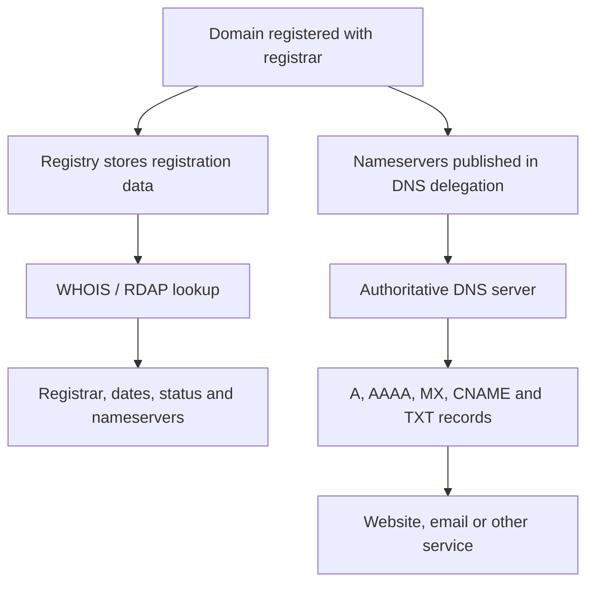
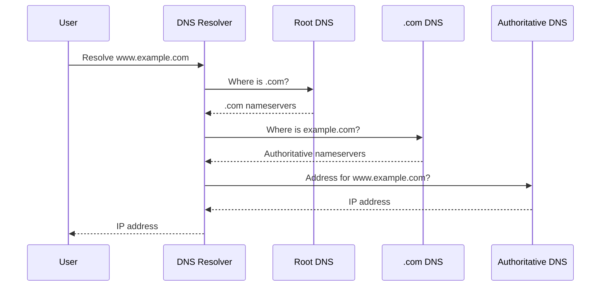

## WHOIS vs. DNS

**WHOIS** tells you **who registered a domain and how it is registered**.
**DNS** tells computers **where to send traffic for that domain**.

| Service      | Main purpose               | Example information                                         |
| ------------ | -------------------------- | ----------------------------------------------------------- |
| WHOIS / RDAP | Domain registration lookup | Registrar, registration dates, status, nameservers          |
| DNS          | Domain-name resolution     | IP address, mail server, aliases, authoritative nameservers |

## WHOIS Service

WHOIS is a lookup service for domain-registration records. For a domain such as `example.com`, it may show:

* Registrar, such as GoDaddy or Cloudflare
* Registration and expiration dates
* Domain status codes, such as `clientTransferProhibited`
* Authoritative nameservers
* DNSSEC status
* Registry information
* Registrant contact information, often hidden by privacy protection

Today, **RDAP** is the modern structured replacement for the older WHOIS protocol. WHOIS typically returns plain text, while RDAP returns structured JSON over HTTPS.

> WHOIS can also refer to IP-address ownership lookups provided by regional Internet registries such as ARIN, RIPE, and APNIC.

## DNS Service

DNS translates a human-readable name into technical routing information.

For example:

```text
www.example.com → 192.0.2.25
```

Common DNS records include:

| Record  | Purpose                                     |
| ------- | ------------------------------------------- |
| `A`     | Name to IPv4 address                        |
| `AAAA`  | Name to IPv6 address                        |
| `CNAME` | Name to another hostname                    |
| `MX`    | Mail server                                 |
| `TXT`   | Verification, SPF, and other text data      |
| `NS`    | Authoritative DNS servers                   |
| `SOA`   | Administrative information for the DNS zone |
| `DS`    | DNSSEC delegation information               |

## How WHOIS and DNS Relate

The connection between them is primarily the domain’s **nameserver registration**.



When you register `example.com`:

1. The registrar records the domain-registration information.
2. The selected nameservers appear in WHOIS/RDAP.
3. The registry publishes those nameservers in the parent DNS zone—for example, `.com`.
4. The authoritative nameservers contain the domain’s actual DNS records.
5. DNS resolvers follow that delegation to find the requested IP address or service.

## Important Distinction

A DNS resolver does **not** normally query WHOIS to resolve a domain.



WHOIS/RDAP is used for **administrative investigation**, while DNS is used for **operational name resolution**.

### Simple analogy

* **WHOIS:** The property-registration office—who registered the property, through whom, and when.
* **DNS:** The road map—how to reach the property.
* **Nameservers:** The connection between the registration and the detailed map.
