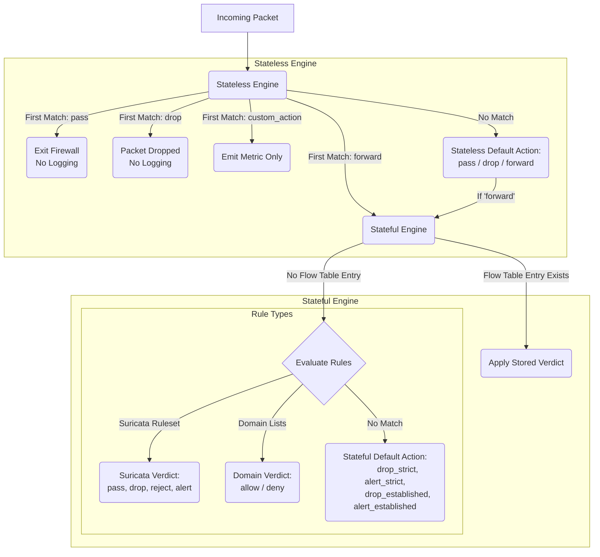

---

##  AWS Network Firewall – Packet Flow, Logging & Policy 

*Version: 2025-05-06 (Includes full inspection pipeline, logging outcomes, TLS caveats, and firewall component structure)*

AWS Network Firewall provides a two-stage inspection pipeline (Stateless and Stateful), supported by flexible rule groups and policies. It enables both low-latency packet filtering and deep protocol-aware inspection.

---

###  0. Core Firewall Components

AWS Network Firewall is built on modular objects that define how packets are inspected:

| Component           | Description                                                                                                                                                      |
| ------------------- | ---------------------------------------------------------------------------------------------------------------------------------------------------------------- |
| **Firewall Policy** | The master configuration object that binds stateless and stateful rule groups, default actions, logging settings, and stateful rule order (strict/action-order). |
| **Rule Groups**     | Containers for sets of rules (stateless or stateful). Multiple rule groups can be attached to a policy.                                                          |
| **Rules Source**    | The actual logic inside each rule group. Could be Suricata rules (stateful), domain lists, or stateless match conditions.                                        |
| **Stateless Rules** | Evaluated first; act like traditional ACLs. Fast, but not logged. Action = `pass`, `drop`, `forward`, or `custom_action`.                                        |
| **Stateful Rules**  | Evaluated only after stateless forward. Deep packet inspection using Suricata. Support for `pass`, `drop`, `reject`, and `alert`.                                |
| **Default Actions** | Define what happens if no rule matches: separate for stateless (per direction and fragment handling) and stateful (e.g., `drop_established`, `alert_strict`).    |

>  All rule groups are reusable and can be updated independently of the firewall policy.

---

### 1. Stateless Inspection – First Line of Defense

Every incoming packet hits the **Stateless Engine**:

* **Evaluation**: Stateless rule groups are processed in priority order.
* **First Match Wins**: As soon as a rule matches, action is executed.

**Outcomes:**

| Action          | Behavior                                                  | Logging                  |
| --------------- | --------------------------------------------------------- | ------------------------ |
| `pass`          | Allows packet to exit immediately.                        |  No Logs                |
| `drop`          | Silently discards packet.                                 |  No Logs                |
| `forward`       | Sends packet to stateful engine.                          |  Eligible              |
| `custom_action` | Emits metric; does not affect forwarding.                 |  Metric Only           |
| No match        | **Stateless Default Action** (pass/drop/forward) applied. |  *Based on setting |

>  Logging only happens **after forwarding to stateful**.

---

###  Visual: AWS Network Firewall Packet Processing Flow

*(See how Stateless and Stateful stages interact, and where logging occurs)*

### 2. Stateful Inspection – Deep Suricata Analysis

Packets forwarded from the Stateless Engine go through the Stateful Engine (Suricata-based):

* **Flow Table Check**: Existing sessions use cached verdict (pass/drop/reject).
* **New Flow Evaluation**: Rules evaluated by **Rule Order** (Strict AWS Recommended or Action).

#### Stateful Rule Types

* **Suricata IPS Rules**: Signature/payload matching (e.g., port scans, malware patterns). Custom Rules and AWS Managed Rules 
* **Domain Lists**: Matches on `TLS_SNI`, `HTTP_HOST`, certificate CN/SAN fields.
* **5-Tuple Matches**: Based on IPs, ports, and protocol.

#### Rule Order Options

| Mode       | Behavior                                                            |
| ---------- | ------------------------------------------------------------------- |
| **Strict** | Rules evaluated in defined order; first match applies. AWS Recommended              |
| **Action** | Grouped by action: pass → drop → reject → alert (less predictable). |

#### No Match Behavior

* **Action Order**: Implicit pass.
* **Strict Order**: Requires explicit default (e.g., `drop_strict`, `alert_established`).

>  AWS recommends `drop_established` or `alert_established` to allow visibility (e.g., SNI) before blocking unknown traffic.

---

### 3. Logging Behavior Summary

| Layer     | Action Type                 | Logs Generated   |
| --------- | --------------------------- | ---------------- |
| Stateless | pass / drop                 |  None           |
| Stateless | forward to stateful engine  |  Eligible depend on Stateful Action      |
| Stateful  | pass                        |  Flow Only      |
| Stateful  | drop / reject / alert       |  Flow +  Alert |
| Stateful  | domain deny                 |  Flow +  Alert |
| Stateful  | default drop/alert (strict) |  Flow +  Alert |

---

### AWS Firewall Domain-Based Allow/Deny list :

AWS Firewall Domain-based filters rely on metadata available early in the TLS/HTTP session.

| Field       | When Available           |
| ----------- | ------------------------ |
| `TLS_SNI`   | TLS Client Hello         |
| `HTTP_HOST` | HTTP request (plaintext) |

####  Works When

* Client uses **FQDN** (e.g., `curl https://www.google.com`)
* Client supports SNI (modern browsers/tools)
* No TLS termination upstream .

####  Breaks When

| Condition                                  | Why it Breaks                                           |
| ------------------------------------------ | ------------------------------------------------------- |
| Client connects by IP                      | No SNI — firewall sees only the IP                      |
| Legacy clients                             | SNI omitted in TLS Client Hello                         |
| QUIC / HTTP/3                              | Uses UDP — unsupported for SNI-based domain inspection  |
| Encrypted SNI (ESNI)                       | Future TLS feature — hides SNI entirely from inspection |

---

###  Final Takeaways

* Stateless: Fast ACL-style filtering. Use for known IPs, noise reduction, and routing logic.
* Stateful: Enables Suricata DPI, domain list filtering, protocol anomaly detection.
* **Use `alert_established` or `drop_established`** for both visibility and policy enforcement.
* **Rule Group Structure**: Use modular design — separate by rule type (e.g., DNS, TLS, IP Threats).
* All **logging and alerting** is generated **only at the stateful layer**.

---
