# AWS Networking for New Engineer

*A ground-up guide to VPCs, subnets, routing, firewalls, and Transit Gateway*

---

## How to Read This Guide

This guide is built in three layers. Read them in order — each one builds on the last.

| Part | Sections | What You Learn |
|------|----------|----------------|
| **Part 1: The Building Blocks** | 1–7 | Regions, AZs, VPCs, subnets, route tables, IGW, NAT |
| **Part 2: The Firewalls** | 8–10 | Security Groups vs NACLs |
| **Part 3: Putting It Together** | 11–17 | A real three-tier app, packet walkthroughs, and Transit Gateway |

**The core mental model:** think of AWS networking as building a small data center inside AWS.

```text
A private network       -> VPC
Different rooms         -> Subnets
Different buildings     -> Availability Zones
Road signs              -> Route tables
Main gate to internet   -> Internet Gateway
Outbound-only exit door -> NAT Gateway
Firewall on the device  -> Security Group
Firewall on the room    -> Network ACL
Router between offices  -> Transit Gateway
```

Keep this table nearby. Every concept below maps back to one of these lines.

---

# Part 1: The Building Blocks

## 1. Region and Availability Zone — Where Things Live

Before touching a VPC, you need to know AWS's physical geography.

### Region

A **Region** is a geographic AWS area — a cluster of data centers in one part of the world.

```text
us-east-1       (N. Virginia)
us-west-2       (Oregon)
us-gov-west-1   (GovCloud West)
```

**Key rule:** a VPC exists inside exactly one Region. It never spans Regions.

### Availability Zone (AZ)

An **Availability Zone** is an isolated data-center zone *inside* a Region — separate power, cooling, and networking.

```text
us-east-1a
us-east-1b
us-east-1c
```

You spread workloads across multiple AZs so that if one AZ fails, your application keeps running in another.

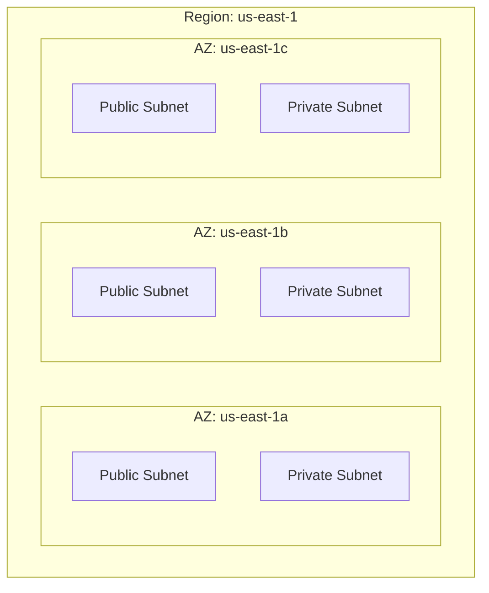

> **Remember:** Region = city. AZ = separate building in that city. If one building loses power, the others keep running.

---

## 2. VPC — Your Private Network in AWS

A **VPC** (Virtual Private Cloud) is your private, logically isolated network boundary inside AWS. Everything else in this guide lives inside a VPC.

When you create a VPC, you choose a private IP range, called a **CIDR block**:

```text
VPC CIDR: 10.0.0.0/16
```

The `/16` means the VPC owns all addresses from `10.0.0.0` to `10.0.255.255` — about 65,000 usable private IPs, such as:

```text
10.0.1.10
10.0.2.25
10.0.10.50
```

Inside the VPC you create everything else: subnets, route tables, gateways, EC2 instances, load balancers, databases, endpoints, and firewalls.

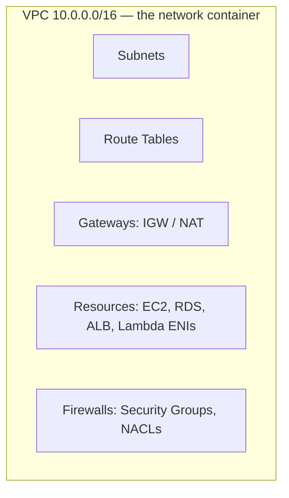

---

## 3. Subnet — A Smaller Network Inside the VPC

A **subnet** is a slice of the VPC's CIDR range.

```text
VPC: 10.0.0.0/16

Public subnet A:   10.0.1.0/24    (256 addresses)
Private subnet A:  10.0.2.0/24
Database subnet A: 10.0.3.0/24
```

**The one rule you must never forget:**

> A subnet lives in exactly **one** Availability Zone.

So for high availability, you create *matching* subnets in each AZ:

```text
AZ-1 (us-east-1a):          AZ-2 (us-east-1b):
  Public:  10.0.1.0/24        Public:  10.0.11.0/24
  Private: 10.0.2.0/24        Private: 10.0.12.0/24
  DB:      10.0.3.0/24        DB:      10.0.13.0/24
```

A helpful naming pattern: keep the *tier* consistent and shift the third octet per AZ (1x = AZ-1, 1x+10 = AZ-2). Patterns like this make route tables and firewall rules far easier to reason about later.

---

## 4. Route Table — The Traffic Decision Table

A **route table** answers one question for every packet leaving a subnet: *"Where do I send this next?"*

```text
Destination        Target
10.0.0.0/16        local
0.0.0.0/0          igw-12345
```

Read it like this:

- `10.0.0.0/16 -> local` — "Anything inside the VPC? Deliver it directly." Every route table has this, and resources in the VPC can always reach each other by private IP (subject to firewalls).
- `0.0.0.0/0 -> igw-12345` — "Everything else? Send it to the Internet Gateway." The `0.0.0.0/0` route is the **default route** — the catch-all for traffic that matches nothing more specific.

Routing always picks the **most specific match first** (longest prefix wins), and falls back to `0.0.0.0/0` last.

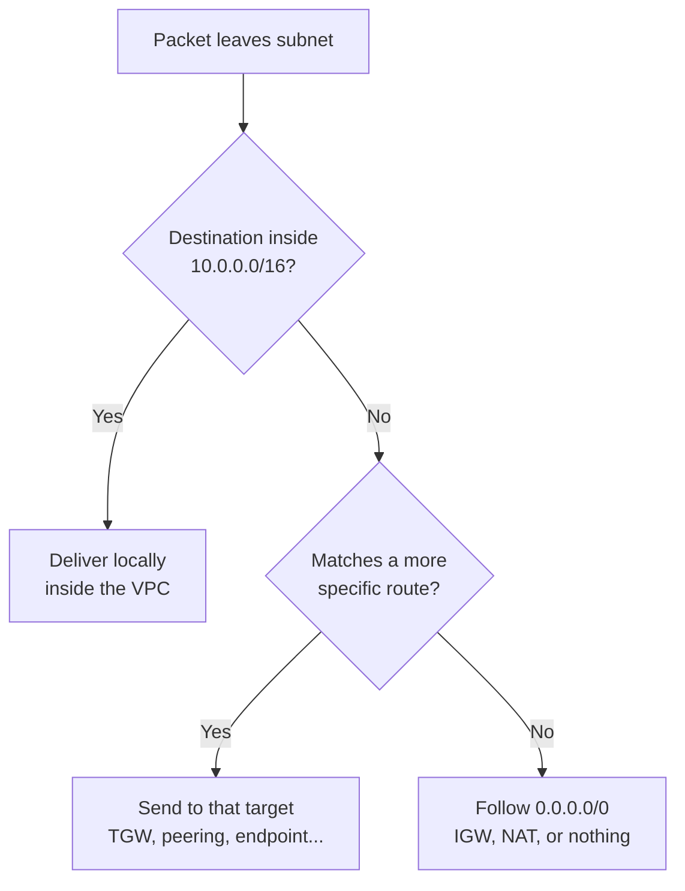

---

## 5. Public vs Private vs Isolated Subnets

This is one of the most important concepts in AWS networking — and the most common source of confusion.

> **A subnet is not public because of its name. A subnet is public because its route table has a route to an Internet Gateway.**

The *only* difference between the three subnet types is the default route:

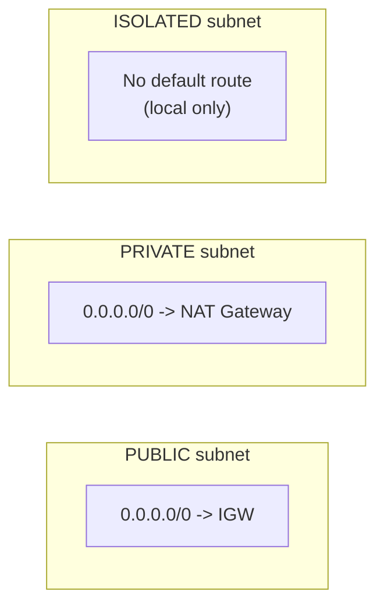

### Public Subnet

```text
10.0.0.0/16   -> local
0.0.0.0/0     -> Internet Gateway
```

Resources here can route directly to and from the internet (if they also have a public IP).

**Typical residents:** Application Load Balancer, Network Load Balancer, NAT Gateway, bastion host.

### Private Subnet

```text
10.0.0.0/16   -> local
0.0.0.0/0     -> NAT Gateway
```

Resources can *initiate* outbound internet connections through NAT, but the internet **cannot** initiate connections to them.

**Typical residents:** EC2 application servers, ECS tasks, Lambda ENIs, internal services.

### Isolated Subnet

```text
10.0.0.0/16   -> local
```

No internet path at all — in or out.

**Typical residents:** databases, sensitive internal services.

### Quick Comparison

| | Public | Private | Isolated |
|---|--------|---------|----------|
| Internet can reach it | Yes (with public IP) | No | No |
| It can reach internet | Yes | Yes, via NAT | No |
| Default route target | IGW | NAT Gateway | None |
| Typical workload | ALB, NAT, bastion | App servers | Databases |

---

## 6. Internet Gateway — The Internet Door

An **Internet Gateway (IGW)** connects a VPC to the internet. One IGW attaches to one VPC.

For an EC2 instance to be reachable *from* the internet, you need all three:

```text
1. The VPC has an Internet Gateway attached
2. The subnet's route table has 0.0.0.0/0 -> IGW
3. The instance has a public IPv4 address or Elastic IP
```

Miss any one of the three, and inbound internet traffic cannot reach the instance. The IGW also performs one-to-one NAT between an instance's public IP (what the internet sees) and its private IP (what the VPC sees).

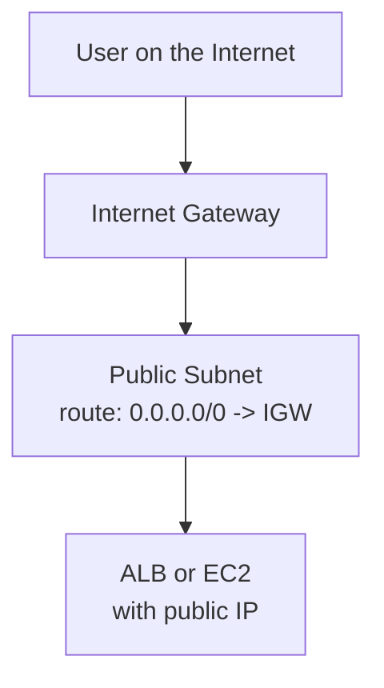

---

## 7. NAT Gateway — Outbound-Only Internet for Private Subnets

A **NAT Gateway** lets private-subnet resources *initiate* outbound internet connections while blocking unsolicited inbound connections.

**Why private instances still need the internet:**

```text
EC2 downloads OS patches
ECS pulls container images
App calls an external API
Instance reaches yum/apt repositories
```

**The critical placement rule:**

> A public NAT Gateway lives in a **public subnet** and uses an Elastic IP. The private subnet only *points* at it.

This trips up almost every new engineer. The NAT Gateway itself needs a path to the IGW — that's why it sits in the public subnet.

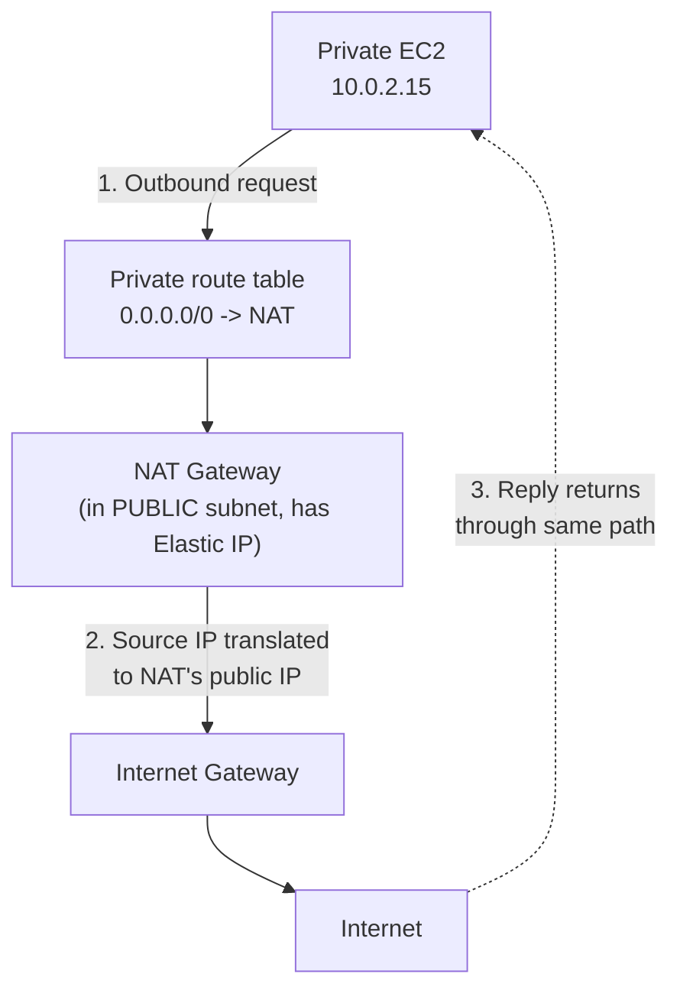

So the standard pattern is:

```text
Public subnet:   ALB + NAT Gateway
Private subnet:  App EC2 / ECS / Lambda
```

> **IGW vs NAT in one line:** IGW is a two-way door for public resources. NAT is a one-way (outbound-initiated) door for private resources.

---

# Part 2: The Firewalls

AWS gives you two firewall layers. Traffic to an instance passes through **both** — first the subnet's NACL, then the resource's Security Group.

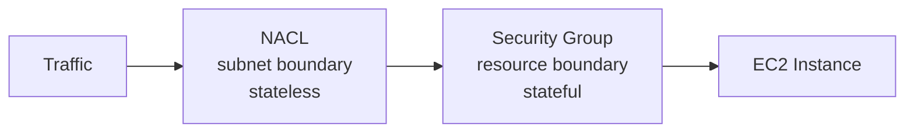

## 8. Security Group — The Firewall on the Resource

A **Security Group (SG)** attaches to a resource's network interface — EC2, ENI, load balancer, RDS, etc.

**Security Groups are stateful:**

```text
If an inbound request is allowed,
the response traffic is automatically allowed back out.
You never write a rule for return traffic.
```

**Security Groups only have allow rules.** Anything not explicitly allowed is denied. There is no "deny" rule.

**The killer feature — referencing other Security Groups:** instead of allowing an IP range, you allow *another security group* as the source. This means "allow traffic from anything wearing that badge," and it keeps working even as instances scale up and down.

Example web tier:

```text
ALB security group:
  Inbound:  TCP 443 from 0.0.0.0/0
  Outbound: all

App server security group:
  Inbound:  TCP 8080 from [ALB security group]   <- SG reference, not an IP
  Outbound: all

Database security group:
  Inbound:  TCP 5432 from [App security group]
  Outbound: restricted
```

## 9. NACL — The Firewall on the Subnet

A **Network ACL (NACL)** sits at the subnet boundary and applies to *all* traffic entering or leaving the subnet.

**NACLs are stateless:**

```text
If inbound traffic is allowed,
you must ALSO explicitly allow the outbound response traffic.
The NACL has no memory of the original request.
```

This is why NACL rules almost always include the **ephemeral port range** (`1024–65535`) — that's where response traffic goes back to the client.

NACLs support both **allow and deny** rules, evaluated in rule-number order (lowest first, first match wins):

```text
Inbound:
100  ALLOW  TCP 443  from 0.0.0.0/0
110  DENY   ALL      from 203.0.113.0/24    <- block a known-bad CIDR
*    DENY   ALL                              <- implicit final deny

Outbound:
100  ALLOW  TCP 1024-65535  to 0.0.0.0/0    <- ephemeral ports for responses
*    DENY   ALL
```

**In practice:** Security Groups are your primary, day-to-day firewall. NACLs are coarse subnet-level guardrails and defense-in-depth — most commonly used to *deny* specific bad ranges, which SGs cannot do.

## 10. Security Group vs NACL — Side by Side

| Feature | Security Group | NACL |
|---------|----------------|------|
| Applied to | ENI / resource | Subnet boundary |
| Stateful? | **Yes** — return traffic auto-allowed | **No** — return traffic needs explicit rules |
| Rule types | Allow only | Allow **and** deny |
| Rule evaluation | All rules evaluated together | Numbered order, first match wins |
| Can reference other SGs? | Yes | No — CIDR only |
| Best use | Instance/app-level access control | Subnet-level guardrail, explicit blocks |

**The visual difference between stateful and stateless:**

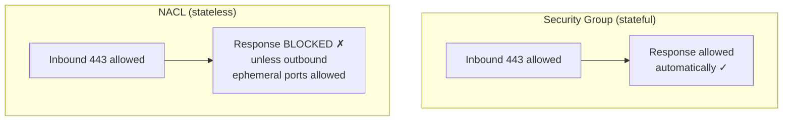

**Memory hook:**

```text
Security Group = firewall on the device   (stateful, allow-only)
NACL           = firewall on the room     (stateless, allow + deny)
```

---

# Part 3: Putting It Together

## 11. A Real Three-Tier Application

Here's how everything combines into the most common AWS design pattern:

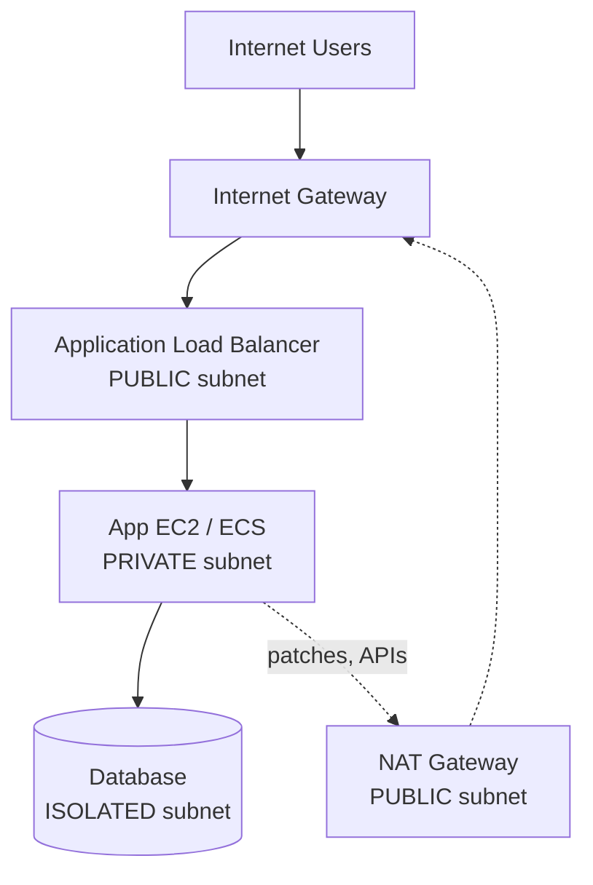

**Route tables:**

| Subnet | Default Route | Meaning |
|--------|---------------|---------|
| Public | `0.0.0.0/0 -> IGW` | Internet-facing |
| Private (app) | `0.0.0.0/0 -> NAT` | Outbound internet only |
| Isolated (DB) | *(none)* | No internet at all |

**Security groups — each tier only trusts the tier above it:**

| Component | Inbound Rule |
|-----------|--------------|
| ALB | TCP 443 from internet (`0.0.0.0/0`) |
| App server | App port from **ALB security group** only |
| Database | DB port from **App security group** only |

Notice the chain: internet can only talk to the ALB, the ALB can only talk to the app, the app can only talk to the database. Each layer narrows access.

## 12. Packet Walkthrough: Inbound Request

A user opens `https://app.example.com`. Follow one packet:

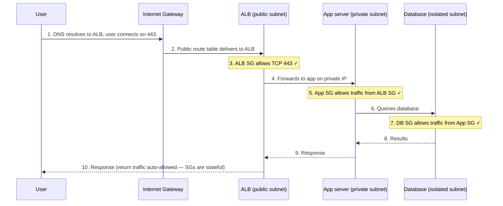

> **Key insight:** the app server never needs a public IP. Users connect to the ALB; the ALB connects to the app over private IPs inside the VPC.

## 13. Packet Walkthrough: Outbound Request

The private app server downloads OS patches:

```text
1. App server (10.0.2.15) sends traffic to a repo on the internet.
2. Private route table: 0.0.0.0/0 -> NAT Gateway.
3. NAT Gateway rewrites the source IP to its public Elastic IP.
4. NAT sends the traffic out through the Internet Gateway.
5. The repo replies to the NAT's public IP.
6. NAT remembers the connection and forwards the reply back to 10.0.2.15.
```

The private instance can *start* conversations with the internet. The internet can never *start* a conversation with the private instance — the NAT only forwards replies to connections that originated inside.

## 14. The Multi-VPC Problem — Why Transit Gateway Exists

One VPC is easy. But real environments grow:

```text
Security VPC
Shared Services VPC
Logging VPC
Mission Owner A VPC
Mission Owner B VPC
Mission Owner C VPC
```

**Option 1: VPC peering everywhere.** If every VPC must talk to every other VPC, peering becomes a full mesh:

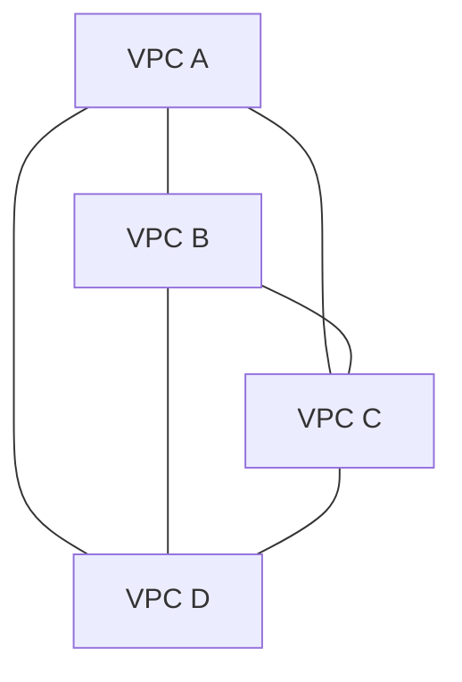

Four VPCs need 6 links. Ten VPCs need **45**. The mesh brings real problems:

```text
Too many peering links to manage
Route tables sprawl in every VPC
No way to centralize traffic inspection
Hard to connect on-prem once for all VPCs
No hub-and-spoke control point
```

**Option 2: Transit Gateway.** A **Transit Gateway (TGW)** is a Regional virtual router — a central hub. Each VPC attaches *once*:

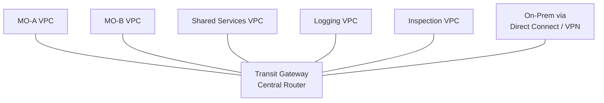

Ten VPCs, ten attachments. And the TGW — not each VPC — decides who can talk to whom.

## 15. What Transit Gateway Gives You

**1. Hub-and-spoke networking.** Each VPC attaches once. No mesh.

**2. Centralized inspection** *(the backbone of SCCA-style architectures)*. Force all traffic through an inspection VPC running AWS Network Firewall:

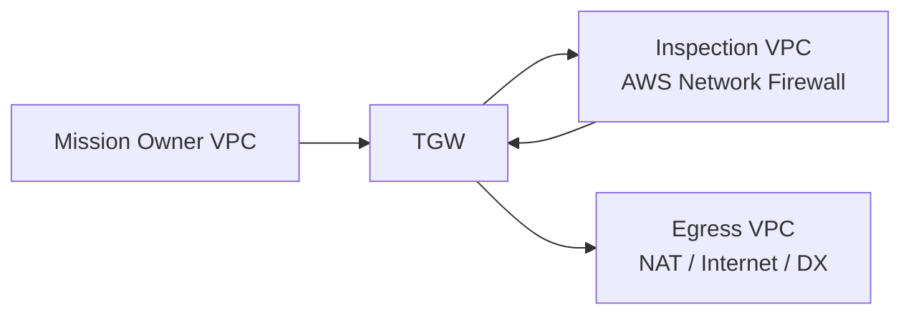

This enables patterns like:

```text
MO VPC   -> TGW -> Inspection -> Egress -> Internet
Internet -> Ingress -> TGW -> Inspection -> MO VPC
MO-A     -> TGW -> Inspection -> MO-B      (even east-west!)
```

**3. Centralized egress.** Instead of a NAT Gateway per VPC, all VPCs share one inspected, logged egress path.

**4. Centralized shared services.** Every spoke VPC reaches DNS, Active Directory, patch repos, SSM endpoints, logging, and monitoring through one hub.

**5. Segmentation via TGW route tables.** The TGW's own route tables let you write policy like:

```text
MO-A can reach Shared Services
MO-A CANNOT reach MO-B
All MOs must transit Inspection to reach the internet
```

This is the multi-account security control point.

## 16. How TGW Route Tables Work

Think of TGW route tables as routing *policies* on the central router. Each attachment is associated with one route table, and different attachments can see different routes:

```text
MO Route Table (spokes use this):
  Shared Services CIDR -> Shared Services attachment
  0.0.0.0/0            -> Inspection VPC attachment

Inspection Route Table (firewall return path):
  MO-A CIDR  -> MO-A attachment
  MO-B CIDR  -> MO-B attachment
  0.0.0.0/0  -> Egress VPC attachment
```

Note what's *missing* from the MO route table: there is no route from MO-A to MO-B. Segmentation by omission.

Full inspected-egress flow:

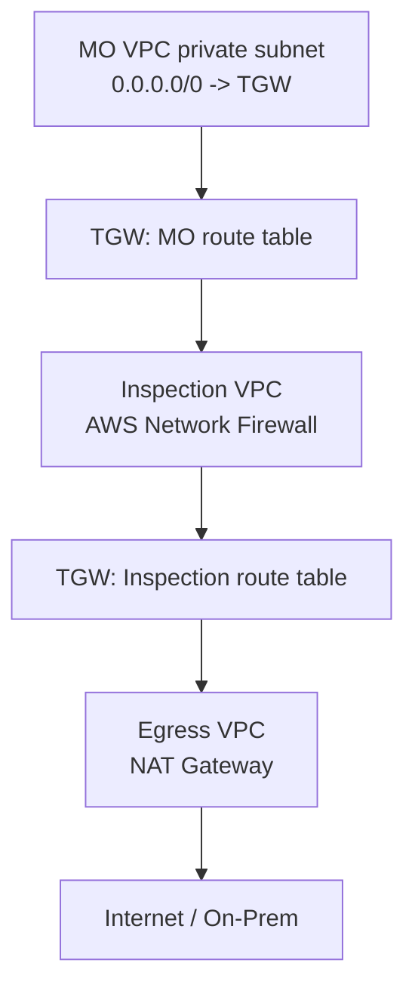

## 17. The Three Default Routes — Exam-Critical Summary

Everything about a subnet's personality comes down to its default route:

| Default Route | Subnet Type | Used For |
|---------------|-------------|----------|
| `0.0.0.0/0 -> IGW` | Public | ALB, NLB, NAT Gateway, bastion |
| `0.0.0.0/0 -> NAT` | Private | App servers, ECS, private EC2 |
| `0.0.0.0/0 -> TGW` or none | Isolated / inspected | Databases, SCCA workloads, on-prem-only |

---

## 18. Common Mistakes (and Why They Hurt)

| Mistake | Why It's a Problem |
|---------|--------------------|
| Calling a subnet "public" because of its name | Public/private is determined by the route table, not the name |
| Putting app servers in a public subnet | Exposes them to the internet unnecessarily |
| Giving private EC2 instances public IPs | Can silently bypass the intended private design |
| Putting a NAT Gateway in a private subnet | A public NAT Gateway needs a public subnet with an IGW path |
| Allowing `0.0.0.0/0` inbound in a Security Group | Opens the resource to the entire world |
| Forgetting ephemeral ports in NACL outbound rules | Breaks return traffic — NACLs are stateless |
| Full-mesh VPC peering at scale | Unmanageable routes, no central inspection point |
| One shared TGW route table for everything | All attachments can accidentally reach each other |

---

## 19. Full Reference Architecture

Single-VPC, single-AZ view (repeat the subnets per AZ in production):

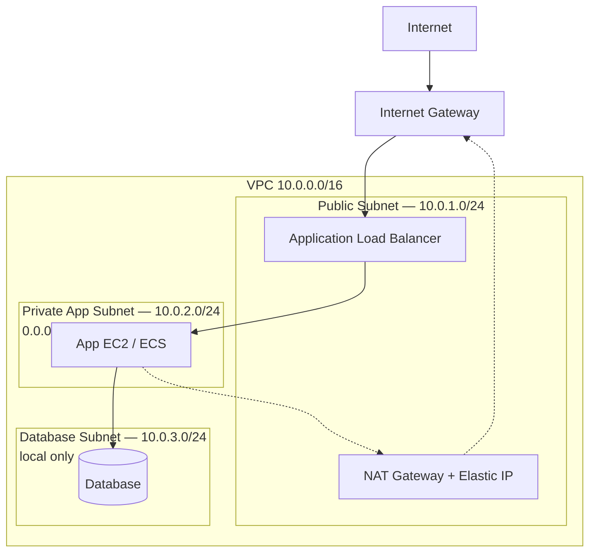

---

## 20. Final Cheat Sheet

```text
VPC             = your private network in AWS (one Region)
AZ              = separate physical zone; spread across 2+ for HA
Subnet          = IP slice of the VPC, inside exactly one AZ
Route table     = decides where each packet goes next
Public subnet   = default route -> Internet Gateway
Private subnet  = default route -> NAT Gateway
Isolated subnet = no default route (local only)
IGW             = two-way internet door for public resources
NAT Gateway     = outbound-only door; lives in a PUBLIC subnet
Security Group  = stateful, allow-only firewall on the resource
NACL            = stateless, allow+deny firewall on the subnet
TGW             = central router connecting many VPCs, accounts, on-prem
```

And the single simplest way to remember Transit Gateway:

> **A VPC is one network. A Transit Gateway connects many networks.**

For one VPC: route tables, IGW, NAT, Security Groups, and NACLs are enough.
For many VPCs, many accounts, centralized inspection, shared services, and on-premises connectivity: **Transit Gateway is the hub that makes it scalable and controllable.**

---

## Further Reading (AWS Docs)

- [What is Amazon VPC?](https://docs.aws.amazon.com/vpc/latest/userguide/what-is-amazon-vpc.html)
- [Route table options](https://docs.aws.amazon.com/vpc/latest/userguide/route-table-options.html)
- [Internet gateways](https://docs.aws.amazon.com/vpc/latest/userguide/VPC_Internet_Gateway.html)
- [NAT devices](https://docs.aws.amazon.com/vpc/latest/userguide/vpc-nat.html)
- [NAT gateways](https://docs.aws.amazon.com/vpc/latest/userguide/vpc-nat-gateway.html)
- [Network ACLs](https://docs.aws.amazon.com/vpc/latest/userguide/vpc-network-acls.html)
- [What is AWS Transit Gateway?](https://docs.aws.amazon.com/vpc/latest/tgw/what-is-transit-gateway.html)
