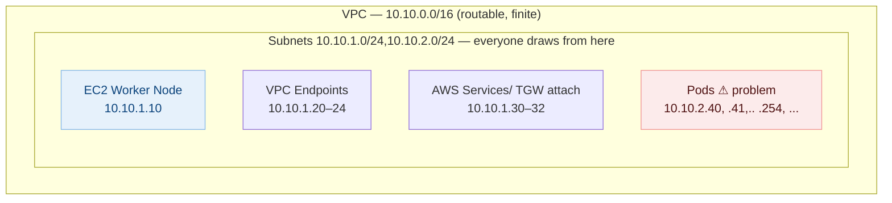
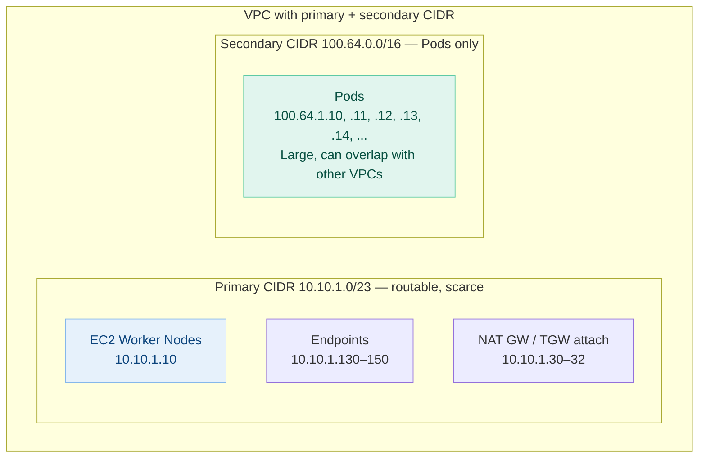
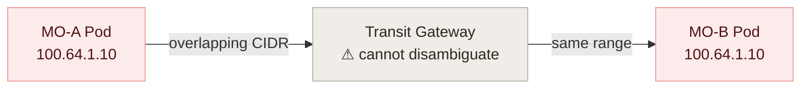
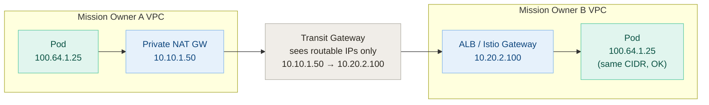
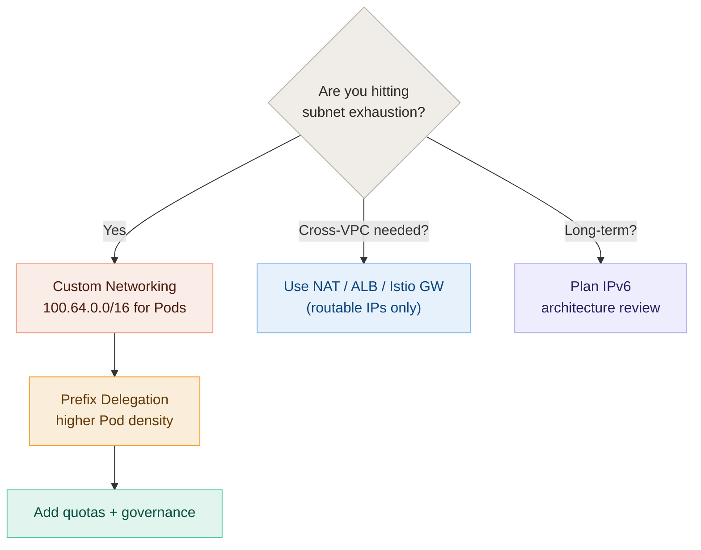

# Avoiding IPv4 Exhaustion on EKS / Istio

**Audience:** Mission Owners running EKS on AWS, with or without Istio

**Goal:** Explain the problem, the recommended pattern, and the trade-offs — in one short read.

**Companion file:** `eks-ip-exhaustion-implementation.md` (step-by-step config + verification commands)

---

## TL;DR

| Concern | Answer |
|---|---|
| **What causes EKS IP exhaustion?** | The AWS VPC CNI assigns each Pod a real VPC IP from your routable CIDR. |
| **Does Istio make it worse?** | No. The sidecar shares the Pod IP — no extra IP is consumed. |
| **What's the near-term fix?** | CNI **Custom Networking** (Pods on `100.64.0.0/10`) + **Prefix Delegation**. |
| **What about cross-VPC traffic?** | Never route overlapping Pod CIDRs directly. Use NAT, ALB/NLB, or an Istio Gateway. |
| **What's the long-term direction?** | IPv6. Strategic, but needs full architecture review. |

---

## 1. The Problem

By default, every Pod consumes a VPC IP from the **same routable subnet** as your nodes, load balancers, NAT gateways, and VPC endpoints. Multiply by hundreds of Pods per cluster, across many Mission Owners, and even `10.0.0.0/8` runs thin. Following is Sample VPC 



**Math that hurts:** 100 Pods × 20 nodes ≈ 2,000 routable IPs gone — before counting warm pools, ENIs, LBs, and endpoints.

**Istio note:** Pods with an Istio sidecar still get **one** IP — the sidecar container shares the Pod's network namespace. Istio is not the cause of IP exhaustion.

```
┌─────────────────── Pod (one IP) ───────────────────┐
│   ┌──────────────────┐    ┌────────────────────┐   │
│   │  App container   │    │  Istio sidecar     │   │
│   │  (nginx, etc.)   │    │  (envoy proxy)     │   │
│   └──────────────────┘    └────────────────────┘   │
│             shared Pod IP: 10.10.1.40              │
└────────────────────────────────────────────────────┘
```

---

## 2. The Recommended Pattern

Move Pod IPs out of your routable VPC space into the shared address block `100.64.0.0/10` (RFC 6598, "Carrier-Grade NAT space"). Nodes and infrastructure keep their routable `10.x.x.x` addresses; Pods get throwaway space that doesn't need to be unique across the org.



### Companion fix: Prefix Delegation

Custom Networking *moves* Pod IPs out of the routable space. **Prefix Delegation** *increases how many Pods fit per node* by handing each ENI a `/28` (16 IPs) at a time instead of single secondary IPs.

| Feature | What it does | Use together? |
|---|---|---|
| Custom Networking | Pod IPs come from secondary `100.64.x.x` CIDR | **Yes** |
| Prefix Delegation | One `/28` per attach call → higher Pod density per node | **Yes** |
| IPv6 | Eliminates IPv4 scarcity at the protocol level | Long-term path |

---

## 3. Cross-Mission-Owner Communication — the Important Caveat

`100.64.x.x` is reusable **only** if it stays local. If Mission Owner A and Mission Owner B both use `100.64.1.0/24` for Pods and you try to route directly across a Transit Gateway, TGW cannot distinguish them. Direct Pod-to-Pod won't work.

### ✗ What does NOT work



**Why it fails:** TGW route tables match on destination CIDR. With identical Pod CIDRs on both sides, there is no way to express "send `100.64.1.10` to MO-B but not MO-A."

### ✓ What works — translate at the edge

Cross-VPC traffic must leave through a routable address: a Private NAT Gateway, ALB/NLB, or an Istio Gateway. The other side receives traffic from a routable IP and forwards it to its local Pod.



**Rule of thumb:** if a packet leaves the VPC, its source and destination must be in routable space.

---

## 4. Address-Space Design at a Glance

| Layer | CIDR | Must be unique org-wide? | Sized for |
|---|---|---|---|
| Nodes, ALB/NLB, NAT GW, VPC endpoints, TGW | `10.x.x.x` (routable) | **Yes** | Infrastructure only — small allocation |
| Pods | `100.64.0.0/10` (RFC 6598) | No — can overlap across isolated VPCs | The bulk of your addresses |
| Future state | IPv6 dual-stack | Globally unique | Removes IPv4 scarcity entirely |

### Example: three Mission Owners, overlapping Pod space

```
MO-A:  routable 10.10.0.0/20   Pods 100.64.0.0/16
MO-B:  routable 10.20.0.0/20   Pods 100.64.0.0/16
MO-C:  routable 10.30.0.0/20   Pods 100.64.0.0/16
```

Safe **as long as** the overlapping Pod ranges are never advertised across the TGW.

---

## 5. Implementation Path — High Level

Details, YAML, and verification commands are in `eks-ip-exhaustion-implementation.md`.

```mermaid
flowchart LR
    S1["1. Add secondary<br/>VPC CIDR"] --> S2["2. Create Pod<br/>subnets per AZ"]
    S2 --> S3["3. Enable<br/>Custom Networking"]
    S3 --> S4["4. Create<br/>ENIConfig per AZ"]
    S4 --> S5["5. Enable<br/>Prefix Delegation"]
    S5 --> S6["6. Replace<br/>nodes"]
    S6 --> S7["7. ✓ Verify"]

    classDef vpc fill:#e6f1fb,stroke:#85b7eb,color:#0c447c
    classDef cni fill:#faece7,stroke:#f0997b,color:#4a1b0c
    classDef density fill:#faeeda,stroke:#ef9f27,color:#633806
    classDef nodes fill:#eeedfe,stroke:#afa9ec,color:#26215c
    classDef done fill:#e1f5ee,stroke:#5dcaa5,color:#085041
    class S1,S2 vpc
    class S3,S4 cni
    class S5 density
    class S6 nodes
    class S7 done
```



1. **Add a secondary CIDR** (`100.64.0.0/16`) to the VPC.
2. **Create one Pod subnet per AZ** from that secondary CIDR.
3. **Enable Custom Networking** on the `aws-node` DaemonSet.
4. **Create one ENIConfig per AZ** mapping the AZ label to its Pod subnet.
5. **Enable Prefix Delegation** for higher Pod density per node.
6. **Replace nodes** (new nodes pick up the new config; existing Pods don't migrate automatically).
7. **Verify** Pod IPs land in `100.64.x.x` and node IPs stay in `10.x.x.x`.

---

## 6. Governance — the Non-Technical Half

Technical conservation alone is not enough. A single deployment can still scale out and burn Pod IPs. Layer in:

- **ResourceQuota** per namespace — cap pods, services, PVCs
- **LimitRange** per namespace — default container requests/limits
- **Cluster Autoscaler / Karpenter** node ceilings
- **Dedicated node groups and secondary CIDRs** per Mission Owner where isolation matters
- **A clear IPAM ownership model** — someone owns who gets which routable block

---

## 7. IPv6 — Strategic, but Not a Quick Win

IPv6 ends IPv4 scarcity at the protocol level. It is the right long-term direction.

It is **not** a near-term fix. Before flipping to dual-stack or IPv6-first EKS, evaluate:

- VPC, TGW, and route table design
- AWS Network Firewall and ingress/egress inspection
- Istio / Envoy IPv6 support and config
- Application IPv6 compatibility (libraries, hardcoded `127.0.0.1` and `0.0.0.0` assumptions)
- DNS strategy (AAAA records, dual-stack resolvers)
- Security tooling, logging, SIEM, and allowlists
- On-prem and DoD connectivity
- Operational runbooks and troubleshooting muscle memory

**Position:** plan for IPv6, but solve today's pain with Custom Networking + Prefix Delegation.

---

## 8. Decision Cheat-Sheet



---

## Key Points to Take Away

- **Pods consume routable VPC IPs by default.** That is the root cause.
- **Istio is innocent.** Sidecar shares the Pod IP.
- **Custom Networking** moves Pods to `100.64.0.0/10` and conserves routable space.
- **Prefix Delegation** improves Pod density and IP allocation efficiency.
- **Overlapping `100.64`** is fine *only if it stays inside the VPC*. Cross-VPC traffic must use routable IPs via NAT, ALB/NLB, or an Istio Gateway.
- **IPv6** is the strategic answer — plan it, but don't wait for it.
- **Governance** (quotas, IPAM, node-group caps) is half the solution.

---

*See `eks-ip-exhaustion-implementation.md` for step-by-step configuration, ENIConfig YAML, prefix-delegation toggles, and verification commands.*
