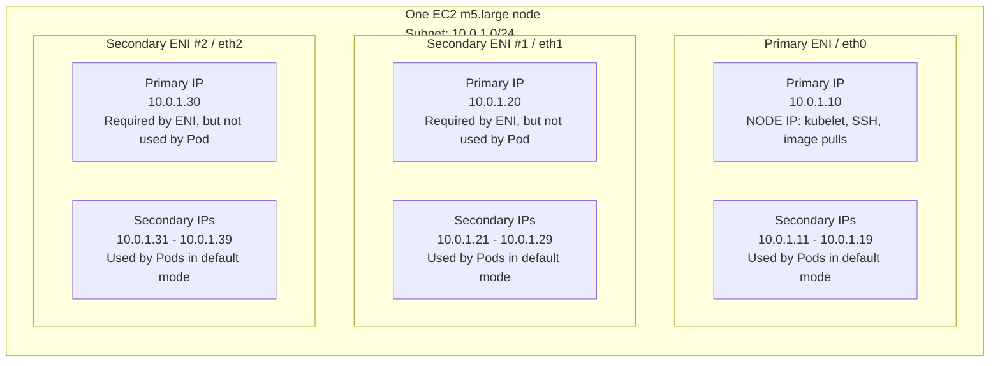
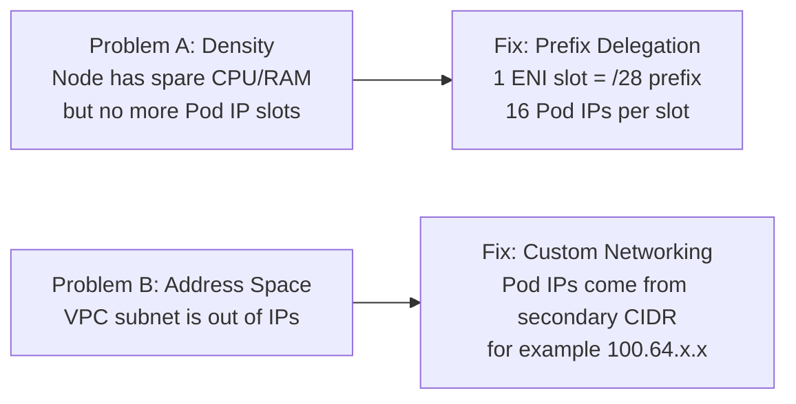
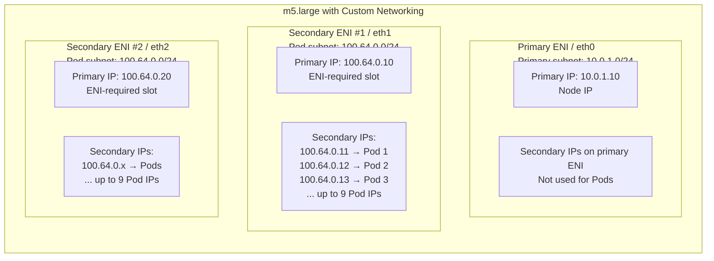
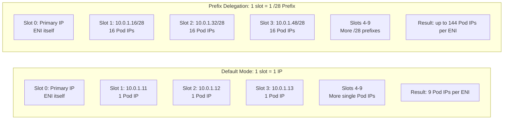
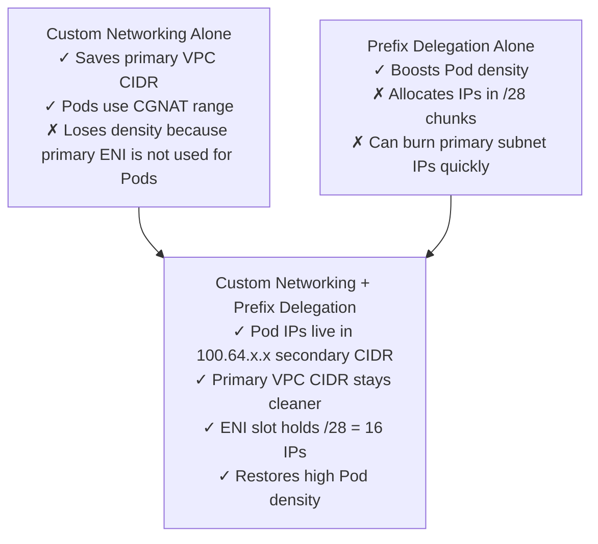

# EKS VPC CNI — Clearing the Confusion

## The root of the confusion: "primary" means two different things

The word **primary** appears in two completely separate contexts. Mixing them up is why this feels confusing.

| Term | What it means | Scope |
|---|---|---|
| **Primary ENI** | The first network card of the EC2 instance (eth0). One per node. Cannot be detached. | One per **node** |
| **Primary IP (of an ENI)** | The first IP address on any given ENI. Every ENI has one. | One per **ENI** |

So a node with 3 ENIs has:
- **1 Primary ENI** (the first network card)
- **2 Secondary ENIs** (the additional network cards)
- **3 Primary IPs total** — one on each ENI (each ENI has its own primary IP)

This is the single most important thing to internalize. Let's draw it.

---

## Part 1 — Anatomy of one EC2 node (m5.large example)

An m5.large can attach **up to 3 ENIs**. Each ENI can hold **up to 10 IP addresses**. Let me show you what those IPs are actually called.



**Diagram summary:**

| ENI | Primary IP | Primary IP purpose | Secondary IPs |
|---|---:|---|---|
| Primary ENI / eth0 | `10.0.1.10` | Node IP | Pods |
| Secondary ENI #1 / eth1 | `10.0.1.20` | ENI-required slot, effectively wasted for Pods | Pods |
| Secondary ENI #2 / eth2 | `10.0.1.30` | ENI-required slot, effectively wasted for Pods | Pods |


### Read this diagram carefully — it answers your question directly

**Yes, the node uses the Primary IP** — but specifically **only one** Primary IP: the one on the Primary ENI.

Look at the boxes:

| ENI | Primary IP | Who uses Primary IP? | Secondary IPs |
|---|---|---|---|
| **Primary ENI** | 10.0.1.10 | **THE NODE** (kubelet, SSH, image pulls) | Given to pods |
| **Secondary ENI #1** | 10.0.1.20 | **Nobody** — wasted slot | Given to pods |
| **Secondary ENI #2** | 10.0.1.30 | **Nobody** — wasted slot | Given to pods |

**Why are the secondary ENIs' primary IPs "wasted"?** Because AWS requires every ENI to have a primary IP for the ENI itself to exist on the network — but only the node actually uses one of them. The other two primary IPs just sit there, doing nothing, but still counting against your IP slots.

---

## Part 2 — So how many pods can fit? (the math, finally)

For an m5.large with default VPC CNI:

```
Total IP slots = 3 ENIs × 10 IPs per ENI = 30 IP slots

Wasted on ENI primary IPs = 3 (one per ENI)
                              ↑
                              Of these 3:
                              • 1 is also the node IP (Primary ENI's primary IP)
                              • 2 are pure waste (Secondary ENIs' primary IPs)

Available for pods = 30 − 3 = 27 pod IPs

Then the CNI reserves a bit more for itself, so AWS publishes a "max pods = 29" 
for m5.large (the actual calculator does slightly different bookkeeping, but the 
principle — every ENI burns one slot — is correct).
```

**The key insight:** the more ENIs you add for more capacity, the more primary-IP slots you waste. There's no way around it in default mode. This is exactly the inefficiency prefix delegation fixes.

---

## Part 3 — The two completely different problems

Before talking about the solutions, let me state the two problems as cleanly as I can. They are not the same problem.

### Problem A — "Density problem"

> **My node has spare CPU and memory, but I can't schedule more pods on it because it ran out of IPs.**

This happens because AWS limits how many IPs each ENI can hold, and each ENI wastes one slot on its primary IP. On m5.large you get only 27 pod slots — but the node could comfortably run 40+ small pods if only it had more IPs.

**You are wasting compute. Not VPC IP space.**

### Problem B — "Address-space problem"

> **My VPC subnet is too small to hold all the pod IPs I need across my whole fleet.**

This happens when companies have a small slice of corporate IP space (say, a `/22` = 1024 IPs). After ~30 nodes, you've burned the whole `/22` and you can't add more nodes — not because the nodes are full, but because the *VPC subnet* is full.

**You are wasting nodes. Not compute per node.**

### Side-by-side

| Comparison point | Problem A — Density | Problem B — Address space |
|---|---|---|
| Symptom | Node still has free CPU/RAM, but cannot schedule more Pods | Whole subnet/VPC CIDR is running out of IPs |
| Bottleneck location | Inside one node: ENI/IP-slot limits | Across the VPC/subnet: total available CIDR space |
| Example | m5.large has spare compute but no more Pod IP slots | A `/22` subnet is exhausted after enough nodes/Pods |
| What is wasted? | Compute capacity on nodes | Growth capacity in the VPC |
| Main fix | Prefix delegation | Custom networking |




Now let's look at each solution in detail.

---

## Part 4 — Custom Networking explained from scratch

You said you understand this, but let me restate it precisely so it lines up with the new vocabulary.

**What it does:** Pod IPs no longer come from the node's subnet. They come from a **completely different subnet** in a **secondary VPC CIDR** (typically `100.64.0.0/16` from the CGNAT range).

### How the ENIs change



**Custom networking effect:**

| Component | Default networking | Custom networking |
|---|---|---|
| Primary ENI primary IP | Node IP | Node IP |
| Primary ENI secondary IPs | Used by Pods | Not used by Pods |
| Secondary ENIs | Same subnet as node | Different subnet from secondary VPC CIDR |
| Pod IP range | Primary subnet, for example `10.0.1.0/24` | Secondary subnet, for example `100.64.0.0/24` |


### What changed?

| | Default | Custom Networking |
|---|---|---|
| **Primary ENI's primary IP** | Node IP | Node IP (same) |
| **Primary ENI's secondary IPs** | Used for pods | **Not used for pods** |
| **Secondary ENIs** | In same subnet as Primary ENI | **In a different, secondary subnet** |
| **Where do pod IPs come from?** | Primary subnet (10.0.1.0/24) | Secondary subnet (100.64.0.0/24) |

### So your specific question: does the node still use its Primary IP?

**Yes — completely unchanged.** The Primary ENI is still there, its Primary IP is still 10.0.1.10, and the node still uses it for kubelet, SSH, container image pulls, and outbound pod traffic (via SNAT). Custom networking does NOT change anything about the Primary ENI's role for the node.

What changes: the Primary ENI **stops sharing its secondary IPs with pods**. Pods only get IPs from the new Secondary ENIs in the 100.64.0.0/16 subnet.

### Pod density cost

Look at the diagram — you now get pods from 2 ENIs instead of 3. So:

```
Default mode:           3 ENIs × 9 pod IPs = 27 pods
Custom networking:      2 ENIs × 9 pod IPs = 18 pods (you lost ~9 slots!)
```

This is the painful tradeoff custom networking forces on you — and exactly what prefix delegation fixes.

---

## Part 5 — Prefix Delegation explained from scratch

The core idea, restated as simply as possible:

> **An "IP slot" on an ENI doesn't have to hold just 1 IP. With prefix delegation, each slot holds 16 IPs.**

Same number of ENIs. Same number of slots per ENI. But now each slot is a `/28` (16 IPs) instead of one IP.



**Prefix delegation effect:**

| Item | Default mode | Prefix delegation |
|---|---:|---:|
| ENI count | Same | Same |
| IP slots per ENI | Same | Same |
| Primary IP per ENI | Yes | Yes |
| Secondary slot contents | 1 secondary IP | 1 `/28` prefix |
| Pod IPs per secondary slot | 1 | 16 |
| Pod IPs per ENI, ignoring practical caps | 9 | 144 |


### Why this fixes the density problem

Look at what's the same and what changed:

| | Default | Prefix Delegation |
|---|---|---|
| ENI count | 3 | 3 (same!) |
| Slots per ENI | 10 | 10 (same!) |
| Primary IP per ENI | Yes | Yes (same!) |
| What's in each secondary slot | 1 IP | **16 IPs (a `/28` prefix)** |
| Pod IPs per ENI | 9 | **144** |

The ENI hardware limits didn't change. AWS didn't give you more ENIs or more slots. They just let you **stuff 16 IPs into each slot**.

### Walk-through: how a pod gets an IP with prefix delegation

A fresh m5.large node boots. A pod gets scheduled. Here's what happens:

1. **kubelet** asks the VPC CNI for an IP.
2. **CNI** has no IPs in its warm pool yet. It calls `AssignPrivateIpAddresses` on the Primary ENI with `Ipv4PrefixCount: 1`.
3. **EC2** allocates a contiguous `/28` from the subnet — say `10.0.1.32/28`. That's IPs `10.0.1.32` through `10.0.1.47` (16 addresses).
4. **CNI** gives the pod the first IP in the prefix: `10.0.1.32`.
5. **Pod 2 schedules.** CNI hands out `10.0.1.33` from the same prefix — **no EC2 API call needed**.
6. **Pods 3–16 schedule.** Each gets the next IP from the prefix. Still no EC2 API calls.
7. **Pod 17 schedules.** The prefix is exhausted. CNI requests another `/28`, gets `10.0.1.48/28`, and continues.

### The hidden cost: IP waste

That `/28` is **always 16 IPs at a time**. If your node only ever runs 3 pods, you've reserved 16 IPs from the subnet and 13 are sitting idle. If you run many small nodes, this fragments your subnet fast.

This is exactly why prefix delegation is often paired with **custom networking + CGNAT**: in CGNAT space you have so many IPs that the waste doesn't matter.

---

## Part 6 — Why the two are commonly combined

Now you can see why people use them together. Each fixes the OTHER's downside:



**Why the combination works:**

| Feature | Strength | Weakness | What the other feature fixes |
|---|---|---|---|
| Custom networking | Moves Pod IPs out of scarce primary CIDR | Reduces Pod density because primary ENI is not used for Pods | Prefix delegation restores density |
| Prefix delegation | Increases Pod density and speeds allocation | Allocates IPs in `/28` chunks, which can waste subnet space | Custom networking moves that waste into a large secondary/CGNAT CIDR |


---

## Part 7 — Final summary table

Pin this somewhere — it's the whole story:

| Question | Default | Custom Networking | Prefix Delegation | Both |
|---|---|---|---|---|
| Where does **node IP** come from? | Primary subnet | Primary subnet | Primary subnet | Primary subnet |
| Where do **pod IPs** come from? | Primary subnet | Secondary subnet (CGNAT) | Primary subnet | Secondary subnet (CGNAT) |
| Does Primary ENI serve pods? | Yes | **No** | Yes | **No** |
| Pod IPs per ENI slot | 1 | 1 | **16** | **16** |
| Max pods on m5.large | ~29 | ~20 | 110 | 110 |
| **Fixes which problem?** | — | Address space | Density | Both |

---

## Part 8 — Three rules to remember

1. **Every ENI has exactly one Primary IP.** That Primary IP is required for the ENI to exist on the network. Only the **Primary ENI's Primary IP** is also used as the node IP. Secondary ENIs' Primary IPs are wasted — they exist because AWS requires them.

2. **Custom Networking changes where pod IPs come from, not where the node IP comes from.** The node IP is *always* the Primary ENI's Primary IP — that never changes regardless of which mode you use.

3. **Prefix Delegation changes what fits in each secondary IP slot.** Instead of one IP per slot, you get 16. Same ENI count, same slot count — just denser packing.
