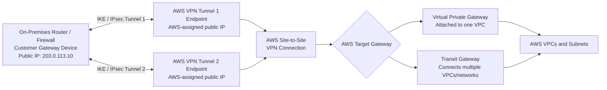
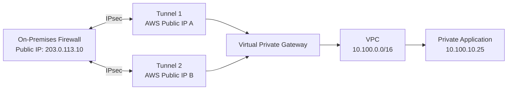
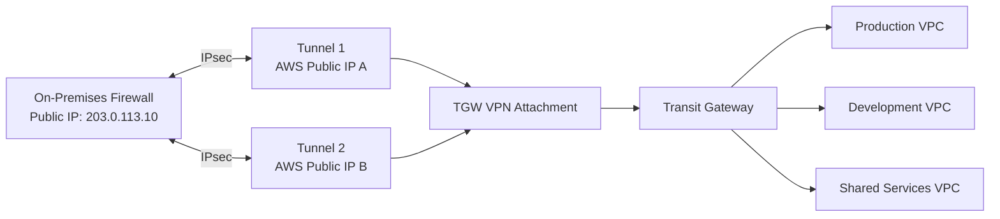

# AWS Site-to-Site VPN: Where Does the Public IP Come From?

The important distinction is:

> **The Virtual Private Gateway or Transit Gateway is the logical AWS VPN target. The public IP addresses belong to AWS-managed VPN tunnel endpoints created for the VPN connection.**

You do **not** assign an Elastic IP address directly to a VGW or TGW.

## High-level architecture



Every Site-to-Site VPN connection normally includes **two tunnels**, and each tunnel has a unique AWS-side outside IP address. AWS places the two tunnel endpoints in separate Availability Zones for resiliency. ([AWS Documentation][1])

---

## How the public IP addresses are assigned

### 1. You create the Customer Gateway resource

The AWS **Customer Gateway resource** represents your on-premises router or firewall.

You provide AWS with:

* Your router/firewall’s static public IP address
* Your BGP ASN, when using dynamic routing
* Optionally, certificate information

For example:

```text
Customer Gateway:
  Public IP: 203.0.113.10
  BGP ASN:   65010
```

If your VPN device is behind NAT, you normally provide the public IP address of the NAT device rather than the private address of the VPN appliance. ([AWS Documentation][2])

### 2. You select the AWS target gateway

The AWS-side target can be:

```text
Virtual Private Gateway
        or
Transit Gateway
```

A VGW is primarily associated with one VPC, while a TGW acts as a regional network hub for multiple VPCs, VPNs, and other network attachments. ([AWS Documentation][3])

### 3. You create the VPN connection

When you create the Site-to-Site VPN connection, AWS automatically provisions two managed VPN tunnel endpoints.

For example:

```text
VPN Connection: vpn-0123456789

Tunnel 1 AWS outside IP: 3.220.10.25
Tunnel 2 AWS outside IP: 18.211.40.75
```

These addresses are allocated by AWS. You do not select them, allocate Elastic IPs for them, or place them in one of your VPC subnets. Each tunnel receives a separate outside IP address. ([AWS Documentation][1])

### 4. AWS generates the VPN configuration

The downloaded configuration contains information such as:

```text
Tunnel 1:
  AWS outside IP
  Customer gateway public IP
  Pre-shared key
  Inside tunnel addresses
  BGP neighbor addresses
  Encryption settings

Tunnel 2:
  AWS outside IP
  Customer gateway public IP
  Pre-shared key
  Inside tunnel addresses
  BGP neighbor addresses
  Encryption settings
```

You use that information to configure your on-premises router or firewall. ([AWS Documentation][1])

---

# Public outside IP versus private inside IP

Each tunnel has two different addressing layers.

## Outside addresses

These addresses transport encrypted IPsec packets across the internet.

```text
Customer side outside IP: 203.0.113.10
AWS side outside IP:      3.220.10.25
```

The outside addresses are used for:

* IKE negotiation
* IPsec encryption
* NAT traversal
* Delivering encrypted packets across the internet

Common traffic includes:

```text
UDP 500   — IKE
UDP 4500  — IPsec NAT Traversal
IP 50     — ESP when NAT-T is not used
```

AWS documents UDP 500 and ESP for standard IPsec operation and requires UDP 4500 when NAT-T is being used. ([AWS Documentation][4])

## Inside addresses

Inside tunnel addresses create the logical routed point-to-point connection between your router and AWS.

Conceptually:

```text
Customer BGP peer  ←→  AWS BGP peer
```

These inside addresses are used for:

* BGP peering
* Route exchange
* Tunnel health
* Routing private network traffic

Your application traffic might look like:

```text
Original packet:

Source:      10.20.1.10
Destination: 10.100.5.25
```

That packet is encrypted and carried inside an outer packet:

```text
Outer encrypted packet:

Source:      203.0.113.10
Destination: 3.220.10.25
```

After AWS decrypts it, the original private packet is delivered to the VGW or TGW routing environment.

---

# Where the AWS public IP actually resides

The AWS tunnel outside IP is **not** assigned to:

* An EC2 instance
* An Elastic Network Interface in your subnet
* A NAT Gateway
* An Internet Gateway
* The TGW VPC attachment ENI
* A customer-managed load balancer

It belongs to an **AWS-managed Site-to-Site VPN tunnel endpoint**.

A useful mental model is:

```text
VGW or TGW
   │
   └── VPN connection
         ├── AWS-managed tunnel endpoint 1
         │      └── AWS outside public IP 1
         │
         └── AWS-managed tunnel endpoint 2
                └── AWS outside public IP 2
```

The VGW/TGW represents the routing and attachment target. The tunnel endpoints provide the actual IKE/IPsec termination.

---

# Virtual Private Gateway example



Here, the VGW is attached to the VPC. The VPC route table normally contains a route such as:

```text
Destination: 10.20.0.0/16
Target:      vgw-0123456789
```

The route table does not point to either public tunnel IP.

---

# Transit Gateway example



In this design, the VPN appears as a **VPN attachment** on the Transit Gateway. The TGW route table controls which VPC attachments can reach the VPN attachment and vice versa.

Again, TGW routes point to the VPN attachment—not directly to the public tunnel endpoint IPs.

---

# Can the AWS outside IP be private?

The default is:

```text
Outside IP address type: Public IPv4
```

AWS also supports other outside address options in certain designs:

* **IPv6 outside addresses** for TGW or Cloud WAN VPN connections
* **Private IPv4 outside addresses** for private IP VPN connections carried over Direct Connect

Therefore, public IPv4 is the normal internet-based Site-to-Site VPN design, but it is no longer the only possible outside addressing model. ([AWS Documentation][5])

---

# Accelerated VPN difference

For an accelerated Site-to-Site VPN:

```text
On-premises
     │
     ▼
Nearest AWS edge location
     │
     ▼
AWS Global Network
     │
     ▼
Transit Gateway VPN attachment
```

AWS uses Global Accelerator infrastructure and a separate pool of tunnel endpoint addresses. Accelerated VPN is supported for Transit Gateway VPN attachments, not Virtual Private Gateway VPN connections. ([AWS Documentation][6])

---

# The key takeaway

```text
VGW/TGW = logical routing and VPN target

VPN connection = relationship between AWS and customer gateway

Tunnel endpoints = actual AWS-managed IPsec termination points

AWS outside IPs = automatically allocated to those tunnel endpoints

Customer outside IP = supplied by you when creating the customer gateway
```

You never assign an Elastic IP directly to the VGW or TGW. AWS automatically gives the VPN connection two outside endpoint addresses—one for each redundant tunnel.

[1]: https://docs.aws.amazon.com/vpn/latest/s2svpn/VPNTunnels.html?utm_source=chatgpt.com "Tunnel options for your AWS Site-to-Site VPN connection"
[2]: https://docs.aws.amazon.com/vpn/latest/s2svpn/cgw-options.html?utm_source=chatgpt.com "Customer gateway options for your AWS Site-to-Site VPN ..."
[3]: https://docs.aws.amazon.com/vpn/latest/s2svpn/how_it_works.html?utm_source=chatgpt.com "How AWS Site-to-Site VPN works - AWS Site-to-Site VPN"
[4]: https://docs.aws.amazon.com/vpn/latest/s2svpn/FirewallRules.html?utm_source=chatgpt.com "Firewall rules for an AWS Site-to-Site VPN customer gateway device - AWS Site-to-Site VPN"
[5]: https://docs.aws.amazon.com/vpn/latest/s2svpn/tunnel-configure.html?utm_source=chatgpt.com "Configure tunnel options for AWS Site-to-Site VPN"
[6]: https://docs.aws.amazon.com/vpn/latest/s2svpn/accelerated-vpn.html?utm_source=chatgpt.com "Accelerated AWS Site-to-Site VPN connections - AWS Site-to-Site VPN"
