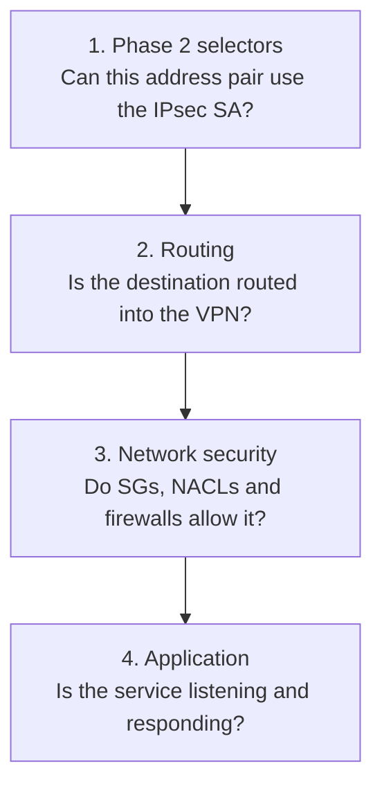
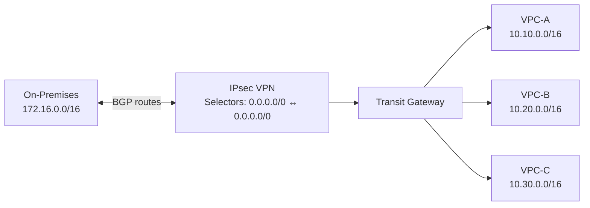

## The simplest mental model

These two fields describe the **IKE Phase 2 traffic selectors** for the IPsec Security Association:

```text
Local IPv4 Network CIDR  = customer/on-premises networks
Remote IPv4 Network CIDR = AWS-side networks
```

Despite the names, **“local” means your customer-gateway side**, and **“remote” means the AWS side** in the AWS VPN configuration. ([AWS Documentation][1])

They are **not**:

* VPC or Transit Gateway route-table entries
* BGP advertisements
* Firewall rules
* Security groups
* NAT rules
* The public outside IP addresses of the VPN tunnel

They are parameters negotiated while creating the encrypted IPsec session.

---

# Example network

Suppose you have:

```text
On-premises network:  172.16.0.0/16
AWS VPC:              10.100.0.0/16
```

You could configure:

```text
Local IPv4 Network CIDR:   172.16.0.0/16
Remote IPv4 Network CIDR:  10.100.0.0/16
```

Conceptually, IKE Phase 2 negotiates:

```text
Traffic selector:

172.16.0.0/16  <------IPsec------>  10.100.0.0/16
Customer side                         AWS side
```

The customer-gateway appliance may call these values:

* Local traffic selector
* Remote traffic selector
* Proxy ID
* Encryption domain
* Crypto ACL
* Interesting traffic

The terminology varies by firewall vendor.

---

# IKE Phase 1 versus Phase 2

## Phase 1: Establish the secure control channel

Phase 1 authenticates the two public VPN endpoints.

```text
Customer gateway public IP
203.0.113.10
        |
        | IKE Phase 1
        |
AWS tunnel public IP
198.51.100.25
```

Phase 1 negotiates settings such as:

* IKE version
* Encryption
* Integrity
* Diffie-Hellman group
* Pre-shared key or certificate
* IKE lifetime

At this point, the two VPN endpoints trust each other, but the data-plane IPsec SA has not yet been fully established.

## Phase 2: Establish the data-encryption SA

Phase 2 negotiates how actual private traffic will be encrypted:

```text
On-premises private CIDR
172.16.0.0/16
        |
        | IPsec Security Association
        |
AWS private CIDR
10.100.0.0/16
```

Phase 2 also negotiates:

* IPsec encryption
* IPsec integrity
* Perfect Forward Secrecy
* SA lifetime
* Traffic selectors

The Local and Remote IPv4 Network CIDRs participate in this Phase 2 negotiation. ([AWS Documentation][1])

---

# Why does AWS default both fields to `0.0.0.0/0`?

AWS Site-to-Site VPN is fundamentally a **route-based VPN**. AWS therefore prefers a broad Phase 2 selector:

```text
Local:   0.0.0.0/0
Remote:  0.0.0.0/0
```

This means:

> The IPsec tunnel is capable of carrying any IPv4 source-to-destination combination, but routing and security controls still determine what traffic can actually use it.

AWS documents `0.0.0.0/0` as the default for both fields. ([AWS Documentation][2])

A broad selector is useful because the VPN does not need to renegotiate its Phase 2 policy every time you:

* Add another VPC
* Add another on-premises subnet
* Change a BGP advertisement
* Attach another VPC to a Transit Gateway
* Add a new TGW route
* Use ECMP over multiple VPN tunnels

---

# `0.0.0.0/0` does not mean “allow all traffic”

This is the most important point.

Suppose the VPN is configured as:

```text
Local selector:   0.0.0.0/0
Remote selector:  0.0.0.0/0
```

But the actual routes are:

```text
On-premises router:
10.100.0.0/16 → VPN tunnel

AWS Transit Gateway:
172.16.0.0/16 → VPN attachment
```

Then the effective traffic path is still only:

```text
172.16.0.0/16  <------VPN------>  10.100.0.0/16
```

Packets for other destinations will not automatically enter the tunnel because there is no route telling them to do so.

AWS route tables determine whether AWS traffic is directed toward a VGW or TGW VPN attachment. ([AWS Documentation][3])

## Four conditions must all be satisfied

For an on-premises server to communicate with an AWS resource, all four layers must work:



For example:

```text
Source:       172.16.20.10
Destination:  10.100.5.25
Port:         TCP 443
```

You need:

```text
Phase 2:
The selectors encompass 172.16.20.10 ↔ 10.100.5.25

On-premises routing:
10.100.0.0/16 → VPN tunnel

AWS routing:
172.16.0.0/16 → VGW or TGW VPN attachment

On-premises firewall:
Allow 172.16.20.10 → 10.100.5.25 TCP 443

AWS security group:
Allow TCP 443 from 172.16.20.10 or 172.16.0.0/16

AWS NACL:
Allow the request and return traffic
```

The `0.0.0.0/0` selectors satisfy only the first condition. They do not create the other permissions.

---

# Traffic selector versus route

These are separate concepts.

## Traffic selector

A traffic selector answers:

> If this packet reaches the VPN tunnel, is its source/destination combination covered by the negotiated IPsec SA?

Example:

```text
Local selector:  172.16.0.0/16
Remote selector: 10.100.0.0/16
```

## Route

A route answers:

> Should this packet be sent toward the VPN in the first place?

Example:

```text
Destination: 10.100.0.0/16
Next hop:    AWS VPN tunnel interface
```

## BGP advertisement

A BGP advertisement answers:

> Which prefixes can be reached through this VPN peer?

Example:

```text
On-premises advertises to AWS:
172.16.0.0/16

AWS advertises to on-premises:
10.100.0.0/16
```

Traffic selectors provide the IPsec envelope. BGP or static routing determines which destination prefixes actually use that envelope.

---

# Route-based VPN example with BGP

Consider a Transit Gateway connected to three VPCs:

```text
VPC-A: 10.10.0.0/16
VPC-B: 10.20.0.0/16
VPC-C: 10.30.0.0/16

On-premises: 172.16.0.0/16
```

Configure the AWS VPN selectors as:

```text
Local IPv4 Network CIDR:   0.0.0.0/0
Remote IPv4 Network CIDR:  0.0.0.0/0
```

Then use BGP to exchange the actual routes:



The route exchange might be:

```text
Customer gateway → AWS:
172.16.0.0/16

AWS → Customer gateway:
10.10.0.0/16
10.20.0.0/16
10.30.0.0/16
```

Even though Phase 2 says `0.0.0.0/0 ↔ 0.0.0.0/0`, only the prefixes installed in the routing tables are expected to traverse the tunnel.

For Transit Gateway VPN connections, BGP-learned VPN prefixes can propagate into TGW route tables, while VPC prefixes can be advertised toward the customer gateway. ([AWS Documentation][4])

---

# Why this is especially useful with Transit Gateway

With a VGW, you often have one primary VPC:

```text
On-premises ↔ VPN ↔ VGW ↔ VPC 10.100.0.0/16
```

You could set:

```text
Local:  172.16.0.0/16
Remote: 10.100.0.0/16
```

That may work, but it creates a tighter dependency between the Phase 2 configuration and the current network ranges.

With Transit Gateway, multiple VPC CIDRs may be reachable:

```text
10.10.0.0/16
10.20.0.0/16
10.30.0.0/16
10.50.0.0/16
```

Those ranges may not fit into one clean summary. Broad selectors avoid trying to represent every attached VPC in the IKE Phase 2 definition.

You then control connectivity with:

* TGW route-table association
* TGW route propagation
* TGW static routes
* VPC route tables
* On-premises BGP policies
* Network firewalls
* Security groups
* NACLs

---

# Route-based VPN versus policy-based VPN

## Policy-based VPN

A policy-based VPN uses source/destination policy combinations to decide what enters the tunnel.

For example:

```text
Crypto policy:

Source:      172.16.0.0/16
Destination: 10.100.0.0/16
Action:      Encrypt
```

The policy is simultaneously acting as:

* A traffic classifier
* An encryption rule
* In some products, part of the tunnel-selection logic

Adding another network could require another policy:

```text
172.16.0.0/16 → 10.100.0.0/16
172.16.0.0/16 → 10.200.0.0/16
172.17.0.0/16 → 10.100.0.0/16
```

Some devices attempt to create a separate Phase 2 Security Association for each pair.

## Route-based VPN

A route-based VPN creates a logical tunnel interface:

```text
Tunnel interface: VTI0
```

Routing decides which traffic enters it:

```text
10.100.0.0/16 → VTI0
10.200.0.0/16 → VTI0
```

The encryption relationship remains broad:

```text
0.0.0.0/0 ↔ 0.0.0.0/0
```

AWS requires the Site-to-Site VPN design to behave as a route-based solution. AWS notes that a policy-based customer-gateway configuration must be limited to a single IPsec Security Association. ([AWS Documentation][5])

---

# What happens with a policy-based firewall?

Suppose your on-premises firewall uses:

```text
Local encryption domain:  172.16.0.0/16
Remote encryption domain: 10.100.0.0/16
```

But AWS uses:

```text
Local:  0.0.0.0/0
Remote: 0.0.0.0/0
```

During IKE Phase 2:

```text
AWS proposes:
0.0.0.0/0 ↔ 0.0.0.0/0

Firewall expects:
172.16.0.0/16 ↔ 10.100.0.0/16
```

Depending on the device, it might:

1. Narrow the selectors to the specific ranges and establish the SA.
2. Reject the proposal because the selectors do not match.
3. Establish the tunnel but fail to pass traffic.
4. Create multiple SAs, which can cause compatibility problems with AWS.

For a policy-based-only customer gateway, setting AWS to the matching selectors may be necessary:

```text
AWS Local:   172.16.0.0/16
AWS Remote:  10.100.0.0/16
```

However, this is a compatibility accommodation—not the preferred AWS design. AWS’s customer-gateway requirements state that policy-based configurations must be restricted to one SA. ([AWS Documentation][5])

---

# Why the AWS wording can be confusing

The documentation says these CIDRs are “used to propose routes” during IKE Phase 2.

A more technically useful description is:

> The CIDRs are proposed as IKE Phase 2 traffic selectors. They describe the address space the IPsec SA can carry; they do not install routes into VPC, TGW, or customer-gateway routing tables.

IKE does not replace:

* BGP route exchange
* VPN static routes
* VPC routes
* TGW routes
* Customer-router routes

So think of them as **selector boundaries**, not route-table entries.

---

# Recommended settings

## Modern route-based firewall with BGP

Examples include a properly configured VTI-based Cisco, Palo Alto, FortiGate, Juniper, or similar device.

Use:

```text
Local IPv4 Network CIDR:   0.0.0.0/0
Remote IPv4 Network CIDR:  0.0.0.0/0
```

Then use BGP to advertise only the authorized prefixes.

This is generally the cleanest and most scalable configuration.

## Modern route-based firewall with static routing

You can still normally use:

```text
Local:  0.0.0.0/0
Remote: 0.0.0.0/0
```

Then configure explicit static routes on both sides.

## Policy-based-only firewall

Use the specific matching networks if the appliance cannot support broad selectors:

```text
Local:  actual on-premises CIDR
Remote: actual AWS CIDR or summarized AWS CIDR
```

But make sure the configuration results in only one Phase 2 SA per AWS tunnel. ([AWS Documentation][5])

---

# Final example

Assume:

```text
On-premises:
172.16.10.0/24
172.16.20.0/24

AWS:
10.100.0.0/16
10.200.0.0/16
```

## Preferred route-based configuration

```text
AWS selectors:
Local:   0.0.0.0/0
Remote:  0.0.0.0/0

BGP advertisements from on-premises:
172.16.10.0/24
172.16.20.0/24

BGP advertisements from AWS:
10.100.0.0/16
10.200.0.0/16
```

Effective connectivity is controlled through routes and security policy:

```text
172.16.10.0/24 → 10.100.0.0/16: allowed
172.16.20.0/24 → 10.200.0.0/16: allowed
172.16.10.0/24 → 10.200.0.0/16: blocked by firewall
```

The broad selectors do not override that firewall policy.

## Core takeaway

```text
Local CIDR
= on-premises-side Phase 2 traffic selector

Remote CIDR
= AWS-side Phase 2 traffic selector

0.0.0.0/0 on both
= the IPsec SA can transport any IPv4 prefix

It does not mean
= every network is routed, reachable or permitted
```

For a normal AWS route-based VPN, leave both as `0.0.0.0/0`, use BGP or static routes to determine reachability, and use firewalls, security groups and NACLs to determine what communication is permitted.

[1]: https://docs.aws.amazon.com/vpn/latest/s2svpn/tunnel-configure.html?utm_source=chatgpt.com "Configure tunnel options for AWS Site-to-Site VPN"
[2]: https://docs.aws.amazon.com/vpn/latest/s2svpn/modify-vpn-connection-options.html?utm_source=chatgpt.com "Modify AWS Site-to-Site VPN connection options"
[3]: https://docs.aws.amazon.com/vpn/latest/s2svpn/vpn-route-priority.html?utm_source=chatgpt.com "Route tables and AWS Site-to-Site VPN route priority"
[4]: https://docs.aws.amazon.com/vpc/latest/tgw/how-transit-gateways-work.html?utm_source=chatgpt.com "How AWS Transit Gateway works - Amazon VPC"
[5]: https://docs.aws.amazon.com/vpn/latest/s2svpn/CGRequirements.html?utm_source=chatgpt.com "Requirements for an AWS Site-to-Site VPN customer ..."
