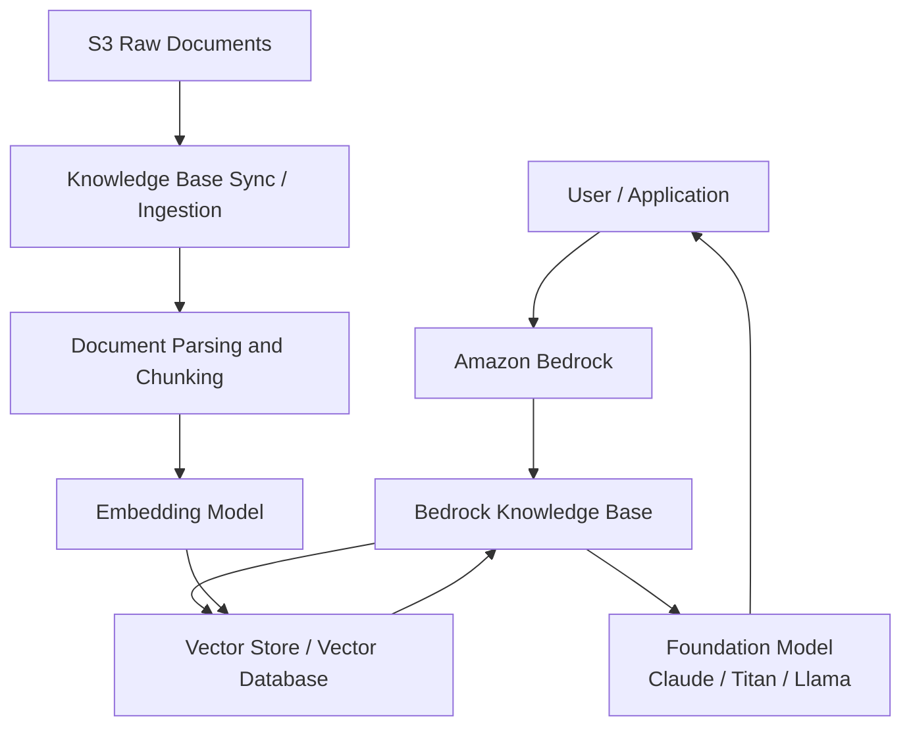
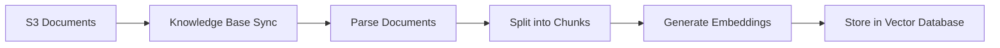
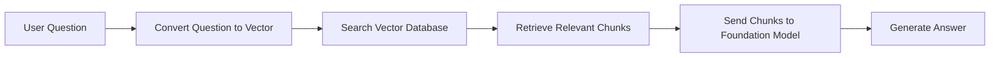

# Making Documents Searchable in Amazon Bedrock

## RAG, S3, Embeddings, Vector Databases, and Knowledge Bases Explained

## 1. What This Document Is About

This document explains how Amazon Bedrock can answer questions using your own documents.

A common misunderstanding is:

> “If I upload documents to Amazon S3, can Bedrock automatically answer questions from them?”

The answer is:

> Uploading documents to S3 is necessary, but it is not enough.

S3 stores the original documents, but a foundation model such as Claude, Amazon Titan, or Llama does not automatically read and understand every file in your bucket.

To make your documents searchable and usable by a foundation model, you need a process called **RAG**, which stands for **Retrieval-Augmented Generation**.

RAG allows a model to answer questions using your private or enterprise data without retraining the model.

At a high level:

```text
Documents in S3
→ Bedrock Knowledge Base
→ Chunking
→ Embeddings
→ Vector Database
→ Retrieval
→ Foundation Model Answer
```

---

## 2. The Main Concept: What Is RAG?

**RAG** means the model retrieves relevant information before generating an answer.

Instead of asking the model to answer only from its general training knowledge, RAG gives the model relevant pieces of your documents at question time.

### Simple Example

User asks:

> “What does our policy say about CAC authentication?”

The system does not send the entire document library to the model.

Instead, it:

1. Searches your indexed documents.
2. Finds the most relevant chunks about CAC authentication.
3. Sends only those chunks to the foundation model.
4. The model generates an answer using that retrieved context.

So the foundation model is not magically “learning” your S3 bucket. It is being given relevant context when needed.

---

## 3. High-Level Architecture



### High-Level Flow

There are two major phases:

1. **Ingestion Phase**
   Prepare your documents so they can be searched.

2. **Question-and-Answer Phase**
   Retrieve relevant content and generate an answer.

---

# Part 1 — Solution Components

## 4. Component 1: Amazon S3

### What It Is

Amazon S3 is the storage location for your original documents.

Examples:

```text
s3://company-knowledge-base/policies/cac-authentication.pdf
s3://company-knowledge-base/network/tgw-design.docx
s3://company-knowledge-base/security/scca-notes.md
```

### What S3 Does

S3 stores the raw files.

It can store:

* PDF files
* Word documents
* Text files
* Markdown files
* HTML files
* CSV files
* Other supported document formats

### What S3 Does Not Do

S3 does not understand the meaning of the documents.

S3 does not automatically make documents searchable by meaning.

S3 does not automatically make Claude, Titan, or Llama aware of your files.

### Simple Analogy

S3 is like a filing cabinet.

It stores the documents, but it does not read, summarize, or understand them.

---

## 5. Component 2: Bedrock Knowledge Base

### What It Is

A **Bedrock Knowledge Base** is the orchestration layer that connects your documents, embedding model, vector database, and foundation model.

It automates the RAG pipeline.

### Why It Is Needed

Without a Knowledge Base, you would have to manually build:

* Document parsing
* Text extraction
* Chunking
* Embedding generation
* Vector indexing
* Semantic search
* Retrieval
* Prompt construction
* Model invocation

The Knowledge Base simplifies this process.

### What It Does

The Knowledge Base:

1. Connects to your S3 data source.
2. Reads documents from S3.
3. Splits documents into smaller chunks.
4. Sends chunks to an embedding model.
5. Stores embeddings in a vector database.
6. Retrieves relevant chunks when a user asks a question.
7. Passes the retrieved context to a foundation model.

---

## 6. Component 3: Embedding Model

### What It Is

An embedding model converts text into numbers.

Those numbers are called **vectors** or **embeddings**.

A vector represents the meaning of a piece of text.

### Why It Is Needed

Computers cannot directly compare meaning the way humans do.

For example, these two sentences are different at the word level:

```text
How do I reset my CAC login?
```

```text
User cannot sign in with smart card.
```

A keyword search may not know these are related.

But an embedding model can understand that both are about:

```text
authentication / smart card / CAC / login failure
```

The embedding model converts both pieces of text into vectors that are close to each other mathematically.

### Simple Analogy

The embedding model turns language into a location on a map.

Similar meanings are placed near each other.

Different meanings are placed farther apart.

---

## 7. Component 4: Vector Database

### What It Is

A vector database stores embeddings and allows fast semantic search.

It answers this question:

> “Which document chunks are closest in meaning to the user’s question?”

### Why It Is Needed

A normal database is good for exact searches.

For example:

```text
Find all documents that contain the word "CAC"
```

A vector database is good for meaning-based searches.

For example:

```text
Find documents related to smart card login problems, even if they do not use the exact word CAC.
```

### Vector Store Options

A Bedrock Knowledge Base can use different vector store options, such as:

* Amazon OpenSearch Serverless
* Amazon OpenSearch managed clusters
* Amazon Aurora PostgreSQL with pgvector
* Amazon Neptune Analytics
* Pinecone
* Redis Enterprise Cloud
* MongoDB Atlas
* Amazon S3 Vectors

The exact choice depends on scale, performance, cost, security, operational model, and supported AWS Region.

---

## 8. Component 5: Foundation Model

### What It Is

The foundation model is the large language model that writes the final answer.

Examples include:

* Anthropic Claude
* Amazon Titan
* Meta Llama
* Other Bedrock-supported models

### What It Does

The foundation model receives:

1. The user’s question
2. The relevant document chunks retrieved from the vector database
3. Instructions on how to answer

Then it generates a human-readable response.

### Important Point

The foundation model does not need to permanently learn your documents.

Instead, RAG gives the model the right document context at the right time.

---

# Part 2 — How the Solution Works

## 9. Phase 1: Ingestion

Ingestion is the process that prepares your documents for search.

Uploading files to S3 does not complete this step.

You must run a Knowledge Base sync or ingestion job.

### Ingestion Flow



### What Happens During Ingestion

When ingestion runs:

1. Bedrock reads files from the configured S3 bucket or prefix.
2. It extracts text from the documents.
3. It breaks large documents into smaller chunks.
4. Each chunk is sent to an embedding model.
5. The embedding model converts each chunk into a vector.
6. The vector and related metadata are stored in the vector database.

### Why Chunking Is Important

Large documents are too big to search and send to the model as one unit.

So they are split into smaller pieces.

Example:

```text
Original document:
100-page security policy PDF

After chunking:
Chunk 1: Introduction
Chunk 2: Identity and access control
Chunk 3: CAC authentication
Chunk 4: Logging requirements
Chunk 5: Incident response
```

When a user asks about CAC authentication, only the CAC-related chunks need to be retrieved.

---

## 10. Phase 2: Retrieval and Generation

This phase happens when a user asks a question.

### Question Flow



### What Happens at Question Time

When a user asks a question:

1. The question is converted into a vector using the embedding model.
2. The vector database searches for document chunks with similar meaning.
3. The most relevant chunks are retrieved.
4. The retrieved chunks are added as context.
5. The foundation model generates an answer using that context.

### Example

User asks:

```text
Why can’t my smart card login work?
```

The vector database may retrieve chunks from documents about:

```text
CAC authentication
smart card login
certificate validation
identity provider configuration
authentication failure troubleshooting
```

The foundation model then uses those retrieved chunks to generate the answer.

---

# Part 3 — S3 Data Source vs. Amazon S3 Vectors

## 11. Why This Is Confusing

Both names include “S3,” but they are not the same thing.

There are two different roles:

1. **S3 as a data source**
2. **Amazon S3 Vectors as a vector store**

---

## 12. S3 as a Data Source

A normal S3 bucket stores your original documents.

Example:

```text
s3://company-kb/raw-documents/
```

This is where you upload files such as:

```text
policy.pdf
runbook.docx
architecture.md
network-design.csv
```

This bucket is the input to the RAG pipeline.

It stores raw documents, not searchable vector embeddings.

---

## 13. Amazon S3 Vectors

Amazon S3 Vectors is different.

It can be used as a vector store.

That means it stores the embeddings created from your documents.

Example:

```text
Document chunk:
"CAC authentication requires certificate validation."

Embedding:
[0.123, -0.456, 0.781, ...]
```

S3 Vectors stores and searches these embeddings.

---

## 14. Simple Comparison

| Area                           | S3 Data Source          | Amazon S3 Vectors                |
| ------------------------------ | ----------------------- | -------------------------------- |
| Main purpose                   | Store original files    | Store vector embeddings          |
| Data type                      | PDF, DOCX, TXT, CSV, MD | Numerical vectors                |
| RAG role                       | Input                   | Search index                     |
| Used during ingestion          | Yes                     | Yes, as output destination       |
| Used during question answering | Indirectly              | Yes                              |
| Understands meaning            | No                      | Supports meaning-based retrieval |

### Simple Rule

```text
Normal S3 bucket = raw documents go in
Amazon S3 Vectors = searchable embeddings come out
```

---

# Part 4 — High-Level Logic

## 15. High-Level Bedrock RAG Logic

At a high level, the logic is:

```text
Upload documents
→ Sync Knowledge Base
→ Create embeddings
→ Store embeddings
→ Ask question
→ Retrieve relevant chunks
→ Generate answer
```

### Simplified Explanation

S3 stores the original documents.

The Knowledge Base processes those documents.

The embedding model converts text into meaning-based numbers.

The vector database stores those numbers.

The foundation model uses the retrieved text to answer the user.

---

## 16. High-Level Responsibilities

| Component        | Responsibility                            |
| ---------------- | ----------------------------------------- |
| S3               | Store original documents                  |
| Knowledge Base   | Orchestrate ingestion and retrieval       |
| Embedding model  | Convert text into vectors                 |
| Vector database  | Store and search embeddings               |
| Foundation model | Generate final answer                     |
| Application      | Provide user interface or API integration |

---

# Part 5 — Low-Level Logic

## 17. Low-Level Ingestion Logic

The ingestion process works like this:

```text
1. User uploads document to S3.
2. Knowledge Base sync job starts.
3. Bedrock reads the object from S3.
4. Text is extracted from the document.
5. Document is split into chunks.
6. Metadata is associated with each chunk.
7. Each chunk is sent to the embedding model.
8. Embedding model returns a vector.
9. Vector is stored in the vector database.
10. Vector database indexes the vector for semantic search.
```

### Example

Original document:

```text
SCCA architecture requires centralized ingress and egress inspection.
All mission owner traffic must traverse approved inspection points.
```

Chunk:

```text
SCCA architecture requires centralized ingress and egress inspection.
```

Embedding:

```text
[0.018, -0.224, 0.671, 0.092, ...]
```

Metadata:

```text
source_file: scca-architecture.pdf
page: 4
section: traffic inspection
s3_uri: s3://company-kb/scca-architecture.pdf
```

Stored in vector database:

```text
vector + metadata + source reference
```

---

## 18. Low-Level Query Logic

When a user asks a question, the logic is:

```text
1. User submits a question.
2. The question is sent to the Knowledge Base.
3. The same embedding model converts the question into a vector.
4. The vector database compares the question vector against stored document vectors.
5. The closest matching chunks are returned.
6. Bedrock builds a prompt using:
   - User question
   - Retrieved chunks
   - System instructions
7. The foundation model generates an answer.
8. The answer is returned to the application or user.
```

### Example

User question:

```text
Does SCCA require centralized inspection?
```

The question is embedded as a vector.

The vector database finds related chunks such as:

```text
SCCA architecture requires centralized ingress and egress inspection.
```

The foundation model receives context and answers:

```text
Yes. Based on the retrieved SCCA architecture content, the design requires centralized ingress and egress inspection for mission owner traffic.
```

---

# Part 6 — Implementation Steps

## 19. What You Actually Need to Do

To make documents searchable in Bedrock:

1. Upload documents to S3.
2. Create a Bedrock Knowledge Base.
3. Configure the S3 bucket or prefix as the data source.
4. Choose an embedding model.
5. Choose a vector store.
6. Configure IAM permissions so Bedrock can read the S3 data source and write to the vector store.
7. Run the Knowledge Base sync or ingestion job.
8. Test retrieval using sample questions.
9. Use `Retrieve` or `RetrieveAndGenerate` from your application.

---

## 20. Example End-to-End Setup

```text
Raw documents:
s3://enterprise-kb/raw/

Knowledge Base:
enterprise-security-kb

Embedding model:
Amazon Titan Embeddings

Vector store:
Amazon OpenSearch Serverless or Amazon S3 Vectors

Foundation model:
Claude or Amazon Titan

Application:
Internal chatbot, help desk assistant, security policy assistant, or architecture Q&A tool
```

---

# Part 7 — Common Misunderstandings

## 21. Misunderstanding 1: “I uploaded to S3, so Bedrock can answer questions.”

Not true.

S3 only stores documents.

You still need Knowledge Base ingestion, embeddings, and a vector store.

---

## 22. Misunderstanding 2: “The foundation model learns my documents permanently.”

Not usually.

In a RAG design, the model does not permanently learn your documents.

It receives relevant document chunks at question time.

---

## 23. Misunderstanding 3: “S3 and S3 Vectors are the same.”

They are not the same.

A normal S3 bucket stores raw files.

Amazon S3 Vectors stores searchable vector embeddings.

---

## 24. Misunderstanding 4: “A vector database replaces S3.”

No.

S3 stores the original files.

The vector database stores the searchable representation of those files.

You usually need both.

---

## 25. Misunderstanding 5: “Keyword search and vector search are the same.”

They are different.

Keyword search looks for exact words.

Vector search looks for similar meaning.

---

# Part 8 — Final Summary

## 26. Key Takeaway

For Amazon Bedrock RAG:

```text
S3 stores the documents.
The Knowledge Base processes the documents.
The embedding model converts text into vectors.
The vector database stores searchable meaning.
The foundation model generates the final answer.
```

Uploading documents to S3 is only the first step.

The documents become searchable only after the Knowledge Base sync or ingestion process runs.

---

## 27. Simplified Final Flow

```text
Upload files to S3
→ Create Bedrock Knowledge Base
→ Connect S3 as data source
→ Choose embedding model
→ Choose vector database
→ Run sync
→ Ask questions
→ Retrieve relevant chunks
→ Generate grounded answer
```

---

## 28. One-Line Explanation

Amazon Bedrock does not answer directly from S3; it answers from relevant document chunks retrieved from a vector database that was created by processing and embedding your S3 documents.
