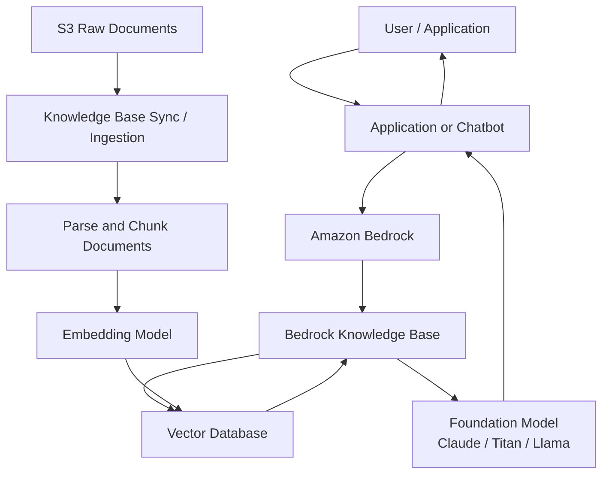
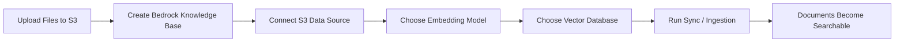
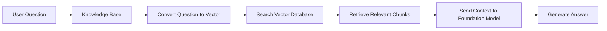

# Making S3 Documents Searchable in Amazon Bedrock

## RAG Architecture, Components, and Implementation Flow

## 1. Problem

A common misunderstanding is:

> “If I upload documents to S3, can Amazon Bedrock automatically answer questions from them?”

The answer is:

> No. Uploading documents to S3 only stores the files. It does not make them searchable or understandable by a foundation model.

Amazon S3 is just the raw document location. To allow Bedrock to answer questions from those documents, the files must be processed, converted into embeddings, stored in a vector database, and retrieved at question time.

This pattern is called **RAG**, or **Retrieval-Augmented Generation**.

---

## 2. Solution

The solution is to use an **Amazon Bedrock Knowledge Base**.

The Knowledge Base connects four major parts:

| Component            | Purpose                                            |
| -------------------- | -------------------------------------------------- |
| **S3**               | Stores original documents                          |
| **Embedding Model**  | Converts document text into vectors                |
| **Vector Database**  | Stores searchable meaning of the documents         |
| **Foundation Model** | Generates the final answer using retrieved context |

In simple terms:

```text
S3 stores the files.
Bedrock Knowledge Base processes the files.
Embedding model converts text into meaning-based numbers.
Vector database stores and searches those numbers.
Foundation model writes the final answer.
```

---

## 3. High-Level Architecture



---

## 4. How the Components Talk to Each Other

### Step 1: Documents are uploaded to S3

Documents are stored in an S3 bucket.

Example:

```text
s3://company-kb/security-policies/
s3://company-kb/network-designs/
s3://company-kb/runbooks/
```

S3 is the source of truth for the original files.

---

### Step 2: Bedrock Knowledge Base connects to S3

The Knowledge Base is configured with the S3 bucket or S3 prefix as a **data source**.

Bedrock needs IAM permissions to read the files from S3.

At this point, the documents are connected, but they are not fully searchable yet.

---

### Step 3: Knowledge Base sync runs

A sync or ingestion job must run.

During sync, Bedrock:

1. Reads the files from S3.
2. Extracts text from the documents.
3. Splits large documents into smaller chunks.
4. Sends each chunk to an embedding model.
5. Stores the embeddings in the vector database.

This is the step that makes the documents searchable.

---

### Step 4: Embedding model converts text into vectors

The embedding model converts each text chunk into a vector.

A vector is a numerical representation of meaning.

Example:

```text
Text:
"CAC authentication requires certificate validation."

Vector:
[0.123, -0.456, 0.891, ...]
```

This allows Bedrock to search by meaning instead of only keywords.

---

### Step 5: Vector database stores searchable meaning

The vector database stores:

```text
Document chunk
+ Vector embedding
+ Metadata
+ Source document reference
```

Example metadata:

```text
Source file: cac-authentication-policy.pdf
S3 location: s3://company-kb/security/cac-authentication-policy.pdf
Page: 4
Section: Authentication Requirements
```

The vector database is searched when a user asks a question.

---

### Step 6: User asks a question

Example:

```text
What does our policy say about CAC authentication?
```

The question is also converted into a vector.

The vector database compares the question vector against the stored document vectors and returns the most relevant chunks.

---

### Step 7: Foundation model generates the answer

The retrieved chunks are passed to the foundation model as context.

The model then generates the final answer using the retrieved document content.

The model is not answering only from its general knowledge. It is answering from the relevant document sections retrieved by the Knowledge Base.

---

## 5. Ingestion Flow

Ingestion prepares the data before users ask questions.



### Ingestion Logic

```text
S3 document
→ Bedrock reads document
→ Document is parsed
→ Text is split into chunks
→ Chunks are converted into embeddings
→ Embeddings are stored in vector database
```

---

## 6. Question-and-Answer Flow

This happens every time a user asks a question.



### Query Logic

```text
User asks a question
→ Question is embedded
→ Vector database finds similar document chunks
→ Relevant chunks are sent to the model
→ Model generates grounded answer
```

---

## 7. S3 Data Source vs. Amazon S3 Vectors

This is an important distinction.

| Item                  | Purpose                  |
| --------------------- | ------------------------ |
| **S3 Data Source**    | Stores raw documents     |
| **Amazon S3 Vectors** | Stores vector embeddings |

They are not the same thing.

A normal S3 bucket is where your files live.

Amazon S3 Vectors is one possible vector store where embeddings can live.

Simple rule:

```text
S3 Data Source = raw files go in
S3 Vectors = searchable embeddings come out
```

You can use normal S3 as the data source and choose a different vector store, such as OpenSearch Serverless, Aurora PostgreSQL pgvector, Pinecone, MongoDB Atlas, Redis Enterprise Cloud, or Amazon S3 Vectors.

---

## 8. Implementation Steps

To implement this in Amazon Bedrock:

1. **Upload documents to S3**

   Example:

   ```text
   s3://company-kb/raw-documents/
   ```

2. **Create a Bedrock Knowledge Base**

   This becomes the orchestration layer for RAG.

3. **Add S3 as the data source**

   Configure the S3 bucket or prefix that contains the documents.

4. **Choose an embedding model**

   Example:

   ```text
   Amazon Titan Embeddings
   Cohere Embed
   ```

5. **Choose a vector database**

   Example:

   ```text
   Amazon OpenSearch Serverless
   Aurora PostgreSQL with pgvector
   Amazon S3 Vectors
   Pinecone
   MongoDB Atlas
   Redis Enterprise Cloud
   ```

6. **Configure IAM permissions**

   Bedrock needs permission to:

   ```text
   Read from S3
   Invoke embedding model
   Write to vector database
   Retrieve from vector database
   Invoke foundation model
   ```

7. **Run Knowledge Base sync**

   This processes the documents and creates the searchable index.

8. **Test retrieval**

   Ask sample questions and confirm that relevant document chunks are returned.

9. **Use Retrieve or RetrieveAndGenerate**

   Your application can use Bedrock APIs to retrieve context or retrieve context and generate the final answer.

---

## 9. End-to-End Example

### Source Documents

```text
s3://company-kb/security/cac-policy.pdf
s3://company-kb/network/tgw-design.docx
s3://company-kb/operations/runbook.md
```

### User Question

```text
What does the CAC policy require for authentication?
```

### Behind the Scenes

```text
Question is converted to vector
→ Vector database searches for similar chunks
→ CAC policy chunks are retrieved
→ Foundation model receives the chunks
→ Final answer is generated
```

### Final Answer

```text
Based on the CAC policy, authentication requires certificate validation, approved identity provider integration, and enforcement of smart card-based access for protected systems.
```

---

## 10. Key Takeaway

Uploading files to S3 is only the first step.

To make documents searchable in Amazon Bedrock, you need:

```text
S3 data source
+ Bedrock Knowledge Base
+ Embedding model
+ Vector database
+ Sync / ingestion
+ Foundation model
```

Final simplified flow:

```text
Upload documents to S3
→ Run Knowledge Base ingestion
→ Create embeddings
→ Store embeddings in vector database
→ Retrieve relevant chunks
→ Generate answer with foundation model
```

Amazon Bedrock does not answer directly from S3. It answers from relevant document chunks retrieved from a vector database that was created by processing the S3 documents.
