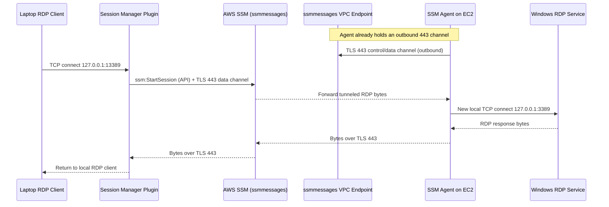

# SSM Session Manager Port Forwarding for RDP (Private EC2, VPC Interface Endpoints)

## What it does

AWS Systems Manager Session Manager opens a **local TCP tunnel** from your laptop to a private EC2 Windows instance. You point Microsoft Remote Desktop at `localhost:13389`, and SSM forwards that traffic to the instance's `TCP/3389`.

The instance needs **no public IP, no bastion, no VPN, and no inbound security group rule for 3389**. Access works because the SSM Agent makes only *outbound* HTTPS connections; Session Manager never opens an inbound listener on the instance.

The key mental model:

```text
SSM port forwarding is not routing or a VPN.
It is local TCP proxying over an AWS-managed, TLS-encrypted control/data channel.
```

---

## Example setup

| Item                  | Value                          |
| --------------------- | ------------------------------ |
| User laptop           | `203.0.113.10` (public)        |
| EC2 Windows private IP| `10.10.2.50`                   |
| EC2 instance ID       | `i-0abc123456789def0`          |
| RDP service on EC2    | `10.10.2.50:3389`              |
| Local forwarded port  | `127.0.0.1:13389`              |
| `ssmmessages` VPCe IP | `10.10.1.25:443` (ENI)         |
| Region                | `us-east-1`                    |

Start the tunnel (requires the **Session Manager plugin** locally):

```bash
aws ssm start-session \
  --region us-east-1 \
  --target i-0abc123456789def0 \
  --document-name AWS-StartPortForwardingSession \
  --parameters '{"portNumber":["3389"],"localPortNumber":["13389"]}'
```

`portNumber` is the remote port on the managed node (3389 for RDP); `localPortNumber` is the port opened on your laptop. Then connect:

```text
mstsc /v:localhost:13389
```

You still need valid **Windows credentials** — SSM builds the tunnel but does not authenticate you into Windows.

---

## How it works behind the scenes



The flow, step by step:

1. **CLI starts the session.** Your laptop calls `ssm:StartSession` over HTTPS to `ssm.<region>.amazonaws.com:443`. AWS returns session metadata to the local plugin.
2. **Plugin opens a local listener** on `127.0.0.1:13389`. Your RDP client connects to it and begins RDP negotiation inside that *local* TCP stream — it is only talking to a local process.
3. **Plugin tunnels the bytes** to AWS over outbound TLS/443 to the `ssmmessages` endpoint. The RDP payload is encapsulated in the SSM data channel.
4. **The agent already has an outbound channel.** The private instance's SSM Agent initiated outbound 443 to AWS earlier. With **interface VPC endpoints**, that traffic stays inside the VPC: `10.10.2.50:ephemeral → 10.10.1.25:443` (the `ssmmessages` endpoint ENI). The agent originates everything, so no inbound access is needed.
5. **Agent connects locally to RDP.** On receiving the tunneled bytes, the agent opens a **separate** local connection `127.0.0.1:ephemeral → 127.0.0.1:3389` and copies bytes between the SSM data channel and the RDP service.

Critical consequence — the two TCP connections are distinct:

```text
The laptop's TCP connection terminates at the plugin (laptop side).
The agent makes its own local TCP connection to 3389 (instance side).
There is never a direct laptop → 10.10.2.50:3389 connection.
```

---

## VPC interface endpoints required

For a fully private path (no NAT/internet), the VPC needs these interface endpoints, each reachable on **TCP/443**:

| Endpoint       | Purpose                                              |
| -------------- | --------------------------------------------------- |
| `ssm`          | Core SSM API (`StartSession`, etc.)                 |
| `ssmmessages`  | Session Manager control/data channels (the tunnel)  |
| `ec2messages`  | Agent ↔ SSM messaging (depends on Region/agent)     |

The **endpoint security group** must allow inbound `TCP/443` from the instance/VPC CIDR. Private DNS on the endpoints lets the agent resolve the public service names to the endpoint ENIs automatically.

---

## What network captures show

| Capture point             | You see                                               | You do **not** see                          |
| ------------------------- | ----------------------------------------------------- | ------------------------------------------- |
| Laptop physical NIC       | `Laptop → ssm/ssmmessages:443` (TLS, encrypted)       | `Laptop → 10.10.2.50:3389`                  |
| Laptop loopback           | `127.0.0.1 → 127.0.0.1:13389` (local RDP)             | —                                           |
| EC2 ENI                   | `10.10.2.50:ephemeral → 10.10.1.25:443` (to VPCe)     | Inbound RDP from the laptop                 |
| EC2 loopback              | `127.0.0.1:ephemeral → 127.0.0.1:3389` (agent → RDP)  | The real laptop IP                          |
| VPC Flow Logs             | `srcaddr=10.10.2.50 dstaddr=10.10.1.25 dstport=443`   | Any `dstport=3389` inbound from the laptop  |

The RDP service sees the connection as local/agent-originated, never the laptop's public IP.

---

## Security group summary

For the **EC2 instance**:

- **Inbound:** no rule for 3389 needed — keep RDP closed.
- **Outbound:** allow `TCP/443` to the SSM endpoints (or the endpoint ENIs).

For the **VPC endpoints**: allow inbound `TCP/443` from the VPC/instance CIDR.

---

## Permissions required

**User (caller)** — permission to start the port-forwarding session:

```json
{
  "Effect": "Allow",
  "Action": "ssm:StartSession",
  "Resource": [
    "arn:aws:ec2:us-east-1:111111111111:instance/i-0abc123456789def0",
    "arn:aws:ssm:us-east-1::document/AWS-StartPortForwardingSession"
  ]
}
```

Add `ssm:TerminateSession` (typically scoped to the caller's own sessions) so the user can close their tunnel.

**Instance profile** — attach the managed policy `AmazonSSMManagedInstanceCore`, which grants the agent the SSM API and channel operations it needs:

```text
ssmmessages:CreateControlChannel
ssmmessages:CreateDataChannel
ssmmessages:OpenControlChannel
ssmmessages:OpenDataChannel
```

---

## Logging and audit

CloudTrail records **that** a session started/ended (`ssm:StartSession`, `ssm:TerminateSession`) and by whom — but Session Manager **does not log session contents** for port forwarding (and SSH) sessions, because it only acts as a tunnel.

For a complete audit trail, combine:

```text
CloudTrail        → who started the tunnel
Windows Event Log → who logged into Windows (RDP logon events)
VPC Flow Logs     → SSM endpoint connectivity (443 to the VPCe)
```

---

## Summary

```text
RDP client connects to localhost:13389.
Session Manager plugin tunnels the bytes to AWS over outbound TLS/443.
With interface VPC endpoints, that 443 traffic stays inside the VPC (to the ssmmessages ENI).
The SSM Agent — using its existing outbound channel — opens a local TCP connection to 3389.
RDP works with no inbound 3389, no public IP, no VPN, no bastion.
```
