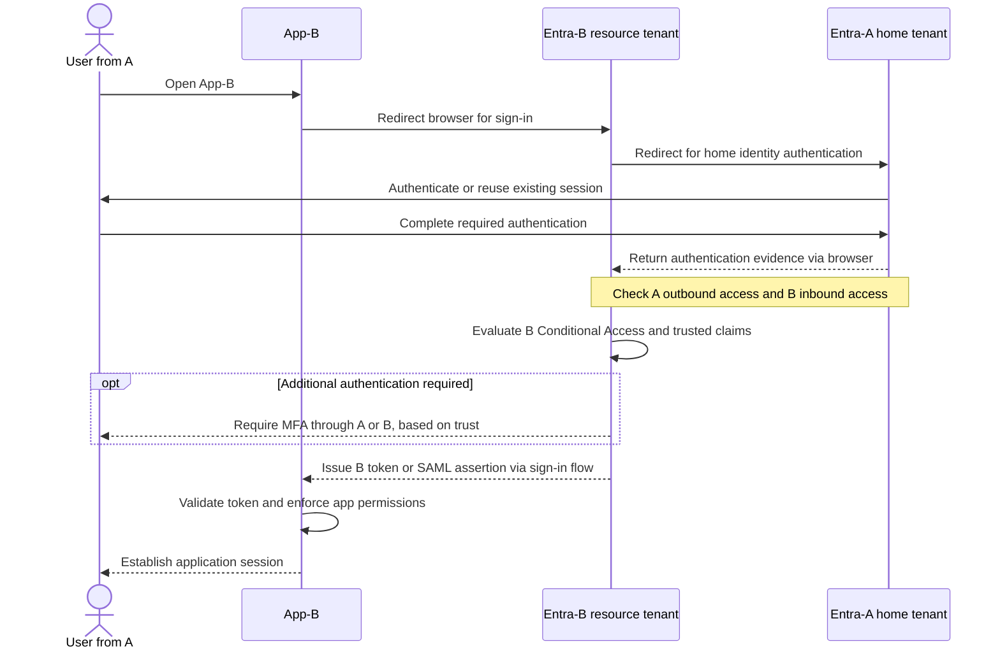

**Entra-A authenticates the user’s home identity. Entra-B controls access to App-B and issues the token App-B accepts. Both tenants have sign-in logs.**

This assumes App-B uses Entra-B for SAML or OpenID Connect sign-in, and the guest account is linked to the user’s Entra-A identity.

**The correct terminology**

| Your scenario                        | Microsoft terminology                                | Meaning                                                               |
| ------------------------------------ | ---------------------------------------------------- | --------------------------------------------------------------------- |
| Entra-A                              | **Home tenant**                                      | Owns and manages the user’s original identity.                        |
| Entra-B                              | **Resource tenant**, also called the inviting tenant | Contains the guest representation and the application being accessed. |
| User from A represented in B         | **B2B collaboration guest user**                     | An external identity given access in B.                               |
| A allows its user to access B        | **Outbound B2B collaboration access**                | Controlled through A’s cross-tenant access settings.                  |
| B allows users from A                | **Inbound B2B collaboration access**                 | Controlled through B’s cross-tenant access settings.                  |
| B accepts A’s MFA or device evidence | **Inbound trust settings**                           | B chooses which claims from A it accepts.                             |

These are Microsoft Entra External ID **B2B collaboration** concepts. ([Microsoft Learn][1])

You can describe your setup as:

> **One-way B2B collaboration: users from Entra-A access applications in Entra-B as guests.**

“One-way trust” is informal here. Be explicit about the direction: **A’s users access B’s resources; B optionally trusts A’s MFA and device claims.** This does not automatically grant B’s users access to A. For strictly one-way access, configure the reverse direction appropriately; B2B collaboration is allowed by default within the same cloud unless restricted. ([Microsoft Learn][2])

**User and application sign-in flow**

This is a conceptual flow; redirects and token exchanges vary between SAML and OIDC. **Primary authentication happens in A; B evaluates access to its resource.** An existing session can satisfy authentication without another password prompt. ([Microsoft Learn][1])

From the application’s perspective, the user signs in **through Entra-B**. App-B validates B’s token or assertion, then applies its own roles and permissions. Successfully authenticating does not by itself grant every permission within the app.

**Conditional Access: which tenant is responsible?**

The correct name is **Conditional Access**, rather than “conditional authentication.”

**B is responsible for the Conditional Access requirements protecting App-B.** A manages the home identity and its applicable controls; A also controls outbound collaboration. Do not assume a policy protecting an application in A automatically protects App-B. Conditional Access depends on the targeted users and resources. ([Microsoft Learn][3])

| Example requirement                       | How it works                                                                                            |
| ----------------------------------------- | ------------------------------------------------------------------------------------------------------- |
| B requires MFA and trusts A’s MFA         | Valid MFA evidence from A can satisfy B. If more authentication is needed, the user is challenged in A. |
| B requires MFA and does not trust A’s MFA | The B2B guest must satisfy MFA in B, potentially registering a separate method there.                   |
| B requires a compliant device             | B must trust A’s device-compliance claim for A’s managed device to satisfy that requirement.            |
| B blocks access from a location           | B’s applicable block still applies even if authentication in A succeeded.                               |

Trusting A’s MFA **does not disable B’s policies**: it lets evidence from A satisfy a particular requirement. ([Microsoft Learn][1])

For example, suppose **B requires MFA and blocks access outside an approved location**. A user successfully completing MFA in A can still be denied by B because of the location condition. B accepting A’s MFA does not mean B accepts every access decision made by A.

**Which tenant has authentication logs?**

**Both A and B generate sign-in records for B2B collaboration.** Their records provide different views of the sign-in, so investigate both when troubleshooting. ([GitHub][4])

| Where to look            | What to investigate                                                                                                       |
| ------------------------ | ------------------------------------------------------------------------------------------------------------------------- |
| **Entra-A sign-in logs** | Home identity authentication, authentication failures, and MFA performed in A.                                            |
| **Entra-B sign-in logs** | Guest access to App-B, B’s Conditional Access results, cross-tenant access failures, and MFA requirements evaluated in B. |
| **App-B logs**           | Application session creation, app-specific permission failures, and actions after login.                                  |

In each tenant, open **Entra ID → Monitoring & health → Sign-in logs**. Inspect:

* **Home tenant ID:** A.
* **Resource tenant ID:** B.
* **Cross-tenant access type:** `b2bCollaboration`.
* **Authentication Details:** methods used and whether existing claims satisfied authentication.
* **Conditional Access:** that tenant’s evaluated policies and results.

Check both interactive and non-interactive sign-ins when sessions or token renewal are involved. The two tenants’ records need not show identical authentication details. ([Microsoft Learn][5])

[1]: https://learn.microsoft.com/en-us/entra/external-id/authentication-conditional-access?utm_source=chatgpt.com "Authentication and Conditional Access for B2B users - Microsoft Entra External ID"
[2]: https://learn.microsoft.com/en-us/entra/external-id/cross-tenant-access-overview?utm_source=chatgpt.com "Cross-tenant access overview - Microsoft Entra External ID"
[3]: https://learn.microsoft.com/en-us/entra/identity/conditional-access/concept-conditional-access-users-groups?utm_source=chatgpt.com "Conditional Access Setup: Users, Groups, Agents, and Workload Identities - Microsoft Entra ID"
[4]: https://github.com/MicrosoftDocs/entra-docs/blob/main/docs/external-id/tenant-restrictions-v2.md?utm_source=chatgpt.com "entra-docs/docs/external-id/tenant-restrictions-v2.md at main · MicrosoftDocs/entra-docs"
[5]: https://learn.microsoft.com/en-us/entra/identity/monitoring-health/concept-sign-in-log-activity-details?utm_source=chatgpt.com "Learn about the sign-in log activity details - Microsoft Entra ID"
