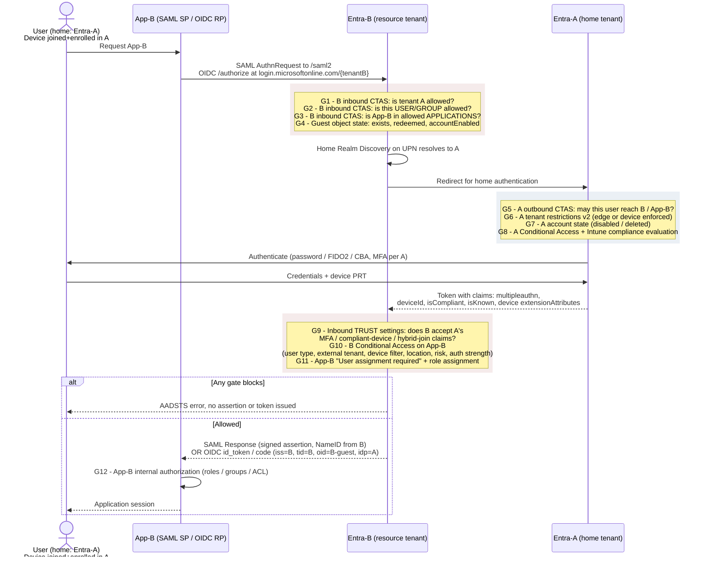
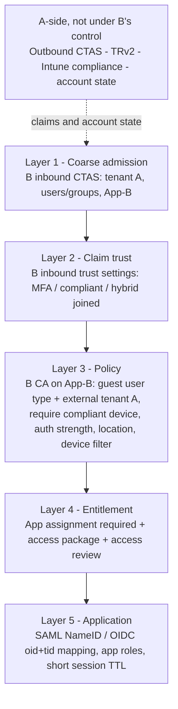

# Entra B2B: Blocking User and Device Access to App-B

**Direction:** Entra-A is the **home tenant** (owns user + device). Entra-B is the **resource tenant** (owns App-B and issues the token App-B consumes). This matches the original scenario direction.

---

## 1. Scope and assumptions

| # | Assumption | If false |
|---|---|---|
| 1 | Both A and B are Microsoft Entra ID workforce tenants | Email OTP / MSA / Google / SAML-WS-Fed federated guests behave differently — **B is always responsible for MFA** for non-Entra external users |
| 2 | App-B is registered in **Entra-B** and uses Entra-B for SAML or OIDC SSO | If App-B is multi-tenant and registered elsewhere, the issuing tenant changes |
| 3 | The guest object exists in B and the invitation is **redeemed** | Nothing below applies until redemption completes |
| 4 | The user's device is Entra joined and Intune enrolled in **A** | B has no device object for it regardless |
| 5 | Both tenants are in the **same Microsoft cloud** | Cross-cloud requires Microsoft cloud settings on both sides — see §9 |
| 6 | Cross-tenant access settings have an org-specific entry for the partner in both tenants | Default settings apply instead (inbound/outbound allowed, **no** claim trust) |

---

## 2. Role map

| Element | Tenant | Role |
|---|---|---|
| App-B (SAML SP / OIDC RP) | **Entra-B** | Resource tenant, token issuer, CA enforcement point |
| User identity | **Entra-A** | Home tenant, authenticating IdP, credential owner |
| Device (Entra joined + Intune enrolled) | **Entra-A** | Home tenant owns the device object and compliance state |
| Guest object `user_a.com#EXT#@tenantB.onmicrosoft.com` | **Entra-B** | The principal App-B actually sees |

"Trust established between A and B" means: an org-specific entry in **B's inbound** and **A's outbound** cross-tenant access settings, plus optional **inbound trust settings** in B. There is no trust object, no transitivity, no cross-tenant Kerberos. It is not an AD forest trust.

---

## 3. Terminology

| Informal | Correct Microsoft term | Notes |
|---|---|---|
| Entra-A | **Home tenant** | Owns and authenticates the original identity |
| Entra-B | **Resource tenant** | Contains the guest object and App-B |
| "One-way trust" | **One-way B2B collaboration** | Users from A access resources in B as guests |
| Guest from A in B | **B2B collaboration guest user** | `userType = Guest` (can be flipped to `Member` — see §5) |
| A permits its users to reach B | **Outbound access settings** (in A) | Cross-tenant access settings |
| B permits A's users | **Inbound access settings** (in B) | Cross-tenant access settings |
| B accepts A's MFA / device evidence | **Inbound trust settings** (in B) | Independent of inbound access |
| "Conditional authentication" | **Conditional Access** | — |

**Do not use:** "federation" (AD sense), "one-way trust", "Azure AD B2B" (legacy brand — now **Microsoft Entra External ID**).

**Not this scenario:** B2B direct connect (no guest object, blocked by default both directions, unsupported cross-cloud), cross-tenant synchronization (provisioning mechanism), external tenants / CIAM (different product surface).

---

## 4. Flow with enforcement gates



---

## 5. Blocking by **User**

| Gate | Control point | Tenant | Granularity | Effect and notes |
|---|---|---|---|---|
| G1 | Inbound CTAS → organizational settings → B2B collaboration → **Block** | **B** | All of tenant A | Nuclear. Kills every A user to every B app |
| G2 | Inbound CTAS → **Users and groups** tab | **B** | Named users/groups in A (object ID) | You must obtain A's user/group object IDs — B cannot browse A's directory |
| G3 | Inbound CTAS → **Applications** tab | **B** | App-B's app ID | Blocks A's users from App-B while leaving other B apps open. Verify behavior for non-gallery SAML SPs |
| G4 | Guest object → `accountEnabled = false`, or delete | **B** | Single guest | Fastest unilateral revocation lever B owns |
| G5 | Outbound CTAS → B2B collaboration | **A** | A's users/groups, and target app IDs in B | A's lever. Useful when A enforces egress policy |
| G6 | **Tenant restrictions v2** | **A** | All of B, or named tenants | Enforced at A's network edge or on A's managed devices. **No sign-in log is generated in the tenant where the TRv2 policy is configured** |
| G7 | Disable / delete the user in A | **A** | Single user | Authentication fails upstream; B never receives a token |
| G10 | **Conditional Access** in B: Target = App-B, Users = *Guest or external users* → *B2B collaboration guest users* + **select external tenants** = A → **Block** | **B** | User type, specific home tenant, named users/groups | Primary policy surface. CA supports targeting specific guest/external user types and the tenants containing those users |
| G11 | Enterprise app → **User assignment required = Yes**, leave guest unassigned | **B** | Per-app | Fails with `AADSTS50105`. Identical behavior for SAML and OIDC |
| — | External collaboration settings → allow/block **domain list** | **B** | A's domain | Blocks invitation and redemption. Does **not** revoke already-redeemed guests |
| — | Entitlement management access package + access review | **B** | Per-guest, time-bound | Best lifecycle control — removes group and app assignment automatically on expiry |
| G12 | App-B internal RBAC | — | App-native | Last resort, independent of Entra |

### User-targeting traps

- If the B2B user's `userType` was flipped to `Member`, a CA policy scoped to *B2B collaboration guest users* **silently misses them**. Also scope *B2B collaboration member users*, or target the group directly.
- If you restrict inbound **applications** to an allowlist and B's CA requires guests to register MFA in B, you must allow app ID `0000000c-0000-0000-c000-000000000000` (My Sign-Ins / security info registration) or guests deadlock: CA demands MFA, the registration app is blocked.
- CA group targeting: users in more than 2048 groups (direct + nested) may be blocked outright.

---

## 6. Blocking by **Device**

**The structural constraint:** B has no device object for A's endpoint. A device is managed only by its home tenant, and a mobile device cannot be registered in more than one tenant at a time. Everything below works around that.

### What works

| Control | Tenant | Requirement |
|---|---|---|
| CA grant: **Require device to be marked as compliant** | **B** | B must enable **Trust compliant devices** in inbound trust settings for A. Without it, guest sign-ins hard-fail with `AcceptCompliantDevice setting isn't configured` and the guest has **no self-service remedy** |
| CA grant: **Require Microsoft Entra hybrid joined device** | **B** | B must enable **Trust Microsoft Entra hybrid joined devices** for A |
| CA **device filter** (allow or block named devices / classes) | **B** + **A** | Documented cross-tenant pattern: (1) B configures CTAS to trust device claims from A, (2) **A** stamps the target device attribute into a supported **device extension attribute**, (3) B writes a CA device filter matching that attribute |
| Intune compliance policy | **A** | Marking the device non-compliant in A strips `isCompliant` from the claim set; B's CA then denies. This is A's per-device kill switch |
| CA condition: **Locations / named IP ranges** | **B** | Enforceable if B defines a trusted IP range representing A's egress. Practical proxy for "corporate A device on A's network" |
| CA condition: **Device platforms** / **Client apps** | **B** | Coarse. Platform is derived from user agent, not attestation. Use to exclude mobile browsers, not as a security boundary |

### What does not work

| Control | Why |
|---|---|
| **Require approved client app** | Requires the device to be registered in the **resource tenant**; iOS/Android only; cannot apply to guests whose device is managed elsewhere |
| **Require app protection policy** | Same constraint. Microsoft explicitly does not recommend this for external users |
| Device filters on **B's own** device attributes (`device.deviceId`, `device.trustType`, `device.isCompliant` from B's directory) | No device object exists in B. Only the extension-attribute-via-claim pattern above works |
| Enrolling A's device into B's Intune | A device cannot be dual-enrolled |
| Requiring device compliance **without** enabling trust settings | Guaranteed outage, not a control |

---

## 7. SAML vs OIDC

CA, cross-tenant access settings, inbound trust settings, and app assignment are **protocol-agnostic** — all evaluated at Entra-B's token issuance, before any assertion or `id_token` is minted. The differences are downstream.

| Aspect | SAML (App-B as SP) | OIDC (App-B as RP) |
|---|---|---|
| Identity delivered | NameID per **Attributes & Claims** mapping on the SSO blade | `sub`, `oid` (B's guest object), `tid` = B, `idp` = A's issuer, `acct` = 1 (optional claim) |
| **Guest breakage risk** | Default NameID source `user.userprincipalname` yields `user_a.com#EXT#@tenantB.onmicrosoft.com` — usually fails SP user matching. Map `user.mail` or `user.othermail` instead | `preferred_username` has the same `#EXT#` shape. Key authorization off `oid` + `tid`, never UPN |
| Groups / roles | Group claim emits **B's** group object IDs only — A's group memberships never flow | Same. Use app roles assigned in B |
| **Session revocation latency** | Disabling the guest does **not** terminate an active SP session. SAML has no CAE; the SP's own cookie governs | Same for third-party RPs. CAE applies only to CAE-capable Microsoft resources |
| Re-evaluation lever | CA **Sign-in frequency**, effective only on the next SP-initiated AuthnRequest | Sign-in frequency + `Revoke-MgUserSignInSession` to invalidate refresh tokens |

**Implication for blocking:** neither protocol gives immediate cutoff at the app tier. Effective revocation time ≈ App-B's session TTL. If you need fast revocation, shorten the SP/RP session lifetime and pair it with CA sign-in frequency. Design for the lag explicitly.

---

## 8. Recommended layering



Deny at the **lowest layer that expresses the requirement**. CTAS blocks are cheap, evaluated early, and immune to CA policy drift or licensing gaps. Reserve CA for conditional logic — device posture, location, risk, authentication strength — that CTAS cannot express.

---

## 9. Cross-cloud caveat (commercial ↔ Azure Government)

If A and B sit in different Microsoft clouds, everything above is gated behind additional configuration:

- B2B collaboration is **not** enabled by default across national cloud boundaries. Microsoft cloud settings enable it between Azure commercial and Azure Government, and between commercial and 21Vianet.
- Both tenants must enable the partner's cloud in **Microsoft cloud settings**.
- Selecting a cloud does **not** enable collaboration by itself — all B2B collaboration is blocked by default for organizations in that cloud until you add the specific partner tenant to organizational settings.
- Domain-name lookup is unavailable cross-cloud. You need the partner's **tenant ID**.
- **B2B direct connect is not supported** across Microsoft clouds.
- `AADSTS90072` is the canonical symptom of external MFA claims not being trusted / the account not existing as an external user in the resource tenant.
- Within Azure US Government, B2B works between Gov tenants that support it. Invitations to tenants outside that set fail or cannot be redeemed.

---

## 10. Logging and verification per gate

| Gate | Where the evidence lands | What to look for |
|---|---|---|
| G1–G4 (B inbound CTAS, guest state) | **B** sign-in logs | `crossTenantAccessType = b2bCollaboration`; failure reason naming cross-tenant access policy |
| G5 (A outbound CTAS) | **A** sign-in logs | Outbound denial; resource tenant ID = B |
| G6 (TRv2) | **Neither** tenant's sign-in logs | Audit logs only. Plan for this blind spot |
| G7–G8 (A account state, A CA, compliance) | **A** sign-in logs | A's CA results, authentication methods, device compliance evaluation |
| G9–G11 (B trust settings, B CA, assignment) | **B** sign-in logs | B's CA results, Authentication Details, app assignment failure |
| G12 (app authorization) | App-B logs | Session creation, role/permission denial after successful token validation |

**Sign-in log mechanics**

- The sign-in log carries both **Home tenant** and **Resource tenant** IDs. Due to privacy commitments, Entra does **not** populate the home tenant *name* in cross-tenant scenarios — correlate by GUID.
- To find all inbound external access in B: select entries where home tenant ≠ resource tenant.
- `crossTenantAccessType` values include `none`, `b2bCollaboration`, `b2bDirectConnect`, `microsoftSupport`, `serviceProvider`, and `passthrough` (authentication forwarded to the home IdP without credential re-entry).
- CA evaluation results appear **only in the tenant that evaluated the policy**. B's CA results are never in A's logs.
- A's and B's records are **separate events with different correlation IDs**. There is no reliable 1:1 join. If the user had a live session in A, A may emit only a non-interactive record, or none.
- Purpose-built tool: **Cross-tenant access activity workbook** — Entra admin center → Entra ID → Monitoring & health → Workbooks. Groups inbound and outbound sign-in activity by tenant ID, application, and user. 90-day maximum range; requires Log Analytics integration.

**Graph / PowerShell**

```powershell
# All B2B collaboration sign-ins into the resource tenant (B)
Get-MgAuditLogSignIn -Filter "ResourceTenantId eq '<TENANT_B_GUID>' and CrossTenantAccessType eq 'b2bcollaboration'" -All
```

```kql
// KQL: guest sign-ins to App-B with CA outcome
SigninLogs
| where TimeGenerated > ago(30d)
| where UserType == "Guest"
| where AppDisplayName == "App-B"
| extend HomeTenant = tostring(HomeTenantId), ResourceTenant = tostring(ResourceTenantId)
| where HomeTenant != ResourceTenant
| project TimeGenerated, UserPrincipalName, HomeTenant, ConditionalAccessStatus,
          ResultType, ResultDescription, DeviceDetail, AuthenticationRequirement
| order by TimeGenerated desc
```

**Common error codes** — verify against your own tenant before publishing, as codes and strings shift:

| Code / string | Typical meaning |
|---|---|
| `AADSTS50020` | User account from the home IdP does not exist in / cannot access the resource tenant |
| `AADSTS50105` | Signed-in user is not assigned a role for the application (G11) |
| `AADSTS53003` | Access blocked by Conditional Access policies (G10) |
| `AADSTS53000` | Device is not in required device state: compliant |
| `AADSTS90072` | Account must be added as an external user in the tenant first / external MFA claims not trusted |
| `AcceptCompliantDevice setting isn't configured` | B requires compliant device but has not enabled **Trust compliant devices** for A (G9) |

---

## 11. Pre-production test matrix

| # | Test | Expected |
|---|---|---|
| 1 | Guest object present in B, invitation status = Accepted | Redemption complete |
| 2 | Sign in to App-B from an A-managed compliant device | Success; B log shows `b2bCollaboration`, CA satisfied via trusted compliance claim |
| 3 | Mark device non-compliant in A's Intune, retry | Denied at G10; B log shows CA failure on device compliance |
| 4 | Remove the user from B's inbound CTAS user scope, retry | Denied at G2 before HRD redirect |
| 5 | Disable the guest in B, retry | Denied at G4; **existing App-B session persists** until SP TTL expires |
| 6 | Set App-B assignment required, unassign guest, retry | `AADSTS50105` |
| 7 | Disable **Trust compliant devices** in B while CA requires compliance | Hard fail — confirms the outage mode in §6 |
| 8 | Run all CA policies in **report-only** first | No user impact; validates targeting against guest user types |

---

## 12. Sources

- Authentication and Conditional Access for B2B users — https://learn.microsoft.com/en-us/entra/external-id/authentication-conditional-access
- Cross-tenant access overview — https://learn.microsoft.com/en-us/entra/external-id/cross-tenant-access-overview
- Configure cross-tenant access settings for B2B collaboration — https://learn.microsoft.com/en-us/entra/external-id/cross-tenant-access-settings-b2b-collaboration
- Conditional Access: users, groups, and workload identities — https://learn.microsoft.com/en-us/entra/identity/conditional-access/concept-conditional-access-users-groups
- Sign-in log activity details — https://learn.microsoft.com/en-us/entra/identity/monitoring-health/concept-sign-in-log-activity-details
- Tenant restrictions v2 — https://learn.microsoft.com/en-us/entra/external-id/tenant-restrictions-v2
- Microsoft cloud settings (cross-cloud) — https://learn.microsoft.com/en-us/entra/external-id/cross-cloud-settings
- Entra B2B in government and national clouds — https://learn.microsoft.com/en-us/entra/external-id/b2b-government-national-clouds
