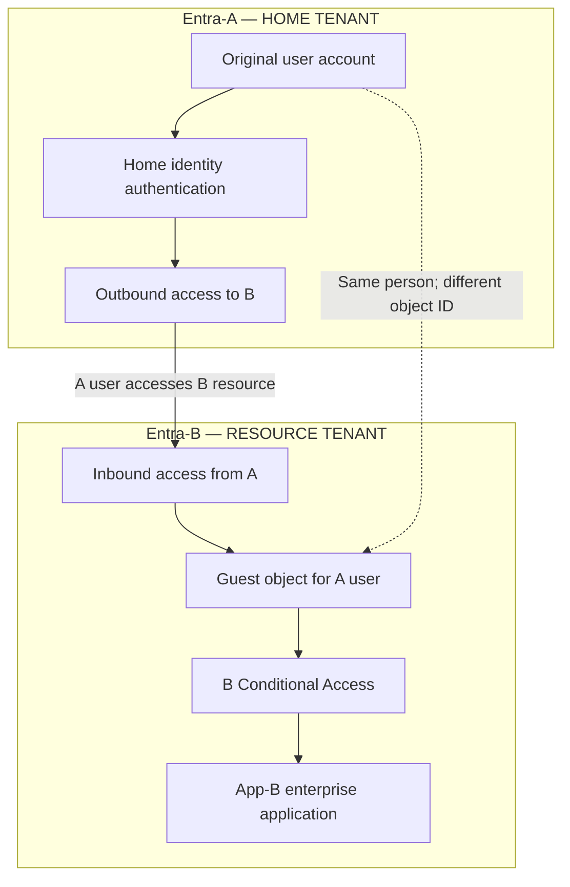
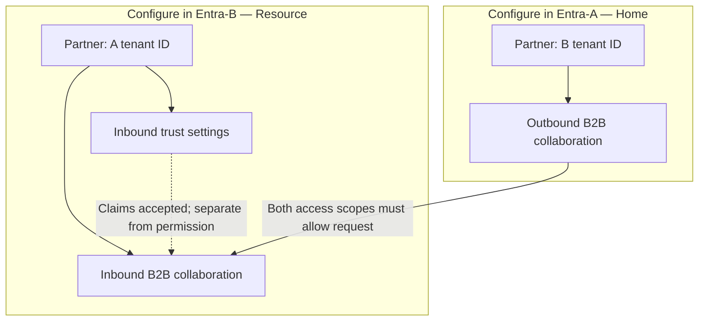

# Entra B2B Collaboration: A → B Guest Access Reference

**One-line answer:** Entra-A authenticates the user's home identity. Entra-B evaluates access and issues the token App-B accepts. Both tenants produce sign-in records, and they show different halves of the same event.

---

## 1. Scope and assumptions

This document describes **one-way B2B collaboration**: users whose identities live in Entra-A access an application registered in Entra-B, represented in B as guest objects.

| Assumption | If this is not true |
| ---------------------------------------------------------------------- | -------------------------------------------------------------------------------- |
| App-B is registered in **Entra-B** and uses B for SAML or OIDC sign-in | See §11 — a multi-tenant app registration changes which tenant issues the token  |
| A guest object exists in B, linked to the user's Entra-A identity      | See §10 — redemption state gates the flow                                        |
| Both tenants are in the **same Microsoft cloud**                       | See §9 — cross-cloud requires explicit enablement on both sides                  |
| Both A and B are Microsoft Entra tenants                               | Social IdPs, email OTP, and SAML/WS-Fed direct federation follow different flows |

### Naming used in this document

| Label | Microsoft term | Role |
| -------------------------- | ----------------------------------------------- | ------------------------------------------ |
| **Entra-A**                | Home tenant                                     | Owns the user identity and its credentials |
| **Entra-B**                | Resource tenant (also: inviting tenant)         | Hosts App-B and the guest object           |
| **App-B**                  | Enterprise application / service principal in B | Relying party                              |

### 1.1 Home tenant and resource tenant: where are they defined?

**These are roles in this access scenario, not tenant settings you turn on.** A is the home tenant because the original user identity lives there. B is the resource tenant because App-B uses B for this sign-in and the external user is represented there. Either tenant can play the opposite role for a different application and user. [2][6]



This diagram shows ownership and access relationships, not network hops. App-B itself can run elsewhere, including AWS; its enterprise application/service principal and sign-in integration are in B. Verify the original account in A, the guest in B, and App-B in B. Sign-in logs expose the **Home tenant ID** and **Resource tenant ID**.

Both A/B labels and home/resource names are retained to identify the owner of each setting.

---

## 2. Correct terminology

| Concept | Microsoft term | Meaning |
| ---------------------------------------------------------------------------------- | --------------------------------------------------- | ------------------------------------------------------------------------------------------------ |
| A's user represented in B                                                          | **B2B collaboration guest user**                    | User object in B with `UserType = Guest`, UPN in `#EXT#` form                                    |
| A permits its users to reach B                                                     | **Outbound B2B collaboration access**               | Configured in A's cross-tenant access settings                                                   |
| B permits users from A                                                             | **Inbound B2B collaboration access**                | Configured in B's cross-tenant access settings                                                   |
| B accepts A's MFA or device evidence                                               | **Inbound trust settings**                          | Three independent checkboxes in B: trust MFA, trust compliant device, trust hybrid-joined device |
| A restricts which foreign tenants its users may reach, from A's network or devices | **Tenant restrictions v2**                          | A separate egress control — *not* the same as outbound cross-tenant access settings              |
| The umbrella feature set                                                           | **Microsoft Entra External ID — B2B collaboration** | —                                                                                                |

Describe the scenario as:

> **One-way B2B collaboration: users from Entra-A access App-B in Entra-B as guests. Entra-B optionally trusts Entra-A's MFA and device claims.**

---

## 3. One-way access and claim trust

Entra uses cross-tenant access policies and inbound claim-trust settings. The following four user/application scopes must allow A → B access; Conditional Access, guest lifecycle, and application permissions also apply:

| # | Tenant | Policy | Must allow |
| --------------------------- | - | ---------------------------------- | ------------------------------------------------ |
| 1                           | A | Cross-tenant access → Outbound → B | B2B collaboration for the user or group          |
| 2                           | A | Cross-tenant access → Outbound → B | The target application scope                     |
| 3                           | B | Cross-tenant access → Inbound → A  | B2B collaboration for the external user or group |
| 4                           | B | Cross-tenant access → Inbound → A  | App-B in the application scope                   |

A fifth, orthogonal control — **inbound trust settings in B** — determines which of A's claims B will accept. It does not grant or deny access on its own.

**Default state:** B2B collaboration is enabled by default between Entra tenants in the same cloud; MFA and device claims from other tenants are **not** trusted by default; B2B direct connect is blocked by default. "One-way" is therefore something you *configure*, not something you get.

---

### 3.1 Where each setting is configured

Switch the admin center to the correct tenant first. Under **Entra ID → External Identities → Cross-tenant access settings → Organizational settings**, select/add the partner. Custom partner settings override inherited defaults; a newly added partner initially inherits defaults. [2][3]

| Configure in | Partner entry | Open | Purpose |
| --- | --- | --- | --- |
| **A — home** | **B tenant ID** | Outbound access → B2B collaboration | Allow intended A users/groups and external applications. |
| **B — resource** | **A tenant ID** | Inbound access → B2B collaboration | Allow intended external A users/groups and App-B. |
| **B — resource** | **A tenant ID** | Inbound access → Trust settings | Accept selected MFA and device claims from A. |



**B's MFA requirement and B's acceptance of A's MFA are separate settings.** B's Conditional Access policy requires MFA; B's inbound trust settings determine whether A's evidence can satisfy it. [1][3]

### 3.2 Related objects and policy locations

| Tenant | Admin center location | Inspect |
| --- | --- | --- |
| A | Entra ID → Users → All users | Original user account. |
| B | Entra ID → Users → All users | Guest identity and invitation state. |
| B | Entra ID → Enterprise applications → App-B → Users and groups | Guest/group assignment. |
| B | Entra ID → Enterprise applications → App-B → Properties | Assignment required setting. |
| B | Entra ID → Conditional Access → Policies | App-B policies targeting guest/external users. |
| A and B | Entra ID → Monitoring & health → Sign-in logs | Tenant IDs, authentication, and policy results. |

In B's inbound external-user scope, selected external user/group IDs come from **A**. App assignments in B refer to the **B guest object or B groups**. [3]

For strictly one-way access, also restrict the reverse **B → A** direction through the relevant B outbound/A inbound settings. Allowing A → B alone does not disable reverse access. [2]

---

## 4. Authentication flow

```mermaid
sequenceDiagram
    autonumber
    actor U as User (home identity in A)
    participant BR as Browser
    participant App as App-B
    participant B as Entra-B (resource tenant)
    participant A as Entra-A (home tenant)

    U->>BR: Open App-B
    BR->>App: Request application URL
    App->>BR: Redirect to Entra-B authorize endpoint
    BR->>B: SAML AuthnRequest or OIDC authorize request
    B->>B: Home realm discovery on the #EXT# guest object
    Note over A,B: Gate 1 - cross-tenant access; A outbound to B AND B inbound from A
    B->>BR: Redirect to Entra-A for authentication
    BR->>A: Authenticate home identity
    A->>A: Apply applicable home authentication controls
    A->>BR: Return home-tenant token (front channel)
    BR->>B: Deliver home-tenant assertion
    Note over B: Gate 2 - B Conditional Access on App-B
    opt B requires MFA
    alt B trusts A MFA and claim is present
        B->>B: MFA requirement satisfied by A claim
    else B trusts A MFA but claim is absent
        B->>BR: Redirect to A to perform MFA
        BR->>A: Complete MFA in home tenant
        A->>BR: Return with MFA claim
        BR->>B: Resubmit
    else B does not trust A MFA
        B->>U: Challenge or register MFA in B
    end
    end
    opt Invitation not yet redeemed
        B->>U: Consent and redemption prompt
    end
    B->>BR: Issue B token - form POST for SAML, auth code for OIDC
    BR->>App: Deliver assertion or code
    App->>App: Validate assertion or token for B and App-B; apply roles
    App->>U: Application session established

```

**Reading the diagram:**

- **Primary authentication happens in A.** An existing session in A can satisfy it with no credential prompt.
- **The resource decision happens in B.** B is the issuer App-B trusts.
- **Cross-tenant access settings must permit the request.** Checks are grouped conceptually here; this does not guarantee their exact order or that every blocked attempt reaches both tenants. Session reuse may remove visible prompts.
- Redirects and token exchange differ between SAML and OIDC; this is the conceptual shape, not a wire trace.

---

## 5. What App-B actually receives

The token is **B's token**. This is the most frequently missed point in cross-tenant app integration.

| Claim | Value | Consequence |
| ---------------------------- | --------------------------------------------------------------- | ------------------------------------------------------------------------------------ |
| `iss`                        | B's STS (`https://login.microsoftonline.com/<tenantB-id>/v2.0`) | App-B validates against B's metadata, never A's                                      |
| `tid`                        | **B's** tenant ID                                               | Not the user's home tenant                                                           |
| `oid`                        | Guest object ID **in B**                                        | Not A's object ID for the same human. Authorization keyed to A-side GUIDs will break |
| `sub`                        | Pairwise, per application, within B                             | Stable only for that app in that tenant                                              |
| `idp`                        | A's issuer URI                                                  | Identifies the authenticating IdP when present; availability depends on the token                                        |
| `preferred_username` / `upn` | Claim-dependent: email/login name or guest UPN                 | Breaks naive email matching and string-based SIEM correlation                        |
| SAML `NameID`                | Issued by B per the enterprise app's claim configuration        | Same caveat as `oid`                                                                 |

**SIEM implication:** home tenant ID and `idp` identify the provider, not a unique user or event. Correlate time, app/resource, available request/correlation identifiers, and a verified A-user-to-B-guest mapping. Do not assume object IDs or usernames match across tenants.

---

## 6. Authentication is not authorization

Successful sign-in through B does not grant access inside App-B. Three separate gates sit after the token:

| Gate | Where configured | Effect |
| ---------------------------------------------------- | --------------------------------------------------------- | ---------------------------------------------------------------------------------------------------- |
| **Assignment required** on App-B's service principal | B → Enterprise applications → Properties                  | If Yes, the guest needs an explicit user or group assignment                                         |
| **App role / group membership**                      | B                                                         | Drives the `roles` or `groups` claim App-B consumes                                                  |
| **Guest user access restrictions**                   | B → External Identities → External collaboration settings | Governs directory read permissions for guests — *not* app access. Frequently confused with the above |

---

## 7. Conditional Access — which tenant is responsible

The correct term is **Conditional Access**, not "conditional authentication."

**B applies Conditional Access to App-B. Home controls depend on policy scope and the authentication request:**

| Tenant | What it evaluates | What it cannot do |
| ------------------------------------------- | ---------------------------------------------------------------------------------------------------------------- | --------------------------------------------------------------------------------------------------------------------------------------------------------------------------------- |
| **A (home)**                                | Applicable home authentication controls; verify policy applicability in A’s logs rather than assuming every All resources policy fires                        | Cannot generally target App-B by app ID. Scoping which foreign tenants A's users may reach is done with **outbound cross-tenant access settings** plus **tenant restrictions v2** |
| **B (resource)**                            | Access to App-B — grant controls, session controls, sign-in frequency, location, device, authentication strength | Cannot inspect or override A's internal policy decisions. It can only accept or reject the claims A produced                                                                      |

A policy protecting an application in A does **not** protect App-B. CA scope is determined by the targeted users and resources in the tenant where the policy lives.

### MFA and device trust matrix

| B's requirement | B's inbound trust setting | Result |
| ------------------------------------------------- | ------------------------------------------ | ----------------------------------------------------------------------------------------------- |
| Require MFA                                       | Trust MFA from A = **On**, claim present   | Satisfied by A's claim. No second prompt                                                        |
| Require MFA                                       | Trust MFA from A = **On**, claim absent    | Entra initiates the MFA challenge **in the home tenant (A)**                                    |
| Require MFA                                       | Trust MFA from A = **Off** (default)       | Guest must complete MFA **in B**, registering a method against the guest object in B            |
| Require compliant device                          | Trust compliant device = **On**            | A's Intune compliance claim can satisfy B                                                       |
| Require compliant device                          | Trust compliant device = **Off** (default) | Effectively blocks guests — the device is not registered in B and cannot become compliant there |
| Block by location                                 | n/a                                        | B's block applies regardless of a successful authentication in A                                |

**Worked example.** B requires MFA *and* blocks access from outside an approved location. The user completes MFA in A successfully and is still denied by B on the location condition. Trusting A's MFA means B accepts one piece of evidence — it does not mean B defers its access decision to A.

---

## 8. Known deadlocks

These are configuration traps, not bugs. Each one produces a failure that looks like a broken trust relationship.

| Symptom | Cause | Fix |
| ------------------------------------------------------------------------------ | ---------------------------------------------------------------------------------------------------- | ----------------------------------------------------------------------------------------------------------------------------------------------------------------------------------------------------------------------------------------------------------------------------------------------------- |
| Guest cannot register MFA in B; blocked in a loop                              | CA policies requiring MFA or Terms of Use prevent the guest from reaching the registration surface   | Allow app ID `0000000c-0000-0000-c000-000000000000` (Microsoft App Access Panel) and `d52792f4-ba38-424d-8140-ada5b883f293` (Terms of Use) in **A's outbound** and **B's inbound** settings. The inbound side must currently be configured via **Microsoft Graph** — the portal UI does not expose it |
| Guest with valid home-tenant MFA is prompted to re-register authenticator in B | MFA trust not enabled, or Identity Protection MFA registration policy in B applies to external users | Enable inbound MFA trust for A, and exclude external users from B's Identity Protection MFA registration policy. With both in force the requirements are unsatisfiable                                                                                                                                |
| Compliant-device policy blocks all guests                                      | Device compliance trust off, device not registered in B                                              | Enable inbound compliant-device trust for A, or exclude external users from that policy                                                                                                                                                                                                               |
| Sign-in fails before reaching A                                                | Inbound or outbound cross-tenant access settings deny the user, group, or application scope          | Check all four switches in §3                                                                                                                                                                                                                                                                         |

---

## 9. Cross-cloud — Azure Government, GCC High, DoD

Everything above assumes both tenants sit in the same Microsoft cloud. If either side is in Azure Government (which includes the Office GCC High and DoD clouds), additional steps are mandatory:

1. **Both** organizations enable the partner's cloud under *External Identities → Cross-tenant access settings → Microsoft cloud settings*. One-sided enablement does nothing.
2. Enabling a cloud **does not enable collaboration**. Once another cloud is enabled, all B2B collaboration with that cloud is blocked by default until the specific partner tenant is added to Organizational settings.
3. **Domain-name lookup is unavailable cross-cloud.** You must obtain and enter the partner's **tenant ID**.
4. **B2B direct connect is not supported** across Microsoft clouds.
5. Cross-cloud users must be **B2B guests**; B2B member accounts are not supported cross-cloud.
6. Azure Government (GCC High / DoD) tenants **cannot** establish a cross-tenant connection with Microsoft Azure operated by 21Vianet.
7. Within Azure US Government, B2B collaboration works between two Gov tenants that both support it, with no Microsoft cloud settings step.

For multi-tenant estates spanning clouds, **cross-cloud synchronization** can automate guest object lifecycle; the authentication flow remains B2B collaboration.

---

## 10. Guest lifecycle and redemption

| Stage | Object state | Notes |
| ------------------------- | --------------------------------------- | ------------------------------------------------------------------------------------------------------------------------------------- |
| Invited                   | `externalUserState = PendingAcceptance` | Object exists in B; some app-initiated flows fail until redeemed                                                                      |
| Redeemed                  | `externalUserState = Accepted`          | Set after the user accepts, or immediately under automatic redemption                                                                 |
| Automatic redemption      | —                                       | Suppresses the consent prompt and invitation email **only** when selected in both A's outbound and B's inbound settings               |
| Redemption order          | Configured in B's inbound defaults      | Determines which IdP is used. Fallback IdPs are Microsoft account (MSA) and email one-time passcode; at least one must remain enabled |

Access reviews on guest objects in B are the standard control for stale external identities. Disabling the user in A prevents future authentication but does **not** remove the guest object in B, and does not immediately invalidate already-issued tokens in B — those remain valid until expiry or revocation.

---

## 11. What this pattern is not

| Pattern | Guest object in B? | Who issues App-B's token | Typical use |
| ---------------------------------------------------------------- | ----------------------- | ----- | --------------------------------------------------------------- |
| **B2B collaboration** (this document)                            | Yes                     | **B** | Partner access to a resource-tenant app                         |
| Multi-tenant app registration in B                               | No                      | **A** | SaaS-style app consumed by many tenants                         |
| B2B direct connect                                               | No                      | B     | Teams shared channels only; blocked by default; same-cloud only |
| Cross-tenant synchronization                                     | Yes, auto-provisioned   | B     | Multi-tenant estates under one organization                     |
| Direct federation / external IdP                                 | Yes (external identity) | B     | Partners without an Entra tenant                                |

If someone asks "which Entra authenticates?" the answer only holds for row 1. In the multi-tenant app pattern the home tenant issues the token and there is no guest object at all.

---

## 12. Logging

**Both tenants generate sign-in records.** They are different views of the same event and neither is complete on its own.

| Source | What it shows | Use it for |
| -------------------------------- | ---------------------------------------------------------------------------------------------------------------------- | ------------------------------------------------------------- |
| **Entra-A sign-in logs**         | Home identity authentication, credential and MFA outcomes, A's CA results, outbound cross-tenant destination           | Credential failures, home-tenant MFA, A-side policy blocks    |
| **Entra-B sign-in logs**         | Guest access to App-B, B's CA results, cross-tenant access denials, MFA requirement evaluation, trusted-claim handling | Everything from Gate 1 onward                                 |
| **App-B application logs**       | Session creation, role and permission failures, post-login activity                                                    | Authorization failures that look like authentication failures |

### Fields to capture

In each tenant: **Entra ID → Monitoring & health → Sign-in logs**.

| Field | Notes |
| ---------------------------- | ------------------------------------------------------------------------------------------------------------------------------------------ |
| **Home tenant**              | ID and name. In cross-tenant scenarios the home tenant **name is not populated** in the resource tenant's logs, by design — expect ID only |
| **Resource tenant**          | The tenant owning the target resource                                                                                                      |
| **Cross-tenant access type** | `none`, `b2bCollaboration`, `b2bDirectConnect`, `passthrough`, `serviceProvider`, `microsoftSupport`                                       |
| **Authentication details**   | Methods used, and whether a pre-existing claim satisfied the requirement                                                                   |
| **Conditional Access**       | That tenant's evaluated policies and their results                                                                                         |

Check the **interactive**, **non-interactive**, and **service principal** sign-in tables. Session reuse and token renewal surface in the non-interactive table, and App-B's own service calls surface in the service principal table.

### Queries

Field names differ between the portal blade, Microsoft Graph, and the Log Analytics `SigninLogs` schema — verify against your own workspace before operationalizing these.

```kql
// Resource tenant (B): all inbound guest access to App-B
SigninLogs
| where HomeTenantId != ResourceTenantId
| where CrossTenantAccessType == "b2bCollaboration"
| where AppDisplayName == "App-B"
| project TimeGenerated, UserPrincipalName, HomeTenantId, IPAddress,
          ResultType, ResultDescription, ConditionalAccessStatus,
          AuthenticationDetails, DeviceDetail

```

```kql
// Home tenant (A): outbound access to external tenants
SigninLogs
| where HomeTenantId != ResourceTenantId
| summarize Attempts = count(), Failures = countif(ResultType != "0")
    by ResourceTenantId, AppDisplayName, UserPrincipalName
| order by Attempts desc

```

Microsoft's guidance for identifying cross-tenant activity is simply to select entries where the home tenant does not match the resource tenant.

The **Cross-tenant access activity workbook** (Entra ID → Monitoring & health → Workbooks) covers both inbound and outbound activity and is faster than hand-built queries for review and access-recertification work.

---

## 13. Troubleshooting decision table

| Symptom | Look here first | Likely cause |
| --------------------------------------------------------- | --------------------------------------------------------- | ----------------------------------------------------------------------------- |
| User never reaches A's sign-in page                       | B sign-in logs, then B and A cross-tenant access settings | One of the four switches in §3 is denying                                     |
| User authenticates in A, then is denied by B              | B sign-in logs → Conditional Access tab                   | B's CA grant or session control failed                                        |
| Repeated MFA prompt despite home-tenant MFA               | B sign-in logs → Authentication Details                   | Inbound MFA trust not enabled for A                                           |
| Guest stuck in MFA registration loop                      | B sign-in logs; B and A cross-tenant app scope            | Registration surface blocked — see §8                                         |
| Token issued but App-B rejects it                         | App-B logs; decode the token                              | App validating against A's issuer, or matching on A-side `oid` / UPN — see §5 |
| Token accepted, user sees nothing                         | App-B logs; B enterprise app assignment                   | Authorization, not authentication — see §6                                    |
| Everything configured, still blocked, Gov tenant involved | B → Microsoft cloud settings                              | Cross-cloud not enabled on both sides, or partner tenant not added — see §9   |

---

## References

1. [Authentication and Conditional Access for B2B users](https://learn.microsoft.com/en-us/entra/external-id/authentication-conditional-access)
2. [Cross-tenant access overview](https://learn.microsoft.com/en-us/entra/external-id/cross-tenant-access-overview)
3. [Configure cross-tenant access settings for B2B collaboration](https://learn.microsoft.com/en-us/entra/external-id/cross-tenant-access-settings-b2b-collaboration)
4. [Microsoft cloud settings (cross-cloud)](https://learn.microsoft.com/en-us/entra/external-id/cross-cloud-settings)
5. [Microsoft Entra B2B in government and national clouds](https://learn.microsoft.com/en-us/entra/external-id/b2b-government-national-clouds)
6. [Sign-in log activity details](https://learn.microsoft.com/en-us/entra/identity/monitoring-health/concept-sign-in-log-activity-details)
7. [What is Microsoft Entra B2B collaboration?](https://learn.microsoft.com/en-us/entra/external-id/what-is-b2b)
8. [Conditional Access: users, groups, and workload identities](https://learn.microsoft.com/en-us/entra/identity/conditional-access/concept-conditional-access-users-groups)
9. [Tenant restrictions v2](https://learn.microsoft.com/en-us/entra/external-id/tenant-restrictions-v2)
