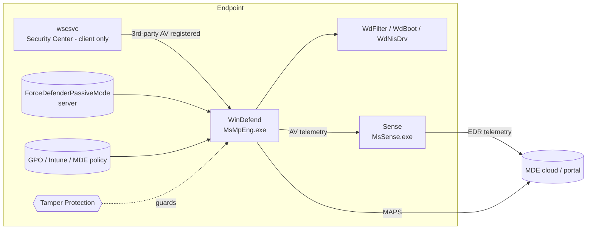

# Running Microsoft Defender Antivirus in Active Mode with MDE (Revised)

"Active mode" is a state of **Microsoft Defender Antivirus (MDAV)**, not of the MDE EDR sensor. The sensor runs the same way whatever mode MDAV is in. What changes is whether MDAV is the primary AV doing real-time protection and remediation.

Two corrections to the earlier version, both based on the sources in §8. Tamper Protection **does** interact with `ForceDefenderPassiveMode`, and reverting a server to passive is not a simple flip. Details are in §4.3.

---

## 1. Acronyms

| Acronym | Meaning |
|---|---|
| **MDE** | Microsoft Defender for Endpoint: the EDR and security platform; the portal is `security.microsoft.com` (commercial) |
| **MDAV** | Microsoft Defender Antivirus: the AV engine built into Windows |
| **AV / AM** | Antivirus / Antimalware. `AM*` properties in `Get-MpComputerStatus` refer to the antimalware engine |
| **EDR** | Endpoint Detection and Response |
| **RTP** | Real-Time Protection (on-access scanning) |
| **WSC** | Windows Security Center: the OS component where AV products register themselves (client OS only) |
| **MAPS** | Microsoft Active Protection Service: cloud-delivered protection lookups |
| **ELAM** | Early Launch Anti-Malware: a boot-start driver that vets drivers before they load |
| **NIS** | Network Inspection System: network-based exploit and intrusion detection in MDAV |
| **IOAV** | IE/Office Attachment and download scanning (the `DisableIOAVProtection` setting) |
| **ASR** | Attack Surface Reduction rules (these need MDAV in active mode) |
| **TP** | Tamper Protection: stops local or unauthorized changes to MDAV settings |
| **SxS** | Side-by-Side: MDAV coexisting with a third-party AV |
| **GPO** | Group Policy Object |
| **MDM** | Mobile Device Management (for example Intune) |
| **ConfigMgr / SCCM** | Microsoft Configuration Manager (formerly System Center Configuration Manager) |
| **WSUS** | Windows Server Update Services |
| **KB** | Knowledge Base article or update ID |
| **HCI** | Hyper-Converged Infrastructure (Azure Stack HCI / Azure Local) |
| **KQL** | Kusto Query Language, used in Advanced Hunting |
| **CIM / WMI** | Common Information Model / Windows Management Instrumentation |
| **EICAR** | European Institute for Computer Antivirus Research; publishes the standard AV test file |
| **GCC High / DoD** | Microsoft 365 US Government Community Cloud High / Department of Defense sovereign tenants |

---

## 2. Components

| Component | Type | Binary / driver | Role | Needed for active mode |
|---|---|---|---|---|
| **WinDefend** | Service | `MsMpEng.exe` | MDAV antimalware engine (scanning, RTP, remediation) | Yes |
| **WdNisSvc** | Service | `NisSrv.exe` | Network Inspection service | Recommended |
| **WdFilter** | Minifilter driver | `WdFilter.sys` | File-system hooks for RTP | Yes |
| **WdBoot** | ELAM driver | `WdBoot.sys` | Boot-time driver vetting | Yes |
| **WdNisDrv** | Network driver | `WdNisDrv.sys` | NIS network hooks | Recommended |
| **MDCoreSvc** | Service | `MpDefenderCoreService.exe` | Defender Core Service, present on newer platform versions | Yes (where present) |
| **Sense** | Service | `MsSense.exe`, `SenseCncProxy.exe`, `SenseIR.exe`, etc. | MDE EDR sensor: telemetry, live response, investigation | Needed for onboarding, not for the AV mode itself |
| **wscsvc** | Service | `svchost` | Windows Security Center (client). Drives automatic active/passive switching | Client only |
| **SecurityHealthService** | Service | `SecurityHealthService.exe` | Windows Security app and health reporting | Client |
| **MpCmdRun.exe** | CLI | `%ProgramFiles%\Windows Defender\` | Updates, scans, diagnostics, MAPS test | Tooling |
| **Platform / Engine / Security intelligence** | Update channels | `%ProgramData%\Microsoft\Windows Defender\Platform\<ver>` | Monthly platform, engine and definition updates | Yes (stale builds cause mode issues) |
| **MAPS / cloud protection** | Cloud service | Gov-specific endpoints in GCC High / DoD | Cloud block, sample submission | Recommended |



---

## 3. Mode reference

| Mode | `AMRunningMode` | RTP | Scans | Remediation | Definitions |
|---|---|---|---|---|---|
| Active | `Normal` | Yes | Yes | Yes | Yes |
| Passive | `Passive Mode` | No | Scheduled/on-demand (detect only) | Only via EDR in block mode | Yes |
| EDR block | `EDR Block Mode` | No | No | Post-breach block by EDR | Yes |
| SxS passive | `SxS Passive Mode` | No | Limited periodic scan (if enabled) | No | Yes |
| Disabled | n/a | No | No | No | No |

---

## 4. Procedure

### 4.1 Windows 10/11 (client): automatic via WSC

| Condition | Result |
|---|---|
| No third-party AV registered in WSC | Active |
| Third-party AV registered, onboarded to MDE | Passive |
| Third-party AV registered, not onboarded | Disabled / SxS passive |

To get a client into active mode:

1. Uninstall the third-party AV with the vendor's cleanup tool so it deregisters from WSC.
2. Clear the policy blockers listed in §5.
3. Reboot.
4. Update everything:
   ```powershell
   Update-MpSignature
   & "$env:ProgramFiles\Windows Defender\MpCmdRun.exe" -SignatureUpdate
   ```

### 4.2 Windows Server: manual, controlled by registry

Microsoft's documentation states that on Windows Server 2016 and later, Windows Server, version 1803 or newer, Windows Server 2012 R2 and Azure Stack HCI OS, version 23H2 and later, Microsoft Defender Antivirus doesn't enter passive mode automatically when you install a non-Microsoft antivirus product. The reverse direction isn't reliable either. When the non-Microsoft antivirus product is uninstalled, Microsoft Defender Antivirus should switch to active mode automatically. However, that switch might not occur on certain versions of Windows Server, such as Windows Server 2016, where Microsoft Defender Antivirus can remain in passive mode or stay disabled.

The controlling value:

```
HKLM\SOFTWARE\Policies\Microsoft\Windows Advanced Threat Protection
  ForceDefenderPassiveMode  (REG_DWORD)   0 = Active   1 = Passive
```

Steps:

1. **Make sure MDAV is installed.**
   ```powershell
   Get-WindowsFeature Windows-Defender*          # 2016+
   Install-WindowsFeature -Name Windows-Defender # if missing; reboot
   ```
   On 2012 R2 and 2016, those endpoints must be onboarded using the modern unified solution (`md4ws.msi`).
2. **Remove the third-party AV.**
3. **Set active mode and reboot.** Microsoft's documented fix for a server that is stuck is to set or define a REG_DWORD entry called ForceDefenderPassiveMode, and set its value to 0. Reboot the device.
   ```powershell
   $k = 'HKLM:\SOFTWARE\Policies\Microsoft\Windows Advanced Threat Protection'
   New-Item $k -Force | Out-Null
   New-ItemProperty $k -Name ForceDefenderPassiveMode -Value 0 -PropertyType DWord -Force
   Restart-Computer
   ```
4. **Update the platform, engine and definitions.** On Server 2016 this is critical because the in-box builds are old.

### 4.3 Tamper Protection and GPO behavior on servers (corrected)

- Beginning with platform version 4.18.2208.0 and later, if a server is onboarded to Microsoft Defender for Endpoint, tamper protection allows a switch to active mode, but not to passive mode. Once TP has let a server go active, tamper protection prevents it from going into passive mode, even if ForceDefenderPassiveMode is set to 1. Setting it back to `1` later will not revert the server while TP is on.
- On the same platform versions, the "Turn off Windows Defender" setting in Group Policy no longer completely disables Windows Defender Antivirus on Windows Server 2012 R2 and later. Instead, it places Microsoft Defender Antivirus into passive mode. However, if "Turn off Windows Defender" is already set before onboarding the device to Defender for Endpoint, there's no change and Microsoft Defender Antivirus remains disabled.
- If you intend to keep a server in passive mode, the ForceDefenderPassiveMode setting needs to be set before onboarding the device.

---

## 5. Policy blockers

| Source | Setting | Required for active mode |
|---|---|---|
| GPO | *Windows Components > Microsoft Defender Antivirus > Turn off Microsoft Defender Antivirus* | Not Configured / Disabled |
| GPO | *…> Real-time Protection > Turn off real-time protection* | Not Configured / Disabled |
| GPO | *…> Turn on Microsoft Defender Antivirus passive mode* (server) | Not Configured / Disabled |
| Registry | `HKLM\SOFTWARE\Policies\Microsoft\Windows Defender\DisableAntiSpyware` / `DisableAntiVirus` | Absent or 0 |
| Registry | `ForceDefenderPassiveMode` | 0 (server) |
| Intune / MDE Security Settings Management | AV policy: *Allow Realtime Monitoring*, *Allow On Access Protection* | Allowed |
| Tamper Protection | Enabled from the portal or Intune | Make MDAV setting changes through the same management plane; local changes are ignored |

---

## 6. Verification commands

### 6.1 Mode and health

```powershell
# Core status
Get-MpComputerStatus | Select AMRunningMode, AMServiceEnabled, AntivirusEnabled,
  RealTimeProtectionEnabled, BehaviorMonitorEnabled, IoavProtectionEnabled,
  NISEnabled, OnAccessProtectionEnabled, IsTamperProtected, TamperProtectionSource,
  AMProductVersion, AMEngineVersion, AntivirusSignatureVersion, AntivirusSignatureLastUpdated

# Services and drivers
Get-Service WinDefend, WdNisSvc, Sense, MDCoreSvc -ErrorAction SilentlyContinue |
  Select Name, Status, StartType
fltmc filters | findstr /i "WdFilter"
sc.exe query WdBoot ; sc.exe query WdFilter ; sc.exe query WdNisDrv

# Effective preferences (anything "True" here is a disabled feature)
Get-MpPreference | Select DisableRealtimeMonitoring, DisableBehaviorMonitoring,
  DisableIOAVProtection, DisableScriptScanning, MAPSReporting, SubmitSamplesConsent

# Mode-driving registry values
reg query "HKLM\SOFTWARE\Policies\Microsoft\Windows Advanced Threat Protection" /v ForceDefenderPassiveMode
reg query "HKLM\SOFTWARE\Microsoft\Windows Defender" /v PassiveMode
reg query "HKLM\SOFTWARE\Policies\Microsoft\Windows Defender" /s
```

### 6.2 Third-party AV registration (client)

```powershell
Get-CimInstance -Namespace root/SecurityCenter2 -ClassName AntivirusProduct |
  Select displayName, productState, pathToSignedReportingExe
```

### 6.3 MDE onboarding and sensor

```powershell
# OnboardingState = 1 means onboarded
reg query "HKLM\SOFTWARE\Microsoft\Windows Advanced Threat Protection\Status" /v OnboardingState
reg query "HKLM\SOFTWARE\Microsoft\Windows Advanced Threat Protection\Status" /v OrgId
Get-Service Sense | Select Status, StartType
```

### 6.4 Connectivity (important for gov tenants)

```powershell
& "$env:ProgramFiles\Windows Defender\MpCmdRun.exe" -ValidateMapsConnection
```

For full sensor connectivity checks, use the **MDE Client Analyzer** (`MDEClientAnalyzer.cmd`). Use the variant or URL set that matches your GCC High / DoD tenant.

### 6.5 Event logs

```powershell
# MDAV operational log: mode changes, config changes, RTP state
Get-WinEvent -LogName "Microsoft-Windows-Windows Defender/Operational" -MaxEvents 50 |
  Where-Object Id -in 5001,5007,5010,5012,1116,1117,2001 |
  Format-Table TimeCreated, Id, Message -Wrap

# MDE sensor log
Get-WinEvent -LogName "Microsoft-Windows-SENSE/Operational" -MaxEvents 50 |
  Format-Table TimeCreated, Id, LevelDisplayName, Message -Wrap
```

| Event ID | Log | Meaning |
|---|---|---|
| 5001 | Defender/Operational | Real-time protection disabled |
| 5007 | Defender/Operational | Configuration changed. Look here for `ForceDefenderPassiveMode` / `PassiveMode` transitions |
| 5010 / 5012 | Defender/Operational | Malware / virus scanning disabled |
| 1116 / 1117 | Defender/Operational | Detection / action taken (proof that active mode is remediating) |
| 2001 | Defender/Operational | Security intelligence update failed |

Microsoft's own validation step for mode changes is to check Event 5007 in the Microsoft-Windows-Windows Defender Operational log for the registry value change.

### 6.6 Functional tests

```powershell
# AV test: EICAR string written to disk should trigger a 1116/1117 in active mode
$e = 'X5O!P%@AP[4\PZX54(P^)7CC)7}$EICAR-STANDARD-ANTIVIRUS-TEST-FILE!$H+H*'
Set-Content -Path "$env:TEMP\eicar.txt" -Value $e
Get-MpThreatDetection | Select -First 3

# MDE EDR detection test (generates a test alert in the portal)
New-Item -ItemType Directory -Path C:\test-MDATP-test -Force | Out-Null
powershell.exe -NoExit -ExecutionPolicy Bypass -WindowStyle Hidden `
  "`$ErrorActionPreference='silentlycontinue';(New-Object System.Net.WebClient).DownloadFile('http://127.0.0.1/1.exe','C:\\test-MDATP-test\\invoice.exe');Start-Process 'C:\\test-MDATP-test\\invoice.exe'"
```

### 6.7 Fleet view (portal and Advanced Hunting)

The *Reports > Microsoft Defender Antivirus health* report in the portal is the quickest way to see AV mode across the fleet. For KQL, the TVM secure-configuration table works:

```kusto
DeviceTvmSecureConfigurationAssessment
| where ConfigurationId in ("scid-2010","scid-2012")   // MDAV enabled / RTP enabled; verify IDs in your tenant's config catalog
| summarize arg_max(Timestamp, *) by DeviceId, ConfigurationId
| where IsCompliant == 0
| project DeviceName, OSPlatform, ConfigurationId, IsApplicable, IsCompliant
```

---

## 7. Troubleshooting matrix

| Symptom | Likely cause | Check | Fix |
|---|---|---|---|
| Client stuck in `Passive Mode` | Stale third-party AV entry in WSC | §6.2 | Run the vendor removal tool; reboot |
| Server stuck in `Passive Mode` | `ForceDefenderPassiveMode=1`, or Server 2016 not auto-switching | §6.1 registry | Set to 0 and reboot (§4.2) |
| Server stays in `Passive Mode` even though GPO "Turn off" is set to Disabled | On 4.18.2208.0+, onboarded servers treat "Turn off" as passive | `gpresult /h` | Set the GPO to Not Configured, set `ForceDefenderPassiveMode=0`, reboot |
| Server cannot go back to passive | TP locks the server in active mode | `IsTamperProtected` | Expected behavior. Turn TP off for that device (portal / Intune) first if passive is really needed |
| MDAV reported as disabled, not passive | "Turn off" GPO was set before onboarding | Event 5001/5010; `AMServiceEnabled=False` | Remove the GPO, set `ForceDefenderPassiveMode=0`, reboot |
| `WinDefend` missing (Server 2016) | Feature removed | `Get-WindowsFeature` | `Install-WindowsFeature Windows-Defender`; reboot; update platform |
| `Normal` mode but RTP off | Policy or local preference | §6.1 `Get-MpPreference` | Fix at the owning management plane (TP blocks local changes) |
| Local changes don't stick | Tamper Protection | `IsTamperProtected=True` | Change via Intune / MDE policy |
| Mode shows wrong in portal | Sensor has not reported yet | Sense log, `OnboardingState` | Wait for check-in (up to about 30 min); run Client Analyzer |
| Definitions stale, cloud block not working | Proxy or firewall blocking gov endpoints, or WSUS not approving Defender updates | `-ValidateMapsConnection`, Event 2001 | Allow the gov MAPS/update URLs; approve Defender definition updates in WSUS |
| `WdFilter` not in `fltmc` | Driver not loaded, or third-party AV filter conflict | `fltmc filters` | Remove remnants of the third-party AV; reboot; reinstall the platform update |

Diagnostic bundle for Microsoft support:

```powershell
& "$env:ProgramFiles\Windows Defender\MpCmdRun.exe" -GetFiles   # writes MpSupportFiles.cab to %ProgramData%\Microsoft\Windows Defender\Support
```

---

## 8. Sources

- Microsoft Learn, *Microsoft Defender Antivirus compatibility with other security products*: https://learn.microsoft.com/en-us/defender-endpoint/microsoft-defender-antivirus-compatibility. This is the primary source for the statement that servers don't auto-switch.
- Microsoft Learn, *Microsoft Defender Antivirus on Windows Server*: https://learn.microsoft.com/en-us/defender-endpoint/microsoft-defender-antivirus-on-windows-server. Covers the Server 2016 stuck-mode behavior, TP logic and the "Turn off" GPO change.
- Microsoft Learn, *Troubleshooting issues when moving to MDE*: https://learn.microsoft.com/en-us/defender-endpoint/switch-to-mde-troubleshooting. Covers the stuck-in-passive fix procedure.
- MicrosoftDocs GitHub, *switch-to-mde-phase-2.md*: https://github.com/MicrosoftDocs/defender-docs/blob/public/defender-endpoint/switch-to-mde-phase-2.md. Covers Event 5007 validation.

## 9. Caveats

- The `scid-*` IDs in the KQL example are from my knowledge, not from the sources above. Confirm them in your tenant's secure configuration catalog before relying on them.
- GCC High and DoD tenants use different portal and endpoint URLs (`*.microsoft.us` family). Mode logic is identical, but connectivity failures show up as stale definitions and missing cloud block, not as a mode change.
