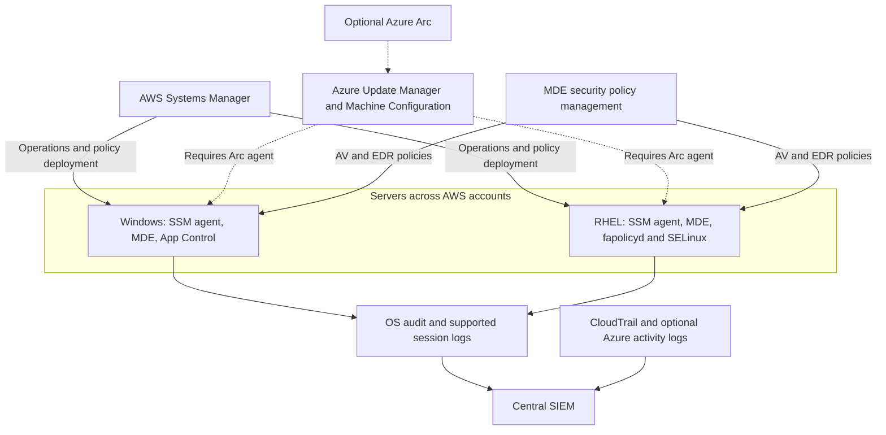

Based On the Above document , I think the different requirements can be grouped into category and each category can be covered by Solution or Multiple Solutions. this is not a New Problem. Use the Arcitecture Approach , Write document with different requirements and Group them and Different Top Industry Vendor solutions at High Level and then Low Level Design Each solutions .

**Azure Arc can centralize management of your AWS servers, but it does not, by itself, provide antivirus, application allowlisting, DLP, or complete privileged-session auditing.** Your document combines the management platform with the separate controls it can deploy.

For your existing Windows/RHEL environment, **keep SSM as the starting point and identify the missing controls individually.** Add Arc if you want Azure to become a central server-management platform—not simply to obtain centralized antivirus policies or audit logs.

**1. Separate the requirements before choosing products**

| Requirement                                      | What actually provides it                                                                | Is Azure Arc required?                     |
| ------------------------------------------------ | ---------------------------------------------------------------------------------------- | ------------------------------------------ |
| Inventory, remote commands, server configuration | AWS Systems Manager; alternatively Arc with its management services                      | No                                         |
| OS patch scheduling and compliance               | SSM Patch Manager; alternatively Azure Update Manager through Arc                        | Only for the Azure approach on AWS servers |
| Antivirus and endpoint detection/response        | Microsoft Defender for Endpoint **(MDE)**                                                | No                                         |
| Central antivirus exclusions                     | MDE security settings management using supported Intune endpoint-security policies       | No                                         |
| Windows application allowlisting                 | **App Control for Business**, formerly WDAC                                              | No                                         |
| RHEL application allowlisting                    | **`fapolicyd`**                                                                          | No                                         |
| Temporary privileged access and approvals        | An appropriate privileged-access workflow; **Entra PIM** for supported Azure/Entra roles | Arc alone is insufficient                  |
| Record administrator activity inside the OS      | OS auditing, session logging/recording, and central log collection                       | No                                         |
| Prevent sensitive-data leakage                   | A **DLP solution** covering the OS and transfer channels you need                        | No                                         |

Arc’s documented role is to connect external servers to Azure so services such as Azure Update Manager, Machine Configuration, and Defender for Cloud can manage them. Those services supply distinct capabilities. ([Microsoft Learn][1])

**2. Your SSM account limitation needs a GovCloud qualification**

The statement **“SSM only provides per-account management” is too broad.**

AWS documents both a unified console across accounts/Regions and multi-account Automation. The underlying account permissions still exist, but centralized orchestration is possible. ([AWS Systems Manager][2])

**For AWS GovCloud, however, your concern is valid:** AWS currently lists these limitations:

* Quick Setup integration with AWS Organizations is unavailable.
* Quick Setup patch policy configurations are unavailable.
* Explorer delegated-administrator support is unavailable.

Therefore, do not assume commercial AWS’s organization-wide setup experience is available unchanged in GovCloud. A central solution may require deploying consistent SSM configurations and cross-account roles through your infrastructure automation. ([AWS GovCloud (US)][3])

**Arc is an alternative central management approach, but it adds another control plane, agent, connectivity path, and permission model.**

**3. What needs correcting in the pasted document**

| Original idea                                                    | More accurate explanation                                                                                                                                    |
| ---------------------------------------------------------------- | ------------------------------------------------------------------------------------------------------------------------------------------------------------ |
| “Arc displays all AWS instances centrally.”                      | It displays **the servers you onboard** into the relevant Azure scopes. Installing/configuring the agent and maintaining connectivity are prerequisites.     |
| “Azure Policy applies updates.”                                  | **Azure Policy + Machine Configuration** handle supported configuration auditing/enforcement. **Azure Update Manager** orchestrates OS patches.              |
| “Azure RBAC replaces SSH/RDP keys and IAM roles.”                | Azure RBAC controls Azure management operations. **OS login requires additional integration**, and AWS permissions are still needed for AWS-side operations. |
| “Deploy MDE or Microsoft Antimalware to Windows and RHEL.”       | MDE supports Windows and supported Linux distributions. The **Microsoft Antimalware extension does not support Linux**.                                      |
| “Arc enables centralized antivirus exclusions.”                  | **MDE security settings management** provides this capability; Arc is optional.                                                                              |
| “Intune linked to Arc manages Windows application allowlisting.” | Arc onboarding does **not** make a Windows Server fully Intune-managed. Select a supported App Control deployment method for the server version.             |
| “SELinux is Linux application whitelisting.”                     | **`fapolicyd` is the direct RHEL application-allowlisting mechanism.** SELinux restricts process access to resources and complements it.                     |

These distinctions follow Microsoft’s Machine Configuration, antimalware, MDE management, and App Control documentation, and Red Hat’s `fapolicyd` guidance. ([learn.microsoft.com][4])

**4. Antivirus and application allowlisting are separate controls**

For **antivirus and EDR**, use MDE on supported Windows and RHEL versions. With MDE security settings management enabled, supported antivirus policies and exclusions can be assigned centrally across AWS accounts.

Windows Server does not need normal Intune MDM enrollment for that supported security-management scenario. However, **receiving MDE security policies does not mean the server supports every Intune policy**, including arbitrary application-control policies. ([Microsoft Learn][5])

For **application allowlisting**, enforce the policy locally:

| Platform                      | Enforcement mechanism    | How you could distribute/manage the policy                                                     |
| ----------------------------- | ------------------------ | ---------------------------------------------------------------------------------------------- |
| Windows Server                | App Control for Business | Supported Group Policy or script-based deployment; SSM can distribute and invoke those scripts |
| RHEL                          | `fapolicyd`              | SSM, Ansible, or another configuration-management mechanism                                    |
| RHEL supplementary protection | SELinux                  | Manage SELinux policy and enforcing mode separately                                            |

SSM or Arc can deliver configuration, but **the OS mechanism decides whether an executable is allowed to run**. Start application-control changes in audit/permissive mode, validate the workload, and then enforce. ([Microsoft Learn][6])

This means application allowlisting does **not automatically require buying another endpoint agent**. Native controls may satisfy the requirement, provided you build policy distribution, exception handling, reporting, and enforcement verification.

**5. “Privileged-level audit” actually contains several requirements**

This is the most important distinction in your proposal:

| Audit question                                | Required evidence/control                                          | What Arc contributes                                                     |
| --------------------------------------------- | ------------------------------------------------------------------ | ------------------------------------------------------------------------ |
| Who was granted administrator privileges?     | Role assignments, approval records, activation history             | Azure RBAC and **Entra PIM** can provide this for applicable Azure roles |
| Who initiated a management action?            | AWS CloudTrail or Azure Activity Log                               | Activity records for Azure-side operations                               |
| Who logged into Windows/Linux?                | Windows logon auditing; Linux authentication and sudo logs         | Login integration can help identify users; OS logs still need collection |
| What privileged commands or changes occurred? | Configured process, PowerShell, Linux audit/sudo, and session logs | Arc alone does not produce a complete administrator command history      |
| Do you need full SSH/RDP session replay?      | A session-recording/PAM solution covering the chosen access path   | Do not assume Arc supplies it                                            |

PIM provides time-limited and approval-based role activation. That is different from recording what someone does after becoming an administrator. Azure Activity Log records management operations such as extension installation, rather than every command executed within a server. ([Microsoft Learn][7])

**SSM already provides part of the audit solution:** configure ordinary Session Manager shell logging to S3 or CloudWatch Logs and correlate it with CloudTrail. But **SSH and port-forwarding sessions through Session Manager do not provide session-content logging**. An RDP connection tunneled through SSM therefore does not become a recorded desktop session. ([AWS Systems Manager][8])

There are also limits to the document’s Entra-login claim:

* **Linux:** Entra SSH authentication requires the appropriate login extension/packages and Azure login-role assignments.
* **Windows:** Microsoft’s current Arc Entra RDP documentation requires **Windows Server 2025 or later with Desktop Experience**. That particular Entra-join approach is intended for machines not joined to another domain; do not assume it applies to existing AD-joined Server 2019/2022 systems. ([Microsoft Learn][9])

**6. DLP requires its own design**

First define the behavior you need to prevent: copying sensitive files to USB, uploading through a browser, transferring through SCP/SFTP, accessing network shares, or exporting application/database data. Those are different enforcement points.

**Microsoft Purview Endpoint DLP is a separate capability from Arc and MDE antivirus.**

Current documentation includes Windows Server 2019 and later, but with material limitations:

* Domain controllers and Server Core installations are excluded.
* Server DLP must be explicitly enabled.
* Microsoft documents server-side classification limitations associated with supported Windows Server updates.
* RHEL/Linux is not listed as a supported Endpoint DLP platform.

Consequently, **Purview Endpoint DLP should not be presented as a universal DLP solution for your Windows/RHEL server fleet**. Validate the Windows use case and select Linux-capable or application/network controls for the RHEL data flows. ([Microsoft Learn][10])

**7. A practical architecture for your environment**

This design keeps the responsibilities separate. Dashed connections show the optional Arc management path.

DLP and full session recording would be added at the enforcement points selected for those requirements.

My recommended implementation sequence is:

1. **Keep SSM** for existing operations and establish consistent account-level configuration and central orchestration.
2. **Use MDE security settings management** for centralized antivirus/EDR policies and exclusions.
3. **Implement App Control and `fapolicyd`** for Windows/RHEL allowlisting.
4. **Define the privileged-audit requirement precisely**, then configure OS/session logging or add a PAM/session-recording product where needed.
5. **Evaluate DLP separately**, especially RHEL coverage.
6. **Pilot Arc only if Azure-based inventory, configuration governance, or patch management offers a clear operational advantage.** Assign one primary patch/configuration owner to avoid conflicting SSM and Azure policies.

For a GovCloud/GCC High deployment, also verify the exact Microsoft government service and network dependencies. Microsoft lists MDE security configuration management for government environments, but feature parity varies. **Arc Private Link does not privately carry every dependency—Entra ID and Azure Resource Manager traffic are excluded from the Arc private-link scope.** That matters if your servers must use tightly controlled centralized egress. ([Microsoft Learn][11])

Arc’s add-on management services can carry separate charges, and server security licensing must be checked separately; onboarding a server to Arc is not a license for every capability above. ([Microsoft Azure][12])

[1]: https://learn.microsoft.com/en-us/azure/azure-arc/servers/overview?utm_source=chatgpt.com "Azure Arc-enabled servers Overview - Azure Arc"
[2]: https://docs.aws.amazon.com/us_en/systems-manager/latest/userguide/systems-manager-unified-console.html?utm_source=chatgpt.com "What is the unified console?"
[3]: https://docs.aws.amazon.com/govcloud-us/latest/UserGuide/govcloud-ssm.html?utm_source=chatgpt.com "AWS Systems Manager in AWS GovCloud (US)"
[4]: https://learn.microsoft.com/en-us/azure/governance/machine-configuration/overview/01-overview-concepts?utm_source=chatgpt.com "What is Azure Machine Configuration?"
[5]: https://learn.microsoft.com/en-us/intune/device-security/microsoft-defender/security-settings-management?utm_source=chatgpt.com "Learn about using Intune to manage Microsoft Defender settings on devices that aren't enrolled with Intune - Microsoft Intune"
[6]: https://learn.microsoft.com/en-us/windows/security/application-security/application-control/app-control-for-business/deployment/appcontrol-deployment-guide?utm_source=chatgpt.com "Deploying App Control for Business policies"
[7]: https://learn.microsoft.com/en-us/entra/id-governance/privileged-identity-management/pim-configure?utm_source=chatgpt.com "What is Privileged Identity Management? - Microsoft Entra ID Governance"
[8]: https://docs.aws.amazon.com/us_en/systems-manager/latest/userguide/session-manager-logging.html?utm_source=chatgpt.com "Enabling and disabling session logging"
[9]: https://learn.microsoft.com/en-us/azure/azure-arc/servers/ssh-arc-overview?utm_source=chatgpt.com "SSH access to Azure Arc-enabled servers - Azure Arc"
[10]: https://learn.microsoft.com/en-us/purview/endpoint-dlp-learn-about?utm_source=chatgpt.com "Learn about Endpoint data loss prevention"
[11]: https://learn.microsoft.com/en-us/defender-endpoint/gov?utm_source=chatgpt.com "Microsoft Defender for Endpoint for US Government customers - Microsoft Defender for Endpoint"
[12]: https://azure.microsoft.com/en-us/pricing/details/azure-arc/core-control-plane/?utm_source=chatgpt.com "Pricing – Azure Arc"
