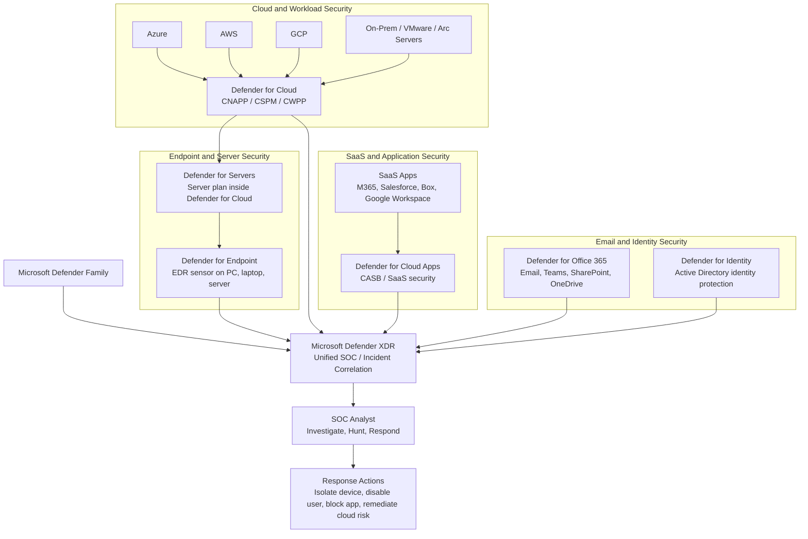

Microsoft uses the word **Defender** across many security products, which makes the naming confusing. The easiest way to understand it is to ask:

> **What am I protecting, and how does Microsoft collect the security signal?**

Some Defender products use an **agent installed on a machine**.
Some connect through **cloud APIs**.
Some inspect **SaaS application activity**.
Some are really **licensing and management plans** that enable other capabilities.

---

## 1. Microsoft Defender for Endpoint — protection on the actual device

**Microsoft Defender for Endpoint**, commonly called **MDE**, protects endpoints such as:

* Windows laptops
* Desktops
* Windows servers
* Linux servers
* Mobile devices
* Some supported network devices

This is the product most people mean when they say **“Defender agent”** or **“MDE sensor.”**

## How Defender for Endpoint works

Defender for Endpoint works by placing security capability directly on the device.

```text
Endpoint / Server
   ↓
MDE sensor / Defender AV / EDR capability
   ↓
Telemetry sent to Microsoft Defender cloud
   ↓
Cloud analytics, threat intelligence, behavioral detection
   ↓
Alert, incident, investigation, response action
```

On a Windows endpoint, much of the capability is built into the operating system and activated through policy and onboarding. On Linux or some non-Windows systems, an MDE package or agent is installed.

The endpoint sends telemetry such as:

* Process execution
* File activity
* Network connections
* Login activity
* Suspicious command execution
* Malware detections
* Behavioral indicators
* Vulnerability and software inventory data

Microsoft’s cloud analyzes this telemetry using threat intelligence, behavioral analytics, machine learning, and correlation with other Microsoft Defender signals.

Security teams can then take actions such as:

* Isolate the machine
* Run antivirus scan
* Collect investigation package
* Stop and quarantine files
* Investigate process tree
* Review timeline of attacker activity
* Trigger automated investigation and remediation

## Simple explanation

Defender for Endpoint is like a security camera and response tool installed on the actual machine.

It sees what is happening **inside the endpoint or server**.

---

# 2. Microsoft Defender for Cloud — cloud security control plane

**Microsoft Defender for Cloud** is different from Defender for Endpoint.

It is not mainly an endpoint agent. It is a **cloud security posture and workload protection platform** for:

* Azure
* AWS
* GCP
* Hybrid servers
* Containers
* Databases
* Storage
* DevOps pipelines
* Cloud identities and configurations

It answers questions like:

* Are my cloud accounts configured securely?
* Are my cloud resources exposed to the internet?
* Are there risky IAM permissions?
* Are my servers missing EDR protection?
* Are my VMs vulnerable?
* Are my containers misconfigured?
* Are my cloud workloads compliant with security standards?

## How Defender for Cloud works

Defender for Cloud connects to cloud environments using cloud-native integrations and APIs.

For Azure, it integrates directly with Azure subscriptions.

For AWS, you connect the AWS account or organization using a connector. This usually creates the required AWS permissions so Microsoft can read cloud configuration and workload metadata.

For GCP, a similar connector model is used.

```text
Azure / AWS / GCP account
   ↓
Cloud connector / API permissions
   ↓
Defender for Cloud collects inventory and configuration
   ↓
Security posture assessment
   ↓
Recommendations, alerts, compliance score, attack path analysis
```

Defender for Cloud can collect data in multiple ways:

## A. API-based collection

It reads cloud configuration through APIs.

Examples:

* Security groups
* Public IP exposure
* IAM permissions
* Storage configuration
* VM metadata
* Kubernetes cluster settings
* Container registry metadata
* Database configuration
* Logging settings

This is similar to how CSPM tools work.

## B. Agent-based protection

For deeper server protection, Defender for Cloud can enable Defender for Servers and deploy or integrate with the MDE sensor on machines.

```text
Defender for Cloud
   ↓
Defender for Servers plan enabled
   ↓
MDE sensor installed/onboarded on server
   ↓
Server EDR and vulnerability data flows to Microsoft
```

## C. Agentless scanning

Defender for Cloud can also perform certain scans without installing an agent. For example, it can analyze VM disk snapshots out of band to identify vulnerabilities, secrets, malware, or software inventory depending on the enabled plan.

```text
Cloud VM disk
   ↓
Snapshot
   ↓
Out-of-band Microsoft analysis
   ↓
Vulnerability / malware / secrets findings
   ↓
Defender for Cloud recommendation or alert
```

## Simple explanation

Defender for Cloud is like the cloud security manager.

It looks at the **cloud account, resource configuration, workload posture, and security coverage**.

It may use agents, but it is not itself just an agent.

---

# 3. Microsoft Defender for Servers — server protection plan inside Defender for Cloud

This is where the confusion usually happens.

A server is still a server whether it is:

* A physical server in a datacenter
* A VMware VM
* A Hyper-V VM
* An Azure VM
* An AWS EC2 instance
* A GCP VM

From an operating system point of view, Windows Server or Linux is still just a server.

So why does Microsoft have **Defender for Servers** as a separate name?

Because **Defender for Servers is not a different server agent**. It is a **Defender for Cloud plan** that provides server-focused protection, licensing, onboarding, and management.

## How Defender for Servers works

Defender for Servers usually uses Defender for Endpoint as the actual EDR sensor on the server.

```text
Server
   ↓
MDE sensor installed/onboarded
   ↓
Defender for Servers license/plan from Defender for Cloud
   ↓
Server alerts, vulnerabilities, recommendations, inventory
   ↓
Defender for Cloud and Defender XDR
```

## Why Defender for Servers exists separately

Because servers need different licensing, onboarding, and management than user endpoints.

A laptop is usually licensed per user or per endpoint under endpoint security licensing.

A server is different because:

* Servers are shared infrastructure, not assigned to one user
* Servers may run only for a few hours in cloud environments
* Servers exist across Azure, AWS, GCP, VMware, and physical datacenters
* Cloud security teams need posture, compliance, and workload context
* Server protection needs to integrate with cloud inventory and recommendations

So Microsoft separates the concept:

```text
Defender for Endpoint = EDR technology/sensor

Defender for Servers = Server protection plan that enables and manages server security through Defender for Cloud
```

## Datacenter server vs cloud server

Technically, the protection model is similar.

Both can run the MDE sensor.

The difference is how the server is discovered, onboarded, governed, and licensed.

| Server Location           | How It Is Usually Onboarded           | What Defender Sees                                           |
| ------------------------- | ------------------------------------- | ------------------------------------------------------------ |
| Azure VM                  | Native Azure integration              | VM metadata, cloud config, MDE data                          |
| AWS EC2                   | AWS connector, Arc, or MDE onboarding | EC2 metadata, posture findings, MDE data                     |
| GCP VM                    | GCP connector, Arc, or MDE onboarding | GCP metadata, posture findings, MDE data                     |
| On-prem datacenter server | Azure Arc or direct MDE onboarding    | Server inventory, MDE data, policy/compliance if Arc-enabled |
| VMware VM                 | Azure Arc or direct MDE onboarding    | Similar to on-prem server                                    |

## Simple explanation

Defender for Servers is not a totally separate security engine.

It is the server-focused plan in Defender for Cloud that uses MDE and adds cloud/hybrid server management, posture, vulnerability, and licensing capabilities.

---

# 4. Microsoft Defender for Cloud Apps — SaaS/CASB protection

**Microsoft Defender for Cloud Apps** is completely different from Defender for Endpoint.

It does not primarily protect a PC or server.

It protects **SaaS applications and cloud app usage**.

Examples:

* Microsoft 365
* Salesforce
* ServiceNow
* Box
* Dropbox
* Google Workspace
* Slack
* Workday
* Other sanctioned and unsanctioned SaaS apps

This product is Microsoft’s **CASB**: Cloud Access Security Broker.

It answers questions like:

* What cloud apps are my users accessing?
* Are users uploading sensitive data to risky apps?
* Are there risky OAuth apps connected to my tenant?
* Is someone downloading large amounts of data from Salesforce or SharePoint?
* Can I block downloads from unmanaged devices?
* Can I monitor or control a SaaS session in real time?

## How Defender for Cloud Apps works

Defender for Cloud Apps collects SaaS and cloud app activity in several ways.

## A. API connectors to SaaS apps

For sanctioned apps, Defender for Cloud Apps connects directly to the SaaS provider’s API.

```text
SaaS app: Salesforce / M365 / Box / Google Workspace
   ↓
API connector
   ↓
Defender for Cloud Apps
   ↓
Activity monitoring, DLP, OAuth app governance, threat detection
```

This gives visibility into:

* User activity
* File sharing
* Sensitive data exposure
* Risky OAuth apps
* Admin activity
* Suspicious behavior
* SaaS configuration posture

This is out-of-band visibility. User traffic does not always need to pass through Microsoft in real time for API-based monitoring to work.

## B. Cloud Discovery / Shadow IT discovery

Defender for Cloud Apps can analyze network logs from firewalls, proxies, secure web gateways, or Defender for Endpoint signals.

```text
Firewall / proxy / endpoint network signal
   ↓
Traffic logs
   ↓
Defender for Cloud Apps Cloud Discovery
   ↓
Shadow IT report and app risk scoring
```

This helps identify unsanctioned cloud apps such as personal file sharing, unmanaged collaboration tools, or risky SaaS services.

## C. Conditional Access App Control / reverse proxy

For real-time session control, Microsoft Entra Conditional Access can route a user’s SaaS session through Defender for Cloud Apps.

```text
User
   ↓
Microsoft Entra login
   ↓
Conditional Access policy
   ↓
Session routed through Defender for Cloud Apps
   ↓
Real-time control: block download, monitor session, apply DLP
   ↓
SaaS application
```

This is useful when you want controls like:

* Allow access but block file download
* Allow browser access but prevent copy/paste
* Monitor high-risk sessions
* Protect access from unmanaged devices
* Apply real-time DLP to SaaS usage

## Simple explanation

Defender for Cloud Apps protects cloud applications and SaaS usage.

It sees what users are doing **inside SaaS apps** and can sometimes control the session in real time.

---

# 5. How the products work together

These products are separate, but Microsoft integrates them through Microsoft Defender XDR.

Example flow:

```text
User laptop
   ↓
Defender for Endpoint detects suspicious process
   ↓
User signs into Salesforce
   ↓
Defender for Cloud Apps detects abnormal SaaS download
   ↓
AWS EC2 server shows vulnerability in Defender for Cloud
   ↓
Defender XDR correlates signals into one incident
```

In a mature environment, each product provides a different signal:

| Layer                    | Product                 | Signal Type                                      |
| ------------------------ | ----------------------- | ------------------------------------------------ |
| Endpoint/server activity | Defender for Endpoint   | Process, file, network, behavior                 |
| Cloud infrastructure     | Defender for Cloud      | Misconfiguration, exposure, cloud workload risk  |
| Server protection        | Defender for Servers    | Server EDR, vulnerability, inventory, compliance |
| SaaS applications        | Defender for Cloud Apps | SaaS activity, Shadow IT, DLP, OAuth risk        |
| Unified SOC view         | Defender XDR            | Correlated incidents and investigation           |

---

# 6. Practical example for AWS EC2

Assume you have an AWS EC2 Linux server.

## Without Microsoft Defender

```text
AWS EC2 exists
   ↓
AWS knows it exists
   ↓
No Microsoft visibility unless connected
```

## With Defender for Cloud only

```text
AWS account connected to Defender for Cloud
   ↓
Defender reads AWS configuration through connector
   ↓
Finds exposure, misconfigurations, risky security groups, compliance gaps
```

At this stage, Microsoft may know the EC2 instance exists and may assess cloud configuration, but deep runtime EDR still requires server onboarding.

## With Defender for Servers

```text
AWS EC2 connected through Defender for Cloud / Arc / MDE onboarding
   ↓
MDE sensor installed on the server
   ↓
Server process, file, network, and threat telemetry flows to Microsoft
   ↓
Defender for Cloud shows server security recommendations
   ↓
Defender XDR shows alerts and incidents
```

Now Microsoft can see both:

* Cloud posture: security group, exposure, metadata, compliance
* Server activity: process execution, malware, suspicious behavior, EDR timeline

---

# 7. Final mental model

Use this simple model:

```text
Defender for Endpoint
= Agent/sensor on endpoint or server

Defender for Cloud
= Cloud security control plane for Azure/AWS/GCP/hybrid

Defender for Servers
= Server protection plan inside Defender for Cloud that uses MDE

Defender for Cloud Apps
= CASB/SaaS security for cloud applications

Defender XDR
= Unified incident and SOC portal across all Defender signals
```
# One-Page Summary: Microsoft Defender Family

**Microsoft Defender** is the umbrella security brand. The easiest way to understand the family is by **what layer it protects**: endpoint, server, cloud infrastructure, SaaS apps, email, identity, and SOC/XDR correlation. Microsoft lists Defender as a product family that includes Defender for Endpoint, Defender for Cloud, Defender for Cloud Apps, Defender for Office 365, Defender for Identity, and Defender XDR. ([Microsoft Learn][1])

## Defender Family at a Glance

| Defender Product               | Protects                                                     | How It Works                                                                                           | Simple Meaning                                       |
| ------------------------------ | ------------------------------------------------------------ | ------------------------------------------------------------------------------------------------------ | ---------------------------------------------------- |
| **Microsoft Defender XDR**     | Overall enterprise security operations                       | Correlates alerts/signals from endpoint, identity, email, SaaS apps, and cloud workloads               | Unified SOC / incident view                          |
| **Defender for Endpoint, MDE** | PCs, laptops, servers, mobile, some network devices          | Uses endpoint sensor/agent to collect process, file, network, login, and threat telemetry              | EDR/XDR sensor on the device                         |
| **Defender for Servers**       | Windows/Linux servers in Azure, AWS, GCP, VMware, datacenter | Server protection plan inside Defender for Cloud; usually uses the MDE sensor                          | Server licensing + onboarding + protection           |
| **Defender for Cloud**         | Azure, AWS, GCP, hybrid cloud workloads                      | Connects to cloud APIs, evaluates posture, finds misconfigurations, enables workload/server protection | CNAPP / cloud security posture + workload protection |
| **Defender for Cloud Apps**    | SaaS apps such as M365, Salesforce, Box, Google Workspace    | Uses SaaS API connectors, Cloud Discovery logs, and Conditional Access App Control                     | CASB / SaaS app security                             |
| **Defender for Office 365**    | Email, Teams, SharePoint, OneDrive                           | Protects against phishing, malware, business email compromise, unsafe links/attachments                | Email and collaboration security                     |
| **Defender for Identity**      | Active Directory identities                                  | Monitors AD signals and detects identity-based attacks                                                 | Identity threat detection                            |

Microsoft describes **Defender XDR** as the unified defense suite that coordinates detection, prevention, investigation, and response across endpoints, identities, email, and applications. ([Microsoft Learn][2]) Defender for Endpoint is the endpoint security platform for preventing, detecting, investigating, and responding to endpoint threats. ([Microsoft Learn][3]) Defender for Cloud is Microsoft’s CNAPP-style platform for cloud resource protection, vulnerabilities, threats, and misconfigurations. ([Microsoft Learn][4]) Defender for Cloud Apps is Microsoft’s CASB for SaaS visibility, app governance, data protection, and cloud app control. ([Microsoft Learn][5])

## Key Concept

```text
Defender for Endpoint = sensor on device/server
Defender for Servers = server protection plan using MDE
Defender for Cloud = cloud security control plane
Defender for Cloud Apps = SaaS/CASB security
Defender XDR = unified SOC correlation layer
```

## Mermaid Diagram: Microsoft Defender Family



## Simple Final Explanation

Think of the Defender family like this:

**MDE** watches what happens **inside the machine**.
**Defender for Servers** packages MDE and server protection for cloud and datacenter servers.
**Defender for Cloud** watches the **cloud account, workload configuration, exposure, and posture**.
**Defender for Cloud Apps** watches **SaaS application usage and data movement**.
**Defender for Office 365** protects **email and collaboration**.
**Defender for Identity** protects **Active Directory identity signals**.
**Defender XDR** brings all of those alerts into one investigation and incident-response experience.

[1]: https://learn.microsoft.com/en-us/defender/?utm_source=chatgpt.com "Microsoft Defender products and services"
[2]: https://learn.microsoft.com/en-us/defender-xdr/microsoft-365-defender?utm_source=chatgpt.com "What is Microsoft Defender XDR?"
[3]: https://learn.microsoft.com/en-us/defender-endpoint/microsoft-defender-endpoint?utm_source=chatgpt.com "Microsoft Defender for Endpoint overview"
[4]: https://learn.microsoft.com/en-us/azure/defender-for-cloud/defender-for-cloud-introduction?utm_source=chatgpt.com "Microsoft Defender for Cloud Overview"
[5]: https://learn.microsoft.com/en-us/defender-cloud-apps/what-is-defender-for-cloud-apps?utm_source=chatgpt.com "Microsoft Defender for Cloud Apps overview"

