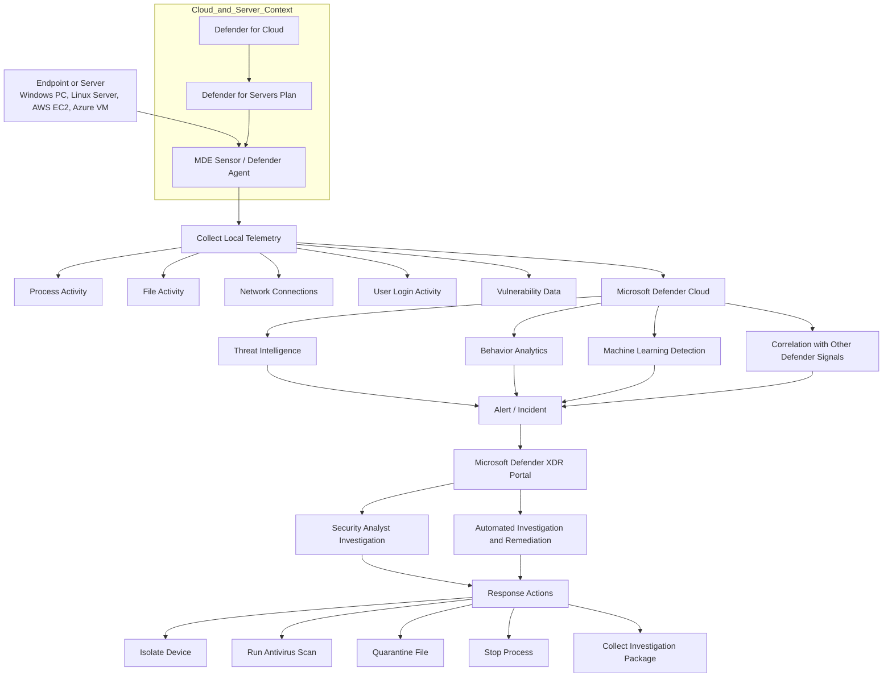

# One-Page Summary: Microsoft Defender for Endpoint, MDE

**Microsoft Defender for Endpoint, MDE,** is Microsoft’s **endpoint detection and response, EDR/XDR sensor platform**. It protects devices such as **Windows PCs, Windows servers, Linux servers, macOS devices, and mobile devices** by collecting security telemetry from the machine and sending it to the Microsoft Defender cloud for analysis, detection, investigation, and response.

The simplest way to understand MDE is:

> **MDE is the security sensor on the endpoint or server. It watches what happens locally, sends telemetry to Microsoft Defender cloud, and allows security teams to detect, investigate, and respond to attacks.**

## What MDE Protects

| Asset          | Example                                  |
| -------------- | ---------------------------------------- |
| User endpoints | Windows laptops, desktops, macOS         |
| Servers        | Windows Server, Linux server             |
| Cloud servers  | Azure VM, AWS EC2, GCP VM                |
| Mobile devices | iOS, Android, depending on configuration |

## How MDE Works

MDE runs on the endpoint/server and monitors:

| Activity           | Example                                        |
| ------------------ | ---------------------------------------------- |
| Process activity   | PowerShell, bash, suspicious commands          |
| File activity      | Malware, suspicious file writes                |
| Network activity   | C2 traffic, unusual outbound connection        |
| Login activity     | Suspicious user/session activity               |
| Vulnerabilities    | Missing patches, vulnerable software           |
| Behavioral signals | Ransomware behavior, credential theft attempts |

This data is sent to the **Microsoft Defender cloud**, where it is correlated with Microsoft threat intelligence, machine learning, and signals from other Defender products.

## Main Capabilities

| Capability               | Purpose                                      |
| ------------------------ | -------------------------------------------- |
| Antivirus / anti-malware | Block known malicious files                  |
| EDR                      | Detect suspicious behavior after execution   |
| Device timeline          | Show what happened on a machine              |
| Automated investigation  | Analyze and remediate threats automatically  |
| Machine isolation        | Disconnect compromised endpoint from network |
| Vulnerability management | Identify missing patches and weak software   |
| Attack surface reduction | Block risky behaviors before compromise      |
| Advanced hunting         | Query endpoint telemetry using KQL           |

## MDE vs Defender for Servers

This is the most important distinction:

| Term                     | Meaning                                                                    |
| ------------------------ | -------------------------------------------------------------------------- |
| **MDE**                  | Actual endpoint/server security sensor and EDR capability                  |
| **Defender for Servers** | Licensing/onboarding/protection plan inside Defender for Cloud for servers |
| **Defender for Cloud**   | Cloud security management platform for Azure/AWS/GCP/hybrid workloads      |

So for AWS EC2 or datacenter servers:

> The **MDE sensor** runs on the server.
> **Defender for Servers** provides the server protection plan and licensing.
> **Defender for Cloud** helps manage posture, onboarding, recommendations, and cloud/hybrid visibility.

## Mermaid Diagram: MDE Architecture

