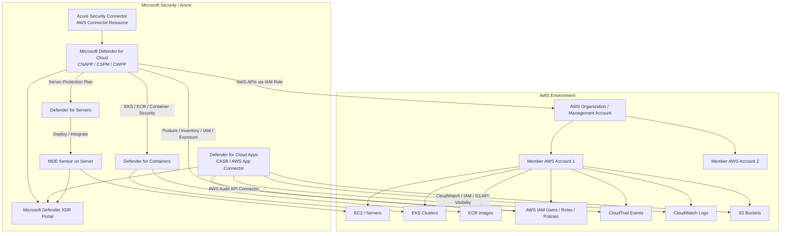

# Microsoft Defender for Cloud vs Defender for Cloud Apps Integration with AWS

The two products both say “cloud,” but they solve different problems:

| Product                               | AWS Integration Type                                                         | Main Purpose                                                                                                  |
| ------------------------------------- | ---------------------------------------------------------------------------- | ------------------------------------------------------------------------------------------------------------- |
| **Microsoft Defender for Cloud**      | Connects to AWS accounts/organization using AWS IAM roles and CloudFormation | Cloud posture, workload protection, EC2/EKS/ECR/server/container security                                     |
| **Microsoft Defender for Cloud Apps** | Connects to AWS as a SaaS/app connector using AWS audit APIs                 | AWS console/API activity monitoring, CloudTrail-based activity detection, S3 governance, risky admin behavior |

## High-Level Architecture



---

# 1. Microsoft Defender for Cloud Integration with AWS

**Defender for Cloud** is Microsoft’s **CNAPP** platform. It combines **CSPM**, **DevSecOps**, and **CWPP** capabilities to secure cloud and hybrid resources across Azure, AWS, GCP, and on-premises environments. Microsoft describes it as a platform for cloud posture, workload protection, multicloud visibility, and DevOps security. ([Microsoft Learn][1])

## What It Does in AWS

Defender for Cloud helps answer:

| Question                          | Example                                                     |
| --------------------------------- | ----------------------------------------------------------- |
| Are AWS resources misconfigured?  | Public S3, permissive security groups, weak IAM             |
| Are AWS workloads exposed?        | Internet-facing EC2, EKS, databases                         |
| Are servers protected?            | EC2 with or without MDE sensor                              |
| Are containers vulnerable?        | EKS posture, ECR image vulnerability                        |
| Are identities over-permissioned? | Excessive IAM user/role permissions                         |
| Are there attack paths?           | Public exposure + vulnerable workload + privileged identity |

## How AWS Is Connected

You connect AWS from **Defender for Cloud > Environment settings > Add environment > Amazon Web Services**. Microsoft supports onboarding either a **single AWS account** or an **AWS management account**. Management-account onboarding can create connectors for discovered and newly created member accounts. ([Microsoft Learn][2])

During onboarding, Defender for Cloud creates an **Azure security connector resource** and uses an AWS **CloudFormation template** to create the required AWS IAM roles/permissions. Microsoft notes that Defender for Cloud creates AWS roles and permissions depending on the enabled Defender plans. ([Microsoft Learn][3])

## Data Flow

```text
AWS Account / AWS Organization
   ↓
CloudFormation creates IAM roles for Defender for Cloud
   ↓
Azure Security Connector represents AWS account in Azure
   ↓
Defender for Cloud calls AWS APIs
   ↓
Inventory, posture, exposure, IAM, workload, and compliance findings
   ↓
Recommendations, secure score, attack paths, alerts
   ↓
Defender for Cloud / Defender XDR / optional SIEM integration
```

Defender for Cloud lets you choose monitored AWS regions and a scan interval such as 4, 6, 12, or 24 hours. Microsoft also notes that some collectors run on fixed intervals regardless of the custom scan interval. ([Microsoft Learn][2])

## Important AWS API Behavior

Defender CSPM queries AWS resource APIs several times per day. These are read-only API calls, but they can appear in AWS CloudTrail if read events are enabled. Microsoft specifically mentions the default role name pattern `CspmMonitorAws` and recommends filtering those read-only calls if they increase SIEM ingestion volume. ([Microsoft Learn][2])

## Defender for Servers with AWS EC2

For AWS EC2, Defender for Cloud can enable **Defender for Servers**. This is the server protection plan. The actual EDR capability is usually **Microsoft Defender for Endpoint**, MDE, running on the EC2 instance.

```text
AWS EC2
   ↓
Discovered by Defender for Cloud AWS connector
   ↓
Onboarded as Azure Arc-enabled server by default
   ↓
Defender for Servers plan enabled
   ↓
MDE sensor installed / integrated
   ↓
Endpoint alerts, vulnerabilities, software inventory, EDR data
```

Microsoft states that Defender for Servers protects Windows and Linux VMs in Azure, AWS, GCP, and on-premises environments. For AWS and GCP machines, the connection process onboards machines as Azure Arc-enabled VMs by default. ([Microsoft Learn][4])

Defender for Cloud can also automatically provision the Defender for Endpoint sensor on supported machines, and MDE alerts and vulnerability data appear inside Defender for Cloud. ([Microsoft Learn][5])

## Agentless EC2 Scanning

Defender for Cloud can also scan machines **without installing an agent**. For AWS EC2, agentless scanning can analyze VM disk snapshots to identify software inventory, vulnerabilities, secrets, malware, and EDR configuration status. Microsoft says agentless scanning does not require installed agents or network connectivity and does not affect machine performance. ([Microsoft Learn][6])

The simplified flow is:

```text
AWS EC2 disk
   ↓
Temporary snapshot copy in same region
   ↓
Out-of-band scan by Defender for Cloud
   ↓
Metadata extracted
   ↓
Snapshot deleted
   ↓
Findings shown in Defender for Cloud
```

Microsoft states that copied snapshots remain in the same region as the VM, scan data is deleted after metadata collection, and the scan environment is regional, volatile, isolated, and secure. ([Microsoft Learn][6])

## Defender for Containers with AWS EKS/ECR

For AWS containers, Defender for Cloud can protect **EKS clusters** and **ECR images**. Microsoft’s container architecture says Defender for Containers uses multiple connectivity paths: cloud provider APIs, Kubernetes API access, audit logs, registry/image analysis, and in-cluster components for runtime threat detection. ([Microsoft Learn][7])

For EKS specifically, Microsoft states that Defender for Cloud can collect Kubernetes audit log data through AWS CloudWatch using an agentless collector, and Azure Arc-enabled Kubernetes can connect EKS clusters to Azure so Defender can deploy security components as Arc extensions. ([Microsoft Learn][7])

---

# 2. Microsoft Defender for Cloud Apps Integration with AWS

**Defender for Cloud Apps** is different. It is Microsoft’s **CASB/SaaS security** platform. When integrated with AWS, it treats AWS as a connected cloud application and monitors AWS administrative and sign-in activity.

Microsoft says connecting AWS to Defender for Cloud Apps helps monitor administrative and sign-in activities and can alert on brute force attacks, privileged account misuse, unusual VM deletions, and publicly exposed storage buckets. ([Microsoft Learn][8])

## What It Does in AWS

Defender for Cloud Apps helps answer:

| Question                                 | Example                                            |
| ---------------------------------------- | -------------------------------------------------- |
| Who logged into AWS?                     | Admin console sign-in failures                     |
| What did privileged users do?            | IAM policy changes, security group changes         |
| Did someone expose data?                 | Public S3 bucket activity                          |
| Was infrastructure changed suspiciously? | EC2, network ACL, gateway, VPN changes             |
| Can we take governance action?           | Make S3 bucket private, remove bucket collaborator |

## How AWS Is Connected

Defender for Cloud Apps connects to AWS through **AWS Security auditing** using an app connector. The documented process creates a Defender for Cloud Apps programmatic AWS user and grants permissions to read CloudTrail, CloudWatch, IAM, and S3 information. The sample policy includes actions such as `cloudtrail:LookupEvents`, `cloudwatch:Describe*`, `iam:List*`, `iam:Get*`, `s3:ListAllMyBuckets`, and selected S3 ACL actions. ([Microsoft Learn][8])

Then, inside the Microsoft Defender portal, you go to **Settings > Cloud Apps > Connected apps > App Connectors**, select **Amazon Web Services**, choose **Security auditing**, and provide the AWS access key and secret key from the AWS user. ([Microsoft Learn][8])

## Data Flow

```text
AWS CloudTrail / CloudWatch / IAM / S3
   ↓
AWS API connector using programmatic credentials
   ↓
Defender for Cloud Apps
   ↓
Activity policies and anomaly detection
   ↓
Alerts and governance actions
   ↓
Microsoft Defender portal / Defender XDR
```

Microsoft also states that Defender for Cloud Apps app connectors use provider APIs, communicate over encrypted HTTPS, and periodically scan users, groups, activities, and files depending on the connected app. ([Microsoft Learn][9])

## Built-In AWS Detections

Defender for Cloud Apps includes built-in AWS policy templates such as:

| AWS Event Type  | Example Detection                                                    |
| --------------- | -------------------------------------------------------------------- |
| Console access  | Admin console sign-in failures                                       |
| IAM             | IAM policy changes                                                   |
| EC2             | EC2 instance configuration changes                                   |
| Network         | Network ACL, gateway, VPN changes                                    |
| Security groups | Security group configuration changes                                 |
| S3              | S3 bucket activity                                                   |
| Risky source    | Login from risky IP, anonymous IP, suspicious IP, infrequent country |

Microsoft lists these as built-in policy templates and anomaly detections for AWS in Defender for Cloud Apps. ([Microsoft Learn][8])

## Governance Actions

Defender for Cloud Apps can also automate some AWS-related governance actions. Microsoft lists actions such as notifying a user, requiring sign-in again, suspending a user through Microsoft Entra ID, making an S3 bucket private, and removing a collaborator from an S3 bucket. ([Microsoft Learn][8])

---

# 3. Key Difference Between the Two AWS Integrations

| Area               | Defender for Cloud                                                                                       | Defender for Cloud Apps                                    |
| ------------------ | -------------------------------------------------------------------------------------------------------- | ---------------------------------------------------------- |
| Security domain    | CNAPP / CSPM / CWPP                                                                                      | CASB / SaaS app activity security                          |
| AWS view           | AWS accounts, resources, workloads, identities, posture                                                  | AWS as a connected app; admin/sign-in/activity monitoring  |
| Main data source   | AWS APIs, CloudFormation-created roles, optional CloudTrail ingestion, workload sensors, agentless scans | CloudTrail, CloudWatch, IAM, S3 APIs through app connector |
| Server protection  | Yes, through Defender for Servers and MDE                                                                | No                                                         |
| EC2 runtime EDR    | Yes, using MDE sensor                                                                                    | No                                                         |
| EKS/ECR security   | Yes, Defender for Containers                                                                             | No                                                         |
| S3 public exposure | Yes, posture finding                                                                                     | Yes, activity/governance finding                           |
| IAM risk           | Yes, posture/CIEM                                                                                        | Yes, activity/policy-change monitoring                     |
| Best use           | Secure AWS infrastructure and workloads                                                                  | Monitor AWS console/API activity and app governance        |

## Simple Explanation

```text
Defender for Cloud
= “Is my AWS environment securely built and are my workloads protected?”

Defender for Cloud Apps
= “What are users/admins doing inside AWS, and are risky activities happening?”
```

---

# 4. Recommended AWS Deployment Model

For a serious AWS environment, especially multi-account AWS Organizations, I would use both:

```text
AWS Organization
   ↓
Enable CloudTrail organization-wide
   ↓
Connect AWS Management Account to Defender for Cloud
   ↓
Use CloudFormation StackSet for member account onboarding
   ↓
Enable Defender CSPM / Servers / Containers as needed
   ↓
Deploy MDE to EC2 through Defender for Servers
   ↓
Connect AWS Security Auditing to Defender for Cloud Apps
   ↓
Send alerts to Defender XDR and/or Sentinel/Splunk
```

## Practical Control Mapping

| Requirement                               | Product                                        |
| ----------------------------------------- | ---------------------------------------------- |
| Inventory AWS resources                   | Defender for Cloud                             |
| Detect public S3 / risky SG / exposed EC2 | Defender for Cloud                             |
| Monitor AWS admin sign-ins                | Defender for Cloud Apps                        |
| Detect IAM policy changes                 | Defender for Cloud Apps and Defender for Cloud |
| Protect EC2 runtime                       | Defender for Servers + MDE                     |
| Detect malware/process activity on EC2    | MDE                                            |
| Assess EKS/ECR                            | Defender for Containers via Defender for Cloud |
| Investigate incidents centrally           | Defender XDR                                   |
| Forward to SIEM                           | Defender XDR / Sentinel / export pipeline      |

---

# 5. DoD / GovCloud Note

Because your environment often involves DoD/GovCloud constraints, verify service availability before final architecture approval. Microsoft has separate Defender for Cloud support matrices for commercial and government clouds, and Defender for Cloud Apps has GCC High and DoD offerings built on Azure Government with some feature variations from commercial. ([Microsoft Learn][10])

For a DoD-style environment, the design question is not only “Can it connect to AWS?” but also:

```text
Where is Microsoft service hosted?
Where does telemetry go?
Is the tenant Commercial, GCC High, or DoD?
Is AWS Commercial or AWS GovCloud?
Are CloudTrail / CloudWatch / S3 / IAM APIs reachable from the Microsoft service?
Is the data export path approved for the mission boundary?
```

# Bottom Line

**Defender for Cloud** is the main product for AWS infrastructure security: posture, misconfiguration, attack path, workload protection, EC2/MDE, EKS/ECR, and compliance.

**Defender for Cloud Apps** is the AWS activity/CASB-style connector: CloudTrail-driven admin activity monitoring, risky sign-ins, IAM/security group/S3 activity policies, and limited governance actions.

They overlap around AWS identity, S3, and configuration-change visibility, but they are not the same product. For AWS security architecture, use **Defender for Cloud for the cloud control plane and workloads**, and use **Defender for Cloud Apps for AWS activity monitoring and SaaS/CASB governance**.

[1]: https://learn.microsoft.com/en-us/azure/defender-for-cloud/defender-for-cloud-introduction "Microsoft Defender for Cloud Overview - Microsoft Defender for Cloud | Microsoft Learn"
[2]: https://learn.microsoft.com/en-us/azure/defender-for-cloud/quickstart-onboard-aws "Connect your AWS account - Microsoft Defender for Cloud | Microsoft Learn"
[3]: https://learn.microsoft.com/en-us/azure/defender-for-cloud/permissions "User roles and permissions - Microsoft Defender for Cloud | Microsoft Learn"
[4]: https://learn.microsoft.com/en-us/azure/defender-for-cloud/tutorial-enable-servers-plan "Protect your servers with Defender for Servers - Microsoft Defender for Cloud | Microsoft Learn"
[5]: https://learn.microsoft.com/en-us/azure/defender-for-cloud/integration-defender-for-endpoint "Defender for Endpoint integration in Defender for Cloud - Microsoft Defender for Cloud | Microsoft Learn"
[6]: https://learn.microsoft.com/en-us/azure/defender-for-cloud/concept-agentless-data-collection "Agentless machine scanning in Microsoft Defender for Cloud - Microsoft Defender for Cloud | Microsoft Learn"
[7]: https://learn.microsoft.com/en-us/azure/defender-for-cloud/defender-for-containers-architecture "Container security architecture - Microsoft Defender for Cloud | Microsoft Learn"
[8]: https://learn.microsoft.com/en-us/defender-cloud-apps/protect-aws "Protect your Amazon Web Services environment - Microsoft Defender for Cloud Apps | Microsoft Learn"
[9]: https://learn.microsoft.com/en-us/defender-cloud-apps/enable-instant-visibility-protection-and-governance-actions-for-your-apps "Connect apps to get visibility and control - Microsoft Defender for Cloud Apps | Microsoft Learn"
[10]: https://learn.microsoft.com/en-us/azure/defender-for-cloud/support-matrix-defender-for-cloud?utm_source=chatgpt.com "Support matrices for Defender for Cloud"
