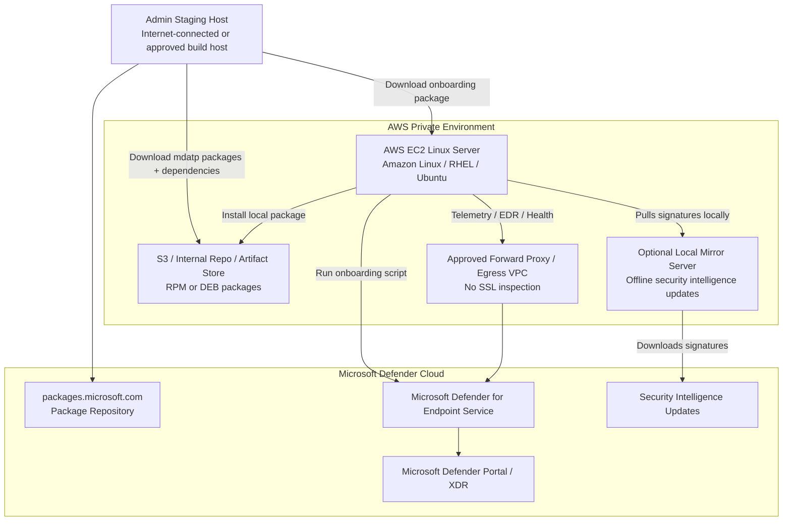
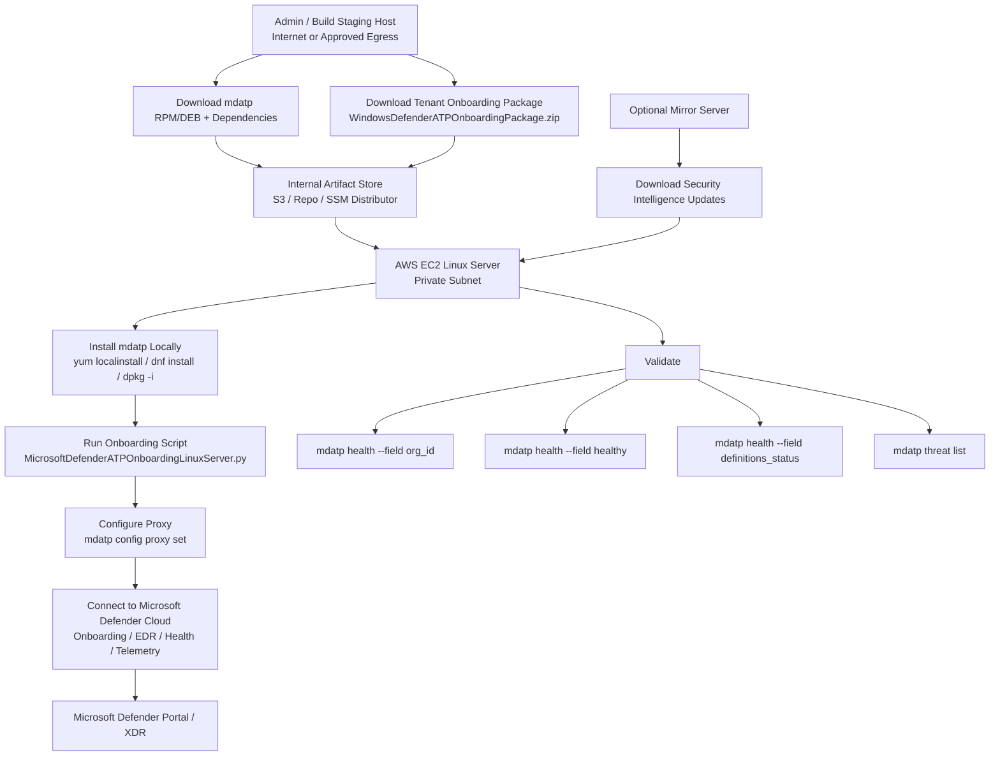

# MDE for AWS Linux Offline Installation — Detailed Practical Guide

For AWS Linux servers, **“offline installation” can mean two different things**:

| Scenario                       | Meaning                                                | Supported Practical Model                                                        |
| ------------------------------ | ------------------------------------------------------ | -------------------------------------------------------------------------------- |
| **Offline package install**    | EC2 cannot reach Microsoft package repo during install | Download RPM/DEB packages on a staging host, copy to EC2, install locally        |
| **No direct internet runtime** | EC2 has no direct internet/NAT                         | Use approved proxy/egress path to reach Microsoft Defender cloud                 |
| **Fully disconnected server**  | EC2 cannot reach Microsoft Defender cloud at all       | MDE can be installed, but EDR/onboarding/portal reporting will not work properly |

Important point:

> **MDE can be installed from offline packages, but it is not a fully disconnected EDR product.**
> For normal MDE EDR, onboarding, telemetry, alerts, and health reporting, the Linux server must reach Microsoft Defender cloud directly or through an approved proxy.

Microsoft’s Linux prerequisites state that Linux endpoints must be able to access Defender for Endpoint cloud service URLs, either directly or through transparent/static proxy. PAC, WPAD, authenticated proxies, and SSL inspection/intercepting proxies are not supported for MDE on Linux. ([Microsoft Learn][1])

---

# 1. High-Level AWS Architecture



---

# 2. Supported AWS Linux Distributions

For AWS, the most common supported Linux options are:

| AWS Linux OS                       | MDE Support Notes                                        |
| ---------------------------------- | -------------------------------------------------------- |
| **Amazon Linux 2**                 | Supported; ARM64 support is retiring on October 31, 2026 |
| **Amazon Linux 2023**              | Supported                                                |
| **RHEL 7.2+, 8.x, 9.x, 10.x**      | Supported                                                |
| **Ubuntu LTS 20.04, 22.04, 24.04** | Supported                                                |
| **Oracle Linux / Rocky / Alma**    | Supported variants depending on version                  |

Microsoft lists Amazon Linux 2 and Amazon Linux 2023 as supported Linux distributions for Defender for Endpoint on Linux. ([Microsoft Learn][1])

---

# 3. What You Need Before Offline Installation

You need four things:

| Requirement                        | Purpose                                                                            |
| ---------------------------------- | ---------------------------------------------------------------------------------- |
| **mdatp package**                  | The actual MDE Linux software package                                              |
| **Package dependencies**           | Required RPM/DEB dependencies for the OS                                           |
| **Onboarding package**             | Tenant-specific script that registers the server to your Microsoft Defender tenant |
| **Outbound connectivity or proxy** | Required for onboarding, EDR telemetry, health, alerts, and cloud reporting        |

Microsoft’s manual Linux deployment process uses the `mdatp` package and then a tenant-specific onboarding package downloaded from the Microsoft Defender portal. Microsoft warns that if the onboarding step is missed, `mdatp health` shows the product as unhealthy/unlicensed. ([Microsoft Learn][2])

---

# 4. Offline Installation Flow for AWS Linux

## Step 1 — Prepare an internet-connected staging host

Use a staging server with the **same OS family and version** as the target EC2 instances.

Example:

| Target EC2        | Use Staging Host               |
| ----------------- | ------------------------------ |
| Amazon Linux 2    | Amazon Linux 2 staging host    |
| Amazon Linux 2023 | Amazon Linux 2023 staging host |
| RHEL 8            | RHEL 8 staging host            |
| RHEL 9            | RHEL 9 staging host            |
| Ubuntu 22.04      | Ubuntu 22.04 staging host      |

This matters because dependencies differ by OS version.

---

## Step 2 — Download the MDE Linux package and dependencies

### For Amazon Linux / RHEL-based systems

On the staging host:

```bash
sudo yum install -y yum-utils
```

For RHEL 8/9 or Amazon Linux 2023, use `dnf` if available:

```bash
sudo dnf install -y dnf-plugins-core
```

Add the Microsoft production repository.

For Amazon Linux 2, Microsoft treats it under the RHEL-style package family. Use the repository appropriate to the compatible RHEL major version. For example:

```bash
sudo yum-config-manager --add-repo=https://packages.microsoft.com/config/rhel/7/prod.repo
```

For Amazon Linux 2023, validate the correct repo mapping in your environment. Many deployments use RHEL-compatible package handling, but you should test this on an Amazon Linux 2023 staging instance before broad rollout.

For RHEL 8:

```bash
sudo dnf config-manager --add-repo https://packages.microsoft.com/config/rhel/8/prod.repo
```

For RHEL 9:

```bash
sudo dnf config-manager --add-repo https://packages.microsoft.com/config/rhel/9/prod.repo
```

Microsoft’s manual deployment guide documents RHEL and variants, including Amazon Linux 2, using `dnf` or `yum` and installing the `mdatp` package from the Microsoft Linux repository. ([Microsoft Learn][2])

Create an offline bundle directory:

```bash
mkdir -p /tmp/mde-offline-rpms
cd /tmp/mde-offline-rpms
```

Download MDE and dependencies without installing:

```bash
yumdownloader --resolve mdatp
```

Or with `dnf`:

```bash
dnf download --resolve mdatp
```

Package the RPMs:

```bash
tar -czvf mde-offline-rpms.tar.gz *.rpm
```

Copy the tarball to your approved internal location:

```bash
aws s3 cp mde-offline-rpms.tar.gz s3://your-internal-sec-tools-bucket/mde/
```

In restricted environments, use an approved internal artifact repository, S3 bucket with VPC endpoint, SSM Distributor, or configuration management tool.

---

### For Ubuntu/Debian systems

On a matching Ubuntu/Debian staging host:

```bash
mkdir -p /tmp/mde-offline-debs
cd /tmp/mde-offline-debs
```

Configure Microsoft repo per Microsoft’s Linux deployment guide, then download the package and dependencies:

```bash
sudo apt-get update
apt-get download mdatp
```

For dependencies, a practical approach is to use:

```bash
sudo apt-get install --download-only mdatp
```

Downloaded packages are usually cached in:

```bash
/var/cache/apt/archives/
```

Copy the required `.deb` files:

```bash
cp /var/cache/apt/archives/*.deb /tmp/mde-offline-debs/
tar -czvf mde-offline-debs.tar.gz *.deb
```

---

# 5. Download the Tenant Onboarding Package

From the Microsoft Defender portal:

```text
Microsoft Defender portal
  → Settings
  → Endpoints
  → Device management
  → Onboarding
  → Operating system: Linux Server
  → Deployment method: Local Script
  → Download onboarding package
```

The package is downloaded as:

```text
WindowsDefenderATPOnboardingPackage.zip
```

Extract it:

```bash
unzip WindowsDefenderATPOnboardingPackage.zip
```

You should see:

```text
MicrosoftDefenderATPOnboardingLinuxServer.py
```

Microsoft’s manual onboarding instructions specify selecting **Linux Server**, choosing **Local Script**, downloading `WindowsDefenderATPOnboardingPackage.zip`, and extracting `MicrosoftDefenderATPOnboardingLinuxServer.py`. ([Microsoft Learn][2])

Treat this file as sensitive because it contains tenant onboarding information.

---

# 6. Transfer Files to the Offline AWS EC2 Instance

Copy the following to the EC2 instance:

```text
mde-offline-rpms.tar.gz
MicrosoftDefenderATPOnboardingLinuxServer.py
```

Common transfer methods in private AWS environments:

| Method                                   | Notes                        |
| ---------------------------------------- | ---------------------------- |
| S3 bucket via Gateway/Interface endpoint | Good for private subnets     |
| AWS Systems Manager Run Command          | Good for fleet deployment    |
| Internal artifact repository             | Good enterprise pattern      |
| SCP through bastion                      | Less preferred               |
| Golden AMI pipeline                      | Good for immutable workloads |
| Ansible/Puppet/Chef                      | Good for controlled rollout  |

---

# 7. Install MDE on the Offline EC2 Linux Server

## Amazon Linux / RHEL-style installation

On the EC2 instance:

```bash
mkdir -p /tmp/mde-install
cd /tmp/mde-install

tar -xzvf /path/to/mde-offline-rpms.tar.gz
```

Install RPMs locally:

```bash
sudo yum localinstall -y *.rpm
```

Or:

```bash
sudo dnf install -y ./*.rpm
```

Verify service:

```bash
systemctl status mdatp
```

Check MDE command:

```bash
mdatp version
```

---

## Ubuntu/Debian-style installation

```bash
mkdir -p /tmp/mde-install
cd /tmp/mde-install

tar -xzvf /path/to/mde-offline-debs.tar.gz
sudo dpkg -i *.deb
```

If dependency order causes issues:

```bash
sudo apt-get install -f
```

In a truly offline environment, `apt-get install -f` will only work if all required dependencies are locally available.

---

# 8. Run the Onboarding Script

For RHEL 8+, Ubuntu 20.04+, Amazon Linux 2023, and most modern Linux systems:

```bash
sudo python3 MicrosoftDefenderATPOnboardingLinuxServer.py
```

For older systems that still use Python 2:

```bash
sudo python MicrosoftDefenderATPOnboardingLinuxServer.py
```

Microsoft’s manual guide states that RHEL 8.x and Ubuntu 20.04 or higher require `python3`, while other versions may use `python`. ([Microsoft Learn][2])

---

# 9. Verify Onboarding and Health

Check tenant association:

```bash
mdatp health --field org_id
```

Check overall health:

```bash
mdatp health --field healthy
```

Check definition status:

```bash
mdatp health --field definitions_status
```

Check real-time protection:

```bash
mdatp health --field real_time_protection_enabled
```

Enable real-time protection if needed:

```bash
sudo mdatp config real-time-protection --value enabled
```

Microsoft’s guide uses `mdatp health --field org_id`, `mdatp health --field healthy`, and `mdatp health --field definitions_status` to validate onboarding and health. It also notes that when the product first starts, it downloads anti-malware definitions and health can temporarily show `false` during that process. ([Microsoft Learn][2])

---

# 10. Configure Proxy for Private AWS Subnets

If your EC2 instances do not have direct internet/NAT access, configure a static proxy.

```bash
sudo mdatp config proxy set --value http://proxy.example.mil:8080
```

Restart MDE:

```bash
sudo systemctl restart mdatp
```

Verify:

```bash
mdatp health --field proxy
mdatp health --field cloud_enabled
mdatp health --field healthy
```

Microsoft documents static proxy configuration with:

```bash
mdatp config proxy set --value http://address:port
```

and states that SSL inspection/intercepting proxies are not supported. ([Microsoft Learn][3])

For installation-time proxy usage, Microsoft states that `HTTPS_PROXY` must be configured during package manager installation and can be passed directly before the install command. ([Microsoft Learn][4])

Example:

```bash
HTTPS_PROXY="http://proxy.example.mil:8080/" sudo yum localinstall -y *.rpm
```

But for fully offline local RPM install, the package install itself usually does not need internet access. The proxy matters after install for onboarding and telemetry.

---

# 11. Offline Security Intelligence Updates

If your EC2 servers cannot directly download Defender security intelligence updates, use a **local mirror server**.

Pattern:

```text
Microsoft Cloud
   ↓
Mirror Server with approved internet/proxy access
   ↓
Internal HTTP/HTTPS/NFS share
   ↓
AWS Linux EC2 instances pull definitions locally
```

Microsoft supports offline security intelligence updates for Linux by using a local mirror server. The mirror server downloads signatures from Microsoft cloud, and Linux endpoints pull updates from that mirror at predefined intervals. ([Microsoft Learn][5])

Important distinction:

| Capability                | Offline Mirror Helps?                       |
| ------------------------- | ------------------------------------------- |
| Antivirus signatures      | Yes                                         |
| Local AV protection       | Yes                                         |
| EDR onboarding            | No, still needs Defender cloud connectivity |
| Alerts to Defender portal | No, still needs Defender cloud connectivity |
| Device timeline / XDR     | No, still needs Defender cloud connectivity |

So offline signature update is useful, but it does not replace MDE cloud connectivity.

---

# 12. AWS-Specific Deployment Pattern

For a controlled AWS environment, I would use this pattern:

```text
1. Build MDE offline package bundle in a controlled staging account
2. Store package bundle in internal S3 bucket
3. Use S3 VPC endpoint for private EC2 access
4. Use SSM Run Command or State Manager to install mdatp
5. Run tenant onboarding script
6. Configure static proxy to Microsoft Defender cloud
7. Configure offline signature mirror if direct definition updates are restricted
8. Validate health and portal visibility
9. Bake into golden AMI only after clearing machine-specific identity
```

---

# 13. Mermaid: Offline MDE Install Flow for AWS Linux



---

# 14. Common Issues

| Issue                          | Likely Cause                                                      | Fix                                                               |
| ------------------------------ | ----------------------------------------------------------------- | ----------------------------------------------------------------- |
| `mdatp health` shows `false`   | Not onboarded, no cloud connectivity, definitions not updated yet | Run onboarding script, check proxy, wait for definitions          |
| `org_id` blank                 | Onboarding script not run or failed                               | Re-run onboarding script                                          |
| Product shows unlicensed       | Missing onboarding package step                                   | Download and run tenant onboarding script                         |
| Definitions not updating       | No internet/proxy or mirror issue                                 | Configure proxy or offline security intelligence mirror           |
| Device not visible in portal   | Cloud connectivity issue or onboarding delay                      | Check proxy/firewall; wait up to portal sync delay                |
| Install dependency failure     | Offline bundle missing dependency                                 | Build bundle from matching OS/version                             |
| Proxy configured but unhealthy | SSL inspection or authenticated proxy                             | Disable SSL inspection for MDE URLs; use static/transparent proxy |
| Running with other AV/EDR      | Fanotify conflict or performance issue                            | Use passive mode or mutual exclusions where supported             |

Microsoft notes that running Defender for Endpoint on Linux alongside other Fanotify-based security solutions is not supported and may cause unpredictable behavior, including system hangs. ([Microsoft Learn][1])

---

# 15. Practical Commands Summary

## Install from local RPM bundle

```bash
mkdir -p /tmp/mde-install
cd /tmp/mde-install
tar -xzvf /path/to/mde-offline-rpms.tar.gz
sudo yum localinstall -y *.rpm
```

## Run onboarding

```bash
sudo python3 MicrosoftDefenderATPOnboardingLinuxServer.py
```

## Configure proxy

```bash
sudo mdatp config proxy set --value http://proxy.example.mil:8080
sudo systemctl restart mdatp
```

## Validate

```bash
mdatp version
mdatp health --field org_id
mdatp health --field healthy
mdatp health --field definitions_status
mdatp health --field real_time_protection_enabled
```

## Enable real-time protection

```bash
sudo mdatp config real-time-protection --value enabled
```

---

# Bottom Line

For AWS Linux in offline/private subnets:

> **Install MDE offline using locally staged RPM/DEB packages. Run the tenant onboarding script. Then provide approved outbound connectivity to Microsoft Defender cloud through a static or transparent proxy.**

A fully disconnected EC2 server can receive offline antivirus signature updates from a local mirror, but it will not provide full MDE EDR/XDR value because onboarding, telemetry, cloud analytics, alerting, device timeline, and portal health require Defender cloud connectivity.

[1]: https://learn.microsoft.com/en-us/defender-endpoint/mde-linux-prerequisites "Prerequisites for Microsoft Defender for Endpoint on Linux - Microsoft Defender for Endpoint | Microsoft Learn"
[2]: https://learn.microsoft.com/en-us/defender-endpoint/linux-install-manually "Deploy Microsoft Defender for Endpoint on Linux manually - Microsoft Defender for Endpoint | Microsoft Learn"
[3]: https://learn.microsoft.com/en-us/defender-endpoint/linux-support-connectivity "Troubleshoot cloud connectivity issues for Microsoft Defender for Endpoint on Linux - Microsoft Defender for Endpoint | Microsoft Learn"
[4]: https://learn.microsoft.com/en-us/defender-endpoint/linux-static-proxy-configuration "Microsoft Defender for Endpoint on Linux static proxy discovery - Microsoft Defender for Endpoint | Microsoft Learn"
[5]: https://learn.microsoft.com/en-us/defender-endpoint/linux-support-offline-security-intelligence-update?utm_source=chatgpt.com "Configure offline security intelligence updates for ..."
