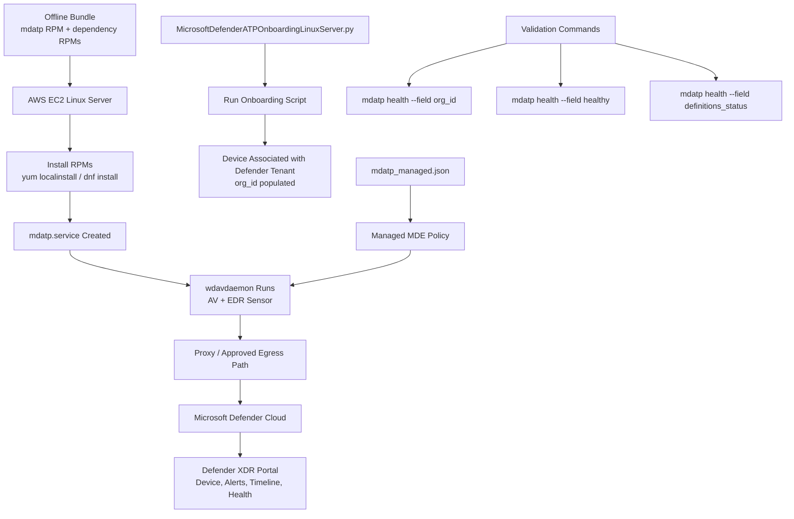

# High-Level Components of MDE for AWS Linux Offline Install

For AWS Linux EC2, Microsoft Defender for Endpoint, **MDE**, has four main pieces:

```text
1. mdatp RPM/DEB package
2. Required dependency RPM/DEB packages
3. MicrosoftDefenderATPOnboardingLinuxServer.py onboarding script
4. mdatp_managed.json policy/configuration file
```

Think of it this way:

```text
mdatp package = installs the MDE software
dependency RPMs = libraries needed by the software
onboarding script = joins the server to your Defender tenant
mdatp_managed.json = controls MDE settings such as proxy, AV mode, exclusions, network protection
```

---

## 1. `mdatp` RPM Package

The **`mdatp` RPM** is the actual Microsoft Defender for Endpoint Linux product package.

For Amazon Linux, RHEL, Rocky, Alma, Oracle Linux, and similar distributions, Microsoft deploys MDE using `yum` or `dnf`. Microsoft’s Linux manual deployment guide includes specific repositories for **Amazon Linux 2** and **Amazon Linux 2023**. ([Microsoft Learn][1])

When installed, the `mdatp` package provides:

| Component                  | Purpose                                                           |
| -------------------------- | ----------------------------------------------------------------- |
| `mdatp` command-line tool  | Used to check health, configure settings, run scans, list threats |
| `mdatp.service`            | Linux systemd service                                             |
| `wdavdaemon`               | Main Defender daemon/process                                      |
| AV engine                  | Real-time and on-demand malware scanning                          |
| EDR sensor                 | Runtime activity collection and detection                         |
| Cloud communication client | Sends telemetry/health to Microsoft Defender cloud                |

Microsoft troubleshooting output shows `mdatp.service` running the Defender daemon from `/opt/microsoft/mdatp/sbin/wdavdaemon`. ([Microsoft Learn][2])

Simple view:

```text
mdatp RPM
   ↓
Installs MDE binaries
   ↓
Creates/uses mdatp service
   ↓
Runs wdavdaemon
   ↓
Provides AV + EDR + telemetry capability
```

Important: installing the `mdatp` RPM alone does **not** fully onboard the server to your tenant. Without onboarding, the product may be installed but not licensed/associated with your Microsoft Defender organization.

---

## 2. Dependency RPMs

The dependency RPMs are not “Defender logic.” They are supporting Linux packages required so `mdatp` can run.

For current versions, Microsoft lists the main external RPM dependency as:

```text
glibc >= 2.17
```

For Debian-based systems, the equivalent requirement is:

```text
libc6 >= 2.23
```

For older MDE Linux versions before `101.25032.0000`, Microsoft lists additional dependencies such as `mde-netfilter` and `pcre`; the `mde-netfilter` package itself had dependencies such as `libmnl`, `libnfnetlink`, `libnetfilter_queue`, and `glib2` on RPM-based systems. ([Microsoft Learn][2])

For offline installation, you do **not** guess dependencies manually. You normally use a matching staging host and download the package plus dependencies using:

```bash
yumdownloader --resolve mdatp
```

or:

```bash
dnf download --resolve mdatp
```

The key rule is:

> Build the offline bundle from the **same OS family and major version** as the target EC2 instance.

Example:

| Target EC2        | Staging Host      |
| ----------------- | ----------------- |
| Amazon Linux 2    | Amazon Linux 2    |
| Amazon Linux 2023 | Amazon Linux 2023 |
| RHEL 8            | RHEL 8            |
| RHEL 9            | RHEL 9            |
| Ubuntu 22.04      | Ubuntu 22.04      |

---

## 3. `MicrosoftDefenderATPOnboardingLinuxServer.py`

This script is the **tenant onboarding script**.

You download it from:

```text
Microsoft Defender portal
 → Settings
 → Endpoints
 → Device management
 → Onboarding
 → Linux Server
 → Local Script
```

The downloaded file is usually:

```text
WindowsDefenderATPOnboardingPackage.zip
```

After extraction, it contains:

```text
MicrosoftDefenderATPOnboardingLinuxServer.py
```

Microsoft’s manual deployment guide states that if this onboarding step is missed, commands show the product as unlicensed and `mdatp health` returns `false`. The guide also shows that before onboarding, the device has no organization association and `org_id` is blank; after running the script, `mdatp health --field org_id` should show a valid organization identifier. ([Microsoft Learn][1])

### What the onboarding script actually does

At a high level, the onboarding script:

| Action                                                 | Meaning                                                              |
| ------------------------------------------------------ | -------------------------------------------------------------------- |
| Adds tenant-specific onboarding information            | Tells MDE which Microsoft Defender tenant/org this server belongs to |
| Associates device with your Defender organization      | Populates `org_id` after successful onboarding                       |
| Enables the MDE client to register with Defender cloud | Required before the device appears in the Defender portal            |
| Makes the installed product licensed/active            | Without this, `mdatp` may be installed but not useful for EDR/XDR    |

Run it with:

```bash
sudo python3 MicrosoftDefenderATPOnboardingLinuxServer.py
```

For older distributions, Microsoft notes that some versions may use `python` instead of `python3`; RHEL 8.x and Ubuntu 20.04 or later require `python3`. ([Microsoft Learn][1])

Validate onboarding:

```bash
mdatp health --field org_id
mdatp health --field healthy
mdatp health --field definitions_status
```

---

## 4. `mdatp_managed.json`

This is the **enterprise-managed MDE policy file** for Linux.

The correct common file name is:

```text
mdatp_managed.json
```

The standard location is:

```text
/etc/opt/microsoft/mdatp/managed/mdatp_managed.json
```

Microsoft describes this as a JSON configuration profile. It contains keys and values for Defender settings, and enterprise-managed preferences take precedence over settings configured locally on the device. ([Microsoft Learn][3])

### What `mdatp_managed.json` controls

It can control settings such as:

| Section             | Purpose                                                                |
| ------------------- | ---------------------------------------------------------------------- |
| `antivirusEngine`   | Real-time protection, passive mode, scan settings, threat handling     |
| `cloudService`      | Cloud protection, sample submission, proxy, definition update behavior |
| `networkProtection` | Network protection mode: disabled, audit, or block                     |
| `edr`               | Device tags, group IDs                                                 |
| `exclusionSettings` | File, folder, process, extension exclusions                            |
| `scheduledScan`     | Scheduled AV scan configuration                                        |

Microsoft’s sample profile includes settings for real-time protection, PUA handling, cloud-delivered protection, automatic security intelligence updates, sample submission, and proxy configuration. ([Microsoft Learn][3])

### Example `mdatp_managed.json`

```json
{
  "antivirusEngine": {
    "enforcementLevel": "real_time",
    "threatTypeSettings": [
      {
        "key": "potentially_unwanted_application",
        "value": "block"
      },
      {
        "key": "archive_bomb",
        "value": "audit"
      }
    ]
  },
  "cloudService": {
    "enabled": true,
    "automaticDefinitionUpdateEnabled": true,
    "automaticSampleSubmissionConsent": "safe",
    "proxy": "http://proxy.example.mil:8080/"
  },
  "networkProtection": {
    "enforcementLevel": "audit"
  },
  "edr": {
    "tags": [
      {
        "key": "GROUP",
        "value": "AWS-Linux-Servers"
      }
    ]
  }
}
```

For proxy configuration specifically, Microsoft documents using `cloudService.proxy` inside `/etc/opt/microsoft/mdatp/managed/mdatp_managed.json`. ([Microsoft Learn][4])

---

# How These Components Work Together



---

# Installation Sequence in Plain English

## Step 1 — Install software

```bash
sudo yum localinstall -y *.rpm
```

This installs the `mdatp` software, daemon, service, CLI, and required local files.

## Step 2 — Run onboarding

```bash
sudo python3 MicrosoftDefenderATPOnboardingLinuxServer.py
```

This joins the EC2 server to your Microsoft Defender tenant.

## Step 3 — Apply managed configuration

```bash
sudo mkdir -p /etc/opt/microsoft/mdatp/managed
sudo cp mdatp_managed.json /etc/opt/microsoft/mdatp/managed/
sudo systemctl restart mdatp
```

This enforces enterprise security settings such as proxy, AV mode, cloud protection, exclusions, and network protection.

## Step 4 — Validate

```bash
mdatp health --field org_id
mdatp health --field healthy
mdatp health --field definitions_status
mdatp health --field cloud_enabled
mdatp health --field real_time_protection_enabled
```

---

# Simple Mental Model

```text
Dependency RPMs
= Linux libraries required by MDE

mdatp RPM
= Installs Microsoft Defender for Endpoint software

mdatp.service / wdavdaemon
= Runtime service and daemon that perform AV/EDR work

MicrosoftDefenderATPOnboardingLinuxServer.py
= Tenant registration script

mdatp_managed.json
= Enterprise policy file for configuration

Microsoft Defender Cloud
= Receives telemetry, health, alerts, and investigation data
```

# Bottom Line

For AWS Linux offline installation:

> **`mdatp` installs the Defender sensor. Dependencies allow it to run. `MicrosoftDefenderATPOnboardingLinuxServer.py` connects it to your Microsoft tenant. `mdatp_managed.json` enforces configuration such as proxy, AV mode, network protection, exclusions, and tags.**

The server can be installed offline, but for full EDR/XDR value, it still needs approved outbound connectivity to Microsoft Defender cloud, usually through a static or transparent proxy. Microsoft states that Defender for Endpoint on Linux uses its own independent telemetry pipeline and that Linux endpoints must reach Defender service URLs; PAC, WPAD, authenticated proxies, and SSL inspection/intercepting proxies are not supported. ([Microsoft Learn][5])

[1]: https://learn.microsoft.com/en-us/defender-endpoint/linux-install-manually "Deploy Microsoft Defender for Endpoint on Linux manually - Microsoft Defender for Endpoint | Microsoft Learn"
[2]: https://learn.microsoft.com/en-us/defender-endpoint/linux-support-install "Troubleshoot installation issues for Microsoft Defender for Endpoint on Linux - Microsoft Defender for Endpoint | Microsoft Learn"
[3]: https://learn.microsoft.com/en-us/defender-endpoint/linux-preferences "Configure security settings in Microsoft Defender for Endpoint on Linux - Microsoft Defender for Endpoint | Microsoft Learn"
[4]: https://learn.microsoft.com/en-us/defender-endpoint/linux-static-proxy-configuration "Microsoft Defender for Endpoint on Linux static proxy discovery - Microsoft Defender for Endpoint | Microsoft Learn"
[5]: https://learn.microsoft.com/en-us/defender-endpoint/mde-linux-prerequisites "Prerequisites for Microsoft Defender for Endpoint on Linux - Microsoft Defender for Endpoint | Microsoft Learn"
