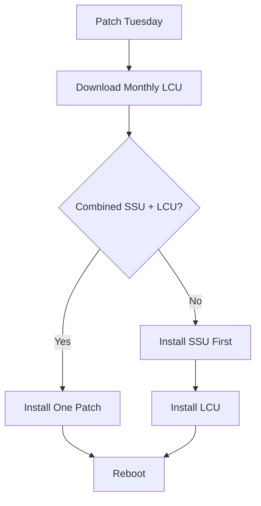

# 1. Patch Tuesday (Monthly Release Model)

Patch Tuesday happens typically **2nd Tuesday each month**.

Microsoft releases:

## Main monthly patch:

### LCU (Latest Cumulative Update)

Contains:

* Security fixes
* Bug fixes
* Prior cumulative fixes

Think:

```text
April patch includes March + February + January...
```

Miss 3 months?

Install latest LCU only.

---

## Sometimes separate SSU

May be:

* bundled with LCU (common now)
* separate (older systems)

Order if separate:

```text
SSU → LCU → Reboot
```

---

# 2. Security-only vs Cumulative (Old Confusion)

Mostly relevant historically (especially older
Windows Server 2012 R2 /
Windows Server 2016 )

## A. Security-Only Update

Contains:

* only that month’s security fixes
* NOT cumulative

If you miss 3 months:
Need 3 patches.

---

## B. Cumulative (LCU)

Contains:

* this month's fixes
* all previous fixes

Miss 3 months?
Install one patch.

---

## Recommendation

Almost always use:

✅ Cumulative (LCU)

Avoid security-only unless compliance requires it.

---

# 3. WSUS Classifications (What They Mean)

Windows Server Update Services categories:

| Classification          | Meaning                     | Usually Approve? |
| ----------------------- | --------------------------- | ---------------- |
| Critical Updates        | Non-security critical fixes | Often yes        |
| Security Updates        | Security fixes              | Yes              |
| Update Rollups          | Cumulative bundles          | Yes              |
| Servicing Stack Updates | Update servicing engine     | Yes              |
| Feature Packs           | Features                    | Case-by-case     |
| Drivers                 | Hardware drivers            | Usually cautious |
| Definition Updates      | Defender signatures         | Yes              |

For servers many shops approve:

```text
Security Updates
Update Rollups
Servicing Stack Updates
Definition Updates
```

---

# 4. DISM Offline Patching

Using:

```powershell
DISM
```

Patch a mounted image before deployment.

## Typical flow

Mount image:

```powershell
dism /mount-image ...
```

Add SSU (if separate):

```powershell
dism /image:C:\mount /add-package /packagepath:ssu.cab
```

Add LCU:

```powershell
dism /image:C:\mount /add-package /packagepath:lcu.cab
```

Commit:

```powershell
dism /unmount-image /commit
```

## Rule:

Always:

```text
SSU before LCU
```

for offline servicing when separate.

---

# 5. Big Picture Mapping

## Modern Normal Server Patching



---

# 6. Simple Cheat Sheet

## What is what

```text
SSU = fixes update engine

LCU = monthly patch bundle

MSU = package wrapper

CAB = raw package

WSUS = patch distribution

DISM = offline patching tool
```

---

## Install Order

```text
If separate:
1 SSU
2 LCU
3 Reboot

If combined:
1 Install LCU
2 Reboot
```

---

## Patching Methods

```text
Windows Update
  Automatic

WSUS/SCCM
  Enterprise managed

WUSA
  Manual .MSU installs

DISM
  Offline .CAB servicing
```

---

# 7. My “Do Not Get Burned” Rules

### For running servers

Use:

* latest LCU
* latest SSU if separate

Never try to chain random old missing patches.

---

### For gold images

Inject:

```text
SSU
LCU
.NET CU (if needed)
```

---

### For air-gapped / STIG environments

Pull from
Microsoft Update Catalog

Verify:

* KB dependencies
* SSU prerequisite
* architecture (x64)
* reboot requirements

---

# 8. Mental Model I Use

```text
Patch Tuesday releases fixes

LCU carries fixes

SSU makes patching work

WSUS distributes patches

DISM injects patches into images
```

Or even simpler:

```text
WSUS delivers it
SSU enables it
LCU fixes it
DISM bakes it in
```

That’s basically the whole Windows patching ecosystem.

---

## Example real-world monthly server workflow

```text
Patch Tuesday
↓
Approve SSU/LCU in WSUS
↓
Test Dev
↓
Patch Prod
↓
Bake same patches into gold image via DISM
```


