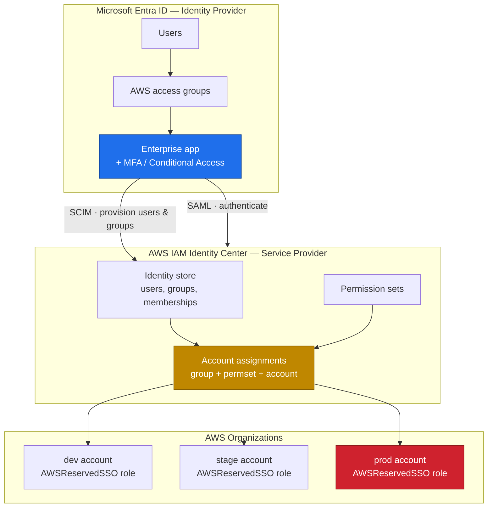
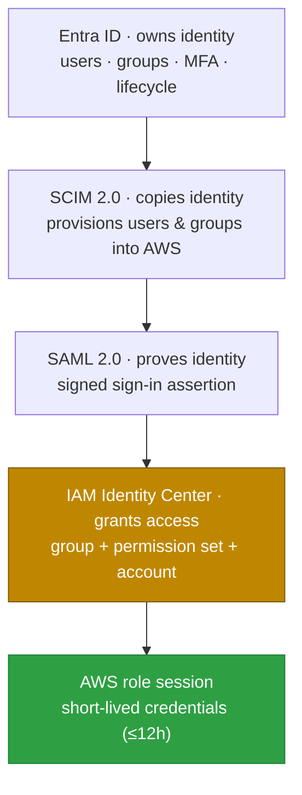
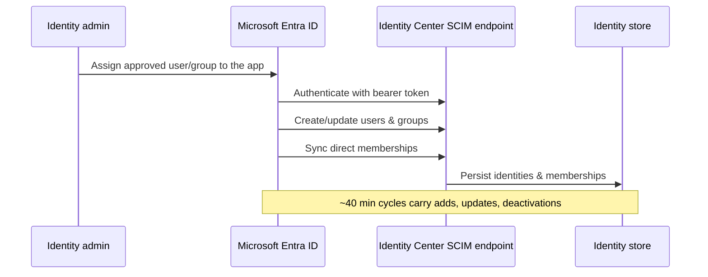
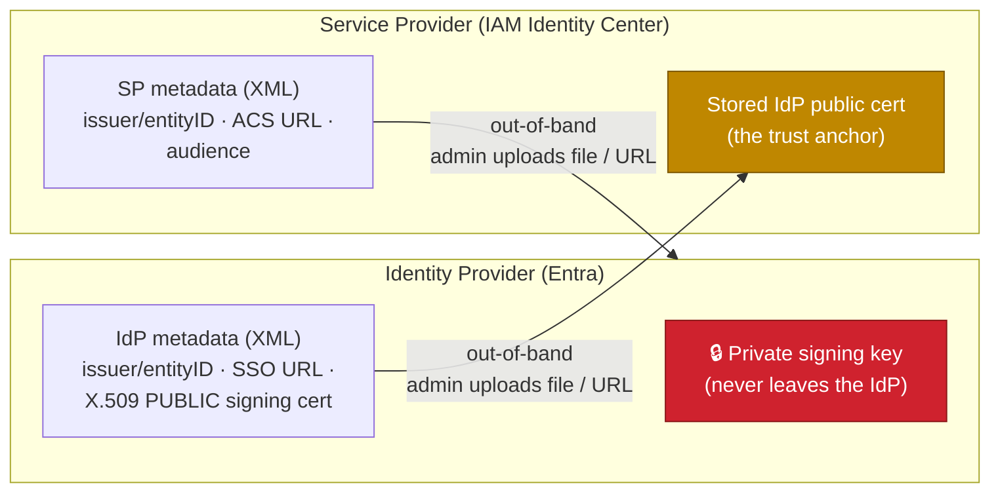
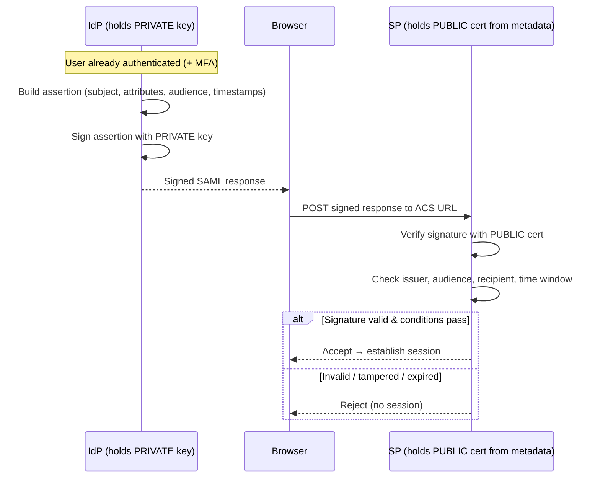
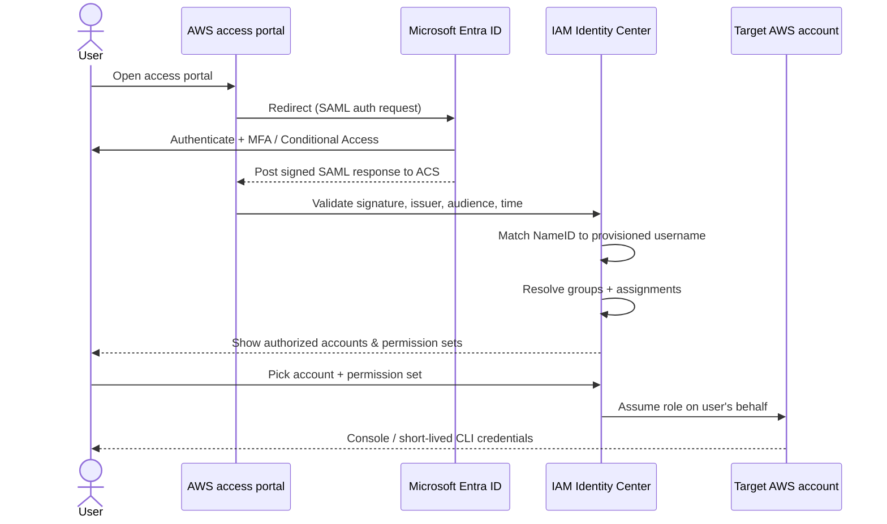
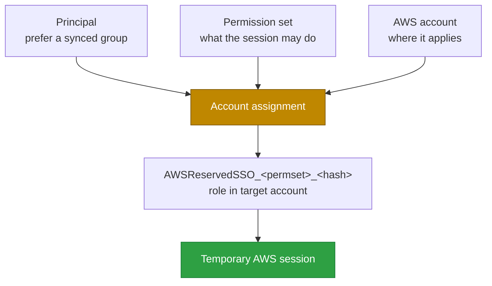
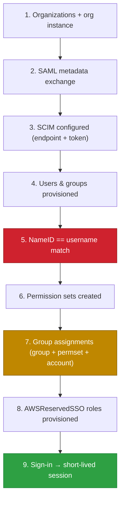

# Entra ID ↔ AWS IAM Identity Center SSO Integration

---

## 1. The one rule

Two products, two protocols, one authorization rule.

- **Entra ID owns identity** — users, groups, MFA, Conditional Access, joiner/mover/leaver.
- **IAM Identity Center is the AWS access broker** — maps identities to accounts + permissions, runs the access portal, issues sessions.
- **SAML 2.0 authenticates** (proves who you are at sign-in).
- **SCIM 2.0 provisions** (copies users/groups into AWS so the identity exists).
- **An account assignment authorizes** — and it is the *only* thing that grants AWS permissions.

> **Synced group + permission set + AWS account = access.**
> Example: `AWS-Prod-ReadOnly` + `ReadOnlyAccess` + Production account → read-only sessions in prod.

Neither SAML nor SCIM grants anything alone: SAML proves identity, SCIM makes the identity known to AWS, the assignment grants access.

---

## 2. High-level architecture

Three planes: identity (Entra), AWS access-control (Identity Center), AWS runtime (roles in accounts). *This is the Mermaid version of the summary architecture diagram.*

> **Instance type matters:** use an **organization instance** (enabled from the Organizations management account, admin optionally delegated). *Account instances* can't grant multi-account access and are unsuitable here.

---

## 3. The compact mental model

*Mermaid version of the causal-chain diagram — the whole doc in five steps.*

---

## 4. Two "assignments" that must not be confused

| Assignment | Configured in | Purpose | Grants AWS permissions? |
|---|---|---|---|
| **Entra enterprise-app assignment** | Entra ID | Who may use the app / who is sent via SCIM | **No** |
| **Identity Center account assignment** | IAM Identity Center | Binds principal → permission set → account | **Yes** |

This explains the most common confusion: a user can be provisioned successfully yet **see no AWS accounts** — because no *account assignment* exists for them or their synced groups.

---

## 5. SCIM (provisioning) — the detail that bites

Identity Center generates a regional **SCIM endpoint** + a **bearer token**; you configure both in the Entra enterprise app, which then pushes identities as the SCIM client.

The gotchas that break setups:

- **SCIM is not login;** and **SAML has no just-in-time provisioning** — the user must already exist via SCIM (or manual) before sign-in can succeed.
- **Nested groups are not expanded** — members must be *direct*. Dynamic groups work only if the dynamic group itself is in provisioning scope.
- **Required attributes** (first name, last name, username, display name) must be populated; **username / primary email / `externalId`** must be unique (use a stable Entra object id for `externalId`).
- **~40-minute sync** — design for propagation delay, not instant access.
- **Token expires after one year** — rotate it, or lifecycle sync silently stops.
- **Don't mutate the identity store out-of-band** — it causes drift when SCIM is authoritative.

---

## 6. SAML (authentication) — and the match that must be exact

### 6.1 Generic SAML: trust by out-of-band metadata + asymmetric signatures

Before any of the AWS specifics, it helps to see SAML as a generic **IdP ↔ SP** trust model. Two parties: the **Identity Provider** (asserts who the user is — here, Entra) and the **Service Provider** (consumes the assertion and grants a session — here, IAM Identity Center). They never share a password or secret. Instead, trust is bootstrapped **out-of-band** and enforced with **asymmetric (public/private key) cryptography.**

**Step 1 — Out-of-band metadata exchange (one-time setup).** Each side publishes a **metadata XML** document describing itself, and an administrator exchanges them *through a separate, trusted channel* (download a file / paste a URL in each console) — deliberately **not** over the live SAML sign-in path. That's the "out-of-band" part: the trust anchors are configured by admins ahead of time, so the runtime flow never has to bootstrap trust from an untrusted browser redirect.

What each metadata document carries:

- **IdP metadata → given to the SP:** the IdP's `entityID` (issuer), its SSO sign-in URL, and its **X.509 public signing certificate**. The SP stores that certificate as its trust anchor.
- **SP metadata → given to the IdP:** the SP's `entityID` (audience) and its **Assertion Consumer Service (ACS) URL** — the exact endpoint where signed responses must be posted.

**Step 2 — Sign with the private key, verify with the public certificate.** At runtime the IdP builds the SAML assertion and **signs it with its private key**. That private key *never leaves the IdP* — it isn't in the metadata, isn't sent to the SP, isn't in the browser. The SP verifies the signature using the **public certificate it received in the metadata** during setup. Because only the holder of the matching private key could have produced a signature that validates against that public cert, the SP knows the assertion genuinely came from the trusted IdP and **was not altered in transit** (the browser only relays it).

Why this design is secure: the SP trusts an assertion **only** if it validates against the pre-shared public cert, so a forged or modified assertion fails; the private key is never exposed, so it can't be stolen from the SP or the wire; and binding checks (`audience` = this SP, `recipient` = this ACS, plus short time windows) stop a valid assertion from being **replayed** against a different service. Key rotation is just re-publishing updated metadata out-of-band — which is why **letting the IdP signing certificate expire silently breaks all sign-in** (a common outage, called out in §11).

### 6.2 The AWS-specific runtime flow

Applying the generic model to Entra + Identity Center: the SP metadata (AWS `entityID` + ACS) goes to Entra, the IdP metadata (Entra issuer + SSO URL + signing cert) goes to AWS, and at sign-in Entra signs the assertion while Identity Center verifies it and maps it to a provisioned user.

### 6.3 The identity match

**The critical constraint:** `SAML NameID == Identity Center username`. Use NameID format `email` with a proper `user@domain` value, commonly mapping Entra `userPrincipalName` to both the SCIM `userName` and the NameID. If Entra auth succeeds but AWS reports a mapping error, check this first.

---

## 7. Authorization — group + permission set + account

A **permission set** is a template (managed/inline policies, permissions boundary, session duration); it grants nothing until assigned. An **account assignment** combines three inputs and provisions a role.

Behavior worth internalizing: Identity Center provisions **one role per permission set per account** (not per user) via the `AWSServiceRoleForSSO` service-linked role; **don't edit these roles directly** — change the permission set and reprovision; and if the *last* assignment is removed the role is deleted, so recreating it yields a **new suffix** — which breaks any KMS key policy, EKS access entry, or resource policy that hard-referenced the old ARN. SCPs, boundaries, and explicit denies still apply on top.

Recommended group naming: `AWS-<scope>-<permission>` (e.g., `AWS-Prod-ReadOnly`) — the name signals intent, but the *assignment* is the real authorization.

---

## 8. The dependency chain

Production access requires this order to hold:

SAML and SCIM can be *built* in either order, but both must work **and** the SAML subject must resolve to a provisioned user. Read failures backward through this chain to debug.

---

## 9. Lifecycle & the offboarding caveat

- **Joiner:** create user → add to approved group (direct) → group in scope → SCIM provisions → inherits the group's assignments → accounts appear at sign-in.
- **Mover:** swap group membership → SCIM updates → next portal evaluation reflects new access.
- **Leaver:** disable/remove in Entra → SCIM deactivates → new sign-ins/sessions blocked.

> **Caveat:** deprovisioning does **not** instantly kill credentials already issued — existing sessions can remain valid up to the permission-set duration (**≤12h**). For urgent termination, explicitly revoke active Identity Center sessions.

---

## 10. Troubleshooting matrix

| Symptom | Likely cause | Fix |
|---|---|---|
| Entra sign-in OK, AWS login fails | NameID ≠ provisioned username | Correct SAML claim / SCIM mapping |
| "User not found" / external-IdP error | Not provisioned, SCIM delayed/failed | Check Entra provisioning logs; fix attributes/scope |
| Signs in, no accounts shown | No assignment for user/groups | Assign the synced group to permset + account |
| Group in Entra, missing in AWS | Out of provisioning scope | Add group to approved scope |
| Some members missing | Nested, not direct, members | Add users directly to the provisioned group |
| Policy changed, no effect | Permission set not reprovisioned | Reprovision to the account |
| Recreated user, access broken | New object id, stale assignment ref | Remove stale assignment, recreate |
| SCIM stopped syncing | Expired/failed token | Rotate token, restart provisioning |
| Offboarded user still active | Role credentials not yet expired | Revoke sessions; use shorter durations |

CloudTrail's `ExternalIdPDirectoryLogin` event helps distinguish assertion-validation from identity-mapping failures.

---

## 11. Design principles

1. **Entra is the system of record;** grant AWS access through **synced groups**, never individual users.
2. **The account assignment is the only grant** — provisioning ≠ authorization.
3. **NameID must equal the provisioned username exactly** — the top failure mode.
4. **Members must be direct;** avoid nested authorization groups.
5. **Manage permission sets + assignments as code;** least-privilege, shorter durations for prod/privileged.
6. **Don't edit `AWSReservedSSO_*` roles;** beware hard-referencing their ARNs (suffix can change).
7. **Rotate the SCIM token (1-yr) and monitor SAML cert expiry;** keep an independent emergency-access path.
8. **Offboarding needs session revocation,** not just disable — credentials outlive deprovisioning up to 12h.

> **Mental model:** Entra owns identity · SCIM copies it · SAML proves it · Identity Center assigns access · AWS roles provide temporary sessions.

---

## 12. References

- [AWS: SAML & SCIM with Microsoft Entra ID](https://docs.aws.amazon.com/singlesignon/latest/userguide/idp-microsoft-entra.html)
- [AWS: Provision users and groups with SCIM](https://docs.aws.amazon.com/singlesignon/latest/userguide/provision-automatically.html)
- [AWS: Organization vs account instances](https://docs.aws.amazon.com/singlesignon/latest/userguide/identity-center-instances.html)
- [AWS: Referencing permission sets & `AWSReservedSSO_*` roles](https://docs.aws.amazon.com/singlesignon/latest/userguide/referencingpermissionsets.html)
- [AWS: Authentication sessions](https://docs.aws.amazon.com/singlesignon/latest/userguide/authconcept.html)
- [Microsoft: Automatic user provisioning to AWS IAM Identity Center](https://learn.microsoft.com/en-us/entra/identity/saas-apps/aws-single-sign-on-provisioning-tutorial)
