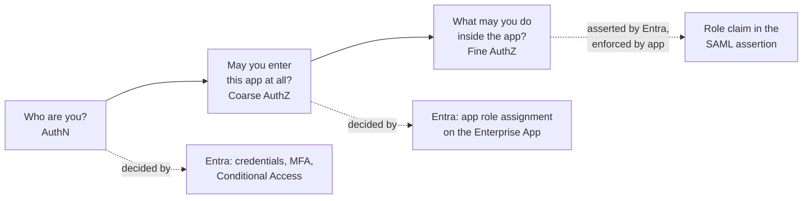
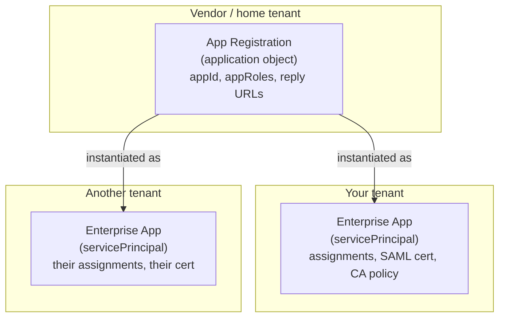
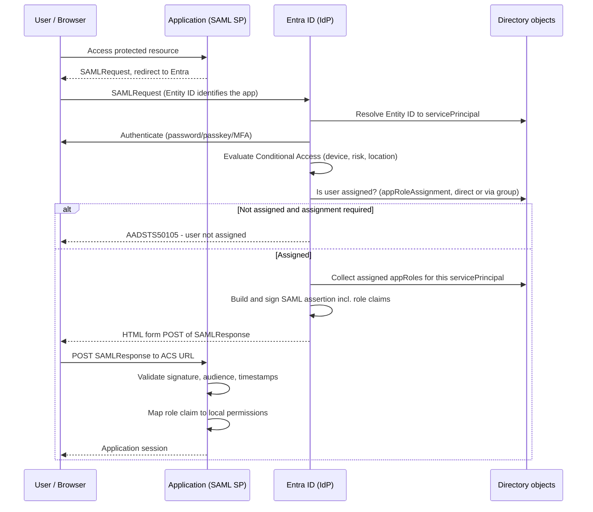
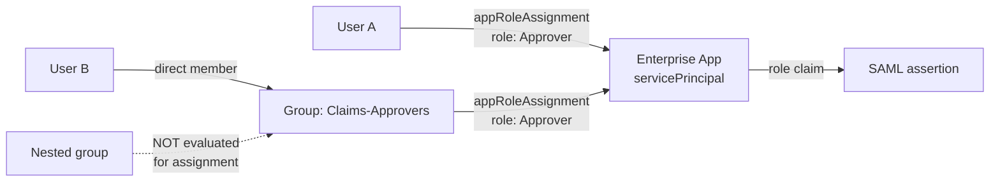
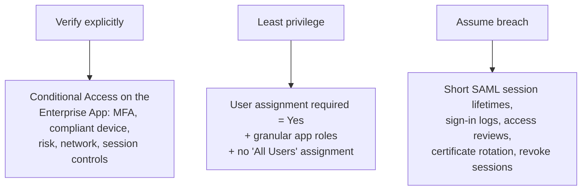
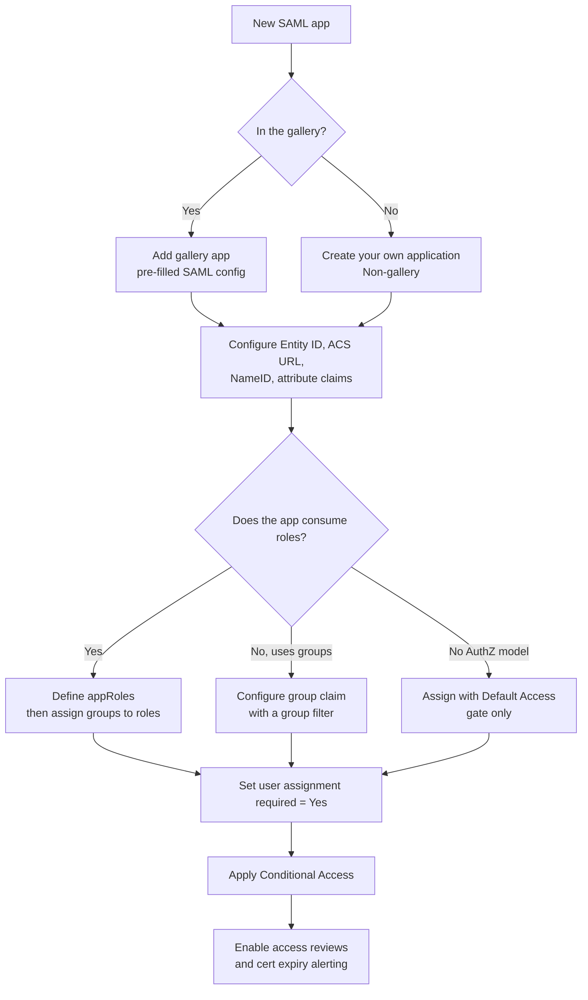

# Microsoft Entra ID Application Model — Untangling AuthN and AuthZ (SAML First)

**Document 1 of 3.** Read in this order:

| Order | Document | Covers |
|-------|----------|--------|
| **1 (this one)** | Application model in SAML context | App Registration, Enterprise App, Assignment, App Roles, Group assignment — and which is AuthN vs AuthZ |
| 2 | OIDC / OAuth 2.0 context | Scopes, consent, delegated vs application permissions, tokens, and how the *same* objects behave differently |
| 3 | Zero Trust patterns and design decisions | Choosing roles vs groups vs claims, Conditional Access placement, governance and access reviews |

**Audience:** Identity engineers, IAM architects, security engineers, application owners.

> **Core idea:** Entra ID has **one object that defines an app** and **one object that represents that app inside your tenant**. Everything confusing — assignment, roles, group assignment — hangs off the *tenant-local* object. Authentication is decided by Entra. Authorization is *asserted* by Entra and *enforced* by the application.

---

# 1. The problem this model solves

A single sign-on system must answer three different questions, and they are frequently collapsed into one:

| Question | Domain | Who decides |
|----------|--------|-------------|
| Is this really the user, under acceptable conditions? | **Authentication** | Entra ID (credentials + Conditional Access) |
| Is this user allowed to reach this application at all? | **Coarse authorization** (the gate) | Entra ID (app assignment) |
| What is this user allowed to *do inside* the application? | **Fine authorization** (the entitlement) | The application, using claims Entra asserts |

Entra ID splits these across distinct objects deliberately. Once you know which object answers which question, the naming stops being confusing.



*Figure 1 — Three questions, three enforcement points.*

---

# 2. The five objects in one sentence each

| Object | One-sentence definition | Analogy |
|--------|------------------------|---------|
| **App Registration** (`application`) | The global *definition* of an application — its identity, redirect/reply endpoints, and the catalogue of roles it supports. | The **blueprint** / class definition. |
| **Enterprise Application** (`servicePrincipal`) | The *local instance* of that application inside **your** tenant, where SSO config, assignments, and policies live. | The **instance** / object created from the class, in your building. |
| **App Assignment** (`appRoleAssignment`) | A link saying *this user or group may use this application* — and optionally, *in this role*. | The **badge issued** to a person for that building. |
| **App Role** (`appRoles` entry) | A named entitlement the application publishes (e.g. `Approver`, `ReadOnly`) that Entra can stamp into the token. | The **job title printed on the badge**. |
| **App-role-to-group assignment** | The same assignment, but the subject is a group instead of a user — so membership drives access. | Badges issued **by department**, not per person. |

> **The single most useful sentence:** *App Registration is global and defines what the app is; Enterprise Application is tenant-local and defines who in your tenant can use it and how.*

## 2.1 Why two objects exist at all

A multi-tenant SaaS app is **defined once** by its vendor but **used by thousands of tenants**. One `application` object (in the vendor's tenant) → one `servicePrincipal` per consuming tenant. Your assignments, your Conditional Access, your SAML certificate live on *your* service principal and never touch the vendor's definition.



*Figure 2 — One definition, many tenant-local instances.*

**Corollary:** creating an App Registration in your own tenant silently creates a service principal too. That is why a new registration immediately appears under **Enterprise Applications**. They are two objects, not two views of one object.

---

# 3. Where SAML changes the picture

SAML is where most of the confusion originates, because **for a typical SAML app you never meaningfully touch the App Registration.**

| Scenario | App Registration | Enterprise Application |
|----------|-----------------|------------------------|
| Gallery SAML app (Salesforce, ServiceNow, Workday) | Owned by the vendor / Microsoft, not visible or editable to you | **Everything you configure lives here** |
| Non-gallery ("Create your own application") SAML app | Created implicitly; rarely opened | **Everything you configure lives here** |
| Modern OIDC/OAuth app you build | Actively edited — scopes, redirect URIs, secrets, roles | Assignments and policy only |

So for SAML, treat the model as: **Enterprise Application = the app.** The registration is background plumbing.

## 3.1 What you actually configure on a SAML Enterprise App

| Setting | SAML term | Purpose |
|---------|-----------|---------|
| Identifier | **Entity ID** (`Audience`) | Who the assertion is intended for; must match the SP exactly |
| Reply URL | **Assertion Consumer Service (ACS)** URL | Where Entra POSTs the signed assertion |
| Sign-on URL | SP-initiated start point | Where Entra sends users for IdP-initiated or MyApps launch |
| Attributes & Claims | Assertion attribute statements | NameID, email, UPN, custom claims, and the **role claim** |
| SAML signing certificate | IdP token-signing cert | The SP validates the assertion signature against this |
| Users and groups | — | **Assignment** — the AuthN/coarse-AuthZ gate |
| Conditional Access (via Entra policy) | — | Conditions on the authentication itself |

---

# 4. Runtime: an SP-initiated SAML sign-in, end to end



*Figure 3 — Authentication, the assignment gate, and claim issuance are three distinct steps.*

**The decisive observation:** step *"Is user assigned?"* is the last thing Entra can enforce. After the assertion is POSTed, Entra is out of the loop. Everything after that is the application trusting a signed statement.

---

# 5. AuthN vs AuthZ — object by object

| Object / control | Authentication | Authorization | Enforced by |
|------------------|----------------|---------------|-------------|
| Credentials, MFA, passkeys | ✅ | — | Entra |
| Conditional Access policy | ✅ (conditions on AuthN) | Partially (blocks access) | Entra |
| **Enterprise App** existence | — | — (it is the resource) | Entra |
| **"User assignment required" = Yes** | — | ✅ coarse gate | Entra |
| **appRoleAssignment** (user or group) | — | ✅ gate + role selection | Entra |
| **App Role definition** | — | ✅ vocabulary only | The app |
| **Role claim in assertion** | — | ✅ fine-grained | **The application** |
| Group claim in assertion | — | ✅ fine-grained | **The application** |

> **Critical Zero Trust point:** an Entra app role is an **assertion, not an enforcement**. If the application ignores the role claim, every assigned user gets whatever the app defaults to. Entra can prevent someone from getting *in*; only the app can prevent them from doing *something*.

---

# 6. Low-level: what the objects look like

## 6.1 App role definition (on the `application`, surfaced on the `servicePrincipal`)

```json
{
  "appRoles": [
    {
      "id": "8f1a1b60-2b6a-4a4d-9d15-1a2c3f4e5d60",
      "displayName": "Claims Approver",
      "value": "Approver",
      "description": "May approve submitted claims",
      "allowedMemberTypes": [ "User" ],
      "isEnabled": true
    }
  ]
}
```

| Field | Meaning in SAML terms |
|-------|----------------------|
| `id` | GUID referenced by every assignment; **never reuse or change it** |
| `value` | The string emitted in the role claim — this is what the app matches on |
| `displayName` | What administrators see in the assignment dialog |
| `allowedMemberTypes` | `User` = users and groups (SAML case); `Application` = service-to-service (Doc 2) |

For a **gallery or non-gallery SAML app** where the registration is not editable, roles are patched onto the service principal through Microsoft Graph rather than through the App Registration UI. The `id` values you generate must be unique within that app.

## 6.2 The assignment itself

```json
{
  "principalId": "<user or group objectId>",
  "principalType": "User",
  "resourceId": "<servicePrincipal objectId>",
  "appRoleId": "8f1a1b60-2b6a-4a4d-9d15-1a2c3f4e5d60"
}
```

If the app publishes **no roles**, Entra still creates an assignment using the reserved default role:

```
appRoleId = 00000000-0000-0000-0000-000000000000   ("Default Access")
```

This is the pure *gate* case: assignment grants entry, carries no entitlement. Gallery SAML apps also often carry a legacy placeholder role named `msiam_access` for the same reason.

## 6.3 The resulting claim in the SAML assertion

```xml
<Attribute Name="http://schemas.microsoft.com/ws/2008/06/identity/claims/role">
  <AttributeValue>Approver</AttributeValue>
  <AttributeValue>ReadOnly</AttributeValue>
</Attribute>
```

A user assigned to two roles receives **two values in one attribute**. Applications that read only the first value will behave unpredictably — verify SP behaviour before relying on multi-role assignment.

## 6.4 Assignment topology



*Figure 4 — Direct and group-based assignment; nesting is the classic trap.*

---

# 7. Group-based assignment — the scaling pattern

| Approach | When to use | Cost of change |
|----------|-------------|----------------|
| Direct user assignment | Very small apps, break-glass, pilots | Every joiner/mover/leaver is a manual ticket |
| **Group assigned to an app role** | Default for production | Access changes with group membership; auditable, reviewable |
| Dynamic group assigned to a role | Attribute-driven populations (department, jobTitle) | Fully automated; requires clean HR attribute data |

**Constraints to design around:**

- **Group-based assignment to applications requires Entra ID P1 or higher.** Direct user assignment does not.
- **Nested group membership is not evaluated for app role assignment.** Only *direct* members of the assigned group receive the role. This is the single most common "the user is in the group but access fails" incident.
- One group can be assigned to **multiple roles** on the same app; a user in that group receives all of them.
- Group **display names change**; group **objectIds do not**. Prefer roles over raw group claims when the app allows it.

## 7.1 App roles vs. group claims — choosing

| | App roles | Group claims |
|---|-----------|--------------|
| What the app sees | Stable business term (`Approver`) | Group objectId GUID, or on-prem `sAMAccountName` if synced |
| Coupling | App is decoupled from directory structure | App is hard-coupled to your group naming/IDs |
| Scale limit | Practical, small role catalogue | SAML assertions cap the emitted group list (~150 transitive groups); above that the claim is omitted or replaced with an overage indicator many SAML SPs cannot follow |
| Governance | Reviewable as "who has role X on app Y" | Reviewable only as group membership |
| **Recommendation** | **Default choice** | Only when the SP cannot consume roles, or a group filter is configured |

---

# 8. Zero Trust framing

Zero Trust demands *explicit verification*, *least privilege*, and *assume breach*. Map each principle to an object:



*Figure 5 — Zero Trust principles mapped to concrete Entra controls.*

| Principle | Concrete control | Failure mode if skipped |
|-----------|-----------------|-------------------------|
| Verify explicitly | Conditional Access scoped to the service principal | App reachable from unmanaged devices worldwide |
| Explicit gate | **`appRoleAssignmentRequired = true`** | Any authenticated tenant user can reach the app; this is off by default for some app types — **always verify it** |
| Least privilege | Distinct app roles; no blanket "Default Access" for privileged apps | Everyone lands in the app's own default role |
| Lifecycle | Group-based assignment tied to HR-driven groups | Leavers keep access until someone notices |
| Recertification | Access reviews on the app role assignment | Entitlement creep, unprovable compliance |
| Auditability | Sign-in logs filtered by application + provisioning logs | Cannot answer "who could approve claims on 12 March" |
| Assume breach | Certificate rotation plan, session revocation runbook | Expired cert = full outage; compromise = no containment path |

> **Zero Trust caveat unique to SAML:** SAML has no standard token-revocation or refresh mechanism. Once the assertion is consumed, the application's own session lifetime governs access. Removing an assignment in Entra stops *future* sign-ins, not the *current* session. Continuous access evaluation does not apply to SAML apps. Design app session lifetimes accordingly.

---

# 9. Decision pattern — configuring a new SAML app



*Figure 6 — Standard build path.*

---

# 10. Troubleshooting table

| Symptom | Likely cause | Where to look |
|---------|-------------|---------------|
| `AADSTS50105` — user not assigned to a role | No `appRoleAssignment` for the user, and assignment is required | Enterprise App → Users and groups |
| User is in the correct group but still blocked | **Nested group** — only direct members count | Group → Members (direct) |
| Group assignment option greyed out | Missing Entra ID P1 licensing | Tenant licence state |
| Any tenant user can sign in unexpectedly | `User assignment required = No` | Enterprise App → Properties |
| App loads but user has wrong permissions | App ignoring or misreading the role claim, or user only holds Default Access | Decode assertion; check `value` strings match app config exactly |
| `AADSTS650056` / audience or Entity ID errors | Identifier mismatch between SP and Entra | Enterprise App → SAML config → Identifier |
| Assertion rejected at the SP | Signing certificate rotated or expired; clock skew | SAML signing certificate blade; SP-side IdP metadata refresh |
| Roles disappeared after app re-creation | New service principal → new object IDs; assignments do not carry over | Compare `servicePrincipal` objectId |
| Group claim missing for large populations | Emitted group count exceeded the assertion limit | Configure a group filter, or move to app roles |

---

# 11. One-page mental model

> **App Registration** says: *"This is what the application is, and these are the roles it understands."*
>
> **Enterprise Application** says: *"This is that application, as it exists in my tenant, with my SAML settings and my policies."*
>
> **Assignment** says: *"This user or group may sign in to it — and here is the role they hold."*
>
> **App Role** says: *"This is the entitlement name I will stamp into the assertion."*
>
> **The application** says: *"I have verified the signature; I will now decide what that role is permitted to do."*

Authentication ends when the assertion is signed. Authorization begins there — and lives half in Entra, half in the app. Keeping that seam visible is the whole discipline.

---

# 12. What Document 2 changes

The same five objects behave differently under OIDC/OAuth 2.0, and that is where the remaining confusion usually hides:

- **Scopes vs app roles** — delegated permissions (acting *as* a user) vs application permissions (acting *as itself*)
- **Consent** — user consent, admin consent, and why SAML has no equivalent
- **Tokens** — access token vs ID token, and which one carries the `roles` claim
- **Registration becomes primary** — redirect URIs, secrets, certificates, and PKCE
- **Continuous Access Evaluation** — the revocation capability SAML lacks

---

# 13. Official references

**[1] Microsoft Entra: Application and service principal objects.** https://learn.microsoft.com/entra/identity-platform/app-objects-and-service-principals

**[2] Microsoft Entra: Add an app role to an application.** https://learn.microsoft.com/entra/identity-platform/howto-add-app-roles-in-apps

**[3] Microsoft Entra: Assign users and groups to an application.** https://learn.microsoft.com/entra/identity/enterprise-apps/assign-user-or-group-access-portal

**[4] Microsoft Entra: Configure SAML-based single sign-on.** https://learn.microsoft.com/entra/identity/enterprise-apps/add-application-portal-setup-sso

**[5] Microsoft Entra: Customize claims issued in the SAML token.** https://learn.microsoft.com/entra/identity-platform/saml-claims-customization

**[6] Microsoft Entra: Configure group claims for applications.** https://learn.microsoft.com/entra/identity/hybrid/connect/how-to-connect-fed-group-claims

**[7] Microsoft Graph: appRoleAssignment resource type.** https://learn.microsoft.com/graph/api/resources/approleassignment

**[8] Microsoft Entra: Restrict application access to assigned users.** https://learn.microsoft.com/entra/identity/enterprise-apps/what-is-access-management

**[9] Microsoft: Zero Trust identity guidance.** https://learn.microsoft.com/security/zero-trust/deploy/identity
