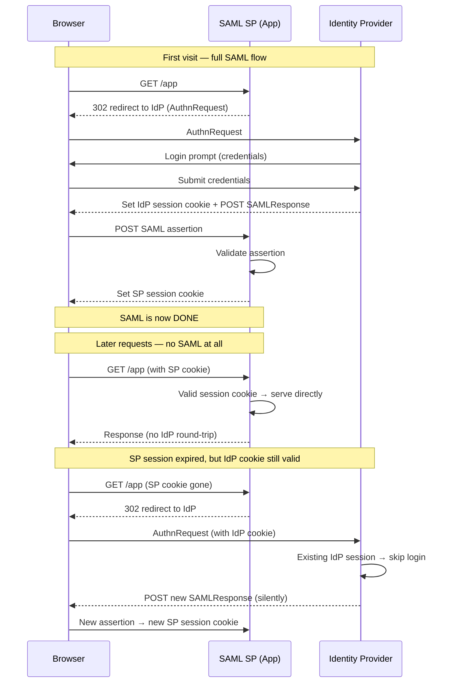

# SAML vs Session Cookie

## The core distinction

SAML is a **one-time authentication event**. Once the SP validates the assertion, SAML's job is done — it does not stay involved on every subsequent request. The thing that remembers "you're logged in" is a **local session at the SP**, tracked with a cookie. That cookie is issued by the SP application, not by SAML and not by the IdP.

There are actually **two independent sessions** in play, and this is the key to your question:

| Session | Lives at | Tracked by | What it means |
|---------|----------|------------|---------------|
| **SP session** | The application you're using | SP's own session cookie (e.g. a `JSESSIONID`, `_session`, etc.) | "This browser is authenticated to *this app*." |
| **IdP session** | The identity provider | IdP's session cookie | "This browser has an active login with the IdP." |

## Why you don't get re-prompted

Your specific observation — "it does not ask me to re-authenticate unless I delete my cache" — is explained by these two cookies, and which one is doing the work depends on the moment:

Two things keep you from re-entering credentials:

1. **While the SP session cookie is valid**, the app never contacts the IdP at all. You're served straight from the local session. No SAML happens.
2. **When the SP session expires** but your **IdP session cookie is still alive**, the SP redirects you to the IdP — but the IdP sees its own cookie, recognizes you, and issues a fresh assertion *without prompting*. This is **Single Sign-On + silent re-authentication**, and to you it's invisible: a couple of redirects, no login screen. This is also why one login gets you into *multiple* SAML apps.

Clearing your cache/cookies destroys **both** cookies, which is why that's the one action that forces a full re-login.

## Why this matters in a Zero Trust framing

This is a genuinely important distinction for security posture, not just trivia:

- **SAML asserts identity at a point in time.** It says nothing about the continued validity of the session. The assertion has an `exp`, but once consumed, the SP's cookie lifetime — not the assertion — governs how long you stay in.
- **The session cookie is now the trust anchor**, and it's often *long-lived and coarse*. A stolen SP session cookie can bypass the entire IdP, its MFA, and its conditional-access policies, because none of those are re-evaluated on cookie-backed requests. This is the classic **session hijacking / token replay** gap.
- Zero Trust ("never trust, always verify") pushes back on exactly this: mechanisms like **short session lifetimes**, **continuous access evaluation (CAEP)**, **re-authentication for sensitive actions**, and **binding the session to device posture** exist precisely because a bare session cookie violates the "verify continuously" principle. SAML alone verifies *once*.

So to directly answer: SAML does not use a cookie. The SP application sets a session cookie *after* SAML completes, and that cookie — plus the IdP's own session cookie — is what silently keeps you logged in.

---

This is closely adjacent to the AuthN/AuthZ separation that runs through the identity work — same discipline, different axis: here the split is **authentication (a one-time event)** vs. **session management (continuous state)**. If it's useful, I could write this up as a short reference doc — something like *"SAML Sessions: Authentication vs. Session Lifecycle"* — that would slot cleanly alongside your Entra application-model reference, since Entra/OIDC has the exact same two-cookie behavior with different names.
