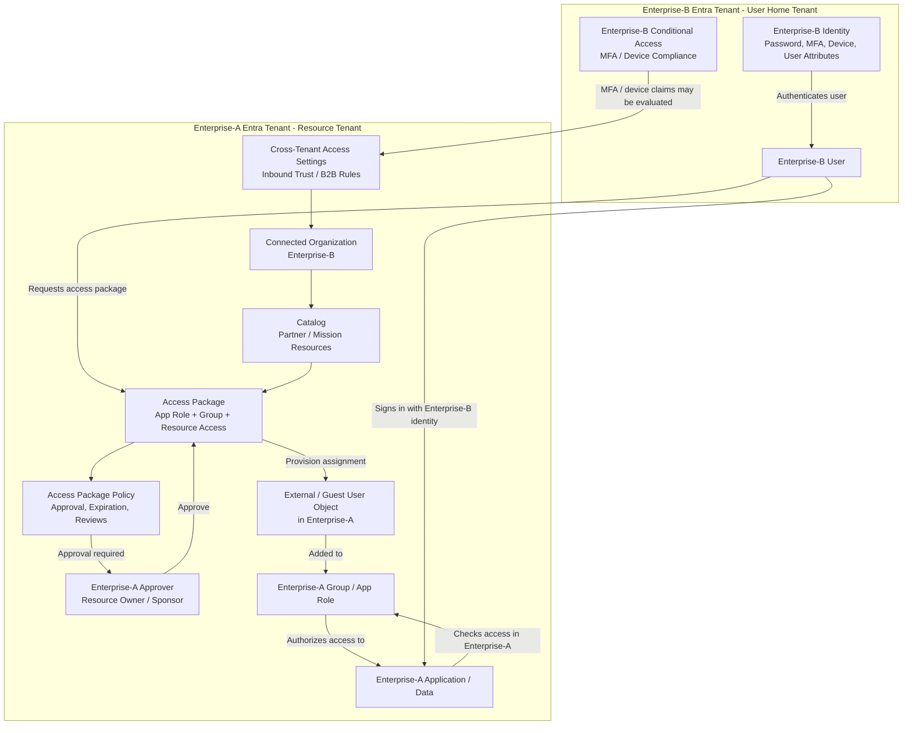

## 1. What is Microsoft Entra Governance?

**Microsoft Entra ID Governance** is used to control the **identity and access lifecycle**: who can request access, who approves it, what access is granted, when it expires, and how often it is reviewed. Microsoft describes entitlement management as a governance capability that automates access request workflows, assignments, reviews, and expiration. ([Microsoft Learn][1])

In simple terms:

> **Instead of manually adding users to groups/apps, you publish controlled “access packages” that users can request.**

---

## 2. Key Entra Governance Concepts

| Concept                    | Meaning                                                                                                                                           |
| -------------------------- | ------------------------------------------------------------------------------------------------------------------------------------------------- |
| **Catalog**                | Container for resources that can be governed. Example: “Mission App Catalog” or “Partner Access Catalog.”                                         |
| **Access Package**         | A bundle of access. Example: “App-A Read Only Access” may include an Entra group, application role, SharePoint site, or Teams group.              |
| **Policy**                 | Rules for who can request the package, approval requirements, MFA/terms, expiration, and reviews.                                                 |
| **Approver**               | Person or group that approves or denies access requests.                                                                                          |
| **Assignment**             | The actual granted access after approval.                                                                                                         |
| **Access Review**          | Periodic review to confirm the user still needs access.                                                                                           |
| **Expiration**             | Automatically removes access after a defined time unless renewed.                                                                                 |
| **Connected Organization** | External organization/tenant whose users are allowed to request access packages. Useful for partner or contractor tenants. ([Microsoft Learn][2]) |

---

## 3. What is an Access Package?

An **Access Package** is a pre-defined access bundle.

Example:

```text
Access Package: Enterprise-A Mission App User

Includes:
- Entra security group: App-A-Users
- Enterprise application role: App-A Reader
- SharePoint site access: Read
- Teams group membership: Mission Support Team

Policy:
- Users from Enterprise-B can request it
- Manager or resource owner approval required
- Access expires after 90 days
- Quarterly access review required
```

Microsoft documentation states that access packages can include resources such as **Groups and Teams, applications, SharePoint sites, Microsoft Entra roles, and API permissions**. ([Microsoft Learn][3])

---

## 4. High-Level Enterprise-A / Enterprise-B Scenario

Assume:

| Tenant                        | Role                                                                         |
| ----------------------------- | ---------------------------------------------------------------------------- |
| **Enterprise-A Entra tenant** | Resource tenant. Application, data, and access package live here.            |
| **Enterprise-B Entra tenant** | User home tenant. User identity, password, MFA, and device are managed here. |

Important point:

> The user remains a user of **Enterprise-B**, but gets a **guest / external identity representation** in **Enterprise-A** so Enterprise-A can authorize access to its resources.

Microsoft Entra B2B collaboration allows a workforce tenant to share applications and services with external guests while the resource organization keeps control over its corporate data. ([Microsoft Learn][4])

---

## 5. Cross-Tenant Access Settings

Before Enterprise-B users can smoothly access Enterprise-A resources, both tenants may configure **cross-tenant access settings**.

| Setting                        | Configured In | Purpose                                                                                                         |
| ------------------------------ | ------------- | --------------------------------------------------------------------------------------------------------------- |
| **Inbound access**             | Enterprise-A  | Controls which external users from Enterprise-B can access Enterprise-A resources.                              |
| **Outbound access**            | Enterprise-B  | Controls whether Enterprise-B users are allowed to access Enterprise-A resources.                               |
| **Trust settings**             | Enterprise-A  | Determines whether Enterprise-A trusts MFA, compliant device, or hybrid-joined device claims from Enterprise-B. |
| **B2B collaboration settings** | Enterprise-A  | Controls guest invite behavior and external user restrictions.                                                  |

Microsoft states that cross-tenant access settings control both **inbound access for external users into your resources** and **outbound access for your users to external organizations**. ([Microsoft Learn][5])

---

## 6. High-Level Workflow

### Step-by-Step Flow

1. **Enterprise-A creates the resource**

   * App, group, SharePoint site, Teams group, or app role exists in Enterprise-A.

2. **Enterprise-A creates a catalog**

   * Example: `Partner Mission Access Catalog`.

3. **Enterprise-A adds Enterprise-B as a connected organization**

   * This allows users from Enterprise-B to request access packages. ([Microsoft Learn][6])

4. **Enterprise-A creates an access package**

   * Example: `Mission App Reader`.
   * Package includes required groups, app roles, or application access.

5. **Enterprise-A defines the policy**

   * Who can request: Enterprise-B users.
   * Approval required: yes/no.
   * Expiration: 30, 90, 180 days, etc.
   * Access review: monthly, quarterly, annually.
   * Justification required: yes/no.

6. **Enterprise-B user requests access**

   * User signs in using Enterprise-B identity.
   * User requests the access package from Enterprise-A.

7. **Enterprise-A approver approves request**

   * Resource owner, sponsor, manager, or access package approver approves.

8. **Enterprise-A provisions access**

   * Guest/external user object is created or updated in Enterprise-A.
   * User is added to the right group/application role.

9. **User accesses Enterprise-A application**

   * Authentication happens against Enterprise-B.
   * Authorization happens in Enterprise-A.

10. **Lifecycle governance happens**

* Access expires automatically.
* Reviews are triggered.
* Access is removed if denied, expired, or no longer justified.

---

## 7. Mermaid Diagram — Enterprise-A / Enterprise-B Access Package Flow



---

## 8. Authentication vs Authorization

This is the key concept:

| Function                           | Tenant           |
| ---------------------------------- | ---------------- |
| User identity lives in             | **Enterprise-B** |
| User authenticates with            | **Enterprise-B** |
| MFA usually performed by           | **Enterprise-B** |
| Resource lives in                  | **Enterprise-A** |
| Access package lives in            | **Enterprise-A** |
| Application authorization decision | **Enterprise-A** |
| Group/app role assignment          | **Enterprise-A** |
| Access review/expiration           | **Enterprise-A** |

So yes, **Enterprise-A and Enterprise-B interact**, but not in the sense that Enterprise-A owns Enterprise-B’s users. Enterprise-A trusts Enterprise-B as the user’s home identity provider, then applies its own authorization and governance rules.

---

## 9. Important Caveat: Device Compliance Claims

Enterprise-A may choose to trust certain claims from Enterprise-B using cross-tenant access trust settings. This can include MFA and device-related trust, depending on configuration and supported scenarios. Cross-tenant access settings are the control plane for managing this inbound/outbound collaboration behavior. ([Microsoft Learn][7])

Practical meaning:

```text
Enterprise-B says:
"This user completed MFA and is using a compliant device."

Enterprise-A decides:
"Do I trust Enterprise-B's MFA/device claim, or do I require my own controls?"
```

For high-security environments, Enterprise-A should not blindly trust Enterprise-B. It should explicitly configure cross-tenant trust and Conditional Access policy.

---

## 10. Why Access Packages Are Useful

Access Packages solve a common operations problem:

### Without Access Packages

```text
User emails admin
Admin manually invites user
Admin manually adds user to group
Admin forgets to remove user later
No consistent approval
No expiration
No access review
```

### With Access Packages

```text
User requests approved package
Approver reviews request
Access is automatically assigned
Access expires automatically
Access is periodically reviewed
Audit trail is maintained
```

---

## 11. Recommended Pattern for Enterprise-A / Enterprise-B

For a controlled environment, use this pattern:

```text
Enterprise-A owns:
- Application
- Access package
- Approval workflow
- Access expiration
- Access reviews
- Authorization groups/app roles
- Conditional Access for resource access

Enterprise-B owns:
- User account
- Password/authentication
- MFA registration
- Device compliance
- User lifecycle in home tenant
```

Enterprise-A should create access packages per role, not per individual user.

Example:

| Access Package                 | Purpose                          |
| ------------------------------ | -------------------------------- |
| `Mission-App-Reader`           | Read-only users                  |
| `Mission-App-Contributor`      | Users who can update data        |
| `Mission-App-Admin`            | Privileged app admins            |
| `Mission-App-External-Support` | Time-bound vendor/support access |

---

## 12. Simple Summary

**Microsoft Entra Governance + Access Packages** lets Enterprise-A publish controlled access bundles to Enterprise-B users.

Enterprise-B users authenticate with their own tenant, but Enterprise-A controls:

```text
Who can request access
Who approves it
What access is granted
How long access lasts
How often access is reviewed
When access is removed
```

For Enterprise-A / Enterprise-B collaboration, the main building blocks are:

```text
Cross-Tenant Access Settings
+ Connected Organization
+ Catalog
+ Access Package
+ Approval Policy
+ Guest/External User
+ Group/App Role Assignment
+ Access Review and Expiration
```

[1]: https://learn.microsoft.com/en-us/entra/id-governance/entitlement-management-overview?utm_source=chatgpt.com "What is entitlement management?"
[2]: https://learn.microsoft.com/en-us/entra/id-governance/entitlement-management-organization?utm_source=chatgpt.com "Manage connected organizations in entitlement management"
[3]: https://learn.microsoft.com/en-us/entra/id-governance/entitlement-management-access-package-create?utm_source=chatgpt.com "Create an access package in entitlement management"
[4]: https://learn.microsoft.com/en-us/entra/external-id/what-is-b2b?utm_source=chatgpt.com "What is Microsoft Entra B2B collaboration?"
[5]: https://learn.microsoft.com/en-us/entra/external-id/cross-tenant-access-settings-b2b-collaboration?utm_source=chatgpt.com "Cross-tenant access settings - Microsoft Entra External ID"
[6]: https://learn.microsoft.com/en-us/entra/id-governance/entitlement-management-external-users?utm_source=chatgpt.com "Govern access for external users in entitlement management"
[7]: https://learn.microsoft.com/en-us/entra/external-id/cross-tenant-access-overview?utm_source=chatgpt.com "Cross-tenant access overview - Microsoft Entra External ID"
