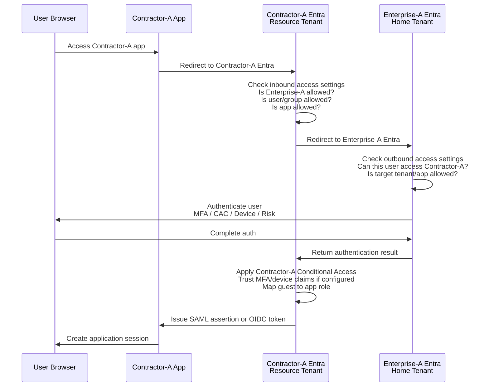

Below is the practical meaning of the settings under:

```text
Microsoft Entra admin center
  → Identity
  → External Identities
  → Cross-tenant access settings
```

Use this mental model:

```text
Inbound  = External users coming INTO my tenant/resources.
Outbound = My users going OUT to another tenant/resources.
Tenant restrictions = Controls use of external accounts from my network/devices.
```

For your example:

```text
Enterprise-A = user/home tenant
Contractor-A = resource/app tenant
```

---

# 1. Big picture

```text
Enterprise-A user wants to access Contractor-A app.

Enterprise-A Entra
  owns the real user identity.

Contractor-A Entra
  owns the application/resource.

Therefore:

Contractor-A must allow INBOUND access from Enterprise-A.
Enterprise-A must allow OUTBOUND access to Contractor-A.
```

ASCII:

```text
┌─────────────────────────────┐
│ Enterprise-A Tenant         │
│ User home tenant            │
│                             │
│ Outbound settings matter    │
└──────────────┬──────────────┘
               │
               │ User goes out to access Contractor-A
               ▼
┌─────────────────────────────┐
│ Contractor-A Tenant         │
│ Resource/app tenant         │
│                             │
│ Inbound settings matter     │
└──────────────┬──────────────┘
               │
               ▼
        Contractor-A App
```

Microsoft defines inbound settings as controlling whether users from external Microsoft Entra organizations can access resources in your organization, and outbound settings as controlling whether your users can access resources in an external organization. ([Microsoft Learn][1])

---

# 2. Default settings vs Organizational settings

Inside **Cross-tenant access settings**, you usually see:

```text
Default settings
Organizational settings
Microsoft cloud settings
Tenant restrictions
```

## Default settings

Default settings apply to **all external Entra tenants** unless you create a specific organization entry.

Example:

```text
Contractor-A default inbound:
Allow B2B collaboration from all external Entra tenants
```

That means any external Entra tenant may be allowed by default unless blocked elsewhere.

## Organizational settings

Organizational settings are partner-specific overrides.

Example:

```text
Contractor-A adds Enterprise-A tenant ID/domain.

For Enterprise-A only:
  Inbound access = allow selected users/groups/apps
  Trust MFA = yes/no
  Trust compliant device = yes/no
```

Microsoft notes that default cross-tenant settings apply to all external organizations except those with organization-specific settings, and partner-specific settings take precedence for that partner tenant. ([Microsoft Learn][2])

For a government/contractor design, you usually want **Organizational settings**, not only broad defaults.

---

# 3. Contractor-A Inbound Access Settings

This is the most important setting on the **Contractor-A** side.

```text
Contractor-A Tenant
  → External Identities
  → Cross-tenant access settings
  → Organizational settings
  → Add Enterprise-A
  → Inbound access settings
```

Meaning:

```text
Do I allow users from Enterprise-A to come into Contractor-A resources?
```

ASCII:

```text
Enterprise-A users
        │
        │ inbound into Contractor-A
        ▼
Contractor-A apps/resources
```

## Inbound B2B collaboration

This controls classic B2B guest access.

```text
Enterprise-A user becomes Guest in Contractor-A
and accesses Contractor-A apps/resources.
```

You can configure:

```text
Allow access
Block access
Allow only selected Enterprise-A users/groups
Allow access only to selected Contractor-A applications
```

Practical example:

```text
Contractor-A allows:
  Enterprise-A group: Dept-H-Cloud-App-Users

To access:
  App-1 SAML
  App-2 OIDC
  App-3 ALB/API Gateway app
```

This prevents every Enterprise-A user from automatically accessing Contractor-A resources.

---

## Inbound B2B direct connect

This is different from regular guest-user B2B collaboration.

B2B direct connect is mainly used for direct collaboration scenarios such as Teams shared channels, where users may not be represented the same way as traditional guest collaboration.

For your AWS app pattern, you usually care more about:

```text
B2B collaboration
```

than:

```text
B2B direct connect
```

Microsoft states that by default, B2B collaboration with other Entra organizations is enabled, while B2B direct connect is blocked by default. ([Microsoft Learn][1])

---

# 4. Contractor-A Inbound Trust Settings

This is where many Zero Trust decisions happen.

Under Contractor-A inbound settings for Enterprise-A, you may see trust options such as:

```text
Trust multifactor authentication from Enterprise-A
Trust compliant devices from Enterprise-A
Trust Microsoft Entra hybrid joined devices from Enterprise-A
```

Microsoft documents that inbound trust settings can trust MFA and device claims from external Microsoft Entra organizations. ([Microsoft Learn][3])

## Trust MFA

Meaning:

```text
If Enterprise-A already performed MFA,
Contractor-A accepts that MFA claim.
```

Flow:

```text
User → Enterprise-A Entra
        MFA completed
        │
        ▼
Contractor-A Entra
        "I trust Enterprise-A MFA"
        │
        ▼
No second MFA prompt from Contractor-A
```

### When to enable

Enable this when:

```text
Enterprise-A has strong MFA/CAC/PIV/passwordless policy
You have formal agreement with Enterprise-A
You want to avoid double MFA prompts
```

### When not to enable

Do not enable blindly if:

```text
You do not trust Enterprise-A MFA strength
Enterprise-A allows weak MFA
Enterprise-A does not enforce MFA consistently
You require Contractor-A-owned authentication assurance
```

---

## Trust compliant devices

Meaning:

```text
Enterprise-A says the user’s device is compliant.
Contractor-A accepts that device-compliance claim.
```

This matters if Contractor-A Conditional Access says:

```text
Require compliant device
```

Without trust, Contractor-A may not be able to satisfy that requirement for Enterprise-A-managed devices.

### Practical note

If Enterprise-A owns the laptops and Intune/device management, Contractor-A usually cannot directly evaluate device compliance. Contractor-A must either:

```text
Trust Enterprise-A device claim
```

or use another control, such as:

```text
ZTNA
VDI
managed access path
network-based restriction
application gateway control
```

---

## Trust hybrid joined devices

Meaning:

```text
Enterprise-A says this device is Microsoft Entra hybrid joined.
Contractor-A accepts that claim.
```

This is useful in older enterprise models where devices are AD-domain joined and synchronized into Entra.

---

# 5. Enterprise-A Outbound Access Settings

Now flip direction.

On **Enterprise-A**:

```text
Enterprise-A Tenant
  → External Identities
  → Cross-tenant access settings
  → Organizational settings
  → Add Contractor-A
  → Outbound access settings
```

Meaning:

```text
Do I allow my Enterprise-A users to leave my tenant and access Contractor-A resources?
```

ASCII:

```text
Enterprise-A users
        │
        │ outbound from Enterprise-A
        ▼
Contractor-A tenant/apps
```

## Outbound B2B collaboration

This controls whether Enterprise-A users can authenticate to Contractor-A as B2B guests.

Enterprise-A can say:

```text
Allow my users to access Contractor-A
Block my users from accessing Contractor-A
Allow only selected Enterprise-A users/groups
Allow only selected external apps in Contractor-A
```

Example:

```text
Enterprise-A allows:
  Dept-H users

To access:
  Contractor-A tenant/application resources

But blocks:
  all other departments
```

This is the home-tenant control.

---

# 6. Both sides must align

For the access to work cleanly:

```text
Enterprise-A outbound to Contractor-A = Allow
Contractor-A inbound from Enterprise-A = Allow
```

If either side blocks, access fails.

```text
┌──────────────────────────────┐
│ Enterprise-A Outbound        │
│ Allow users to Contractor-A? │
└─────────────┬────────────────┘
              │ yes
              ▼
┌──────────────────────────────┐
│ Contractor-A Inbound         │
│ Allow Enterprise-A users?    │
└─────────────┬────────────────┘
              │ yes
              ▼
        Access can proceed
```

Failure examples:

| Enterprise-A outbound | Contractor-A inbound | Result                                    |
| --------------------- | -------------------- | ----------------------------------------- |
| Allow                 | Allow                | Works, subject to app assignment/CA       |
| Block                 | Allow                | Enterprise-A prevents user from going out |
| Allow                 | Block                | Contractor-A rejects external user        |
| Block                 | Block                | Fails both ways                           |

---

# 7. Where guest invitation fits

Cross-tenant access settings are not the same thing as guest invitation settings.

There are two related control planes:

```text
Cross-tenant access settings
  Controls whether cross-tenant authentication/access is allowed.

External collaboration settings
  Controls who can invite guests and which domains are allowed/blocked.
```

Microsoft explains that cross-tenant access settings control whether users can authenticate with external Entra tenants, while external collaboration settings control who can send B2B invitations and domain-level invitation restrictions. ([Microsoft Learn][4])

So if Contractor-A says:

```text
Inbound from Enterprise-A = Allow
```

but external collaboration settings block invitations to `enterprise-a.gov`, invitation may still fail.

Most restrictive setting wins.

---

# 8. Tenant Restrictions

Tenant restrictions are commonly misunderstood.

They are **not the same** as inbound/outbound B2B access.

Microsoft states that tenant restrictions are configured alongside cross-tenant access settings, but operate separately; inbound/outbound B2B settings do not affect tenant restriction settings, and tenant restrictions control scenarios where users are using an external account. ([Microsoft Learn][5])

## Simple explanation

Tenant restrictions answer this question:

```text
When users are on my corporate network/device,
which external Microsoft Entra tenants are they allowed to sign into?
```

This is more about **data exfiltration control** and **shadow tenant access**.

---

## Example tenant restriction scenario

Enterprise-A user is on an Enterprise-A managed laptop and network.

They try to sign into:

```text
personaluser@randomtenant.onmicrosoft.com
```

or:

```text
user@unapproved-saas-tenant.com
```

Tenant restrictions can block that, even if the external service itself would allow login.

ASCII:

```text
Enterprise-A managed device/network
        │
        │ User tries to sign into external tenant
        ▼
Microsoft Entra login endpoint
        │
        │ Tenant restrictions policy applied
        ▼
Allowed tenant? yes/no
```

---

# 9. Tenant Restrictions vs Outbound Access

This is the difference:

## Outbound access settings

```text
Can my Enterprise-A users use their Enterprise-A identity
to access Contractor-A resources?
```

Example:

```text
user@enterprise-a.gov → Contractor-A app
```

## Tenant restrictions

```text
Can someone on my Enterprise-A network/device use some external identity
to access an external tenant?
```

Example:

```text
someone@contractor-a.com → Contractor-A tenant
from Enterprise-A network/device
```

So:

```text
Outbound = my users, my identity, external resources.
Tenant restrictions = external identities/tenants from my controlled environment.
```

---

# 10. Recommended configuration for your scenario

Assume:

```text
Enterprise-A users need access to Contractor-A AWS-hosted apps.
Contractor-A Entra is broker/resource tenant.
Apps are SAML, OIDC, and legacy behind ALB/API Gateway.
```

## Contractor-A tenant settings

```text
Contractor-A
  → Cross-tenant access settings
  → Organizational settings
  → Add Enterprise-A tenant
```

Recommended inbound:

```text
Inbound B2B collaboration:
  Allow access

Scope:
  Only selected Enterprise-A users/groups if possible

Applications:
  Only selected Contractor-A enterprise apps

Trust settings:
  Trust MFA from Enterprise-A: Yes, if Enterprise-A MFA/CAC/PIV is acceptable
  Trust compliant device: Yes only if there is formal agreement and known device posture
  Trust hybrid joined device: Only if needed
```

For tighter control:

```text
Do not allow all Enterprise-A users.
Allow specific Enterprise-A groups mapped to Contractor-A app roles.
```

---

## Enterprise-A tenant settings

```text
Enterprise-A
  → Cross-tenant access settings
  → Organizational settings
  → Add Contractor-A tenant
```

Recommended outbound:

```text
Outbound B2B collaboration:
  Allow access

Scope:
  Only Dept-H or approved project users

External applications:
  Only approved Contractor-A apps if manageable

Outbound B2B direct connect:
  Usually block unless needed for Teams/shared channel style collaboration
```

---

## Tenant restrictions

For Enterprise-A:

```text
Use tenant restrictions if Enterprise-A wants to stop users
from signing into unapproved external tenants from Enterprise-A devices/network.
```

Example allowlist:

```text
Allowed external tenants:
  Contractor-A tenant
  Microsoft tenant required services
  Other approved mission partner tenants
```

Block everything else.

---

# 11. Practical policy matrix

| Control                         | Configured in        | Direction                                       | Purpose                                                      |
| ------------------------------- | -------------------- | ----------------------------------------------- | ------------------------------------------------------------ |
| Inbound access                  | Contractor-A         | Enterprise-A → Contractor-A                     | Allows Enterprise-A guests into Contractor-A resources       |
| Outbound access                 | Enterprise-A         | Enterprise-A → Contractor-A                     | Allows Enterprise-A users to leave to Contractor-A resources |
| Trust MFA                       | Contractor-A inbound | Enterprise-A → Contractor-A                     | Accept Enterprise-A MFA claim                                |
| Trust compliant device          | Contractor-A inbound | Enterprise-A → Contractor-A                     | Accept Enterprise-A device compliance                        |
| App assignment                  | Contractor-A         | Local to Contractor-A                           | Controls which apps guest can use                            |
| External collaboration settings | Contractor-A         | Invitation governance                           | Controls who can invite and which domains are allowed        |
| Tenant restrictions             | Usually Enterprise-A | External account usage from managed environment | Prevents sign-in to unapproved external tenants              |

---

# 12. The flow with settings applied

```text
1. Enterprise-A user opens Contractor-A app.

2. App redirects to Contractor-A Entra.

3. Contractor-A Entra sees user is external.

4. Contractor-A checks:
   Inbound access from Enterprise-A allowed?
   User/group allowed?
   App allowed?

5. Contractor-A redirects browser to Enterprise-A Entra.

6. Enterprise-A checks:
   Outbound access to Contractor-A allowed?
   User/group allowed?
   App/resource allowed?

7. Enterprise-A authenticates user.

8. Contractor-A receives authentication result.

9. Contractor-A checks:
   Trust Enterprise-A MFA?
   Trust Enterprise-A device claim?
   Contractor-A Conditional Access satisfied?
   User assigned to app?

10. Contractor-A issues SAML/OIDC token to app.

11. App grants access.
```

---

# 13. Mermaid diagram



---

# 14. Simple way to remember

```text
Contractor-A inbound:
  Who can come into my house?

Enterprise-A outbound:
  Where can my people go?

Tenant restrictions:
  While on my network/device, which outside tenants/accounts can be used?
```

For your architecture, the clean baseline is:

```text
Enterprise-A outbound allows only approved users to Contractor-A.
Contractor-A inbound allows only approved Enterprise-A users/groups to approved apps.
Contractor-A trusts Enterprise-A MFA only if Enterprise-A authentication strength is acceptable.
Contractor-A trusts device claims only if Enterprise-A device posture governance is formally trusted.
Tenant restrictions are used mainly by Enterprise-A to prevent users from accessing unapproved external tenants from Enterprise-A controlled environments.
```

[1]: https://learn.microsoft.com/en-us/entra/external-id/cross-tenant-access-overview?utm_source=chatgpt.com "Cross-tenant access overview - Microsoft Entra External ID"
[2]: https://learn.microsoft.com/en-us/entra/external-id/cross-tenant-access-settings-b2b-collaboration?utm_source=chatgpt.com "Cross-tenant access settings - Microsoft Entra External ID"
[3]: https://learn.microsoft.com/en-us/entra/external-id/authentication-conditional-access?utm_source=chatgpt.com "Authentication and Conditional Access for External ID"
[4]: https://learn.microsoft.com/en-us/entra/external-id/what-is-b2b?utm_source=chatgpt.com "What is Microsoft Entra B2B collaboration?"
[5]: https://learn.microsoft.com/en-us/entra/external-id/tenant-restrictions-v2?utm_source=chatgpt.com "Set up tenant restrictions v2 - Microsoft Entra ID"
