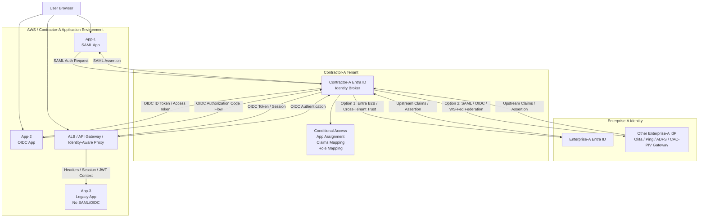
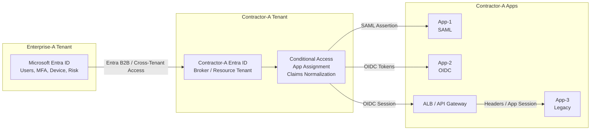
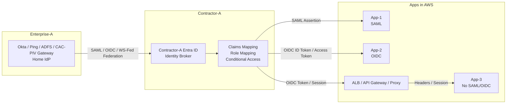
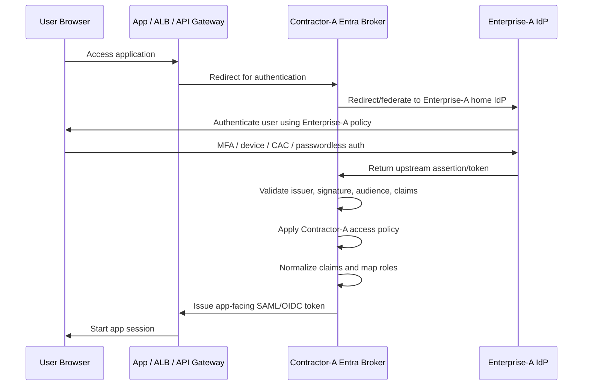

# Broker Federation Model Design Pattern

Core idea:

```text
Enterprise-A owns the user identity.
Contractor-A Entra acts as broker / relying party / policy point.
Apps trust Contractor-A Entra or the AWS front door, not Enterprise-A directly.
```

---

# 1. Big Picture ASCII Diagram

```text
                              ENTERPRISE-A
                    ┌──────────────────────────┐
                    │ Home Identity Provider   │
                    │                          │
                    │ Option 1: Entra ID       │
                    │ Option 2: Okta/Ping/ADFS │
                    │ Option 3: CAC/PIV IdP    │
                    └─────────────┬────────────┘
                                  │
                                  │ Upstream federation
                                  │ SAML / OIDC / WS-Fed / Entra B2B
                                  ▼
                        CONTRACTOR-A / TENANT-Y
                    ┌──────────────────────────┐
                    │ Contractor-A Entra ID    │
                    │ Identity Broker          │
                    │                          │
                    │ - Trust Enterprise-A     │
                    │ - Normalize claims       │
                    │ - Apply Conditional      │
                    │   Access                 │
                    │ - Map groups/roles       │
                    │ - Issue token/assertion  │
                    └─────────────┬────────────┘
                                  │
              ┌───────────────────┼────────────────────┐
              │                   │                    │
              ▼                   ▼                    ▼

        ┌─────────────┐    ┌─────────────┐      ┌──────────────────────┐
        │ App-1       │    │ App-2       │      │ App-3 Legacy App     │
        │ SAML App    │    │ OIDC App    │      │ No SAML / No OIDC    │
        └──────┬──────┘    └──────┬──────┘      └──────────┬───────────┘
               │                  │                        │
               │                  │                        │
               │                  │              ┌─────────▼─────────┐
               │                  │              │ ALB / API Gateway │
               │                  │              │ Auth front door   │
               │                  │              └─────────┬─────────┘
               │                  │                        │
               ▼                  ▼                        ▼
        SAML Assertion       OIDC ID Token /          Header / session /
                             Access Token             app-specific auth
```

---

# 2. Entra-to-Entra Federation ASCII

This is the Microsoft-native path.

```text
┌────────────────────────────────────────────────────────────┐
│ Enterprise-A Tenant                                        │
│ Microsoft Entra ID                                         │
│                                                            │
│ - User identities                                          │
│ - MFA                                                      │
│ - Device compliance                                        │
│ - Risk policies                                            │
│ - Groups                                                   │
└───────────────────────┬────────────────────────────────────┘
                        │
                        │ Entra B2B / Cross-Tenant Access
                        │ External user collaboration
                        ▼
┌────────────────────────────────────────────────────────────┐
│ Contractor-A Tenant                                        │
│ Microsoft Entra ID / Identity Broker                       │
│                                                            │
│ - Accepts Enterprise-A users                               │
│ - Applies Contractor-A Conditional Access                  │
│ - Maps user to app roles                                   │
│ - Issues app-facing SAML/OIDC tokens                       │
└───────────────────────┬────────────────────────────────────┘
                        │
        ┌───────────────┼────────────────┐
        │               │                │
        ▼               ▼                ▼
   App-1 SAML      App-2 OIDC       App-3 behind
                                     ALB/API Gateway
```

---

# 3. Another IdP-to-Entra Federation ASCII

This is the more portable model if Enterprise-A later moves away from Entra.

```text
┌────────────────────────────────────────────────────────────┐
│ Enterprise-A Home IdP                                      │
│ Could be:                                                  │
│                                                            │
│ - Okta                                                     │
│ - PingFederate                                             │
│ - ADFS                                                     │
│ - ForgeRock                                                │
│ - CAC/PIV federation gateway                               │
│ - Other SAML/OIDC IdP                                      │
└───────────────────────┬────────────────────────────────────┘
                        │
                        │ SAML / OIDC / WS-Fed federation
                        │ Enterprise-A authenticates user
                        ▼
┌────────────────────────────────────────────────────────────┐
│ Contractor-A Entra ID                                      │
│ Identity Broker                                            │
│                                                            │
│ - Trusts external IdP metadata                             │
│ - Validates issuer/signature                               │
│ - Maps upstream claims                                     │
│ - Applies Contractor-A access policy                       │
│ - Issues normalized token to apps                          │
└───────────────────────┬────────────────────────────────────┘
                        │
        ┌───────────────┼────────────────┐
        │               │                │
        ▼               ▼                ▼
   App-1 SAML      App-2 OIDC       App-3 behind
                                     ALB/API Gateway
```

---

# 4. App Integration ASCII

## App-1: SAML Application

```text
User Browser
    │
    ▼
App-1
SAML Service Provider
    │
    │ Redirect user to Contractor-A Entra
    ▼
Contractor-A Entra
SAML IdP for App-1
    │
    │ May redirect upstream to Enterprise-A IdP
    ▼
Enterprise-A IdP
Home authentication
    │
    │ User authenticates with Enterprise-A
    ▼
Contractor-A Entra
Broker validates upstream login
    │
    │ Issues SAML assertion
    ▼
App-1
Consumes SAML assertion
```

App-1 sees Contractor-A Entra as the IdP. It should not need to know whether the user originally came from Enterprise-A Entra, Okta, Ping, or ADFS.

---

## App-2: OIDC Application

```text
User Browser
    │
    ▼
App-2
OIDC Relying Party / Client
    │
    │ Authorization Code flow
    ▼
Contractor-A Entra
OIDC Provider for App-2
    │
    │ May federate upstream
    ▼
Enterprise-A IdP
Home authentication
    │
    ▼
Contractor-A Entra
Broker validates upstream login
    │
    │ Issues OIDC tokens
    ▼
App-2
Receives ID token / access token
```

App-2 trusts Contractor-A Entra as the OIDC issuer.

---

## App-3: Legacy App with No SAML/OIDC

```text
User Browser
    │
    ▼
AWS ALB / API Gateway / Identity-Aware Proxy
    │
    │ OIDC authentication with Contractor-A Entra
    ▼
Contractor-A Entra
OIDC Provider
    │
    │ May federate upstream to Enterprise-A
    ▼
Enterprise-A IdP
Home authentication
    │
    ▼
Contractor-A Entra
Issues token to ALB/API Gateway/proxy
    │
    ▼
ALB / API Gateway / Proxy
Validates authenticated session
    │
    │ Optionally forwards identity to app
    │ X-User: user@enterprise-a.gov
    │ X-Groups: Dept-H-App-Users
    │ X-Assurance-Level: phishing-resistant
    ▼
Legacy App
No native federation support
```

For App-3, the identity-aware front door becomes the security control point.

---

# 5. Mermaid — Full Brokered Federation



---

# 6. Mermaid — Entra-to-Entra Pattern



---

# 7. Mermaid — Other IdP-to-Entra Pattern



---

# 8. Mermaid — App-Specific Token Flow



---

# 9. What Token Should Include from Enterprise-A?

Important distinction:

```text
Enterprise-A does not usually issue the final app token directly to the app.

Enterprise-A issues an upstream assertion/token to Contractor-A Entra.

Contractor-A Entra then issues the final app-facing SAML assertion or OIDC token.
```

So think in two token layers.

---

## Layer 1 — Upstream Enterprise-A Token / Assertion

This is what Enterprise-A should send to Contractor-A.

```text
Enterprise-A IdP  --->  Contractor-A Entra Broker
```

Recommended upstream claims:

| Claim                          | Purpose                                                           |
| ------------------------------ | ----------------------------------------------------------------- |
| Stable user ID                 | Permanent identifier for the user, not just display name          |
| Email / UPN                    | Human-readable login identifier                                   |
| Name                           | Display name                                                      |
| Given name / surname           | Optional user profile fields                                      |
| Tenant / organization ID       | Proves which enterprise the user came from                        |
| Department / organization unit | Useful for coarse authorization                                   |
| Group or entitlement claim     | Used for app assignment or role mapping                           |
| MFA performed                  | Indicates whether MFA occurred upstream                           |
| Authentication method          | Password, phishing-resistant, CAC/PIV, FIDO2, etc.                |
| Authentication time            | Shows when user authenticated                                     |
| Assurance level                | Helps determine confidence in the login                           |
| Device compliance claim        | Only if Contractor-A chooses to trust Enterprise-A device posture |
| User status / affiliation      | Employee, contractor, mission partner, guest, etc.                |

---

## Layer 2 — Contractor-A App-Facing Token

This is what the application should receive.

```text
Contractor-A Entra Broker  --->  App-1 / App-2 / ALB / API Gateway
```

Recommended app-facing claims:

| Claim                | Why it matters                                                |
| -------------------- | ------------------------------------------------------------- |
| `iss`                | Issuer should be Contractor-A Entra, not random upstream IdPs |
| `aud`                | Audience should match the specific app                        |
| `sub`                | Stable app-facing subject ID                                  |
| `email`              | User email                                                    |
| `name`               | Display name                                                  |
| `preferred_username` | Login-friendly username                                       |
| `enterprise_origin`  | Example: Enterprise-A                                         |
| `home_idp`           | Example: Entra, Okta, Ping, ADFS                              |
| `groups` or `roles`  | Application authorization                                     |
| `app_role`           | Preferred over raw group sprawl                               |
| `auth_time`          | When authentication happened                                  |
| `amr`                | Authentication method reference                               |
| `acr`                | Authentication context / assurance level                      |
| `mfa`                | Whether MFA was performed                                     |
| `device_trust`       | Only if trusted and needed                                    |
| `session_id`         | Useful for audit/correlation                                  |
| `jti`                | Token ID for replay/audit tracking                            |

---

# 10. Best-Practice Claim Model

Do **not** let every app consume raw Enterprise-A groups.

Bad:

```text
App receives 200 raw Enterprise-A groups:
- Enterprise-A-All-Users
- Dept-H-Users
- VPN-Users
- HR-Portal-Users
- SomeLegacyGroup123
```

Better:

```text
Contractor-A Broker maps upstream groups to app roles:

Enterprise-A group: Dept-H-Cloud-App-Users
        ↓
Contractor-A app role: App1.Reader

Enterprise-A group: Dept-H-Cloud-App-Admins
        ↓
Contractor-A app role: App1.Admin
```

Then the app sees clean authorization claims:

```json
{
  "enterprise_origin": "Enterprise-A",
  "email": "user@enterprise-a.gov",
  "roles": [
    "App1.Reader"
  ],
  "acr": "phishing-resistant",
  "mfa": true
}
```

---

# 11. App-1 SAML Claim Example

For SAML app:

```xml
<saml:Attribute Name="email">
  <saml:AttributeValue>user@enterprise-a.gov</saml:AttributeValue>
</saml:Attribute>

<saml:Attribute Name="enterprise_origin">
  <saml:AttributeValue>Enterprise-A</saml:AttributeValue>
</saml:Attribute>

<saml:Attribute Name="role">
  <saml:AttributeValue>App1.Reader</saml:AttributeValue>
</saml:Attribute>

<saml:Attribute Name="assurance_level">
  <saml:AttributeValue>phishing-resistant</saml:AttributeValue>
</saml:Attribute>
```

---

# 12. App-2 OIDC Claim Example

For OIDC app:

```json
{
  "iss": "https://login.microsoftonline.com/contractor-a-tenant/v2.0",
  "aud": "app-2-client-id",
  "sub": "stable-user-id-for-this-app",
  "email": "user@enterprise-a.gov",
  "name": "Jane Doe",
  "enterprise_origin": "Enterprise-A",
  "home_idp": "Enterprise-A-Entra",
  "roles": [
    "App2.User"
  ],
  "amr": [
    "mfa",
    "wia"
  ],
  "acr": "phishing-resistant",
  "auth_time": 1710000000
}
```

---

# 13. App-3 Legacy Header Example

For legacy app behind ALB/API Gateway/proxy:

```http
X-Authenticated-User: user@enterprise-a.gov
X-Display-Name: Jane Doe
X-Enterprise-Origin: Enterprise-A
X-App-Role: App3.Reader
X-Assurance-Level: phishing-resistant
X-MFA-Performed: true
```

But be careful: legacy apps must **not trust headers from the public internet**. The app should only accept those headers from the trusted ALB/API Gateway/proxy path.

---

# 14. Most Important Design Rule

```text
Do not make every app understand Enterprise-A’s identity system.

Make every app trust Contractor-A’s identity broker.

Let the broker handle:
- Entra-to-Entra
- Okta-to-Entra
- Ping-to-Entra
- ADFS-to-Entra
- CAC/PIV gateway-to-Entra
- SAML-to-OIDC translation
- OIDC-to-SAML translation
- Group-to-role mapping
```

That is what makes the design survive an Enterprise-A IdP change.
