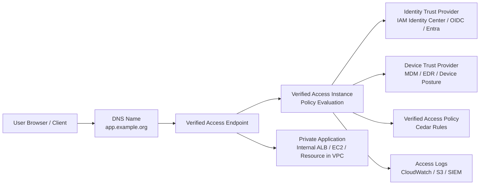
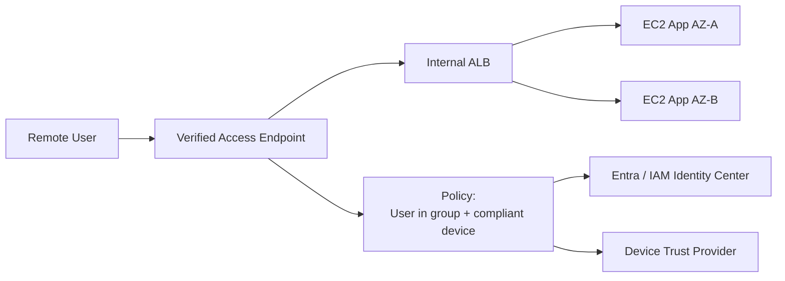

## What AWS Verified Access is

**AWS Verified Access** is AWS’s managed **Zero Trust Network Access / ZTNA** service for giving users access to private applications and resources **without putting them directly on the network through a traditional VPN**.

Instead of saying:

```text
User is on VPN, so allow access
```

Verified Access says:

```text
Who is the user?
What group/role does the user belong to?
Is the device trusted/compliant?
What application/resource is being accessed?
Does the policy allow this request?
```

AWS describes Verified Access as granting access only when the user meets defined security requirements, using trust data from configured trust providers; requests are denied by default until a policy allows them. ([AWS Documentation][1])

---

# 1. Problem Verified Access solves

Traditional VPN model:

```text
User -> VPN -> internal network -> many private apps/resources
```

Problem:

```text
Once user is on VPN, they may have broad network reachability.
Access control is often network-based.
Device posture may not be checked per application request.
Segmentation becomes hard.
```

Verified Access model:

```text
User -> Verified Access -> only approved private app/resource
```

Better Zero Trust posture:

```text
No broad network access
Per-application policy
Identity-aware access
Device posture-aware access
Request logging
Default deny
```

---

# 2. Main AWS Verified Access components

## Component 1 — Verified Access Instance

This is the top-level Verified Access container.

Think of it as:

```text
The policy evaluation and access-control boundary for Verified Access.
```

AWS defines a Verified Access instance as a resource that organizes trust providers and groups, evaluates application requests, and grants access only when security requirements are met. ([AWS Documentation][2])

Example:

```text
Verified Access Instance:
  va-prod-cloud broker-east
```

It connects to:

```text
Trust providers
Verified Access groups
Verified Access endpoints
Policies
Logging
```

---

## Component 2 — Trust Provider

A **trust provider** supplies identity and/or device trust information.

AWS defines a trust provider as a third party that creates, maintains, and manages identity information for users and devices. Verified Access evaluates that trust information before allowing or denying access. ([AWS Documentation][3])

There are two major categories:

### A. Identity trust provider

This answers:

```text
Who is the user?
What groups does the user belong to?
What claims are in the identity token?
```

Examples:

```text
IAM Identity Center
OIDC identity provider
SAML/OIDC-backed enterprise IdP such as Entra ID, Okta, Ping, etc.
```

### B. Device trust provider

This answers:

```text
Is the device managed?
Is the endpoint healthy?
Is EDR running?
Is disk encrypted?
Is the device compliant?
```

Examples may include device posture integrations such as EDR/MDM providers, depending on what is supported and approved in the environment.

---

## Component 3 — Verified Access Group

A **Verified Access group** is a grouping construct for applications/resources with siorgar access requirements.

Think of it as:

```text
A policy grouping for related applications.
```

Example groups:

```text
Admin tools group
Developer applications group
Mission application group
Database access group
Production support group
```

A group can have a policy that applies to every endpoint in that group.

Example:

```text
Only allow users from the Production-Support group
AND only from compliant managed devices.
```

AWS’s getting-started flow includes creating a trust provider, an instance, a group, and then an endpoint. ([AWS Documentation][4])

---

## Component 4 — Verified Access Endpoint

A **Verified Access endpoint** represents the actual private application or resource being protected.

This is the thing users are trying to reach.

Examples:

```text
Private web application behind internal ALB
Private app running on EC2
Internal service
RDS database
SSH/RDP resource
Git repository
SAP or other TCP-based resource
```

Originally Verified Access was mostly discussed around HTTP/HTTPS private apps. AWS has since expanded Verified Access to support non-HTTP resources such as TCP, SSH, RDP, databases, SAP, and Git repositories. ([Amazon Web Services, Inc.][5])

---

## Component 5 — Access Policy

Verified Access policies define who can access what.

Policies are written in **Cedar**, AWS’s policy language. AWS states that Verified Access policies use Cedar and evaluate trust data from identity or device trust providers. ([AWS Documentation][6])

Policy can evaluate things like:

```text
User identity
User group
Email domain
Device posture
Device risk
Application endpoint
Request context
```

Example concept:

```text
Permit access only when:
  user is in "Cloud-Admins"
  AND device is compliant
  AND user authenticated with approved IdP
```

Simplified policy idea:

```text
permit(principal, action, resource)
when {
  context.identity.groups.contains("Cloud-Admins") &&
  context.device.compliance == "compliant"
};
```

---

## Component 6 — DNS name / application URL

Users do not usually access the private ALB or private IP directly.

They access a URL such as:

```text
https://adminapp.example.org
```

DNS points the application name to the Verified Access endpoint domain.

Flow:

```text
User enters URL
  -> DNS resolves to Verified Access endpoint
  -> Verified Access authenticates/evaluates user/device
  -> If allowed, request is forwarded to private app
```

---

## Component 7 — Logging

Verified Access logs access attempts for audit and security monitoring. AWS states that Verified Access logs every access attempt to help with incident response and audit requests. ([AWS Documentation][1])

Logs are important for:

```text
Who accessed what
When access occurred
Which policy allowed or denied
Which identity/device context was used
Troubleshooting denied requests
Security monitoring/SIEM integration
```

---

# 3. High-level architecture



---

# 4. Request flow step-by-step

## Step 1 — User opens private app URL

```text
https://app.example.org
```

The app is not exposed directly to the internet.

The DNS name points to the Verified Access endpoint.

---

## Step 2 — Verified Access challenges/authenticates the user

Verified Access redirects or integrates with the configured identity trust provider.

Example:

```text
User -> Verified Access -> Entra ID / IAM Identity Center / OIDC IdP
```

The user authenticates using enterprise controls:

```text
Passwordless / CAC / MFA / Conditional Access
Group membership
Identity claims
```

---

## Step 3 — Verified Access collects trust context

Verified Access evaluates trust data from configured providers.

Example context:

```text
User = viral.patel@example.org
Groups = Cloud-Admins, App-Support
Device = managed
Device posture = compliant
Location/risk = acceptable
```

---

## Step 4 — Verified Access evaluates the policy

Policy says whether the request is allowed.

Example decision:

```text
User is in App-Support
AND device is compliant
AND resource is app-prod
=> Allow
```

or:

```text
User is valid
BUT device is unmanaged
=> Deny
```

---

## Step 5 — If allowed, request is forwarded to private resource

The user does **not** get broad VPC access.

They only reach the configured endpoint/resource.

```text
User
  -> Verified Access endpoint
  -> private application/resource
```

---

# 5. Example: private web app behind internal ALB



Traffic flow:

```text
User browser
  -> Verified Access public endpoint
  -> identity/device policy check
  -> internal ALB
  -> private EC2 application
```

Security group intent:

```text
Internal ALB allows traffic from Verified Access
EC2 allows traffic from internal ALB
No direct public access to EC2
No VPN required
```

---

# 6. Example: admin access to SSH/RDP without VPN

With non-HTTP support, the pattern can be:

```text
Admin user
  -> Verified Access
  -> policy check
  -> private EC2 SSH/RDP resource
```

This can reduce the need to expose:

```text
22/tcp
3389/tcp
VPN access to whole subnet
Bastion host with broad reach
```

However, for cloud broker/restricted environments, you must verify service approval and whether non-HTTP Verified Access is authorized in the target region/accreditation boundary.

---

# 7. How Verified Access differs from VPN

| Area                 | Traditional VPN                     | AWS Verified Access                  |
| -------------------- | ----------------------------------- | ------------------------------------ |
| Access model         | Network-level access                | Application/resource-level access    |
| User reach           | Often broad subnet/VPC reachability | Only specific protected app/resource |
| Policy basis         | User/network/ACL                    | Identity + device posture + policy   |
| Zero Trust alignment | Weaker if broad access              | Stronger per-app access              |
| User experience      | Connect VPN first                   | Access app URL directly              |
| Enforcement          | VPN gateway/firewall                | Verified Access endpoint/policy      |
| Logging              | VPN session logs                    | Per-access/application logs          |

---

# 8. How Verified Access fits with cloud broker

In cloud broker, Verified Access can be positioned as a **private application access layer**, not a replacement for cloud broker boundary inspection.

## Possible cloud broker use case

```text
Remote admin or mission user needs access to private application in AWS.
Do not want full VPN into the workload VPC.
Want identity/device-based access.
```

Flow:

```text
User
  -> Verified Access
  -> Identity/device check
  -> Private application endpoint
  -> Workload VPC
```

But in a restricted environment, you must confirm:

```text
Is Verified Access available in the required AWS partition/region?
Is the service approved for the classification/impact level?
Can public Verified Access endpoints be used?
Can the required identity/device provider integrate?
Does traffic still need to traverse cloud broker ingress/inspection?
How are logs exported to the required SIEM?
Does it support CAC/CBA requirements through the IdP?
```

---

# 9. Verified Access versus ALB OIDC

This is important because you have used ALB OIDC patterns before.

| Feature          | ALB OIDC                                    | Verified Access                                         |
| ---------------- | ------------------------------------------- | ------------------------------------------------------- |
| Primary purpose  | Authenticate users before forwarding to app | Zero Trust access to private apps/resources             |
| Identity support | OIDC                                        | Identity + device trust providers                       |
| Device posture   | Not native in ALB                           | Core design concept                                     |
| Policy           | Listener rules + OIDC config                | Cedar policy with identity/device context               |
| Access model     | Web app behind ALB                          | App/resource-level access, including non-HTTP use cases |
| VPN replacement  | Not really                                  | Yes, for supported apps/resources                       |
| Best use         | Public/private web app authentication       | ZTNA access to private corporate apps/resources         |

Simple view:

```text
ALB OIDC answers:
  Did the user authenticate?

Verified Access answers:
  Should this user, from this device, under this context, access this specific app/resource?
```

---

# 10. Verified Access versus Cisco ISE

| Area                 | Cisco ISE                   | AWS Verified Access                    |
| -------------------- | --------------------------- | -------------------------------------- |
| Main role            | Network Access Control      | Zero Trust app/resource access         |
| Original enforcement | Switch/WLC/VPN/firewall     | Verified Access endpoint               |
| Checks               | User/device/posture/network | User/device/posture/request            |
| Access granted to    | Network segment/VLAN/ACL    | Specific app/resource                  |
| Best for             | Campus/VPN/C2C              | Private AWS-hosted app/resource access |
| Cloud workload fit   | Indirect                    | Native AWS service                     |

They are complementary:

```text
Cisco ISE:
  Is this device/user allowed onto the enterprise network?

AWS Verified Access:
  Is this user/device allowed to access this specific AWS private app/resource?
```

---

# 11. Basic build sequence

A typical implementation flow:

```text
1. Choose identity provider
   IAM Identity Center, OIDC provider, Entra ID, etc.

2. Choose device trust provider
   MDM/EDR/posture source if required.

3. Create Verified Access trust provider
   Identity and/or device trust.

4. Create Verified Access instance
   Attach trust providers.

5. Create Verified Access group
   Group apps/resources with siorgar access policy.

6. Create Verified Access endpoint
   Point it to private app/resource.

7. Write access policy
   Cedar-based allow/deny logic.

8. Configure DNS
   App URL points to Verified Access endpoint.

9. Configure security groups
   Private app allows only expected Verified Access path.

10. Enable logging
   Send logs to CloudWatch/S3/SIEM.

11. Test allow/deny scenarios
   Valid user + compliant device
   Valid user + noncompliant device
   Unauthorized group
   Expired session
```

---

# 12. Where Verified Access is a good fit

Good fit:

```text
Private web applications
Admin portals
Developer tools
Internal dashboards
SSH/RDP access use cases
Database/resource access where supported
Reducing VPN dependency
Per-application Zero Trust access
```

Not always a good fit:

```text
High-throughput machine-to-machine traffic
Complex east-west service mesh use cases
Applications requiring legacy network-level VPN behavior
Workloads where the service is not approved/available
Apps that cannot tolerate proxy-style access
Use cases requiring full subnet access
```

For service-to-service Zero Trust inside AWS, **VPC Lattice, IAM, mTLS/service mesh, security groups, and Network Firewall** may be more appropriate.

---

## Bottom line

AWS Verified Access is best understood as:

```text
A managed AWS Zero Trust access gateway for private applications/resources.
```

Its core components are:

```text
Verified Access Instance
Trust Providers
Verified Access Groups
Verified Access Endpoints
Cedar Access Policies
DNS/Application URL
Logging
```

The key value is:

```text
Users do not get broad VPN/network access.
Each request is evaluated using identity, device posture, and policy.
Only the specific approved private app/resource is reachable.
```

For cloud broker, I would position it as a **possible private-application access control layer** that may complement cloud broker, ALB OIDC, mTLS, and centralized inspection — but it must be validated against the restricted environment’s service availability, approval boundary, logging, identity, and ingress requirements.

[1]: https://docs.aws.amazon.com/verified-access/latest/ug/how-it-works.html?utm_source=chatgpt.com "How Verified Access works"
[2]: https://docs.aws.amazon.com/verified-access/latest/ug/verified-access-instances.html?utm_source=chatgpt.com "Verified Access instances"
[3]: https://docs.aws.amazon.com/cli/latest/reference/ec2/create-verified-access-trust-provider.html?utm_source=chatgpt.com "create-verified-access-trust-provider"
[4]: https://docs.aws.amazon.com/verified-access/latest/ug/getting-started.html?utm_source=chatgpt.com "Tutorial: Get started with Verified Access - AWS Documentation"
[5]: https://aws.amazon.com/blogs/networking-and-content-delivery/aws-verified-access-support-for-non-http-resources-is-now-generally-available/?utm_source=chatgpt.com "AWS Verified Access support for non-HTTP resources is ..."
[6]: https://docs.aws.amazon.com/verified-access/latest/ug/auth-policies.html?utm_source=chatgpt.com "Verified Access policies"
