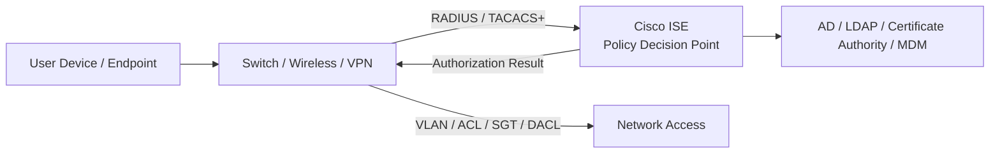
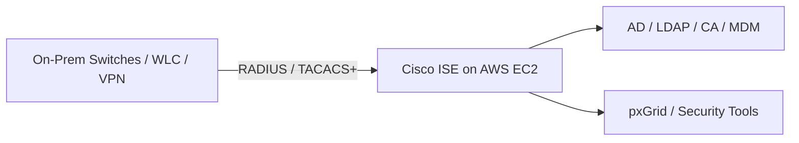
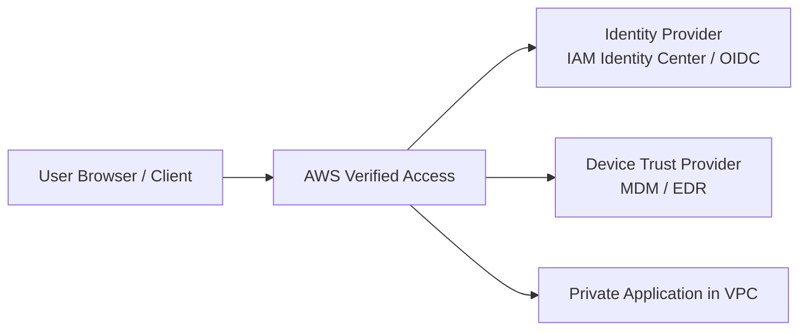
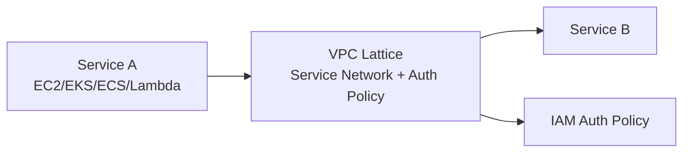

## 1. Cisco ISE evolution in simple terms

### Original role: NAC for campus network

Cisco ISE started mainly as a **Network Access Control** platform.

Its job was:

```text
Who/what is connecting to the network?
Is this device allowed?
What VLAN/ACL/security group should it receive?
Is the device compliant?
Should it be allowed, restricted, or quarantined?
```

Classic enforcement points were:

```text
Switches
Wireless LAN controllers
VPN concentrators
Firewalls
802.1X-capable network devices
```

Typical flow:

```text
User laptop connects to switch port
  -> Switch asks ISE using RADIUS
  -> ISE checks identity/device/posture
  -> ISE returns allow/deny/VLAN/ACL/SGT
  -> Switch enforces the decision
```

Cisco describes ISE as a complete NAC solution used for authentication, authorization, posture, profiling, client provisioning, and policy administration. ([Cisco][1])

---

## 2. How ISE fits Zero Trust

Zero Trust says:

```text
Do not trust just because the device is on the network.
Continuously verify user, device, posture, location, and context.
Apply least-privilege access.
```

ISE supports this mainly for **network access Zero Trust**.

It can evaluate:

```text
User identity
Device identity
Certificate
MAC address
Device type
Posture/compliance
Location
Connection method
Group membership
Threat/context data from integrations
```

Then it can push policy to enforcement points.



In Zero Trust language:

| Zero Trust Function      | Cisco ISE Role                       |
| ------------------------ | ------------------------------------ |
| Policy decision point    | ISE decides access                   |
| Policy enforcement point | Switch, WLC, VPN, firewall           |
| Device identity          | Certificate, MAC, profiling          |
| User identity            | AD/LDAP/SAML/MFA integrations        |
| Device posture           | ISE posture/MDM integrations         |
| Segmentation             | VLAN, downloadable ACL, TrustSec SGT |
| Context exchange         | pxGrid integrations                  |

Cisco pxGrid allows ISE to share context with other security platforms using REST/WebSocket-style integrations. ([Cisco][2])

---

# 3. How Cisco ISE works with physical endpoints

For physical endpoints, ISE works very well because the enforcement point is usually a real network device.

Example:

```text
Laptop -> Access Switch -> ISE -> Policy Result
```

ISE can say:

```text
Corporate managed laptop + compliant = production VLAN
Unknown device = guest VLAN
Non-compliant laptop = remediation VLAN
Printer = printer VLAN
Admin user = privileged network ACL
Contractor = limited access
```

This works because the switch port or wireless controller can enforce the decision.

---

# 4. Why VMs are different

A VM is not usually plugging into a physical switch port directly.

A VM connects to a **virtual switch** or cloud virtual network layer.

Example VMware:

```text
VM
  -> vNIC
  -> vSwitch / Distributed Switch
  -> ESXi host uplink
  -> physical switch
```

The physical switch sees the ESXi host uplink, not always the individual VM the same way it sees a laptop.

That creates a problem for traditional ISE/802.1X:

```text
802.1X was designed for endpoint-to-access-port authentication.
A VM behind a hypervisor does not always have a normal physical access port.
```

So ISE can be used with virtualized environments, but the enforcement model is different.

---

## 5. Cisco ISE with VMware / VM environments

There are a few possible models.

### Model A — ISE controls the hypervisor host access

This is closer to traditional NAC.

```text
ESXi host connects to physical switch
  -> Switch authenticates host using ISE
  -> ISE authorizes the host port
```

This validates the **host**, not every VM individually.

Good for:

```text
Allowing trusted ESXi hosts onto the network
Ensuring only approved hypervisors connect
Assigning host network access policy
```

Limitation:

```text
It does not provide per-VM Zero Trust policy by itself.
```

---

### Model B — ISE uses profiling / MAC visibility

ISE may learn VM MAC addresses from RADIUS accounting, DHCP, SNMP, NetFlow, or integrations.

It can identify:

```text
This MAC looks like a server
This MAC belongs to a VM
This device is in this subnet
This device is using this switch/uplink
```

But profiling is not the same as strong workload identity.

Limitation:

```text
MAC/IP identity is weak for cloud-style workloads.
VMs are dynamic.
IPs change.
MACs can change.
Autoscaling breaks static identity models.
```

---

### Model C — ISE integrates with security fabric

ISE can share identity and security group tags using TrustSec/SGT and pxGrid.

```text
ISE
  -> publishes identity/context
  -> firewalls/security tools consume context
  -> enforcement occurs on firewall/segmentation device
```

This is better than pure VLANs, but still depends on compatible enforcement points.

Cisco’s pxGrid documentation describes it as a security product integration framework for bidirectional partner integrations. ([Cisco][2])

---

## 6. Can Cisco ISE be used with AWS cloud workloads?

Yes, but with an important distinction:

> **Cisco ISE can run in AWS and support hybrid NAC services, but AWS VPC networking does not behave like a campus switch with 802.1X ports.**

Cisco documents that ISE is supported on AWS, Azure, and OCI, and Cisco also provides guidance for deploying ISE on AWS using AMIs/CloudFormation. ([Cisco][3])

So there are two meanings:

## Meaning 1 — Run ISE in AWS

You can deploy Cisco ISE as an EC2-based virtual appliance in AWS.

Use cases:

```text
Central ISE node for hybrid enterprise
RADIUS/TACACS+ services for network devices
Policy services for VPN, SD-WAN, or remote access
pxGrid integration point
Administrative AAA for network appliances
```

Example:



This is valid.

---

## Meaning 2 — Use ISE to control AWS EC2 workload-to-workload access

This is where the answer becomes limited.

AWS EC2 instances do not connect through a campus switch port that performs 802.1X against ISE.

An EC2 instance connects through:

```text
Elastic Network Interface
Security Group
NACL
VPC route table
AWS managed hypervisor/network fabric
```

There is no normal customer-controlled access switch port where ISE can push:

```text
VLAN assignment
Downloadable ACL
802.1X authorization result
```

So ISE is **not the natural cloud-native policy engine** for EC2-to-EC2 or workload-to-workload access.

---

# 7. Cisco ISE vs AWS workload access control

For AWS workloads, the native policy/enforcement model is different.

| Requirement                | Cisco ISE Style              | AWS Cloud-Native Style                                                                         |
| -------------------------- | ---------------------------- | ---------------------------------------------------------------------------------------------- |
| Device connects to network | 802.1X / RADIUS              | Not applicable to EC2 ENI                                                                      |
| Assign VLAN                | Switch/WLC decision          | Subnet/VPC design                                                                              |
| Assign ACL                 | dACL / switch ACL / firewall | Security Groups, NACLs, Network Firewall                                                       |
| User-to-app access         | VPN/WLC/firewall integration | Verified Access, ALB OIDC, IAM Identity Center                                                 |
| Service-to-service access  | SGT/TrustSec/firewall        | Security Groups, VPC Lattice, IAM, mTLS                                                        |
| Workload identity          | Often IP/MAC/device profile  | IAM role, instance profile, service account, cert/SPIFFE-like identity                         |
| Posture                    | Endpoint posture/MDM         | Device posture via IdP/MDM for user access; workload posture via Config/Security Hub/Inspector |

---

# 8. AWS cloud-native equivalents

AWS does not have one single product that equals Cisco ISE.

Instead, AWS uses multiple services depending on the access use case.

## A. User-to-private-application Zero Trust

Closest AWS-native equivalent:

```text
AWS Verified Access
```

Verified Access provides secure access to private applications without a VPN and evaluates each application request against security requirements. ([AWS Documentation][4])

Use case:

```text
User wants to access private web app or private resource
AWS checks identity and device posture/context
Access is allowed or denied per application
```

Flow:



This is much closer to modern ZTNA than campus NAC.

AWS has also expanded Verified Access beyond only HTTP(S) use cases; AWS states that Verified Access supports secure access to HTTP(S) and non-HTTP(S) applications such as SSH and RDP resources. ([Amazon Web Services, Inc.][5])

---

## B. Service-to-service access inside AWS

Closest AWS-native equivalent:

```text
Amazon VPC Lattice
```

VPC Lattice provides application networking across services and VPCs, with policies for traffic management, access, and monitoring. ([Amazon Web Services, Inc.][6])

Use case:

```text
Service A should call Service B only if authorized.
Do not rely only on network location.
Use service-level policy.
```

Flow:



This is closer to Zero Trust for workload-to-workload communication.

---

## C. Network segmentation and inspection

AWS-native controls:

```text
Security Groups
NACLs
AWS Network Firewall
Gateway Load Balancer appliances
Transit Gateway route tables
VPC endpoints / endpoint policies
Route 53 Resolver DNS Firewall
```

These are closer to the network enforcement side of ISE/TrustSec, but they are not user/device NAC.

---

## D. Identity and authorization

AWS-native controls:

```text
IAM
IAM Identity Center
IAM roles
Resource policies
SCPs
ABAC using tags
AWS Verified Permissions
```

For Zero Trust, AWS emphasizes that access should not be based solely on network location. ([Amazon Web Services, Inc.][7])

---

# 9. Simple comparison: Cisco ISE vs AWS-native Zero Trust

```text
Cisco ISE:
  Best for user/device access to enterprise networks.

AWS-native:
  Best for identity-aware access to cloud apps, services, APIs, and workloads.
```

| Area                     | Best Fit                                 |
| ------------------------ | ---------------------------------------- |
| Campus laptop access     | Cisco ISE                                |
| Wi-Fi authentication     | Cisco ISE                                |
| Switch port NAC          | Cisco ISE                                |
| VPN user authorization   | Cisco ISE or ZTNA                        |
| Network device admin AAA | Cisco ISE TACACS+                        |
| EC2-to-EC2 security      | AWS Security Groups / NFW / VPC Lattice  |
| User-to-private AWS app  | AWS Verified Access / ALB OIDC           |
| API authorization        | API Gateway / IAM / Verified Permissions |
| Service-to-service auth  | VPC Lattice / IAM / mTLS / service mesh  |
| AWS governance           | IAM / SCP / Config / Security Hub        |

---

# 10. How this maps to aws cloud / restricted AWS environment

In an aws cloud environment, I would not position Cisco ISE as the primary control for AWS workload segmentation.

Better positioning:

## Cisco ISE is useful for:

```text
User/device access to the enterprise network
Comply-to-Connect / device posture
VPN/remote-access authorization
TACACS+ for network appliance administration
Hybrid identity/device context
pxGrid sharing with firewalls/SIEM/security tools
```

## AWS-native controls are better for:

```text
VPC workload segmentation
Spoke-to-spoke routing control
Security group policy
Network Firewall inspection
Private application access
Service-to-service authorization
IAM-based workload identity
Centralized logging and governance
```

In your aws cloud architecture, the practical model would be:

```mermaid
flowchart TB
    UserDevice[User Device] --> ISE[Cisco ISE<br/>Device/User/Posture Decision]
    ISE --> NetworkAccess[Enterprise Network / VPN / SD-WAN Access]

    NetworkAccess --> aws cloud[aws cloud Ingress / Inspection Boundary]

    aws cloud --> AWSControls[AWS Native Controls<br/>TGW / NFW / SG / Verified Access / IAM / VPC Lattice]
    AWSControls --> Workload[AWS Workload VPC / EC2 / EKS / Apps]
```

So ISE helps answer:

```text
Is this user/device allowed onto the enterprise access path?
```

AWS controls answer:

```text
Is this identity/service/request allowed to access this AWS application/workload?
```

Both can support Zero Trust, but at different layers.

---

# 11. Important limitation

Cisco ISE does **not** magically bring 802.1X to AWS EC2 instances.

For AWS EC2 workloads, the enforcement point is not a Cisco switch port. The enforcement points are AWS constructs:

```text
Security Group
NACL
Route table
TGW route table
AWS Network Firewall
ALB/WAF
Verified Access
VPC Lattice
IAM/resource policy
```

So if someone says:

```text
Can we use Cisco ISE for AWS workload Zero Trust?
```

The accurate answer is:

```text
Partially, for hybrid user/device context and maybe administrative access.
But not as the primary EC2 workload NAC enforcement tool.
AWS-native controls are required for cloud workload segmentation and application access.
```

---

# 12. Practical recommendation

For a restricted aws cloud/AWS environment, I would design it like this:

## Layer 1 — User/device trust before reaching AWS

Use Cisco ISE / C2C / enterprise NAC for:

```text
Device identity
User identity
Posture
Network admission
VPN/SD-WAN access
Enterprise segmentation before aws cloud
```

## Layer 2 — aws cloud boundary enforcement

Use:

```text
aws cloud Ingress VPC
ALB/WAF
AWS Network Firewall or approved appliance
Transit Gateway route tables
Central egress
Central logging
```

## Layer 3 — AWS workload Zero Trust

Use:

```text
IAM roles
Security groups
VPC Lattice if service-to-service model is approved
AWS Verified Access if service is approved/available
ALB OIDC/mTLS where appropriate
Network Firewall
VPC endpoint policies
AWS Config / Security Hub / GuardDuty / Inspector
```

---

## Bottom line

Cisco ISE is excellent for **enterprise network Zero Trust / NAC**:

```text
Who is the user?
What is the device?
Is it compliant?
Should it be allowed onto this network segment?
```

AWS-native services are better for **cloud workload Zero Trust**:

```text
Who is the IAM principal?
What application is being accessed?
What service is calling what service?
What security group/path/policy allows it?
Is this request authorized at the app/service level?
```

So the answer is not “ISE or AWS.” The better architecture is:

```text
Cisco ISE for user/device/network admission
+
AWS-native controls for workload/app/service authorization and segmentation
```

In aws cloud terms:

```text
ISE helps before or at the enterprise access edge.
aws cloud controls the cloud boundary.
AWS-native controls protect the workloads inside the cloud.
```

[1]: https://www.cisco.com/c/en/us/products/security/identity-services-engine/ise-ds.html?utm_source=chatgpt.com "Cisco Identity Services Engine Data Sheet"
[2]: https://www.cisco.com/c/en/us/td/docs/security/ise/3-3/admin_guide/b_ise_admin_3_3/b_ISE_admin_33_pxgrid.html?utm_source=chatgpt.com "Cisco pxGrid [Cisco Identity Services Engine 3.3]"
[3]: https://www.cisco.com/c/en/us/products/collateral/security/identity-services-engine/ise-licensing-guide-og.html?utm_source=chatgpt.com "Cisco ISE Licensing Guide"
[4]: https://docs.aws.amazon.com/verified-access/latest/ug/what-is-verified-access.html?utm_source=chatgpt.com "AWS Verified Access"
[5]: https://aws.amazon.com/blogs/aws/aws-verified-access-now-supports-secure-access-to-resources-over-non-https-protocols/?utm_source=chatgpt.com "AWS Verified Access now supports secure access to ..."
[6]: https://aws.amazon.com/vpc/lattice/?utm_source=chatgpt.com "Simplified Application Networking – Amazon VPC Lattice"
[7]: https://aws.amazon.com/security/zero-trust/?utm_source=chatgpt.com "Zero trust on AWS | Security, Identity, and Compliance"
