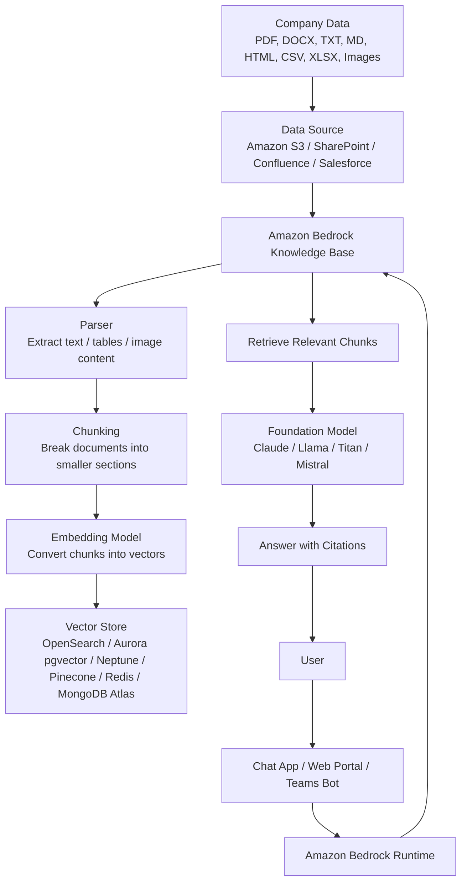
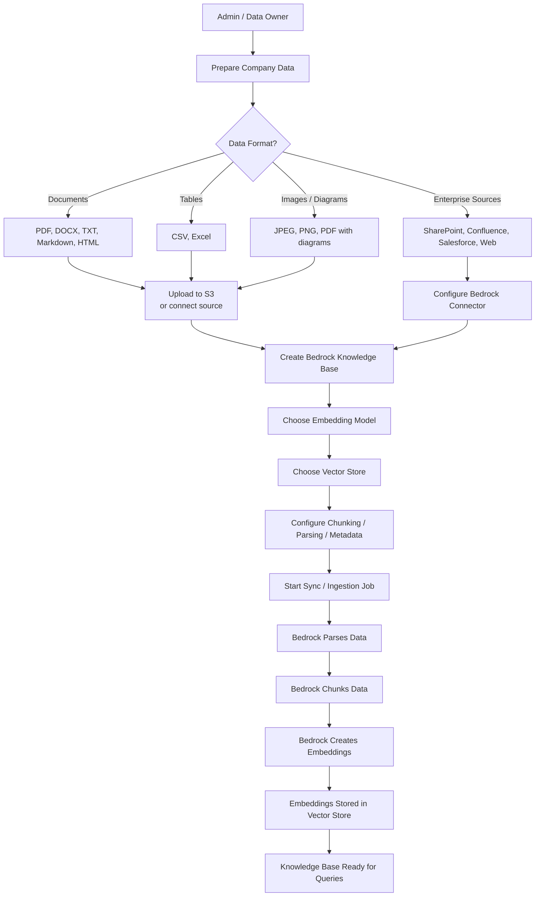
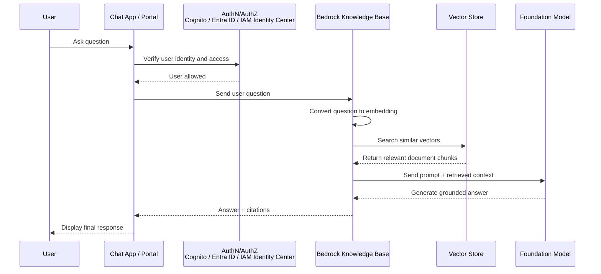
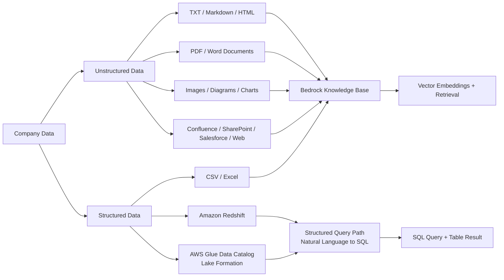
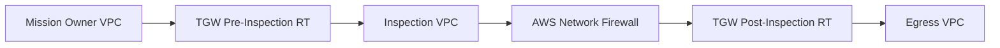
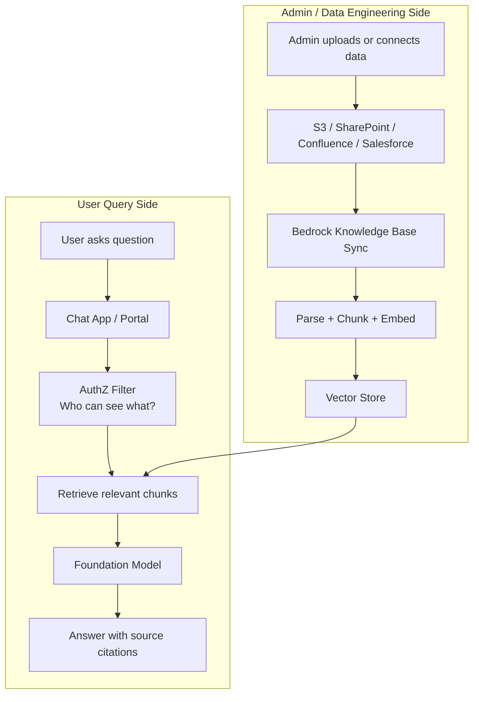
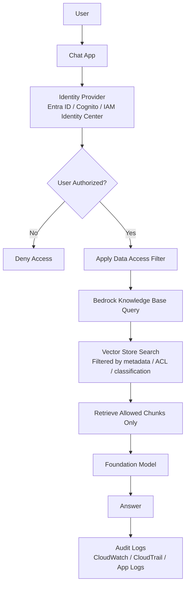
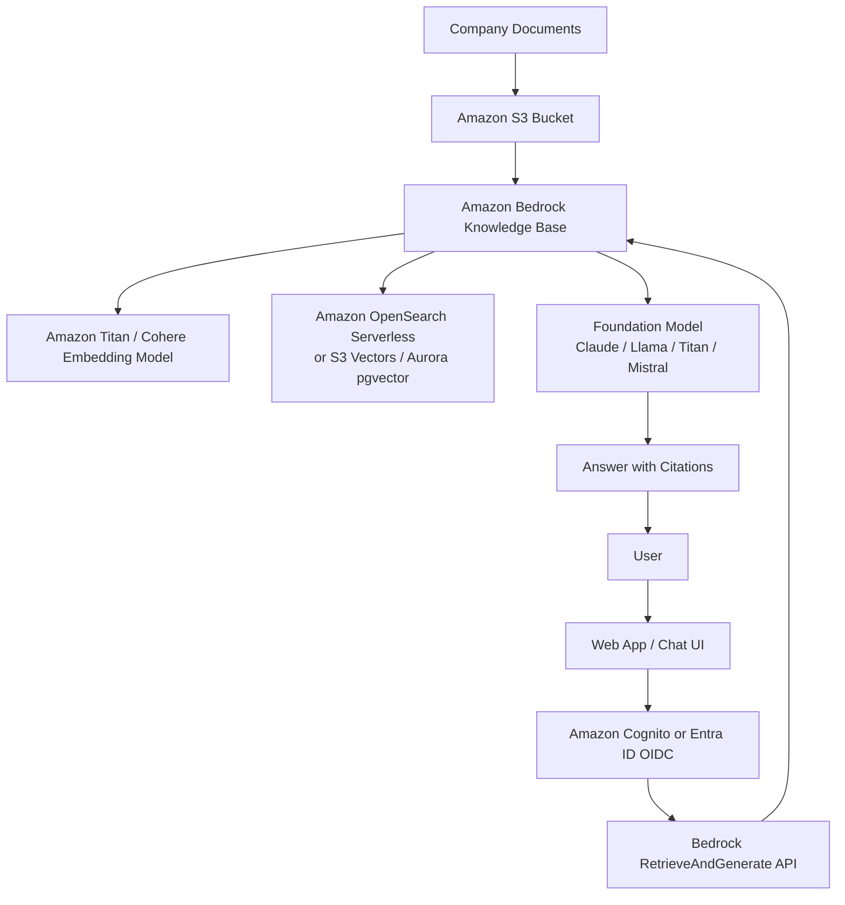

Below is a **high-level AWS Bedrock RAG architecture** showing how you can use **company data** with Amazon Bedrock.


---

# 1. Simple Bedrock RAG Architecture



In simple terms:

```text
Company documents go into the Knowledge Base.
Knowledge Base converts documents into searchable vectors.
User asks a question.
Bedrock retrieves the right chunks.
Foundation Model writes the answer.
```

---

# 2. Admin / Data Owner Interaction Flow

This is what the **admin or data owner** does.



AWS describes this ingestion process as: parse the data, split documents into chunks, convert chunks into vector embeddings using an embedding model, and write those embeddings into a vector index in the selected vector store. ([AWS Documentation][2])

---

# 3. End User Interaction Flow

This is what happens when a normal user asks a question.



The important part is that the model is answering from **retrieved company context**, not just from general internet-trained knowledge. AWS describes RAG in Bedrock Knowledge Bases as a way to use retrieved information from data sources to generate more accurate responses and include citations to original sources. ([AWS Documentation][3])

---

# 4. Data Format View

This diagram shows what kind of company data can go into the system.



For unstructured data, Bedrock Knowledge Bases converts the raw data into embeddings and stores them in a vector store. For structured data, AWS documentation says Bedrock Knowledge Bases can connect through a query engine, convert natural language into SQL, and retrieve relevant table data. ([AWS Documentation][2])

---

# 5. Recommended Company Data Format

For best results, I would organize company data like this:

```text
Best:
- Markdown .md
- TXT
- DOCX
- PDF with selectable text
- HTML documentation
- CSV / Excel for tabular reference data

Good but needs care:
- PDF with diagrams
- PNG/JPEG architecture diagrams
- PowerPoint exported to PDF
- Scanned PDFs

Avoid as primary source:
- Screenshot-only documents
- Unlabeled diagrams
- Large PDFs with no headings
- Random file dumps with no metadata
```

Best practical format for architecture documents:

```text
Architecture.md
  - Executive summary
  - Component table
  - ASCII flow
  - Mermaid diagram
  - Traffic flow steps
  - Security assumptions
  - Known limitations
```

Example:

````markdown
# SCCA Egress Architecture

## Summary
Mission Owner VPCs send outbound traffic through TGW to the Inspection VPC before reaching the Egress VPC.

## Flow

```text
Mission Owner VPC
  -> TGW Pre-Inspection Route Table
  -> Inspection VPC
  -> AWS Network Firewall
  -> TGW Post-Inspection Route Table
  -> Egress VPC
```

## Mermaid



## Component Table

| Component | Purpose |
|---|---|
| Mission Owner VPC | Application workloads |
| TGW Pre-Inspection RT | Sends traffic to inspection |
| AWS Network Firewall | Stateful inspection |
| Egress VPC | Central outbound path |
````

This is better than only uploading a diagram image because the RAG system can retrieve exact words like **TGW Pre-Inspection Route Table**, **Inspection VPC**, and **AWS Network Firewall**.

---

# 6. Admin vs User High-Level Architecture



The **admin side** keeps the knowledge base current.
The **user side** retrieves relevant content and generates answers.

AWS says that after adding, modifying, or removing files from a data source, you sync the data source so Bedrock re-indexes the knowledge base; the sync is incremental and processes added, modified, or deleted documents since the last sync. ([AWS Documentation][4])

---

# 7. Security View

For company data, this part matters a lot.



Important design point:

> Do not let every user search every company document.

Use metadata and authorization boundaries such as:

```text
department = cloud-security
classification = internal
mission_owner = MO-A
environment = govcloud
document_owner = platform-team
```

Then filter retrieval based on the user’s access.

---

# 8. Simplest AWS-Native Design

For your first design, this is the easiest path:



Use this if you want a managed AWS-native RAG implementation without building your own parser, chunker, embedding pipeline, and retriever.

---

# 9. What you actually feed into Bedrock

You feed Bedrock a **data source**, not raw training data.

```text
You provide:
- S3 bucket or connector
- Supported files
- Optional metadata files
- Embedding model choice
- Vector store choice
- Sync schedule or manual sync

Bedrock handles:
- Parsing
- Chunking
- Embedding
- Indexing
- Retrieval
```

A good first version would be:

```text
Amazon S3 bucket:
s3://company-ai-knowledge-base/

Folders:
  /architecture/
  /runbooks/
  /policies/
  /terraform/
  /networking/
  /identity/
  /security/
  /diagrams/

File types:
  .md
  .txt
  .docx
  .pdf
  .csv
  .xlsx
  .png
```

For architecture and security documents, **Markdown plus Mermaid plus ASCII flow** is the most reliable format. PDF and images are useful, but I would not make image-only documents your primary knowledge source.

[1]: https://docs.aws.amazon.com/bedrock/latest/userguide/knowledge-base-ds.html "Prerequisites for your Amazon Bedrock knowledge base data - Amazon Bedrock"
[2]: https://docs.aws.amazon.com/bedrock/latest/userguide/kb-how-data.html "Turning data into a knowledge base - Amazon Bedrock"
[3]: https://docs.aws.amazon.com/bedrock/latest/userguide/knowledge-base.html?utm_source=chatgpt.com "Retrieve data and generate AI responses with ..."
[4]: https://docs.aws.amazon.com/bedrock/latest/userguide/kb-data-source-sync-ingest.html "Sync your data with your Amazon Bedrock knowledge base - Amazon Bedrock"
