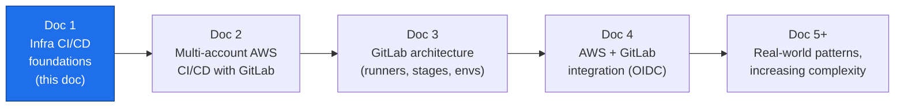
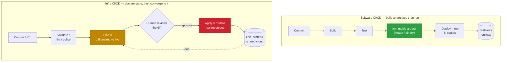
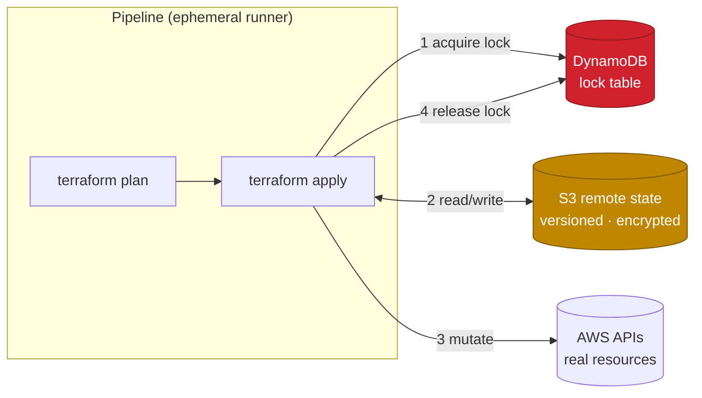
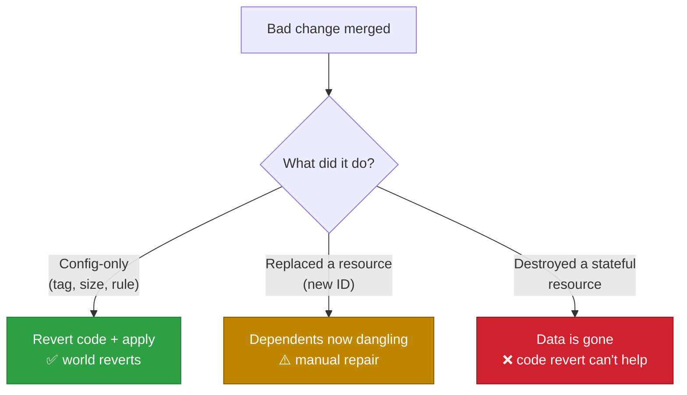
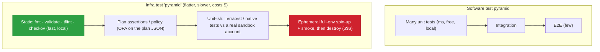

# CI/CD for AWS Infrastructure Provisioning

**Series:** DevOps Architecture — CI/CD on AWS with GitLab
**Document 1 of N — Foundations**
**Audience:** Platform / DevOps engineers, cloud architects
**Status:** Draft

---

## 0. Where this document sits

This is the first document in a series. Its only job is to establish a precise mental model of what CI/CD *means* when the artifact you are shipping is **infrastructure**, not application code — and why that changes almost every assumption you carry over from app CI/CD.

Everything later in the series builds on the vocabulary and the failure modes described here.

---

## 1. What CI/CD actually is (stripped to essentials)

CI/CD is a discipline, not a tool. Two ideas:

- **Continuous Integration (CI):** every change is merged into a shared mainline frequently, and each change is *automatically validated* — built, linted, tested — so integration problems surface in minutes, not at a big-bang merge.
- **Continuous Delivery / Deployment (CD):** every validated change is automatically promoted through environments toward production. *Delivery* stops at a manual approval gate; *Deployment* removes even that gate.

The pipeline is just the automation that carries a change from a commit to a running system, applying quality gates along the way. What differs — dramatically — is **what the pipeline produces and what "deploy" does to the world.**

---

## 2. The core distinction: mutable artifacts vs. desired-state convergence

In **software CI/CD** the pipeline produces an **immutable artifact** (a container image, a JAR, a binary, a Lambda zip). "Deploy" means: take this artifact and run copies of it. The artifact is self-contained and stateless; if a deploy goes wrong you roll forward or roll back by pointing at a different artifact version.

In **infrastructure CI/CD** the pipeline does not produce a runnable artifact. It produces a **declaration of desired state** (Terraform/OpenTofu HCL, CloudFormation, CDK-synthesized templates, Pulumi programs). "Deploy" means: **compare desired state against the actual live cloud, compute a diff, and mutate real, stateful, shared resources to converge them.**

This single difference is the source of every other difference below.

---

## 3. The anatomy of an infrastructure pipeline

An IaC pipeline (Terraform-flavored, but the shape generalizes) has a characteristic set of stages. Note the **plan / approval / apply** split — it has no clean analogue in app CI/CD.

```mermaid
flowchart LR
    A[Commit / MR] --> B["fmt + validate<br/>(syntax, style)"]
    B --> C["Static security<br/>tflint · checkov ·<br/>tfsec · trivy"]
    C --> D["Policy as code<br/>OPA / Sentinel<br/>(guardrails)"]
    D --> E["terraform plan<br/>→ saved plan file"]
    E --> F["Post plan diff<br/>to the MR"]
    F --> G{{"Manual approval<br/>gate"}}
    G -->|approved| H["terraform apply<br/>(the saved plan)"]
    H --> I["Smoke / post-<br/>deploy checks"]
    I --> J["Update state +<br/>outputs"]

    style E fill:#bf8700,stroke:#7d5700,color:#fff
    style G fill:#8250df,stroke:#4c2889,color:#fff
    style H fill:#cf222e,stroke:#8b1a1a,color:#fff
```

Key mechanics an architect must internalize:

- **Plan and apply are separate jobs.** CI runs `plan` on the merge request so reviewers see the exact diff *before* anything changes. `apply` runs only after merge, and should apply the **saved plan artifact** from the plan stage — not re-plan — so what was reviewed is exactly what executes.
- **The plan output is the review artifact.** In app CI, reviewers read code. In infra CI, reviewers also read the *plan*: "3 to add, 1 to change, 1 to destroy." That `destroy` line is where careers are made or ended.
- **Guardrails run as code, not as tickets.** Policy-as-code (OPA/Conftest, Sentinel) rejects a plan that, say, opens `0.0.0.0/0` on port 22 or provisions an untagged resource — automatically, every time.

---

## 4. State — the thing software CI/CD doesn't have

Infrastructure tools keep a **state file**: a mapping between the resources declared in code and the real resources' identifiers in the cloud. State is what lets `plan` compute a diff. It is also the single most dangerous object in the whole system.

- State must live in **remote, versioned, encrypted backend** (e.g., S3 with versioning + a DynamoDB lock table, or Terraform Cloud, or GitLab-managed state).
- State must be **locked** during apply so two pipelines can't mutate the same resources concurrently and corrupt each other.
- State contains **secrets in plaintext** (DB passwords, generated keys) — so backend access is a top-tier security boundary.
- Losing or corrupting state is worse than losing code: the code you can re-commit; a broken state can orphan or duplicate live production resources.

Software CI/CD has nothing equivalent. A container image has no "state file"; two deploys of the same image don't corrupt each other. This is why concurrency, locking, and backend design are first-class concerns in infra pipelines and afterthoughts in app pipelines.

---

## 5. Drift — the world changes underneath you

An application artifact doesn't change once built. Infrastructure does: someone makes an emergency change in the AWS console, an autoscaler adds nodes, AWS deprecates an AMI. The live world **drifts** away from what the code declares.

Infra CI/CD therefore needs a capability app CI/CD never needs: **drift detection.** A scheduled pipeline runs `plan` against production on a cadence; a non-empty plan means reality no longer matches code, and someone must reconcile — either import the manual change into code, or let the pipeline revert it.

The philosophical stance an architect must set: **code is the source of truth, the console is read-only.** Every out-of-band change is a defect, and drift detection is how you find those defects.

---

## 6. Blast radius, rollback, and why "just redeploy" doesn't work

Rollback is where the two worlds diverge most sharply.

| Dimension | Software CI/CD | Infrastructure CI/CD |
|---|---|---|
| Unit of change | Immutable artifact version | Diff against live state |
| Rollback | Redeploy previous artifact — fast, safe, near-instant | Apply previous code — **may not reverse the effect** |
| Data safety | Artifacts are stateless | Resources may hold data; `destroy` can be irreversible |
| Blast radius | Usually one service | Can span networking, IAM, DNS — cross-cutting |
| Idempotency | Re-running = same result | Re-running converges, but *order & dependencies* matter |
| Speed of a bad change | Seconds of degraded service | Can delete a database or detach a subnet |

The critical trap: **reverting the code does not always revert the world.** If a merge deleted an RDS instance, reverting the commit and applying does not bring the data back — the resource (and its data) is gone. If a change recreated a resource with a new ID, dependent resources may now point at nothing. This is why the *plan review*, *policy guardrails*, and *`prevent_destroy` / deletion protection* matter far more than any rollback button.

---

## 7. Testing: you cannot unit-test a VPC the way you unit-test a function

App testing is a mature pyramid: many fast unit tests, fewer integration tests, a handful of end-to-end tests, all runnable on the developer's laptop with no external dependencies.

Infra testing is inverted and harder, because the "unit" only becomes real when it touches a cloud API that costs money and takes minutes to converge.

The practical consequence: infra pipelines lean **heavily on the cheap left side** (static analysis, plan-time policy checks against the plan JSON) because the right side (spinning up real resources with Terratest, then destroying them) is slow, costly, and flaky. Architects design pipelines to push as much confidence as possible into static and plan-time gates.

---

## 8. The side-by-side summary

```mermaid
flowchart LR
    subgraph A["Software CI/CD"]
        a1["Artifact: immutable image/binary"]
        a2["Deploy: run copies"]
        a3["No state file"]
        a4["Rollback: repoint to old version"]
        a5["No drift"]
        a6["Blast radius: one service"]
        a7["Test: fast local pyramid"]
    end
    subgraph B["Infrastructure CI/CD"]
        b1["Artifact: desired-state declaration"]
        b2["Deploy: diff + mutate live cloud"]
        b3["State file = source of mapping"]
        b4["Rollback: may be irreversible"]
        b5["Drift detection required"]
        b6["Blast radius: cross-cutting"]
        b7["Test: slow, costs money"]
    end
    A ~~~ B
```

| Concern | Software CI/CD | Infrastructure CI/CD |
|---|---|---|
| **Output of pipeline** | Immutable, runnable artifact | Desired-state declaration (no runnable artifact) |
| **Meaning of "deploy"** | Run N copies of the artifact | Compute a diff and mutate live, shared resources |
| **Human-in-the-loop** | Optional; often fully automated | The **plan review + approval** is central |
| **State** | None (stateless artifacts) | Explicit, locked, encrypted remote state |
| **Concurrency** | Independent deploys are safe | Must serialize via locks or you corrupt state |
| **Drift** | N/A | First-class: scheduled detection + reconcile |
| **Rollback** | Fast, safe, redeploy old version | Often impossible to reverse (data loss, new IDs) |
| **Idempotency** | Restart = same running artifact | Converges, but ordering/dependencies matter |
| **Testing** | Fast, free, local, high coverage | Slow, costs money, static/plan-time heavy |
| **Secrets** | In vault, injected at runtime | Also embedded in **state** — extra exposure |
| **"Source of truth"** | The repo | The repo **and** the live cloud must be kept equal |

---

## 9. Design principles this leads to (the takeaways)

These are the rules the rest of the series assumes:

1. **Code is the only source of truth; the console is read-only.** Everything else (drift detection, guardrails) exists to enforce this.
2. **Separate `plan` from `apply`, and apply the reviewed plan.** Never let apply re-plan and execute something a human never saw.
3. **State is a security and reliability boundary.** Remote, versioned, encrypted, locked — one backend per environment, isolated.
4. **Push confidence left.** Maximize static analysis and plan-time policy; minimize reliance on expensive live-resource tests.
5. **Guardrails as code, not as review etiquette.** Policy engines reject dangerous plans automatically.
6. **Design for irreversibility.** `prevent_destroy`, deletion protection, and required approvals on destructive diffs — because rollback may not save you.
7. **Least-privilege, short-lived credentials for the pipeline.** (Detailed in Doc 4: GitLab → AWS via OIDC, no long-lived keys.)
8. **Isolate blast radius by boundaries** — environment, account, and state. (This is exactly what Doc 2 scales up into a multi-account topology.)

---

## 10. What comes next in the series

- **Doc 2 — Multi-account AWS CI/CD with GitLab.** How the plan/apply model maps onto separate AWS accounts (management, security, shared-services, dev/stage/prod), why account boundaries are the strongest blast-radius control, and how one GitLab pipeline promotes across them.
- **Doc 3 — GitLab architecture.** Runners (shared vs. group vs. project, and self-hosted in a VPC), stages, environments, protected branches, and CI/CD variable scoping — the machinery that executes everything above.
- **Doc 4 — AWS ↔ GitLab integration.** OIDC federation so runners assume IAM roles with **no long-lived keys**, per-account role design, and trust policies scoped to branch/environment.
- **Doc 5+ — Real-world patterns, increasing complexity.** Reusable modules, environment promotion, ephemeral environments per MR, monorepo vs. polyrepo for infra, and progressive-delivery for infrastructure.

> **Reading note:** if a term here felt hand-wavy (OIDC, runners, protected environments), that's deliberate — it's defined where it's used, in Docs 3 and 4. Doc 1 is about the *why*; the mechanics follow.
