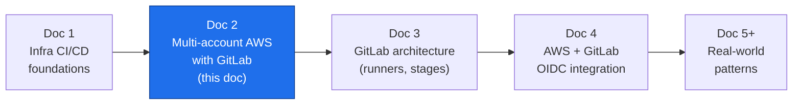
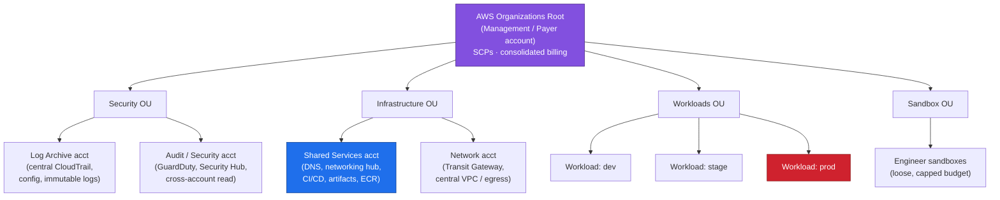
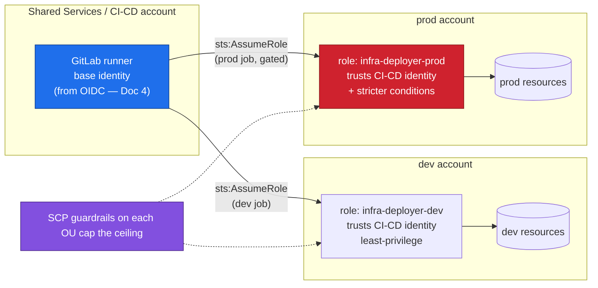
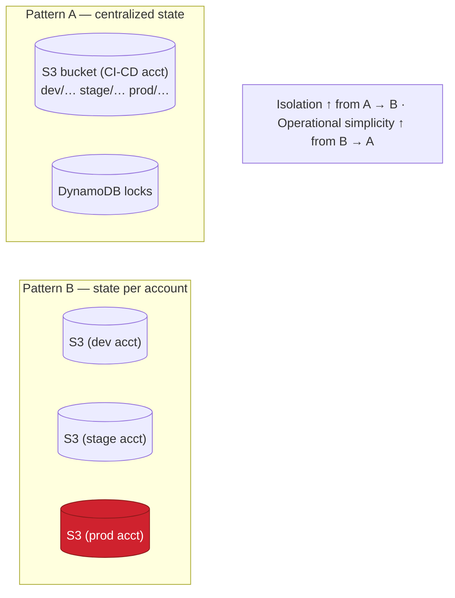
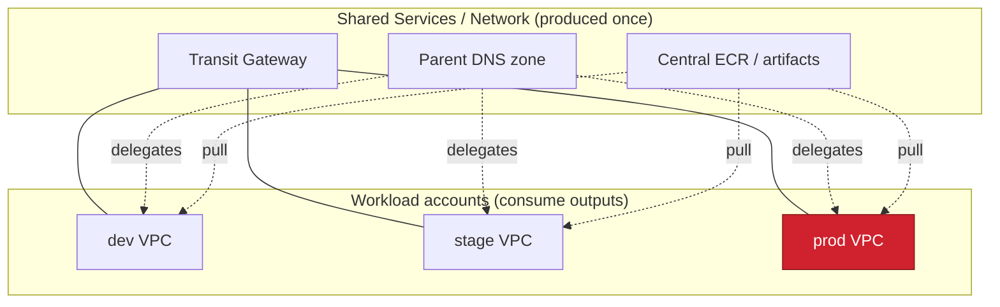
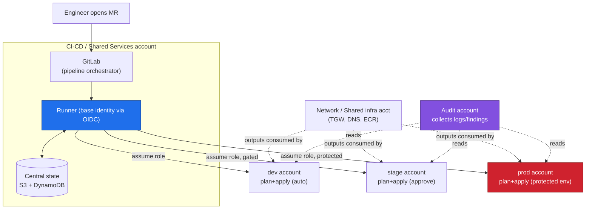

# Multi-Account AWS CI/CD with GitLab

**Series:** DevOps Architecture — CI/CD on AWS with GitLab
**Document 2 of N — The multi-account topology**
**Audience:** Platform / DevOps engineers, cloud architects
**Status:** Draft
**Prerequisite:** Doc 1 (Infra CI/CD foundations) — plan/apply split, state, blast radius

---

## 0. Where this document sits

Doc 1 established *why* infrastructure CI/CD is different: the pipeline mutates live, shared, stateful resources rather than running copies of an artifact. Its final principle was **isolate blast radius by boundaries — environment, account, and state.**

This document scales that single principle up. The strongest blast-radius boundary AWS gives you is the **account**, and a serious platform runs many of them. Here we cover the account topology, and how *one* GitLab pipeline reaches into many accounts to plan, apply, and promote — safely.

We deliberately defer two things: the *machinery* of GitLab (runners, stages, environments) is Doc 3, and the *credential mechanism* (OIDC, no long-lived keys) is Doc 4. Here we assume "the pipeline can assume a role in a target account" and focus on the **topology**.

---

## 1. Why more than one account

A single AWS account is one flat security and billing boundary. Everything in it can, in principle, reach everything else, and a mistake anywhere is a mistake everywhere. Multiple accounts convert soft, policy-based separation into **hard, structural separation**.

The reasons stack up:

- **Blast radius.** A destructive `apply`, a leaked credential, or a runaway resource is contained to one account. `prod` cannot be harmed by a mistake in `dev` because they are different accounts, not different tags.
- **Security isolation.** IAM does not span accounts by default. Cross-account access must be *explicitly* granted via role trust. The default is deny.
- **Blast radius for credentials.** A pipeline credential scoped to the `dev` account simply cannot touch `prod`. This is the property Doc 4's OIDC design leans on.
- **Billing and quotas.** Cost is attributable per account with no tagging discipline required; service quotas (a per-account limit) don't let a noisy `dev` starve `prod`.
- **Compliance.** Regulated workloads (PCI, HIPAA) live in dedicated accounts with their own controls, cleanly auditable in isolation.

The trade-off is operational overhead: many accounts means many baselines to keep consistent. That is exactly what a **landing zone** (AWS Control Tower or a Terraform equivalent) automates.

---

## 2. The account topology (AWS Organizations)

AWS Organizations groups accounts into **Organizational Units (OUs)** under a root, with the **management account** at the top. **Service Control Policies (SCPs)** attach to OUs as *guardrails* — they set the maximum permissions any principal in those accounts can ever have, independent of IAM.

A conventional landing-zone layout:

The account that matters most for CI/CD is **Shared Services** (sometimes a dedicated "Tooling" or "CI/CD" account). It is where the pipeline's identity, the Terraform state backend, artifact registries, and often the self-hosted GitLab runners live. It is the hub; the workload accounts are spokes.

> **Rule of thumb:** one account **per environment per workload domain**, not one account for everything. `dev`/`stage`/`prod` as separate accounts is the minimum; large orgs split further by business unit or product.

---

## 3. The central question: where does the pipeline run vs. what does it change?

In a single account these are the same place. In multi-account they are deliberately different, and keeping them straight is the whole game.

- **Execution context** — *where the runner runs and whose identity it starts with.* This is the Shared Services / CI-CD account. The runner authenticates to GitLab, checks out code, and holds a base identity.
- **Target context** — *the account whose resources a given job will mutate.* For a `prod` apply, the target is the `prod` account.

The bridge between them is **cross-account role assumption**. The pipeline's base identity in the CI-CD account calls `sts:AssumeRole` into a purpose-built role in the target account. That target role trusts the CI-CD identity and carries the least-privilege permissions needed for that environment. The SCP on the target's OU caps what even that role can do.

Three layers of defense are stacked here, which is the point: the **trust policy** decides *who* may assume the role, the **role's IAM policy** decides *what* it can do, and the **SCP** decides the *maximum* anything in that account may ever do. A misconfigured pipeline still can't exceed the SCP ceiling.

---

## 4. State topology in a multi-account world

Doc 1 said state must be remote, versioned, encrypted, and locked. Multi-account raises the question: *how many state backends, and where?*

Two viable patterns:

**A. Centralized state backend (common).** One S3 bucket + DynamoDB lock table in the **CI-CD / Shared Services** account, holding state for all environments, separated by **key prefix** (e.g., `dev/network/terraform.tfstate`, `prod/network/terraform.tfstate`). Simpler to operate; the CI-CD account becomes the crown-jewel to protect.

**B. State-per-account (stronger isolation).** Each workload account owns its own state backend. Matches the blast-radius philosophy most purely — losing/corrupting `dev` state can't touch `prod` state — at the cost of more backends to bootstrap and manage.

Whichever you choose, two rules are non-negotiable: **state is always separated per environment** (never one state object spanning dev+prod), and **the apply job for an environment only ever has credentials for that environment.** A `prod` apply must be structurally unable to open `dev` state and vice-versa.

Independently, **split state by domain within an environment** — network, data, platform, app — so a change to the app layer never locks or risks the network layer. Small blast radii compound.

---

## 5. Promotion: one pipeline, many accounts

The defining behavior of multi-account CI/CD is **promotion**: the same version of infrastructure code flows dev → stage → prod, applied into a *different account* at each step, with the gates getting stricter as it approaches production.

The properties that make this trustworthy:

- **Same code, per-environment inputs.** One module/codebase; the environment is chosen by a variable/workspace/`tfvars` file, not by branching. dev and prod diverge only in *values* (sizes, counts, CIDRs), never in *logic*. This is what makes "it worked in stage" meaningful.
- **Each stage targets its own account** by assuming that account's role — so a `stage` job simply has no path to `prod`.
- **Gates escalate.** dev may auto-apply; prod sits behind a **protected environment** requiring specific approvers, and often a change window. (Protected environments and approvals are Doc 3.)
- **Promote the *reviewed plan*, not a re-plan.** As in Doc 1: each apply consumes the saved plan artifact produced for that environment.

A subtle but important point: **stage is only a valid rehearsal for prod if the accounts are structurally similar.** Same module versions, same SCP shape, same networking pattern — differing only in scale. Divergence between stage and prod is where "passed in stage, broke in prod" incidents come from.

---

## 6. Cross-cutting concerns that span accounts

Some infrastructure is inherently shared and doesn't belong to any single workload account. It lives in the Infrastructure OU and is consumed by the others:

- **Networking.** A central Transit Gateway / hub-VPC in the Network account, with workload VPCs attaching to it. The CI/CD pipeline for networking runs against the Network account; workload pipelines *reference* its outputs (via remote state data sources or SSM parameters) rather than recreating them.
- **DNS.** A parent hosted zone in Shared Services delegates subdomains to per-environment zones.
- **Artifacts / images.** A central ECR / package registry in Shared Services, with workload accounts granted pull access cross-account.
- **Security tooling.** GuardDuty, Security Hub, and Config aggregate *into* the Audit account read-only across the org.

The dependency direction matters for pipeline ordering: **shared/foundational infra is applied first and changes rarely; workload infra consumes it and changes often.** Treat the shared layer's outputs as a contract, and version changes to it carefully — a breaking change there ripples into every consumer.

---

## 7. Reference end-to-end picture

Bringing execution context, target accounts, state, and promotion together:

---

## 8. Design principles this leads to

1. **The account is your strongest blast-radius boundary.** Use it: one account per environment (at minimum), separated by OU with SCP guardrails.
2. **Separate execution context from target context.** The pipeline runs in the CI-CD account and *assumes into* target accounts — it never holds standing credentials for many accounts at once.
3. **Stack three permission layers:** trust policy (who), role policy (what), SCP (ceiling). Assume every layer above may be misconfigured and let the one below still contain the damage.
4. **State is isolated per environment, and ideally per account.** An environment's apply job can only reach its own state and its own resources.
5. **Promote the same code with per-environment values, targeting a different account each step,** with gates escalating toward prod.
6. **Keep stage structurally identical to prod.** Divergence defeats the purpose of promotion.
7. **Foundational/shared infra is a versioned contract** applied first and consumed by workloads — change it deliberately.

---

## 9. What comes next

- **Doc 3 — GitLab architecture.** The machinery assumed here: runners (shared vs. self-hosted in the CI-CD VPC), pipeline **stages**, GitLab **environments** and **protected environments**, approval rules, and CI/CD variable scoping per environment. This is *how* the promotion flow and gates in §5 are actually built.
- **Doc 4 — AWS ↔ GitLab OIDC integration.** The "base identity" and "assume role" arrows in every diagram here, made concrete: GitLab as an OIDC identity provider in each AWS account, trust policies scoped to branch/environment, and **zero long-lived AWS keys** in GitLab.
- **Doc 5+ — Real-world patterns.** Reusable modules across accounts, ephemeral per-MR environments, monorepo vs. polyrepo for a multi-account estate, and drift detection at org scale.

> **Bridge to Doc 3:** every gate, approval, and "runner" in this document is a specific GitLab feature. Next we open that box.
