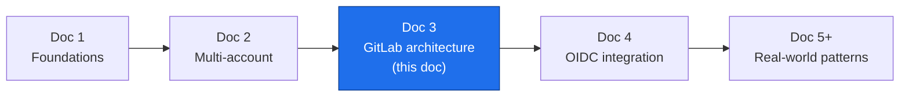
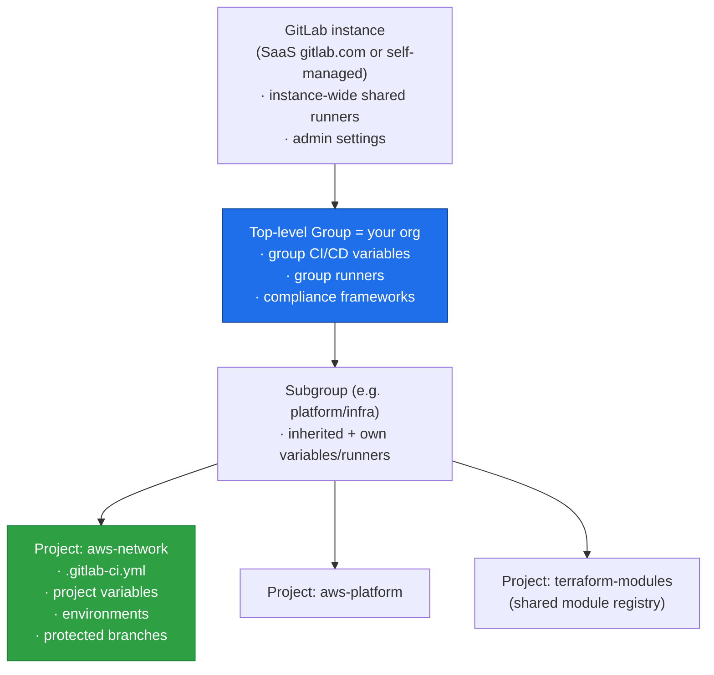
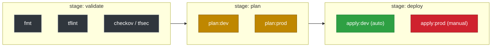
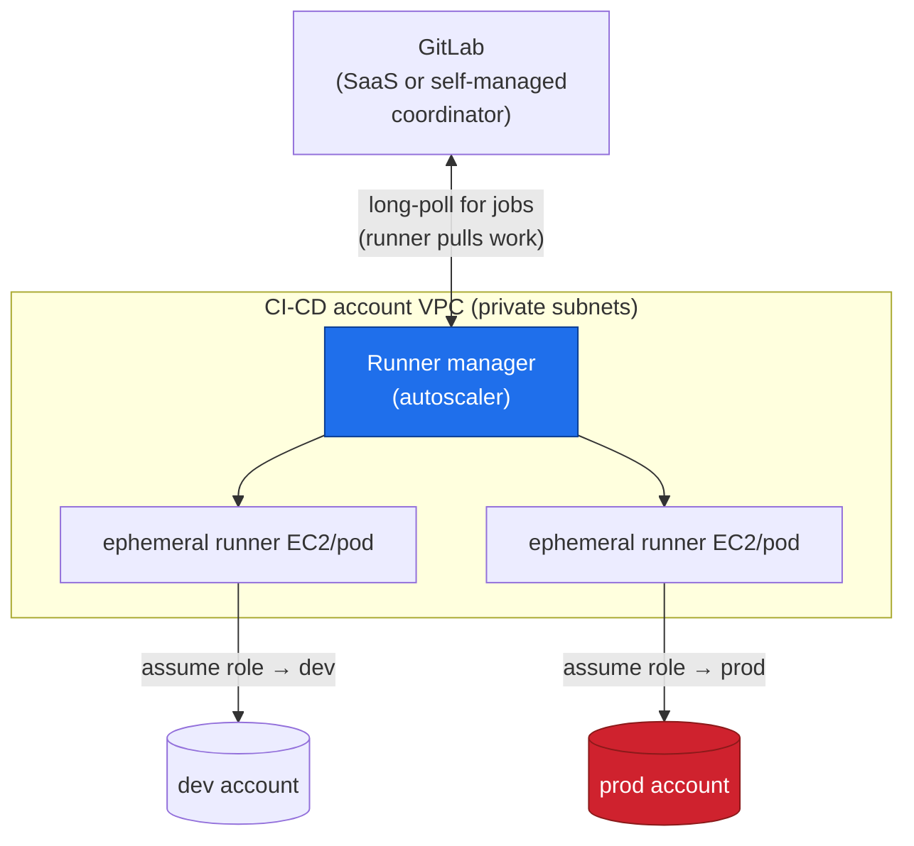
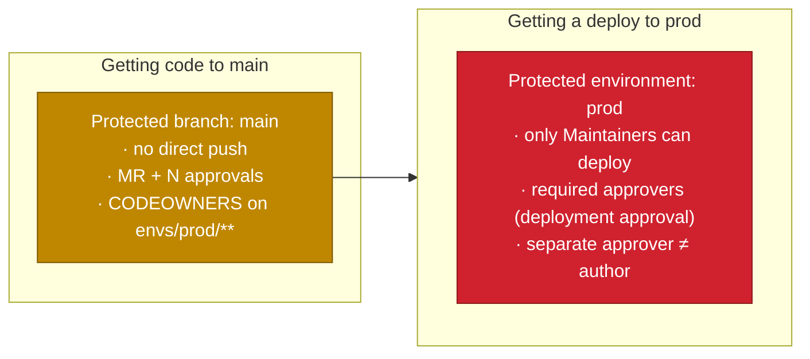
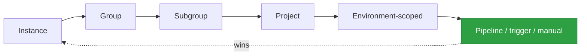
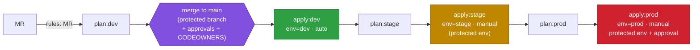
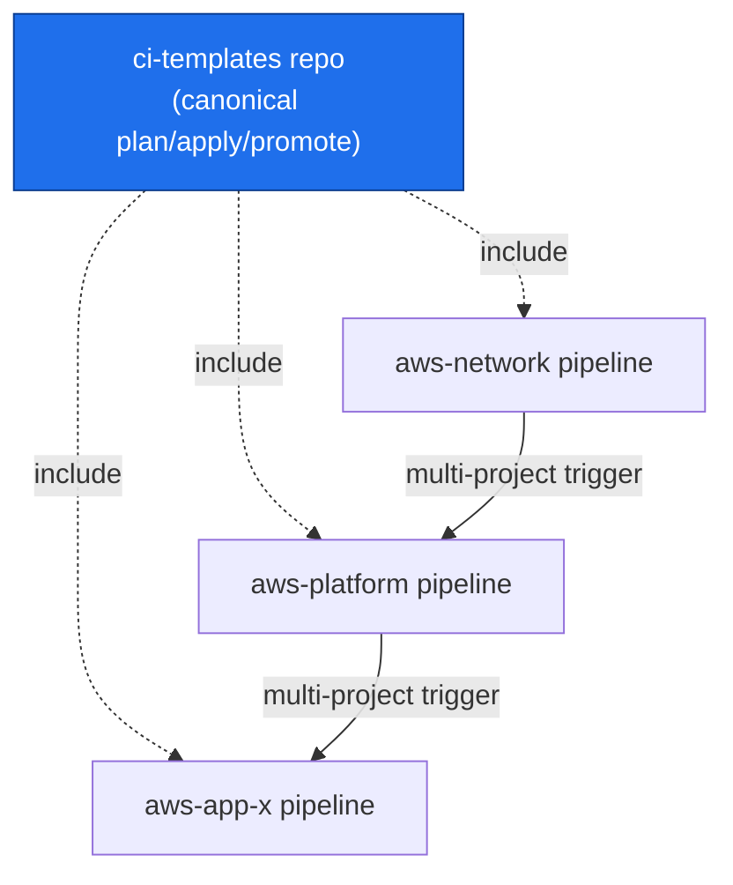

# GitLab Architecture for Infrastructure CI/CD

**Series:** DevOps Architecture — CI/CD on AWS with GitLab
**Document 3 of N — The GitLab machinery**
**Audience:** Platform / DevOps engineers, cloud architects
**Status:** Draft
**Prerequisites:** Doc 1 (Infra CI/CD foundations), Doc 2 (multi-account topology)

---

## 0. Where this document sits

Doc 2 kept saying "the runner assumes a role," "a manual approval gate," "a protected environment," "per-environment variables" — and deferred all of it here. This document opens that box. It is about the **GitLab mechanics** that actually execute the plan/apply/promote model.

We still defer *one* thing: how the runner gets an AWS identity with no long-lived keys. That is OIDC, and it is Doc 4. Here we assume "a job can obtain AWS credentials" and focus on GitLab's own moving parts.



---

## 1. The GitLab object hierarchy

Before pipelines, understand where things live — because **permissions, runners, and variables all inherit down this tree.**



The architectural consequence: **define shared things high, specific things low.** AWS account IDs, common runner tags, and org-wide policy live as **group** variables and **group** runners; a project only adds what is unique to it. This is the GitLab-side mirror of Doc 2's "shared infra applied once, consumed by many."

Access is role-based (Guest → Reporter → Developer → Maintainer → Owner). For infra repos this matters: **who can approve a prod deployment** and **who can change protected variables** are Maintainer/Owner-level decisions, not Developer.

---

## 2. Pipeline anatomy: stages, jobs, and the `.gitlab-ci.yml`

A pipeline is defined in `.gitlab-ci.yml` at the repo root. It is a set of **jobs**, each assigned to a **stage**. Jobs in the same stage run in parallel; stages run in sequence. A job runs on a **runner**.



A minimal but realistic skeleton, showing the plan/apply split from Doc 1:

```yaml
stages: [validate, plan, deploy]

default:
  image: hashicorp/terraform:1.9
  tags: [aws, self-hosted]        # route to our runners (see §3)

variables:
  TF_ROOT: ${CI_PROJECT_DIR}/envs

# ---- reusable job template (hidden job, YAML anchor via extends) ----
.plan: &plan
  stage: plan
  script:
    - cd "${TF_ROOT}/${ENV}"
    - terraform init -backend-config="key=${ENV}/terraform.tfstate"
    - terraform plan -out=plan.cache
  artifacts:
    paths: [${TF_ROOT}/${ENV}/plan.cache]   # pass the reviewed plan forward
    expire_in: 1 day

.apply: &apply
  stage: deploy
  script:
    - cd "${TF_ROOT}/${ENV}"
    - terraform init -backend-config="key=${ENV}/terraform.tfstate"
    - terraform apply plan.cache            # apply the SAVED plan, never re-plan

plan:dev:  { <<: *plan,  variables: { ENV: dev } }
apply:dev: { <<: *apply, variables: { ENV: dev },  environment: { name: dev },
             needs: ["plan:dev"] }          # auto after plan
```

Three mechanics an architect leans on constantly:

- **`rules:` control *whether* a job runs** — on an MR, only on `main`, only when files under `envs/prod/**` changed, etc. This is how a change to the network module doesn't needlessly re-plan every workload.
- **`needs:` builds a DAG.** By default a job waits for its whole previous stage; `needs:` lets `apply:dev` start the instant `plan:dev` finishes, ignoring unrelated jobs. Infra pipelines with many environments get much faster this way.
- **`artifacts:` pass files between jobs** — critically, the **saved plan** from `plan:` to `apply:`, guaranteeing what was reviewed is what executes.

---

## 3. Runners — where jobs actually execute

A **runner** is the agent that picks up a job and runs it. This is the component most tied to Doc 2's topology, because *where the runner lives determines what it can reach.*

### Runner scope

- **Shared (instance) runners** — provided by GitLab, available to all projects. Fine for lint/test; **not** appropriate for infra apply, because they run outside your network and you don't control them.
- **Group runners** — registered to your org group, shared by its projects. The usual home for infra CI/CD runners.
- **Project runners** — bound to one project; used for specially privileged pipelines.

### Executors (how a job is isolated)

- **Docker** — each job in a fresh container; the common default.
- **Kubernetes** — jobs as pods; autoscaling; good at scale.
- **Shell** — runs directly on the host; avoid for untrusted code, but sometimes used for tightly controlled infra runners.
- **Docker-autoscaler / instance** — spin EC2 runners on demand, scale to zero when idle.

### The placement that matters

For a multi-account AWS estate, you **self-host runners inside the CI-CD / Shared Services account's VPC** (Doc 2's execution context). This gives you: private connectivity to internal endpoints, an egress identity you control, and — with OIDC (Doc 4) — the base identity that assumes into target accounts.



Note the direction: **runners pull jobs from GitLab** (outbound long-poll); GitLab never needs inbound access to your VPC. That property is what makes SaaS GitLab + private self-hosted runners a clean, common architecture.

**Tags** connect jobs to the right runners. A job with `tags: [aws, self-hosted]` only runs on runners registered with those tags — the mechanism that keeps an infra apply off a shared runner.

---

## 4. Environments — GitLab's model of "a place you deploy to"

An **environment** is a first-class GitLab object representing a target (dev, stage, prod). A job declares `environment: { name: prod }`, and GitLab then tracks **deployments** to it: what version is live, deployment history, and who deployed. This is what turns a pile of jobs into an auditable record of "what is in prod right now."

```yaml
apply:prod:
  <<: *apply
  variables: { ENV: prod }
  environment:
    name: prod
    action: start
  rules:
    - if: '$CI_COMMIT_BRANCH == "main"'
      when: manual        # requires a human to click "play"
  needs: ["plan:prod"]
```

Environments also carry **environment-scoped variables** (§6) and are the object that **protected environments** (§5) attach their approval rules to.

---

## 5. Gates: protected branches, protected environments, and approvals

This is the heart of infra safety in GitLab — the concrete form of Doc 1's "the plan review + approval is central" and Doc 2's "gates escalate toward prod."



Three distinct controls, often confused, that stack:

- **Protected branch** governs *what gets into the code*. `main` requires a merge request, a minimum number of approvals, passing pipelines, and (via **CODEOWNERS**) sign-off from the infra owners when files under `envs/prod/**` change.
- **Protected environment** governs *who can run a deployment job* to that environment — restricting the `apply:prod` job to specific groups (e.g., Maintainers), regardless of who can merge.
- **Deployment approvals** add a *second human at deploy time*: even after `apply:prod` is triggered, it pauses until an authorized approver (who can be required to be different from the author) approves the deployment. This is your change-window / four-eyes control.

Layer these deliberately: merging code and deploying it to prod are **two separate authorizations**, and the person who wrote the change need not be the one who ships it.

---

## 6. CI/CD variables: scoping, protection, and precedence

Variables inject configuration and secrets into jobs. For a multi-account setup, **variable scoping is how one codebase targets many accounts** — the same `TF_VAR_*` or `AWS_ROLE_ARN` resolves to a different value per environment.

Attributes that matter:

- **Masked** — value hidden in job logs.
- **Protected** — only exposed to jobs on **protected** branches/tags. Prod role ARNs and any sensitive value should be *protected*, so an MR from a feature branch can never read them.
- **Environment-scoped** — a variable can be defined per environment (`AWS_ROLE_ARN` scoped to `prod` vs `dev`), so `apply:prod` and `apply:dev` transparently pick up different targets.

```yaml
# Defined in project/group settings, not in the YAML:
#   AWS_ROLE_ARN  scope=dev   value=arn:aws:iam::111...:role/infra-deployer-dev
#   AWS_ROLE_ARN  scope=prod  value=arn:aws:iam::999...:role/infra-deployer-prod  [protected]
#
# The job just references it; GitLab resolves by the job's environment:
apply:prod:
  environment: { name: prod }
  script:
    - echo "assuming ${AWS_ROLE_ARN}"   # resolves to the prod ARN, only on main
```

Precedence runs **narrow-overrides-broad**, roughly:



Architectural rule: **secrets never live in `.gitlab-ci.yml` or the repo.** They live as protected, masked variables (or better, are fetched at runtime from a secrets manager / provided by OIDC). The repo holds *logic and references*; the environment holds *values*.

---

## 7. Putting it together: the promotion pipeline from Doc 2, in GitLab terms

Doc 2 §5 showed a dev → stage → prod promotion. Here is how each abstract element maps to a concrete GitLab feature:

| Doc 2 concept | GitLab mechanism |
|---|---|
| "One codebase, per-env values" | One project; **environment-scoped variables** + per-env `tfvars` |
| "plan → dev" as a reviewable diff | `plan:` job on the MR, posting the diff; **artifact** = saved plan |
| "apply to dev (auto)" | `apply:dev` with `environment: dev`, runs on merge to `main` |
| "manual approve before stage" | `when: manual` + **protected environment** `stage` |
| "protected env approval for prod" | **Protected environment** `prod` + **deployment approvals** (four-eyes) |
| "each stage targets its own account" | `AWS_ROLE_ARN` **scoped per environment**; runner **assumes** that role |
| "runner in CI-CD account" | **self-hosted group runners** in the CI-CD VPC, selected by **tags** |
| "apply the reviewed plan" | `plan.cache` passed via **`artifacts`** into the `apply` job |



---

## 8. Scaling patterns worth knowing

As the estate grows, a single flat `.gitlab-ci.yml` stops scaling. GitLab offers structural answers:

- **`include:` + templates.** Keep pipeline logic in a central repo (e.g., `terraform-modules`/`ci-templates`) and `include:` it everywhere, so every infra project inherits the same validated plan/apply/promote flow. Change the standard once, roll it out everywhere.
- **Parent–child pipelines.** A parent generates or triggers child pipelines per component/environment — useful when a monorepo holds many independently deployable stacks.
- **Multi-project pipelines.** One project's pipeline triggers another's (e.g., a network change triggers downstream workload validation) — the CI-side expression of Doc 2 §6's shared-infra-then-consumers dependency.
- **Merge trains.** Serialize merges so each is tested against the actual state it will land on — the CI-side analogue of Doc 1's state locking.



---

## 9. Design principles this leads to

1. **Inherit down the tree.** Shared runners, variables, and templates live at the group; projects add only what's unique.
2. **Self-host runners in the CI-CD VPC, selected by tags.** Never run an infra `apply` on a shared runner. Runners pull work — no inbound access to your network.
3. **Separate the three gates.** Protected branch (what enters code) ≠ protected environment (who deploys) ≠ deployment approval (four-eyes at deploy). Stack all three for prod.
4. **Environments are your source of deploy truth.** Every `apply` declares its `environment`; GitLab records what's live and who shipped it.
5. **Scope variables per environment; mark prod values protected.** Feature-branch pipelines must be structurally unable to read prod secrets/ARNs.
6. **Keep secrets and values out of the repo.** The repo holds logic and references; GitLab settings (or a secrets manager / OIDC) hold values.
7. **Centralize the pipeline via `include:`.** One canonical, reviewed flow; every project inherits it.

---

## 10. What comes next

- **Doc 4 — AWS ↔ GitLab OIDC integration.** The one arrow we still hand-wave: how a runner obtains AWS credentials with **no long-lived keys**. GitLab issues a signed OIDC token per job (carrying claims like branch, environment, project); each AWS account trusts GitLab as an identity provider; the target role's trust policy conditions on those claims. This closes the loop on §3's "assume role → prod" and §6's `AWS_ROLE_ARN`.
- **Doc 5+ — Real-world patterns.** Ephemeral per-MR environments (spin a full stack, review, destroy), reusable module registries across the group, monorepo vs. polyrepo trade-offs for a multi-account estate, and org-scale drift detection.

> **Bridge to Doc 4:** every `assume role` in this document currently assumes the runner already has AWS credentials. Next we make that trustless.
