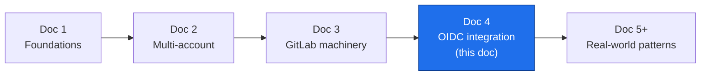
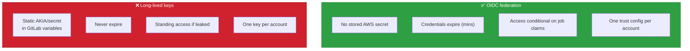
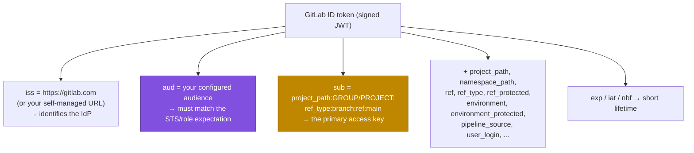
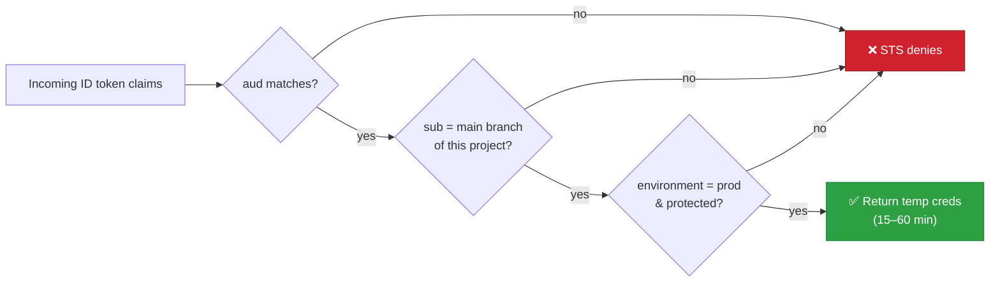
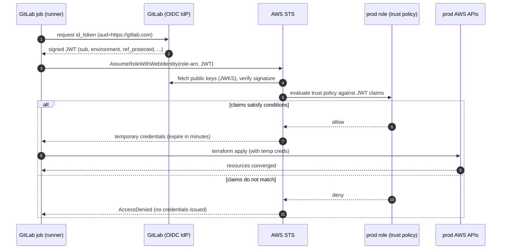
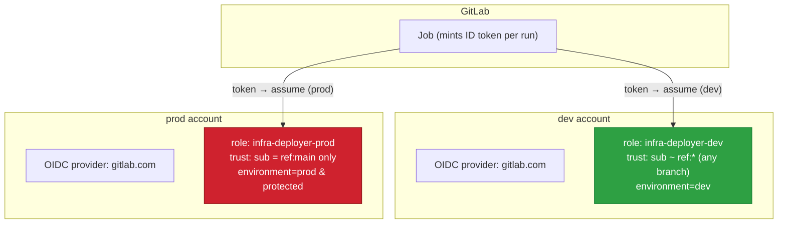
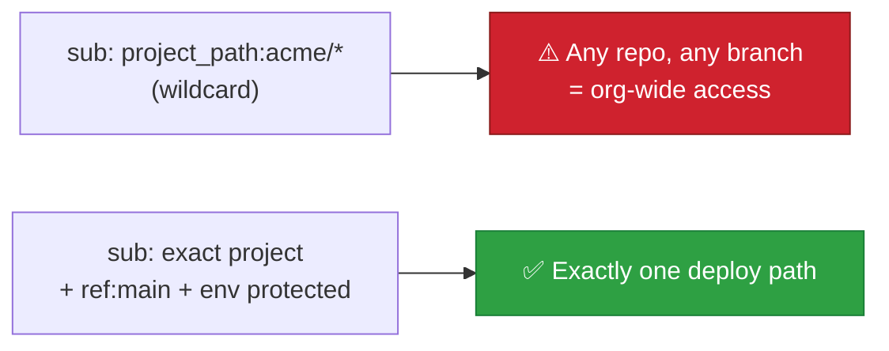
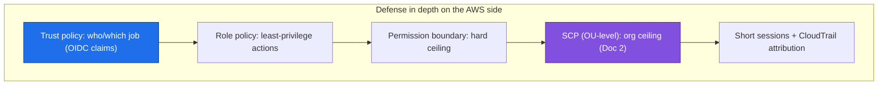
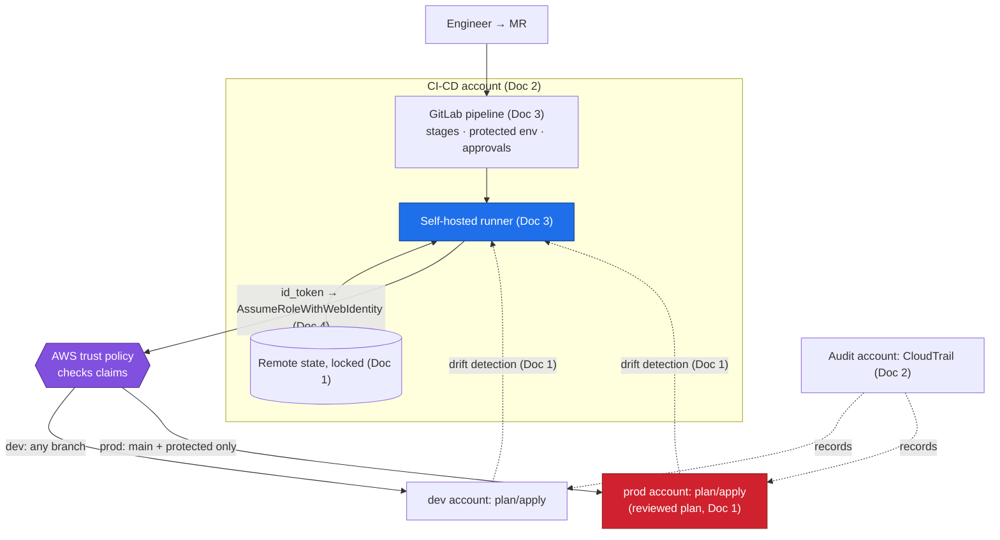

# AWS ↔ GitLab Integration with OIDC

**Series:** DevOps Architecture — CI/CD on AWS with GitLab
**Document 4 of N — Trustless credentials**
**Audience:** Platform / DevOps engineers, cloud architects
**Status:** Draft
**Prerequisites:** Docs 1–3 (foundations, multi-account topology, GitLab machinery)

---

## 0. Where this document sits

Every diagram in Docs 2 and 3 had an arrow labeled **"assume role → prod"** and a variable called **`AWS_ROLE_ARN`**, with a hand-wave: "assume the runner already has AWS credentials." This document removes the hand-wave. It answers exactly one question — *how does a GitLab job get AWS credentials?* — and answers it the modern way: **it doesn't hold any. It proves its identity and exchanges that proof for short-lived credentials.**

This closes the core architecture of the series. Doc 5+ then builds real-world patterns on top.



---

## 1. The problem: long-lived keys are the wrong answer

The naïve integration is to create an IAM user, generate an access key + secret, and paste them into GitLab as CI/CD variables. This works on day one and is a liability forever:

- **They don't expire.** A key leaked in a log, a forked pipeline, or a compromised dependency is valid until someone manually rotates it — and rotation across many accounts is painful, so it rarely happens.
- **They're static secrets sitting in GitLab.** Anything that can read the variable (a mis-scoped job, an attacker with project access) gets standing access to your AWS account.
- **They're coarse.** One key = one identity for every pipeline run; you can't distinguish "an apply to prod from `main`" from "a feature branch running arbitrary code."
- **They multiply.** Multi-account (Doc 2) would mean a key per account, each a separate rotation and leak surface.

The goal is the opposite of all four: **no stored secret, credentials that expire in minutes, and access that is conditional on *which* pipeline is running.** That is what OIDC delivers.



---

## 2. The idea in one paragraph

GitLab can act as an **OpenID Connect (OIDC) identity provider**. For a job that requests it, GitLab mints a short-lived, cryptographically **signed JSON Web Token (JWT)** — an *ID token* — describing that specific job: its project, its branch, its environment, whether the branch is protected, and more. AWS is configured to **trust GitLab as an identity provider**. The job hands the token to AWS STS via `AssumeRoleWithWebIdentity`; STS verifies the signature against GitLab's public keys, checks that the token's **claims** satisfy the target role's **trust policy**, and if so returns **temporary AWS credentials** (valid for the session, typically 15–60 min). No secret was ever stored.

The trust boundary shifts from *"holds the right secret"* to *"is provably the right job."*

---

## 3. The ID token and its claims

When a job requests an ID token, GitLab embeds **claims** — assertions about the job — into the signed JWT. These claims are the entire basis for AWS's authorization decision, so knowing them is the whole security model.



The claims that carry security weight:

- **`aud` (audience)** — who the token is *for*. You set it; the AWS trust policy must require the same value. This prevents a token minted for some other service from being replayed against AWS.
- **`sub` (subject)** — a structured string like `project_path:acme/platform/aws-network:ref_type:branch:ref:main`. The single most useful claim for scoping "which repo + which branch."
- **`ref_protected`** — `"true"` only on protected branches/tags (Doc 3 §5). Gating on this means *only pipelines on protected branches can assume the role at all.*
- **`environment` / `environment_protected`** — the GitLab environment the job targets (`prod`) and whether it's a protected environment. This lets AWS tie role assumption to a specific, protected environment.

Requesting the token in `.gitlab-ci.yml` is one block:

```yaml
apply:prod:
  stage: deploy
  environment: { name: prod }
  id_tokens:
    AWS_ID_TOKEN:                    # arbitrary name → becomes an env var
      aud: https://gitlab.com        # must match the trust policy's aud condition
  script:
    - >
      creds=$(aws sts assume-role-with-web-identity
        --role-arn "$AWS_ROLE_ARN"
        --role-session-name "gl-${CI_PROJECT_NAME}-${CI_PIPELINE_ID}"
        --web-identity-token "$AWS_ID_TOKEN"
        --duration-seconds 3600
        --query 'Credentials' --output json)
    - export AWS_ACCESS_KEY_ID=$(echo "$creds" | jq -r .AccessKeyId)
    - export AWS_SECRET_ACCESS_KEY=$(echo "$creds" | jq -r .SecretAccessKey)
    - export AWS_SESSION_TOKEN=$(echo "$creds" | jq -r .SessionToken)
    - terraform init && terraform apply plan.cache
```

> In practice the AWS provider and tools like `aws configure` can consume the web-identity token directly, so the explicit `sts` call is often unnecessary — but showing it makes the exchange visible.

---

## 4. The AWS side: identity provider + trust policy

Two objects per AWS account:

**(a) An IAM OIDC identity provider** registering GitLab. It records GitLab's issuer URL and the audience you'll use. This is what lets AWS verify the JWT's signature against GitLab's published keys.

**(b) A role whose *trust policy* conditions on the claims.** The trust policy is the gate. Permissions (what the role can *do*) are a separate attached policy — capped further by the account's SCP (Doc 2 §3).

A trust policy scoped so that **only the `main` branch of one project, targeting the protected `prod` environment, may assume the prod role:**

```json
{
  "Version": "2012-10-17",
  "Statement": [{
    "Effect": "Allow",
    "Principal": {
      "Federated": "arn:aws:iam::999999999999:oidc-provider/gitlab.com"
    },
    "Action": "sts:AssumeRoleWithWebIdentity",
    "Condition": {
      "StringEquals": {
        "gitlab.com:aud": "https://gitlab.com",
        "gitlab.com:environment": "prod",
        "gitlab.com:environment_protected": "true"
      },
      "StringLike": {
        "gitlab.com:sub": "project_path:acme/platform/aws-network:ref_type:branch:ref:main"
      }
    }
  }]
}
```

Read the `Condition` block as the security policy in plain English: *the token must be for our audience, from the `main` branch of the `aws-network` project, targeting the protected `prod` environment.* A feature-branch pipeline (`ref:feature-x`), a different project, or a non-prod environment produces a token whose claims **don't match**, and STS refuses. No credential ever changes hands.



---

## 5. The end-to-end exchange



Note what is *absent*: at no point is a stored AWS secret read from GitLab. The only durable secret is GitLab's own signing key, held by GitLab, never in your repo or variables.

---

## 6. Multi-account: the same pattern, replicated

Doc 2's estate has many accounts. OIDC scales to it cleanly: **register the GitLab OIDC provider in each target account**, and give each account a role whose trust policy is scoped to the branch/environment that is allowed to deploy there. The runner in the CI-CD account (Doc 3 §3) requests one token per job and assumes into whichever account that job targets — the `AWS_ROLE_ARN` variable, environment-scoped per Doc 3 §6, points at the right role.



Notice the trust policies **differ by environment strictness**, mirroring Doc 2 §5's escalating gates: `dev` may trust any branch (fast iteration), while `prod` trusts *only* `main` on a protected environment. The gate is enforced in AWS itself — even a misconfigured GitLab pipeline cannot assume the prod role from a feature branch, because STS checks the claims.

---

## 7. The one mistake that undoes everything: a loose `sub`

The most common — and most dangerous — misconfiguration is a wildcard in the `sub` condition:

```json
"StringLike": { "gitlab.com:sub": "project_path:acme/*" }
```

This trusts **every project and every branch** under `acme/`. Any developer who can push a branch to any repo in the group can now mint a token that matches, assume the role, and act in that AWS account. The wildcard silently converts a tightly-scoped role into an org-wide backdoor.

Rules to avoid it:

- **Pin the project path exactly.** Never wildcard the project unless you genuinely intend org-wide access.
- **Pin the ref for privileged roles.** Prod roles should match `ref:main` (or a protected tag pattern) precisely — never `ref:*`.
- **Gate on `ref_protected: "true"` and `environment_protected: "true"`** so only protected branches/environments (Doc 3 §5) qualify.
- **Prefer `environment` for deploy roles.** Tying the role to a specific protected GitLab environment aligns the AWS gate with the GitLab approval gate — one consistent boundary.



---

## 8. Hardening beyond the basics

Once the exchange works, layer defense in depth:

- **Short session durations.** Cap `--duration-seconds` (and the role's `MaxSessionDuration`) to just longer than a pipeline needs. A leaked session token is then near-worthless within minutes.
- **Permission boundaries.** Attach an IAM permissions boundary to the deployer role so it can never exceed a defined ceiling even if its policy is later widened — a per-role echo of the SCP ceiling.
- **Session tagging + naming.** Set `--role-session-name` to something traceable (`gl-<project>-<pipeline_id>`); every CloudTrail event then names the exact pipeline that acted. Optionally pass session tags for attribute-based access control.
- **Least-privilege permissions, split by domain.** The `apply` role for the network stack shouldn't be able to touch IAM or billing. Mirror Doc 2 §4's per-domain state split in the role permissions.
- **Separate plan vs apply identities.** A read-only role for `plan` (which runs on every MR, including untrusted branches) and a mutating role for `apply` (gated to `main`/protected env). An MR from a fork should never be able to *change* anything.
- **Verify the trust chain end to end** after setup: confirm a feature-branch pipeline is *denied* the prod role. Testing the negative case is how you know the gate is real.



---

## 9. Design principles this leads to

1. **No long-lived AWS keys in GitLab. Ever.** Federate identity; exchange proof for short-lived credentials.
2. **The trust policy is the security control.** Scope it on `aud`, exact project, exact ref for privileged roles, and protected environment — read every `Condition` as an English sentence.
3. **Never wildcard `sub` for privileged roles.** A loose `sub` is an org-wide backdoor.
4. **Align the AWS gate with the GitLab gate.** Tie deploy roles to protected environments so one boundary is enforced in both systems.
5. **Replicate the pattern per account, vary strictness by environment.** dev trusts broadly for speed; prod trusts exactly one path.
6. **Split plan (read-only, any branch) from apply (mutating, protected only).** Untrusted branches must never mutate.
7. **Layer boundaries: trust policy → role policy → permission boundary → SCP.** Assume each may be misconfigured; the next contains it.
8. **Make every action attributable.** Traceable session names + CloudTrail = you always know which pipeline did what.

---

## 10. The complete picture — the series in one diagram



This is the whole architecture: infra as desired state (Doc 1), isolated by account (Doc 2), orchestrated by GitLab (Doc 3), and authorized by trustless, short-lived, claim-scoped credentials (Doc 4).

---

## 11. What comes next — Doc 5+

With the core architecture complete, the remaining documents increase complexity toward real-world operation:

- **Reusable modules & a template registry** — one canonical plan/apply/promote flow (`include:`) and versioned Terraform modules consumed across every account.
- **Ephemeral per-MR environments** — spin a full stack in a sandbox account on MR open, review it live, destroy on merge/close; the OIDC trust for these scopes to `ref_type:branch` in the sandbox account only.
- **Monorepo vs. polyrepo** for a multi-account estate, and change-scoping with `rules:`/`needs:` so only affected stacks re-plan.
- **Org-scale drift detection and remediation**, and progressive delivery for infrastructure (canarying risky changes).

> The four core documents are now self-consistent: each arrow in this final diagram is defined in exactly one place. Doc 5 onward is composition, not new primitives.
