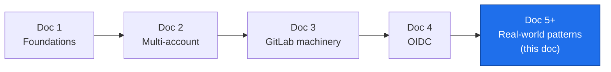
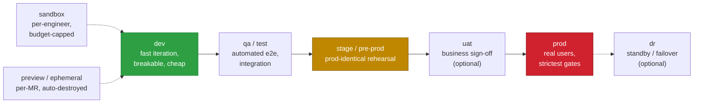
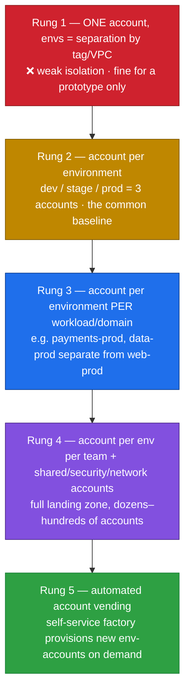
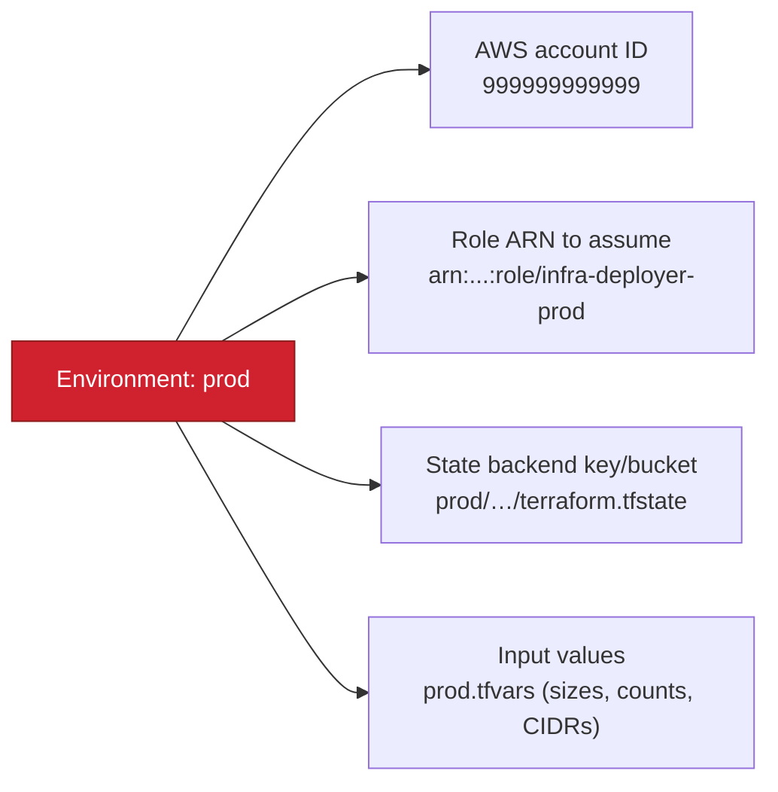
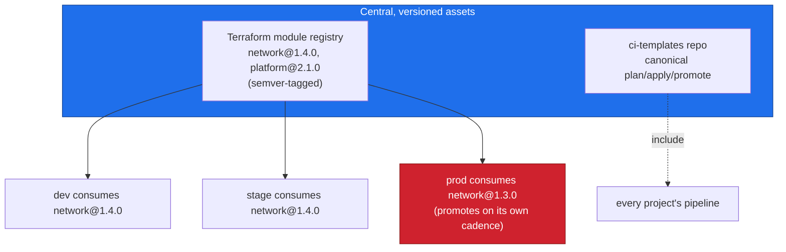
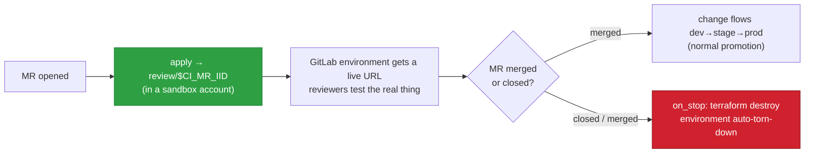
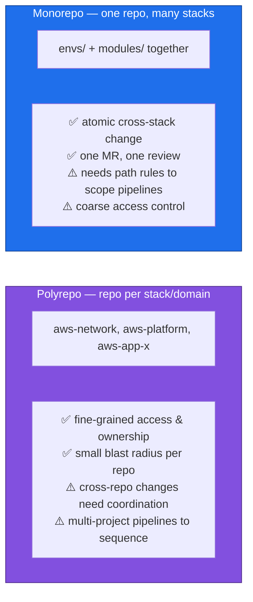
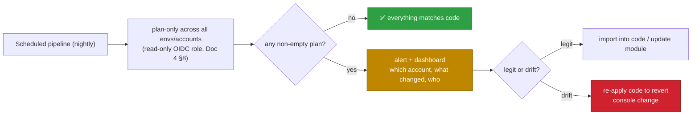
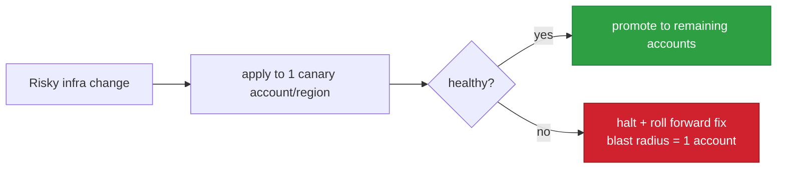
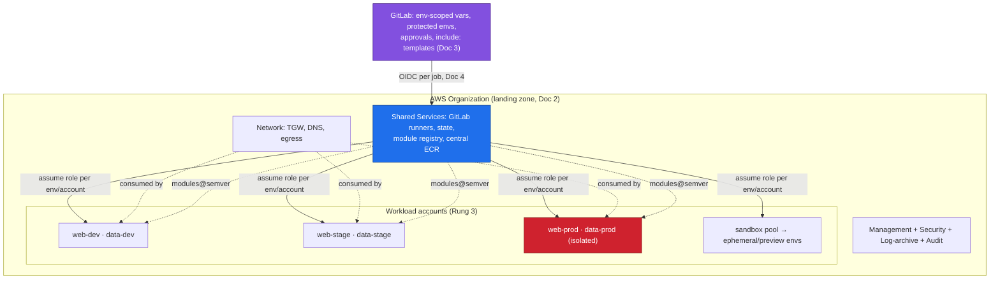

# Real-World Patterns: Environments & AWS Account Mapping

**Series:** DevOps Architecture — CI/CD on AWS with GitLab
**Document 5 of N — Composition & real-world operation**
**Audience:** Platform / DevOps engineers, cloud architects
**Status:** Draft
**Prerequisites:** Docs 1–4 (foundations, multi-account, GitLab, OIDC)

---

## 0. Where this document sits

Docs 1–4 defined the primitives. This document is **composition**: how real teams arrange environments, map them to AWS accounts, and grow that arrangement from a two-person startup to a regulated enterprise **without changing the primitives** — only how they're combined.

Two questions the earlier docs assumed answered, made explicit here:

1. **What do `dev` / `stage` / `prod` actually mean in practice**, and what other environments show up?
2. **How is an environment mapped to an AWS account**, and how does that mapping get wired into the pipeline?

Everything here reuses Doc 2's account boundaries, Doc 3's GitLab environments, and Doc 4's OIDC trust — nothing new is invented, it's just arranged.



---

## 1. The environment model in practice

An **environment** is a named, isolated copy of the system that a change flows through on its way to production. The classic three are a floor, not a ceiling.



What each is *for* — the distinction is about **purpose and blast radius**, not just naming:

| Environment | Purpose | Who breaks it | Data | Gate to enter |
|---|---|---|---|---|
| **sandbox** | Individual experimentation | One engineer | Synthetic | None |
| **dev** | Integrate shared changes | The team | Synthetic / seeded | Merge to `main` (auto-apply) |
| **qa / test** | Automated integration & e2e | Test suites | Seeded fixtures | Auto after dev |
| **stage / pre-prod** | Final rehearsal, prod-identical | Nobody (should stay green) | Prod-like, anonymized | Manual approval |
| **uat** | Human/business acceptance | Product/business | Prod-like | Business sign-off |
| **prod** | Serve real users | Nobody, ever, casually | Real | Protected env + four-eyes |
| **dr** | Failover target | Nobody | Replicated from prod | Automated + drills |

Two rules that make the model actually work (both foreshadowed in earlier docs):

- **Same code, values differ per environment.** dev and prod run the *same modules*; they diverge only in inputs (instance sizes, counts, CIDRs, feature flags) — never in logic (Doc 2 §5). Divergence in *logic* is how "worked in stage, broke in prod" happens.
- **Stage must be structurally prod.** If stage isn't a faithful scale model of prod (same module versions, same account/SCP shape, anonymized prod-like data), it isn't a rehearsal — it's theater.

> **Don't over-model.** Every environment is real cost and real maintenance. A small team is well served by `dev → stage → prod` plus ephemeral previews. Add `qa`, `uat`, `dr` only when a concrete need (compliance sign-off, RTO target) demands them.

---

## 2. Mapping environments to AWS accounts — the maturity ladder

This is the crux of the user's question and the place teams most often get stuck. The mapping of *environment → AWS account* is a **maturity ladder**: you climb it as blast-radius, compliance, and team-count pressures grow. Each rung reuses the same primitives; only the boundary count changes.



**Rung 1 — one account, "environments" as tags or VPCs.** dev/stage/prod are just prefixes or separate VPCs in a single account. Cheap and simple, but every blast-radius argument from Doc 2 §1 applies against it: a credential or a bad `apply` reaches everything. Acceptable for a throwaway prototype; a liability the moment there's a prod worth protecting.

**Rung 2 — one AWS account per environment.** The standard baseline. Three accounts (`dev`, `stage`, `prod`); the environment boundary is now the *account* boundary — hard, IAM-enforced, separately billed. This is what the whole series has assumed. **Most companies live here or at Rung 3.**

**Rung 3 — account per environment *per workload domain*.** Now `prod` is not one account but several: `web-prod`, `payments-prod`, `data-prod`. A compromise or mistake in the web tier can't touch the payments account. This is where regulated or high-value workloads land — the domain split from Doc 2 §4 promoted from *state* separation to *account* separation.

**Rung 4 — account per env per team, inside a full landing zone.** Add the management, security/audit, log-archive, shared-services, and network accounts (Doc 2 §2). Now you have tens to hundreds of accounts, and consistency is only tractable because a landing zone (Control Tower / Terraform) stamps every account with a baseline.

**Rung 5 — automated account vending.** Accounts become cattle. A self-service "account factory" provisions a fully-baselined env-account (guardrails, OIDC provider, roles, network attachment) on request, so a new team or a new ephemeral environment gets its own account in minutes. This is the end state large orgs converge on.

The engineering guidance: **start at Rung 2, climb only when a real force pushes you.** Each rung buys isolation at the cost of operational surface; don't pay for isolation you don't yet need.

---

## 3. How the mapping is actually wired

The environment → account mapping isn't magic — it's a small, explicit set of bindings. For any environment, four things must resolve to that environment's values:



How each binding is expressed in the GitLab + Terraform stack from Docs 3–4:

- **Account ID / Role ARN** → a **GitLab environment-scoped variable** `AWS_ROLE_ARN` (Doc 3 §6). The `apply:prod` job declares `environment: prod`, GitLab resolves the ARN to the prod account's role, and OIDC (Doc 4) assumes it. The account ID never appears in code.
- **State backend** → `terraform init -backend-config="key=${ENV}/..."` (Doc 3 §2), so each environment reads/writes only its own state (Doc 2 §4).
- **Input values** → a per-environment `tfvars` file (or a Terraform *workspace*), selected by the `ENV` variable.

A directory layout that makes the mapping obvious and reviewable:

```
infra/
├── modules/                 # shared logic — env-agnostic
│   ├── network/
│   └── platform/
└── envs/
    ├── dev/     { main.tf → modules, dev.tfvars,   backend key=dev/… }
    ├── stage/   { main.tf → modules, stage.tfvars, backend key=stage/… }
    └── prod/    { main.tf → modules, prod.tfvars,  backend key=prod/… }
```

```yaml
# One templated job, parameterized by environment (Doc 3 §2):
.deploy:
  script:
    - cd envs/$ENV
    - terraform init -backend-config="key=$ENV/terraform.tfstate"
    - terraform apply plan.cache        # AWS_ROLE_ARN resolved per-env by GitLab

apply:dev:   { extends: .deploy, environment: { name: dev },   variables: { ENV: dev } }
apply:prod:  { extends: .deploy, environment: { name: prod },  variables: { ENV: prod },
               rules: [{ if: '$CI_COMMIT_BRANCH == "main"', when: manual }] }
```

The whole mapping is thus **three explicit bindings per environment** — role ARN (in GitLab), state key (in `init`), values (in `tfvars`) — and one directory per environment. Nothing is implicit; a reviewer can see exactly which account a job targets.

> **Workspaces vs. directories.** Terraform *workspaces* store per-env state under one config; per-env *directories* (above) keep configs explicit and are easier to reason about for account isolation. Most teams prefer directories for infra-per-account because "which account does this touch" is answerable by looking at one folder. Workspaces suit many near-identical envs.

---

## 4. Pattern: reusable modules & a template registry

At Rung 3+ you have many environments and accounts running the *same* patterns. Duplicating HCL and `.gitlab-ci.yml` across them guarantees drift between them. Two shared assets fix this:



- **Versioned modules.** Publish modules to GitLab's Terraform module registry with semver tags; environments pin a version (`source = ".../network" , version = "1.4.0"`). A change is proven in dev at `1.4.0`, then prod is *bumped* to `1.4.0` deliberately — promotion becomes a version bump, fully auditable, independently paced per environment.
- **Pipeline templates via `include:`** (Doc 3 §8). One canonical plan/apply/promote flow lives in `ci-templates`; every infra project includes it. Fix the standard once, and every account inherits the fix.

This is the composition of Doc 2's "shared infra is a versioned contract" with Doc 3's `include:` — applied to the *pipeline* and the *modules*, not just the cloud resources.

---

## 5. Pattern: ephemeral (per-MR / preview) environments

The highest-leverage real-world pattern. Instead of a fixed shared `dev` that everyone steps on, **each merge request spins up its own short-lived environment**, deploys the change, exposes it for review, and **destroys it on merge or close.**



```yaml
review:
  environment:
    name: review/$CI_MERGE_REQUEST_IID
    on_stop: stop_review          # GitLab calls this to tear down
  rules: [{ if: '$CI_PIPELINE_SOURCE == "merge_request_event" }]
  script: [ cd envs/ephemeral, terraform workspace new mr-$CI_MERGE_REQUEST_IID, terraform apply -auto-approve ]

stop_review:
  environment: { name: review/$CI_MERGE_REQUEST_IID, action: stop }
  when: manual                    # also auto-triggered when the MR closes
  script: [ terraform workspace select mr-$CI_MERGE_REQUEST_IID, terraform destroy -auto-approve ]
```

Why it matters and how the earlier docs make it safe:

- **Real testing, zero contention** — reviewers see the actual infrastructure, not a description, without fighting over a shared dev.
- **Cost is controlled by ephemerality** — the environment exists for hours, then `terraform destroy` reclaims it. GitLab's `auto_stop_in` can force teardown even if the MR is abandoned.
- **Blast radius is a disposable sandbox account** (Doc 2, Rung 5's vending shines here). The OIDC trust for review environments (Doc 4 §6) is scoped to `ref_type:branch` in the *sandbox* account only — a preview environment can *never* assume the prod role.

---

## 6. Monorepo vs. polyrepo for a multi-account estate

As projects multiply, the repo layout becomes an architecture decision with real consequences for the pipeline.



The deciding factor is **change-scoping**. In a monorepo you *must* use `rules: changes:` and `needs:` (Doc 3 §2) so that editing `envs/prod/app-x` doesn't re-plan the entire estate — otherwise every MR triggers everything. In a polyrepo, scoping is natural (a repo *is* the scope) but cross-cutting changes (e.g., a network change consumed by ten workloads) require **multi-project pipelines** (Doc 3 §8) to sequence.

Common real-world middle ground: **a repo per domain**, not per tiny component — `aws-network`, `aws-data`, `aws-platform`, each owning its accounts across all environments. Coarse enough to keep cross-stack changes manageable, fine enough for clean ownership and blast radius.

---

## 7. Org-scale drift detection & remediation

Doc 1 §5 introduced drift; at Rung 3+ scale it's a program, not a cron job. Run scheduled `plan`-only pipelines across every environment/account and **surface, triage, and reconcile** non-empty plans.



Two rules keep it sane at scale: use a **read-only role** for drift plans (never one that can mutate), and route findings to a **dashboard/alert** with account + owner attribution (Doc 4 §8's traceable sessions), so drift is triaged like any other defect rather than accumulating silently.

---

## 8. Progressive delivery for infrastructure

Application deploys have canaries and blue/green; infrastructure can borrow the idea for its riskiest changes — you don't flip the whole fleet at once.

- **Canary by scope** — apply a network or AMI change to one small account/region first, verify, then promote to the rest. The promotion ladder (§1) *is* a canary if the early rungs are low-stakes.
- **Blue/green for stateful/foundational resources** — stand up the new resource beside the old, shift references, retire the old once verified — instead of an in-place mutation that Doc 1 §6 warned can be irreversible.
- **Guardrails as the safety net** — policy-as-code (Doc 1 §3) plus `prevent_destroy` and deletion protection ensure a progressive rollout can't silently delete a stateful resource mid-flight.



---

## 9. A realistic customer topology

Bringing the whole series together into what a mature customer actually runs:



Reading it as a story: an engineer opens an MR → a **preview environment** spins up in a **sandbox account** → on merge, the change **promotes dev → stage → prod**, each a **separate account** (isolated further by domain at prod), applied by **OIDC-scoped, short-lived credentials**, using **versioned shared modules**, orchestrated by **one templated GitLab pipeline**, with **nightly drift detection** keeping every account honest.

---

## 10. Design principles this leads to

1. **Environments express purpose and blast radius, not just names.** Model the ones you need; don't pay to maintain the ones you don't.
2. **Map environment → account on a maturity ladder. Start at account-per-environment (Rung 2); climb only under real pressure.**
3. **Wire the mapping explicitly:** role ARN (GitLab env var), state key (`init`), values (`tfvars`) — one directory per environment, nothing implicit.
4. **Same code everywhere; values differ per environment. Keep stage structurally identical to prod.**
5. **Share logic through versioned modules and `include:` templates** so many accounts can't drift apart.
6. **Prefer ephemeral, per-MR environments in disposable sandbox accounts** over a contended shared dev.
7. **Choose repo layout by change-scoping needs;** a repo-per-domain is a strong default.
8. **Treat drift as a defect, at scale, with read-only detection and owner attribution.**
9. **Roll risky infra changes progressively** — canary by account/region, blue/green for stateful resources.

---

## 11. Series wrap-up

The five documents now form a complete architecture, from principle to production:

| Doc | Question it answers |
|---|---|
| **1** | Why is infra CI/CD fundamentally different from software CI/CD? |
| **2** | How do you isolate blast radius across many AWS accounts? |
| **3** | What GitLab machinery executes the plan/apply/promote model? |
| **4** | How do jobs get AWS access with no long-lived keys? |
| **5** | How do real teams arrange environments, accounts, and pipelines — and grow them? |

Every primitive is defined once and composed thereafter. From here, extension is **more of the same, arranged for your context**: more accounts, more environments, tighter guardrails, faster feedback — but no new concepts. That is the sign of a sound architecture.

> **Optional next docs (Doc 6+), if useful:** cost management & FinOps across accounts, disaster-recovery topology and drills, secrets management (Vault / AWS Secrets Manager) alongside OIDC, and compliance-as-code (evidence collection, audit reporting) for regulated estates.
