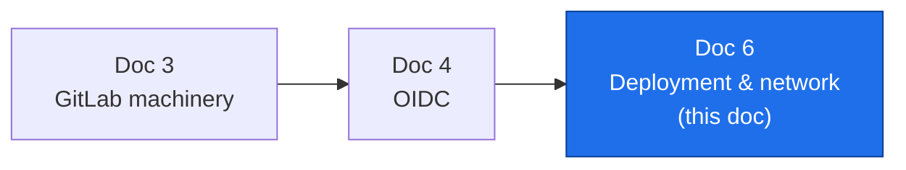
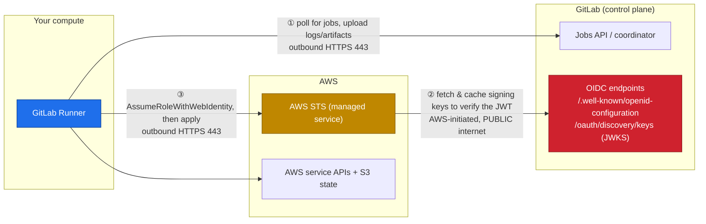
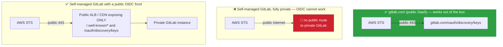
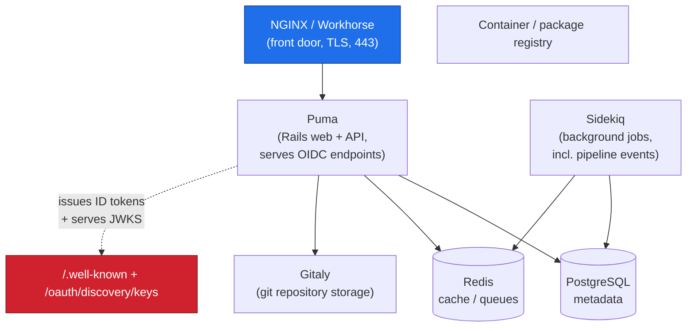
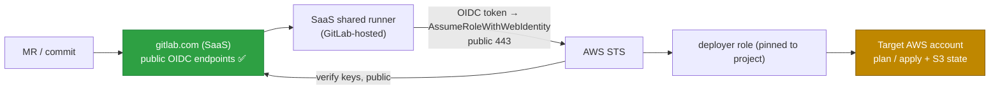
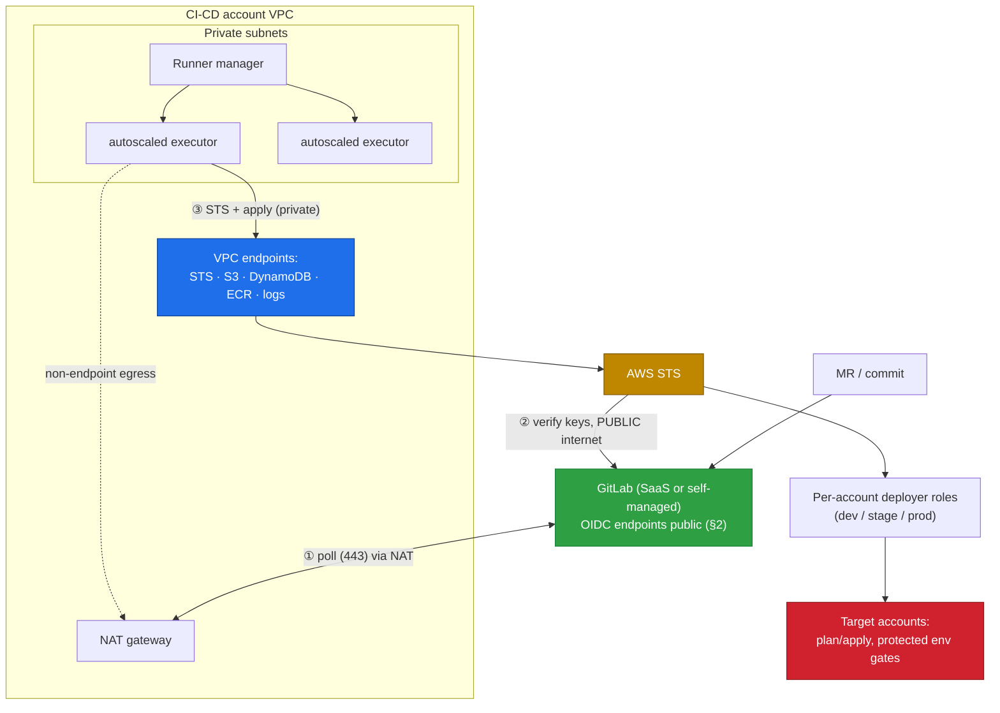

# GitLab Deployment Architecture — Components, Connectivity, POC vs Production

**Series:** DevOps Architecture — CI/CD on AWS with GitLab
**Document 6 — Deployment & network architecture**
**Audience:** Platform / DevOps engineers, cloud architects
**Status:** Draft
**Prerequisites:** Doc 3 (GitLab machinery), Doc 4 (OIDC)

---

## 0. Where this document sits

Doc 3 described GitLab's *logical* machinery (stages, runners, environments) and Doc 4 the *auth* model (OIDC). This document is about the **physical/network deployment**: what components actually run, and — the part that trips everyone up — **which network paths must be open in which direction** for OIDC to work at all.

We then give two concrete blueprints: a **POC** you can stand up in an afternoon, and a **production-grade** architecture you can operate for years.



---

## 1. The mental model: three connectivity flows

Almost every GitLab-on-AWS networking problem is one of exactly **three flows** being blocked or pointed the wrong way. Internalize this diagram and the rest follows.



- **Flow ① Runner → GitLab.** The runner *pulls* work: it long-polls the GitLab coordinator over HTTPS (443) and uploads job logs/artifacts back. **Runner initiates; GitLab never connects inbound to the runner.** This is why runners can live in a private subnet.
- **Flow ② AWS STS → GitLab OIDC endpoint.** When a job calls `AssumeRoleWithWebIdentity`, **AWS STS must fetch GitLab's public signing keys (JWKS) to verify the token's signature.** This call is made *by AWS's managed STS service, from AWS, over the public internet* — not from your VPC. (Covered in depth in §2 — it is the #1 gotcha.)
- **Flow ③ Runner → AWS.** The runner calls STS to swap its OIDC token for temporary credentials (Doc 4), then calls AWS service APIs and the S3 state backend to run `terraform apply`. Outbound HTTPS (443), routable over the internet **or** privately via VPC endpoints.

Everything else — POC vs prod — is just *where you place the runner* and *how you route these three flows*.

---

## 2. The critical constraint: AWS STS must reach GitLab's OIDC endpoint publicly

This is the single most common reason a working-on-paper OIDC setup fails in practice, so it gets its own section.

To validate a job's ID token, AWS STS retrieves GitLab's OpenID configuration and its **JWKS** (the public keys that prove the JWT was signed by GitLab):

- Discovery: `https://<gitlab-host>/.well-known/openid-configuration`
- Keys (JWKS): `https://<gitlab-host>/oauth/discovery/keys`

STS makes these calls **from the AWS service side, over the public internet.** There is no VPC endpoint, PrivateLink, or peering that routes STS's metadata fetch through *your* network — STS is a shared AWS service and egresses to the internet to reach the issuer.



The implications by GitLab hosting choice:

- **gitlab.com (SaaS):** the OIDC endpoints are already public and internet-reachable by AWS. **Nothing to do** — this is why SaaS is the fastest path to a working POC.
- **Self-managed GitLab on a public URL:** already works, but restrict/monitor exposure.
- **Self-managed GitLab that is fully private (no public endpoint):** OIDC federation **will not work** as-is. You must expose *at minimum* the discovery + JWKS paths through a public ALB/API Gateway/CDN, even while keeping the git/web UI private. Those two endpoints are read-only public metadata by design, so exposing just them is acceptable.

> **One-line takeaway:** the runner can be as private as you like; **GitLab's OIDC metadata endpoints cannot be.** If AWS can't fetch the keys, every `AssumeRoleWithWebIdentity` fails with an invalid-identity-token error.

Quick verification from anywhere with internet access (this is essentially what STS does):

```bash
curl -s https://gitlab.com/.well-known/openid-configuration | jq .jwks_uri
curl -s https://gitlab.com/oauth/discovery/keys | jq '.keys | length'   # >0 means reachable
```

---

## 3. GitLab architecture components, in detail

### 3a. Control plane (the GitLab server)

On **gitlab.com** these are fully managed — you consume them and skip operating them. They matter when you run **self-managed** GitLab. The front door and the OIDC endpoints are the parts that intersect this series.



The one component that must be *publicly reachable by AWS* is whatever fronts the **OIDC endpoints** (NGINX/Workhorse → Puma). Everything else (Gitaly, PostgreSQL, Redis, Sidekiq) is internal.

### 3b. Execution plane (GitLab Runner)

The runner is two logical roles, whichever executor you pick:

- **Runner manager** — the `gitlab-runner` process that registers with GitLab, long-polls for jobs (Flow ①), and dispatches them. Holds the runner authentication token; needs egress to GitLab only.
- **Executor** — *where the job actually runs.* This is the axis that scales:

| Executor | Job isolation | Scaling | Typical use |
|---|---|---|---|
| **Shell** | none (runs on host) | manual | quick POC only |
| **Docker** | container per job | fixed pool | small/medium |
| **Docker-autoscaler** | container on on-demand EC2 | scale to zero | cost-efficient prod |
| **Kubernetes** | pod per job | HPA / cluster autoscaler | large scale |

The manager can be tiny; the executors are the fleet that grows and shrinks. For infra pipelines the executor is what assumes the AWS role and runs `terraform` (Flow ③), so **executor placement = what AWS the pipeline can reach.**

---

## 4. POC architecture — fastest to a working pipeline

**Goal:** prove the end-to-end plan/apply/OIDC loop with the least moving parts, ideally in an afternoon. Optimize for zero networking work.

**Choices that make it fast:**

- **Use gitlab.com SaaS** → Flow ② is solved for free (public OIDC endpoints).
- **Use GitLab-hosted SaaS runners** (or one small runner on a public-subnet EC2 if you need VPC reach) → no VPC, NAT, or PrivateLink to build. Flows ① and ③ ride the public internet.
- **One or two AWS accounts**, one IAM OIDC provider for `gitlab.com`, one deployer role with a trust policy pinned to your project (never wildcard — Doc 4 §7), permissions scoped to what the POC provisions.
- **S3 + DynamoDB state backend** reachable over the internet (default).



**What you deliberately skip for now:** VPC, private subnets, NAT gateways, VPC endpoints, self-hosted runner fleet, multi-account org, protected environments. None are needed to prove the loop.

**POC build checklist (roughly in order):**

1. Create the IAM **OIDC identity provider** for `https://gitlab.com` in the target account.
2. Create a **deployer role**; trust policy `StringLike` on `sub` pinned to `project_path:<group>/<project>:ref_type:branch:ref:main` and `aud = https://gitlab.com`.
3. Add a minimal `.gitlab-ci.yml` with an `id_tokens` block (Doc 4 §3) and a `plan`/`apply` job.
4. Point Terraform at an S3 backend + DynamoDB lock table.
5. Run the pipeline; confirm `apply` assumes the role. **Then test the negative case** — a feature branch should be *denied* the role.

> **Caveat:** SaaS runners run outside your network, so they can't reach private VPC resources. If your POC needs to touch private subnets, swap the SaaS runner for a single Docker-executor runner on a public-subnet EC2 in the target VPC — still no NAT/PrivateLink required. Everything else stays the same.

---

## 5. Production-grade architecture

**Goal:** least-privilege, private, autoscaling, observable, and multi-account — the architecture from Docs 2–4 made physical.

**Key decisions:**

- **Self-hosted runners in private subnets** of the CI-CD / Shared Services account VPC (Doc 2, Doc 3 §3). Executor = **docker-autoscaler** or **Kubernetes** so capacity scales to zero when idle.
- **Egress for Flows ① and ③:**
  - Flow ① (runner → gitlab.com): via a **NAT gateway** (or private peering if self-managed GitLab lives in your network).
  - Flow ③ (runner → AWS): prefer **VPC endpoints (PrivateLink)** for STS, plus **gateway endpoints** for S3 and DynamoDB, so credential exchange, service calls, and state traffic never touch the public internet. NAT covers anything without an endpoint.
- **Flow ② (STS → GitLab OIDC): still public.** With gitlab.com it's automatic. With **self-managed GitLab**, expose only `/.well-known/*` and `/oauth/discovery/keys` through a public ALB/CDN (§2) while the rest of GitLab stays private.
- **Per-account OIDC providers and least-privilege roles**, trust pinned to protected branch + protected environment (Doc 4 §§6–7), **short session durations + permission boundaries** (Doc 4 §8).
- **HA + observability:** runners across AZs, autoscaling policies, CloudWatch/metrics on the runner fleet, CloudTrail attribution via session names.



Note the asymmetry that surprises people: even in a fully private, PrivateLink-everywhere design, **Flow ② remains a public path** because it is AWS's STS reaching *out* to GitLab — you can't pull it inside your VPC. You secure it by exposing *only* the metadata endpoints, not by hiding them.

---

## 6. Connectivity / firewall reference

The whole architecture as a rules table — useful for security review and troubleshooting:

| # | Flow | Initiator | Target | Port | POC | Production |
|---|---|---|---|---|---|---|
| ① | Poll jobs, upload logs/artifacts | Runner | GitLab | 443 | Internet (SaaS runner) | NAT (or private peering) |
| ② | Verify OIDC token (fetch JWKS) | **AWS STS** | **GitLab OIDC endpoint** | 443 | Public (gitlab.com) | **Public — must stay reachable** |
| ③a | AssumeRoleWithWebIdentity | Runner | AWS STS | 443 | Internet | VPC endpoint (PrivateLink) |
| ③b | Provision resources | Runner | AWS service APIs | 443 | Internet | VPC endpoints / NAT |
| ③c | Read/write state | Runner | S3 + DynamoDB | 443 | Internet | S3/DynamoDB gateway endpoints |
| — | GitLab → Runner | *(none)* | *(none)* | — | Not required | Not required |

Two rules to memorize: **(a) runners only ever make outbound connections** — never open inbound to them; **(b) Flow ② is always public and always AWS-initiated** — it's the one path you cannot privatize.

---

## 7. From POC to production — the migration path

You don't rebuild; you evolve, one flow at a time:


Flow ② (STS → GitLab public) never changes across this path — which is exactly why starting on gitlab.com keeps every later step about *your* network, never about GitLab's reachability.

---

## 8. Design principles this leads to

1. **Reduce every networking question to the three flows.** Runner→GitLab (①), STS→GitLab OIDC (②), Runner→AWS (③). If OIDC fails, it is almost always ②.
2. **GitLab's OIDC metadata must be publicly reachable by AWS.** SaaS gives this free; a private self-managed GitLab must publish just `/.well-known/*` and `/oauth/discovery/keys`.
3. **Runners are outbound-only; keep them private in production.** GitLab never needs inbound access to your VPC.
4. **Start on gitlab.com + SaaS runners for the POC.** Zero networking; prove the OIDC loop first, including the negative (feature-branch denied).
5. **Privatize Flow ③ with VPC endpoints in production** (STS, S3, DynamoDB) — but accept Flow ② stays public.
6. **Evolve POC → prod one flow at a time.** No rebuild; each step privatizes or hardens a single path.

> **Relation to the rest of the series:** this is the physical grounding of Doc 3 (runners) and Doc 4 (OIDC). Combine with Doc 2 for the multi-account placement and Doc 5 for how environments map onto the target accounts these runners reach.
