# DevOps Architecture — CI/CD on AWS with GitLab
## Complete Guide (Documents 1–5, combined)

*Single-file edition. Every Mermaid diagram renders on GitLab/GitHub. For the split version and reading guide, see `00-index.md`.*

---

## Table of Contents

1. [Infra CI/CD Foundations](#part-1--cicd-for-aws-infrastructure-provisioning)
2. [Multi-Account AWS with GitLab](#part-2--multi-account-aws-cicd-with-gitlab)
3. [GitLab Architecture](#part-3--gitlab-architecture-for-infrastructure-cicd)
4. [AWS ↔ GitLab OIDC Integration](#part-4--aws--gitlab-integration-with-oidc)
5. [Real-World Patterns: Environments & Accounts](#part-5--real-world-patterns-environments--aws-account-mapping)

---


# Part 1 — CI/CD for AWS Infrastructure Provisioning

**Series:** DevOps Architecture — CI/CD on AWS with GitLab
**Document 1 of N — Foundations**
**Audience:** Platform / DevOps engineers, cloud architects
**Status:** Draft

---

## 0. Where this document sits

This is the first document in a series. Its only job is to establish a precise mental model of what CI/CD *means* when the artifact you are shipping is **infrastructure**, not application code — and why that changes almost every assumption you carry over from app CI/CD.

Everything later in the series builds on the vocabulary and the failure modes described here.

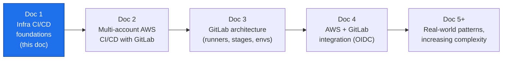

---

## 1. What CI/CD actually is (stripped to essentials)

CI/CD is a discipline, not a tool. Two ideas:

- **Continuous Integration (CI):** every change is merged into a shared mainline frequently, and each change is *automatically validated* — built, linted, tested — so integration problems surface in minutes, not at a big-bang merge.
- **Continuous Delivery / Deployment (CD):** every validated change is automatically promoted through environments toward production. *Delivery* stops at a manual approval gate; *Deployment* removes even that gate.

The pipeline is just the automation that carries a change from a commit to a running system, applying quality gates along the way. What differs — dramatically — is **what the pipeline produces and what "deploy" does to the world.**

---

## 2. The core distinction: mutable artifacts vs. desired-state convergence

In **software CI/CD** the pipeline produces an **immutable artifact** (a container image, a JAR, a binary, a Lambda zip). "Deploy" means: take this artifact and run copies of it. The artifact is self-contained and stateless; if a deploy goes wrong you roll forward or roll back by pointing at a different artifact version.

In **infrastructure CI/CD** the pipeline does not produce a runnable artifact. It produces a **declaration of desired state** (Terraform/OpenTofu HCL, CloudFormation, CDK-synthesized templates, Pulumi programs). "Deploy" means: **compare desired state against the actual live cloud, compute a diff, and mutate real, stateful, shared resources to converge them.**

This single difference is the source of every other difference below.

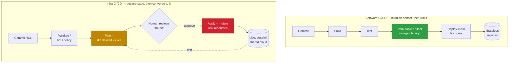

---

## 3. The anatomy of an infrastructure pipeline

An IaC pipeline (Terraform-flavored, but the shape generalizes) has a characteristic set of stages. Note the **plan / approval / apply** split — it has no clean analogue in app CI/CD.

```mermaid
flowchart LR
    A[Commit / MR] --> B["fmt + validate<br/>(syntax, style)"]
    B --> C["Static security<br/>tflint · checkov ·<br/>tfsec · trivy"]
    C --> D["Policy as code<br/>OPA / Sentinel<br/>(guardrails)"]
    D --> E["terraform plan<br/>→ saved plan file"]
    E --> F["Post plan diff<br/>to the MR"]
    F --> G{{"Manual approval<br/>gate"}}
    G -->|approved| H["terraform apply<br/>(the saved plan)"]
    H --> I["Smoke / post-<br/>deploy checks"]
    I --> J["Update state +<br/>outputs"]

    style E fill:#bf8700,stroke:#7d5700,color:#fff
    style G fill:#8250df,stroke:#4c2889,color:#fff
    style H fill:#cf222e,stroke:#8b1a1a,color:#fff
```

Key mechanics an architect must internalize:

- **Plan and apply are separate jobs.** CI runs `plan` on the merge request so reviewers see the exact diff *before* anything changes. `apply` runs only after merge, and should apply the **saved plan artifact** from the plan stage — not re-plan — so what was reviewed is exactly what executes.
- **The plan output is the review artifact.** In app CI, reviewers read code. In infra CI, reviewers also read the *plan*: "3 to add, 1 to change, 1 to destroy." That `destroy` line is where careers are made or ended.
- **Guardrails run as code, not as tickets.** Policy-as-code (OPA/Conftest, Sentinel) rejects a plan that, say, opens `0.0.0.0/0` on port 22 or provisions an untagged resource — automatically, every time.

---

## 4. State — the thing software CI/CD doesn't have

Infrastructure tools keep a **state file**: a mapping between the resources declared in code and the real resources' identifiers in the cloud. State is what lets `plan` compute a diff. It is also the single most dangerous object in the whole system.

- State must live in **remote, versioned, encrypted backend** (e.g., S3 with versioning + a DynamoDB lock table, or Terraform Cloud, or GitLab-managed state).
- State must be **locked** during apply so two pipelines can't mutate the same resources concurrently and corrupt each other.
- State contains **secrets in plaintext** (DB passwords, generated keys) — so backend access is a top-tier security boundary.
- Losing or corrupting state is worse than losing code: the code you can re-commit; a broken state can orphan or duplicate live production resources.

Software CI/CD has nothing equivalent. A container image has no "state file"; two deploys of the same image don't corrupt each other. This is why concurrency, locking, and backend design are first-class concerns in infra pipelines and afterthoughts in app pipelines.

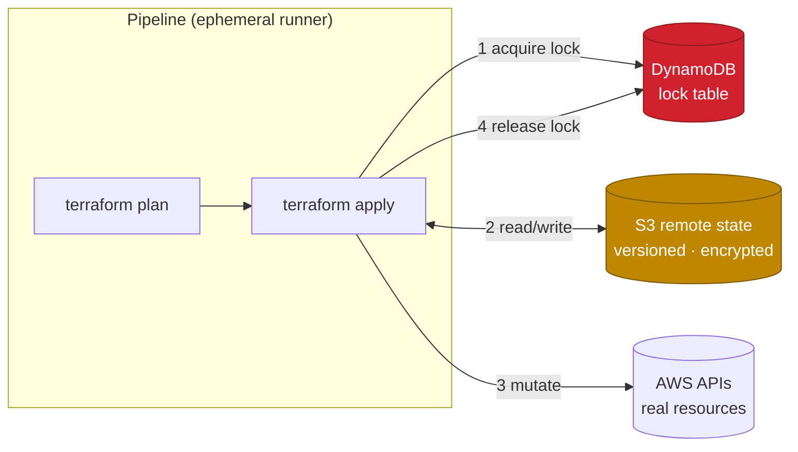

---

## 5. Drift — the world changes underneath you

An application artifact doesn't change once built. Infrastructure does: someone makes an emergency change in the AWS console, an autoscaler adds nodes, AWS deprecates an AMI. The live world **drifts** away from what the code declares.

Infra CI/CD therefore needs a capability app CI/CD never needs: **drift detection.** A scheduled pipeline runs `plan` against production on a cadence; a non-empty plan means reality no longer matches code, and someone must reconcile — either import the manual change into code, or let the pipeline revert it.

The philosophical stance an architect must set: **code is the source of truth, the console is read-only.** Every out-of-band change is a defect, and drift detection is how you find those defects.

---

## 6. Blast radius, rollback, and why "just redeploy" doesn't work

Rollback is where the two worlds diverge most sharply.

| Dimension | Software CI/CD | Infrastructure CI/CD |
|---|---|---|
| Unit of change | Immutable artifact version | Diff against live state |
| Rollback | Redeploy previous artifact — fast, safe, near-instant | Apply previous code — **may not reverse the effect** |
| Data safety | Artifacts are stateless | Resources may hold data; `destroy` can be irreversible |
| Blast radius | Usually one service | Can span networking, IAM, DNS — cross-cutting |
| Idempotency | Re-running = same result | Re-running converges, but *order & dependencies* matter |
| Speed of a bad change | Seconds of degraded service | Can delete a database or detach a subnet |

The critical trap: **reverting the code does not always revert the world.** If a merge deleted an RDS instance, reverting the commit and applying does not bring the data back — the resource (and its data) is gone. If a change recreated a resource with a new ID, dependent resources may now point at nothing. This is why the *plan review*, *policy guardrails*, and *`prevent_destroy` / deletion protection* matter far more than any rollback button.

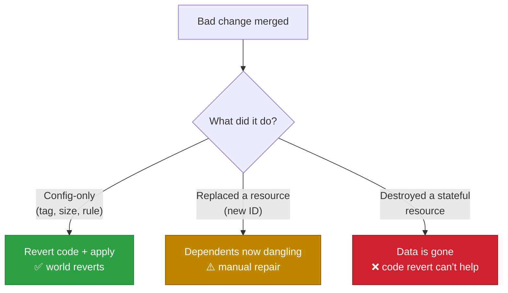

---

## 7. Testing: you cannot unit-test a VPC the way you unit-test a function

App testing is a mature pyramid: many fast unit tests, fewer integration tests, a handful of end-to-end tests, all runnable on the developer's laptop with no external dependencies.

Infra testing is inverted and harder, because the "unit" only becomes real when it touches a cloud API that costs money and takes minutes to converge.

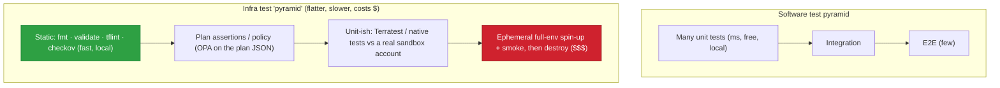

The practical consequence: infra pipelines lean **heavily on the cheap left side** (static analysis, plan-time policy checks against the plan JSON) because the right side (spinning up real resources with Terratest, then destroying them) is slow, costly, and flaky. Architects design pipelines to push as much confidence as possible into static and plan-time gates.

---

## 8. The side-by-side summary

```mermaid
flowchart LR
    subgraph A["Software CI/CD"]
        a1["Artifact: immutable image/binary"]
        a2["Deploy: run copies"]
        a3["No state file"]
        a4["Rollback: repoint to old version"]
        a5["No drift"]
        a6["Blast radius: one service"]
        a7["Test: fast local pyramid"]
    end
    subgraph B["Infrastructure CI/CD"]
        b1["Artifact: desired-state declaration"]
        b2["Deploy: diff + mutate live cloud"]
        b3["State file = source of mapping"]
        b4["Rollback: may be irreversible"]
        b5["Drift detection required"]
        b6["Blast radius: cross-cutting"]
        b7["Test: slow, costs money"]
    end
    A ~~~ B
```

| Concern | Software CI/CD | Infrastructure CI/CD |
|---|---|---|
| **Output of pipeline** | Immutable, runnable artifact | Desired-state declaration (no runnable artifact) |
| **Meaning of "deploy"** | Run N copies of the artifact | Compute a diff and mutate live, shared resources |
| **Human-in-the-loop** | Optional; often fully automated | The **plan review + approval** is central |
| **State** | None (stateless artifacts) | Explicit, locked, encrypted remote state |
| **Concurrency** | Independent deploys are safe | Must serialize via locks or you corrupt state |
| **Drift** | N/A | First-class: scheduled detection + reconcile |
| **Rollback** | Fast, safe, redeploy old version | Often impossible to reverse (data loss, new IDs) |
| **Idempotency** | Restart = same running artifact | Converges, but ordering/dependencies matter |
| **Testing** | Fast, free, local, high coverage | Slow, costs money, static/plan-time heavy |
| **Secrets** | In vault, injected at runtime | Also embedded in **state** — extra exposure |
| **"Source of truth"** | The repo | The repo **and** the live cloud must be kept equal |

---

## 9. Design principles this leads to (the takeaways)

These are the rules the rest of the series assumes:

1. **Code is the only source of truth; the console is read-only.** Everything else (drift detection, guardrails) exists to enforce this.
2. **Separate `plan` from `apply`, and apply the reviewed plan.** Never let apply re-plan and execute something a human never saw.
3. **State is a security and reliability boundary.** Remote, versioned, encrypted, locked — one backend per environment, isolated.
4. **Push confidence left.** Maximize static analysis and plan-time policy; minimize reliance on expensive live-resource tests.
5. **Guardrails as code, not as review etiquette.** Policy engines reject dangerous plans automatically.
6. **Design for irreversibility.** `prevent_destroy`, deletion protection, and required approvals on destructive diffs — because rollback may not save you.
7. **Least-privilege, short-lived credentials for the pipeline.** (Detailed in Doc 4: GitLab → AWS via OIDC, no long-lived keys.)
8. **Isolate blast radius by boundaries** — environment, account, and state. (This is exactly what Doc 2 scales up into a multi-account topology.)

---

## 10. What comes next in the series

- **Doc 2 — Multi-account AWS CI/CD with GitLab.** How the plan/apply model maps onto separate AWS accounts (management, security, shared-services, dev/stage/prod), why account boundaries are the strongest blast-radius control, and how one GitLab pipeline promotes across them.
- **Doc 3 — GitLab architecture.** Runners (shared vs. group vs. project, and self-hosted in a VPC), stages, environments, protected branches, and CI/CD variable scoping — the machinery that executes everything above.
- **Doc 4 — AWS ↔ GitLab integration.** OIDC federation so runners assume IAM roles with **no long-lived keys**, per-account role design, and trust policies scoped to branch/environment.
- **Doc 5+ — Real-world patterns, increasing complexity.** Reusable modules, environment promotion, ephemeral environments per MR, monorepo vs. polyrepo for infra, and progressive-delivery for infrastructure.

> **Reading note:** if a term here felt hand-wavy (OIDC, runners, protected environments), that's deliberate — it's defined where it's used, in Docs 3 and 4. Doc 1 is about the *why*; the mechanics follow.


<div style="page-break-after: always;"></div>

---


# Part 2 — Multi-Account AWS CI/CD with GitLab

**Series:** DevOps Architecture — CI/CD on AWS with GitLab
**Document 2 of N — The multi-account topology**
**Audience:** Platform / DevOps engineers, cloud architects
**Status:** Draft
**Prerequisite:** Doc 1 (Infra CI/CD foundations) — plan/apply split, state, blast radius

---

## 0. Where this document sits

Doc 1 established *why* infrastructure CI/CD is different: the pipeline mutates live, shared, stateful resources rather than running copies of an artifact. Its final principle was **isolate blast radius by boundaries — environment, account, and state.**

This document scales that single principle up. The strongest blast-radius boundary AWS gives you is the **account**, and a serious platform runs many of them. Here we cover the account topology, and how *one* GitLab pipeline reaches into many accounts to plan, apply, and promote — safely.

We deliberately defer two things: the *machinery* of GitLab (runners, stages, environments) is Doc 3, and the *credential mechanism* (OIDC, no long-lived keys) is Doc 4. Here we assume "the pipeline can assume a role in a target account" and focus on the **topology**.

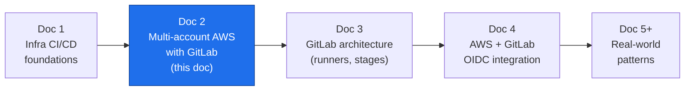

---

## 1. Why more than one account

A single AWS account is one flat security and billing boundary. Everything in it can, in principle, reach everything else, and a mistake anywhere is a mistake everywhere. Multiple accounts convert soft, policy-based separation into **hard, structural separation**.

The reasons stack up:

- **Blast radius.** A destructive `apply`, a leaked credential, or a runaway resource is contained to one account. `prod` cannot be harmed by a mistake in `dev` because they are different accounts, not different tags.
- **Security isolation.** IAM does not span accounts by default. Cross-account access must be *explicitly* granted via role trust. The default is deny.
- **Blast radius for credentials.** A pipeline credential scoped to the `dev` account simply cannot touch `prod`. This is the property Doc 4's OIDC design leans on.
- **Billing and quotas.** Cost is attributable per account with no tagging discipline required; service quotas (a per-account limit) don't let a noisy `dev` starve `prod`.
- **Compliance.** Regulated workloads (PCI, HIPAA) live in dedicated accounts with their own controls, cleanly auditable in isolation.

The trade-off is operational overhead: many accounts means many baselines to keep consistent. That is exactly what a **landing zone** (AWS Control Tower or a Terraform equivalent) automates.

---

## 2. The account topology (AWS Organizations)

AWS Organizations groups accounts into **Organizational Units (OUs)** under a root, with the **management account** at the top. **Service Control Policies (SCPs)** attach to OUs as *guardrails* — they set the maximum permissions any principal in those accounts can ever have, independent of IAM.

A conventional landing-zone layout:

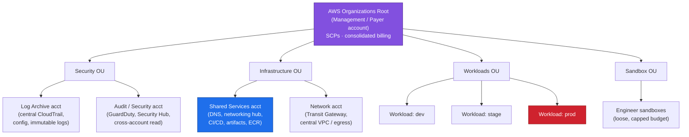

The account that matters most for CI/CD is **Shared Services** (sometimes a dedicated "Tooling" or "CI/CD" account). It is where the pipeline's identity, the Terraform state backend, artifact registries, and often the self-hosted GitLab runners live. It is the hub; the workload accounts are spokes.

> **Rule of thumb:** one account **per environment per workload domain**, not one account for everything. `dev`/`stage`/`prod` as separate accounts is the minimum; large orgs split further by business unit or product.

---

## 3. The central question: where does the pipeline run vs. what does it change?

In a single account these are the same place. In multi-account they are deliberately different, and keeping them straight is the whole game.

- **Execution context** — *where the runner runs and whose identity it starts with.* This is the Shared Services / CI-CD account. The runner authenticates to GitLab, checks out code, and holds a base identity.
- **Target context** — *the account whose resources a given job will mutate.* For a `prod` apply, the target is the `prod` account.

The bridge between them is **cross-account role assumption**. The pipeline's base identity in the CI-CD account calls `sts:AssumeRole` into a purpose-built role in the target account. That target role trusts the CI-CD identity and carries the least-privilege permissions needed for that environment. The SCP on the target's OU caps what even that role can do.

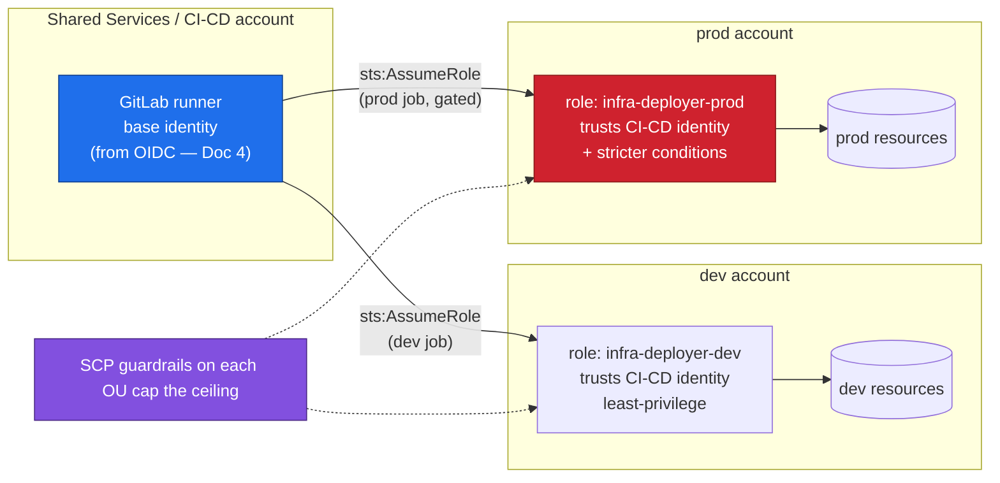

Three layers of defense are stacked here, which is the point: the **trust policy** decides *who* may assume the role, the **role's IAM policy** decides *what* it can do, and the **SCP** decides the *maximum* anything in that account may ever do. A misconfigured pipeline still can't exceed the SCP ceiling.

---

## 4. State topology in a multi-account world

Doc 1 said state must be remote, versioned, encrypted, and locked. Multi-account raises the question: *how many state backends, and where?*

Two viable patterns:

**A. Centralized state backend (common).** One S3 bucket + DynamoDB lock table in the **CI-CD / Shared Services** account, holding state for all environments, separated by **key prefix** (e.g., `dev/network/terraform.tfstate`, `prod/network/terraform.tfstate`). Simpler to operate; the CI-CD account becomes the crown-jewel to protect.

**B. State-per-account (stronger isolation).** Each workload account owns its own state backend. Matches the blast-radius philosophy most purely — losing/corrupting `dev` state can't touch `prod` state — at the cost of more backends to bootstrap and manage.

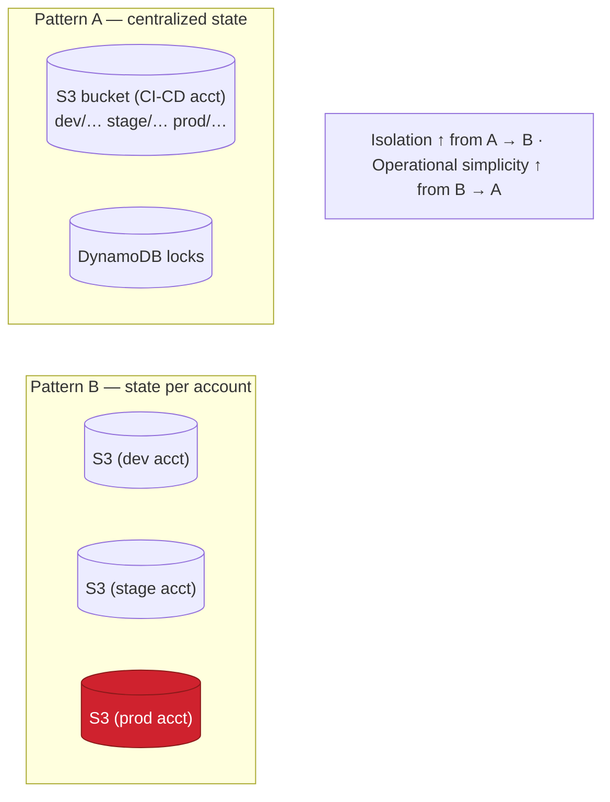

Whichever you choose, two rules are non-negotiable: **state is always separated per environment** (never one state object spanning dev+prod), and **the apply job for an environment only ever has credentials for that environment.** A `prod` apply must be structurally unable to open `dev` state and vice-versa.

Independently, **split state by domain within an environment** — network, data, platform, app — so a change to the app layer never locks or risks the network layer. Small blast radii compound.

---

## 5. Promotion: one pipeline, many accounts

The defining behavior of multi-account CI/CD is **promotion**: the same version of infrastructure code flows dev → stage → prod, applied into a *different account* at each step, with the gates getting stricter as it approaches production.

```mermaid
flowchart LR
    mr["MR opened"] --> validate["validate · lint ·<br/>policy (OPA/Sentinel)"]
    validate --> pdev["plan → dev"]
    pdev --> merge{{"Merge to main<br/>(review the diff)"}}
    merge --> adev["apply → dev acct<br/>(auto)"]
    adev --> smoke1["smoke tests (dev)"]
    smoke1 --> pstg["plan → stage"]
    pstg --> gate1{{"manual approve"}}
    gate1 --> astg["apply → stage acct"]
    astg --> smoke2["smoke tests (stage)"]
    smoke2 --> pprd["plan → prod"]
    pprd --> gate2{{"protected env approval<br/>+ change window"}}
    gate2 --> aprd["apply → prod acct"]
    aprd --> verify["post-deploy verify<br/>+ drift baseline"]

    style adev fill:#2ea043,stroke:#1a7f37,color:#fff
    style astg fill:#bf8700,stroke:#7d5700,color:#fff
    style aprd fill:#cf222e,stroke:#8b1a1a,color:#fff
    style gate2 fill:#8250df,stroke:#4c2889,color:#fff
```

The properties that make this trustworthy:

- **Same code, per-environment inputs.** One module/codebase; the environment is chosen by a variable/workspace/`tfvars` file, not by branching. dev and prod diverge only in *values* (sizes, counts, CIDRs), never in *logic*. This is what makes "it worked in stage" meaningful.
- **Each stage targets its own account** by assuming that account's role — so a `stage` job simply has no path to `prod`.
- **Gates escalate.** dev may auto-apply; prod sits behind a **protected environment** requiring specific approvers, and often a change window. (Protected environments and approvals are Doc 3.)
- **Promote the *reviewed plan*, not a re-plan.** As in Doc 1: each apply consumes the saved plan artifact produced for that environment.

A subtle but important point: **stage is only a valid rehearsal for prod if the accounts are structurally similar.** Same module versions, same SCP shape, same networking pattern — differing only in scale. Divergence between stage and prod is where "passed in stage, broke in prod" incidents come from.

---

## 6. Cross-cutting concerns that span accounts

Some infrastructure is inherently shared and doesn't belong to any single workload account. It lives in the Infrastructure OU and is consumed by the others:

- **Networking.** A central Transit Gateway / hub-VPC in the Network account, with workload VPCs attaching to it. The CI/CD pipeline for networking runs against the Network account; workload pipelines *reference* its outputs (via remote state data sources or SSM parameters) rather than recreating them.
- **DNS.** A parent hosted zone in Shared Services delegates subdomains to per-environment zones.
- **Artifacts / images.** A central ECR / package registry in Shared Services, with workload accounts granted pull access cross-account.
- **Security tooling.** GuardDuty, Security Hub, and Config aggregate *into* the Audit account read-only across the org.

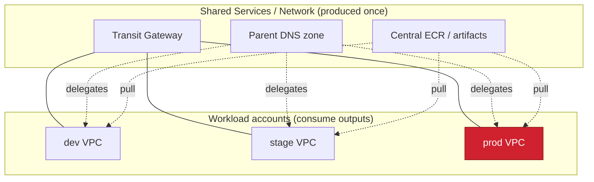

The dependency direction matters for pipeline ordering: **shared/foundational infra is applied first and changes rarely; workload infra consumes it and changes often.** Treat the shared layer's outputs as a contract, and version changes to it carefully — a breaking change there ripples into every consumer.

---

## 7. Reference end-to-end picture

Bringing execution context, target accounts, state, and promotion together:

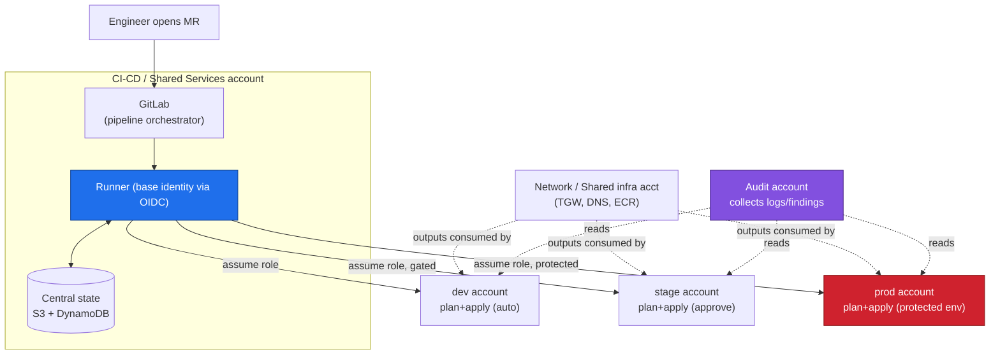

---

## 8. Design principles this leads to

1. **The account is your strongest blast-radius boundary.** Use it: one account per environment (at minimum), separated by OU with SCP guardrails.
2. **Separate execution context from target context.** The pipeline runs in the CI-CD account and *assumes into* target accounts — it never holds standing credentials for many accounts at once.
3. **Stack three permission layers:** trust policy (who), role policy (what), SCP (ceiling). Assume every layer above may be misconfigured and let the one below still contain the damage.
4. **State is isolated per environment, and ideally per account.** An environment's apply job can only reach its own state and its own resources.
5. **Promote the same code with per-environment values, targeting a different account each step,** with gates escalating toward prod.
6. **Keep stage structurally identical to prod.** Divergence defeats the purpose of promotion.
7. **Foundational/shared infra is a versioned contract** applied first and consumed by workloads — change it deliberately.

---

## 9. What comes next

- **Doc 3 — GitLab architecture.** The machinery assumed here: runners (shared vs. self-hosted in the CI-CD VPC), pipeline **stages**, GitLab **environments** and **protected environments**, approval rules, and CI/CD variable scoping per environment. This is *how* the promotion flow and gates in §5 are actually built.
- **Doc 4 — AWS ↔ GitLab OIDC integration.** The "base identity" and "assume role" arrows in every diagram here, made concrete: GitLab as an OIDC identity provider in each AWS account, trust policies scoped to branch/environment, and **zero long-lived AWS keys** in GitLab.
- **Doc 5+ — Real-world patterns.** Reusable modules across accounts, ephemeral per-MR environments, monorepo vs. polyrepo for a multi-account estate, and drift detection at org scale.

> **Bridge to Doc 3:** every gate, approval, and "runner" in this document is a specific GitLab feature. Next we open that box.


<div style="page-break-after: always;"></div>

---


# Part 3 — GitLab Architecture for Infrastructure CI/CD

**Series:** DevOps Architecture — CI/CD on AWS with GitLab
**Document 3 of N — The GitLab machinery**
**Audience:** Platform / DevOps engineers, cloud architects
**Status:** Draft
**Prerequisites:** Doc 1 (Infra CI/CD foundations), Doc 2 (multi-account topology)

---

## 0. Where this document sits

Doc 2 kept saying "the runner assumes a role," "a manual approval gate," "a protected environment," "per-environment variables" — and deferred all of it here. This document opens that box. It is about the **GitLab mechanics** that actually execute the plan/apply/promote model.

We still defer *one* thing: how the runner gets an AWS identity with no long-lived keys. That is OIDC, and it is Doc 4. Here we assume "a job can obtain AWS credentials" and focus on GitLab's own moving parts.

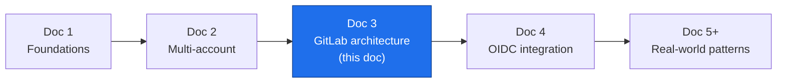

---

## 1. The GitLab object hierarchy

Before pipelines, understand where things live — because **permissions, runners, and variables all inherit down this tree.**

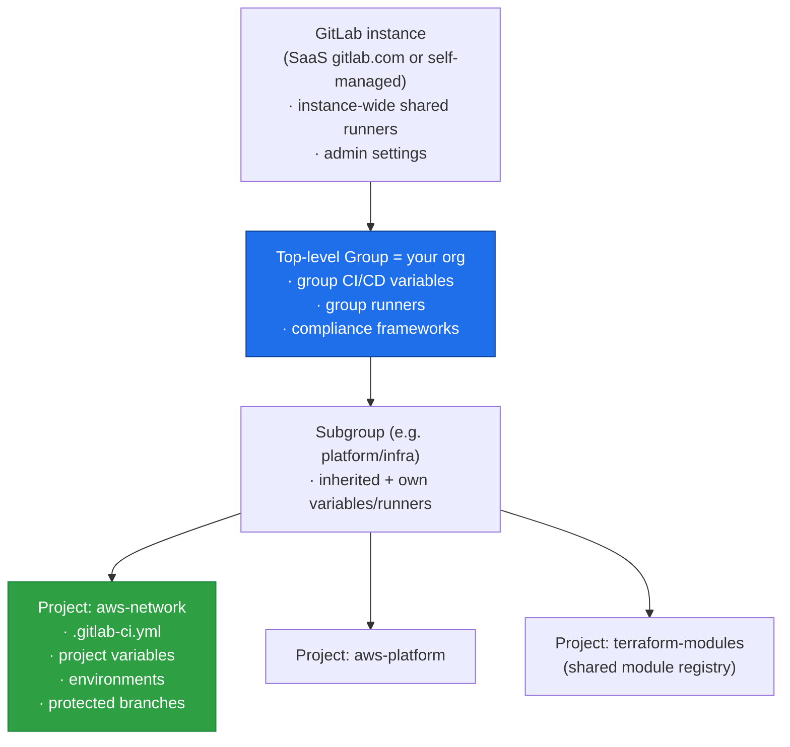

The architectural consequence: **define shared things high, specific things low.** AWS account IDs, common runner tags, and org-wide policy live as **group** variables and **group** runners; a project only adds what is unique to it. This is the GitLab-side mirror of Doc 2's "shared infra applied once, consumed by many."

Access is role-based (Guest → Reporter → Developer → Maintainer → Owner). For infra repos this matters: **who can approve a prod deployment** and **who can change protected variables** are Maintainer/Owner-level decisions, not Developer.

---

## 2. Pipeline anatomy: stages, jobs, and the `.gitlab-ci.yml`

A pipeline is defined in `.gitlab-ci.yml` at the repo root. It is a set of **jobs**, each assigned to a **stage**. Jobs in the same stage run in parallel; stages run in sequence. A job runs on a **runner**.

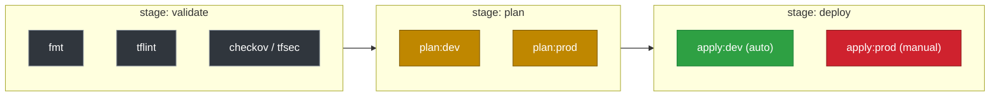

A minimal but realistic skeleton, showing the plan/apply split from Doc 1:

```yaml
stages: [validate, plan, deploy]

default:
  image: hashicorp/terraform:1.9
  tags: [aws, self-hosted]        # route to our runners (see §3)

variables:
  TF_ROOT: ${CI_PROJECT_DIR}/envs

# ---- reusable job template (hidden job, YAML anchor via extends) ----
.plan: &plan
  stage: plan
  script:
    - cd "${TF_ROOT}/${ENV}"
    - terraform init -backend-config="key=${ENV}/terraform.tfstate"
    - terraform plan -out=plan.cache
  artifacts:
    paths: [${TF_ROOT}/${ENV}/plan.cache]   # pass the reviewed plan forward
    expire_in: 1 day

.apply: &apply
  stage: deploy
  script:
    - cd "${TF_ROOT}/${ENV}"
    - terraform init -backend-config="key=${ENV}/terraform.tfstate"
    - terraform apply plan.cache            # apply the SAVED plan, never re-plan

plan:dev:  { <<: *plan,  variables: { ENV: dev } }
apply:dev: { <<: *apply, variables: { ENV: dev },  environment: { name: dev },
             needs: ["plan:dev"] }          # auto after plan
```

Three mechanics an architect leans on constantly:

- **`rules:` control *whether* a job runs** — on an MR, only on `main`, only when files under `envs/prod/**` changed, etc. This is how a change to the network module doesn't needlessly re-plan every workload.
- **`needs:` builds a DAG.** By default a job waits for its whole previous stage; `needs:` lets `apply:dev` start the instant `plan:dev` finishes, ignoring unrelated jobs. Infra pipelines with many environments get much faster this way.
- **`artifacts:` pass files between jobs** — critically, the **saved plan** from `plan:` to `apply:`, guaranteeing what was reviewed is what executes.

---

## 3. Runners — where jobs actually execute

A **runner** is the agent that picks up a job and runs it. This is the component most tied to Doc 2's topology, because *where the runner lives determines what it can reach.*

### Runner scope

- **Shared (instance) runners** — provided by GitLab, available to all projects. Fine for lint/test; **not** appropriate for infra apply, because they run outside your network and you don't control them.
- **Group runners** — registered to your org group, shared by its projects. The usual home for infra CI/CD runners.
- **Project runners** — bound to one project; used for specially privileged pipelines.

### Executors (how a job is isolated)

- **Docker** — each job in a fresh container; the common default.
- **Kubernetes** — jobs as pods; autoscaling; good at scale.
- **Shell** — runs directly on the host; avoid for untrusted code, but sometimes used for tightly controlled infra runners.
- **Docker-autoscaler / instance** — spin EC2 runners on demand, scale to zero when idle.

### The placement that matters

For a multi-account AWS estate, you **self-host runners inside the CI-CD / Shared Services account's VPC** (Doc 2's execution context). This gives you: private connectivity to internal endpoints, an egress identity you control, and — with OIDC (Doc 4) — the base identity that assumes into target accounts.

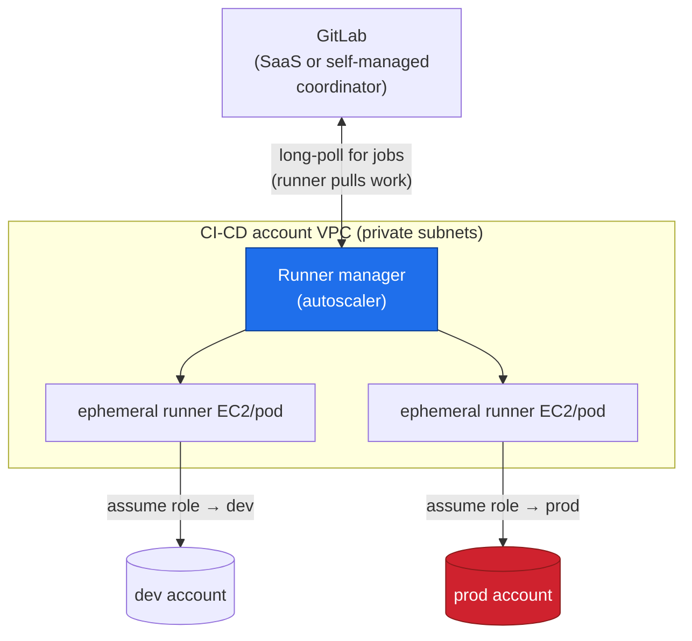

Note the direction: **runners pull jobs from GitLab** (outbound long-poll); GitLab never needs inbound access to your VPC. That property is what makes SaaS GitLab + private self-hosted runners a clean, common architecture.

**Tags** connect jobs to the right runners. A job with `tags: [aws, self-hosted]` only runs on runners registered with those tags — the mechanism that keeps an infra apply off a shared runner.

---

## 4. Environments — GitLab's model of "a place you deploy to"

An **environment** is a first-class GitLab object representing a target (dev, stage, prod). A job declares `environment: { name: prod }`, and GitLab then tracks **deployments** to it: what version is live, deployment history, and who deployed. This is what turns a pile of jobs into an auditable record of "what is in prod right now."

```yaml
apply:prod:
  <<: *apply
  variables: { ENV: prod }
  environment:
    name: prod
    action: start
  rules:
    - if: '$CI_COMMIT_BRANCH == "main"'
      when: manual        # requires a human to click "play"
  needs: ["plan:prod"]
```

Environments also carry **environment-scoped variables** (§6) and are the object that **protected environments** (§5) attach their approval rules to.

---

## 5. Gates: protected branches, protected environments, and approvals

This is the heart of infra safety in GitLab — the concrete form of Doc 1's "the plan review + approval is central" and Doc 2's "gates escalate toward prod."

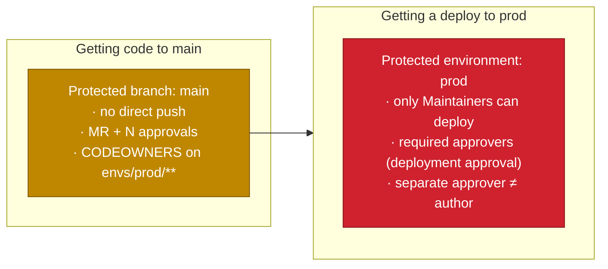

Three distinct controls, often confused, that stack:

- **Protected branch** governs *what gets into the code*. `main` requires a merge request, a minimum number of approvals, passing pipelines, and (via **CODEOWNERS**) sign-off from the infra owners when files under `envs/prod/**` change.
- **Protected environment** governs *who can run a deployment job* to that environment — restricting the `apply:prod` job to specific groups (e.g., Maintainers), regardless of who can merge.
- **Deployment approvals** add a *second human at deploy time*: even after `apply:prod` is triggered, it pauses until an authorized approver (who can be required to be different from the author) approves the deployment. This is your change-window / four-eyes control.

Layer these deliberately: merging code and deploying it to prod are **two separate authorizations**, and the person who wrote the change need not be the one who ships it.

---

## 6. CI/CD variables: scoping, protection, and precedence

Variables inject configuration and secrets into jobs. For a multi-account setup, **variable scoping is how one codebase targets many accounts** — the same `TF_VAR_*` or `AWS_ROLE_ARN` resolves to a different value per environment.

Attributes that matter:

- **Masked** — value hidden in job logs.
- **Protected** — only exposed to jobs on **protected** branches/tags. Prod role ARNs and any sensitive value should be *protected*, so an MR from a feature branch can never read them.
- **Environment-scoped** — a variable can be defined per environment (`AWS_ROLE_ARN` scoped to `prod` vs `dev`), so `apply:prod` and `apply:dev` transparently pick up different targets.

```yaml
# Defined in project/group settings, not in the YAML:
#   AWS_ROLE_ARN  scope=dev   value=arn:aws:iam::111...:role/infra-deployer-dev
#   AWS_ROLE_ARN  scope=prod  value=arn:aws:iam::999...:role/infra-deployer-prod  [protected]
#
# The job just references it; GitLab resolves by the job's environment:
apply:prod:
  environment: { name: prod }
  script:
    - echo "assuming ${AWS_ROLE_ARN}"   # resolves to the prod ARN, only on main
```

Precedence runs **narrow-overrides-broad**, roughly:

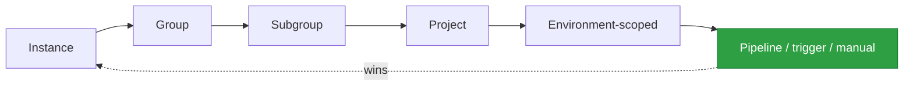

Architectural rule: **secrets never live in `.gitlab-ci.yml` or the repo.** They live as protected, masked variables (or better, are fetched at runtime from a secrets manager / provided by OIDC). The repo holds *logic and references*; the environment holds *values*.

---

## 7. Putting it together: the promotion pipeline from Doc 2, in GitLab terms

Doc 2 §5 showed a dev → stage → prod promotion. Here is how each abstract element maps to a concrete GitLab feature:

| Doc 2 concept | GitLab mechanism |
|---|---|
| "One codebase, per-env values" | One project; **environment-scoped variables** + per-env `tfvars` |
| "plan → dev" as a reviewable diff | `plan:` job on the MR, posting the diff; **artifact** = saved plan |
| "apply to dev (auto)" | `apply:dev` with `environment: dev`, runs on merge to `main` |
| "manual approve before stage" | `when: manual` + **protected environment** `stage` |
| "protected env approval for prod" | **Protected environment** `prod` + **deployment approvals** (four-eyes) |
| "each stage targets its own account" | `AWS_ROLE_ARN` **scoped per environment**; runner **assumes** that role |
| "runner in CI-CD account" | **self-hosted group runners** in the CI-CD VPC, selected by **tags** |
| "apply the reviewed plan" | `plan.cache` passed via **`artifacts`** into the `apply` job |

```mermaid
flowchart LR
    mr["MR"] -->|rules: MR| pdev["plan:dev"]
    pdev --> mergemain{{"merge to main<br/>(protected branch<br/>+ approvals + CODEOWNERS)"}}
    mergemain --> adev["apply:dev<br/>env=dev · auto"]
    adev --> pstg["plan:stage"]
    pstg --> astg["apply:stage<br/>env=stage · manual<br/>(protected env)"]
    astg --> pprd["plan:prod"]
    pprd --> aprd["apply:prod<br/>env=prod · manual<br/>protected env + approval"]

    style adev fill:#2ea043,stroke:#1a7f37,color:#fff
    style astg fill:#bf8700,stroke:#7d5700,color:#fff
    style aprd fill:#cf222e,stroke:#8b1a1a,color:#fff
    style mergemain fill:#8250df,stroke:#4c2889,color:#fff
```

---

## 8. Scaling patterns worth knowing

As the estate grows, a single flat `.gitlab-ci.yml` stops scaling. GitLab offers structural answers:

- **`include:` + templates.** Keep pipeline logic in a central repo (e.g., `terraform-modules`/`ci-templates`) and `include:` it everywhere, so every infra project inherits the same validated plan/apply/promote flow. Change the standard once, roll it out everywhere.
- **Parent–child pipelines.** A parent generates or triggers child pipelines per component/environment — useful when a monorepo holds many independently deployable stacks.
- **Multi-project pipelines.** One project's pipeline triggers another's (e.g., a network change triggers downstream workload validation) — the CI-side expression of Doc 2 §6's shared-infra-then-consumers dependency.
- **Merge trains.** Serialize merges so each is tested against the actual state it will land on — the CI-side analogue of Doc 1's state locking.

```mermaid
flowchart TB
    tmpl["ci-templates repo<br/>(canonical plan/apply/promote)"]
    tmpl -. include .-> p1["aws-network pipeline"]
    tmpl -. include .-> p2["aws-platform pipeline"]
    tmpl -. include .-> p3["aws-app-x pipeline"]
    p1 -->|multi-project trigger| p2
    p2 -->|multi-project trigger| p3
    style tmpl fill:#1f6feb,stroke:#0b3d91,color:#fff
```

---

## 9. Design principles this leads to

1. **Inherit down the tree.** Shared runners, variables, and templates live at the group; projects add only what's unique.
2. **Self-host runners in the CI-CD VPC, selected by tags.** Never run an infra `apply` on a shared runner. Runners pull work — no inbound access to your network.
3. **Separate the three gates.** Protected branch (what enters code) ≠ protected environment (who deploys) ≠ deployment approval (four-eyes at deploy). Stack all three for prod.
4. **Environments are your source of deploy truth.** Every `apply` declares its `environment`; GitLab records what's live and who shipped it.
5. **Scope variables per environment; mark prod values protected.** Feature-branch pipelines must be structurally unable to read prod secrets/ARNs.
6. **Keep secrets and values out of the repo.** The repo holds logic and references; GitLab settings (or a secrets manager / OIDC) hold values.
7. **Centralize the pipeline via `include:`.** One canonical, reviewed flow; every project inherits it.

---

## 10. What comes next

- **Doc 4 — AWS ↔ GitLab OIDC integration.** The one arrow we still hand-wave: how a runner obtains AWS credentials with **no long-lived keys**. GitLab issues a signed OIDC token per job (carrying claims like branch, environment, project); each AWS account trusts GitLab as an identity provider; the target role's trust policy conditions on those claims. This closes the loop on §3's "assume role → prod" and §6's `AWS_ROLE_ARN`.
- **Doc 5+ — Real-world patterns.** Ephemeral per-MR environments (spin a full stack, review, destroy), reusable module registries across the group, monorepo vs. polyrepo trade-offs for a multi-account estate, and org-scale drift detection.

> **Bridge to Doc 4:** every `assume role` in this document currently assumes the runner already has AWS credentials. Next we make that trustless.


<div style="page-break-after: always;"></div>

---


# Part 4 — AWS ↔ GitLab Integration with OIDC

**Series:** DevOps Architecture — CI/CD on AWS with GitLab
**Document 4 of N — Trustless credentials**
**Audience:** Platform / DevOps engineers, cloud architects
**Status:** Draft
**Prerequisites:** Docs 1–3 (foundations, multi-account topology, GitLab machinery)

---

## 0. Where this document sits

Every diagram in Docs 2 and 3 had an arrow labeled **"assume role → prod"** and a variable called **`AWS_ROLE_ARN`**, with a hand-wave: "assume the runner already has AWS credentials." This document removes the hand-wave. It answers exactly one question — *how does a GitLab job get AWS credentials?* — and answers it the modern way: **it doesn't hold any. It proves its identity and exchanges that proof for short-lived credentials.**

This closes the core architecture of the series. Doc 5+ then builds real-world patterns on top.

```mermaid
flowchart LR
    D1["Doc 1<br/>Foundations"] --> D2["Doc 2<br/>Multi-account"]
    D2 --> D3["Doc 3<br/>GitLab machinery"]
    D3 --> D4["Doc 4<br/>OIDC integration<br/>(this doc)"]
    D4 --> D5["Doc 5+<br/>Real-world patterns"]
    style D4 fill:#1f6feb,stroke:#0b3d91,color:#fff
```

---

## 1. The problem: long-lived keys are the wrong answer

The naïve integration is to create an IAM user, generate an access key + secret, and paste them into GitLab as CI/CD variables. This works on day one and is a liability forever:

- **They don't expire.** A key leaked in a log, a forked pipeline, or a compromised dependency is valid until someone manually rotates it — and rotation across many accounts is painful, so it rarely happens.
- **They're static secrets sitting in GitLab.** Anything that can read the variable (a mis-scoped job, an attacker with project access) gets standing access to your AWS account.
- **They're coarse.** One key = one identity for every pipeline run; you can't distinguish "an apply to prod from `main`" from "a feature branch running arbitrary code."
- **They multiply.** Multi-account (Doc 2) would mean a key per account, each a separate rotation and leak surface.

The goal is the opposite of all four: **no stored secret, credentials that expire in minutes, and access that is conditional on *which* pipeline is running.** That is what OIDC delivers.

```mermaid
flowchart LR
    subgraph bad["❌ Long-lived keys"]
        b1["Static AKIA/secret<br/>in GitLab variables"]
        b2["Never expire"]
        b3["Standing access if leaked"]
        b4["One key per account"]
    end
    subgraph good["✅ OIDC federation"]
        g1["No stored AWS secret"]
        g2["Credentials expire (mins)"]
        g3["Access conditional on job claims"]
        g4["One trust config per account"]
    end
    bad ~~~ good
    style bad fill:#cf222e,stroke:#8b1a1a,color:#fff
    style good fill:#2ea043,stroke:#1a7f37,color:#fff
```

---

## 2. The idea in one paragraph

GitLab can act as an **OpenID Connect (OIDC) identity provider**. For a job that requests it, GitLab mints a short-lived, cryptographically **signed JSON Web Token (JWT)** — an *ID token* — describing that specific job: its project, its branch, its environment, whether the branch is protected, and more. AWS is configured to **trust GitLab as an identity provider**. The job hands the token to AWS STS via `AssumeRoleWithWebIdentity`; STS verifies the signature against GitLab's public keys, checks that the token's **claims** satisfy the target role's **trust policy**, and if so returns **temporary AWS credentials** (valid for the session, typically 15–60 min). No secret was ever stored.

The trust boundary shifts from *"holds the right secret"* to *"is provably the right job."*

---

## 3. The ID token and its claims

When a job requests an ID token, GitLab embeds **claims** — assertions about the job — into the signed JWT. These claims are the entire basis for AWS's authorization decision, so knowing them is the whole security model.

```mermaid
flowchart TB
    jwt["GitLab ID token (signed JWT)"]
    jwt --> iss["iss = https://gitlab.com<br/>(or your self-managed URL)<br/>→ identifies the IdP"]
    jwt --> aud["aud = your configured audience<br/>→ must match the STS/role expectation"]
    jwt --> sub["sub = project_path:GROUP/PROJECT:<br/>ref_type:branch:ref:main<br/>→ the primary access key"]
    jwt --> claims["+ project_path, namespace_path,<br/>ref, ref_type, ref_protected,<br/>environment, environment_protected,<br/>pipeline_source, user_login, ..."]
    jwt --> exp["exp / iat / nbf → short lifetime"]

    style sub fill:#bf8700,stroke:#7d5700,color:#fff
    style aud fill:#8250df,stroke:#4c2889,color:#fff
```

The claims that carry security weight:

- **`aud` (audience)** — who the token is *for*. You set it; the AWS trust policy must require the same value. This prevents a token minted for some other service from being replayed against AWS.
- **`sub` (subject)** — a structured string like `project_path:acme/platform/aws-network:ref_type:branch:ref:main`. The single most useful claim for scoping "which repo + which branch."
- **`ref_protected`** — `"true"` only on protected branches/tags (Doc 3 §5). Gating on this means *only pipelines on protected branches can assume the role at all.*
- **`environment` / `environment_protected`** — the GitLab environment the job targets (`prod`) and whether it's a protected environment. This lets AWS tie role assumption to a specific, protected environment.

Requesting the token in `.gitlab-ci.yml` is one block:

```yaml
apply:prod:
  stage: deploy
  environment: { name: prod }
  id_tokens:
    AWS_ID_TOKEN:                    # arbitrary name → becomes an env var
      aud: https://gitlab.com        # must match the trust policy's aud condition
  script:
    - >
      creds=$(aws sts assume-role-with-web-identity
        --role-arn "$AWS_ROLE_ARN"
        --role-session-name "gl-${CI_PROJECT_NAME}-${CI_PIPELINE_ID}"
        --web-identity-token "$AWS_ID_TOKEN"
        --duration-seconds 3600
        --query 'Credentials' --output json)
    - export AWS_ACCESS_KEY_ID=$(echo "$creds" | jq -r .AccessKeyId)
    - export AWS_SECRET_ACCESS_KEY=$(echo "$creds" | jq -r .SecretAccessKey)
    - export AWS_SESSION_TOKEN=$(echo "$creds" | jq -r .SessionToken)
    - terraform init && terraform apply plan.cache
```

> In practice the AWS provider and tools like `aws configure` can consume the web-identity token directly, so the explicit `sts` call is often unnecessary — but showing it makes the exchange visible.

---

## 4. The AWS side: identity provider + trust policy

Two objects per AWS account:

**(a) An IAM OIDC identity provider** registering GitLab. It records GitLab's issuer URL and the audience you'll use. This is what lets AWS verify the JWT's signature against GitLab's published keys.

**(b) A role whose *trust policy* conditions on the claims.** The trust policy is the gate. Permissions (what the role can *do*) are a separate attached policy — capped further by the account's SCP (Doc 2 §3).

A trust policy scoped so that **only the `main` branch of one project, targeting the protected `prod` environment, may assume the prod role:**

```json
{
  "Version": "2012-10-17",
  "Statement": [{
    "Effect": "Allow",
    "Principal": {
      "Federated": "arn:aws:iam::999999999999:oidc-provider/gitlab.com"
    },
    "Action": "sts:AssumeRoleWithWebIdentity",
    "Condition": {
      "StringEquals": {
        "gitlab.com:aud": "https://gitlab.com",
        "gitlab.com:environment": "prod",
        "gitlab.com:environment_protected": "true"
      },
      "StringLike": {
        "gitlab.com:sub": "project_path:acme/platform/aws-network:ref_type:branch:ref:main"
      }
    }
  }]
}
```

Read the `Condition` block as the security policy in plain English: *the token must be for our audience, from the `main` branch of the `aws-network` project, targeting the protected `prod` environment.* A feature-branch pipeline (`ref:feature-x`), a different project, or a non-prod environment produces a token whose claims **don't match**, and STS refuses. No credential ever changes hands.

```mermaid
flowchart LR
    token["Incoming ID token claims"] --> c1{"aud matches?"}
    c1 -->|no| deny["❌ STS denies"]
    c1 -->|yes| c2{"sub = main branch<br/>of this project?"}
    c2 -->|no| deny
    c2 -->|yes| c3{"environment = prod<br/>& protected?"}
    c3 -->|no| deny
    c3 -->|yes| allow["✅ Return temp creds<br/>(15–60 min)"]

    style deny fill:#cf222e,stroke:#8b1a1a,color:#fff
    style allow fill:#2ea043,stroke:#1a7f37,color:#fff
```

---

## 5. The end-to-end exchange

```mermaid
sequenceDiagram
    autonumber
    participant Job as GitLab job (runner)
    participant GL as GitLab (OIDC IdP)
    participant STS as AWS STS
    participant Role as prod role (trust policy)
    participant AWS as prod AWS APIs

    Job->>GL: request id_token (aud=https://gitlab.com)
    GL-->>Job: signed JWT (sub, environment, ref_protected, ...)
    Job->>STS: AssumeRoleWithWebIdentity(role-arn, JWT)
    STS->>GL: fetch public keys (JWKS), verify signature
    STS->>Role: evaluate trust policy against JWT claims
    alt claims satisfy conditions
        Role-->>STS: allow
        STS-->>Job: temporary credentials (expire in minutes)
        Job->>AWS: terraform apply (with temp creds)
        AWS-->>Job: resources converged
    else claims do not match
        Role-->>STS: deny
        STS-->>Job: AccessDenied (no credentials issued)
    end
```

Note what is *absent*: at no point is a stored AWS secret read from GitLab. The only durable secret is GitLab's own signing key, held by GitLab, never in your repo or variables.

---

## 6. Multi-account: the same pattern, replicated

Doc 2's estate has many accounts. OIDC scales to it cleanly: **register the GitLab OIDC provider in each target account**, and give each account a role whose trust policy is scoped to the branch/environment that is allowed to deploy there. The runner in the CI-CD account (Doc 3 §3) requests one token per job and assumes into whichever account that job targets — the `AWS_ROLE_ARN` variable, environment-scoped per Doc 3 §6, points at the right role.

```mermaid
flowchart TB
    subgraph GL["GitLab"]
        job["Job (mints ID token per run)"]
    end

    subgraph dev["dev account"]
        idpd["OIDC provider: gitlab.com"]
        rd["role: infra-deployer-dev<br/>trust: sub ~ ref:* (any branch)<br/>environment=dev"]
    end
    subgraph prd["prod account"]
        idpp["OIDC provider: gitlab.com"]
        rp["role: infra-deployer-prod<br/>trust: sub = ref:main only<br/>environment=prod & protected"]
    end

    job -->|"token → assume (dev)"| rd
    job -->|"token → assume (prod)"| rp

    style rp fill:#cf222e,stroke:#8b1a1a,color:#fff
    style rd fill:#2ea043,stroke:#1a7f37,color:#fff
```

Notice the trust policies **differ by environment strictness**, mirroring Doc 2 §5's escalating gates: `dev` may trust any branch (fast iteration), while `prod` trusts *only* `main` on a protected environment. The gate is enforced in AWS itself — even a misconfigured GitLab pipeline cannot assume the prod role from a feature branch, because STS checks the claims.

---

## 7. The one mistake that undoes everything: a loose `sub`

The most common — and most dangerous — misconfiguration is a wildcard in the `sub` condition:

```json
"StringLike": { "gitlab.com:sub": "project_path:acme/*" }
```

This trusts **every project and every branch** under `acme/`. Any developer who can push a branch to any repo in the group can now mint a token that matches, assume the role, and act in that AWS account. The wildcard silently converts a tightly-scoped role into an org-wide backdoor.

Rules to avoid it:

- **Pin the project path exactly.** Never wildcard the project unless you genuinely intend org-wide access.
- **Pin the ref for privileged roles.** Prod roles should match `ref:main` (or a protected tag pattern) precisely — never `ref:*`.
- **Gate on `ref_protected: "true"` and `environment_protected: "true"`** so only protected branches/environments (Doc 3 §5) qualify.
- **Prefer `environment` for deploy roles.** Tying the role to a specific protected GitLab environment aligns the AWS gate with the GitLab approval gate — one consistent boundary.

```mermaid
flowchart LR
    loose["sub: project_path:acme/*<br/>(wildcard)"] --> risk["⚠️ Any repo, any branch<br/>= org-wide access"]
    tight["sub: exact project<br/>+ ref:main + env protected"] --> safe["✅ Exactly one deploy path"]
    style risk fill:#cf222e,stroke:#8b1a1a,color:#fff
    style safe fill:#2ea043,stroke:#1a7f37,color:#fff
```

---

## 8. Hardening beyond the basics

Once the exchange works, layer defense in depth:

- **Short session durations.** Cap `--duration-seconds` (and the role's `MaxSessionDuration`) to just longer than a pipeline needs. A leaked session token is then near-worthless within minutes.
- **Permission boundaries.** Attach an IAM permissions boundary to the deployer role so it can never exceed a defined ceiling even if its policy is later widened — a per-role echo of the SCP ceiling.
- **Session tagging + naming.** Set `--role-session-name` to something traceable (`gl-<project>-<pipeline_id>`); every CloudTrail event then names the exact pipeline that acted. Optionally pass session tags for attribute-based access control.
- **Least-privilege permissions, split by domain.** The `apply` role for the network stack shouldn't be able to touch IAM or billing. Mirror Doc 2 §4's per-domain state split in the role permissions.
- **Separate plan vs apply identities.** A read-only role for `plan` (which runs on every MR, including untrusted branches) and a mutating role for `apply` (gated to `main`/protected env). An MR from a fork should never be able to *change* anything.
- **Verify the trust chain end to end** after setup: confirm a feature-branch pipeline is *denied* the prod role. Testing the negative case is how you know the gate is real.

```mermaid
flowchart TB
    subgraph layers["Defense in depth on the AWS side"]
        l1["Trust policy: who/which job (OIDC claims)"]
        l2["Role policy: least-privilege actions"]
        l3["Permission boundary: hard ceiling"]
        l4["SCP (OU-level): org ceiling (Doc 2)"]
        l5["Short sessions + CloudTrail attribution"]
    end
    l1 --> l2 --> l3 --> l4 --> l5
    style l1 fill:#1f6feb,stroke:#0b3d91,color:#fff
    style l4 fill:#8250df,stroke:#4c2889,color:#fff
```

---

## 9. Design principles this leads to

1. **No long-lived AWS keys in GitLab. Ever.** Federate identity; exchange proof for short-lived credentials.
2. **The trust policy is the security control.** Scope it on `aud`, exact project, exact ref for privileged roles, and protected environment — read every `Condition` as an English sentence.
3. **Never wildcard `sub` for privileged roles.** A loose `sub` is an org-wide backdoor.
4. **Align the AWS gate with the GitLab gate.** Tie deploy roles to protected environments so one boundary is enforced in both systems.
5. **Replicate the pattern per account, vary strictness by environment.** dev trusts broadly for speed; prod trusts exactly one path.
6. **Split plan (read-only, any branch) from apply (mutating, protected only).** Untrusted branches must never mutate.
7. **Layer boundaries: trust policy → role policy → permission boundary → SCP.** Assume each may be misconfigured; the next contains it.
8. **Make every action attributable.** Traceable session names + CloudTrail = you always know which pipeline did what.

---

## 10. The complete picture — the series in one diagram

```mermaid
flowchart TB
    eng["Engineer → MR"] --> glp["GitLab pipeline (Doc 3)<br/>stages · protected env · approvals"]

    subgraph cicd["CI-CD account (Doc 2)"]
        runner["Self-hosted runner (Doc 3)"]
        state[("Remote state, locked (Doc 1)")]
        glp --> runner
        runner <--> state
    end

    runner -->|"id_token → AssumeRoleWithWebIdentity (Doc 4)"| oidc{{"AWS trust policy<br/>checks claims"}}
    oidc -->|dev: any branch| devA["dev account: plan/apply"]
    oidc -->|prod: main + protected only| prdA["prod account: plan/apply<br/>(reviewed plan, Doc 1)"]

    devA & prdA -.->|"drift detection (Doc 1)"| runner
    audit["Audit account: CloudTrail (Doc 2)"] -. records .-> devA & prdA

    style oidc fill:#8250df,stroke:#4c2889,color:#fff
    style prdA fill:#cf222e,stroke:#8b1a1a,color:#fff
    style runner fill:#1f6feb,stroke:#0b3d91,color:#fff
```

This is the whole architecture: infra as desired state (Doc 1), isolated by account (Doc 2), orchestrated by GitLab (Doc 3), and authorized by trustless, short-lived, claim-scoped credentials (Doc 4).

---

## 11. What comes next — Doc 5+

With the core architecture complete, the remaining documents increase complexity toward real-world operation:

- **Reusable modules & a template registry** — one canonical plan/apply/promote flow (`include:`) and versioned Terraform modules consumed across every account.
- **Ephemeral per-MR environments** — spin a full stack in a sandbox account on MR open, review it live, destroy on merge/close; the OIDC trust for these scopes to `ref_type:branch` in the sandbox account only.
- **Monorepo vs. polyrepo** for a multi-account estate, and change-scoping with `rules:`/`needs:` so only affected stacks re-plan.
- **Org-scale drift detection and remediation**, and progressive delivery for infrastructure (canarying risky changes).

> The four core documents are now self-consistent: each arrow in this final diagram is defined in exactly one place. Doc 5 onward is composition, not new primitives.


<div style="page-break-after: always;"></div>

---


# Part 5 — Real-World Patterns: Environments & AWS Account Mapping

**Series:** DevOps Architecture — CI/CD on AWS with GitLab
**Document 5 of N — Composition & real-world operation**
**Audience:** Platform / DevOps engineers, cloud architects
**Status:** Draft
**Prerequisites:** Docs 1–4 (foundations, multi-account, GitLab, OIDC)

---

## 0. Where this document sits

Docs 1–4 defined the primitives. This document is **composition**: how real teams arrange environments, map them to AWS accounts, and grow that arrangement from a two-person startup to a regulated enterprise **without changing the primitives** — only how they're combined.

Two questions the earlier docs assumed answered, made explicit here:

1. **What do `dev` / `stage` / `prod` actually mean in practice**, and what other environments show up?
2. **How is an environment mapped to an AWS account**, and how does that mapping get wired into the pipeline?

Everything here reuses Doc 2's account boundaries, Doc 3's GitLab environments, and Doc 4's OIDC trust — nothing new is invented, it's just arranged.

```mermaid
flowchart LR
    D1["Doc 1<br/>Foundations"] --> D2["Doc 2<br/>Multi-account"]
    D2 --> D3["Doc 3<br/>GitLab machinery"]
    D3 --> D4["Doc 4<br/>OIDC"]
    D4 --> D5["Doc 5+<br/>Real-world patterns<br/>(this doc)"]
    style D5 fill:#1f6feb,stroke:#0b3d91,color:#fff
```

---

## 1. The environment model in practice

An **environment** is a named, isolated copy of the system that a change flows through on its way to production. The classic three are a floor, not a ceiling.

```mermaid
flowchart LR
    dev["dev<br/>fast iteration,<br/>breakable, cheap"] --> qa["qa / test<br/>automated e2e,<br/>integration"]
    qa --> stage["stage / pre-prod<br/>prod-identical rehearsal"]
    stage --> uat["uat<br/>business sign-off<br/>(optional)"]
    uat --> prod["prod<br/>real users,<br/>strictest gates"]
    prod -.-> dr["dr<br/>standby / failover<br/>(optional)"]

    sandbox["sandbox<br/>per-engineer,<br/>budget-capped"] -.-> dev
    preview["preview / ephemeral<br/>per-MR, auto-destroyed"] -.-> dev

    style dev fill:#2ea043,stroke:#1a7f37,color:#fff
    style stage fill:#bf8700,stroke:#7d5700,color:#fff
    style prod fill:#cf222e,stroke:#8b1a1a,color:#fff
```

What each is *for* — the distinction is about **purpose and blast radius**, not just naming:

| Environment | Purpose | Who breaks it | Data | Gate to enter |
|---|---|---|---|---|
| **sandbox** | Individual experimentation | One engineer | Synthetic | None |
| **dev** | Integrate shared changes | The team | Synthetic / seeded | Merge to `main` (auto-apply) |
| **qa / test** | Automated integration & e2e | Test suites | Seeded fixtures | Auto after dev |
| **stage / pre-prod** | Final rehearsal, prod-identical | Nobody (should stay green) | Prod-like, anonymized | Manual approval |
| **uat** | Human/business acceptance | Product/business | Prod-like | Business sign-off |
| **prod** | Serve real users | Nobody, ever, casually | Real | Protected env + four-eyes |
| **dr** | Failover target | Nobody | Replicated from prod | Automated + drills |

Two rules that make the model actually work (both foreshadowed in earlier docs):

- **Same code, values differ per environment.** dev and prod run the *same modules*; they diverge only in inputs (instance sizes, counts, CIDRs, feature flags) — never in logic (Doc 2 §5). Divergence in *logic* is how "worked in stage, broke in prod" happens.
- **Stage must be structurally prod.** If stage isn't a faithful scale model of prod (same module versions, same account/SCP shape, anonymized prod-like data), it isn't a rehearsal — it's theater.

> **Don't over-model.** Every environment is real cost and real maintenance. A small team is well served by `dev → stage → prod` plus ephemeral previews. Add `qa`, `uat`, `dr` only when a concrete need (compliance sign-off, RTO target) demands them.

---

## 2. Mapping environments to AWS accounts — the maturity ladder

This is the crux of the user's question and the place teams most often get stuck. The mapping of *environment → AWS account* is a **maturity ladder**: you climb it as blast-radius, compliance, and team-count pressures grow. Each rung reuses the same primitives; only the boundary count changes.

```mermaid
flowchart TB
    r1["Rung 1 — ONE account, envs = separation by tag/VPC<br/>❌ weak isolation · fine for a prototype only"]
    r2["Rung 2 — account per environment<br/>dev / stage / prod = 3 accounts · the common baseline"]
    r3["Rung 3 — account per environment PER workload/domain<br/>e.g. payments-prod, data-prod separate from web-prod"]
    r4["Rung 4 — account per env per team + shared/security/network accounts<br/>full landing zone, dozens–hundreds of accounts"]
    r5["Rung 5 — automated account vending<br/>self-service factory provisions new env-accounts on demand"]

    r1 --> r2 --> r3 --> r4 --> r5
    style r1 fill:#cf222e,stroke:#8b1a1a,color:#fff
    style r2 fill:#bf8700,stroke:#7d5700,color:#fff
    style r3 fill:#1f6feb,stroke:#0b3d91,color:#fff
    style r4 fill:#8250df,stroke:#4c2889,color:#fff
    style r5 fill:#2ea043,stroke:#1a7f37,color:#fff
```

**Rung 1 — one account, "environments" as tags or VPCs.** dev/stage/prod are just prefixes or separate VPCs in a single account. Cheap and simple, but every blast-radius argument from Doc 2 §1 applies against it: a credential or a bad `apply` reaches everything. Acceptable for a throwaway prototype; a liability the moment there's a prod worth protecting.

**Rung 2 — one AWS account per environment.** The standard baseline. Three accounts (`dev`, `stage`, `prod`); the environment boundary is now the *account* boundary — hard, IAM-enforced, separately billed. This is what the whole series has assumed. **Most companies live here or at Rung 3.**

**Rung 3 — account per environment *per workload domain*.** Now `prod` is not one account but several: `web-prod`, `payments-prod`, `data-prod`. A compromise or mistake in the web tier can't touch the payments account. This is where regulated or high-value workloads land — the domain split from Doc 2 §4 promoted from *state* separation to *account* separation.

**Rung 4 — account per env per team, inside a full landing zone.** Add the management, security/audit, log-archive, shared-services, and network accounts (Doc 2 §2). Now you have tens to hundreds of accounts, and consistency is only tractable because a landing zone (Control Tower / Terraform) stamps every account with a baseline.

**Rung 5 — automated account vending.** Accounts become cattle. A self-service "account factory" provisions a fully-baselined env-account (guardrails, OIDC provider, roles, network attachment) on request, so a new team or a new ephemeral environment gets its own account in minutes. This is the end state large orgs converge on.

The engineering guidance: **start at Rung 2, climb only when a real force pushes you.** Each rung buys isolation at the cost of operational surface; don't pay for isolation you don't yet need.

---

## 3. How the mapping is actually wired

The environment → account mapping isn't magic — it's a small, explicit set of bindings. For any environment, four things must resolve to that environment's values:

```mermaid
flowchart LR
    env["Environment: prod"] --> acct["AWS account ID<br/>999999999999"]
    env --> role["Role ARN to assume<br/>arn:...:role/infra-deployer-prod"]
    env --> state["State backend key/bucket<br/>prod/…/terraform.tfstate"]
    env --> vals["Input values<br/>prod.tfvars (sizes, counts, CIDRs)"]

    style env fill:#cf222e,stroke:#8b1a1a,color:#fff
```

How each binding is expressed in the GitLab + Terraform stack from Docs 3–4:

- **Account ID / Role ARN** → a **GitLab environment-scoped variable** `AWS_ROLE_ARN` (Doc 3 §6). The `apply:prod` job declares `environment: prod`, GitLab resolves the ARN to the prod account's role, and OIDC (Doc 4) assumes it. The account ID never appears in code.
- **State backend** → `terraform init -backend-config="key=${ENV}/..."` (Doc 3 §2), so each environment reads/writes only its own state (Doc 2 §4).
- **Input values** → a per-environment `tfvars` file (or a Terraform *workspace*), selected by the `ENV` variable.

A directory layout that makes the mapping obvious and reviewable:

```
infra/
├── modules/                 # shared logic — env-agnostic
│   ├── network/
│   └── platform/
└── envs/
    ├── dev/     { main.tf → modules, dev.tfvars,   backend key=dev/… }
    ├── stage/   { main.tf → modules, stage.tfvars, backend key=stage/… }
    └── prod/    { main.tf → modules, prod.tfvars,  backend key=prod/… }
```

```yaml
# One templated job, parameterized by environment (Doc 3 §2):
.deploy:
  script:
    - cd envs/$ENV
    - terraform init -backend-config="key=$ENV/terraform.tfstate"
    - terraform apply plan.cache        # AWS_ROLE_ARN resolved per-env by GitLab

apply:dev:   { extends: .deploy, environment: { name: dev },   variables: { ENV: dev } }
apply:prod:  { extends: .deploy, environment: { name: prod },  variables: { ENV: prod },
               rules: [{ if: '$CI_COMMIT_BRANCH == "main"', when: manual }] }
```

The whole mapping is thus **three explicit bindings per environment** — role ARN (in GitLab), state key (in `init`), values (in `tfvars`) — and one directory per environment. Nothing is implicit; a reviewer can see exactly which account a job targets.

> **Workspaces vs. directories.** Terraform *workspaces* store per-env state under one config; per-env *directories* (above) keep configs explicit and are easier to reason about for account isolation. Most teams prefer directories for infra-per-account because "which account does this touch" is answerable by looking at one folder. Workspaces suit many near-identical envs.

---

## 4. Pattern: reusable modules & a template registry

At Rung 3+ you have many environments and accounts running the *same* patterns. Duplicating HCL and `.gitlab-ci.yml` across them guarantees drift between them. Two shared assets fix this:

```mermaid
flowchart TB
    subgraph registry["Central, versioned assets"]
        mods["Terraform module registry<br/>network@1.4.0, platform@2.1.0<br/>(semver-tagged)"]
        ci["ci-templates repo<br/>canonical plan/apply/promote"]
    end
    mods --> e1["dev consumes network@1.4.0"]
    mods --> e2["stage consumes network@1.4.0"]
    mods --> e3["prod consumes network@1.3.0<br/>(promotes on its own cadence)"]
    ci -. include .-> p1["every project's pipeline"]

    style registry fill:#1f6feb,stroke:#0b3d91,color:#fff
    style e3 fill:#cf222e,stroke:#8b1a1a,color:#fff
```

- **Versioned modules.** Publish modules to GitLab's Terraform module registry with semver tags; environments pin a version (`source = ".../network" , version = "1.4.0"`). A change is proven in dev at `1.4.0`, then prod is *bumped* to `1.4.0` deliberately — promotion becomes a version bump, fully auditable, independently paced per environment.
- **Pipeline templates via `include:`** (Doc 3 §8). One canonical plan/apply/promote flow lives in `ci-templates`; every infra project includes it. Fix the standard once, and every account inherits the fix.

This is the composition of Doc 2's "shared infra is a versioned contract" with Doc 3's `include:` — applied to the *pipeline* and the *modules*, not just the cloud resources.

---

## 5. Pattern: ephemeral (per-MR / preview) environments

The highest-leverage real-world pattern. Instead of a fixed shared `dev` that everyone steps on, **each merge request spins up its own short-lived environment**, deploys the change, exposes it for review, and **destroys it on merge or close.**

```mermaid
flowchart LR
    open["MR opened"] --> create["apply → review/$CI_MR_IID<br/>(in a sandbox account)"]
    create --> url["GitLab environment gets a live URL<br/>reviewers test the real thing"]
    url --> decide{"MR merged<br/>or closed?"}
    decide -->|merged| promote["change flows dev→stage→prod<br/>(normal promotion)"]
    decide -->|closed / merged| destroy["on_stop: terraform destroy<br/>environment auto-torn-down"]

    style create fill:#2ea043,stroke:#1a7f37,color:#fff
    style destroy fill:#cf222e,stroke:#8b1a1a,color:#fff
```

```yaml
review:
  environment:
    name: review/$CI_MERGE_REQUEST_IID
    on_stop: stop_review          # GitLab calls this to tear down
  rules: [{ if: '$CI_PIPELINE_SOURCE == "merge_request_event" }]
  script: [ cd envs/ephemeral, terraform workspace new mr-$CI_MERGE_REQUEST_IID, terraform apply -auto-approve ]

stop_review:
  environment: { name: review/$CI_MERGE_REQUEST_IID, action: stop }
  when: manual                    # also auto-triggered when the MR closes
  script: [ terraform workspace select mr-$CI_MERGE_REQUEST_IID, terraform destroy -auto-approve ]
```

Why it matters and how the earlier docs make it safe:

- **Real testing, zero contention** — reviewers see the actual infrastructure, not a description, without fighting over a shared dev.
- **Cost is controlled by ephemerality** — the environment exists for hours, then `terraform destroy` reclaims it. GitLab's `auto_stop_in` can force teardown even if the MR is abandoned.
- **Blast radius is a disposable sandbox account** (Doc 2, Rung 5's vending shines here). The OIDC trust for review environments (Doc 4 §6) is scoped to `ref_type:branch` in the *sandbox* account only — a preview environment can *never* assume the prod role.

---

## 6. Monorepo vs. polyrepo for a multi-account estate

As projects multiply, the repo layout becomes an architecture decision with real consequences for the pipeline.

```mermaid
flowchart TB
    subgraph mono["Monorepo — one repo, many stacks"]
        m1["envs/ + modules/ together"]
        m2["✅ atomic cross-stack change<br/>✅ one MR, one review<br/>⚠️ needs path rules to scope pipelines<br/>⚠️ coarse access control"]
    end
    subgraph poly["Polyrepo — repo per stack/domain"]
        p1["aws-network, aws-platform, aws-app-x"]
        p2["✅ fine-grained access & ownership<br/>✅ small blast radius per repo<br/>⚠️ cross-repo changes need coordination<br/>⚠️ multi-project pipelines to sequence"]
    end
    mono ~~~ poly
    style mono fill:#1f6feb,stroke:#0b3d91,color:#fff
    style poly fill:#8250df,stroke:#4c2889,color:#fff
```

The deciding factor is **change-scoping**. In a monorepo you *must* use `rules: changes:` and `needs:` (Doc 3 §2) so that editing `envs/prod/app-x` doesn't re-plan the entire estate — otherwise every MR triggers everything. In a polyrepo, scoping is natural (a repo *is* the scope) but cross-cutting changes (e.g., a network change consumed by ten workloads) require **multi-project pipelines** (Doc 3 §8) to sequence.

Common real-world middle ground: **a repo per domain**, not per tiny component — `aws-network`, `aws-data`, `aws-platform`, each owning its accounts across all environments. Coarse enough to keep cross-stack changes manageable, fine enough for clean ownership and blast radius.

---

## 7. Org-scale drift detection & remediation

Doc 1 §5 introduced drift; at Rung 3+ scale it's a program, not a cron job. Run scheduled `plan`-only pipelines across every environment/account and **surface, triage, and reconcile** non-empty plans.

```mermaid
flowchart LR
    sched["Scheduled pipeline (nightly)"] --> planall["plan-only across all envs/accounts<br/>(read-only OIDC role, Doc 4 §8)"]
    planall --> diff{"any non-empty plan?"}
    diff -->|no| green["✅ everything matches code"]
    diff -->|yes| alert["alert + dashboard<br/>which account, what changed, who"]
    alert --> triage{"legit or drift?"}
    triage -->|legit| codify["import into code / update module"]
    triage -->|drift| revert["re-apply code to revert<br/>console change"]

    style green fill:#2ea043,stroke:#1a7f37,color:#fff
    style alert fill:#bf8700,stroke:#7d5700,color:#fff
    style revert fill:#cf222e,stroke:#8b1a1a,color:#fff
```

Two rules keep it sane at scale: use a **read-only role** for drift plans (never one that can mutate), and route findings to a **dashboard/alert** with account + owner attribution (Doc 4 §8's traceable sessions), so drift is triaged like any other defect rather than accumulating silently.

---

## 8. Progressive delivery for infrastructure

Application deploys have canaries and blue/green; infrastructure can borrow the idea for its riskiest changes — you don't flip the whole fleet at once.

- **Canary by scope** — apply a network or AMI change to one small account/region first, verify, then promote to the rest. The promotion ladder (§1) *is* a canary if the early rungs are low-stakes.
- **Blue/green for stateful/foundational resources** — stand up the new resource beside the old, shift references, retire the old once verified — instead of an in-place mutation that Doc 1 §6 warned can be irreversible.
- **Guardrails as the safety net** — policy-as-code (Doc 1 §3) plus `prevent_destroy` and deletion protection ensure a progressive rollout can't silently delete a stateful resource mid-flight.

```mermaid
flowchart LR
    change["Risky infra change"] --> one["apply to 1 canary account/region"]
    one --> verify{"healthy?"}
    verify -->|yes| rest["promote to remaining accounts"]
    verify -->|no| halt["halt + roll forward fix<br/>blast radius = 1 account"]
    style rest fill:#2ea043,stroke:#1a7f37,color:#fff
    style halt fill:#cf222e,stroke:#8b1a1a,color:#fff
```

---

## 9. A realistic customer topology

Bringing the whole series together into what a mature customer actually runs:

```mermaid
flowchart TB
    subgraph org["AWS Organization (landing zone, Doc 2)"]
        mgmt["Management + Security + Log-archive + Audit"]
        shared["Shared Services: GitLab runners, state,<br/>module registry, central ECR"]
        net["Network: TGW, DNS, egress"]
        subgraph envs["Workload accounts (Rung 3)"]
            devA["web-dev · data-dev"]
            stgA["web-stage · data-stage"]
            prdA["web-prod · data-prod (isolated)"]
            sbx["sandbox pool → ephemeral/preview envs"]
        end
    end

    gl["GitLab: env-scoped vars, protected envs,<br/>approvals, include: templates (Doc 3)"]
    gl -->|OIDC per job, Doc 4| shared
    shared -->|assume role per env/account| devA & stgA & prdA & sbx
    net -. consumed by .-> devA & stgA & prdA
    shared -. modules@semver .-> devA & stgA & prdA

    style prdA fill:#cf222e,stroke:#8b1a1a,color:#fff
    style shared fill:#1f6feb,stroke:#0b3d91,color:#fff
    style gl fill:#8250df,stroke:#4c2889,color:#fff
```

Reading it as a story: an engineer opens an MR → a **preview environment** spins up in a **sandbox account** → on merge, the change **promotes dev → stage → prod**, each a **separate account** (isolated further by domain at prod), applied by **OIDC-scoped, short-lived credentials**, using **versioned shared modules**, orchestrated by **one templated GitLab pipeline**, with **nightly drift detection** keeping every account honest.

---

## 10. Design principles this leads to

1. **Environments express purpose and blast radius, not just names.** Model the ones you need; don't pay to maintain the ones you don't.
2. **Map environment → account on a maturity ladder. Start at account-per-environment (Rung 2); climb only under real pressure.**
3. **Wire the mapping explicitly:** role ARN (GitLab env var), state key (`init`), values (`tfvars`) — one directory per environment, nothing implicit.
4. **Same code everywhere; values differ per environment. Keep stage structurally identical to prod.**
5. **Share logic through versioned modules and `include:` templates** so many accounts can't drift apart.
6. **Prefer ephemeral, per-MR environments in disposable sandbox accounts** over a contended shared dev.
7. **Choose repo layout by change-scoping needs;** a repo-per-domain is a strong default.
8. **Treat drift as a defect, at scale, with read-only detection and owner attribution.**
9. **Roll risky infra changes progressively** — canary by account/region, blue/green for stateful resources.

---

## 11. Series wrap-up

The five documents now form a complete architecture, from principle to production:

| Doc | Question it answers |
|---|---|
| **1** | Why is infra CI/CD fundamentally different from software CI/CD? |
| **2** | How do you isolate blast radius across many AWS accounts? |
| **3** | What GitLab machinery executes the plan/apply/promote model? |
| **4** | How do jobs get AWS access with no long-lived keys? |
| **5** | How do real teams arrange environments, accounts, and pipelines — and grow them? |

Every primitive is defined once and composed thereafter. From here, extension is **more of the same, arranged for your context**: more accounts, more environments, tighter guardrails, faster feedback — but no new concepts. That is the sign of a sound architecture.

> **Optional next docs (Doc 6+), if useful:** cost management & FinOps across accounts, disaster-recovery topology and drills, secrets management (Vault / AWS Secrets Manager) alongside OIDC, and compliance-as-code (evidence collection, audit reporting) for regulated estates.
