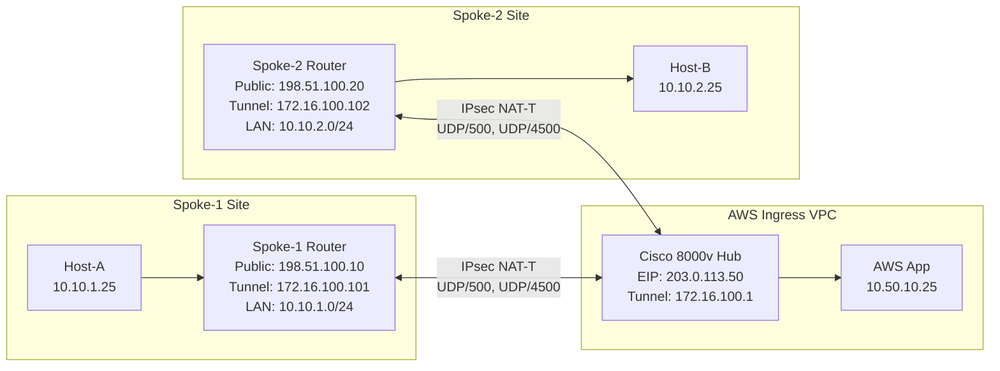
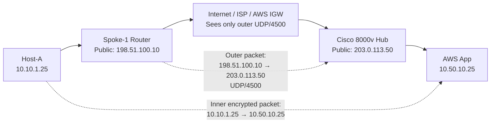
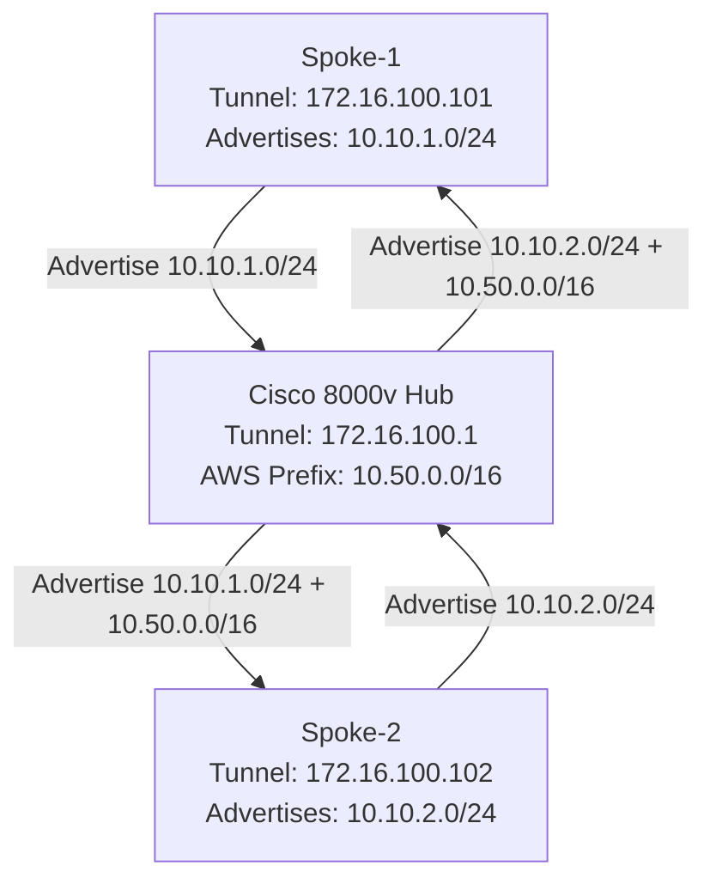
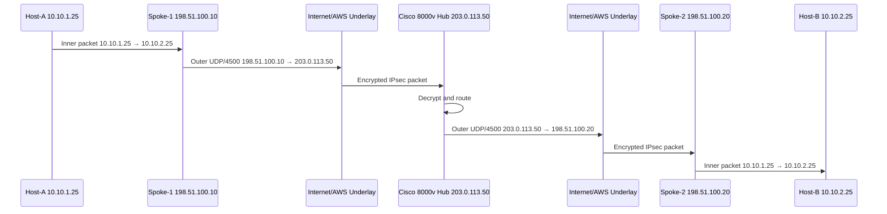
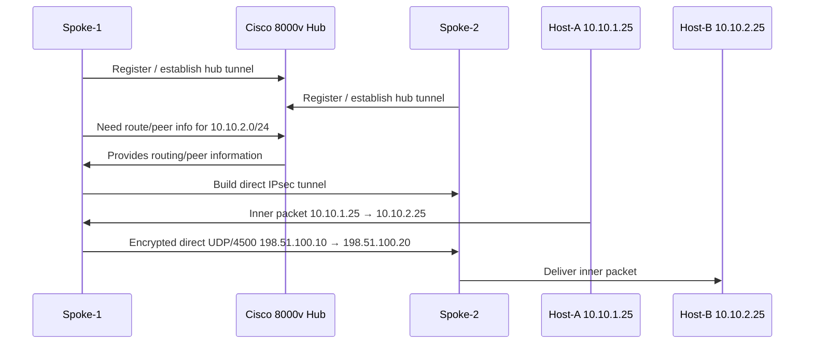
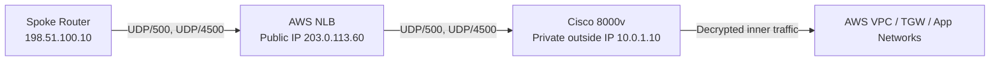

---

# Cisco 8000v FlexVPN / IPsec Hub in AWS Ingress VPC

## 1. Purpose of This Document

This document explains how a Cisco 8000v / Catalyst 8000V router can act as an **IPsec / FlexVPN hub** in an AWS Ingress VPC.

It covers:

```text
IPsec ports and protocols
NAT-T behavior
Cisco 8000v with public IP
Cisco 8000v behind AWS NLB
Why ALB does not work for IPsec
Outer IP vs inner/tunnel IP
Spoke-to-hub routing
Spoke-to-spoke traffic
What intermediate devices can and cannot see
```

---

# 2. Key Terms

| Term                      | Meaning                                                                                       |
| ------------------------- | --------------------------------------------------------------------------------------------- |
| **Spoke router**          | Remote Cisco router, branch router, tactical gateway, or field router building VPN to the hub |
| **Hub router**            | Cisco 8000v in AWS acting as central VPN headend                                              |
| **Outer IP**              | Public/transport IP used to build the tunnel                                                  |
| **Tunnel IP**             | Overlay IP assigned to the VPN tunnel interface                                               |
| **Protected LAN prefix**  | Real internal subnet behind a spoke or hub                                                    |
| **Underlay**              | Public Internet / LTE / SATCOM / AWS public path used to reach the hub                        |
| **Overlay**               | Encrypted VPN network built on top of the underlay                                            |
| **NAT-T**                 | NAT Traversal; encapsulates IPsec ESP inside UDP/4500                                         |
| **Hairpin**               | Spoke-to-spoke traffic goes through the hub                                                   |
| **Direct spoke-to-spoke** | Spokes build direct IPsec tunnel after hub-assisted discovery                                 |

---

# 3. IPsec / FlexVPN Ports and Protocols

## 3.1 No NAT Between Spoke and Hub

If there is **no NAT** between the spoke and hub, classic IPsec uses:

```text
IKE / IKEv2 negotiation/Control Plane: UDP/500
IPsec encrypted data:    ESP, IP protocol 50
```

Example:

```text
Spoke public IP 198.51.100.10
        →
Hub public IP 203.0.113.50

Congtrol/IKE: UDP/500
Data: ESP protocol 50
```

## 3.2 With NAT or NAT-T

If there is NAT between the spoke and hub, IPsec usually uses NAT-T:

```text
IKE starts on:          UDP/500
NAT-T data traffic:     UDP/4500
ESP is encapsulated inside UDP/4500
```

So practically, for most cloud and NAT scenarios, allow:

```text
UDP/500 
UDP/4500
```

Important:

```text
ESP protocol 50 has no TCP/UDP port.
NAT devices handle TCP/UDP better than raw ESP.
NAT-T solves this by wrapping ESP inside UDP/4500.
```

---

# 5. Example IP Addressing

Assume the following topology:

```text
Spoke-1 Cisco Router
Public IP:      198.51.100.10
Tunnel IP:      172.16.100.101
LAN subnet:     10.10.1.0/24

Spoke-2 Cisco Router
Public IP:      198.51.100.20
Tunnel IP:      172.16.100.102
LAN subnet:     10.10.2.0/24

AWS Ingress VPC
Cisco 8000v Hub
Public EIP:     203.0.113.50
Outside ENI:    10.0.1.10
Tunnel IP:      172.16.100.1
AWS subnet:     10.50.0.0/16
```

There are three different IP concepts:

| IP Type              | Example                       | Purpose                           |
| -------------------- | ----------------------------- | --------------------------------- |
| **Outer/public IP**  | 198.51.100.10 → 203.0.113.50  | Builds the VPN tunnel             |
| **Tunnel IP**        | 172.16.100.101 → 172.16.100.1 | Routes inside the VPN overlay     |
| **Protected LAN IP** | 10.10.1.25 → 10.50.10.25      | Real workload/application traffic |

---

# 6. Mermaid: High-Level Hub-and-Spoke Topology



---

# 7. Outer IP vs Inner IP

## 7.1 Outer IP

The outer IP is the public transport address.

Example:

```text
Outer source:      198.51.100.10
Outer destination: 203.0.113.50
Protocol/port:     UDP/4500
```

This is what the Internet, ISP, AWS IGW, AWS NLB, or intermediate firewalls see.

```text
198.51.100.10 → 203.0.113.50 UDP/4500
```

## 7.2 Inner Protected IP

The inner packet is the real traffic inside the VPN tunnel.

Example:

```text
Inner source:      10.10.1.25
Inner destination: 10.50.10.25
Application:       HTTPS / SSH / RDP / ICMP / application data
```

This is encrypted by IPsec.

## 7.3 Logical Packet Format

With NAT-T, the packet looks like this:

```text
OUTER HEADER
Source IP:      198.51.100.10
Destination IP: 203.0.113.50
Protocol:       UDP
Port:           4500

    ENCRYPTED IPSEC PAYLOAD
    Inner Source IP:      10.10.1.25
    Inner Destination IP: 10.50.10.25
    Application:          HTTPS / SSH / ICMP / RDP
```

Intermediate devices see only:

```text
198.51.100.10 → 203.0.113.50 UDP/4500
```

They do not see:

```text
10.10.1.25 → 10.50.10.25
```

---

# 8. Mermaid: Outer Packet vs Inner Packet



---

# 9. Does the Spoke Get an Inner IP?

Yes, depending on FlexVPN design, the spoke can have a tunnel/overlay IP.

There are two common models.

---

## 9.1 Model A — Static Tunnel IPs

Tunnel IPs are manually configured.

```text
Hub tunnel IP:     172.16.100.1
Spoke-1 tunnel IP: 172.16.100.11
Spoke-2 tunnel IP: 172.16.100.12
```

Routing example:

```text
Spoke-1 route to 10.10.2.0/24 via tunnel
Spoke-2 route to 10.10.1.0/24 via tunnel
Hub knows both spoke LAN routes
```

---

## 9.2 Model B — Hub Assigns Tunnel IPs

The hub assigns tunnel IPs from a pool.

Example pool:

```text
FlexVPN tunnel pool: 172.16.100.0/24

Hub:     172.16.100.1
Spoke-1: 172.16.100.101
Spoke-2: 172.16.100.102
```

Spoke-1 has:

```text
Public/outer IP:     198.51.100.10
Tunnel/overlay IP:   172.16.100.101
LAN subnet:          10.10.1.0/24
```

Spoke-2 has:

```text
Public/outer IP:     198.51.100.20
Tunnel/overlay IP:   172.16.100.102
LAN subnet:          10.10.2.0/24
```

Important:

```text
The public IP gets the spoke to the hub.
The tunnel IP routes inside the VPN overlay.
The LAN subnet is the actual protected network.
```

---

# 10. Spoke-to-Hub Traffic Example

Host-A behind Spoke-1 wants to reach an AWS application.

```text
Host-A:  10.10.1.25
AWS App: 10.50.10.25
```

## 10.1 Before Encryption

Host-A sends:

```text
Source:      10.10.1.25
Destination: 10.50.10.25
```

Spoke-1 checks its route table:

```text
10.50.0.0/16 → FlexVPN tunnel to hub
```

## 10.2 After Encryption

Spoke-1 wraps the packet:

```text
Outer Source:      198.51.100.10
Outer Destination: 203.0.113.50
Protocol:          UDP/4500

Encrypted payload:
  Inner Source:      10.10.1.25
  Inner Destination: 10.50.10.25
```

## 10.3 At the Hub

Cisco 8000v decrypts the packet and sees:

```text
10.10.1.25 → 10.50.10.25
```

Then the Cisco 8000v routes the packet into AWS:

```text
Cisco inside ENI
        →
AWS VPC route table
        →
AWS app subnet
        →
10.50.10.25
```

---

# 11. Routing Across the VPN Overlay

FlexVPN can use different routing methods:

```text
Static routes
IKEv2 route injection
BGP over tunnel
EIGRP over tunnel
OSPF over tunnel
NHRP for spoke-to-spoke discovery
```

For enterprise/AWS designs, **BGP over tunnel** or controlled static routing is common.

## 11.1 Example Route Exchange

Tunnel IPs:

```text
Hub tunnel IP:     172.16.100.1
Spoke-1 tunnel IP: 172.16.100.101
Spoke-2 tunnel IP: 172.16.100.102
```

Spoke-1 advertises:

```text
10.10.1.0/24
```

Spoke-2 advertises:

```text
10.10.2.0/24
```

Hub advertises to both spokes:

```text
10.50.0.0/16
```

Hub may also advertise spoke routes to other spokes:

```text
To Spoke-1:
  10.10.2.0/24
  10.50.0.0/16

To Spoke-2:
  10.10.1.0/24
  10.50.0.0/16
```

## 11.2 Resulting Route Tables

Spoke-1 route table:

```text
10.10.1.0/24    directly connected LAN
172.16.100.0/24 tunnel/overlay
10.10.2.0/24    via FlexVPN tunnel
10.50.0.0/16    via FlexVPN tunnel
```

Spoke-2 route table:

```text
10.10.2.0/24    directly connected LAN
172.16.100.0/24 tunnel/overlay
10.10.1.0/24    via FlexVPN tunnel
10.50.0.0/16    via FlexVPN tunnel
```

Hub route table:

```text
172.16.100.101  Spoke-1 tunnel endpoint
172.16.100.102  Spoke-2 tunnel endpoint
10.10.1.0/24    via Spoke-1 tunnel
10.10.2.0/24    via Spoke-2 tunnel
10.50.0.0/16    AWS/VPC/TGW side
```

---

# 12. Mermaid: Route Advertisement Model



---

# 13. Spoke-to-Spoke Traffic

There are two major designs.

---

## 13.1 Design 1 — Hub-and-Spoke Hairpin

In this model, all spoke-to-spoke traffic goes through the hub.

```text
Spoke-1
  →
Encrypted tunnel to hub
  →
Cisco 8000v decrypts
  →
Cisco 8000v routes to Spoke-2 tunnel
  →
Cisco 8000v re-encrypts
  →
Spoke-2
```

Traffic path:

```text
10.10.1.25
  →
Spoke-1 Router
  →
IPsec tunnel to Cisco 8000v Hub
  →
Cisco 8000v Hub
  →
IPsec tunnel to Spoke-2 Router
  →
10.10.2.25
```

### Visibility in Hairpin Mode

Intermediate devices see only outer traffic:

First leg:

```text
198.51.100.10 → 203.0.113.50 UDP/4500
```

Second leg:

```text
203.0.113.50 → 198.51.100.20 UDP/4500
```

The hub sees the decrypted inner packet:

```text
10.10.1.25 → 10.10.2.25
```

Important:

```text
Internet / ISP / AWS IGW / NLB:
  See only encrypted outer UDP/4500 traffic.

Cisco 8000v hub:
  Sees decrypted inner traffic because it is the transit router.
```

### Mermaid: Hub Hairpin Spoke-to-Spoke



---

## 13.2 Design 2 — Direct Spoke-to-Spoke Tunnel

In this model, the hub helps with discovery/routing, but spoke-to-spoke data can go directly between the spokes.

High-level behavior:

```text
Spoke-1 builds tunnel to hub.
Spoke-2 builds tunnel to hub.
Spoke-1 learns how to reach Spoke-2.
Spoke-1 builds direct IPsec tunnel to Spoke-2.
User traffic flows directly between spokes.
```

Control plane:

```text
Spoke-1 ⇄ Hub ⇄ Spoke-2
```

Data plane:

```text
Spoke-1 ⇄ Spoke-2
```

Example:

```text
Host-A: 10.10.1.25
Host-B: 10.10.2.25
```

Inner packet:

```text
10.10.1.25 → 10.10.2.25
```

Outer direct spoke packet:

```text
198.51.100.10 → 198.51.100.20 UDP/4500
```

The hub does **not** see the user data after the direct spoke-to-spoke tunnel forms.

### Mermaid: Direct Spoke-to-Spoke



---

# 14. Hub Hairpin vs Direct Spoke-to-Spoke

| Topic                                               | Hub Hairpin                                     | Direct Spoke-to-Spoke                        |
| --------------------------------------------------- | ----------------------------------------------- | -------------------------------------------- |
| Data path                                           | Spoke → Hub → Spoke                             | Spoke → Spoke                                |
| Hub sees inner user traffic?                        | Yes                                             | No, not after direct tunnel forms            |
| Simpler design?                                     | Yes                                             | More complex                                 |
| Better for inspection/control?                      | Yes                                             | Less centralized visibility                  |
| Better latency?                                     | Usually worse                                   | Usually better                               |
| Works when spokes cannot reach each other directly? | Yes                                             | No, direct reachability is needed            |
| NAT complexity                                      | Lower                                           | Higher                                       |
| Best fit                                            | Central control, inspection, SCCA-style routing | Performance-sensitive spoke-to-spoke traffic |

For SCCA or enterprise-controlled environments, hub hairpin is often preferred because traffic can be inspected, logged, and controlled centrally.

---

# 15. AWS VPC Routing Considerations

When Cisco 8000v is an EC2-based router, AWS routing matters.

## 15.1 Disable Source/Destination Check

For EC2 router appliances, disable source/destination check on the Cisco 8000v ENIs.

Reason:

```text
The Cisco router forwards traffic that is not sourced from or destined to its own ENI IP.
```

Example forwarded packet:

```text
10.10.1.25 → 10.50.10.25
```

The Cisco inside ENI may be:

```text
10.0.2.10
```

AWS must allow the EC2 instance to forward that traffic.

## 15.2 VPC Route Tables

AWS private subnets need routes back to remote spoke prefixes.

Example AWS app subnet route table:

```text
10.10.1.0/24 → Cisco 8000v inside ENI
10.10.2.0/24 → Cisco 8000v inside ENI
```

Cisco 8000v also needs routes toward AWS prefixes:

```text
10.50.0.0/16 → AWS VPC / TGW / inside interface
```

If using Transit Gateway:

```text
Spoke prefixes may be advertised or statically routed toward TGW.
TGW route tables must know which attachment points to the Cisco/Ingress VPC.
Ingress VPC route tables must send spoke prefixes to Cisco 8000v.
```

---

# 16. Cisco 8000v Behind AWS NLB

If Cisco 8000v is behind NLB, the spoke points to the NLB public address instead of the Cisco EIP.

Example:

```text
NLB public IP:          203.0.113.60
Cisco 8000v private IP: 10.0.1.10
```

Spoke peer address:

```text
203.0.113.60
```

Outer packets:

```text
Spoke-1 public IP → NLB public IP UDP/500
Spoke-1 public IP → NLB public IP UDP/4500
```

NLB forwards:

```text
Spoke-1 public IP → Cisco 8000v private IP UDP/500
Spoke-1 public IP → Cisco 8000v private IP UDP/4500
```

The encrypted payload remains encrypted until Cisco 8000v decrypts it.

## Mermaid: Cisco Behind NLB



Important warnings:

```text
NLB is not an IPsec cluster manager.
Do not assume multiple Cisco routers behind one NLB create a clean VPN HA cluster.
IKE/IPsec state must remain consistent.
Health checks and failover behavior need careful validation.
```

---

# 17. What Intermediate Devices See

Assume actual user traffic:

```text
10.10.1.25 pings 10.10.2.25
```

The real inner packet is:

```text
Source:      10.10.1.25
Destination: 10.10.2.25
Protocol:    ICMP
```

With NAT-T, intermediate devices see only:

```text
Source:      198.51.100.10
Destination: 203.0.113.50
Protocol:    UDP
Port:        4500
```

For direct spoke-to-spoke:

```text
Source:      198.51.100.10
Destination: 198.51.100.20
Protocol:    UDP
Port:        4500
```

Intermediate devices cannot see:

```text
10.10.1.25
10.10.2.25
ICMP
RDP
SSH
HTTP
Application payload
```

Those are inside the encrypted IPsec payload.

---

# 18. What Different Devices Can See

| Device                                      | Can see outer public IPs? |  Can see UDP/4500? |               Can see inner IPs? |                                Can see application payload? |
| ------------------------------------------- | ------------------------: | -----------------: | -------------------------------: | ----------------------------------------------------------: |
| ISP router                                  |                       Yes |                Yes |                               No |                                                          No |
| Internet firewall                           |                       Yes |                Yes |                               No |                                                          No |
| AWS IGW                                     |                       Yes |                Yes |                               No |                                                          No |
| AWS NLB                                     |                       Yes |                Yes |                               No |                                                          No |
| Cisco 8000v hub, hairpin mode               |                       Yes |                Yes |                              Yes | Maybe, if traffic is not additionally encrypted above IPsec |
| Cisco 8000v hub, direct spoke-to-spoke mode |        Control plane only | Control plane only | No user data after direct tunnel |                                                          No |
| Destination spoke router                    |                       Yes |                Yes |                              Yes | Maybe, if traffic is not additionally encrypted above IPsec |

Important note:

```text
IPsec hides the inner IP packet from intermediate devices.
But after decryption, the VPN endpoint can see the inner IP packet.
If the application itself uses TLS/HTTPS, then the VPN endpoint sees the inner IPs and ports but not the HTTPS payload.
```

---

# 19. VPC Flow Logs Visibility

On the outside/public path, VPC Flow Logs may show:

```text
198.51.100.10 203.0.113.50 UDP 4500 ACCEPT
```

They will not show:

```text
10.10.1.25 10.10.2.25 ICMP
10.10.1.25 10.50.10.25 TCP/443
```

To see inner traffic, capture/log after decryption:

```text
Cisco 8000v tunnel interface
Cisco 8000v inside interface
AWS private subnet after Cisco forwarding
Downstream firewall/inspection point
```

---

# 20. Recommended Security Group Rules

For Cisco 8000v with Elastic IP on outside ENI:

Inbound to outside ENI:

```text
UDP/500  from approved spoke public IPs
UDP/4500 from approved spoke public IPs
ESP protocol 50 only if native ESP without NAT-T is required
SSH/HTTPS management only from approved admin networks
```

Outbound from outside ENI:

```text
UDP/500  to approved spoke public IPs
UDP/4500 to approved spoke public IPs
ESP protocol 50 only if native ESP is required
```

Inside/private ENI:

```text
Allow only required enterprise/AWS/tactical prefixes
Use route tables and firewall policy to control traffic
Avoid broad any-any unless required for testing
```

---

# 21. Recommended Design Decision

## Best General Pattern

```text
Spoke Router
  →
Internet / LTE / SATCOM
  →
Elastic IP on Cisco 8000v outside ENI
  →
Cisco 8000v FlexVPN/IPsec Hub
  →
Inside ENI
  →
AWS VPC / TGW / Enterprise / Cloud Relay
```

Use:

```text
UDP/500
UDP/4500
NAT-T
BGP or controlled static routes
Source/destination check disabled
AWS route tables pointing remote prefixes to Cisco inside ENI
```

## Use NLB Only When Needed

Use NLB if you need:

```text
Managed public front door
Static NLB addresses
Health-check-based failover pattern
UDP listener pass-through
```

But do not treat NLB as a full VPN cluster manager.

## Do Not Use ALB

Do not use ALB for IPsec/FlexVPN:

```text
ALB = HTTP/HTTPS applications
NLB = TCP/UDP pass-through
Cisco EIP = clean router/VPN endpoint
```

---

# 22. Final Mental Model

```text
Public IPs build the secure tunnel.

Tunnel IPs route inside the VPN overlay.

LAN prefixes are the real protected networks.

Intermediate devices see only the outer tunnel packets.

VPN endpoints decrypt and route the inner packets.

Spoke-to-spoke traffic can either hairpin through the hub or build a direct spoke-to-spoke tunnel depending on FlexVPN design.
```

Final simplified view:

```text
UNDERLAY / OUTER NETWORK
────────────────────────────────────
Spoke public IP 198.51.100.10
        →
Hub public IP 203.0.113.50
        UDP/500 and UDP/4500


OVERLAY / TUNNEL NETWORK
────────────────────────────────────
Spoke-1 tunnel IP 172.16.100.101
Spoke-2 tunnel IP 172.16.100.102
Hub tunnel IP     172.16.100.1


PROTECTED NETWORKS
────────────────────────────────────
Spoke-1 LAN 10.10.1.0/24
Spoke-2 LAN 10.10.2.0/24
AWS LAN     10.50.0.0/16
```

One-line summary:

> **The public IP gets the spoke to the hub, UDP/500 and UDP/4500 build the encrypted IPsec tunnel, the tunnel IPs create the overlay routing domain, and the protected LAN prefixes are the actual networks carried securely inside the VPN.**
