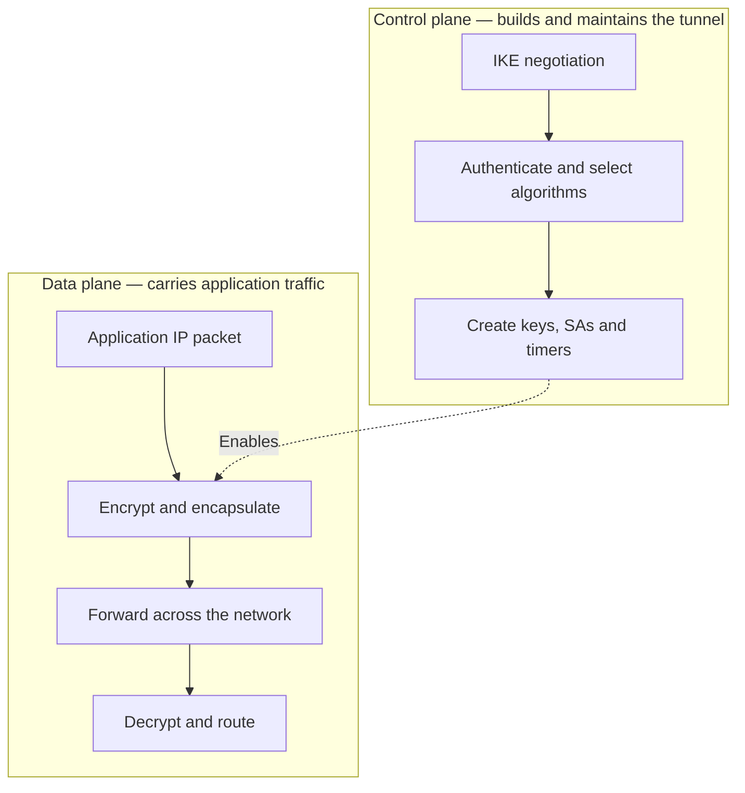
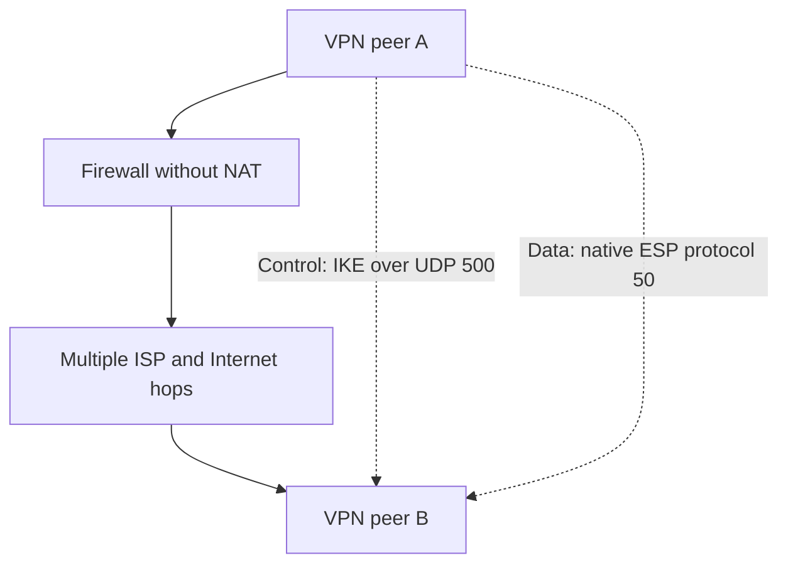
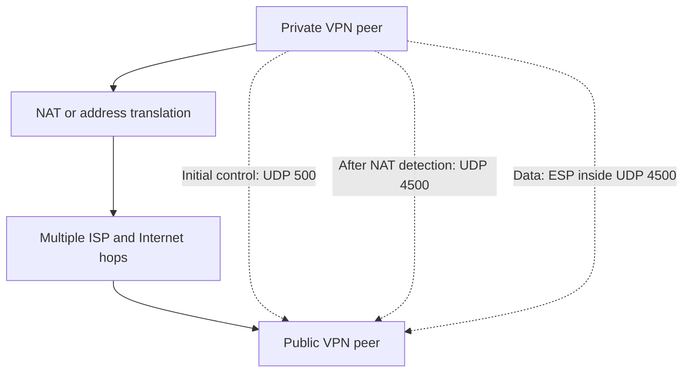
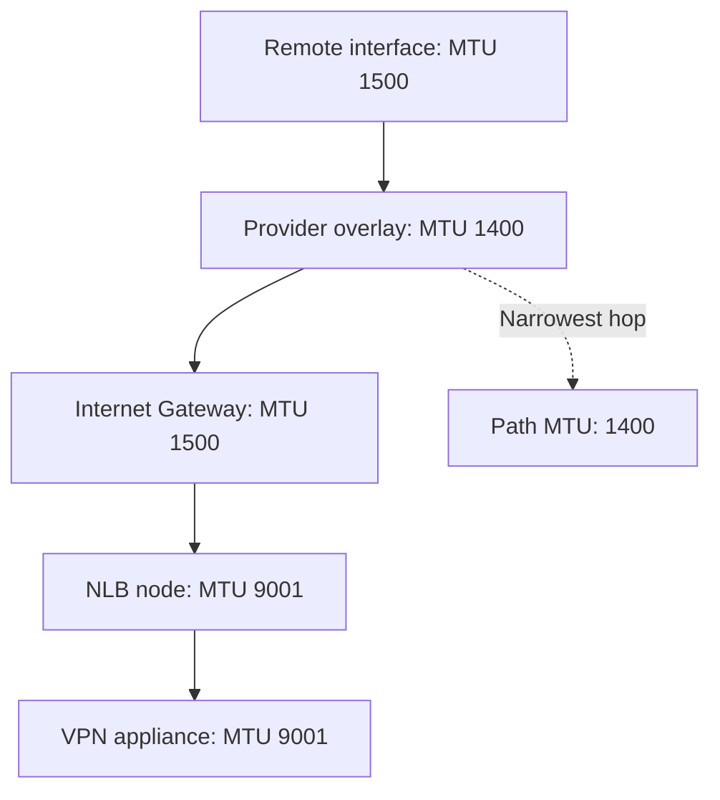
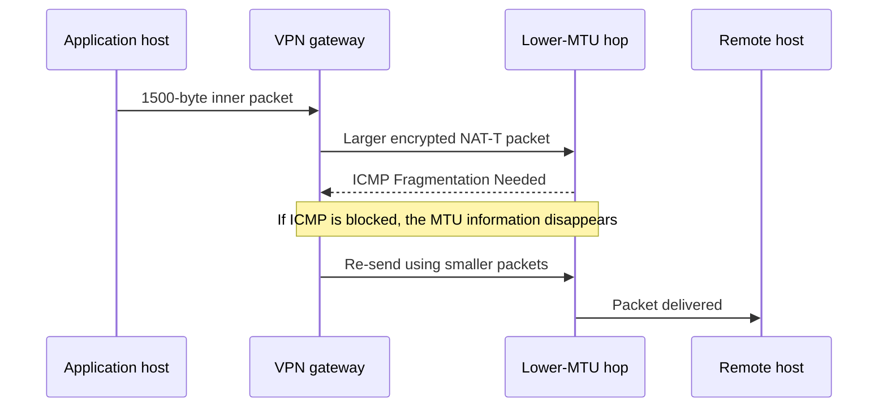
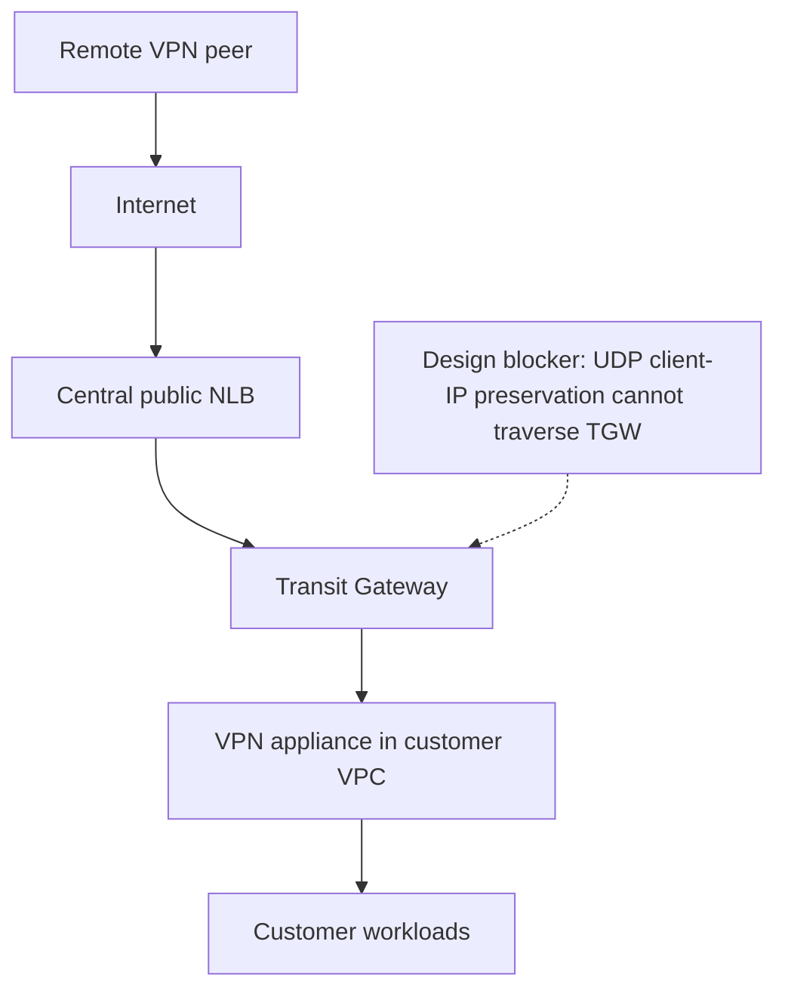
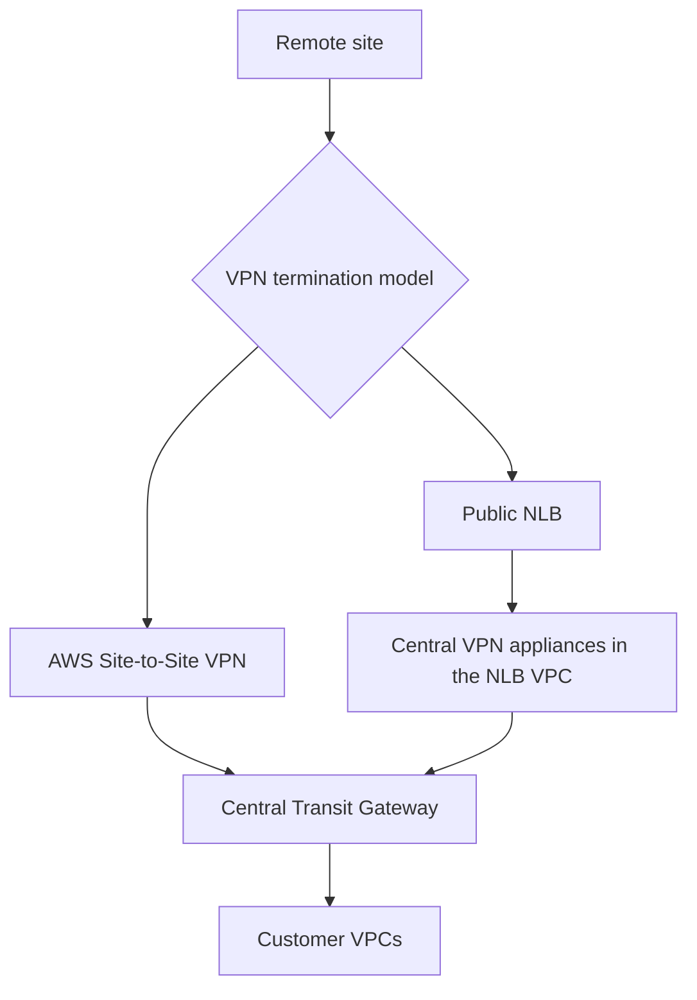

# IPsec MTU, Control Plane, Data Plane, NAT-T, and AWS NLB

The proposed architecture has two separate concerns:

1. **Architecture support:** A central NLB cannot forward UDP traffic through a Transit Gateway to an IPsec appliance in a customer VPC. NLB UDP target groups always preserve the client IP, and AWS does not support client-IP preservation when the target is reached through TGW or a GWLB endpoint.
2. **Packet-size handling:** Even where the NLB topology is supported, IPsec adds headers. NLB does not automatically reduce the packet size, clamp TCP MSS, or solve a blocked Path MTU Discovery process.

There is also an important correction:

> AWS NLB nodes use a nonconfigurable **9001-byte MTU**, not 8192. However, an internet path is normally limited to 1500 bytes, and IPsec reduces the usable inner MTU below 1500. [AWS Elastic Load Balancing MTU documentation](https://docs.aws.amazon.com/elasticloadbalancing/latest/userguide/how-elastic-load-balancing-works.html)

---

## 1. Plain-English explanation

Think of MTU as the maximum height allowed for a truck:

* EC2 and NLB may support a very tall 9001-byte truck.
* The Internet Gateway allows only 1500.
* An ISP, SD-WAN, GRE, PPPoE, firewall, or another hidden tunnel might allow only 1400.
* IPsec then places the original truck inside another container by adding encryption headers.

The packet must fit through **every bridge on the path**. The narrowest bridge determines the usable size.

[
\text{Path MTU}=\min(\text{MTU of every hop})
]

[
\text{Effective IPsec MTU}
\approx
\text{Underlay Path MTU}-\text{IPsec/NAT-T overhead}
]

AWS supporting jumbo frames on one portion of the path does not mean the complete path supports jumbo frames.

---

# 2. Control plane versus data plane

| Plane            | Purpose                                | Typical traffic                                                                                          |
| ---------------- | -------------------------------------- | -------------------------------------------------------------------------------------------------------- |
| Control plane    | Builds and maintains the VPN           | IKE negotiation, authentication, algorithms, keys, Security Associations, DPD, rekeying and optional BGP |
| Data plane       | Carries actual application traffic     | Encrypted HTTP, RDP, database, DNS and other customer packets                                            |
| Management plane | Configures and monitors the VPN device | SSH, HTTPS management, logs, SNMP and APIs                                                               |



The control plane may work while the data plane is broken:

* Small IKE packets successfully establish the tunnel.
* Small pings work.
* TCP three-way handshake works.
* Large application packets disappear because of an MTU black hole.

This produces the classic complaint:

> “The VPN is up, but the application hangs.”

Large certificate-based IKE authentication messages can also experience fragmentation problems, so the control plane is not completely immune to MTU issues.

---

# 3. IPsec without NAT

Without NAT, the normal packet flow is:

* IKE control plane: UDP port 500
* Data plane: native ESP, IP protocol 50



### Packet structure

| Packet type        | Simplified structure                       |
| ------------------ | ------------------------------------------ |
| IKE control packet | Outer IP → UDP 500 → IKE                   |
| IPsec data packet  | Outer IP → ESP → encrypted inner IP packet |

The encrypted inner packet contains the original source, destination and application data.

---

# 4. IPsec with NAT and NAT-T

Native ESP does not have TCP or UDP port numbers. That makes it difficult for a NAT/PAT device to maintain mappings, especially when multiple VPN peers share one public address.

NAT Traversal solves this by putting ESP inside UDP.

* Initial IKE normally begins on UDP 500.
* The peers detect address translation.
* IKE and encrypted data move to UDP 4500.
* NAT keepalives maintain the NAT mapping.

This behavior is defined by [RFC 3947](https://www.rfc-editor.org/info/rfc3947/) and [RFC 3948](https://www.rfc-editor.org/info/rfc3948/).



### Packet structure with NAT-T

| Packet type             | Simplified structure                               |
| ----------------------- | -------------------------------------------------- |
| Initial IKE             | Outer IP → UDP 500 → IKE                           |
| IKE after NAT detection | Outer IP → UDP 4500 → IKE                          |
| Data with NAT-T         | Outer IP → UDP 4500 → ESP → encrypted inner packet |

NAT by itself only rewrites addresses or ports. **NAT-T is what adds the extra UDP wrapper**, consuming additional MTU.

---

# 5. System MTU versus Network Path MTU

“System MTU” is usually shorthand for the MTU configured on a particular interface. It is not necessarily one machine-wide value.

| Term                    | Meaning                                                                                 |
| ----------------------- | --------------------------------------------------------------------------------------- |
| Interface or system MTU | Largest IP packet the local interface is configured to send                             |
| Link MTU                | Maximum size supported by one network segment                                           |
| Path MTU                | Smallest MTU across the complete route                                                  |
| IPsec inner MTU         | Largest original packet that can be encrypted without making the outer packet too large |
| TCP MSS                 | Maximum TCP payload inside the inner IP packet                                          |



Even though the NLB and VPN appliance support 9001, the end-to-end Path MTU in this example is only 1400.

Furthermore, the usable inner IPsec MTU is approximately:

[
1400-\text{IPsec and NAT-T overhead}
]

With roughly 62 bytes of IPsec/NAT-T overhead, the effective inner MTU could be approximately 1338 bytes.

The exact overhead depends on:

* IPv4 versus IPv6
* ESP algorithm
* Authentication algorithm
* Padding and block size
* NAT-T
* Additional GRE, SD-WAN or provider encapsulation

---

# 6. What happens to a 1500-byte packet?

Suppose an application creates a 1500-byte inner IP packet.

With AES-GCM IPsec:

* Without NAT-T, the outer packet may be approximately 1554 bytes.
* With NAT-T, the outer packet may be approximately 1562 bytes.
* A 1500-byte Internet path cannot carry it as one packet.

The VPN device must do one of the following:

1. Fragment the inner packet before encryption.
2. Send ICMP “Fragmentation Needed” to the original sender.
3. Fragment the encrypted outer packet, if permitted.
4. Drop the packet.

Fragmenting before encryption is generally preferable to fragmenting the encrypted outer packet.



If ICMP is blocked and the packet has the Don’t Fragment flag:

* The lower-MTU device drops the packet.
* The VPN gateway or sender never learns the correct size.
* The sender retransmits the same oversized packet.
* The application times out.

This is an **MTU black hole**.

For IPv4, PMTUD uses ICMP Type 3, Code 4. For IPv6, it uses ICMPv6 Type 2, Packet Too Big. AWS recommends allowing the necessary ICMP through NACLs and NLB security groups. [AWS PMTUD guidance](https://docs.aws.amazon.com/vpc/latest/userguide/path_mtu_discovery.html), [NLB security-group example](https://docs.aws.amazon.com/elasticloadbalancing/latest/network/load-balancer-security-groups.html)

---

# 7. AWS component MTU values

| Component or path                     |                  Relevant MTU |
| ------------------------------------- | ----------------------------: |
| Current-generation EC2 ENI            |           Supports up to 9001 |
| ALB/NLB load-balancer node            |        9001, not configurable |
| Gateway Load Balancer                 |                          8500 |
| Transit Gateway VPC/DX/peering path   |                          8500 |
| Internet Gateway path                 |                          1500 |
| TGW VPN attachment outer traffic      |                          1500 |
| AWS Site-to-Site VPN usable inner MTU | Maximum 1446; sometimes lower |

AWS specifically states that managed Site-to-Site VPN:

* Does not support jumbo frames.
* Has a maximum MTU of 1446 and MSS of 1406.
* Does not support Path MTU Discovery.
* Requires lower values depending on algorithms and NAT-T. [AWS Site-to-Site VPN MTU limits](https://docs.aws.amazon.com/vpn/latest/s2svpn/vpn-limits.html)

For example, AWS documents:

| Algorithm                  |    NAT-T | Inner MTU | IPv4 TCP MSS |
| -------------------------- | -------: | --------: | -----------: |
| AES-GCM-16                 | Disabled |      1446 |         1406 |
| AES-GCM-16                 |  Enabled |      1438 |         1398 |
| AES-CBC with SHA1/SHA2-256 |  Enabled |      1422 |         1382 |

These numbers demonstrate why “the underlay supports 1500” does not mean that the original packet can also be 1500. [AWS customer-gateway best practices](https://docs.aws.amazon.com/vpn/latest/s2svpn/cgw-best-practice.html)

---

# 8. Does AWS NLB support NAT-T?

## Practical answer: conditionally, as an opaque UDP forwarder

An NLB can have:

* UDP 500 listener and target group
* UDP 4500 listener and target group

Therefore, it can forward IKE and NAT-T packets. However:

> NLB is not NAT-T aware and is not an IPsec endpoint. It simply sees and forwards UDP packets.

NLB does not:

* Perform IKE negotiation.
* Authenticate VPN peers.
* Decrypt ESP.
* Understand the inner packet.
* Calculate the IPsec overhead.
* Set an IPsec tunnel MTU.
* Clamp TCP MSS for the encrypted tunnel.
* Support a listener for native ESP protocol 50.

NLB listeners and target groups support TCP, UDP, TCP_UDP, TLS, QUIC and related protocols—but not arbitrary IP protocol 50. Therefore, **native ESP cannot traverse an NLB listener; NAT-T over UDP 4500 is required**. [AWS NLB supported protocols](https://docs.aws.amazon.com/elasticloadbalancing/latest/network/introduction.html)

## NLB does not really “terminate UDP”

UDP has no connection to terminate. The NLB:

1. Receives packets addressed to its frontend IP.
2. Creates a UDP flow mapping.
3. Chooses a target using source/destination IP and port.
4. Forwards subsequent packets in that flow to the same target.

NLB maintains UDP flow state for 120 seconds. After that idle timeout, a later packet is considered a new flow and could be sent to another target. [AWS NLB UDP timeout](https://docs.aws.amazon.com/elasticloadbalancing/latest/network/network-load-balancers.html)

Consequences for IPsec include:

* NAT keepalives or DPD should occur more frequently than 120 seconds.
* UDP 500 and UDP 4500 are different flows.
* Do not assume both flows will automatically reach the same VPN appliance.
* If multiple targets exist, the appliance cluster must support deterministic affinity or state synchronization.
* When a target fails, existing IPsec Security Associations cannot simply move unless the appliances replicate the required state.

An NLB health check proves that an appliance is responding. It does not prove that the new appliance possesses the old appliance’s IKE and IPsec state.

---

# 9. Why the proposed central NLB design is not supported

The proposed path is:



For UDP target groups, NLB client-IP preservation:

* Is enabled by default.
* Cannot be disabled.
* Requires the target to be in the same VPC or a same-Region peered VPC.
* Is not supported when the target is reached through Transit Gateway.
* Is not supported when a GWLB endpoint is inserted between the NLB and target.

Therefore:

> **Central NLB → TGW → VPN appliance in customer VPC is not a supported NLB UDP target architecture.**

This is an architecture blocker before the MTU problem is even considered. [AWS NLB client-IP preservation requirements](https://docs.aws.amazon.com/elasticloadbalancing/latest/network/edit-target-group-attributes.html)

A same-Region peered customer VPC may satisfy this particular NLB requirement, but it still leaves NAT-T, state affinity, routing symmetry, fragmentation and operational complexity to solve.

---

# 10. Better centralized designs



## Option 1 — Recommended: AWS Site-to-Site VPN on the central TGW

Terminate AWS-managed Site-to-Site VPN directly on the central Transit Gateway.

Benefits:

* No NLB is required.
* AWS supplies two managed VPN tunnels.
* BGP and ECMP are supported where applicable.
* TGW route tables distribute traffic to the correct customer VPC.
* Centralized isolation and inspection can be applied after VPN termination.
* The MTU limits are documented and predictable.

## Option 2 — Vendor VPN appliances in the central VPC

If specialized VPN functionality is required:

* Put the VPN appliances in the same central VPC as the NLB.
* NLB forwards UDP 500 and 4500 directly to those appliances.
* Decrypt the traffic in the central appliance VPC.
* Send the decrypted inner traffic through TGW to customer VPCs.

This avoids using TGW between the NLB and its UDP targets. Nevertheless, this design should only be used when the VPN vendor explicitly supports:

* NLB-based NAT-T forwarding
* Multiple NLB frontend IPs
* UDP flow timeout behavior
* IKE and IPsec state synchronization
* Symmetric return routing
* Fragmentation and MTU handling
* Health-based failover

---

# 11. Practical MTU controls

For either managed or self-managed IPsec:

1. **Set the tunnel MTU based on the exact encryption algorithms.**
   Do not assume 1500.

2. **Configure TCP MSS clamping before encryption.**
   For an inner IPv4 MTU of 1400, an initial MSS of approximately 1360 is common:

   [
   1400-20_{\text{IP}}-20_{\text{TCP}}=1360
   ]

3. **Remember that MSS clamping fixes only TCP.**
   It does not fix large UDP, ICMP or other non-TCP traffic.

4. **Allow PMTUD ICMP messages everywhere.**
   Check the on-prem firewall, ISP path, AWS NLB security group, NACLs and appliance policies.

5. **Enable IKE fragmentation when certificates are used.**

6. **Avoid depending on outer IPsec fragmentation.**

7. **Test both directions.**
   Asymmetric routes can have different Path MTUs.

8. **Test every tunnel, NLB address and Availability Zone.**

Useful test examples:

```bash
# Tests a 1500-byte inner IPv4 packet: 1472 payload + 28 IP/ICMP headers
ping -M do -s 1472 REMOTE_IP

# Tests a 1400-byte inner IPv4 packet
ping -M do -s 1372 REMOTE_IP

# Observe IKE, NAT-T, native ESP and PMTUD
tcpdump -ni any 'icmp or udp port 500 or udp port 4500 or proto 50'
```

On Windows:

```powershell
ping REMOTE_IP -f -l 1472
```

Reduce the payload until it succeeds consistently, and validate the result with packet captures on both the inner and outer appliance interfaces.

## Final recommendation

Do not implement **central NLB → TGW → customer-VPC VPN appliance**. It is unsupported for NLB UDP target traffic and introduces additional state, routing and MTU risks.

For your centralized architecture, use either:

* **AWS Site-to-Site VPN attached to the central TGW**, preferably; or
* **NLB and self-managed VPN appliances in the same central VPC**, followed by decrypted routing through TGW.

In either case, design for an inner MTU around 1400–1438 depending on algorithms and measured Path MTU, clamp TCP MSS, allow the required ICMP, and test the complete multihop path rather than relying on the NLB or EC2 jumbo-frame capability.
