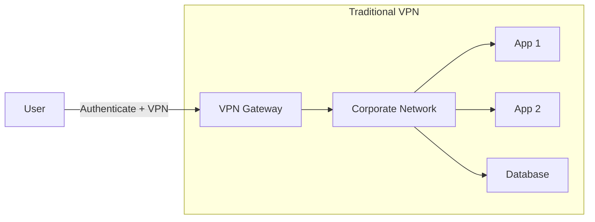
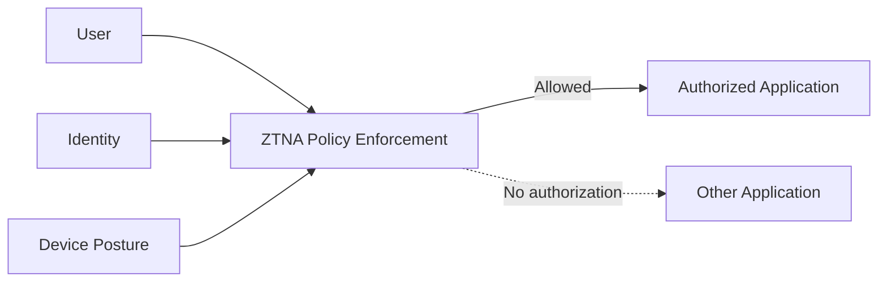

Yes. The confusion comes from treating **IPsec and “tunnelless/Zero Trust access” as competing versions of the same thing**. They are usually solving different layers of the problem.

One important terminology point first: **“tunnelless VPN” can mean two different things**. Cisco GETVPN, for example, is explicitly described as tunnelless because it avoids point-to-point tunnels, yet it still uses IPsec-style encryption/security associations. Modern ZTNA/BeyondCorp uses “no traditional VPN” in a different sense: the user receives access to a specific application/resource rather than being placed onto a remote network. ([Cisco][1])

## 1. Why IPsec is still very useful

IPsec operates at **Layer 3 — IP**. RFC 4301 defines IPsec as providing security services at the IP layer. That gives IPsec one enormous advantage:

> **The applications don't have to know encryption exists.**

([RFC Editor][2])

For example:

```text
Site A                         Site B

10.1.0.0/16                  10.20.0.0/16
    |                             |
    | HTTP / SSH / DB / DNS      |
    | SMB / ICMP / anything IP   |
    v                             v
 Router ===== IPsec ======== Router
               Internet
```

An application at Site A can simply send:

```text
10.1.10.15 → 10.20.50.25
```

It doesn't care that somewhere underneath:

```text
Original Packet
┌─────────────────────────────┐
│ 10.1.10.15 → 10.20.50.25   │
│ TCP                         │
│ Application Data            │
└─────────────────────────────┘

              ↓ IPsec

Internet-visible packet
┌─────────────────────────────┐
│ VPN-GW-A → VPN-GW-B         │
├─────────────────────────────┤
│ ESP                         │
├─────────────────────────────┤
│ encrypted:                  │
│ 10.1.10.15 → 10.20.50.25   │
│ TCP + Application Data      │
└─────────────────────────────┘
```

That characteristic makes IPsec extremely useful for **network-to-network connectivity**.

---

# 2. Tunnelless/ZTNA changes the question

Traditional VPN asks:

> "Can this user/device enter this network?"

ZTNA asks something closer to:

> "Can this authenticated user on this compliant device access this specific application right now?"

NIST explicitly describes Zero Trust as moving away from implicit trust based on network location and focusing protection on **resources rather than network segments**. ([NIST Computer Security Resource Center][3])

Conceptually:



versus:



Google's BeyondCorp is a well-known example: Google describes the model as allowing employees to access applications without requiring a traditional VPN, while applying access policy to the resource. ([Google Cloud][4])

---

# 3. So why haven't we simply replaced IPsec?

Because ZTNA is excellent for:

```text
User
  ↓
Identity
  ↓
Device posture
  ↓
Policy
  ↓
Application
```

But IPsec is excellent for:

```text
Network
   ↓
Any IP traffic
   ↓
Encrypted transport
   ↓
Another Network
```

Consider two data centers:

```text
Data Center A                       AWS VPC

DNS Server -----------------------> DNS
Database -------------------------> Database
Linux Server ---------------------> Linux Server
Windows Server ------------------> AD
Monitoring -----------------------> SNMP
Router ---------------------------> Router
ICMP -----------------------------> EC2
```

Trying to convert every one of those into:

```text
Identity-aware application proxy
```

may be impractical or impossible.

IPsec can simply say:

```text
10.0.0.0/8
     |
     | encrypted IP connectivity
     |
192.168.0.0/16
```

and protect the traffic regardless of whether it is TCP, UDP, ICMP, HTTP, SSH, DNS, database traffic, or another IP protocol. That follows directly from IPsec's position at the IP layer. ([RFC Editor][2])

---

# 4. Site-to-site is where IPsec remains especially strong

This is the distinction I would keep in your head:

| Requirement                            | Better fit       |
| -------------------------------------- | ---------------- |
| Employee → Web application             | ZTNA             |
| Contractor → One application           | ZTNA             |
| Developer → private web console        | ZTNA             |
| User → SSH server                      | ZTNA can work    |
| User → RDP server                      | ZTNA can work    |
| Branch office → data center            | **IPsec**        |
| AWS VPC → on-prem network              | **IPsec**        |
| AWS → another cloud                    | **IPsec**        |
| Router → router                        | **IPsec**        |
| Entire subnet → entire subnet          | **IPsec**        |
| Dynamic routing/BGP between sites      | **IPsec/tunnel** |
| Hundreds of arbitrary legacy protocols | **IPsec**        |
| Application-specific authorization     | **ZTNA**         |

And importantly, these technologies often coexist.

NIST's own Zero Trust implementation work shows exactly that. One architecture uses an **Identity-Aware Proxy for application access**, while connectivity to remote/cloud networks is still provided by **IPsec site-to-site VPNs**. ([NIST Pages][5])

That is a very useful real-world example:

```text
                Zero Trust
                    |
                    v
User -----> Identity-Aware Proxy -----> Application
                                       |
                                       |
                                 Private Network
                                       |
                                  IPsec VPN
                                       |
                                       v
                                 Other Network
```

Zero Trust didn't eliminate IPsec.

It changed **where trust decisions happen**.

---

# 5. There is another big reason: legacy applications

Suppose you have:

```text
Oracle
SQL Server
NFS
SMB
LDAP
Kerberos
DNS
SNMP
SSH
RDP
Mainframe
Proprietary TCP
Proprietary UDP
```

A browser-based ZTNA proxy handles:

```text
HTTPS
```

extremely naturally.

But now imagine:

```text
Client
  |
  | proprietary UDP/34789
  |
  v
Legacy application
```

You either need:

```text
ZTNA agent
     +
connector
     +
protocol forwarding
```

or simply:

```text
IPsec
```

In fact, NIST's Zero Trust implementation material distinguishes browser-based agentless access from **client connectors used for non-HTTP/thick-client applications**. ([NCCoE][6])

So "tunnelless" often stops being completely tunnelless once you start supporting arbitrary legacy applications.

---

# 6. There's a subtle marketing issue here

A lot of products advertise:

> **No VPN / tunnelless architecture**

But something still has to carry:

```text
Private Client
       ↓
Internet
       ↓
Private Application
```

Frequently there is still:

```text
TLS
QUIC
mTLS
WireGuard
IPsec
GRE
overlay
proxy connection
agent tunnel
connector tunnel
```

somewhere in the architecture.

What disappeared is often the **traditional user-to-network L3 VPN**:

```text
Laptop
   |
VPN adapter
   |
10.200.10.25
   |
Corporate Network
```

and it has been replaced by something like:

```text
Laptop
   |
TLS/QUIC connection
   |
ZTNA Service
   |
Application Connector
   |
Specific Application
```

So I prefer saying:

> **"No network-level VPN exposure"**

rather than literally saying:

> "There is no tunnel."

---

# 7. IPsec has another advantage: interoperability

IPsec isn't tied to one vendor.

You can often establish:

```text
AWS
  |
IPsec
  |
Cisco
```

or:

```text
AWS
  |
IPsec
  |
Palo Alto
```

or:

```text
Azure
  |
IPsec
  |
Juniper
```

or:

```text
GCP
  |
IPsec
  |
AWS
```

because IPsec/IKE is standardized rather than being fundamentally one vendor's application-access architecture. The core IPsec security architecture is standardized in RFC 4301, with the broader IPsec/IKE standards family documented by the IETF. ([RFC Editor][2])

ZTNA is much less uniform:

```text
Vendor A agent
Vendor A policy engine
Vendor A connector
Vendor A cloud

         ≠

Vendor B agent
Vendor B policy engine
Vendor B connector
Vendor B cloud
```

That vendor dependency is one reason organizations don't necessarily want ZTNA to replace every network connectivity mechanism.

---

# 8. IPsec itself can even be "tunnelless"

Here's another interesting distinction.

Normal site-to-site VPN often uses:

```text
IPsec Tunnel Mode

Original:

10.1.1.10 → 10.2.2.20

        ↓

Encrypted:

1.1.1.1 → 2.2.2.2
[ESP]
    encrypted:
    10.1.1.10 → 10.2.2.20
```

Cisco GETVPN takes another approach and is explicitly described by Cisco as **tunnelless VPN**.

Conceptually:

```text
Original header retained

10.1.1.10 → 10.2.2.20
        |
       ESP
        |
 encrypted payload
```

There isn't the same point-to-point tunnel overlay.

Cisco highlights this specifically because it preserves things such as routing, QoS and multicast behavior while allowing encryption across a trusted WAN/MPLS environment. ([Cisco][1])

So:

```text
"Tunnelless"
      ≠
"No IPsec"
```

That's an important distinction.

---

# 9. Where I think the industry is actually moving

It's less:

```text
IPsec
   ↓
ZTNA
   ↓
IPsec disappears
```

and more:

```text
                    Security Architecture
                            |
              +-------------+-------------+
              |                           |
        Network connectivity        Resource access
              |                           |
          IPsec / MACsec               ZTNA
          Direct Connect               mTLS
          Private circuits             IAP
          SD-WAN                       SASE/SSE
              |                           |
              v                           v
      Network-to-network          User → Application
```

Zero Trust is an **authorization/security model**, not a command to eliminate encryption tunnels. NIST's definition explicitly treats Zero Trust as a set of security principles rather than one specific networking technology. ([NIST][7])

---

# 10. A concrete AWS example

Suppose your architecture is:

```text
                    Internet
                        |
                  ZTNA / IAP
                        |
                     ALB
                        |
                  Application
                        |
                       VPC
                        |
                       TGW
                      /   \
                     /     \
                  IPsec    IPsec
                   /         \
              On-Prem       Partner
```

I would **not** consider that contradictory.

The layers are doing different jobs.

### ZTNA

Decides:

```text
Viral
+ CAC/MFA
+ managed laptop
+ compliant MDE
+ authorized group
        ↓
May access:
app.example.mil
```

### IPsec

Says:

```text
AWS CIDR 10.50.0.0/16
        ↕
encrypted IP transport
        ↕
On-prem CIDR 10.100.0.0/16
```

IPsec doesn't need to understand:

```text
Viral
MFA
device posture
application role
```

ZTNA doesn't need to solve:

```text
BGP
subnet routing
arbitrary IP protocols
router-to-router encryption
```

They complement one another.

---

# The simplest way to remember it

Think:

```text
IPsec
"Secure this PIPE."

          versus

ZTNA
"Secure access to this THING."
```

Or even more specifically:

```text
IPsec
Network A ================= Network B
          encrypted pipe


ZTNA
User
 |
 +----X---- App A
 |
 +--------> App B
             ↑
       identity + device
       + context + policy
```

**For user remote access, I would expect traditional full-network VPN usage to continue shrinking in favor of ZTNA/SASE-style access.**

But for **site-to-site, cloud-to-cloud, cloud-to-datacenter, router-to-router, and arbitrary IP connectivity, IPsec remains an extremely natural solution.** Even NIST's practical Zero Trust architectures combine identity-aware application access with IPsec connectivity rather than treating one as a universal replacement for the other. ([NIST Pages][5])

For a DoD/SCCA-style environment in particular, the next useful distinction is **IPsec vs TLS/mTLS vs MACsec**—where encryption happens (L3 vs L4–7 vs L2), what each protects, and why Direct Connect sometimes still needs MACsec/IPsec while applications use TLS/mTLS.

[1]: https://www.cisco.com/c/en/us/td/docs/security/security_management/cisco_security_manager/security_manager/429/user/csm-user-guide-429/m_vpget.html?utm_source=chatgpt.com "User Guide for Cisco Security Manager 4.29"
[2]: https://www.rfc-editor.org/info/rfc4301/?utm_source=chatgpt.com "RFC 4301: Security Architecture for the Internet Protocol"
[3]: https://csrc.nist.gov/pubs/sp/800/207/final?utm_source=chatgpt.com "SP 800-207, Zero Trust Architecture | CSRC"
[4]: https://cloud.google.com/beyondcorp?utm_source=chatgpt.com "BeyondCorp Zero Trust Enterprise Security"
[5]: https://pages.nist.gov/zero-trust-architecture/VolumeB/architecture.html?utm_source=chatgpt.com "Architecture and Builds — Implementing a Zero Trust ..."
[6]: https://www.nccoe.nist.gov/sites/default/files/2022-12/zta-nist-sp-1800-35b-preliminary-draft-2.pdf?utm_source=chatgpt.com "zta-nist-sp-1800-35b-preliminary-draft-2.pdf - NCCoE"
[7]: https://tsapps.nist.gov/publication/get_pdf.cfm?pub_id=935714&utm_source=chatgpt.com "Guide to a Secure Enterprise Network Landscape"
