# IPsec vs. "Tunnelless" / Zero Trust Access

### What each one actually solves, and why both survive

---

## TL;DR

| | IPsec | ZTNA / "tunnelless" |
|---|---|---|
| **Layer** | 3 (IP) | 4–7 (session / application) |
| **Question it answers** | "Is this traffic between these two networks confidential and integrity-protected?" | "Is this user, on this device, in this context, allowed to reach this specific resource right now?" |
| **Unit of trust** | Network / prefix | Session to a single resource |
| **Identity it understands** | Peer identity (gateway cert or PSK) | User + device + context |
| **Protocol coverage** | Any IP protocol | Strongest for HTTP(S); other protocols need an agent/connector |
| **Standardization** | High (IETF: RFC 4301/4303/7296) | Low (vendor-specific control planes) |

They are **not** competing implementations of the same idea. IPsec secures a *path*. ZTNA authorizes *access to a thing*. Most real architectures need both.

---

## 0. First, untangle the word "tunnelless"

The term is used for at least three different things, and conflating them is the root of most confusion.

| Usage | What it actually means | Is IPsec involved? |
|---|---|---|
| **Cisco GET VPN "tunnelless VPN"** | No point-to-point tunnel *overlay*; encryption uses group SAs with the original IP header preserved | **Yes** — it is IPsec |
| **ZTNA / BeyondCorp "no VPN"** | The user is never placed on a remote L3 network; they get a brokered session to one resource | Usually no IPsec, but there is still an encrypted transport (TLS/QUIC/WireGuard) |
| **Marketing "tunnelless"** | Often means "no *client-side* L3 VPN adapter" | Frequently yes, somewhere in the vendor's backbone |

So:

```
"Tunnelless"  ≠  "No IPsec"
"No VPN"      ≠  "No encrypted transport"
```

The honest phrasing for a ZTNA deployment is **"no network-level VPN exposure"**, not "there is no tunnel."

---

## 1. Where each technology sits

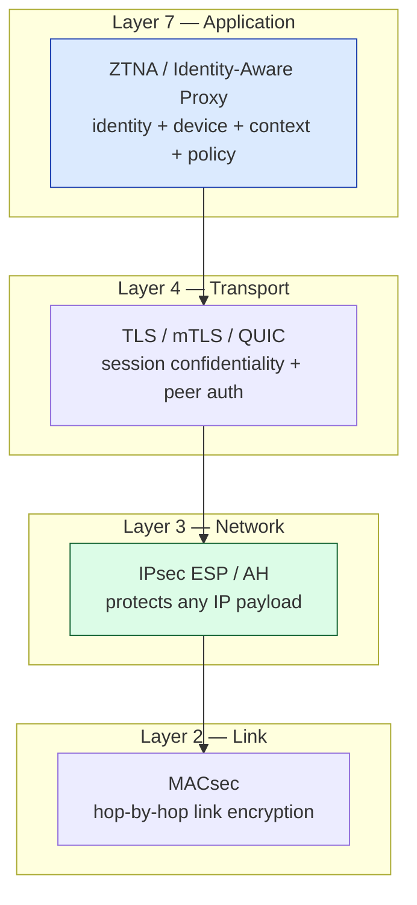

The key consequence of IPsec sitting at Layer 3:

> **Applications do not have to know encryption exists.**

RFC 4301 defines IPsec as providing security services *at the IP layer*, which is precisely why it is protocol-agnostic. [[1]](#refs)

---

## 2. What IPsec actually gives you

### 2.1 Two modes (the original document only described one)

| Mode | What is encapsulated | Typical use |
|---|---|---|
| **Transport mode** | Payload only; original IP header kept | Host-to-host, or inside another tunnel (e.g. L2TP/IPsec, GRE-over-IPsec) |
| **Tunnel mode** | Entire original IP packet, wrapped in a new outer header | Gateway-to-gateway, site-to-site, cloud VPN |

Also worth separating, since they are often merged:

- **ESP (RFC 4303)** — encryption + integrity. This is what everyone deploys.
- **AH (RFC 4302)** — integrity only, **no confidentiality**. Rare, and NAT-hostile.
- **IKEv2 (RFC 7296)** — the key exchange and SA negotiation protocol. IPsec ≠ IKE; IKE is how you get the SAs.

### 2.2 Packet layout

**Tunnel mode (standard site-to-site):**

| | Field |
|---|---|
| Outer IP | `203.0.113.10 → 198.51.100.20` (gateway to gateway) |
| ESP header | SPI, sequence number |
| *Encrypted* | Inner IP `10.1.10.15 → 10.20.50.25` |
| *Encrypted* | TCP/UDP header + application data |
| ESP trailer | Padding, next-header, ICV |

**Transport mode:**

| | Field |
|---|---|
| IP | `10.1.10.15 → 10.20.50.25` (original, in clear) |
| ESP header | SPI, sequence number |
| *Encrypted* | TCP/UDP header + application data |
| ESP trailer | Padding, next-header, ICV |

Note what leaks in each case: tunnel mode hides the inner topology, transport mode does not.

### 2.3 Why that matters operationally

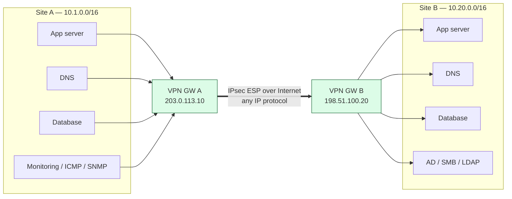

One SA pair covers TCP, UDP, ICMP, SCTP, GRE, ESP-in-ESP, dynamic routing — everything. You do not enumerate applications.

---

## 3. What ZTNA changes

Traditional remote-access VPN asks:

> *"Can this user's device join this network?"*

ZTNA asks:

> *"Can this authenticated user, on this compliant device, reach this specific resource, right now?"*

NIST SP 800-207 frames Zero Trust as moving away from implicit trust granted by network location, and shifting protection to **resources rather than network segments**. [[3]](#refs) Note the precision here: SP 800-207 defines Zero Trust *principles*. "ZTNA" is a market category that implements a subset of them — mostly the resource-access enforcement point.

### 3.1 Before: network admission

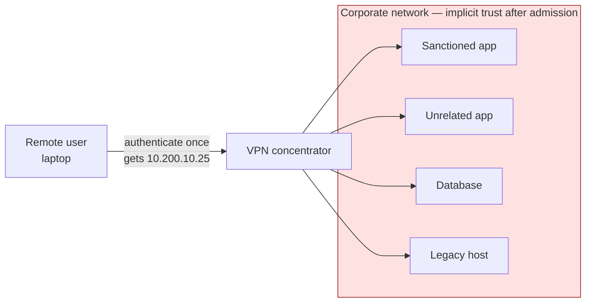

The blast radius is the reachable network, not the authorized app.

### 3.2 After: per-resource authorization

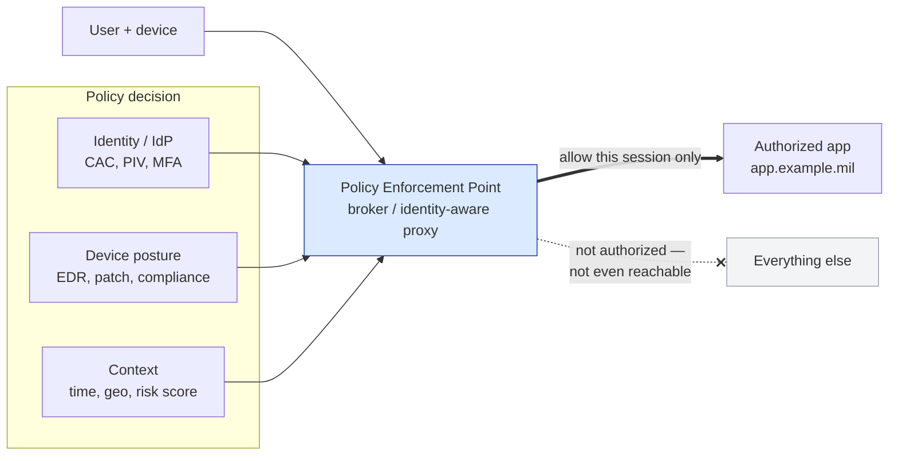

Google's BeyondCorp is the best-known production example: access decisions are attached to the resource rather than to network presence. [[4]](#refs)

---

## 4. Why ZTNA has not replaced IPsec

Four structural reasons, not just inertia.

### 4.1 Protocol coverage

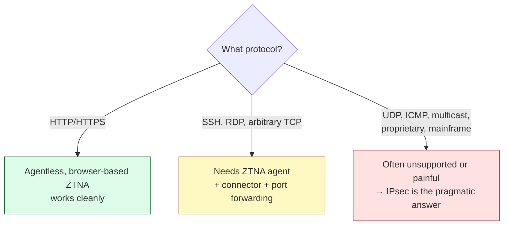

The NCCoE Zero Trust builds explicitly distinguish browser-based agentless access from **client connectors required for non-HTTP and thick-client applications**. [[6]](#refs) Once you add the agent and the connector, you have re-introduced a tunnel — just one with better authorization in front of it.

### 4.2 IPsec authenticates *peers*, not *users*

This is the cleanest way to see that they are not substitutes. IPsec peer authentication (certificate or PSK) tells you *which gateway* is on the other end. It tells you nothing about:

- who the human is
- whether the endpoint is patched
- what role they hold in the application

Conversely, ZTNA tells you nothing about BGP, route propagation, MTU, or how ICMP gets from a monitoring host to a router loopback.

### 4.3 Network-to-network problems have no "application" to proxy

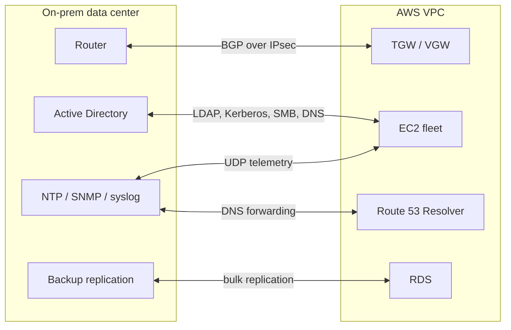

Rewriting every one of those flows as an identity-aware proxy session is somewhere between impractical and impossible.

### 4.4 Interoperability

IPsec/IKEv2 is a standard, so this works:

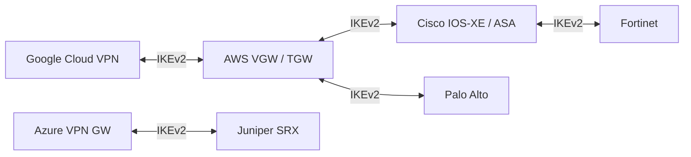

ZTNA is not interchangeable in the same way — agent, broker, policy engine, and connector are usually one vendor's stack end to end. That coupling is a real architectural risk consideration, particularly where ATO boundaries and vendor concentration matter.

---

## 5. Fit table (revised)

The original table over-committed on a few rows. Corrected and qualified:

| Requirement | Better fit | Caveat |
|---|---|---|
| Employee → internal web app | **ZTNA** | The canonical case |
| Contractor → one specific app | **ZTNA** | Strongest argument for ZTNA: no network handed over |
| Developer → private console | **ZTNA** | |
| User → SSH / RDP | **ZTNA (with agent)** | Works well; agentless browser-based variants vary in fidelity |
| User → thick client, UDP app | **Depends** | ZTNA agent may work; verify UDP support per vendor |
| Branch office → data center | **IPsec** | Or SD-WAN, which usually *is* IPsec underneath |
| VPC → on-prem | **IPsec** | Or Direct Connect (+ MACsec or IPsec over it) |
| Cloud → cloud | **IPsec** | |
| Router → router | **IPsec** | |
| Subnet → subnet, all protocols | **IPsec** | |
| BGP / dynamic routing between sites | **IPsec (tunnel mode)** | ZTNA has no routing plane |
| Encrypting a trusted MPLS WAN, any-to-any | **IPsec, GET VPN style** | Preserves routing, QoS, multicast |
| Per-application authorization | **ZTNA** | IPsec cannot express this |
| Continuous re-evaluation of a session | **ZTNA** | An IPsec SA does not re-check posture mid-flow |

---

## 6. They compose — and the reference architectures say so

The NCCoE Zero Trust Architecture builds use an identity-aware proxy for **application access** while still using **IPsec site-to-site VPNs** for connectivity to remote and cloud networks. [[5]](#refs)

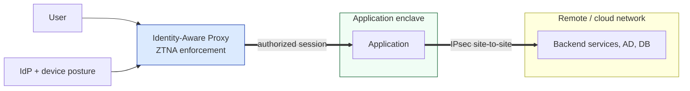

Zero Trust did not eliminate IPsec. It **moved where the trust decision is made** — from "you're on the network" to "this session is authorized."

---

## 7. Decoding "tunnelless" marketing claims

Something still has to carry a private client's traffic to a private application across the Internet. The candidates:

| Layer | Mechanism you'll find in "tunnelless" products |
|---|---|
| L2 | MACsec (backbone links) |
| L3 | IPsec, WireGuard, GRE |
| L4 | TLS, mTLS, QUIC, HTTP/2 CONNECT |
| L7 | Reverse-proxy sessions, connector-initiated outbound tunnels |

What genuinely disappeared:

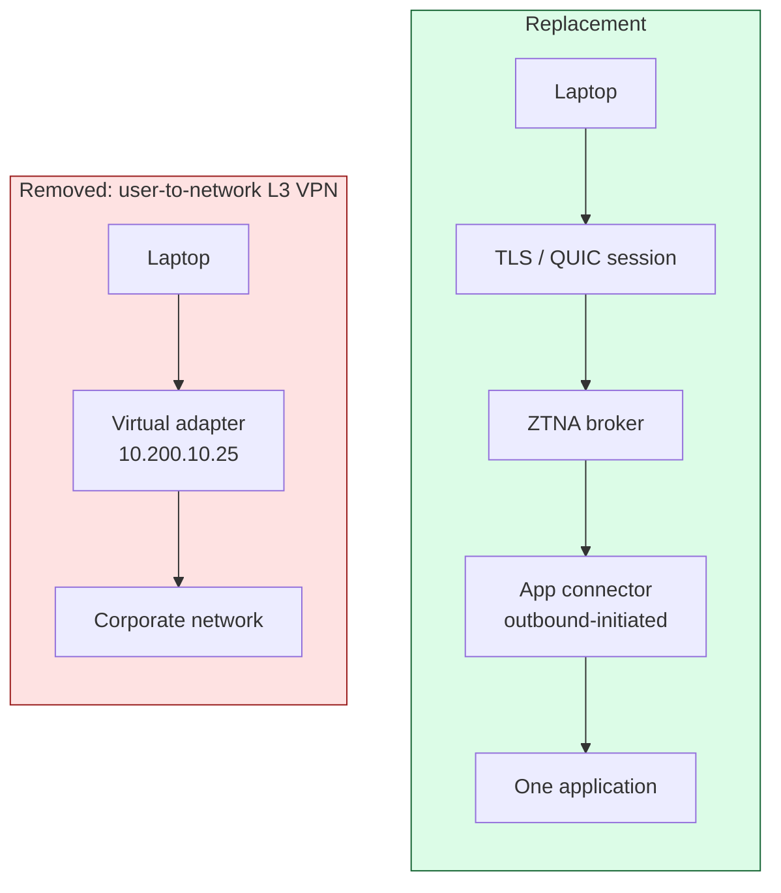

The genuine wins are real: no routable address on the corporate network, no inbound listener to attack, and per-session authorization. Those are worth stating precisely rather than as "no tunnel."

---

## 8. IPsec itself can be "tunnelless" — GET VPN (corrected)

This section had a technical error in the original. GET VPN does **not** use transport mode. It uses **IPsec tunnel mode with header preservation**: the original IP header is *copied* into the outer header rather than replaced.

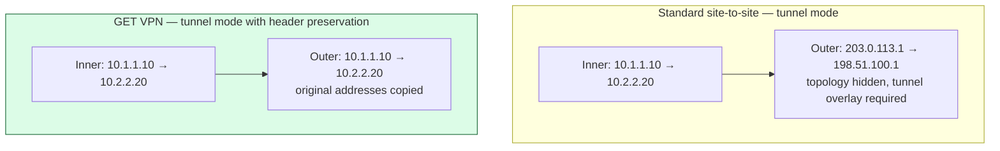

**Why it works that way, and what it costs:**

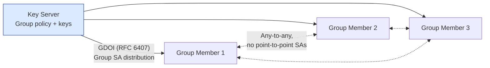

- **Benefit:** any-to-any encryption with no tunnel mesh; native routing, QoS, and multicast are preserved. [[2]](#refs)
- **Cost / constraint:** because the original addresses are exposed in the outer header, the transport network must be able to route them. That means GET VPN is for **private WAN / MPLS**, not the public Internet. It also provides no topology hiding.

This is the cleanest proof that "tunnelless" is a statement about *overlay topology*, not about *whether IPsec is present*.

---

## 9. The two-plane model

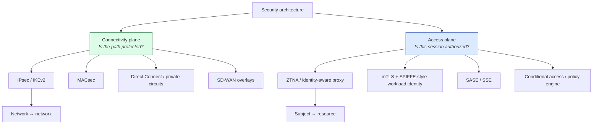

Zero Trust is an **authorization model**, not an instruction to delete encryption tunnels. SP 800-207 treats it as a set of principles, not a specific networking technology. [[3]](#refs) The DoD Zero Trust Reference Architecture takes the same position — it assumes encrypted transport continues to exist and layers policy enforcement above it.

---

## 10. Concrete AWS / SCCA-style example

Both planes present, doing different jobs — this is not a contradiction.

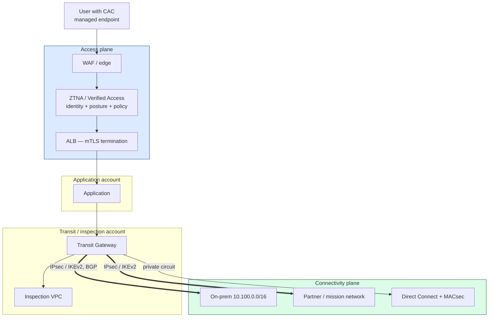

**What each layer decides:**

| Layer | Decision it makes | Decision it does *not* make |
|---|---|---|
| ZTNA | "This CAC-authenticated user, on a compliant managed laptop, in group X, may open a session to `app.example.mil`" | Anything about routes, CIDRs, or IP protocols |
| IPsec | "Traffic between `10.50.0.0/16` and `10.100.0.0/16` is encrypted and integrity-protected in transit" | Anything about who the user is or whether the device is patched |

**AWS implementation notes:**

- Site-to-Site VPN gives you two tunnels per connection for redundancy; use BGP, and enable ECMP on the TGW attachment if you want to aggregate tunnel bandwidth. [[8]](#refs)
- Direct Connect is **not encrypted by default**. If you need encryption on it, that means MACsec (dedicated connections at supported speeds and locations) or IPsec over the private VIF / public VIF path. [[9]](#refs)
- Verify service availability and feature parity in **GovCloud** before designing around any ZTNA-adjacent AWS service — parity lags commercial regions and shifts over time. [[10]](#refs)

---

## 11. Decision aid

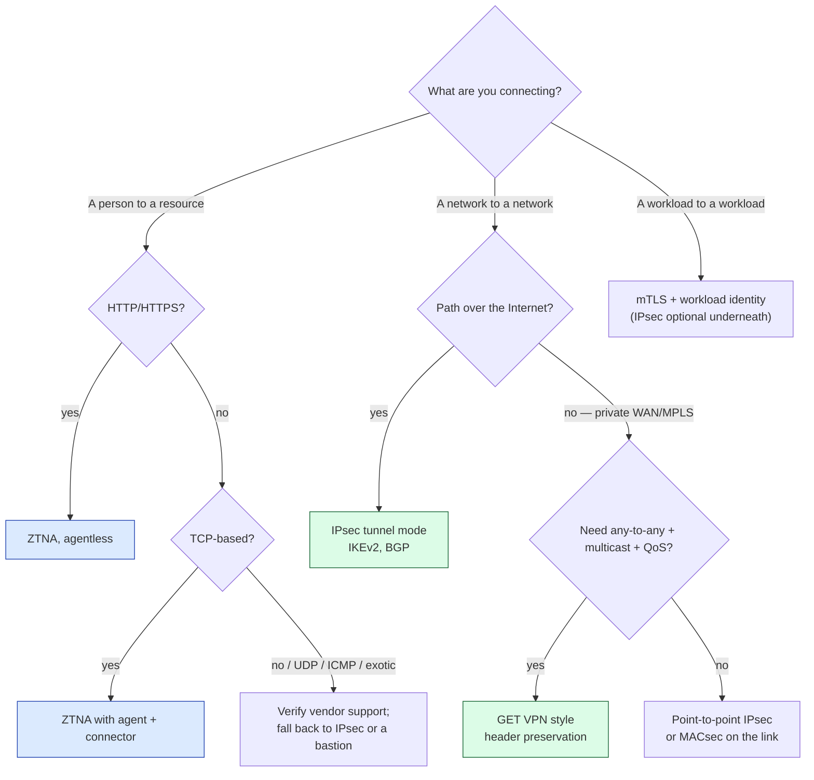

---

## 12. Misconception check

| Claim | Verdict |
|---|---|
| "Zero Trust means no VPN" | **False.** It means no implicit trust from network location. |
| "Tunnelless means no IPsec" | **False.** GET VPN is tunnelless *and* IPsec. |
| "ZTNA replaces site-to-site VPN" | **False.** Different plane; no routing capability. |
| "IPsec provides user authentication" | **False.** It authenticates peers/gateways. |
| "GET VPN uses transport mode" | **False.** Tunnel mode with header preservation. |
| "AH is a lighter alternative to ESP" | **Misleading.** AH provides no confidentiality and breaks under NAT. |
| "Direct Connect is encrypted" | **False.** Private, but not encrypted by default. |
| "Encrypting the pipe satisfies Zero Trust" | **False.** Confidentiality ≠ authorization. |

---

## 13. The natural next question

For a DoD / SCCA-style environment, the follow-on distinction worth writing up separately:

| | MACsec | IPsec | TLS / mTLS |
|---|---|---|---|
| Layer | 2 | 3 | 4+ |
| Scope | Single link, hop by hop | End-to-end between gateways or hosts | End-to-end between endpoints |
| Protects | Frames on one physical link | Any IP payload | One session |
| Survives routing | No — terminates at each hop | Yes | Yes |
| Carries user identity | No | No | Yes, with client certs / CAC |
| Typical use | Direct Connect, DC fabric | Site-to-site, cloud interconnect | App traffic, CAC auth, service mesh |

The practical takeaway that motivates the whole comparison: a private circuit may still need MACsec or IPsec for confidentiality *and* the application on top of it still needs mTLS for identity. Each layer is answering a question the others cannot.

---

## Corrections made to the source document

For traceability:

1. **GET VPN mode** — corrected from implied transport mode to tunnel mode with header preservation; added the MPLS/private-WAN constraint and the loss of topology hiding, which the original omitted.
2. **IPsec scope** — added transport vs. tunnel mode, and separated ESP / AH / IKEv2 rather than treating "IPsec" as one monolith.
3. **NIST framing** — clarified that SP 800-207 defines Zero Trust *principles*; "ZTNA" is a market term implementing part of them. The original implied NIST defines ZTNA.
4. **Fit table** — softened over-confident rows (thick-client and UDP support is vendor-dependent, not a clean "ZTNA can work"), and added continuous re-evaluation and trusted-WAN encryption rows.
5. **New argument added** — IPsec authenticates *peers*, not *users*. This is the sharpest single reason the two are not substitutes, and it was missing.
6. **Direct Connect accuracy** — noted explicitly that it is unencrypted by default.
7. **Diagrams** — ASCII art replaced with Mermaid throughout; added layer-position, GDOI key-server, two-plane, and decision-tree diagrams that had no equivalent.
8. **Structure** — added TL;DR, misconception table, and a MACsec/IPsec/TLS comparison so the closing teaser is actionable.
9. **Citations** — removed tracking parameters from URLs; added RFC 4302, 4303, 6407, 7296 and AWS documentation.

---

<a name="refs"></a>
## References

1. RFC 4301 — *Security Architecture for the Internet Protocol* — https://www.rfc-editor.org/rfc/rfc4301
2. Cisco — Group Encrypted Transport VPN (GET VPN), Cisco Security Manager User Guide — https://www.cisco.com/c/en/us/td/docs/security/security_management/cisco_security_manager/security_manager/429/user/csm-user-guide-429/m_vpget.html
3. NIST SP 800-207 — *Zero Trust Architecture* — https://csrc.nist.gov/pubs/sp/800/207/final
4. Google Cloud — BeyondCorp — https://cloud.google.com/beyondcorp
5. NIST — *Implementing a Zero Trust Architecture*, architecture and builds — https://pages.nist.gov/zero-trust-architecture/
6. NCCoE — NIST SP 1800-35, *Implementing a Zero Trust Architecture* — https://www.nccoe.nist.gov/projects/implementing-zero-trust-architecture
7. RFC 4303 (ESP) — https://www.rfc-editor.org/rfc/rfc4303 · RFC 4302 (AH) — https://www.rfc-editor.org/rfc/rfc4302 · RFC 7296 (IKEv2) — https://www.rfc-editor.org/rfc/rfc7296 · RFC 6407 (GDOI) — https://www.rfc-editor.org/rfc/rfc6407
8. AWS — Site-to-Site VPN User Guide — https://docs.aws.amazon.com/vpn/latest/s2svpn/VPC_VPN.html
9. AWS — Direct Connect User Guide — https://docs.aws.amazon.com/directconnect/latest/UserGuide/Welcome.html
10. AWS — Verified Access User Guide — https://docs.aws.amazon.com/verified-access/latest/ug/what-is-verified-access.html
11. DoD CIO — *Zero Trust Reference Architecture*, v2.0 (cited by title; retrieve from dodcio.defense.gov)
