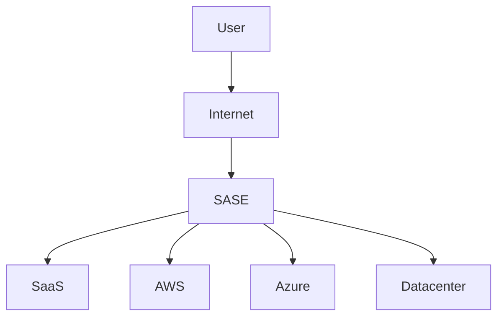

This is a very important design topic because it shows how WAN architectures evolved over the last 25 years.

Most engineers learn the technologies separately:

* MPLS VPN
* DMVPN
* IPsec VPN
* SD-WAN
* SASE

But as an architect, you should understand **why each generation appeared and what problem it solved.**

---

# Evolution of Enterprise WAN

```text
1990s
Leased Lines
      |
      V
2000s
MPLS VPN
      |
      V
2010s
DMVPN / IPsec Overlay
      |
      V
2015+
SD-WAN
      |
      V
2020+
SASE / SSE / Zero Trust WAN
```

---

# Phase 1 - Traditional MPLS WAN

Typical enterprise:

```text
      Branch
         |
      MPLS VPN
         |
      MPLS Cloud
         |
      MPLS VPN
         |
     Data Center
```

Characteristics:

* Private WAN
* Carrier managed
* Predictable latency
* QoS support
* High SLA

Advantages:

* Reliable
* Secure separation using MPLS VRF
* Voice friendly

Disadvantages:

* Expensive
* Slow provisioning
* Bandwidth costs high
* Internet breakout centralized

---

## Security Model

Many people incorrectly think MPLS is encrypted.

It is not.

Security comes from:

```text
VRF Separation
+
Provider Trust
```

Customer-A traffic separated from Customer-B traffic.

No encryption.

If encryption required:

```text
IPsec over MPLS
```

---

# Phase 2 - Internet VPN Hub-and-Spoke

Companies wanted cheaper WAN.

Instead of:

```text
Branch -> MPLS -> DC
```

they used:

```text
Branch -> Internet -> HQ VPN Hub
```

Architecture:

```text
         HQ
     VPN Hub
        |
   +----+----+
   |    |    |
Branch Branch Branch
```

---

## Security

IPsec provides:

### Confidentiality

AES

### Integrity

SHA

### Authentication

Certificates or PSK

### Anti-Replay

Sequence numbers

---

## Benefits

Cheap

Internet available everywhere

---

## Problems

All traffic hairpins through HQ

Example:

```text
User -> HQ -> Office365
```

Terrible experience.

---

# Phase 3 - DMVPN

Cisco solved scalability problem.

Before DMVPN:

```text
100 branches

99 tunnels per site
```

Impossible.

DMVPN introduced:

* mGRE
* NHRP
* IPsec

Architecture:

```text
          Hub
           |
      NHRP Database
           |
    +------+------+ 
    |      |      |
   B1     B2     B3
```

---

## Dynamic Spoke-to-Spoke

Instead of:

```text
B1 -> Hub -> B2
```

DMVPN creates:

```text
B1 ------ B2
```

direct tunnel.

Huge improvement.

---

## Security

Still IPsec.

```text
GRE
  inside
IPsec
```

or

```text
mGRE
  inside
IPsec
```

---

# Phase 4 - Hybrid WAN

Cloud changed everything.

Applications moved to:

* Office365
* Salesforce
* AWS
* Azure

Traditional WAN became inefficient.

```text
User
 |
Branch
 |
HQ
 |
Internet
 |
Office365
```

---

# Problem

Traffic path:

```text
Virginia
   |
Chicago HQ
   |
Microsoft
```

Huge latency.

---

# Phase 5 - SD-WAN

The biggest WAN shift since MPLS.

Core idea:

> Separate Control Plane from Data Plane.

Just like SDN.

---

## Traditional WAN

```text
Each router decides routing
```

Distributed intelligence.

---

## SD-WAN

```text
      Controller

      vSmart
      Orchestrator
            |
            |
  ---------------------
  |         |         |
 Edge1    Edge2    Edge3
```

Controller defines policy.

Edges execute.

---

# Transport Independence

Any transport works.

```text
MPLS
Broadband
5G
Starlink
LTE
Internet
```

All simultaneously.

```text
          SD-WAN
             |
  -----------------------
  MPLS Internet LTE 5G
```

---

# Security in SD-WAN

Many engineers ask:

> If MPLS is gone, how is traffic protected?

Answer:

Every SD-WAN fabric is essentially:

```text
Encrypted Overlay
```

over any transport.

Example:

```text
Branch A
    |
IPsec Tunnel
    |
Internet
    |
IPsec Tunnel
    |
Branch B
```

except automated.

---

## Under the Hood

Most SD-WAN vendors use:

```text
AES-256
IPsec
IKEv2
Certificates
```

Examples:

* Cisco SD-WAN (Viptela)
* Palo Alto Prisma SD-WAN
* Fortinet SD-WAN
* Versa
* Aruba EdgeConnect

All create encrypted overlays.

---

# SD-WAN Security Architecture


Encryption is automatic.

No manual VPN mesh.

---

# Why SD-WAN Beats DMVPN

| Feature                   | DMVPN   | SD-WAN    |
| ------------------------- | ------- | --------- |
| IPsec Encryption          | Yes     | Yes       |
| Dynamic Tunnels           | Yes     | Yes       |
| Application Aware Routing | Limited | Yes       |
| Central Policy            | No      | Yes       |
| Cloud Integration         | Limited | Excellent |
| SaaS Optimization         | No      | Yes       |
| Zero Touch Provisioning   | No      | Yes       |
| Visibility                | Limited | Excellent |

---

# Current Generation (2025-2026)

SD-WAN is becoming part of SASE.

---

# SASE

Coined by Gartner.

Combines:

```text
SD-WAN
+
Cloud Security
+
Zero Trust
```

---

Architecture:



---

# Security Shift

Old model:

```text
Trust Network
Authenticate User Once
```

---

New model:

```text
Trust Nobody
Verify Continuously
```

Zero Trust.

---

# Modern Security Components

### ZTNA

Replaces VPN.

```text
User
  |
Identity Verified
  |
Specific App Access
```

Not network access.

---

### SWG

Secure Web Gateway.

Filters internet access.

---

### CASB

Controls SaaS applications.

Examples:

* Office365
* Salesforce
* Box

---

### DLP

Prevents data exfiltration.

---

# Next Generation Trend (2026+)

The trend is:

```text
MPLS
   ->
IPsec Overlay
   ->
DMVPN
   ->
SD-WAN
   ->
SASE
   ->
Identity-Based Networking
```

Future WAN decision is becoming:

```text
Identity
+
Application
+
Device Posture
+
Location
```

instead of:

```text
IP Address
+
Subnet
+
Route
```

---

# What Network Architects Should Know

When evaluating WAN solutions, ask:

1. What business problem are we solving?
2. Is MPLS still required for SLA-sensitive traffic?
3. Can Internet + SD-WAN meet requirements?
4. Where is encryption required?
5. Who controls routing decisions?
6. Where is policy enforced?
7. How is SaaS traffic optimized?
8. Is cloud security integrated (SASE)?
9. What is the operational complexity?
10. What is the migration strategy?

The biggest architectural shift is that **WAN is no longer primarily a routing problem. It is becoming an application, identity, and security problem.** MPLS focused on transport, DMVPN focused on connectivity, SD-WAN focuses on application experience, and SASE focuses on application experience plus security.
