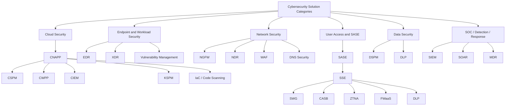
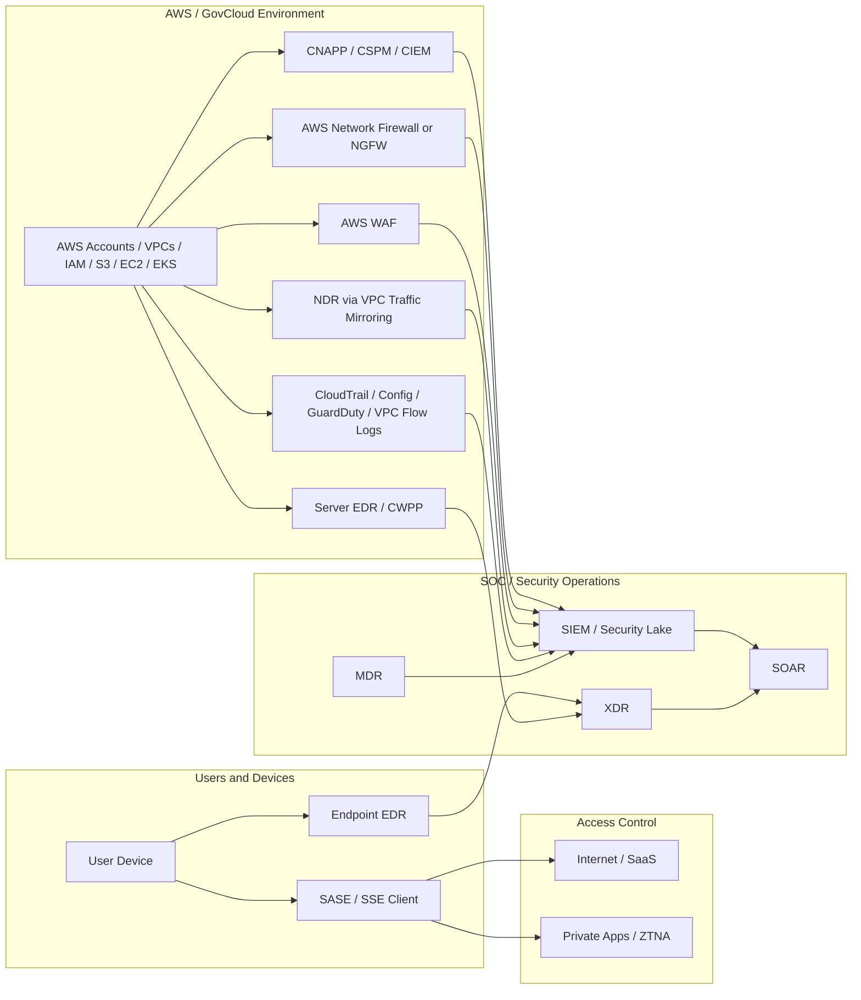

# Cybersecurity Solution: Consolidation, and Overlap

**Purpose:** Explain common cybersecurity solution categories such as CNAPP, CSPM, CWPP, NGFW, SASE, SSE, CASB, EDR, XDR, NDR, WAF, DSPM, SIEM, SOAR, and MDR. The focus is not only what each acronym means, but what specific problem it solves, what it consolidates, and where it overlaps with other tools.

**Audience:** Cloud security architects, network architects, security engineers, SOC teams, and leaders trying to rationalize vendor overlap.

---

## 1. Executive Summary

The cybersecurity vendor landscape is confusing because product categories keep merging. Most vendors no longer sell only one narrow control. A cloud security vendor may now offer CSPM, CWPP, CIEM, Kubernetes security, vulnerability management, and data security under one CNAPP platform. A network security vendor may combine firewall, proxy, CASB, ZTNA, SWG, and DLP under SASE or SSE. Endpoint vendors are expanding from antivirus and EDR into XDR, cloud workload protection, identity threat detection, and managed response.

The main trend is **platform consolidation**, but consolidation does not mean one tool solves every security problem. The better architecture approach is to map tools to the specific problem they solve.

Use this simple mental model:

```text
CNAPP = cloud risk brain
CSPM = cloud misconfiguration checker
CWPP = workload/server/container protection
CIEM = cloud IAM permission analyzer
EDR = endpoint/server compromise detection and response
XDR = endpoint + identity + email + cloud correlation
NDR = network visibility and threat detection
NGFW = inline network enforcement
WAF = HTTP/HTTPS application protection
SASE/SSE = secure user access to internet, SaaS, and private apps
CASB = SaaS visibility and control
SWG = secure web browsing
ZTNA = VPN replacement for private app access
DSPM = sensitive data discovery and exposure analysis
SIEM = central log correlation
SOAR = automated response workflow
MDR = managed detection and response service
```

---

## 2. Cybersecurity Category Map



---

## 3. Problems Solved, Consolidation, and Overlap

| Category | Specific problem it solves | What it consolidates | Where it overlaps | What it does **not** fully solve |
|---|---|---|---|---|
| **CSPM** | Cloud misconfiguration: public buckets, open security groups, weak logging, unencrypted resources, risky cloud settings. | Cloud config audits, compliance scripts, manual AWS Config reviews, CIS benchmark checks. | CNAPP, compliance tools, AWS Config, AWS Security Hub. | Runtime compromise, malware, packet inspection, inline blocking. |
| **CWPP** | Workload risk: vulnerable EC2/VM/container, malware, runtime behavior, file/process activity, workload hardening. | Vulnerability scanner, server security agent, container runtime scanner, some EDR functions. | CNAPP, EDR, container security, vulnerability management. | Cloud control-plane misconfiguration, SaaS control, user web traffic control. |
| **CIEM** | Cloud IAM over-permissioning: excessive IAM roles, unused permissions, risky cross-account trust. | IAM access reviews, least-privilege analysis, entitlement reporting. | CNAPP, identity governance, PAM, cloud IAM tools. | Malware, network inspection, DLP, endpoint compromise. |
| **KSPM** | Kubernetes posture risk: privileged pods, exposed API server, weak RBAC, risky admission policy, weak network policy. | Kubernetes benchmark scanning, manual kubeconfig/RBAC review. | CNAPP, container security, DevSecOps tools. | Host EDR, network firewalling, SaaS control. |
| **CNAPP** | Unified cloud risk: posture, workload, identity, Kubernetes, IaC/code, attack path, and prioritization. | CSPM + CWPP + CIEM + KSPM + IaC scanning + container/image scanning. | EDR, vulnerability management, DSPM, compliance tools, DevSecOps tools. | Full NGFW enforcement, deep packet inspection, user web/SaaS proxy, endpoint response unless integrated. |
| **NGFW** | Inline network enforcement: inspect/block traffic by app, user, URL, threat signature, TLS, IPS. | Traditional firewall + IPS + URL filtering + app control + threat prevention. | SASE/SSE, NDR, AWS Network Firewall, WAF, DNS security. | Cloud posture, IAM risk, workload vulnerability, SaaS governance. |
| **AWS Network Firewall** | AWS-native centralized firewalling and Suricata-style inspection. | Some firewall + IDS/IPS use cases in AWS. | NGFW, NDR, security groups, network ACLs, Gateway Load Balancer firewalls. | Full enterprise NGFW app/user visibility, broad SaaS/DLP control, endpoint behavior visibility. |
| **NDR** | Network visibility and detection: east-west traffic, beaconing, lateral movement, DNS tunneling, suspicious protocols. | Packet capture, IDS, Zeek/Suricata sensors, SOC network analytics. | NGFW, VPC Flow Logs, GuardDuty, SIEM. | Usually does not block inline unless deployed in-path. Does not know host process details like EDR. |
| **EDR** | Endpoint/server compromise detection and response: process, file, user, memory, script, malware, ransomware. | Antivirus + endpoint telemetry + host response + investigation timeline. | CWPP, CNAPP runtime, MDR, SIEM, XDR. | Cloud misconfiguration, SaaS DLP, inline network firewalling. |
| **XDR** | Cross-domain detection: endpoint + identity + email + cloud + SaaS + sometimes network. | EDR plus multiple security telemetry sources. | SIEM, SOAR, MDR, endpoint suites. | It does not replace all logging, compliance reporting, or every best-of-breed sensor. |
| **SASE** | Secure access for users/branches to internet, SaaS, cloud, and private apps from anywhere. | SD-WAN + SWG + CASB + ZTNA + FWaaS + DLP. | NGFW, VPN, CASB, SWG, ZTNA, DLP. | Deep EC2 workload protection, cloud posture, server EDR. |
| **SSE** | Security part of SASE without SD-WAN: secure web, SaaS, private app access, DLP, CASB, ZTNA. | SWG + CASB + ZTNA + FWaaS + DLP. | SASE, NGFW, proxy, VPN, CASB. | Branch routing/SD-WAN, endpoint EDR, cloud posture. |
| **CASB** | SaaS visibility and control: shadow IT, SaaS DLP, risky OAuth apps, sanctioned/unsanctioned app control. | SaaS discovery, SaaS DLP, cloud app policy, OAuth app review. | SSE, SASE, DLP, DSPM, Microsoft Defender for Cloud Apps. | EC2/server protection, inline AWS VPC firewalling, OS-level malware detection. |
| **SWG** | Secure web browsing: URL filtering, malware scanning, HTTPS inspection, web DLP. | Web proxy, URL filter, web malware gateway. | SASE/SSE, NGFW, DNS filtering, browser isolation. | Cloud posture, workload protection, private app segmentation. |
| **ZTNA** | VPN replacement: per-application private access based on identity, device posture, and policy. | Remote-access VPN, app publishing, identity-aware reverse proxy. | SASE/SSE, identity-aware proxy, AWS Verified Access, BeyondCorp-style access. | Full network firewalling, malware detection, cloud posture. |
| **WAF** | HTTP/HTTPS application-layer protection: SQL injection, XSS, bots, rate limiting, header/path rules. | Web app firewall rules, bot controls, basic API edge protection. | NGFW for web traffic, API security, CDN security. | Non-HTTP protocols, workload malware, cloud posture. |
| **DSPM** | Sensitive data discovery and exposure: where sensitive data is, who can access it, whether it is exposed. | Data discovery, data classification, some DLP/data governance reporting. | CNAPP, CASB, DLP, data governance. | Runtime malware, network IPS, endpoint response. |
| **DLP** | Prevent sensitive data from leaving approved channels. | Content inspection, data movement policy, endpoint/web/SaaS controls. | CASB, SWG, SSE, DSPM, endpoint security. | Asset posture, malware detection, network IPS. |
| **SIEM** | Central log collection, correlation, detection rules, reporting, compliance evidence. | Log management, alert correlation, SOC dashboards. | XDR, Security Lake, SOAR. | It does not secure anything by itself; it depends on log quality and integrations. |
| **SOAR** | Automates response workflows and repeatable SOC actions. | Manual SOC playbooks, ticket updates, enrichment scripts. | SIEM, XDR, MDR. | Detection without telemetry, prevention controls. |
| **MDR** | Managed monitoring, investigation, and response by a provider. | Outsourced SOC, managed EDR/XDR operations. | EDR, XDR, SIEM, MSSP. | It is a service model, not a standalone technical control. |

---

## 4. Consolidation Map

```mermaid
flowchart TD
    CSPM[CSPM<br/>Cloud misconfiguration] --> CNAPP[CNAPP<br/>Cloud-native application protection]
    CWPP[CWPP<br/>Workload protection] --> CNAPP
    CIEM[CIEM<br/>Cloud IAM risk] --> CNAPP
    KSPM[KSPM<br/>Kubernetes posture] --> CNAPP
    IAC[IaC / Code scanning] --> CNAPP
    VM[Vulnerability management] --> CNAPP
    DSPM[DSPM<br/>Data posture] -. partial overlap .-> CNAPP

    SWG[SWG<br/>Secure web gateway] --> SSE[SSE<br/>Security Service Edge]
    CASB[CASB<br/>SaaS control] --> SSE
    ZTNA[ZTNA<br/>Private app access] --> SSE
    DLP[DLP<br/>Data loss prevention] --> SSE
    FWaaS[FWaaS<br/>Firewall as a service] --> SSE
    SSE --> SASE[SASE<br/>SSE + SD-WAN]

    AV[Antivirus] --> EDR[EDR<br/>Endpoint detection response]
    EDR --> XDR[XDR<br/>Endpoint + identity + email + cloud]

    FW[Traditional firewall] --> NGFW[NGFW<br/>App/user/threat-aware firewall]
    IPS[IPS] --> NGFW
    URL[URL filtering] --> NGFW
    TLS[TLS inspection] --> NGFW
    Threat[Threat intelligence] --> NGFW
```



### What is consolidating?

| Consolidating platform | Pulls together |
|---|---|
| **CNAPP** | CSPM, CWPP, CIEM, KSPM, IaC scanning, container scanning, attack-path analysis. |
| **SASE** | SD-WAN, SWG, CASB, ZTNA, FWaaS, DLP. |
| **SSE** | SWG, CASB, ZTNA, FWaaS, DLP, without SD-WAN. |
| **XDR** | EDR plus identity, email, cloud, SaaS, and sometimes network detections. |
| **NGFW** | Traditional firewall, IPS, app control, URL filtering, user awareness, TLS inspection, threat prevention. |
| **Security exposure management / CTEM** | Vulnerability management, attack-path analysis, external exposure, exploitability validation, prioritization. |

---

## 5. Where the Categories Overlap

### 5.1 CNAPP vs CSPM vs CWPP

```text
CSPM = cloud configuration problem
CWPP = workload runtime/server/container problem
CNAPP = combines both and adds identity, Kubernetes, code, and attack path
```

When a vendor says **CNAPP**, it usually means they are trying to replace separate CSPM, CWPP, CIEM, container security, and IaC tools with a single cloud security platform.

### 5.2 CNAPP vs EDR

CNAPP and EDR overlap on **workload runtime visibility**, but they are not the same.

```text
CNAPP tells you cloud risk and attack path.
EDR tells you what the process, file, user, and malware did on the host.
```

For EC2/server security, many organizations need both.

### 5.3 NGFW vs SASE/SSE

NGFW and SASE/SSE overlap on firewalling, URL filtering, TLS inspection, DNS security, and threat prevention.

```text
NGFW = usually protects networks, data centers, cloud VPC traffic, and inspection points
SASE/SSE = usually protects users going to internet, SaaS, and private apps
```

In AWS, NGFW may sit in a **Transit Gateway / Gateway Load Balancer inspection VPC**. SASE/SSE usually sits between **users/devices and internet/SaaS/private applications**.

### 5.4 NGFW vs WAF

```text
NGFW = broad network and application-aware firewall for many protocols
WAF = HTTP/HTTPS web application firewall
```

WAF is better for SQL injection, cross-site scripting, path/header/cookie rules, bot controls, and rate limits. NGFW is broader network enforcement.

### 5.5 NDR vs NGFW

```text
NDR = visibility and detection
NGFW = enforcement and blocking
```

NDR can be passive using traffic mirroring. NGFW is usually inline.

### 5.6 CASB vs DSPM vs DLP

```text
CASB = controls SaaS app usage
DSPM = discovers sensitive data and exposure
DLP = blocks or monitors sensitive data movement
```

These overlap heavily around data protection.

### 5.7 SIEM vs XDR

```text
SIEM = central log collection, correlation, compliance evidence
XDR = security detection and response across endpoint, identity, email, cloud, and SaaS
```

SIEM is broader for log management and audit. XDR is usually more focused on security detection, investigation, and response.

---

## 6. AWS / SCCA-Specific Mapping

| AWS/SCCA problem | Best-fit category | Example controls |
|---|---|---|
| Are AWS accounts, VPCs, IAM, S3, RDS, and logging configured securely? | CSPM / CNAPP | Wiz, Prisma Cloud, Defender for Cloud, Orca, AWS Config, Security Hub |
| Which cloud risk creates the real attack path? | CNAPP | Wiz attack path, Prisma Cloud, Defender CSPM |
| Do EC2/Linux/Windows workloads have malware or suspicious processes? | EDR / CWPP | Microsoft Defender for Endpoint, CrowdStrike, SentinelOne, CNAPP runtime agent |
| Can I inspect and block traffic inline through VDSS? | NGFW / AWS Network Firewall | AWS Network Firewall, Palo Alto VM-Series, Fortinet, Check Point via GWLB |
| Can I get passive east-west visibility without inserting inline firewall? | NDR + VPC Traffic Mirroring | Corelight, ExtraHop, Vectra, Zeek/Suricata-based sensors |
| Can I protect public web applications? | WAF | AWS WAF with ALB, CloudFront, API Gateway |
| Can I secure remote users going to SaaS/private apps? | SASE/SSE | Netskope, Zscaler, Palo Alto Prisma Access, Cisco Secure Access, Cloudflare One, Microsoft Global Secure Access |
| Can I replace VPN with app-level access? | ZTNA | Netskope Private Access, Zscaler Private Access, Cloudflare Access, AWS Verified Access, Microsoft Entra Private Access |
| Can I discover CUI/PII/sensitive data exposure? | DSPM / DLP | Wiz DSPM, Microsoft Purview, Netskope DLP, BigID, Cyera |
| Can I correlate all logs for SOC? | SIEM / Security Lake / XDR | Microsoft Sentinel, Splunk, Elastic, AWS Security Lake, Defender XDR |

---

## 7. Practical AWS Reference Architecture



---

## 8. Decision Guide

| If the requirement says... | Use this category first |
|---|---|
| “Find public buckets, open SGs, weak IAM, missing logs.” | CSPM / CNAPP |
| “Show me the real attack path across AWS accounts.” | CNAPP |
| “Protect EC2/Windows/Linux servers from malware and suspicious process behavior.” | EDR / CWPP |
| “Protect containers and Kubernetes runtime.” | CWPP / KSPM / CNAPP runtime |
| “Reduce excessive IAM permissions.” | CIEM |
| “Inspect and block traffic inline.” | NGFW / AWS Network Firewall |
| “Get packet/protocol visibility without changing the traffic path.” | NDR / Traffic Mirroring |
| “Protect a public HTTP/HTTPS application.” | WAF |
| “Control users browsing the internet.” | SWG / SASE / SSE |
| “Control SaaS apps and shadow IT.” | CASB / SASE / SSE |
| “Replace VPN with per-app access.” | ZTNA |
| “Find sensitive data exposure.” | DSPM |
| “Prevent sensitive data exfiltration.” | DLP |
| “Collect and correlate security logs.” | SIEM |
| “Automate SOC response.” | SOAR |
| “Have a provider monitor and respond.” | MDR |

---

## 9. Current Industry Trends

### 9.1 Platform consolidation

Organizations are reducing tool sprawl by consolidating around larger platforms:

- CNAPP for cloud security
- SASE/SSE for user access and web/SaaS/private app security
- XDR for detection and response
- NGFW for inline network security
- DSPM/DLP for data protection

The goal is not simply fewer tools. The goal is fewer blind spots, better correlation, and more consistent policy enforcement.

### 9.2 Cloud security moving from posture to attack path

Cloud security is moving from long lists of findings to prioritized attack paths.

Old model:

```text
You have 8,000 vulnerabilities and 500 misconfigurations.
```

Better model:

```text
Internet-facing workload -> exploitable vulnerability -> privileged IAM role -> sensitive S3 bucket.
```

### 9.3 Identity is the new perimeter

In cloud environments, attackers often abuse identity instead of bypassing firewalls. Examples include stolen access keys, over-permissioned IAM roles, risky cross-account trusts, OAuth token abuse, service principals, and CI/CD credentials.

This is why CIEM, PAM, identity threat detection, workload identity, and conditional access are increasingly important.

### 9.4 SASE/SSE replacing traditional VPN and proxy models

Remote work, SaaS, cloud apps, and contractors have made the old “VPN into the network” model risky and inefficient. SASE/SSE moves security enforcement closer to users and applications, with policy based on identity, device posture, data risk, and application context.

### 9.5 Runtime visibility is becoming more important

Agentless cloud scanning is useful, but security teams also need to know what is actually running, whether a vulnerable package is reachable, whether a process is malicious, and whether traffic is suspicious. This is driving adoption of EDR, runtime CNAPP sensors, eBPF-based workload visibility, and NDR.

### 9.6 Data security and AI security are merging

Sensitive data is now spread across S3, databases, SaaS, collaboration platforms, AI tools, vector databases, notebooks, and data lakes. DSPM, DLP, CASB, and AI governance are becoming more connected.

---

## 10. Zero Trust Mapping

Zero Trust is not a single product. It is an architecture that depends on multiple control points.

| Zero Trust pillar | Relevant categories |
|---|---|
| **Identity** | IAM, CIEM, PAM, ZTNA, conditional access |
| **Devices** | EDR, MDM, device posture, SASE/SSE client |
| **Networks** | NGFW, NDR, SASE/SSE, segmentation, DNS security |
| **Applications and Workloads** | CNAPP, CWPP, WAF, API security, KSPM |
| **Data** | DSPM, DLP, CASB, encryption, data governance |
| **Visibility and Analytics** | SIEM, XDR, NDR, CNAPP, Security Lake |
| **Automation and Orchestration** | SOAR, automated remediation, policy-as-code |

---

## 11. Key Takeaways

Do not buy tools by acronym. Map them to problems.

For cloud risk, use **CNAPP**.

For cloud misconfiguration, use **CSPM**.

For workload/server/container protection, use **CWPP or EDR**.

For cloud IAM risk, use **CIEM**.

For inline network enforcement, use **NGFW or AWS Network Firewall**.

For packet and east-west visibility, use **NDR**.

For web application protection, use **WAF**.

For user-to-internet, SaaS, and private app access, use **SASE or SSE**.

For SaaS control, use **CASB**.

For sensitive data exposure, use **DSPM and DLP**.

For SOC correlation, use **SIEM, XDR, SOAR, or MDR**.

The current trend is not that one tool replaces everything. The real trend is consolidation into several major platforms:

```text
CNAPP for cloud
SASE/SSE for user access
XDR for detection and response
NGFW for inline network enforcement
DSPM/DLP for data security
SIEM/SOAR/MDR for SOC operations
```

---

## 12. References

- NIST Cybersecurity Framework 2.0: https://nvlpubs.nist.gov/nistpubs/CSWP/NIST.CSWP.29.pdf
- CISA Zero Trust Maturity Model: https://www.cisa.gov/zero-trust-maturity-model
- CISA Zero Trust Maturity Model Version 2.0 PDF: https://www.cisa.gov/sites/default/files/2023-04/CISA_Zero_Trust_Maturity_Model_Version_2_508c.pdf
- Palo Alto Networks SASE overview: https://www.paloaltonetworks.com/cyberpedia/what-is-sase
- Zscaler SASE glossary: https://www.zscaler.com/resources/security-terms-glossary/what-is-sase
- Palo Alto Networks SASE vs SSE vs SD-WAN: https://www.paloaltonetworks.com/cyberpedia/sdwan-vs-sase-vs-sse
