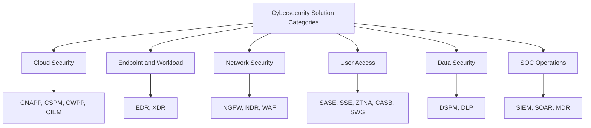
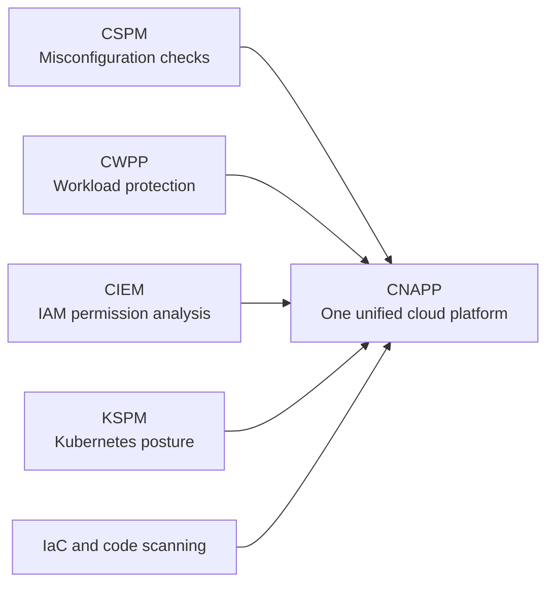
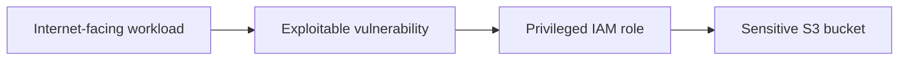
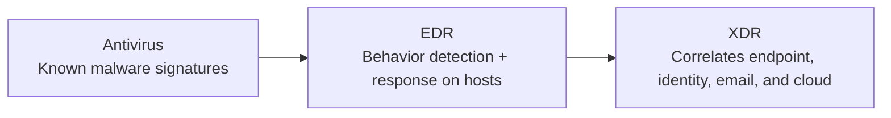
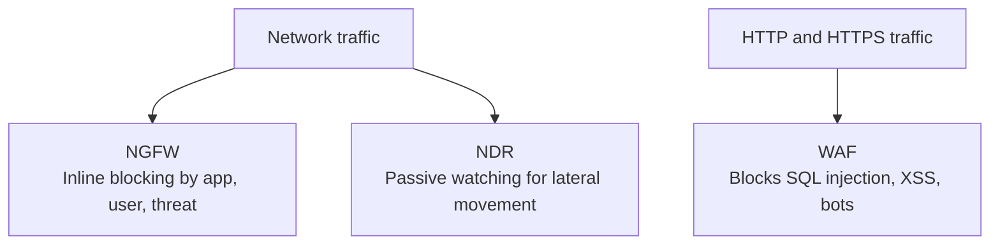
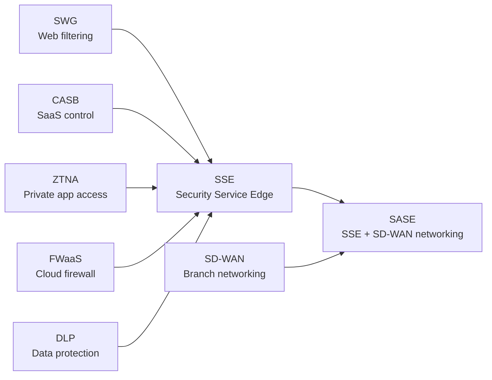
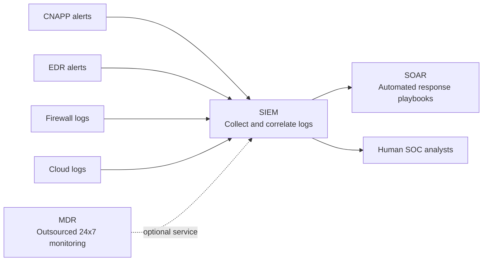
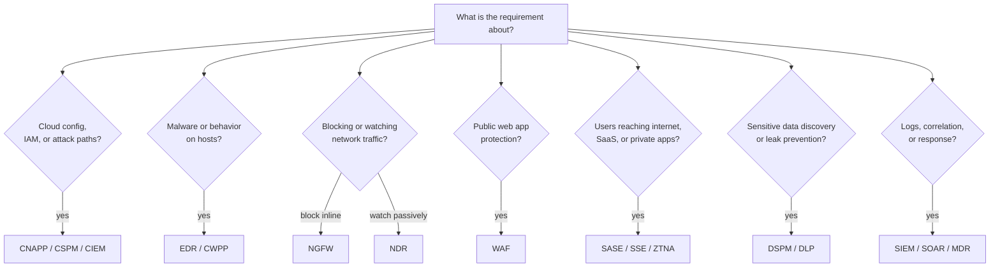

# Cybersecurity Solutions 

> **Who this is for:** New cybersecurity engineers who keep hearing acronyms like CNAPP, SASE, EDR, and SIEM and want to understand **what problem each one actually solves** — without vendor marketing noise.
>
> **How to read this:** Start with the 30-second mental model, then the big map. Each section answers three questions: *What problem does it solve? What's a real-world analogy? Where does it overlap with other tools?*

---

## 1. The 30-Second Mental Model

| Acronym        | Full Form                                          | Actual Function Currently                                                                                                                                     |
| -------------- | -------------------------------------------------- | ------------------------------------------------------------------------------------------------------------------------------------------------------------- |
| **CNAPP**      | Cloud-Native Application Protection Platform       | Consolidates CSPM, CWPP, CIEM, vulnerability management, IaC scanning, container/Kubernetes security, and cloud risk prioritization into one platform.        |
| **CSPM**       | Cloud Security Posture Management                  | Continuously scans cloud accounts for insecure configurations, compliance drift, exposed services, logging gaps, and policy violations.                       |
| **CWPP**       | Cloud Workload Protection Platform                 | Protects compute workloads by monitoring runtime behavior, vulnerabilities, malware, process activity, container risks, and host security posture.            |
| **CIEM**       | Cloud Infrastructure Entitlement Management        | Analyzes IAM permissions, unused privileges, privilege escalation paths, risky roles, service accounts, and identity access patterns.                         |
| **EDR**        | Endpoint Detection and Response                    | Collects endpoint telemetry, detects malicious behavior, quarantines files, isolates hosts, investigates incidents, and supports response actions.            |
| **XDR**        | Extended Detection and Response                    | Correlates alerts across endpoint, identity, email, network, SaaS, and cloud systems to detect broader attack campaigns.                                      |
| **NDR**        | Network Detection and Response                     | Monitors network flows, packets, DNS, TLS metadata, east-west traffic, and anomalies to detect lateral movement or command-and-control activity.              |
| **NGFW**       | Next-Generation Firewall                           | Enforces network security policy using application awareness, user identity, IPS, URL filtering, malware prevention, TLS inspection, and threat intelligence. |
| **WAF**        | Web Application Firewall                           | Inspects HTTP/S traffic to block common web exploits, bots, malicious payloads, API abuse, and application-layer attacks.                                     |
| **SASE / SSE** | Secure Access Service Edge / Security Service Edge | Delivers cloud-based user security. SASE combines SSE with SD-WAN; SSE includes SWG, CASB, ZTNA, and DLP-style controls.                                      |
| **CASB**       | Cloud Access Security Broker                       | Discovers SaaS usage, monitors risky apps, controls data sharing, enforces SaaS policies, and detects suspicious cloud application behavior.                  |
| **SWG**        | Secure Web Gateway                                 | Filters internet access, blocks malicious sites, inspects downloads, applies URL/category policies, and protects users from web-based threats.                |
| **ZTNA**       | Zero Trust Network Access                          | Provides identity-based, least-privilege access to private applications without placing users directly on the network.                                        |
| **DSPM**       | Data Security Posture Management                   | Finds sensitive data across cloud storage, databases, SaaS, and data lakes; maps exposure, access paths, and data security risks.                             |
| **DLP**        | Data Loss Prevention                               | Detects and prevents sensitive data leakage through email, web, endpoint, SaaS, cloud storage, and file transfers.                                            |
| **SIEM**       | Security Information and Event Management          | Aggregates logs, normalizes events, correlates alerts, supports threat detection, compliance reporting, investigation, and SOC dashboards.                    |
| **SOAR**       | Security Orchestration, Automation, and Response   | Automates incident response playbooks such as enrichment, ticket creation, containment, notification, and evidence collection.                                |
| **MDR**        | Managed Detection and Response                     | Provides outsourced monitoring, threat hunting, alert triage, investigation, and response using provider analysts and security tools.                         |

---

## 2. The Big Map: Six Security Domains

Every tool above belongs to one of six domains. When someone mentions an acronym, first ask yourself: *which domain is this?*

---

## 3. Domain 1: Cloud Security (The CNAPP Family)

### The problem 

You build things in AWS or Azure. Three things go wrong constantly:

1. **Misconfiguration** — someone leaves an S3 bucket public or a security group wide open. *(This is how most cloud breaches happen.)*
2. **Vulnerable workloads** — a running VM or container has unpatched software or malware.
3. **Over-permissioned identities** — an IAM role can do far more than it needs to.

Each problem originally had its own tool. CNAPP merged them.

### Analogy: a home inspection company

- **CSPM** = the inspector who checks if your doors are locked and windows are closed (configuration).
- **CWPP** = the guard who watches what's happening *inside* each room right now (runtime).
- **CIEM** = the auditor who checks who has keys to which rooms, and takes back keys nobody uses.
- **CNAPP** = one company that does all of the above and tells you *which* problem matters most.

### The key CNAPP idea: attack paths, not finding lists

Old tools dumped 8,000 findings on you. CNAPP connects the dots:

One chained attack path like this matters more than thousands of isolated findings. This prioritization is CNAPP's biggest value.

> **Example vendors:** Wiz, Palo Alto Prisma Cloud, Microsoft Defender for Cloud, Orca.

---

## 4. Domain 2: Endpoint and Workload Security (EDR → XDR)

### The problem 

A laptop or server gets compromised. You need to know: *what process ran, what files changed, what the attacker did* — and you need to contain it fast.

### The evolution

- **Antivirus** only caught known malware files.
- **EDR** watches *behavior*: processes, memory, scripts, ransomware patterns — and lets you isolate a machine remotely.
- **XDR** says: "this suspicious login (identity) + this phishing email (email) + this odd process (endpoint) are all *one attack*."

### CNAPP vs EDR — a common confusion

Both touch servers, but they answer different questions:

| Question | Tool |
|---|---|
| "Is this cloud workload risky and how would an attacker chain it?" | CNAPP |
| "What exactly did this process, file, or user do on the host?" | EDR |

Many organizations run **both** on cloud servers.

> **Example vendors:** CrowdStrike, Microsoft Defender for Endpoint, SentinelOne.

---

## 5. Domain 3: Network Security (NGFW, NDR, WAF)

### The problem 

Traffic flows through your network. You need to **block** the bad (enforcement) and **see** the sneaky (visibility) — and protect web apps from attacks built into legitimate-looking HTTP requests.

### Three tools, three jobs

### Quick comparisons

**NGFW vs traditional firewall:** Old firewalls only saw IPs and ports. NGFW also sees the *application* (it knows traffic is Dropbox, not just "port 443"), the *user*, and known *threats* — plus IPS, URL filtering, and TLS inspection in one box.

**NGFW vs NDR:** NGFW sits *in the path* and blocks. NDR usually watches a *mirror copy* of traffic and detects — beaconing, DNS tunneling, lateral movement — without slowing anything down.

**NGFW vs WAF:** NGFW is broad network enforcement across many protocols. WAF specializes in one thing — HTTP/HTTPS web application attacks — and does it much better. A public website needs a WAF; an NGFW will not catch SQL injection well.

> **Example vendors:** Palo Alto, Fortinet (NGFW); Corelight, Vectra, ExtraHop (NDR); AWS WAF, Cloudflare (WAF).

---

## 6. Domain 4: User Access Security (SASE and SSE)

### The problem 

Your users are everywhere — home, coffee shops, branch offices. Your apps are everywhere too — SaaS, cloud, on-prem. The old model of "VPN everyone into the office network and route through one firewall" is slow and risky. SASE moves security to the cloud edge, close to the user.

### What SASE bundles together

**Remember:** SASE = SSE + SD-WAN. If a vendor only sells the security half (no branch networking), it's SSE.

### What each piece does, with analogies

- **SWG** = a security checkpoint for web browsing. Filters URLs, scans downloads, inspects HTTPS.
- **CASB** = the SaaS hall monitor. Finds shadow IT ("why are 40 employees using an unapproved file-sharing app?") and applies policy to sanctioned apps.
- **ZTNA** = a keycard for each door, instead of a key to the whole building. The old VPN put users *on the network*; ZTNA grants access to *one app at a time* based on identity and device health.
- **FWaaS** = your firewall, delivered from the cloud instead of a box in your rack.

> **Example vendors:** Zscaler, Netskope, Palo Alto Prisma Access, Cloudflare One, Cisco Secure Access.

---

## 7. Domain 5: Data Security (DSPM, DLP, CASB)

### The problem 

Sensitive data (customer PII, credentials, regulated data) is scattered across S3 buckets, databases, SaaS apps, and file shares. Two questions matter: *Where is it and who can reach it?* and *How do I stop it from leaking?*

| Tool | Question it answers |
|---|---|
| **DSPM** | "Where does sensitive data live, and is it exposed?" (discovery) |
| **DLP** | "Is sensitive data leaving through email, web, or SaaS?" (prevention) |
| **CASB** | "What's happening to data inside SaaS apps?" (SaaS-specific control) |

These three overlap heavily — that's why they're increasingly bundled into CNAPP (DSPM) and SASE/SSE (DLP, CASB) platforms.

> **Example vendors:** Wiz DSPM, Microsoft Purview, BigID, Cyera, Netskope DLP.

---

## 8. Domain 6: SOC Operations (SIEM, SOAR, MDR)

### The problem 

All the tools above generate alerts and logs. Someone has to collect them, connect them, investigate them, and respond — at 3 AM on a Saturday too.

- **SIEM** = the SOC's central nervous system. It secures nothing by itself — its value depends entirely on what you feed it and the detection rules you write.
- **SOAR** = automation for the boring parts. "When this alert fires: enrich the IP, open a ticket, isolate the host."
- **MDR** = not a product but a *service*. A provider runs detection and response for you. Great for teams too small for a 24x7 SOC.
- **XDR vs SIEM:** SIEM is broader (all logs, compliance evidence, audit). XDR is narrower but deeper — focused detection and response across endpoint, identity, email, and cloud.

> **Example vendors:** Microsoft Sentinel, Splunk, Elastic (SIEM); Defender XDR, CrowdStrike Falcon (XDR).

---

## 9. "Which Tool Do I Reach For?" — Decision Guide

When you read a requirement, match it to a category **before** thinking about vendors.

### The same guide as a lookup table

| If the requirement says... | Reach for |
|---|---|
| "Find public buckets, open security groups, weak IAM, missing logs" | CSPM / CNAPP |
| "Show the real attack path across cloud accounts" | CNAPP |
| "Protect servers from malware and suspicious processes" | EDR / CWPP |
| "Protect containers and Kubernetes" | CWPP / KSPM / CNAPP |
| "Reduce excessive IAM permissions" | CIEM |
| "Inspect and block traffic inline" | NGFW |
| "Get network visibility without changing the traffic path" | NDR |
| "Protect a public web application" | WAF |
| "Control users browsing the internet" | SWG / SSE |
| "Control SaaS apps and shadow IT" | CASB |
| "Replace VPN with per-app access" | ZTNA |
| "Find sensitive data exposure" | DSPM |
| "Prevent data exfiltration" | DLP |
| "Collect and correlate security logs" | SIEM |
| "Automate SOC responses" | SOAR |
| "Have a provider monitor and respond for us" | MDR |

---

## 10. Overlap Cheat Sheet

Tools overlap — that's normal and intentional. Here's how to keep the most-confused pairs straight:

| Pair | The one-sentence difference |
|---|---|
| **CSPM vs CWPP** | CSPM checks *settings*; CWPP protects *what's running*. |
| **CNAPP vs EDR** | CNAPP shows cloud risk and attack paths; EDR shows what actually happened on the host. You often need both. |
| **NGFW vs SASE/SSE** | NGFW protects *networks and data centers*; SASE/SSE protects *users* going to internet/SaaS/apps. |
| **NGFW vs WAF** | NGFW is broad network enforcement; WAF is a specialist for HTTP web attacks. |
| **NDR vs NGFW** | NDR sees (passive); NGFW blocks (inline). |
| **CASB vs DSPM vs DLP** | CASB controls SaaS *usage*; DSPM *finds* sensitive data; DLP *stops it from leaving*. |
| **SIEM vs XDR** | SIEM is broad log management and compliance; XDR is focused cross-domain detection and response. |
| **SASE vs SSE** | SASE = SSE + SD-WAN. SSE is the security half only. |

---

## 11. Current Industry Trends (Plain English)

1. **Platform consolidation.** Companies are tired of managing 60+ tools. They're converging onto a few big platforms: CNAPP for cloud, SASE/SSE for user access, XDR for detection, NGFW for inline network, DSPM/DLP for data, SIEM/SOAR/MDR for the SOC. The goal isn't fewer tools for its own sake — it's fewer blind spots and better correlation.

2. **From finding lists to attack paths.** Cloud security is moving from "here are 8,000 vulnerabilities" to "here is the one chained path an attacker would actually take."

3. **Identity is the new perimeter.** Cloud attackers rarely smash through firewalls; they steal access keys, abuse over-permissioned roles, and hijack OAuth tokens. This is why CIEM, PAM, and identity threat detection are booming.

4. **VPNs are dying.** SASE/SSE with ZTNA is replacing the "VPN into the network" model with identity-based, per-app access.

5. **Runtime visibility matters again.** Agentless scanning is useful, but teams also need to know what's *actually executing* — driving EDR, eBPF sensors, and runtime CNAPP adoption.

6. **Data security and AI security are merging.** Sensitive data now lives in AI tools, vector databases, and notebooks too. DSPM, DLP, CASB, and AI governance are converging.

---

## 12. Zero Trust: How It All Maps Together

Zero Trust ("never trust, always verify") is an **architecture**, not a product. No single tool gives you Zero Trust — each pillar is covered by the categories you just learned:

| Zero Trust pillar | Categories that implement it |
|---|---|
| **Identity** | IAM, CIEM, PAM, ZTNA, conditional access |
| **Devices** | EDR, MDM, device posture checks |
| **Networks** | NGFW, NDR, SASE/SSE, segmentation |
| **Apps & Workloads** | CNAPP, CWPP, WAF, KSPM |
| **Data** | DSPM, DLP, CASB, encryption |
| **Visibility** | SIEM, XDR, NDR |
| **Automation** | SOAR, policy-as-code |

If a vendor claims their single product "delivers Zero Trust," be skeptical — ask which pillar it covers.

---

## 13. Learning Path for a New Security Engineer

A practical sequence to turn this map into real skills:

**Phase 1 — Fundamentals (months 0–6)**
- Networking: TCP/IP, DNS, TLS, how a firewall actually filters
- Linux basics and one scripting language (Python or bash)
- Identity concepts: authentication vs authorization, IAM roles, least privilege
- Frameworks as maps: skim NIST CSF 2.0 (Govern, Identify, Protect, Detect, Respond, Recover) and the CISA Zero Trust Maturity Model

**Phase 2 — Pick a cloud and break things (months 6–12)**
- Spin up an AWS or Azure free-tier account
- Deliberately misconfigure resources, then find them with a free CSPM tool (Prowler, ScoutSuite) — this is exactly what CNAPP vendors automate
- Map findings to CIS Benchmarks

**Phase 3 — Hands-on detection (months 12–18)**
- Run a home SIEM lab (Elastic or Wazuh) and feed it logs
- Practice blue-team scenarios on TryHackMe or LetsDefend
- Learn MITRE ATT&CK as the language of detection

**Phase 4 — Go deep on one platform**
- Consolidation means platform skills transfer: pick the ecosystem dominating your target sector (Microsoft Sentinel/Defender for enterprise, Wiz/Prisma for cloud-native, Palo Alto/Zscaler for network roles) and pursue its certification.

**The golden rule:** Don't buy (or learn) tools by acronym. Map them to problems. Acronyms get rebranded every few years; the problems — misconfiguration, compromise, over-permissioning, data leakage — stay the same.

---

## 14. References

- NIST Cybersecurity Framework 2.0: https://nvlpubs.nist.gov/nistpubs/CSWP/NIST.CSWP.29.pdf
- CISA Zero Trust Maturity Model: https://www.cisa.gov/zero-trust-maturity-model
- CISA Zero Trust Maturity Model v2.0 (PDF): https://www.cisa.gov/sites/default/files/2023-04/CISA_Zero_Trust_Maturity_Model_Version_2_508c.pdf
- Palo Alto Networks — What is SASE: https://www.paloaltonetworks.com/cyberpedia/what-is-sase
- Palo Alto Networks — SASE vs SSE vs SD-WAN: https://www.paloaltonetworks.com/cyberpedia/sdwan-vs-sase-vs-sse
- Zscaler — SASE glossary: https://www.zscaler.com/resources/security-terms-glossary/what-is-sase
