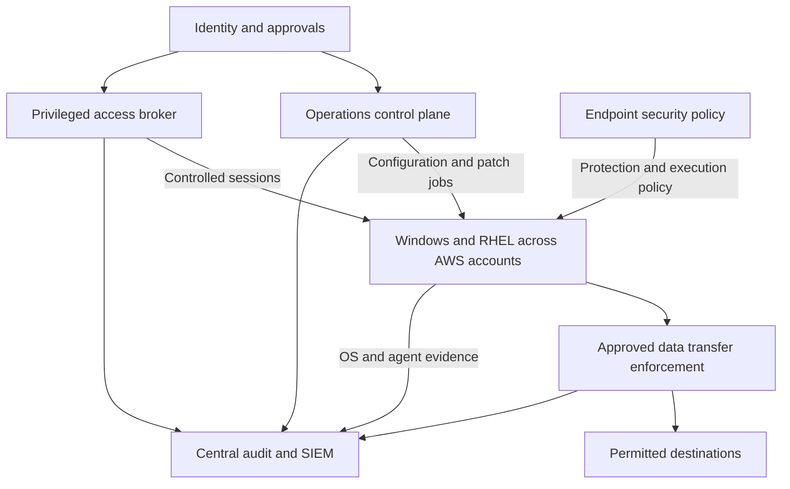
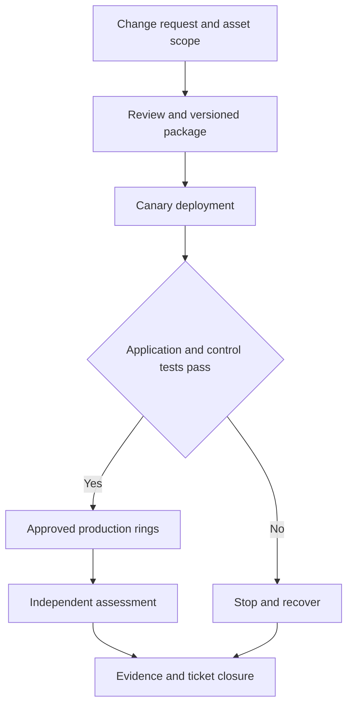
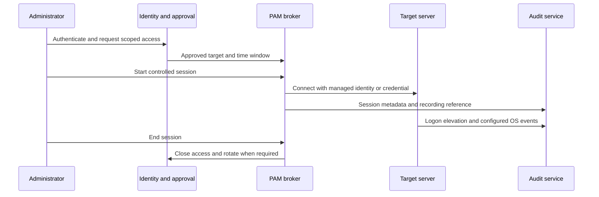
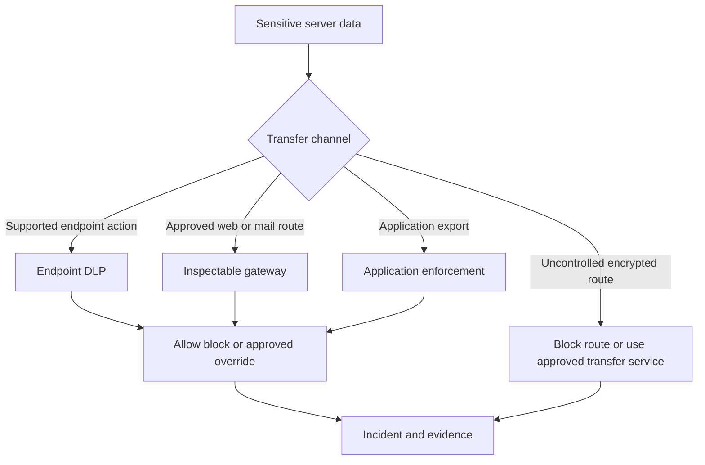

# Enterprise Server Management and Security Architecture

Requirements and solution designs for Windows and RHEL across AWS accounts

Architecture review draft | Version 1.0 | 22 September 2026

## 1 Purpose and architecture decision

This document organizes centralized server management and security into seven capability groups, compares established vendor solutions, and defines implementation-level reference designs for each shortlisted solution. The baseline is Windows Server and Red Hat Enterprise Linux on EC2 across multiple AWS accounts, with AWS Systems Manager already deployed. The AWS partition and Azure tenant type remain deployment inputs; government-cloud restrictions apply only if those environments are selected.

The recommended starting architecture retains Systems Manager for AWS operations, assigns one endpoint protection platform, adds native or commercial application control, and separates privileged access, data protection, and evidence collection into their own services. Azure Arc is a viable alternative management layer when Azure-based governance and operations justify it. It is not a prerequisite for centralized Defender policy, application allowlisting, or privileged session recording.

The procurement decision is a portfolio decision. Select one primary product for each capability, reuse existing tools where they satisfy acceptance tests, and purchase additional modules only for demonstrated gaps. A common console does not prove common coverage across Windows, RHEL, government clouds, or application transfer channels.

### 1.1 Scope and design maturity

The high-level design defines trust boundaries, service ownership, component relationships, and alternatives. The low-level designs define component placement, identity, traffic, configuration, evidence, resilience, and acceptance tests. They are implementation reference designs, not installation runbooks or a production-approved bill of materials. Exact versions, account IDs, tenant IDs, addresses, quotas, fleet sizes, entitlements, and authorization boundaries were not supplied and remain explicit deployment inputs.

All policies, deployment rings, service names, schedules, retention targets, and performance targets described as proposed are design recommendations. Vendor capabilities are referenced in the source register. Product availability was researched on 22 September 2026. The vendor shortlist is representative and not an analyst ranking or a claim of certification for a particular environment.

### 1.2 Readers and navigation

Architecture and procurement reviewers should read Sections 2 through 5 and 10. Engineering teams should use Sections 6 through 9. Operations and assessment teams should use Sections 7, 9, and 11. Section 12 provides primary vendor sources supporting the capability and platform distinctions.

### 1.3 Assumptions requiring confirmation

| Design input | Working assumption | Confirmation needed |
|---|---|---|
| Hosting | EC2 in multiple AWS accounts | Account and Region inventory; other hosting platforms |
| Operating systems | Mixed Windows Server and RHEL | Exact releases, kernels, Server Core, domain controllers, domain membership |
| Existing operations | SSM agents and account-level management | Patch ownership, central automation, session-log coverage |
| Microsoft integration | Azure integration is optional | Tenant and subscription type, licenses and service availability |
| Network | Segmented VPCs and controlled central egress | DNS, proxy, endpoints, inspection exceptions and approved cross-cloud paths |
| Security products | Existing deployments may be reusable | EDR, ePO, SIEM, vulnerability management, PAM and DLP inventory |
| Scale | Must grow across business units | Endpoint count, concurrent sessions, ingest volume and disconnected duration |
| Data handling | Business-specific data restrictions | Authorized telemetry destinations, recording retention and evidence access |

## 2 Capability model and requirements

### 2.1 Seven categories

| Category | Business outcome | Boundary of responsibility |
|---|---|---|
| A Server operations | Know what exists and reliably configure, patch and recover it | Inventory and change execution; not malware prevention |
| B Endpoint protection | Prevent, detect and respond to endpoint threats | Antivirus and EDR; not universal application allowlisting or DLP |
| C Application and integrity control | Permit approved code and detect unauthorized change | Execution trust and integrity; not sensitive-content classification |
| D Privileged access | Control who can administer, for how long, and through which path | Identity, vaulting, elevation, sessions and accountability |
| E Data protection | Control sensitive data at rest, in use and in motion | Classification and channel-specific prevention |
| F Audit and detection | Collect attributable evidence and investigate events centrally | OS, cloud and product telemetry; not the enforcing agent |
| G Independent assurance | Verify vulnerabilities and configuration independently | Assessment and remediation tracking; not automatic proof of authorization |

### 2.2 Functional requirements

Every requirement below has a primary owner, an implementation design, and a validation test. Requirements are proposed until the service owner accepts their scope.

| ID | Requirement | Primary category | Acceptance evidence |
|---|---|---|---|
| A01 | Inventory servers across accounts with owner, OS, environment and agent state | A | Daily reconciliation against EC2 inventory identifies an unmanaged test server |
| A02 | Apply approved configuration with drift detection and controlled remediation | A | Deliberate setting change is detected and repaired or ticketed |
| A03 | Patch by approved ring, maintenance window and reboot policy | A | Canary and production reports include application validation and exceptions |
| A04 | Distribute signed or verified software and agent updates | A | Unapproved package fails validation; approved package is traceable to a change |
| A05 | Execute approved automation across accounts with bounded scope | A | One job reaches allowed targets and cannot target another business owner |
| B01 | Provide Windows and RHEL prevention and EDR on supported versions | B | Vendor-approved benign test produces expected alert and response evidence |
| B02 | Centralize exclusions with owner, justification and expiration | B | Scoped exclusion works only on intended group and is withdrawn on expiry |
| B03 | Detect unhealthy, stale, disabled or tampered agents | B | Controlled loss of heartbeat creates an incident within the agreed interval |
| C01 | Block unapproved executable code on Windows and RHEL | C | Approved application succeeds; unapproved execution is denied and logged |
| C02 | Govern trusted updates without permanently opening execution policy | C | Application update succeeds within the defined trust and approval process |
| C03 | Detect changes to critical files and security configurations | C | Approved and unauthorized changes are distinguishable in evidence |
| D01 | Use named administrators and strong centralized authentication | D | Session can be correlated to a unique person and authentication event |
| D02 | Require time-limited privileged access and approval where specified | D | Activation expires and new unauthorized access attempts fail |
| D03 | Rotate and protect privileged credentials and emergency access | D | Credential rotation and a controlled recovery exercise succeed |
| D04 | Record required privileged sessions and prevent unrecorded bypass | D | Required SSH/RDP replay is available; direct bypass test is denied |
| D05 | Limit task privileges and constrain automation authority | D | Allowed task succeeds; unrelated administrative action is denied |
| E01 | Identify sensitive information in the defined repositories and file types | E | Labeled and unlabeled seeded test data are assessed separately |
| E02 | Control sensitive transfers through specified channels | E | Browser, share, SCP/SFTP, API and database tests each have explicit results |
| E03 | Support DLP incidents, evidence access and expiring exceptions | E | Incident routes to correct owner without exposing unrestricted content |
| F01 | Collect OS, cloud, security product and privileged-session evidence | F | Correlated event links person, session, server, action, result and time |
| F02 | Preserve logs and alert on collection gaps | F | Retention, access isolation, outage buffering and loss detection are tested |
| F03 | Separate business-unit visibility while enabling central SOC oversight | F | Tenant-scope tests succeed for analyst, owner and platform administrator |
| G01 | Perform credentialed vulnerability and configuration assessments | G | Successful authentication coverage is reported separately from scan completion |
| G02 | Track remediation, exceptions and independent revalidation | G | Closed ticket links change, rescan and residual-risk decision |

### 2.3 Nonfunctional requirements

NF01 requires management, telemetry, recordings and secrets to stay within approved destinations. NF02 requires tenant separation in RBAC, routing, storage and searches. NF03 requires encrypted transport and managed certificates. NF04 requires defined failure behavior when the control plane, collector or network is unavailable. NF05 requires recovery testing for central services. NF06 requires repeatable policy promotion and rollback. NF07 requires measured capacity and operational cost. NF08 requires a vendor-supported OS, kernel, cryptographic mode and agent combination.

Proposed pilot targets are 100 percent enrollment of in-scope test servers, 100 percent recording of sessions designated as recordable, no unauthorized cross-owner access, and successful recovery tests. Production timing, performance, retention and availability thresholds must be agreed after baseline measurements. Do not translate these proposals into compliance claims.

### 2.4 Terms that must stay separate

Inventory is visibility; configuration management changes settings; patch orchestration schedules package installation. Antivirus prevents malware; EDR supplies behavioral detection and response. Application allowlisting determines executable trust. File integrity monitoring detects changes. Privileged identity management governs role activation; privileged access management adds controls such as credential rotation and session brokering. Endpoint privilege management constrains elevation inside an OS. DLP evaluates sensitive content and controlled channels. SIEM correlates evidence. Vulnerability assessment independently measures exposure.

## 3 Vendor capability shortlist

### 3.1 Solutions by requirement category

Each profile ID in this table has a low-level design in Section 8. Selecting an alternative does not imply buying all the products in that row.

| Category | Shortlisted solutions | Selection consideration |
|---|---|---|
| A Operations | P01 AWS SSM; P02 Azure Arc plus Update Manager and Machine Configuration; P03 Red Hat AAP plus Satellite; P04 HCL BigFix | Existing AWS investment; Azure governance; controlled RHEL content; mixed-OS patch operations |
| B Protection | P05 Microsoft MDE; P06 CrowdStrike Falcon Prevent and Insight; P07 Trellix ENS and EDR modules | Hosting model, OS coverage, response workflow, existing SOC integration |
| C Application control | P08 Windows App Control and RHEL fapolicyd; P07 Trellix Application and Change Control | Native enforcement versus integrated commercial policy lifecycle |
| D Privileged access | P09 Entra PIM with supported login integration; P10 CyberArk PAM; P11 BeyondTrust Password Safe; P12 Delinea Secret Server | Role approval versus vaulting, rotation, session recording and protocol coverage |
| E Data protection | P13 Microsoft Purview; P14 Forcepoint DLP; P15 Broadcom Symantec DLP | Exact OS, content classification, channel enforcement and hosting model |
| F Audit and detection | P16 Splunk Enterprise Security; P17 Microsoft Sentinel | Existing investment, location of evidence, ingest volume and SOC workflows |
| G Assurance | P18 Tenable Security Center and Nessus; P19 Qualys VMDR and Policy Compliance | Existing assessment tools, approved assessment content, hosting model and agent/scanner coverage |

The platforms above have documented components supporting their stated categories. Specific modules may be separately licensed. Their presence in this shortlist is not evidence that every SKU is authorized for your deployment environment. See [S01] through [S32].

### 3.2 Windows and RHEL coverage distinctions

| Capability | Windows Server design | RHEL design |
|---|---|---|
| Management | SSM, Arc, AAP or BigFix subject to release support | Same candidates; Satellite adds RHEL content lifecycle |
| Endpoint protection | MDE, Falcon or supported Trellix modules | MDE, Falcon or supported Trellix modules; validate kernel and SELinux compatibility |
| Allowlisting | App Control for Business or Trellix ACC | fapolicyd or supported Trellix ACC |
| Task-level privilege | JEA or supported endpoint privilege product when required | sudo policy or supported Linux privilege product when required |
| Full remote-session accountability | Configured RDP broker recording plus OS auditing | Configured SSH broker recording plus auditd and sudo evidence |
| DLP | Purview on supported server configurations; evaluate Forcepoint or Symantec coverage | Validate exact commercial endpoint capability; otherwise enforce at supported applications, gateways and repositories |

Purview currently documents Windows Server 2019 and later with exclusions for domain controllers and Server Core, plus server classification limitations. It does not list RHEL as an Endpoint DLP platform. Broadcom now publishes a Linux endpoint-agent installation guide, but that alone does not establish your RHEL/kernel/channel coverage. Forcepoint distinguishes Linux server components from endpoint-agent certification. These differences require explicit product-matrix and pilot evidence. [S12, S22, S23]

### 3.3 What Azure Arc does and does not consolidate

Arc projects enrolled servers into Azure resource management. Update Manager supplies patch orchestration; Machine Configuration supplies supported OS configuration auditing/enforcement. Defender security policy, Purview DLP, Entra PIM and Sentinel remain distinct services with distinct permissions, agents or integrations, licensing and availability. Arc does not replace the EC2 instance profile or AWS authorization for AWS API calls. [S04, S05]

MDE security settings management supports selected security policies on servers without full Intune enrollment. This does not make every Intune feature available on those servers. Microsoft Antimalware is not a Linux alternative to MDE. [S06, S32]

## 4 Reference architecture

### 4.1 Logical design

The central service team owns shared management, privileged access and security policy. Business owners receive scoped views and approved operations for their servers. Enforcement stays on hosts or at approved data-transfer points. Evidence flows to a separate audit service whose administrative authority is separated from endpoint operations.

Figure 1 shows logical responsibility, not a requirement to place every function in one VPC or buy one product per box. Application control may use native OS enforcement managed through the operations plane.

### 4.2 Deployment and trust boundaries

Use a dedicated management account/VPC for self-hosted control services and regional execution components. Use a security/logging account for evidence storage and SIEM integration. Business-unit accounts retain workload isolation. A central management service obtains explicit authority through a scoped IAM role, local broker, agent registration or OS credential; shared network access alone grants no authority.

Keep management traffic on approved routes through the organization’s network security boundary. Centralization does not require opening all business-unit networks to each other. Position execution nodes, relays, scan engines and PAM connectors by reachable security segment and capacity. A single component per AWS account is not always necessary; a single shared component for all owners is not always acceptable.

When Azure services are selected, Arc agents and other product agents use approved outbound connectivity to the selected Azure cloud. Arc Private Link does not carry every dependency: Entra ID and Azure Resource Manager are outside its private-link scope. Treat each product's endpoint list, proxy behavior and TLS inspection compatibility separately. An AWS interface endpoint does not privately terminate a Microsoft SaaS service. [S11]

### 4.3 Multiowner organization model

Use a stable asset key composed of partition, AWS account, Region and instance ID. Record hostname, agent IDs, Azure resource ID when present, OS, application, business owner, environment, data sensitivity, maintenance ring and service owner. Hostname alone is insufficient for ephemeral or rebuilt instances.

Create groups from an authoritative inventory feed. Tags aid grouping but are not sufficient authorization boundaries unless mutation of those tags is controlled. Separate production from nonproduction and business-unit scopes in RBAC, automation credentials, endpoint groups, PAM collections/safes and SIEM access. Use separate product instances or tenants when a shared instance cannot provide the required administrative separation.

### 4.4 Control ownership

| Control | Primary owner | Required separation |
|---|---|---|
| Patch and OS configuration | Server operations | Application owner validates service health; change approval independent where required |
| Antivirus exclusions and allowlisting exceptions | Endpoint security | Workload owner requests; scoped approver authorizes; expiry enforced |
| Privileged access | Identity and PAM team | Requester cannot approve own access; session reviewer distinct from privileged operator |
| DLP policy and evidence | Data security with data owner | Content access restricted; platform operator does not automatically view captured data |
| Detection and incident response | SOC | Destructive response requires designated authority and accountable workflow |
| Assessment and exceptions | Vulnerability/compliance team | Remediation evidence independently rechecked |
| Shared infrastructure and backups | Platform team | Vault keys, policy signing keys and audit archives segregated |

## 5 Complete solution portfolios

### 5.1 Portfolio A extends the existing AWS environment

Select P01 SSM for operations, P05 MDE or the existing approved EDR for protection, P08 native application control, one of P10/P11/P12 for full PAM if required, a channel-appropriate DLP design from P13/P14/P15, the existing SIEM or P16, and P18 or P19 for independent assurance.

This is the preferred starting portfolio because it preserves established access and automation. The main engineering work is consistent account bootstrap, central job orchestration, agent coverage, evidence integration and policy governance. For commercial AWS, assess Systems Manager’s organization-wide capabilities first. If AWS GovCloud is selected, Quick Setup and delegated Explorer restrictions require an adjusted deployment pattern. [S01, S02, S03]

### 5.2 Portfolio B uses Microsoft services for central management

Select P02 Arc plus Update Manager and Machine Configuration, P05 MDE, P08 native application control, P09 PIM for Azure-role activation, a PAM broker if D04 requires full recording, P13 Purview only where supported, and P17 Sentinel if it replaces rather than duplicates the primary SIEM. Keep SSM for explicitly assigned AWS operations and recovery.

This portfolio fits an organization deliberately standardizing management on Azure. It introduces cross-cloud control and evidence flows. It does not eliminate the RHEL DLP evaluation, Windows-version-specific login requirements, full-session-recording requirement, or independent assessment. Assign a single owner for every setting and patch schedule to avoid conflicts.

### 5.3 Portfolio C places central tooling inside the approved boundary

Select P03 AAP/Satellite or P04 BigFix for operations; P07 Trellix where existing endpoint infrastructure and certification favor it; native or commercial application control; one self-hosted PAM solution; P14 or P15 DLP components for verified channels; P16 self-hosted Splunk; and P18 Tenable Security Center. Keep SSM for selected AWS-native tasks.

This portfolio provides more control over service location and content distribution but requires managing databases, relays, certificates, updates, backups and recovery. A self-hosted installation does not automatically establish product certification or deployment authorization. Software feeds, vendor support and remote telemetry must also fit the boundary.

### 5.4 Comparative decision matrix

| Criterion | Portfolio A | Portfolio B | Portfolio C |
|---|---|---|---|
| Reuse of existing SSM | High | Selective | Selective |
| Additional cross-cloud management dependency | Optional | Fundamental | Optional |
| Self-hosted platform operating burden | Depends on PAM/DLP/SIEM | Lower for SaaS components | Highest |
| Cross-account consistency work | IAM and deployment automation | Arc onboarding and Azure scope design | Agent/relay/execution deployment |
| Primary advantage | Incremental improvement | Common Azure management model | Local control and mixed-environment operations |
| Principal unresolved issue | Cross-account orchestration and scope | Feature parity and approved connectivity | Capacity, maintenance and recovery |

Do not assign a numeric winner until fleet size, product entitlements, operational staffing and pilot results are known. Section 10 gives a reproducible selection method.

## 6 Common low level design contract

All nineteen solution profiles inherit this contract. A profile names its deviations and its specific components. This avoids treating identity, evidence and resilience as optional add-ons to individual products.

### 6.1 Asset bootstrap and lifecycle

Provision the EC2 role, SSM connectivity and mandatory tags through the account deployment pipeline. Register only approved agents with unique host identities; do not clone an enrolled agent identity into an image. Deliver onboarding material through a short-lived or appropriately protected mechanism and prevent it from appearing in instance user-data logs or build output.

After enrollment, reconcile inventory, policy assignment, sensor heartbeat, time synchronization and log arrival before declaring a host compliant. Promotion into production requires positive evidence from each required control. Termination triggers agent retirement, credential cleanup and inventory state change while retaining historical evidence. Autoscaling images must be tested for duplicate identities and stale console records.

### 6.2 Identity and role model

Define Platform Administrator, Policy Author, Policy Approver, Scoped Operator, SOC Responder, Auditor and Emergency Operator roles. Use named identities and federation where the selected product supports it. Protect service identities with scoped permissions and rotate credentials using the selected secrets service. Do not give an automation service permanent unrestricted administrator rights in every account.

For AWS orchestration, deploy an example role named OrgServerOpsExecution into member accounts, trusted only by the approved central execution principal. Restrict usable SSM documents, target scope and IAM pass-role permissions. For Azure operations, scope roles to approved subscriptions/resource groups and protect extension and Run Command rights as privileged execution. OS login authorization and control-plane permission remain separate evaluations.

### 6.3 Proposed configuration objects

| Object | Example convention | Required controls |
|---|---|---|
| Asset tags | BusinessOwner, Environment, Application, PatchRing, DataClass | Authoritative source and controlled modification |
| Policy package | Category_OS_Workload_Version | Source commit, approver, checksum/signature and rollout status |
| Exclusion record | Product, scope, path/publisher, justification, expiry | Named owner; automatic expiry or scheduled enforced removal |
| Maintenance job | Owner, ring, window, concurrency, error threshold | Application check, reboot handling and stop condition |
| Privileged session | Person, request, asset, role, start/end, recording reference | Approval, retention and bypass controls |
| Evidence record | Asset key, event time, ingest time, source, result | Time synchronization, integrity and restricted access |

### 6.4 Connectivity baseline

These are protocol intents and common defaults, not an exhaustive firewall rule set. Confirm every product/version port in the implementation bill of materials. Avoid broad openings based on this table.

| Flow | Direction | Typical transport | Design rule |
|---|---|---|---|
| SSM agent to regional services | Host initiated | HTTPS 443 | Private endpoints and DNS where supported; account/Region endpoint validation |
| Arc, MDE or other SaaS agent | Host initiated | HTTPS 443 | Approved service endpoints, explicit proxy and vendor-compatible TLS handling |
| AAP execution to RHEL | Execution node to target | SSH 22 | Scoped source, controlled account and sudo policy |
| AAP execution to Windows | Execution node to target | WinRM HTTPS 5986 or supported SSH | Kerberos/certificate strategy; no indiscriminate credential delegation |
| PAM broker to target | Broker to target | SSH 22 or RDP 3389 | Restrict direct administrator network paths |
| Log forwarding | Host/collector initiated | TLS transport configured by product | Buffered delivery; avoid unauthenticated plaintext forwarding |
| DLP inspection | Proxy/application to detector | Product-supported inspection API or ICAP | Private authenticated path where supported; explicit failure behavior |
| Scanning | Scanner to target | Credential and scan-policy dependent | Segment-scoped reachability and validated scan account privileges |

### 6.5 Policy release and recovery

Use development, canary, limited production and general production rings. A proposed initial canary is one representative Windows and RHEL host for each workload class, expanded until service diversity is covered. Stop rollout on critical application regression, loss of required management access, or loss of required evidence. The exact failure threshold is a per-service input.

Rollback means a tested previous policy/package and a working recovery path. Package removal is not a universal rollback strategy; database migrations and some security updates are not reversible. Record restore/redeploy procedures and application-consistent backup requirements. Signed application-control policies require a specifically tested recovery procedure before enforcement.

### 6.6 Evidence and failure behavior

Forward cloud actions, policy changes, exclusions, privileged approvals, OS authentication, selected process activity, application-control decisions, DLP incidents and scan results. Preserve correlation IDs and UTC timestamps. Central service logs do not replace endpoint logs.

Specify how long agents enforce cached policy, how much data they buffer, and whether new privileged sessions or transfers stop when their controller is unreachable. Proposed default: deny new privileged sessions when authorization or mandatory recording cannot be established; use controlled emergency access for recovery. Endpoint and DLP behavior must be measured rather than assumed. Never claim a session was recorded merely because the connection was logged.

### 6.7 Task level privilege enforcement

For Windows task delegation, define a Just Enough Administration endpoint with a versioned session configuration and role-capability files. Map named groups to explicit cmdlets and allowed parameters; use an appropriately constrained run-as identity. Protect transcripts and correlate the connecting identity with the effective execution account. Test arbitrary script execution, broad file-write permissions and commands that can escape into a shell. JEA constrains that remoting endpoint; it does not constrain a separate unrestricted RDP or administrator session. [S33]

For RHEL, distribute reviewed sudoers rules with syntax validation before activation. Grant exact commands and parameters where practical; carefully review editors, interpreters and service-management commands that can yield broader execution. Retain named-user authentication and audit identity across elevation. If full terminal I/O is required without a commercial broker, evaluate tlog with a supported SSSD/session configuration and central collection. Record its protocol/session limitations and test bypass; neither shell history nor a single sudo entry proves complete command coverage. [S34]

A commercial endpoint privilege product is a separate procurement option if native task delegation cannot meet workflow or application-elevation requirements. Its Windows and Linux coverage must be separately designed; it is not implied by purchasing any of the PAM vault products in this document.

### 6.8 File integrity and audit baseline

For RHEL, a native integrity design can use AIDE with a protected approved baseline, scheduled comparisons, controlled baseline regeneration and centralized results. Supplement it with auditd and sudo/session records to attribute selected changes. For Windows, enable selected object-access auditing with appropriate SACLs and configuration-change events; use a versioned hash baseline for an agreed file set or select a verified commercial integrity module. Auditing a write is not equivalent to detecting an offline content change by hash comparison. [S10]

The configuration repository records approved file scope, exclusions, scan cadence and change approval. Do not regenerate an integrity baseline automatically after every detected change. Test file modifications, deletion, permission changes, approved updates and evidence-delivery outage. Exclude high-churn application data only through a documented performance and risk decision. A cryptographic hash of a baseline must be stored separately from the host if it is intended to help detect local tampering.

## 7 Detailed end to end workflows

### 7.1 Approved server change

An owner submits a change linked to asset scope and service impact. The pipeline validates policy/package signatures and produces a versioned release. The central operator selects an approved job template. The local agent or execution node performs the change under its designated identity. Application checks, policy status and logs determine whether promotion proceeds. Independent assessment validates security remediation after the change.

### 7.2 Privileged administration

An administrator authenticates from an approved workstation and requests a named target/role for a defined period. The approval service authorizes the request. A selected broker opens the target session and records it when required. The OS logs logon, elevation and configured activity. Audit evidence ties the request to both the human and target account. Session termination, credential rotation and role expiration are recorded separately.

Entra PIM can supply role activation in a compatible design; it does not itself supply the broker shown here. Expiring a role does not prove an already established OS session ended. Test termination and token/session lifetime behavior explicitly. For SSM native shells, configure session content logging. SSH and port-forwarded traffic through SSM does not receive Session Manager content logging. [S08, S09]

### 7.3 Data transfer control

Classify the data and enumerate the actual transfer route. Use endpoint DLP only when the operating system, application and action are supported. Use an inspection gateway or application integration when it can see the content and enforce the action. Unsupported encrypted protocols require another control such as an approved transfer service, application restriction or network denial; mirrored traffic alone does not block a transfer.

An absence of TLS inspection in a network firewall does not prevent endpoint DLP, but it limits content inspection at that firewall. A firewall, EDR product or repository scan must not be credited as DLP for channels it cannot inspect and control.

## 8 Solution low level designs

Each profile applies the common contract in Section 6 and the acceptance catalog in Section 9. Component counts and exact product versions are deliberately deferred to measured sizing. Proposed placements and policies below are architecture recommendations, not vendor installation defaults.

### P01 AWS Systems Manager

**Requirements and fit.** A01–A05 and part of F01. Retain for AWS-native fleet operations and controlled shell access. The unified console and Automation have cross-account capabilities, while GovCloud lacks several organization-integrated setup features. [S01, S02, S03]

**Components and placement.** Regional SSM service, SSM Agent on each host, member-account execution roles, central orchestration, versioned SSM documents, patch baselines/maintenance windows, inventory destination, CloudTrail and session/output logs. In GovCloud, deploy the baseline through supported account automation rather than assuming Quick Setup organization integration.

**Identity and flow.** The central service assumes the target account role and invokes an approved automation/command. The host agent obtains work through regional services; package traffic uses approved repositories. Central orchestration can use supported multi-account Automation or explicit per-account API execution. Prototype the required cross-account runbooks in the selected partition first.

**Configuration and evidence.** Standardize document versions, target groups, patch windows, output destinations and Session Manager preferences per account/Region. Limit StartSession and SendCommand separately. Restrict document selection, target tags and modification of authorization tags. Correlate CloudTrail with command output and OS events; SSM output can contain sensitive command data.

**Resilience and acceptance.** Track failed/stale nodes, cap job concurrency and test repository failure. Preserve a tested repair path for failed SSM Agent. Pass A01, A03, A05 and F01 tests; prove cross-owner targeting fails. If full SSH/RDP recording is required, add a broker: SSM tunnels do not meet D04 by themselves. [S08]

### P02 Azure Arc with Azure management services

**Requirements and fit.** A01–A05 for Azure-governed management of non-Azure machines. Arc supplies registration and extension management; Update Manager and Machine Configuration supply separate operational functions. [S04, S05]

**Components and placement.** Connected Machine agent per host, Azure subscription/resource groups in the selected cloud, controlled enrollment identity, Machine Configuration assignments, Update Manager schedules and optional monitoring extension. Group machines by owner/environment with explicit administrative scopes.

**Identity and flow.** Bootstrap with a scoped onboarding identity, then use the machine identity for supported service operations. Operators authenticate to Azure; Azure RBAC controls management actions. Agents receive configuration and invoke the native OS update mechanism. Repository access and entitlement remain necessary; Arc does not create RHEL package subscriptions.

**Configuration and evidence.** Define policy assignment scopes, remediation identity, audit/enforce behavior, reboot schedules, extension allow/block rules and resource locks where appropriate. Treat extension installation and Run Command as privileged code execution. Export Azure Activity Log and collect OS logs separately. Keep AWS instance-role and account governance intact.

**Resilience and acceptance.** Test loss of Azure egress, DNS, proxy and certificate trust without losing SSM recovery. Verify compliance state becomes visibly stale. Test A02/A03 with an approved package source. Arc Private Link has dependency exceptions, and government-cloud availability must be confirmed for every add-on. [S11]

### P03 Red Hat Ansible Automation Platform and Satellite

**Requirements and fit.** A01–A05, C02 and remediation for G02. AAP provides orchestrated automation for Windows and Linux; Satellite supplies RHEL content lifecycle and repository control. They have different roles and are not substitutes for EDR. [S13, S14]

**Components and placement.** Deploy the AAP control components and approved execution-environment registry in the management boundary. Place execution nodes by network segment. Deploy Satellite with supported database/storage and Capsules near RHEL consumers when content distribution warrants them. Use current vendor-supported topology rather than cloning a generic database cluster.

**Identity and flow.** Import approved inventories and projects from source control. Job templates select credentials and bounded targets; execution nodes use SSH or secure Windows transport. Satellite synchronizes entitled content, publishes immutable content-view versions and promotes them through lifecycle environments to hosts.

**Configuration and evidence.** Separate inventory access from credential use and template editing. Lock production jobs to reviewed commits and execution-environment digests. Maintain sudo/JEA scope, content filters, activation keys, repository trust and promotion approval. Export job events and content-version evidence.

**Resilience and acceptance.** Test execution-node loss, interrupted jobs and backup recovery. Prove idempotent reruns and stale-job handling. Confirm the AWS RHEL subscription/RHUI model before changing content sources. A03 passes only when an approved content version reaches the right ring and application validation succeeds.

### P04 HCL BigFix

**Requirements and fit.** A01–A05 with licensed compliance functions where needed. A candidate for an agent-based, mixed-OS operations service with centralized patch and software workflows. [S15]

**Components and placement.** BigFix root server and supported database, console/WebUI and reporting, relays by reachable segment, and clients on managed hosts. Relays cache content and reduce repeated downloads. Separate administrative and workload network paths.

**Identity and flow.** Scoped operators issue actions from approved content. Clients evaluate applicability, retrieve content through their relay and report execution/compliance state. Configure authenticated/trusted relay relationships and approved upstream feeds under the selected release's guidance.

**Configuration and evidence.** Define operator computer scopes, signed action authority, baseline versions, maintenance windows, reboot behavior, bandwidth constraints and exception expiry. Retain action authorship, target list, content version, timestamps and endpoint result. Reconcile clients against EC2 to detect missing agents.

**Resilience and acceptance.** Provide alternate relays and test content-cache behavior, root/database recovery and client reconnect. Use vendor-supported HA/DR; do not assume a web load balancer makes the root service active-active. Pass A01/A03/A04/A05 and verify one owner's operator cannot deploy to another's hosts. BigFix is the change platform; add the chosen protection, PAM and DLP controls separately.

### P05 Microsoft Defender for Endpoint

**Requirements and fit.** B01–B03 and security telemetry for F01. MDE supports a central security service across AWS accounts without requiring Arc. Use an appropriate server entitlement and tenant. [S06, S07]

**Components and placement.** MDE sensor on supported Windows/RHEL, Defender portal, device groups/tags, role assignments, security settings management, and SIEM/API integration. Protect onboarding material and map device identities to the central asset key.

**Identity and flow.** Approved onboarding establishes the device in the selected tenant. Device policy is assigned through supported Intune endpoint-security settings managed through Defender/Intune. Sensor telemetry and supported response actions use that service's connectivity. This security-management enrollment does not establish full Intune management.

**Configuration and evidence.** Define platform-specific prevention/EDR settings, tamper protection where supported, update rings, scan schedules and exclusions. Record whether each exception affects antivirus, EDR or both. Restrict isolation and live-response rights. Export policy changes, exclusions, alerts, actions and sensor health.

**Resilience and acceptance.** Test offline enforcement, local buffering, reconnect and RHEL kernel upgrades. Use a vendor-approved benign detection test and a controlled scoped exclusion. Require B01–B03 and F01 evidence. Verify tenant-specific feature availability and response support by OS. MDE does not by itself satisfy C01, D04 or E02.

### P06 CrowdStrike Falcon

**Requirements and fit.** B01–B03 using Falcon Prevent and licensed EDR capabilities such as Falcon Insight. This is an alternative to the primary MDE/Trellix protection platform, not a default additional prevention agent. [S16]

**Components and placement.** Supported Falcon sensor on Windows/RHEL, approved government service where applicable, customer identity, host groups, prevention/update policies, response roles and telemetry integration. Establish current distro/kernel compatibility before image promotion.

**Identity and flow.** Distribute the approved installer and protected registration configuration through the operations platform. Assign hosts to authoritative groups, apply platform-specific policy and send telemetry over approved egress. Responders invoke permitted actions through scoped console/API permissions.

**Configuration and evidence.** Separate prevention policy from sensor-update policy. Control exclusion scope, maintenance/uninstall credentials, response privileges and API service identities. Validate grouping after reimage and autoscale events. Export detections, response actions, administrator changes and heartbeat gaps.

**Resilience and acceptance.** Test sensor isolation, supported local enforcement during service outage, queued evidence and rollback of a bad policy. Execute B01–B03/F01 tests. Verify the exact government service, purchased modules and OS response features; a platform-level government announcement does not prove module-level deployment authorization. Do not equate file/indicator blocking with an approved-only execution policy.

### P07 Trellix endpoint and application control suite

**Requirements and fit.** B01–B03 and C01–C03 when the appropriate ENS, EDR and Application and Change Control modules are selected. Particularly relevant when an existing ePO/HBSS operating model is to be retained. Modules and support matrices must be checked separately. [S17]

**Components and placement.** ePolicy Orchestrator management, supported database, distribution/agent-handling components as sized, Trellix Agent and selected endpoint modules. Place management inside the approved boundary when self-hosted operation is required. Existing installations require version/entitlement inventory before reuse.

**Identity and flow.** Group hosts by owner and OS; ePO distributes policy and approved packages. Endpoint components enforce security and report status. ACC builds and maintains application trust under the chosen approved-update process; do not infer that ENS alone provides ACC.

**Configuration and evidence.** Separate antivirus exclusions from application-control rules. Define approved updater/publisher behavior, update windows, integrity-protected paths, exception expiry and policy rollback. Control who can disable enforcement or alter trusted update sources. Export application decisions, integrity changes, policy assignments and agent health.

**Resilience and acceptance.** Test management outage, cached enforcement, update/reboot compatibility and recovery from a blocked business application. Verify exact RHEL kernel/OS and Windows release support for every selected module. Pass B01/C01/C02/C03. If replacing another prevention engine, use a vendor-supported transition plan and avoid conflicting real-time engines.

### P08 Native Windows and RHEL application control

**Requirements and fit.** C01–C03 with OS-native enforcement and centrally managed policy. This minimizes additional endpoint products but leaves policy engineering, reporting and exception workflow with the organization. [S10]

**Components and placement.** Windows App Control for Business policies, RHEL fapolicyd rules/trust data, SELinux policy as a complementary resource-access control, signed policy repository, chosen distribution platform and audit collector. An integrity baseline or dedicated FIM mechanism is needed for C03 beyond execution decisions.

**Identity and flow.** Policy authors submit a change; an independent approver authorizes release. Automation distributes a versioned policy to test hosts, then promotes it. The OS evaluates execution locally. RHEL trust data must track approved RPM transactions and approved non-RPM software; Windows rules should prefer appropriately scoped publisher/signer trust over fragile broad path rules.

**Configuration and evidence.** Audit first. Test interpreters, scripts, drivers where applicable, updaters, scheduled jobs, service accounts and emergency tools. Retain policy ID/hash, mode and denied execution details. Restrict writable directories from becoming broad trust paths. SELinux is not a substitute for fapolicyd.

**Resilience and acceptance.** Prove enforcement during controller outage and a tested signed-policy recovery path. Revalidate after OS/kernel/application updates. Pass C01/C02 with approved and unauthorized binaries and scripts; pass C03 separately with deliberate protected-file changes. Do not call audit-only deployment enforced compliance.

### P09 Entra PIM and supported server login integration

**Requirements and fit.** D01/D02 for eligible Azure/Entra roles, with optional supported OS login integration. This is a role-activation design; a separate broker is required where D04 demands full session recording. [S09]

**Components and placement.** Entra tenant, eligible Azure role assignments, PIM activation policies, approved authentication, Arc server resources and applicable login extension. Maintain separate emergency identity and evidence export.

**Identity and flow.** A named user activates a scoped role under time and approval conditions. Azure authorizes the supported management or login operation. For Linux Entra SSH, deploy the supported packages/extension and login roles. Windows Arc Entra RDP has a specific Windows Server 2025-or-later Desktop Experience and join model; existing AD-joined Server 2019/2022 must use a different supported login design.

**Configuration and evidence.** Define eligible versus permanent assignments, scope, activation duration, approver, justification and notification. Do not assume B2B guest access or Conditional Access parity on every server-login path. Export activation/assignment and sign-in events; collect OS activity independently.

**Resilience and acceptance.** Test denial outside the window, renewal, disabled user, and emergency recovery. Measure existing session behavior on expiry instead of assuming termination. Pass D01/D02 but mark D03/D04 incomplete unless vaulting and recording components are added. PIM does not remove AWS IAM roles or manage every local administrator account.

### P10 CyberArk Privileged Access Manager

**Requirements and fit.** D01–D04, with D05 implemented through scoped target permissions or a separately selected endpoint privilege mechanism. This profile uses the self-hosted PAM pattern as a reference; SaaS requires a separate hosting/connector decision. [S18]

**Components and placement.** Digital Vault and recovery design, Password Vault Web Access, Central Policy Manager, and Privileged Session Manager with supported SSH/session components. Put target-facing brokers close to the approved network segments and isolate vault infrastructure from general administration.

**Identity and flow.** Administrators authenticate to the access interface, request an approved account/target and launch a brokered session. The password-management component rotates managed credentials. Session components connect to the target without routine password disclosure and produce recordings/evidence under the selected protocol configuration.

**Configuration and evidence.** Partition safes/collections by owner and sensitivity. Define account platforms, rotation/reconciliation, approvers, session policies and recording access. Restrict direct RDP/SSH and unrestricted SSM/Arc command paths when they would bypass required recording. Collect request, credential and session lifecycle events in the SIEM.

**Resilience and acceptance.** Use vendor-supported vault recovery and component redundancy. Test target password desynchronization, unavailable recorder, broker loss and controlled emergency access. Validate recording readability and continuity rather than only a successful connection. Pass D01–D04 and F02. Exact connector support, cryptographic requirements and infrastructure compatibility are procurement gates.

### P11 BeyondTrust Password Safe

**Requirements and fit.** D01–D04 through managed credentials and configured SSH/RDP sessions. Privileged Remote Access and endpoint privilege products are separate choices when their additional functionality is needed. [S19]

**Components and placement.** Select Password Safe self-hosted or an approved cloud deployment; deploy required resource/connection components according to that model. Position target-facing session infrastructure in permitted network segments. Provide approved identity integration, password management and recording storage.

**Identity and flow.** A requester authenticates, selects a managed system/account and obtains an approved session. Password Safe brokers the configured SSH/RDP connection and records it when the access policy enables recording. Credential rotation is a separate controlled operation.

**Configuration and evidence.** Use owner-scoped managed systems/accounts and access policies. Set request duration, approval, password-view permission, recording and reviewer access explicitly. Do not leave recording as an assumed default. Restrict direct connection and alternate remote-administration bypass paths. Forward requests, approvals, rotations, session events and recording references.

**Resilience and acceptance.** Test recorder/storage unavailability, account rotation failure and component failover using the selected deployment model. Verify RDP replay, SSH command visibility and reviewer separation. Pass D01–D04/F02 with named-user correlation. If vendor access or agent-mediated remote access is required, evaluate the separate PRA integration rather than assuming it is included in Password Safe.

### P12 Delinea Secret Server

**Requirements and fit.** D01–D04 using secret lifecycle and configured session capabilities. The reference is a self-hosted deployment; validate the chosen edition and recording features. [S20]

**Components and placement.** Secret Server web tier, supported SQL database, site connectors and Distributed Engines in reachable network segments. Use the documented session-recording components for the selected connection method. Advanced recording may require additional licensing and components.

**Identity and flow.** Users authenticate to scoped secret folders, request access and launch an approved connection. Distributed Engines perform operations near targets, including supported rotation and connection tasks, then return results to the central service. Credentials remain controlled through the configured checkout/launcher policy.

**Configuration and evidence.** Define folder permissions, secret templates, dependency-aware rotation, approval, checkout duration, session launchers and recording configuration. Separate secret disclosure from session-use permission where supported. Export requests, secret access, rotations and recording references to the SIEM. Avoid storing application secrets in general administrator folders.

**Resilience and acceptance.** Use a supported redundant web/database design and redundant engines per segment as warranted. Test engine disconnect, job recovery, rotation of dependent credentials, and recording replay. Pass D01–D04 only after protocol and edition-specific evidence. A secret-access log or launched RDP client is not sufficient proof that the desktop session was recorded.

### P13 Microsoft Purview Data Loss Prevention

**Requirements and fit.** E01–E03 for supported endpoints, repositories and channels. This profile is deliberately limited: it is not a universal Windows/RHEL server DLP design. [S12]

**Components and placement.** Appropriate Purview service/tenant and licenses, supported endpoint onboarding, sensitive-information types/labels, scoped DLP policies, investigation roles and incident integration. Arc is not required merely to enable Purview Endpoint DLP.

**Identity and flow.** Onboard supported devices and target both the correct devices and users where required. Define a test corpus, classify supported content and apply channel actions such as audit, block or justified override. Send incidents and permitted evidence to the data-security team and SIEM.

**Configuration and evidence.** Validate Windows Server version and installation mode. Microsoft documents Server 2019-and-later support with no domain-controller/Server-Core support, explicit server enablement, and classification limitations. Separate tests for new unlabeled content from previously classified content. RHEL is not a documented Endpoint DLP platform here.

**Resilience and acceptance.** Test offline policy, stale classifications, policy propagation, file-type limits and service-account behavior for the actual workload. Complete a per-channel E01/E02 matrix and leave unsupported paths as gaps. Confirm tenant-specific feature and licensing scope. Do not use MDE enrollment or an EDR alert as proof that a Purview DLP policy blocked a transfer.

### P14 Forcepoint Data Loss Prevention

**Requirements and fit.** E01–E03 through selected endpoint, discovery and network enforcement components. Appropriate where enterprise data policies need multiple enforcement points. [S21, S22]

**Components and placement.** Management server and supported database, policy/detection services, certified endpoint agents where applicable, discovery components and a supported web/email integration or Protector role. Place network enforcement in the actual permitted transfer path; a monitoring-only sensor is not a blocking gateway.

**Identity and flow.** Data owners define sensitive-content rules and test examples. Policies reach supported endpoints and detection engines. Web/email integrations submit inspectable content for a verdict; the integrated service enforces the configured decision. Incidents carry owner and destination context with restricted evidence access.

**Configuration and evidence.** Define classifiers, endpoint channels, discovery scope, proxy integration, incident routing and exceptions. Validate OS certification using the endpoint matrix: a Linux-based management/Protector component is not proof of a RHEL endpoint agent. For encrypted web traffic, explicitly design TLS termination and exemptions at the authorized inspection point.

**Resilience and acceptance.** Define fail-open/fail-closed behavior by channel and test detector overload, large files, archives and engine outage. Verify buffering, incident retention and restore. Complete E01–E03 with real application protocols. SCP/SFTP and database exports remain gaps unless a supported enforcement point actually controls them.

### P15 Broadcom Symantec Data Loss Prevention

**Requirements and fit.** E01–E03 using a selected combination of Endpoint, Network and Discover capabilities. Platform and channel verification is required independently of product-family branding. [S23]

**Components and placement.** Enforce management service, supported database, detection servers, endpoint servers/agents where certified, Network Prevent integration and Discover components as required. Keep content-bearing incident data and database backups within the approved evidence boundary.

**Identity and flow.** Administrators publish policies from Enforce; detection components inspect supported endpoint/network/repository activity. Endpoint packages carry the approved server configuration. Network integrations must be in an enforceable path. Incidents are routed by owner and classifier with controlled evidence access.

**Configuration and evidence.** Define policy groups, content matching, agent communication, discovery schedules, channel actions and incident retention. Broadcom publishes a Linux endpoint-agent installation guide; obtain the exact supported RHEL releases, kernels and preventive channels for the purchased version. Do not infer parity with Windows or confuse Enforce-on-Linux support with endpoint coverage.

**Resilience and acceptance.** Size detectors and database from measured event/content load; implement vendor-supported recovery. Test endpoint offline behavior, detector failure, large encrypted transfers and false-positive handling. Pass E01–E03 only for demonstrated channels. Preserve an explicit gap register for anything the endpoint or network integration cannot inspect.

### P16 Splunk Enterprise Security

**Requirements and fit.** F01–F03 and evidence correlation for all categories. Suitable for extending an existing central SOC or retaining analytics in a controlled boundary. [S24]

**Components and placement.** Universal forwarders or approved collectors, parsing/input components where required, indexers, search heads, Enterprise Security, configuration/deployment management and protected archives. Use a vendor-supported distributed design; cluster sizes follow measured ingest and search load.

**Identity and flow.** Collect Windows events, Linux authentication/audit, selected shell/session evidence, CloudTrail and product APIs/events. Normalize identities and asset keys. Correlate a PAM request, target logon and privileged action without assuming usernames are identical across systems.

**Configuration and evidence.** Define source types, timestamp extraction, field normalization, owner-scoped indexes/roles, retention and alert content. Validate event completeness before enabling detections. Restrict access to command lines, recordings and DLP content. An archive in object storage needs an explicit retention/access design; SIEM indexing alone is not immutable preservation.

**Resilience and acceptance.** Size queues and test collector outage, indexer failure and replay without duplicate incidents. Validate search permissions and API-token rotation. Pass F01–F03 using end-to-end synthetic events and a controlled logging gap. Automated response requires separate approval and target permissions; the SIEM does not enforce endpoint policy by default.

### P17 Microsoft Sentinel

**Requirements and fit.** F01–F03 through an approved Azure monitoring/security service. Select it as the primary SIEM or define a limited federation role; avoid duplicating all raw telemetry without an operational reason. [S25]

**Components and placement.** Approved workspace/service scope, data connectors, Azure Monitor Agent and data collection rules where applicable, Syslog/CEF forwarders, analytics rules, incident workflow and optional response automation. Arc may be used to manage AMA on non-Azure machines; API-based sources have different requirements.

**Identity and flow.** Sources send events through documented connectors or forwarders. Data collection rules determine host-log selection. Analysts query normalized events and investigate correlated incidents. Response identities invoke only approved actions against the target product or cloud.

**Configuration and evidence.** Define workspace/tenant separation, retention, collection rules, connector credentials and restricted content access. Confirm each connector's availability in the selected Azure environment. Record the difference between event time and ingestion time and monitor health across the entire collection chain.

**Resilience and acceptance.** Test forwarder buffering, delayed cloud ingestion, connector credential expiry and duplicate delivery. Complete F01–F03 and verify exported evidence recovery. Azure Activity Log does not include every OS command; the required Windows/Linux audit configuration remains necessary. Price the measured ingest, retention and query/automation needs under the selected entitlement.

### P18 Tenable Security Center and Nessus

**Requirements and fit.** G01/G02 and independent evidence of patch/configuration state. Reuse an established Tenable deployment where suitable; compare an EDR vulnerability view against the required authenticated assessment depth before replacing it. [S26]

**Components and placement.** Security Center in the security boundary, Nessus scanners by scan zone, protected credentials and repositories. Where agents are selected, use the documented Nessus Manager or supported service integration; agents do not simply replace all network scanners.

**Identity and flow.** Discover/import authorized targets, run credentialed scans and approved audit content, aggregate results, assign remediation and rescan. Scope scanners to reachable owner segments. Preserve asset correlation for ephemeral hosts and report failed authentication separately.

**Configuration and evidence.** Define scan zones, windows, safe-check policy, credential privilege and current audit/plugin feeds. For RHEL, verify sudo and SELinux permit the required assessment commands rather than disabling SELinux broadly. For Windows, validate the selected remote assessment method and required permissions.

**Resilience and acceptance.** Back up configuration and repositories; test scanner outage, stale content and rescan recovery. Pass G01/G02 with a known vulnerability/configuration deviation and successful credential evidence. Scanning verifies controls; it does not establish application-control enforcement, DLP blocking or complete privileged-session evidence.

### P19 Qualys VMDR and Policy Compliance

**Requirements and fit.** G01/G02 using the selected vulnerability and compliance modules. An alternative assurance platform when the approved hosting/service model and required assessment content fit. [S27]

**Components and placement.** Appropriate Qualys service, Cloud Agents on certified hosts, scanner appliances in reachable segments, asset tags, authentication records, policy content and reporting/API integrations. Verify the selected government/private service offering rather than assuming commercial-platform eligibility.

**Identity and flow.** Agents assess locally and report over approved outbound connectivity; scanners perform network/credentialed checks. Correlate agent and scanner identities so duplicate records do not inflate coverage. Findings create remediation tickets and are reevaluated after changes.

**Configuration and evidence.** Use owner-scoped activation/grouping and RBAC, controlled authentication records, policy versions and scan windows. Select which findings are authoritative when agent and network evidence differ. Export authentication coverage, assessment timestamps, results and exception state.

**Resilience and acceptance.** Test agent/service outage, scanner failure, credential rotation and asset retirement. Pass G01/G02 with known deviations and validated rescan closure. VMDR/Policy Compliance is the assurance choice in this portfolio; optional patch or integrity modules require separate scope, licensing and proof. Preserve any independently mandated assessment workflows.

## 9 Acceptance tests and operations

### 9.1 Common pilot test catalog

| Test | Procedure | Pass evidence |
|---|---|---|
| T01 Asset coverage | Add, rebuild and terminate representative hosts across two accounts | Unique inventory; missing agent detected; retired identity handled |
| T02 Owner separation | Use owner A operator against owner B inventory, job and evidence | Access denied in every selected product and logged |
| T03 Configuration drift | Modify a harmless governed setting | Detection, approved remediation and final-state evidence |
| T04 Patching | Promote a test update through rings with an intentional health-check failure | Promotion stops; recovery works; result reconciles with scanner |
| T05 Endpoint protection | Run vendor-approved benign tests and scoped exception | Expected prevention/alert and no unintended exclusion expansion |
| T06 Execution control | Run approved/unapproved binary and script as user and administrator | Required blocks and events; approved updater remains functional |
| T07 Integrity | Alter an agreed protected file and perform an approved change | Both detected and correctly correlated to change authorization |
| T08 Privileged access | Request, approve, connect, expire and attempt reconnection | Unique person, target, approval and defined expiry behavior |
| T09 Recording and bypass | Replay SSH/RDP; try direct connection and alternate SSM/Arc path | Required recordings complete; unauthorized bypass denied |
| T10 Credential lifecycle | Rotate password/key; trigger dependency and recovery scenarios | Successful use after rotation and protected emergency recovery |
| T11 DLP classification | Seed labeled, unlabeled and unsupported-format test data | Explicit classification results; no unsupported coverage claims |
| T12 DLP enforcement | Attempt each scoped transfer channel with synthetic sensitive content | Agreed block/allow/override and attributable incident |
| T13 Outage behavior | Disconnect controller, agent path, collector and recorder separately | Documented enforcement, queue limits, gap alert and recovery |
| T14 Audit correlation | Follow one operator from authentication to action to incident | Search joins person, asset, session, command/result and timestamps |
| T15 Independent assurance | Introduce safe known deviation, remediate and rescan | Credentialed evidence and independently verified closure |
| T16 Performance | Measure normal, patch, scan and transfer workload | Agreed CPU, memory, I/O, latency and business SLA limits met |

### 9.2 Daily and periodic operations

Daily checks cover unmanaged assets, stale agents, failed policy delivery, missing audit feeds, failed credential rotation and overdue incident triage. Weekly review covers expiring exclusions, patch exceptions, unrecorded access paths and failed assessment authentication. Monthly review reconciles product scope and license counts against inventory and exercises a sampled restore or emergency-access case. These are proposed operating cadences, not regulatory intervals.

Maintain a control register linking each requirement to owner, product/module, policy version, asset scope, last test, evidence location and open exception. An installed agent is not sufficient evidence of correct enforcement. A green patch dashboard is not sufficient evidence of authenticated vulnerability assessment.

### 9.3 DLP channel acceptance matrix

| Channel | Required inspection point | Special validation |
|---|---|---|
| Browser upload | Supported endpoint/browser or TLS-inspecting approved proxy | Browser/version support, bypass path and large-file behavior |
| USB or redirected drive | Supported endpoint or controlled remote-session policy | EC2 virtual/redirected channels rather than assumed physical USB |
| SMB/NFS copy | Supported endpoint, application or repository control | Protocol, client/server OS and service-account coverage |
| SCP/SFTP | Supported endpoint/application or approved transfer service | SSH payload is encrypted; generic network monitoring is insufficient |
| HTTPS API or CLI upload | Supported application/endpoint or approved inspection path | Non-browser clients, certificate pinning and authentication behavior |
| Database export | Application/database authorization and controlled export route | Content may not exist as a classified local file |
| S3 upload/download | IAM/bucket/endpoint control plus selected content-aware integration | S3 authorization is not content DLP; asynchronous discovery does not block initial transfer |
| Archives and encryption | Product-supported inspection and explicit exception policy | Password-protected archives, file-size limits and unsupported formats |

## 10 Selection and implementation roadmap

### 10.1 Procurement gates

Reject a proposed SKU/deployment if it cannot meet mandatory hosting authorization, OS/kernel support, identity integration, business-unit separation, required channel coverage, evidence retention or recovery requirements. Record unknowns as open gates, not as passes. A FedRAMP status, FIPS claim or product-family government offering must be validated for the exact service, module, cryptographic configuration and intended authorization boundary; this document does not grant or assert deployment approval.

Then score surviving solutions using agreed weights. Proposed weights are functional fit 30 percent, platform support 20 percent, integration 15 percent, operational resilience 15 percent, staffing burden 10 percent and measured three-year cost 10 percent. Keep pilot evidence beside every score and record who approved the weights.

### 10.2 Bill of materials inputs

| Cost or capacity input | Measure before quoting |
|---|---|
| Managed hosts | Windows/RHEL counts by release, owner, Region and growth rate |
| Agents and modules | Existing entitlements, server licensing, prevention/EDR/DLP/FIM modules |
| PAM | Managed accounts, users, peak concurrent sessions and recording rate |
| DLP | Endpoints, repositories, inspectable channels, transfer throughput and incident volume |
| SIEM | Daily raw ingest by source, retained searchable days and archive duration |
| Operations | Controller/relay/execution capacity, repository size and patch bandwidth |
| Assurance | Assets, scan windows, authenticated coverage and agent/scanner mix |
| Services | HA/DR infrastructure, training, integration, upgrades and operational staffing |

Use measured recording GB per session-hour multiplied by daily hours and retention for recording storage. Use measured raw GB/day, searchable retention and the platform's observed index/storage factors for SIEM sizing. Apply redundancy and growth explicitly. Do not use unverified endpoints-per-server claims as production sizing.

### 10.3 Phased delivery

Phase 1 establishes authoritative inventory, capability ownership and the current coverage/gap register. Phase 2 standardizes SSM, agent health and central audit across representative accounts. Phase 3 pilots protection and application control with approved updates and rollback. Phase 4 implements privileged access, required recording and bypass restrictions. Phase 5 pilots DLP by channel, beginning with the highest-value supported flows. Phase 6 expands only after independent assessment, resilience tests and service-owner acceptance.

If Arc remains a contender, run a parallel management pilot on a bounded host group with an explicit division of settings. Compare actual patch success, drift correction, operator effort, evidence quality and network burden against extending SSM. Do not allow both products to schedule production patching of the same hosts during the comparison.

### 10.4 Architecture decision records

| Decision | Recommended starting position | Change trigger |
|---|---|---|
| ADR01 Operations platform | Retain SSM and standardize cross-account deployment | Pilot proves another platform materially improves required operations |
| ADR02 Protection | One primary prevention/EDR platform per host class | Coverage, authorization or operating model requires another supported choice |
| ADR03 Application control | Pilot native App Control and fapolicyd | Exception lifecycle/reporting burden justifies commercial ACC |
| ADR04 Privileged evidence | Separate role activation from required session recording | Full SSH/RDP replay or credential control selects a PAM broker |
| ADR05 DLP | Purchase against tested OS/channel requirements | A specific verified product closes documented gaps |
| ADR06 SIEM | Reuse one primary SOC evidence platform | Boundary or operational requirements justify defined federation |
| ADR07 Assurance | Reuse any mandated assessment workflow | Approved governance decision authorizes a replacement |

## 11 Traceability and unresolved decisions

### 11.1 Requirement to design and test mapping

| Requirements | Design profiles | Validation |
|---|---|---|
| A01–A05 | P01, P02, P03 or P04 | T01–T04 and T16 |
| B01–B03 | P05, P06 or P07 | T01, T05, T13 and T16 |
| C01–C03 | P08 or applicable P07 modules | T06, T07, T13 and T16 |
| D01–D02 | P09 and/or P10, P11, P12 | T08 and T14 |
| D03–D04 | P10, P11 or P12; selected native shell logging only for its scope | T09, T10 and T13 |
| D05 | Scoped IAM/RBAC, approved jobs, sudo/JEA or separately scoped privilege product | T02, T08 and unauthorized-task tests |
| E01–E03 | P13, P14 or P15 plus channel-specific enforcement | T11, T12, T13 and T16 |
| F01–F03 | P16 or P17 plus source-side configuration | T02, T13 and T14 |
| G01–G02 | P18 or P19 | T15 and T16 |
| NF01–NF08 | Common contract and every selected profile | Procurement gates, T02, T13 and T16 |

### 11.2 Inputs needed to finalize the production design

Confirm the AWS accounts/Regions, Windows versions and domain membership, RHEL releases and subscription model, existing product modules/licenses, host count and growth, peak privileged-session concurrency, required recording fidelity, DLP data types/channels, cloud partition, tenant and service endpoints, authorized data destinations, log/recording retention, HA/DR objectives and approved administration paths.

With those inputs, the next design revision can replace placeholders with a versioned bill of materials, resource names, network rules, account/tenant scopes, sizing, operational runbooks and product-specific configuration exports. All shortlisted solutions already have an architectural role and component-level design here; final installation details depend on the selected portfolio and environment.

## 12 Source register

Primary sources were consulted on 22 September 2026. References establish product capabilities and important limitations; the proposed architecture, scope boundaries, tests and operating procedures are design recommendations. Versioned documentation links describe component models and do not prescribe the production version to purchase. Current release matrices must be obtained at implementation.

- **S01 AWS Systems Manager central management.** [Unified console](https://docs.aws.amazon.com/systems-manager/latest/userguide/systems-manager-unified-console.html) and [multi-account Automation](https://docs.aws.amazon.com/systems-manager/latest/userguide/running-automations-multiple-accounts-regions.html).
- **S02 AWS GovCloud limitations.** [Systems Manager in GovCloud](https://docs.aws.amazon.com/govcloud-us/latest/UserGuide/govcloud-ssm.html).
- **S03 AWS organization setup.** [Setting up Systems Manager for an organization](https://docs.aws.amazon.com/systems-manager/latest/userguide/systems-manager-setting-up-organizations.html).
- **S04 Microsoft Azure Arc.** [Arc-enabled servers overview](https://learn.microsoft.com/en-us/azure/azure-arc/servers/overview).
- **S05 Microsoft configuration and updates.** [Machine Configuration](https://learn.microsoft.com/en-us/azure/governance/machine-configuration/overview/01-overview-concepts) and [Update Manager operations](https://learn.microsoft.com/en-us/azure/update-manager/workflow-update-manager).
- **S06 Microsoft MDE policy management.** [Security settings management](https://learn.microsoft.com/en-us/intune/device-security/microsoft-defender/security-settings-management).
- **S07 Microsoft government endpoint protection.** [MDE for US Government](https://learn.microsoft.com/en-us/defender-endpoint/gov).
- **S08 AWS session evidence.** [Session Manager logging](https://docs.aws.amazon.com/systems-manager/latest/userguide/session-manager-logging.html).
- **S09 Microsoft privileged identity and login.** [PIM overview](https://learn.microsoft.com/en-us/entra/id-governance/privileged-identity-management/pim-configure), [Arc SSH](https://learn.microsoft.com/en-us/azure/azure-arc/servers/ssh-arc-overview) and [Arc Windows Entra sign-in](https://learn.microsoft.com/en-us/entra/identity/devices/howto-arc-sign-in-windows).
- **S10 Native application control.** [Microsoft App Control deployment](https://learn.microsoft.com/en-us/windows/security/application-security/application-control/app-control-for-business/deployment/appcontrol-deployment-guide) and [Red Hat RHEL security hardening](https://docs.redhat.com/en/documentation/red_hat_enterprise_linux/9/html-single/security_hardening/index).
- **S11 Microsoft Arc networking.** [Private Link scope and exceptions](https://learn.microsoft.com/en-us/azure/azure-arc/servers/private-link-security).
- **S12 Microsoft Purview.** [Endpoint DLP capabilities and server limitations](https://learn.microsoft.com/en-us/purview/endpoint-dlp-learn-about).
- **S13 Red Hat automation.** [AAP components](https://docs.redhat.com/en/documentation/red_hat_ansible_automation_platform/2.5/html/planning_your_installation/ref-aap-components) and [automation mesh](https://www.redhat.com/en/technologies/management/ansible/automation-mesh).
- **S14 Red Hat content management.** [Satellite content and patch management](https://docs.redhat.com/en/documentation/red_hat_satellite/6.17/html/overview_concepts_and_deployment_considerations/content-and-patch-management-with-satellite_planning).
- **S15 HCL BigFix.** [Architectural components](https://www.help.hcl-software.com/bigfix/11.0/platform/Platform/Installation/c_overview_of_bigfix.html).
- **S16 CrowdStrike.** [Falcon Prevent](https://www.crowdstrike.com/en-us/resources/data-sheets/falcon-prevent/), [sensor deployment](https://developer.crowdstrike.com/accomplish/deploy-the-sensor/) and [government offerings](https://www.crowdstrike.com/en-us/solutions/federal-government/).
- **S17 Trellix.** [Application and Change Control](https://www.trellix.com/products/trellix-application-control/), [ePO](https://www.trellix.com/products/epo/), [Endpoint Security](https://www.trellix.com/products/endpoint-security/) and [ACC Windows/Linux components](https://www.trellix.com/assets/trust/privacy/acc-windows-linux_privacy-data-sheet.pdf).
- **S18 CyberArk.** [PAM self-hosted component installation](https://docs.cyberark.com/pam-self-hosted/latest/en/content/pas%20inst/installationoverview.htm).
- **S19 BeyondTrust.** [Password Safe](https://www.beyondtrust.com/products/password-safe), [SSH/RDP proxy connections](https://docs.beyondtrust.com/bips/docs/ps-ssh-rdp-connections) and [recorded sessions](https://docs.beyondtrust.com/bips/docs/ps-sessions).
- **S20 Delinea.** [Secret Server architecture](https://docs.delinea.com/online-help/secret-server/admin/architecture/arch-overview.htm), [architecture examples](https://docs.delinea.com/online-help/architecture/secret-server/index.htm) and [recording terminology](https://docs.delinea.com/online-help/secret-server-11-6-x/help/secret-server-glossary/index.htm).
- **S21 Forcepoint architecture.** [DLP deployment guide](https://help.forcepoint.com/dlp/10/dlp_deploy/dlp_deploy.pdf).
- **S22 Forcepoint platform boundaries.** [DLP system requirements](https://help.forcepoint.com/dlp/10.4.0/deployctr/CF20D089-F1F4-437E-B222-BF9864236061.html).
- **S23 Broadcom Symantec DLP.** [Enforce component guide](https://knowledge.broadcom.com/external/article/272211/dlp-enforce-server-quick-install-guide-f.html) and [Linux endpoint agent guide](https://knowledge.broadcom.com/external/article/437278/dlp-linux-endpoint-agent-quick-install-g.html).
- **S24 Splunk.** [Enterprise deployment components](https://help.splunk.com/en/splunk-enterprise/get-started/deployment-capacity-manual/9.1/hardware-capacity-planning/components-of-a-splunk-enterprise-deployment) and [indexer cluster architecture](https://help.splunk.com/en/splunk-enterprise/administer/manage-indexers-and-indexer-clusters/9.2/overview-of-indexer-clusters-and-index-replication/the-basics-of-indexer-cluster-architecture).
- **S25 Microsoft Sentinel.** [Syslog and CEF with AMA](https://learn.microsoft.com/en-us/azure/sentinel/cef-syslog-ama-overview).
- **S26 Tenable.** [Security Center architecture](https://docs.tenable.com/security-center/Content/Architecture.htm), [agent integration](https://docs.tenable.com/agent/Content/BestPracticesForNessusAgents.htm) and [Security Center capabilities](https://www.tenable.com/products/security-center).
- **S27 Qualys.** [Scanner communication](https://docs.qualys.com/en/scanner/management/scanner_appliance/faqs.htm), [VMDR scanning and correlation](https://docs.qualys.com/en/vm/latest/scans/scanning_basics.htm) and [Cloud Agent](https://www.qualys.com/cloud-agent).
- **S28 Microsoft Arc audit scope.** [Data and privacy](https://learn.microsoft.com/en-us/azure/azure-arc/servers/security-data-privacy).
- **S29 Microsoft Arc identity.** [Identity and access management](https://learn.microsoft.com/en-us/azure/azure-arc/servers/cloud-native/identity-access).
- **S30 Azure Arc cost boundaries.** [Core control plane and add-on services](https://azure.microsoft.com/en-us/pricing/details/azure-arc/core-control-plane/).
- **S31 Microsoft server security integration.** [Manage antivirus policies](https://learn.microsoft.com/en-us/intune/device-configuration/endpoint-security/antivirus).
- **S32 Microsoft Antimalware.** [Platform support and Arc deployment](https://learn.microsoft.com/en-us/azure/security/fundamentals/antimalware).
- **S33 Microsoft task delegation.** [JEA overview](https://learn.microsoft.com/powershell/scripting/learn/remoting/jea/overview), [session configuration](https://learn.microsoft.com/en-us/powershell/scripting/security/remoting/jea/session-configurations) and [audit correlation](https://learn.microsoft.com/en-us/powershell/scripting/security/remoting/jea/audit-and-report).
- **S34 Red Hat session evidence.** [RHEL session recording](https://docs.redhat.com/en/documentation/red_hat_enterprise_linux/9/html/managing_idm_users_groups_hosts_and_access_control_rules/configuring-session-recording-by-using-the-cli_managing-users-groups-hosts) and [sudo shell audit limitations](https://access.redhat.com/solutions/7039818).
